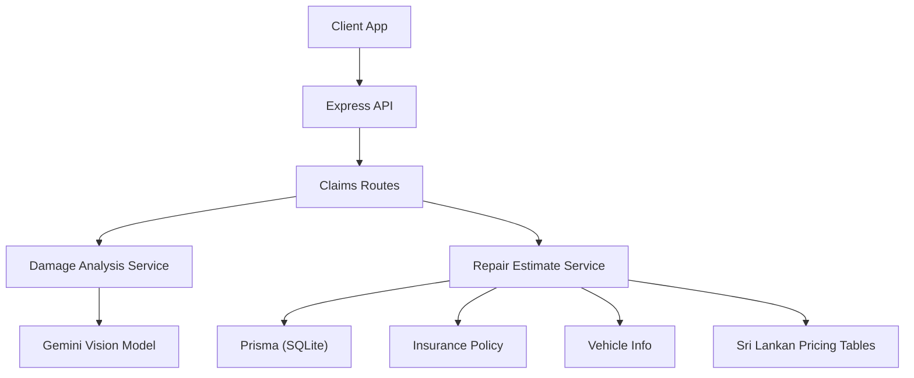
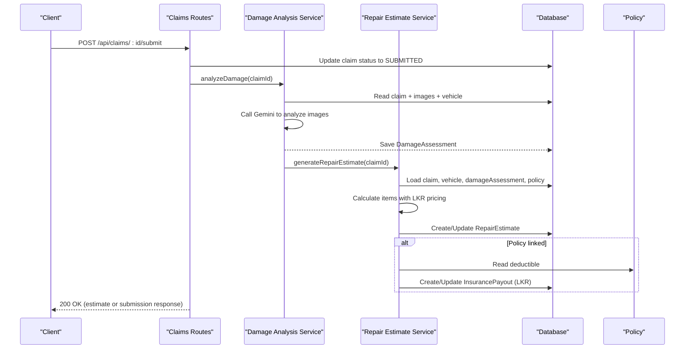
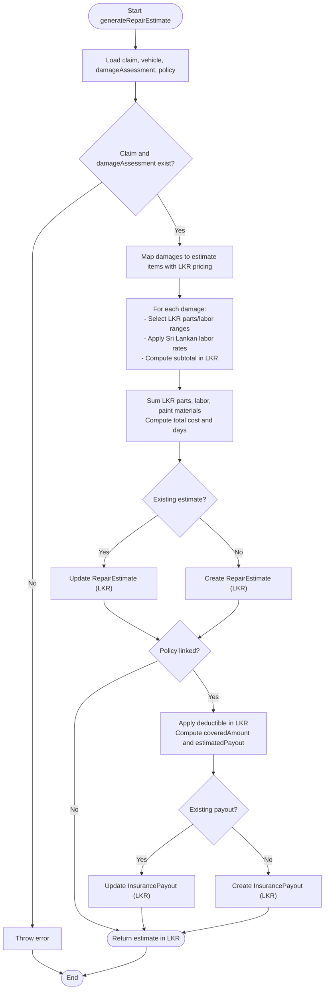
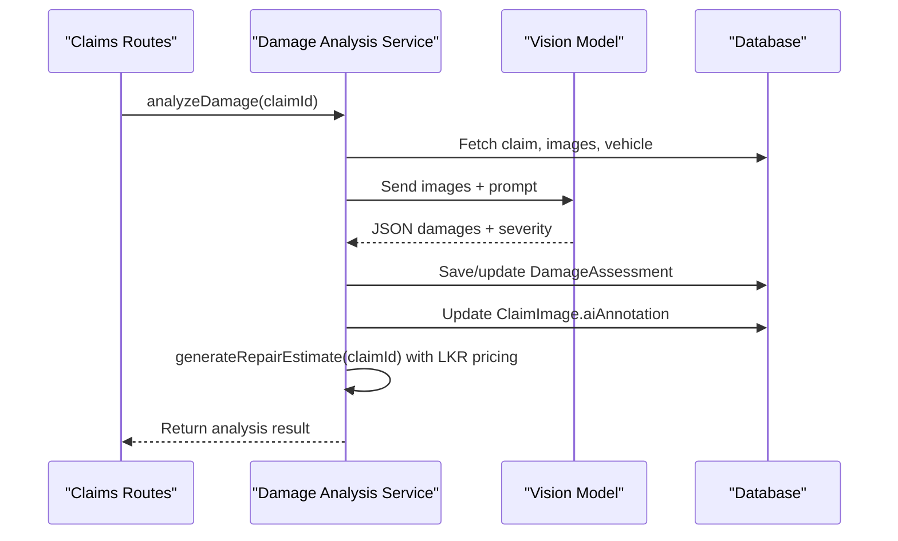
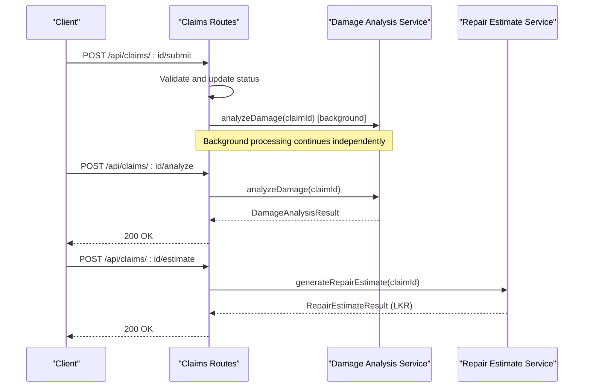
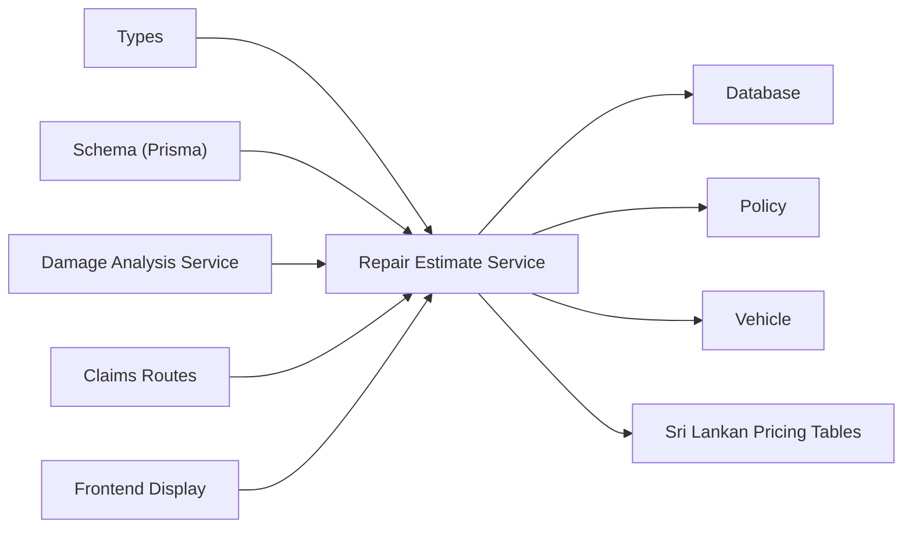

# Repair Estimate Service

<cite>
**Referenced Files in This Document**
- [repairEstimateService.ts](file://backend/src/services/repairEstimateService.ts)
- [damageAnalysisService.ts](file://backend/src/services/damageAnalysisService.ts)
- [vehicleDetectionService.ts](file://backend/src/services/vehicleDetectionService.ts)
- [claims.ts](file://backend/src/routes/claims.ts)
- [index.ts](file://backend/src/index.ts)
- [schema.prisma](file://backend/prisma/schema.prisma)
- [types/index.ts](file://backend/src/types/index.ts)
- [claimAssistantService.ts](file://backend/src/services/claimAssistantService.ts)
- [ClaimDetailPage.tsx](file://frontend/src/pages/ClaimDetailPage.tsx)
</cite>

## Update Summary
**Changes Made**
- Updated pricing tables to reflect Sri Lankan Rupee (LKR) localization
- Added detailed breakdown of crack repairs pricing (15,000-90,000 LKR)
- Updated windshield replacement costs (60,000-240,000 LKR for glass damage)
- Revised structural damage pricing (100,000-500,000 LKR base range)
- Updated labor rates for Sri Lankan market (MINOR: 2,500 LKR/hr, MODERATE: 3,500 LKR/hr, SEVERE: 5,000 LKR/hr)
- Enhanced paint material costs for Sri Lankan market (MINOR: 8,000 LKR, MODERATE: 25,000 LKR, SEVERE: 60,000 LKR)
- Updated frontend currency display to show Rs. format throughout

## Table of Contents
1. [Introduction](#introduction)
2. [Project Structure](#project-structure)
3. [Core Components](#core-components)
4. [Architecture Overview](#architecture-overview)
5. [Detailed Component Analysis](#detailed-component-analysis)
6. [Dependency Analysis](#dependency-analysis)
7. [Performance Considerations](#performance-considerations)
8. [Troubleshooting Guide](#troubleshooting-guide)
9. [Conclusion](#conclusion)
10. [Appendices](#appendices)

## Introduction
This document explains the Repair Estimate Service that automatically generates repair cost estimates from damage analysis results, vehicle information, and pricing data. The service is fully localized for the Sri Lankan market with pricing in Sri Lankan Rupees (LKR/Rs.). It covers how the service calculates costs using market-specific pricing tables, identifies parts, computes labor rates based on Sri Lankan garage rates, validates estimates, and integrates with damage assessment, vehicle lookup, and policy data to produce an insurance payout estimate. It also provides guidance on configuring pricing models, adding new parts catalogs, and customizing estimation rules for different markets.

## Project Structure
The Repair Estimate Service is implemented as a backend service module integrated into an Express API with full Sri Lankan market localization. The key files involved are:
- Service layer: repair estimate generation with LKR pricing calculations
- Damage analysis service: AI-based damage detection that triggers estimate generation
- Vehicle detection service: AI-based vehicle identification used during claim intake
- Routes: HTTP endpoints to trigger analysis and estimate generation
- Data model: Prisma schema defining claims, assessments, estimates, payouts
- Types: Shared TypeScript interfaces for inputs and outputs
- Frontend: Currency display formatting for Sri Lankan Rupees

**Diagram sources**
- [claims.ts:270-314](file://backend/src/routes/claims.ts#L270-L314)
- [damageAnalysisService.ts:50-152](file://backend/src/services/damageAnalysisService.ts#L50-L152)
- [repairEstimateService.ts:104-199](file://backend/src/services/repairEstimateService.ts#L104-L199)
- [index.ts:40-45](file://backend/src/index.ts#L40-L45)

**Section sources**
- [index.ts:1-65](file://backend/src/index.ts#L1-L65)
- [claims.ts:270-314](file://backend/src/routes/claims.ts#L270-L314)

## Core Components
- **Repair Estimate Service**: Computes itemized repair costs in Sri Lankan Rupees (LKR) based on damage types, severity, parts, labor hours, paint materials, and policy deductibles; persists estimates and optional payout calculations with market-specific pricing.
- **Damage Analysis Service**: Uses AI to analyze images, returns structured damages, and auto-triggers estimate generation with Sri Lankan market context.
- **Vehicle Detection Service**: Identifies vehicle details from images to enrich context for damage analysis.
- **Routes**: Expose endpoints to submit claims, run damage analysis, and generate repair estimates.
- **Data Model**: Defines relationships between claims, vehicles, policies, damage assessments, repair estimates, and payouts.

Key responsibilities:
- **Cost calculation algorithms** using predefined Sri Lankan market ranges per damage type and severity
- **Parts identification logic** via affected parts list and damage type mapping with LKR pricing
- **Labor rate calculations** by severity level based on Sri Lankan garage rates
- **Estimate validation** through required prerequisites (claim exists, damage assessment present)
- **Integration with policy deductible** to compute covered amount and estimated payout in LKR

**Updated** All pricing now reflects current Sri Lankan market rates for vehicle repairs, including specialized pricing for cracks, windshields, and structural damage.

**Section sources**
- [repairEstimateService.ts:4-102](file://backend/src/services/repairEstimateService.ts#L4-L102)
- [damageAnalysisService.ts:7-48](file://backend/src/services/damageAnalysisService.ts#L7-L48)
- [vehicleDetectionService.ts:15-44](file://backend/src/services/vehicleDetectionService.ts#L15-L44)
- [claims.ts:270-314](file://backend/src/routes/claims.ts#L270-L314)
- [schema.prisma:71-160](file://backend/prisma/schema.prisma#L71-L160)
- [types/index.ts:12-43](file://backend/src/types/index.ts#L12-L43)

## Architecture Overview
The end-to-end workflow starts when a user submits a claim with images. The system runs AI damage analysis, which parses images to identify damage types, severity, locations, and affected parts. Once the damage assessment is saved, the system automatically generates a repair estimate using Sri Lankan market pricing. If a policy is linked, it computes deductible-adjusted coverage in LKR and stores the estimated payout.

**Diagram sources**
- [claims.ts:152-193](file://backend/src/routes/claims.ts#L152-L193)
- [damageAnalysisService.ts:50-152](file://backend/src/services/damageAnalysisService.ts#L50-L152)
- [repairEstimateService.ts:104-199](file://backend/src/services/repairEstimateService.ts#L104-L199)
- [schema.prisma:71-160](file://backend/prisma/schema.prisma#L71-L160)

## Detailed Component Analysis

### Repair Estimate Service
Responsibilities:
- Compute itemized repair costs in Sri Lankan Rupees (LKR) per damage type and severity
- Aggregate totals for parts, labor, paint materials, and overall cost in LKR
- Estimate repair duration in days based on total labor hours
- Persist estimate and optionally calculate insurance payout in LKR

**Updated** Cost calculation algorithm with Sri Lankan market pricing:
- For each damage item, select a configuration by damage type with LKR ranges
- Resolve parts cost range by severity or specific part name with Sri Lankan market rates; fallback to default
- Resolve labor hours range by severity or specific part name; fallback to default
- Apply Sri Lankan labor rates by severity (MINOR: 2,500 LKR/hr, MODERATE: 3,500 LKR/hr, SEVERE: 5,000 LKR/hr)
- Add Sri Lankan paint materials cost by severity (MINOR: 8,000 LKR, MODERATE: 25,000 LKR, SEVERE: 60,000 LKR)
- Compute subtotal per item as parts + labor + paint materials in LKR
- Sum across items for totals; derive estimated days from total labor hours divided by standard daily hours

**Updated** Parts identification logic with Sri Lankan market pricing:
- Uses damage.type and damage.affectedParts to determine part names and costs
- Supports specific part categories with localized pricing:
  - **Crack repairs**: 15,000-90,000 LKR (default), 60,000-240,000 LKR (glass), 90,000-360,000 LKR (SEVERE)
  - **Windshield replacements**: 35,000-180,000 LKR (glass_damage.windshield)
  - **Structural damage**: 100,000-500,000 LKR (default), 250,000-1,200,000 LKR (SEVERE)
  - **Broken lights**: 8,000-45,000 LKR (default), 15,000-85,000 LKR (headlight), 10,000-55,000 LKR (taillight)

**Updated** Labor rate calculations with Sri Lankan market rates:
- MINOR: 2,500 LKR/hr applied to labor hours to compute labor cost
- MODERATE: 3,500 LKR/hr applied to labor hours to compute labor cost  
- SEVERE: 5,000 LKR/hr applied to labor hours to compute labor cost

**Updated** Paint material costs for Sri Lankan market:
- MINOR: 8,000 LKR for minor cosmetic repairs
- MODERATE: 25,000 LKR for moderate paint work
- SEVERE: 60,000 LKR for extensive paint restoration

Estimate validation:
- Requires claim and damage assessment to exist before generating estimate
- Ensures at least one day is estimated even if labor hours are low

Integration points:
- Reads vehicle and policy data to enrich context and compute payout in LKR
- Persists estimate and updates or creates insurance payout with Sri Lankan currency formatting

**Diagram sources**
- [repairEstimateService.ts:60-102](file://backend/src/services/repairEstimateService.ts#L60-L102)
- [repairEstimateService.ts:104-199](file://backend/src/services/repairEstimateService.ts#L104-L199)

**Section sources**
- [repairEstimateService.ts:4-102](file://backend/src/services/repairEstimateService.ts#L4-L102)
- [repairEstimateService.ts:104-199](file://backend/src/services/repairEstimateService.ts#L104-L199)
- [types/index.ts:26-43](file://backend/src/types/index.ts#L26-L43)

### Damage Analysis Service
Responsibilities:
- Analyze uploaded images using AI to detect damage types, severity, locations, and affected parts
- Save structured damage assessment and annotate images
- Auto-trigger repair estimate generation after successful assessment

Workflow highlights:
- Loads claim images and vehicle context
- Sends images to vision model with a strict JSON prompt format
- Parses JSON response; falls back to safe defaults if parsing fails
- Saves or updates DamageAssessment and annotates images
- Calls repair estimate generator asynchronously with Sri Lankan market context

**Diagram sources**
- [damageAnalysisService.ts:50-152](file://backend/src/services/damageAnalysisService.ts#L50-L152)
- [claims.ts:270-288](file://backend/src/routes/claims.ts#L270-L288)

**Section sources**
- [damageAnalysisService.ts:7-48](file://backend/src/services/damageAnalysisService.ts#L7-L48)
- [damageAnalysisService.ts:50-152](file://backend/src/services/damageAnalysisService.ts#L50-L152)

### Vehicle Detection Service
Responsibilities:
- Identify vehicle make, model, year, color, license plate, and confidence from images
- Provide additional observations to support downstream processes

Usage context:
- Used during claim intake to auto-populate vehicle details
- Enhances damage analysis prompts with vehicle context

**Section sources**
- [vehicleDetectionService.ts:15-44](file://backend/src/services/vehicleDetectionService.ts#L15-L44)
- [vehicleDetectionService.ts:46-95](file://backend/src/services/vehicleDetectionService.ts#L46-L95)

### API Integration Points
Endpoints relevant to repair estimates:
- Submit claim: Triggers background damage analysis and sets status to submitted
- Analyze damage: Runs AI damage analysis synchronously and returns results
- Generate estimate: Requires prior damage analysis; returns itemized estimate and totals in LKR

**Diagram sources**
- [claims.ts:152-193](file://backend/src/routes/claims.ts#L152-L193)
- [claims.ts:270-314](file://backend/src/routes/claims.ts#L270-L314)

**Section sources**
- [claims.ts:152-193](file://backend/src/routes/claims.ts#L152-L193)
- [claims.ts:270-314](file://backend/src/routes/claims.ts#L270-L314)

## Dependency Analysis
The Repair Estimate Service depends on:
- Database access via Prisma for reading claims, vehicles, policies, and saving estimates/payouts in LKR
- Damage Assessment data structure for driving cost calculations with Sri Lankan pricing
- Policy deductible for payout computation in LKR
- Types definitions for consistent interfaces
- Frontend components for proper LKR currency display

Coupling and cohesion:
- High cohesion within repair estimate calculations (cost tables with LKR pricing, helpers, aggregation)
- Loose coupling to damage analysis via shared types and database records
- Clear separation of concerns: routes orchestrate services; services handle business logic with market-specific pricing

Potential circular dependencies:
- None detected; damage analysis calls repair estimate but not vice versa

External integrations:
- Vision model for image analysis (used by damage and vehicle services)
- SQLite database via Prisma
- Frontend currency formatting for Sri Lankan Rupees

**Diagram sources**
- [repairEstimateService.ts:1-3](file://backend/src/services/repairEstimateService.ts#L1-L3)
- [schema.prisma:71-160](file://backend/prisma/schema.prisma#L71-L160)
- [types/index.ts:12-43](file://backend/src/types/index.ts#L12-L43)

**Section sources**
- [repairEstimateService.ts:1-3](file://backend/src/services/repairEstimateService.ts#L1-L3)
- [schema.prisma:71-160](file://backend/prisma/schema.prisma#L71-L160)
- [types/index.ts:12-43](file://backend/src/types/index.ts#L12-L43)

## Performance Considerations
- Image processing and AI calls can be slow; running damage analysis in the background improves responsiveness
- Aggregation of costs and totals is linear in number of damage items; efficient for typical claim sizes
- Estimated days calculation uses integer division and minimum floor to avoid zero-day estimates
- Database operations are minimal and targeted; consider indexing frequently queried fields if scaling up
- Sri Lankan market pricing calculations are optimized for fast midpoint calculations and range lookups

## Troubleshooting Guide
Common issues and resolutions:
- Missing claim or damage assessment: Ensure claim exists and damage analysis has been completed before generating estimate
- No images provided: Damage analysis requires at least one image; upload images before submitting or analyzing
- AI parsing failures: If the vision model returns non-JSON or malformed content, the system falls back to safe defaults; re-run analysis or provide clearer images
- Policy not linked: Without a policy, no payout will be calculated; link a policy to enable deductible-based coverage computation in LKR
- File path resolution errors: Ensure uploads directory is correctly configured and accessible
- Currency display issues: Verify frontend is properly formatting amounts as Rs. with proper locale settings

Error handling patterns:
- Explicit checks for existence of required entities before proceeding
- Graceful fallbacks for AI parsing errors
- Consistent error responses via route handlers
- Proper LKR currency formatting throughout the application

**Section sources**
- [damageAnalysisService.ts:56-62](file://backend/src/services/damageAnalysisService.ts#L56-L62)
- [damageAnalysisService.ts:85-103](file://backend/src/services/damageAnalysisService.ts#L85-L103)
- [repairEstimateService.ts:114-116](file://backend/src/services/repairEstimateService.ts#L114-L116)
- [claims.ts:298-309](file://backend/src/routes/claims.ts#L298-L309)

## Conclusion
The Repair Estimate Service automates cost estimation by combining AI-driven damage analysis with structured Sri Lankan market pricing rules and policy data. It produces transparent, itemized estimates in Sri Lankan Rupees (LKR), supports insurance payout calculations, and integrates cleanly with the broader claims workflow. With configurable cost tables and severity-based rates tailored to the Sri Lankan market, it accurately reflects local vehicle repair costs including specialized pricing for cracks, windshields, and structural damage.

## Appendices

### Sri Lankan Market Pricing Breakdown
Each estimate item includes Sri Lankan market pricing:
- Damage type and part name
- Part cost derived from Sri Lankan market ranges in LKR
- Labor hours and Sri Lankan labor rates based on severity
- Paint materials cost based on Sri Lankan market rates
- Subtotal per item in LKR

**Updated** Sri Lankan market pricing ranges:
- **Crack repairs**: 15,000-90,000 LKR (default), 60,000-240,000 LKR (glass), 90,000-360,000 LKR (SEVERE)
- **Windshield replacements**: 35,000-180,000 LKR (glass_damage.windshield)
- **Structural damage**: 100,000-500,000 LKR (default), 250,000-1,200,000 LKR (SEVERE)
- **Broken lights**: 8,000-45,000 LKR (default), 15,000-85,000 LKR (headlight), 10,000-55,000 LKR (taillight)

**Updated** Sri Lankan labor rates:
- MINOR: 2,500 LKR/hr
- MODERATE: 3,500 LKR/hr  
- SEVERE: 5,000 LKR/hr

**Updated** Sri Lankan paint material costs:
- MINOR: 8,000 LKR
- MODERATE: 25,000 LKR
- SEVERE: 60,000 LKR

Aggregated totals include:
- Total parts cost in LKR
- Total labor cost in LKR (labor hours × Sri Lankan labor rate + paint materials)
- Overall total cost in LKR
- Estimated repair days based on total labor hours

**Section sources**
- [repairEstimateService.ts:4-59](file://backend/src/services/repairEstimateService.ts#L4-L59)
- [repairEstimateService.ts:120-127](file://backend/src/services/repairEstimateService.ts#L120-L127)

### Adjustment Factors for Different Vehicle Types
Current implementation applies Sri Lankan market adjustments uniformly. To customize for vehicle types:
- Extend cost tables with vehicle class keys (e.g., compact, SUV, luxury) using LKR pricing
- Adjust labor hours and parts ranges per vehicle class with Sri Lankan market rates
- Integrate vehicle detection results to select appropriate adjustment factors

### Configure Pricing Models and Add New Parts Catalogs
To add new parts or adjust Sri Lankan market pricing:
- Update cost tables with new damage types, part categories, and Sri Lankan market ranges in LKR
- Define Sri Lankan labor rates and paint materials for new severities or market regions
- Ensure damage analysis prompts return compatible damage types and affected parts lists
- Test pricing against current Sri Lankan garage and body shop rates

**Section sources**
- [repairEstimateService.ts:4-59](file://backend/src/services/repairEstimateService.ts#L4-L59)

### Customize Estimation Rules for Different Markets
Approach for multi-market support:
- Introduce market-specific multipliers or base rates for different currencies
- Store market configuration in environment variables or database
- Apply market rules during cost calculation and payout computation
- Implement currency conversion and formatting for international expansion

### Estimate Accuracy Metrics
Recommended metrics to track:
- Mean absolute percentage error (MAPE) comparing estimated vs actual repair costs in LKR
- Coverage accuracy: proportion of claims where estimated payout matches final payout in LKR
- Time-to-estimate: latency from submission to estimate availability
- AI parsing success rate: percentage of analyses returning valid JSON
- Sri Lankan market accuracy: comparison against actual garage quotes in Colombo and other cities

### Frontend Currency Display
The frontend displays all monetary values in Sri Lankan Rupees format:
- Currency symbol: Rs. 
- Number formatting: thousands separators (e.g., Rs. 150,000)
- Consistent display across all claim detail pages and reports

**Section sources**
- [ClaimDetailPage.tsx:229-261](file://frontend/src/pages/ClaimDetailPage.tsx#L229-L261)
- [claimAssistantService.ts:52-70](file://backend/src/services/claimAssistantService.ts#L52-L70)