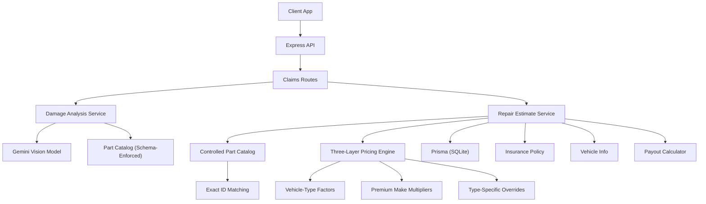
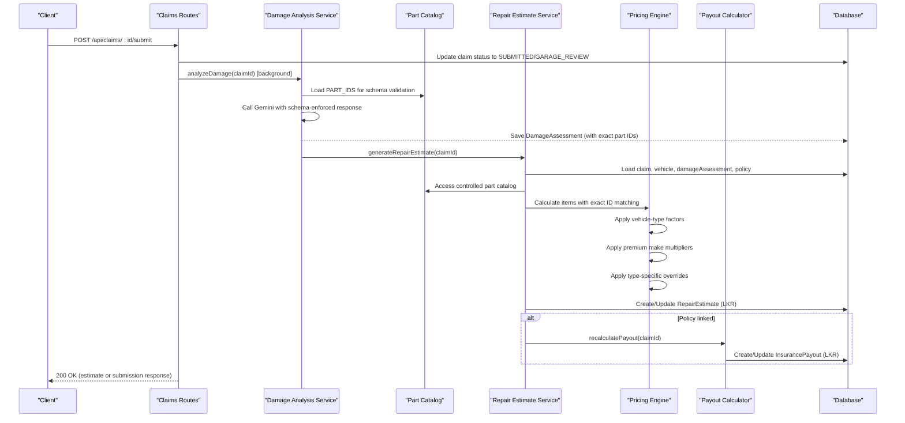

# Repair Estimate Service

<cite>
**Referenced Files in This Document**
- [repairEstimateService.ts](file://backend/src/services/repairEstimateService.ts)
- [partCatalog.ts](file://backend/src/services/partCatalog.ts)
- [damageAnalysisService.ts](file://backend/src/services/damageAnalysisService.ts)
- [vehicleDetectionService.ts](file://backend/src/services/vehicleDetectionService.ts)
- [claims.ts](file://backend/src/routes/claims.ts)
- [payoutService.ts](file://backend/src/services/payoutService.ts)
- [index.ts](file://backend/src/index.ts)
- [schema.prisma](file://backend/prisma/schema.prisma)
- [types/index.ts](file://backend/src/types/index.ts)
- [claimAssistantService.ts](file://backend/src/services/claimAssistantService.ts)
- [ClaimDetailPage.tsx](file://frontend/src/pages/ClaimDetailPage.tsx)
</cite>

## Update Summary
**Changes Made**
- **Major Overhaul**: Implemented sophisticated three-layer pricing model with vehicle-type factors, premium make multipliers, and type-specific part overrides
- **Enhanced Pricing Architecture**: Base economy car pricing scaled by vehicle class (motorcycles through buses) with specialized overrides for unique vehicle types
- **Sri Lankan Market Calibration**: All pricing calibrated to current Sri Lankan market rates with comprehensive parts catalogs
- **Advanced Parts Identification**: Sophisticated keyword matching system with priority-based resolution for overlapping damage types
- **Labor Hour Calculations**: Severity-based labor hour ranges with vehicle-class scaling and minimum hour enforcement
- **Paint Material Integration**: Body-panel specific paint costs integrated into labor calculations for cosmetic repairs
- **Controlled Part Catalog Integration**: New centralized part catalog with exact ID matching replacing fuzzy keyword matching
- **Standardized Part Identification**: Schema-enforced part IDs ensure consistent pricing accuracy across all damage assessments

## Table of Contents
1. [Introduction](#introduction)
2. [Project Structure](#project-structure)
3. [Core Components](#core-components)
4. [Architecture Overview](#architecture-overview)
5. [Detailed Component Analysis](#detailed-component-analysis)
6. [Three-Layer Pricing Model](#three-layer-pricing-model)
7. [Controlled Part Catalog System](#controlled-part-catalog-system)
8. [Parts Identification System](#parts-identification-system)
9. [Labor and Paint Calculations](#labor-and-paint-calculations)
10. [Integration Points](#integration-points)
11. [Performance Considerations](#performance-considerations)
12. [Troubleshooting Guide](#troubleshooting-guide)
13. [Conclusion](#conclusion)
14. [Appendices](#appendices)

## Introduction
The Repair Estimate Service is a sophisticated cost estimation engine that automatically generates detailed repair cost estimates from AI-driven damage analysis results, vehicle specifications, and comprehensive Sri Lankan market pricing data. The service implements a three-layer pricing architecture that scales base economy car prices through vehicle-type multipliers, applies premium brand adjustments, and handles type-specific part overrides for unique vehicle categories like three-wheelers, lorries, and motorcycles.

The system processes damage assessments to identify affected parts using a controlled part catalog with exact ID matching, calculates labor hours based on damage severity, applies appropriate Sri Lankan labor rates, and includes paint material costs for body-panel damage types. It integrates seamlessly with the claims workflow, automatically generating estimates after damage analysis and computing insurance payouts with policy deductibles and coverage percentages.

**Updated** The system now features a centralized part catalog that provides schema-enforced part identification, eliminating fuzzy keyword matching in favor of precise part ID matching for improved pricing accuracy and consistency.

## Project Structure
The Repair Estimate Service is implemented as a sophisticated backend service module within an Express API architecture, featuring advanced pricing algorithms and Sri Lankan market localization. Key components include:

- **Pricing Engine**: Three-layer calculation system with vehicle-type factors, premium make multipliers, and type-specific overrides
- **Controlled Part Catalog**: Centralized parts database with exact ID matching and vehicle-type specific pricing
- **Damage Analysis Integration**: AI-powered damage detection with schema-enforced part identification
- **Vehicle Detection**: AI-based vehicle identification providing context for pricing calculations
- **API Routes**: HTTP endpoints for claim submission, damage analysis, and estimate generation
- **Data Models**: Prisma schema defining relationships between claims, vehicles, policies, assessments, estimates, and payouts
- **Type Definitions**: Shared TypeScript interfaces ensuring consistent data structures across services
- **Frontend Integration**: Currency display formatting for Sri Lankan Rupees throughout the user interface

**Diagram sources**
- [claims.ts:243-286](file://backend/src/routes/claims.ts#L243-L286)
- [damageAnalysisService.ts:118-208](file://backend/src/services/damageAnalysisService.ts#L118-L208)
- [repairEstimateService.ts:201-275](file://backend/src/services/repairEstimateService.ts#L201-L275)
- [partCatalog.ts:1-57](file://backend/src/services/partCatalog.ts#L1-L57)
- [payoutService.ts:11-67](file://backend/src/services/payoutService.ts#L11-L67)

**Section sources**
- [claims.ts:243-286](file://backend/src/routes/claims.ts#L243-L286)
- [damageAnalysisService.ts:118-208](file://backend/src/services/damageAnalysisService.ts#L118-L208)
- [repairEstimateService.ts:201-275](file://backend/src/services/repairEstimateService.ts#L201-L275)

## Core Components
- **Three-Layer Pricing Engine**: Computes itemized repair costs using base economy car pricing scaled by vehicle-type factors, premium make multipliers, and type-specific part overrides; all values in Sri Lankan Rupees (LKR)
- **Controlled Part Catalog**: Centralized parts database with schema-enforced IDs providing exact matching instead of fuzzy keyword search
- **Schema-Enforced Damage Assessment**: AI damage analysis constrained to predefined part IDs ensuring consistent data structure
- **Severity-Based Labor Calculation**: Calculates labor hours from predefined ranges based on damage severity, applies vehicle-class scaling, and enforces minimum labor hours
- **Body-Panel Paint Integration**: Adds paint material costs specifically for cosmetic damage types (dents, scratches, bumper damage, panel deformation, cracks)
- **Automated Estimate Generation**: Triggers immediately after successful damage analysis, persisting detailed itemized estimates with Sri Lankan market pricing
- **Policy Integration**: Automatically recalculates insurance payouts with deductible application, coverage percentage, and vehicle valuation caps

**Updated** The parts identification system now uses exact ID matching against a controlled catalog, significantly improving pricing accuracy and eliminating ambiguity from fuzzy keyword matching.

**Section sources**
- [repairEstimateService.ts:12-69](file://backend/src/services/repairEstimateService.ts#L12-L69)
- [repairEstimateService.ts:123-199](file://backend/src/services/repairEstimateService.ts#L123-L199)
- [partCatalog.ts:1-57](file://backend/src/services/partCatalog.ts#L1-L57)
- [damageAnalysisService.ts:118-208](file://backend/src/services/damageAnalysisService.ts#L118-L208)
- [payoutService.ts:11-67](file://backend/src/services/payoutService.ts#L11-L67)

## Architecture Overview
The end-to-end workflow begins when a user submits a claim with images. The system performs AI damage analysis with schema-enforced part identification to generate structured damage assessments. Upon successful assessment completion, the system automatically generates a comprehensive repair estimate using the sophisticated three-layer pricing model with controlled part catalog integration. If a policy is linked, it computes deductible-adjusted coverage in Sri Lankan Rupees and stores the estimated payout.

**Diagram sources**
- [claims.ts:243-286](file://backend/src/routes/claims.ts#L243-L286)
- [damageAnalysisService.ts:118-208](file://backend/src/services/damageAnalysisService.ts#L118-L208)
- [repairEstimateService.ts:201-275](file://backend/src/services/repairEstimateService.ts#L201-L275)
- [partCatalog.ts:1-57](file://backend/src/services/partCatalog.ts#L1-L57)
- [payoutService.ts:11-67](file://backend/src/services/payoutService.ts#L11-L67)

## Detailed Component Analysis

### Three-Layer Pricing Engine
The core pricing engine implements a sophisticated three-layer calculation system designed for the Sri Lankan market:

**Layer 1 - Base Economy Car Pricing**: Comprehensive parts catalog calibrated for typical economy cars with realistic Sri Lankan market ranges for headlights, windshields, bumpers, doors, panels, and mechanical components.

**Layer 2 - Vehicle-Type Scaling**: Applies class-specific multipliers to scale base prices across different vehicle categories:
- Motorcycles: 45% parts, 60% labor, 40% paint
- Three-wheelers: 55% parts, 70% labor, 50% paint  
- Cars: 100% baseline
- Vans: 115% parts, 110% labor, 120% paint
- SUVs/Pickups: 130% parts, 115% labor, 130% paint
- Lorries/Trucks: 180% parts, 150% labor, 160% paint
- Buses: 200% parts, 160% labor, 180% paint
- Tractors: 150% parts, 130% labor, 80% paint

**Layer 3 - Type-Specific Overrides**: Specialized pricing for unique vehicle components where standard multipliers would be inaccurate:
- Three-wheeler canopies: 25,000-70,000 LKR
- Motorcycle fairings: 12,000-55,000 LKR
- Lorry cargo bodies: 150,000-600,000 LKR
- Bus body panels: 80,000-350,000 L KR

**Updated** Premium makes receive a 1.6x multiplier on parts costs, reflecting higher local market prices for luxury brands including BMW, Mercedes, Audi, Land Rover, Range Rover, Jaguar, Porsche, Volvo, Lexus, Tesla, Jeep, and Mini.

**Section sources**
- [repairEstimateService.ts:12-69](file://backend/src/services/repairEstimateService.ts#L12-L69)
- [repairEstimateService.ts:159-199](file://backend/src/services/repairEstimateService.ts#L159-L199)

### Controlled Part Catalog System
The new controlled part catalog system provides a centralized source of truth for all parts pricing and identification:

**Centralized Management**: A single `PART_CATALOG` object serves as the authoritative source for part definitions, pricing ranges, and vehicle-type specific overrides.

**Schema Enforcement**: The damage analysis service uses `PART_IDS` extracted from the catalog to constrain AI responses, ensuring only valid part IDs are returned.

**Exact ID Matching**: The repair estimate service performs exact ID matching against the catalog, eliminating ambiguity from fuzzy keyword searches.

**Legacy Support**: Fallback to keyword matching for legacy damage records stored before the catalog implementation.

**Human-Readable Labels**: Each part has a standardized label for display purposes, ensuring consistent presentation across the application.

**Section sources**
- [partCatalog.ts:1-57](file://backend/src/services/partCatalog.ts#L1-L57)
- [damageAnalysisService.ts:5-31](file://backend/src/services/damageAnalysisService.ts#L5-L31)
- [repairEstimateService.ts:88-120](file://backend/src/services/repairEstimateService.ts#L88-L120)

### Parts Identification System
The enhanced parts identification system combines exact ID matching with intelligent fallback mechanisms:

**Primary Matching Strategy**: Exact ID matching against the controlled part catalog using normalized part identifiers (lowercase, underscores replacing spaces/hyphens).

**Fallback Mechanism**: When no exact matches are found, the system falls back to keyword matching against AI-provided location descriptions and damage types.

**Priority Resolution**: When multiple keywords match, the system selects the most specific match by sorting candidates by identifier length and eliminating overlaps.

**Vehicle-Type Awareness**: Part matching considers vehicle type to apply appropriate pricing multipliers and type-specific overrides.

**Overlap Handling**: Intelligent overlap resolution ensures that more specific part identifiers take precedence over generic ones (e.g., "front_bumper" beats "bumper").

**Section sources**
- [repairEstimateService.ts:88-120](file://backend/src/services/repairEstimateService.ts#L88-L120)
- [partCatalog.ts:19-49](file://backend/src/services/partCatalog.ts#L19-L49)

### Labor and Paint Calculations
Labor calculations are severity-based with vehicle-class scaling and minimum hour enforcement:

**Labor Hours by Damage Type**: Each damage category has predefined hour ranges that increase with severity:
- Dents: 1.5-4 hours (MINOR), 4-8 hours (SEVERE)
- Scratches: 0.5-2 hours (MINOR), 2-4 hours (MODERATE), 4-8 hours (SEVERE)
- Cracks: 1-3 hours (MINOR), 3-6 hours (SEVERE)
- Structural damage: 8-20 hours (MINOR), 16-36 hours (SEVERE)

**Labor Rates**: Sri Lankan market rates applied by severity level:
- MINOR: 2,500 LKR/hour
- MODERATE: 3,500 LKR/hour  
- SEVERE: 5,000 LKR/hour

**Paint Materials**: Applied only to body-panel damage types (dents, scratches, bumper damage, panel deformation, cracks) with severity-based costs:
- MINOR: 9,000 LKR
- MODERATE: 22,000 LKR
- SEVERE: 52,000 LKR

**Updated** Labor hours are rounded to the nearest 0.5 hours with a minimum of 0.5 hours per item, ensuring realistic minimum labor charges even for minor repairs.

**Section sources**
- [repairEstimateService.ts:85-103](file://backend/src/services/repairEstimateService.ts#L85-L103)
- [repairEstimateService.ts:170-184](file://backend/src/services/repairEstimateService.ts#L170-L184)

### Automated Estimate Generation
The estimate generation process is fully automated and triggered immediately after successful damage analysis:

**Trigger Mechanism**: The damage analysis service automatically calls the repair estimate generator upon successful completion of AI damage assessment, ensuring estimates are available without manual intervention.

**Validation Requirements**: Estimates require both a valid claim and completed damage assessment before generation proceeds.

**Persistence Strategy**: The system creates new estimates or updates existing ones based on whether an estimate already exists for the claim.

**Payout Integration**: After estimate creation/update, the system automatically recalculates insurance payouts, applying policy deductibles, coverage percentages, and vehicle valuation caps.

**Updated** The generation process now includes comprehensive error handling and logging, with graceful fallbacks if estimate generation fails after damage analysis.

**Section sources**
- [damageAnalysisService.ts:198-205](file://backend/src/services/damageAnalysisService.ts#L198-L205)
- [repairEstimateService.ts:201-275](file://backend/src/services/repairEstimateService.ts#L201-L275)

## Three-Layer Pricing Model

### Layer 1: Base Economy Car Pricing
The foundation of the pricing system is a comprehensive parts catalog calibrated for typical economy cars in the Sri Lankan market. This base catalog includes:

**Exterior Components**: Headlights (22,000-95,000 LKR), taillights (15,000-60,000 LKR), fog lights (8,000-35,000 LKR), windshields (35,000-185,000 LKR), rear glass (25,000-120,000 LKR), side mirrors (9,000-45,000 LKR)

**Body Panels**: Front bumpers (28,000-135,000 LKR), rear bumpers (26,000-125,000 LKR), hoods/bonnets (35,000-150,000 LKR), doors (38,000-165,000 LKR), fenders/wing panels (24,000-110,000 LKR), quarter panels (40,000-175,000 LKR), roofs/canopies (45,000-200,000 LKR), trunk lids/boot lids/tailgates (36,000-155,000 LKR)

**Mechanical Components**: Radiators (28,000-95,000 LKR), condensers/A/C systems (25,000-85,000 LKR), wheels/tyres/rim alloys (18,000-95,000 LKR), exhaust systems/mufflers/silencers (12,000-65,000 LKR), seats/interior components (15,000-90,000 LKR)

### Layer 2: Vehicle-Type Scaling Factors
Each vehicle type receives specific multipliers for parts, labor, and paint materials:

| Vehicle Type | Parts Factor | Labor Factor | Paint Factor |
|--------------|--------------|--------------|--------------|
| Motorcycle | 0.45 | 0.60 | 0.40 |
| Three-Wheeler | 0.55 | 0.70 | 0.50 |
| Car | 1.00 | 1.00 | 1.00 |
| Van | 1.15 | 1.10 | 1.20 |
| SUV/Pickup | 1.30 | 1.15 | 1.30 |
| Lorry/Truck | 1.80 | 1.50 | 1.60 |
| Bus | 2.00 | 1.60 | 1.80 |
| Tractor | 1.50 | 1.30 | 0.80 |
| Other | 1.00 | 1.00 | 1.00 |

### Layer 3: Type-Specific Part Overrides
Specialized pricing replaces scaled base prices for unique vehicle components where standard multipliers would be inaccurate:

- **Three-Wheeler Canopy**: 25,000-70,000 LKR (replaces scaled roof pricing)
- **Motorcycle Fairing**: 12,000-55,000 LKR (specific motorcycle component)
- **Motorcycle Handlebar**: 6,000-28,000 LKR (specific motorcycle control component)
- **Lorry Cargo Body**: 150,000-600,000 LKR (heavy-duty commercial vehicle component)
- **Lorry Cab**: 120,000-450,000 LKR (commercial vehicle operator compartment)
- **Bus Body Panel**: 80,000-350,000 LKR (large vehicle structural component)
- **Trailer**: 80,000-400,000 LKR (agricultural equipment attachment)

**Section sources**
- [repairEstimateService.ts:12-69](file://backend/src/services/repairEstimateService.ts#L12-L69)
- [repairEstimateService.ts:34-69](file://backend/src/services/repairEstimateService.ts#L34-L69)

## Controlled Part Catalog System

### Centralized Parts Database
The controlled part catalog serves as the single source of truth for all parts-related operations:

**Schema Definition**: Each part family includes a human-readable label, searchable keywords for legacy support, base pricing range, and optional vehicle-type specific overrides.

**Canonical Part IDs**: Standardized identifiers ensure consistency across the entire system, from AI damage analysis to final estimate generation.

**Vehicle-Type Specific Pricing**: Parts can have different price ranges for different vehicle types, enabling accurate pricing for specialized components.

**Keyword Mapping**: Legacy free-text part names are mapped to canonical IDs through keyword matching for backward compatibility.

**Section sources**
- [partCatalog.ts:12-17](file://backend/src/services/partCatalog.ts#L12-L17)
- [partCatalog.ts:19-49](file://backend/src/services/partCatalog.ts#L19-L49)

### Schema-Enforced Damage Assessment
The damage analysis system uses schema enforcement to ensure consistent part identification:

**AI Response Constraints**: The Gemini AI model is constrained to return only valid part IDs from the controlled catalog, eliminating free-text variability.

**Automatic Validation**: Incoming damage assessments are validated against the catalog's part ID list, filtering out invalid entries.

**Normalized Processing**: Part IDs are normalized (lowercase, underscores) to ensure consistent matching regardless of input format.

**Section sources**
- [damageAnalysisService.ts:18-39](file://backend/src/services/damageAnalysisService.ts#L18-L39)
- [damageAnalysisService.ts:91-107](file://backend/src/services/damageAnalysisService.ts#L91-L107)

### Exact ID Matching Algorithm
The parts identification system prioritizes exact ID matching over fuzzy keyword search:

**Primary Strategy**: Direct lookup of part IDs in the controlled catalog, providing instant and unambiguous part identification.

**Fallback Mechanism**: When exact matching fails, the system falls back to keyword matching against AI-provided text for legacy compatibility.

**Intelligent Overlap Resolution**: When multiple parts match, the system selects the most specific match based on identifier length and eliminates overlapping families.

**Section sources**
- [repairEstimateService.ts:88-120](file://backend/src/services/repairEstimateService.ts#L88-L120)

## Parts Identification System

### Enhanced Keyword Matching Algorithm
While exact ID matching is preferred, the system maintains sophisticated keyword matching for legacy support:

**Input Processing**: Combines AI-provided affected parts arrays, location descriptions, and normalized damage types into a single searchable text string. The input is converted to lowercase and spaces replace underscores for consistent matching.

**Priority-Based Search**: The system first searches for type-specific overrides (unique to each vehicle type), then falls back to the general parts catalog. This ensures that specialized components like three-wheeler canopies or motorcycle fairings receive accurate pricing regardless of their position in the base catalog.

**Overlap Resolution**: When multiple keywords match the same part family, the system selects the most specific match by sorting candidates by keyword length and eliminating overlapping matches. For example, "front bumper" (13 characters) takes precedence over "bumper" (6 characters).

**Fallback Mechanisms**: When no specific parts are identified through keyword matching, the system falls back to damage-type-based pricing ranges that account for severity levels and provide reasonable cost estimates.

### Enhanced Parts Catalog
The updated parts catalog includes comprehensive Sri Lankan market terminology with support for regional language variations:

**Lighting Systems**: Headlights/head lamps, taillights/tail lights/rear lights, fog lights/fog lamps
**Glass Components**: Windshields/windscreen/front glass, rear glass/back glass/rear window
**Body Panels**: Front bumpers, rear bumpers, hoods/hoods, doors, fenders/wing panels, quarter panels, roofs/canopies, trunk lids/boot lids/tailgates
**Mechanical Systems**: Radiators, condensers/a/c/ac condenser, wheels/tyres/tires/wheels/rim/alloys, exhaust/muffler/silencer
**Interior Components**: Seats/interior

**Section sources**
- [repairEstimateService.ts:88-120](file://backend/src/services/repairEstimateService.ts#L88-L120)
- [partCatalog.ts:19-49](file://backend/src/services/partCatalog.ts#L19-L49)

## Labor and Paint Calculations

### Severity-Based Labor Hours
Labor hour calculations are based on predefined ranges that vary by damage type and severity level:

**Minor Damage**: Minimal labor requirements for cosmetic issues
- Dents: 1.5-4 hours
- Scratches: 0.5-2 hours  
- Cracks: 1-3 hours
- Broken lights: 0.5-1.5 hours
- Wheel damage: 0.5-2 hours

**Moderate Damage**: Functional damage requiring more extensive repair work
- Scratches: 2-4 hours
- Glass damage: 1-3 hours

**Severe Damage**: Safety-critical or structural damage requiring maximum labor time
- Dents: 4-8 hours
- Cracks: 3-6 hours
- Bumper damage: 5-9 hours
- Glass damage: 3-5 hours
- Panel deformation: 8-15 hours
- Wheel damage: 2-4 hours
- Structural damage: 16-36 hours

### Sri Lankan Labor Rates
Current Sri Lankan market labor rates applied by severity level:
- **MINOR**: 2,500 LKR/hour
- **MODERATE**: 3,500 LKR/hour
- **SEVERE**: 5,000 LKR/hour

### Paint Material Costs
Paint and materials are applied only to body-panel damage types that require cosmetic restoration:

**Applicable Damage Types**: Dents, scratches, bumper damage, panel deformation, cracks
**Non-Applicable Types**: Broken lights, glass damage, wheel damage, structural damage (mechanical focus)

**Severity-Based Costs**:
- **MINOR**: 9,000 LKR (minor touch-up work)
- **MODERATE**: 22,000 LKR (moderate paint restoration)
- **SEVERE**: 52,000 LKR (extensive paint restoration)

**Updated** Labor hours are rounded to the nearest 0.5 hours with a minimum enforcement of 0.5 hours per item, ensuring realistic minimum labor charges while maintaining precision in labor calculations.

**Section sources**
- [repairEstimateService.ts:85-103](file://backend/src/services/repairEstimateService.ts#L85-L103)
- [repairEstimateService.ts:170-184](file://backend/src/services/repairEstimateService.ts#L170-L184)

## Integration Points

### Damage Analysis Integration
The repair estimate service integrates seamlessly with the damage analysis service through automatic triggering:

**Automatic Triggering**: Upon successful completion of AI damage analysis, the system automatically calls the repair estimate generator, ensuring estimates are available without manual intervention.

**Data Flow**: The damage analysis provides structured damage information including types, severities, locations, and affected parts (now schema-enforced part IDs), which the estimate service uses to calculate appropriate costs.

**Error Handling**: Graceful error handling ensures that estimate generation failures don't prevent damage analysis completion, with logging for troubleshooting.

### Policy and Payout Integration
The service integrates with policy data to calculate insurance payouts:

**Deductible Application**: Policy deductibles are subtracted from total repair costs before calculating covered amounts.

**Coverage Percentage**: Policy coverage percentages are applied to the deductible-adjusted amount.

**Valuation Caps**: Vehicle valuations cap maximum payouts when set by insurance companies.

**Garage Estimate Priority**: Once garage estimates are submitted, they take precedence over AI estimates for payout calculations.

**Section sources**
- [damageAnalysisService.ts:198-205](file://backend/src/services/damageAnalysisService.ts#L198-L205)
- [payoutService.ts:11-67](file://backend/src/services/payoutService.ts#L11-L67)

## Performance Considerations
The three-layer pricing model with controlled part catalog is optimized for performance while maintaining accuracy:

**Efficient Exact ID Matching**: The controlled part catalog enables O(1) lookups using hash maps, significantly faster than previous fuzzy keyword matching approaches.

**Linear Cost Aggregation**: Total cost calculations are linear in the number of damage items, efficient for typical claim sizes with limited damage instances.

**Integer Division Optimization**: Estimated days calculation uses integer division with minimum floor to avoid zero-day estimates efficiently.

**Database Operations**: Minimal targeted database operations with strategic indexing considerations for frequently queried fields.

**Memory Efficiency**: Pricing calculations use lightweight data structures and avoid unnecessary object creation during processing.

**Schema Enforcement Benefits**: Reduced parsing overhead and eliminated error handling for malformed part identifiers.

## Troubleshooting Guide

### Common Issues and Resolutions

**Missing Claim or Damage Assessment**: Ensure claim exists and damage analysis has been completed before attempting estimate generation.

**No Images Provided**: Damage analysis requires at least one image; upload images before submitting or analyzing claims.

**AI Parsing Failures**: If the vision model returns non-JSON or malformed content, the system falls back to safe defaults; re-run analysis or provide clearer images.

**Invalid Part IDs**: With schema enforcement, invalid part IDs are automatically filtered during damage analysis; check AI prompts if persistent issues occur.

**Policy Not Linked**: Without a policy, no payout will be calculated; link a policy to enable deductible-based coverage computation.

**File Path Resolution Errors**: Ensure uploads directory is correctly configured and accessible for image processing.

**Currency Display Issues**: Verify frontend is properly formatting amounts as Rs. with proper locale settings.

**Pricing Accuracy Concerns**: Check vehicle type classification and premium make detection to ensure appropriate pricing factors are applied.

**Section sources**
- [damageAnalysisService.ts:124-138](file://backend/src/services/damageAnalysisService.ts#L124-L138)
- [damageAnalysisService.ts:154-157](file://backend/src/services/damageAnalysisService.ts#L154-L157)
- [repairEstimateService.ts:210-212](file://backend/src/services/repairEstimateService.ts#L210-L212)
- [claims.ts:399-414](file://backend/src/routes/claims.ts#L399-L414)

## Conclusion
The Repair Estimate Service represents a sophisticated cost estimation engine that combines AI-driven damage analysis with a comprehensive three-layer pricing model tailored for the Sri Lankan market. The system's architecture supports diverse vehicle types from motorcycles to buses, with specialized handling for unique vehicle components and premium brand adjustments.

**Updated** The introduction of a controlled part catalog with schema-enforced part identification has significantly improved pricing accuracy and consistency. By replacing fuzzy keyword matching with exact ID matching, the system now provides more reliable and predictable cost estimates while maintaining backward compatibility with legacy data.

The enhanced pricing system provides accurate cost estimates through base economy car pricing scaled by vehicle-type factors, premium make multipliers, and type-specific part overrides. The integration with damage analysis, policy data, and payout calculation creates a seamless workflow that automatically generates detailed repair estimates and insurance payout projections.

With configurable cost tables, severity-based labor calculations, and comprehensive parts identification, the service accurately reflects local vehicle repair costs while maintaining performance and reliability. The system's modular design allows for easy customization and expansion to support additional vehicle types, market regions, and pricing models.

## Appendices

### Sri Lankan Market Pricing Breakdown

#### Base Economy Car Parts Catalog (LKR)
- **Headlights**: 22,000-95,000 LKR
- **Taillights**: 15,000-60,000 LKR  
- **Fog Lights**: 8,000-35,000 LKR
- **Windshields**: 35,000-185,000 LKR
- **Rear Glass**: 25,000-120,000 LKR
- **Side Mirrors**: 9,000-45,000 LKR
- **Front Bumpers**: 28,000-135,000 LKR
- **Rear Bumpers**: 26,000-125,000 LKR
- **Hoods/Bonnets**: 35,000-150,000 LKR
- **Doors**: 38,000-165,000 LKR
- **Fenders/Wing Panels**: 24,000-110,000 LKR
- **Quarter Panels**: 40,000-175,000 LKR
- **Roofs/Canopies**: 45,000-200,000 LKR
- **Trunk Lids/Boot Lids/Tailgates**: 36,000-155,000 LKR
- **Radiators**: 28,000-95,000 LKR
- **Condensers/A/C Systems**: 25,000-85,000 LKR
- **Wheels/Tyres/Rims/Alloys**: 18,000-95,000 LKR
- **Exhaust/Mufflers/Silencers**: 12,000-65,000 LKR
- **Seats/Interior Components**: 15,000-90,000 LKR

#### Vehicle-Type Scaling Factors
| Vehicle Type | Parts | Labor | Paint |
|--------------|-------|-------|-------|
| Motorcycle | 45% | 60% | 40% |
| Three-Wheeler | 55% | 70% | 50% |
| Car | 100% | 100% | 100% |
| Van | 115% | 110% | 120% |
| SUV/Pickup | 130% | 115% | 130% |
| Lorry/Truck | 180% | 150% | 160% |
| Bus | 200% | 160% | 180% |
| Tractor | 150% | 130% | 80% |

#### Type-Specific Part Overrides (LKR)
- **Three-Wheeler Canopy**: 25,000-70,000 LKR
- **Motorcycle Fairing**: 12,000-55,000 LKR
- **Motorcycle Handlebar**: 6,000-28,000 LKR
- **Lorry Cargo Body**: 150,000-600,000 LKR
- **Lorry Cab**: 120,000-450,000 LKR
- **Bus Body Panel**: 80,000-350,000 LKR
- **Trailer**: 80,000-400,000 LKR

#### Labor Rates and Hours (LKR)
**Labor Rates by Severity**:
- MINOR: 2,500 LKR/hour
- MODERATE: 3,500 LKR/hour
- SEVERE: 5,000 LKR/hour

**Labor Hours by Damage Type**:
- Dents: 1.5-4h (MINOR), 4-8h (SEVERE)
- Scratches: 0.5-2h (MINOR), 2-4h (MODERATE), 4-8h (SEVERE)
- Cracks: 1-3h (MINOR), 3-6h (SEVERE)
- Bumper Damage: 2-5h (MINOR), 5-9h (SEVERE)
- Glass Damage: 1-3h (MINOR), 3-5h (SEVERE)
- Panel Deformation: 3-8h (MINOR), 8-15h (SEVERE)
- Wheel Damage: 0.5-2h (MINOR), 2-4h (SEVERE)
- Structural Damage: 8-20h (MINOR), 16-36h (SEVERE)

**Paint Materials by Severity**:
- MINOR: 9,000 LKR
- MODERATE: 22,000 LKR
- SEVERE: 52,000 LKR

**Section sources**
- [repairEstimateService.ts:12-103](file://backend/src/services/repairEstimateService.ts#L12-L103)
- [repairEstimateService.ts:34-83](file://backend/src/services/repairEstimateService.ts#L34-L83)

### Adjustment Factors for Different Vehicle Types
The three-layer pricing model provides comprehensive vehicle type support:

**Base Scaling**: Vehicle-type factors adjust base economy car pricing proportionally across parts, labor, and paint costs.

**Premium Brand Support**: Premium makes receive a 1.6x multiplier on parts costs, reflecting higher local market prices for luxury brands.

**Type-Specific Overrides**: Unique vehicle components receive specialized pricing that bypasses standard scaling when multipliers would be inaccurate.

**Customization Options**: To add new vehicle types or adjust pricing:
- Extend VEHICLE_TYPE_FACTORS with new vehicle classes
- Add entries to PREMIUM_MAKES list for additional luxury brands
- Include type-specific overrides in TYPE_PART_OVERRIDES for unique components
- Update PART_PRICES catalog with new parts and Sri Lankan market ranges

### Configure Pricing Models and Add New Parts Catalogs
To customize the pricing system for different markets or vehicle categories:

**Adding New Parts**:
- Update PART_CATALOG in partCatalog.ts with new damage types, part families, and Sri Lankan market ranges
- Include relevant keywords for AI matching (support both British and American English variations)
- Test against current Sri Lankan garage and body shop rates

**Adjusting Vehicle Factors**:
- Modify VEHICLE_TYPE_FACTORS to adjust scaling for different vehicle classes
- Ensure factors maintain realistic ratios between vehicle types
- Validate against actual market pricing for target vehicle categories

**Implementing Type Overrides**:
- Add entries to TYPE_PART_OVERRIDES for unique vehicle components
- Use realistic Sri Lankan market ranges for specialized parts
- Ensure override keywords match AI-detected part names accurately

**Market Expansion**:
- Introduce market-specific multipliers or base rates for different currencies
- Store market configuration in environment variables or database
- Apply market rules during cost calculation and payout computation
- Implement currency conversion and formatting for international expansion

**Section sources**
- [repairEstimateService.ts:12-69](file://backend/src/services/repairEstimateService.ts#L12-L69)
- [partCatalog.ts:12-49](file://backend/src/services/partCatalog.ts#L12-L49)

### Customize Estimation Rules for Different Markets
Approach for multi-market support and rule customization:

**Market-Specific Configuration**:
- Introduce market-specific multipliers or base rates for different currencies
- Store market configuration in environment variables or database
- Apply market rules during cost calculation and payout computation

**Regional Pricing Adaptation**:
- Calibrate base parts catalog to local market conditions
- Adjust vehicle-type factors based on regional vehicle populations
- Implement currency conversion and formatting for international expansion

**Rule Customization**:
- Modify damage-type fallbacks for regional repair practices
- Adjust labor hour ranges based on local workshop efficiency
- Customize paint material costs for regional material availability

### Estimate Accuracy Metrics
Recommended metrics to track estimate accuracy and system performance:

**Cost Accuracy Metrics**:
- Mean absolute percentage error (MAPE) comparing estimated vs actual repair costs in LKR
- Coverage accuracy: proportion of claims where estimated payout matches final payout in LKR
- Parts cost variance: deviation between estimated and actual parts costs
- Labor hour accuracy: comparison of estimated vs actual labor hours

**System Performance Metrics**:
- Time-to-estimate: latency from submission to estimate availability
- AI parsing success rate: percentage of analyses returning valid JSON
- Auto-generation success rate: percentage of damage analyses that trigger successful estimate generation
- Exact ID match rate: percentage of damages successfully matched via exact ID vs keyword fallback

**Market-Specific Metrics**:
- Sri Lankan market accuracy: comparison against actual garage quotes in Colombo and other cities
- Vehicle-type accuracy: performance across different vehicle categories
- Premium brand accuracy: pricing accuracy for luxury vehicle segments

### Frontend Currency Display
The frontend displays all monetary values in Sri Lankan Rupees format:

**Formatting Standards**:
- Currency symbol: Rs. 
- Number formatting: thousands separators (e.g., Rs. 150,000)
- Consistent display across all claim detail pages and reports

**Implementation Details**:
- Uses JavaScript's `toLocaleString()` method with proper locale settings
- Displays both AI estimates and garage estimates with consistent formatting
- Shows detailed breakdowns with parts, labor, paint materials, and totals

**Section sources**
- [ClaimDetailPage.tsx:325-370](file://frontend/src/pages/ClaimDetailPage.tsx#L325-L370)
- [claimAssistantService.ts:52-70](file://backend/src/services/claimAssistantService.ts#L52-L70)