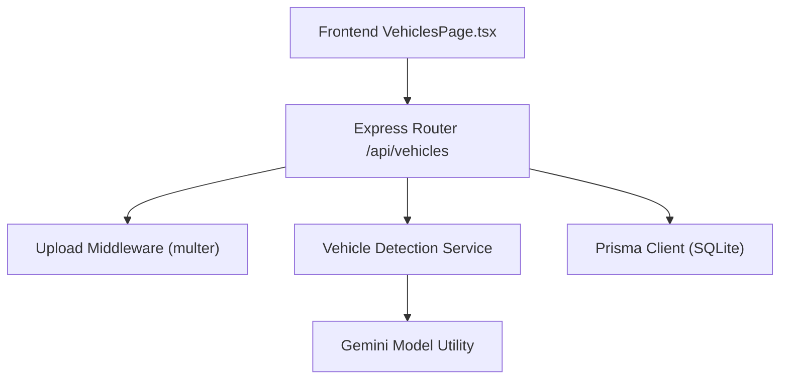
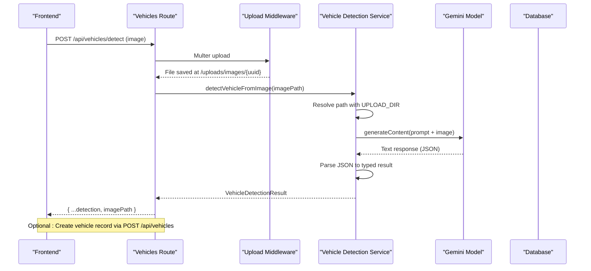
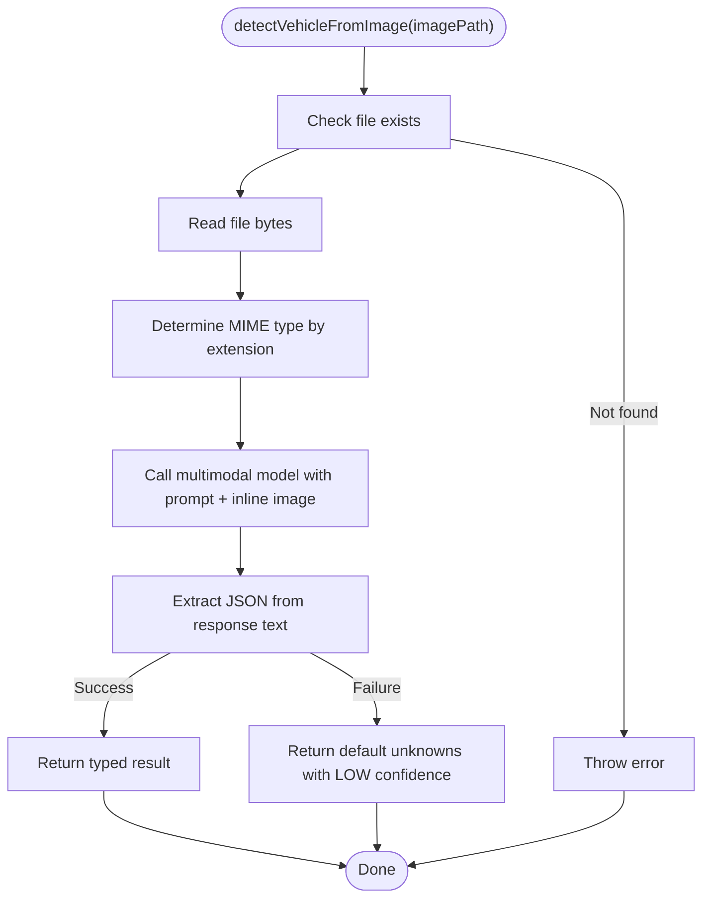
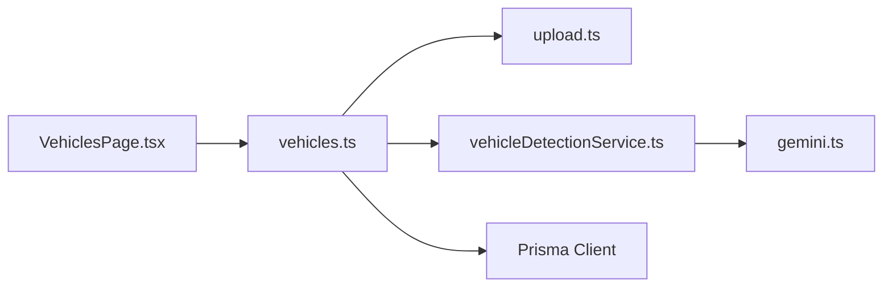

# Vehicle Detection Service

<cite>
**Referenced Files in This Document**
- [vehicleDetectionService.ts](file://backend/src/services/vehicleDetectionService.ts)
- [vehicles.ts](file://backend/src/routes/vehicles.ts)
- [upload.ts](file://backend/src/middleware/upload.ts)
- [gemini.ts](file://backend/src/utils/gemini.ts)
- [schema.prisma](file://backend/prisma/schema.prisma)
- [index.ts (types)](file://backend/src/types/index.ts)
- [VehiclesPage.tsx](file://frontend/src/pages/VehiclesPage.tsx)
</cite>

## Update Summary
**Changes Made**
- Updated Vehicle Detection Service section to reflect improved file path resolution logic
- Enhanced documentation for path handling between development and production environments
- Added detailed explanation of UPLOAD_DIR environment variable usage
- Updated architecture diagrams to show enhanced path resolution flow

## Table of Contents
1. Introduction
2. Project Structure
3. Core Components
4. Architecture Overview
5. Detailed Component Analysis
6. Dependency Analysis
7. Performance Considerations
8. Troubleshooting Guide
9. Conclusion
10. Appendices

## Introduction
This document explains the Vehicle Detection Service that identifies and validates vehicles from uploaded images, extracts vehicle make, model, year, color, and license plate information, and integrates with the application's data layer to persist vehicle records. The service uses a multimodal AI model to analyze images and return structured results, which are then stored in the database and exposed via REST endpoints. It also outlines confidence scoring, error handling, and guidance for expanding capabilities such as VIN extraction, anti-fraud checks, and integration with external databases.

## Project Structure
The vehicle detection feature spans backend services, routes, middleware, utilities, database schema, and frontend UI:
- Backend service performs image analysis using a multimodal AI model and returns structured vehicle details.
- Routes expose endpoints for detection and CRUD operations on vehicles.
- Middleware handles secure file uploads with type validation and size limits.
- Utilities provide access to the AI model configuration.
- Database schema defines the Vehicle entity and related models.
- Frontend provides an interactive form with drag-and-drop image upload and auto-fill from AI detection.

**Diagram sources**
- [vehicles.ts:16-32](file://backend/src/routes/vehicles.ts#L16-L32)
- [upload.ts:17-47](file://backend/src/middleware/upload.ts#L17-L47)
- [vehicleDetectionService.ts:46-95](file://backend/src/services/vehicleDetectionService.ts#L46-L95)
- [gemini.ts:6-9](file://backend/src/utils/gemini.ts#L6-L9)
- [schema.prisma:27-43](file://backend/prisma/schema.prisma#L27-L43)

**Section sources**
- [vehicles.ts:1-169](file://backend/src/routes/vehicles.ts#L1-L169)
- [upload.ts:1-54](file://backend/src/middleware/upload.ts#L1-L54)
- [vehicleDetectionService.ts:1-98](file://backend/src/services/vehicleDetectionService.ts#L1-L98)
- [gemini.ts:1-12](file://backend/src/utils/gemini.ts#L1-L12)
- [schema.prisma:1-202](file://backend/prisma/schema.prisma#L1-L202)
- [VehiclesPage.tsx:1-369](file://frontend/src/pages/VehiclesPage.tsx#L1-L369)

## Core Components
- Vehicle Detection Service: Reads uploaded image files, encodes them, sends to the multimodal AI model with a structured prompt, parses JSON output into a typed result, and returns vehicle attributes including confidence.
- Vehicles Route: Handles authentication, image upload, calls detection service, persists vehicle records, and exposes GET/PUT/DELETE endpoints.
- Upload Middleware: Validates file types, enforces size limits, and stores files under configured directories.
- Gemini Utility: Configures and returns the multimodal model instance used for image analysis.
- Database Schema: Defines Vehicle and related entities; supports storing photos and linking claims.
- Frontend: Provides drag-and-drop upload, invokes detection endpoint, displays confidence, and auto-fills form fields.

**Section sources**
- [vehicleDetectionService.ts:5-13](file://backend/src/services/vehicleDetectionService.ts#L5-L13)
- [vehicleDetectionService.ts:46-95](file://backend/src/services/vehicleDetectionService.ts#L46-L95)
- [vehicles.ts:16-63](file://backend/src/routes/vehicles.ts#L16-L63)
- [upload.ts:17-47](file://backend/src/middleware/upload.ts#L17-L47)
- [gemini.ts:6-9](file://backend/src/utils/gemini.ts#L6-L9)
- [schema.prisma:27-43](file://backend/prisma/schema.prisma#L27-L43)
- [VehiclesPage.tsx:156-181](file://frontend/src/pages/VehiclesPage.tsx#L156-L181)

## Architecture Overview
The end-to-end workflow for vehicle detection:
1. User uploads an image via the frontend.
2. Express route authenticates request and uses multer to save the file.
3. Route calls the detection service with the saved file path.
4. Service reads the file, determines MIME type, and sends it to the multimodal AI model along with a strict JSON prompt.
5. Service parses the response into a typed result and returns it to the route.
6. Route responds with detection results or persists a new vehicle record when requested.

**Diagram sources**
- [vehicles.ts:16-32](file://backend/src/routes/vehicles.ts#L16-L32)
- [upload.ts:17-47](file://backend/src/middleware/upload.ts#L17-L47)
- [vehicleDetectionService.ts:46-95](file://backend/src/services/vehicleDetectionService.ts#L46-L95)
- [gemini.ts:6-9](file://backend/src/utils/gemini.ts#L6-L9)

## Detailed Component Analysis

### Vehicle Detection Service
Responsibilities:
- Resolve and validate image file paths with enhanced cross-environment compatibility.
- Determine MIME type based on extension.
- Invoke the multimodal AI model with a strict JSON prompt to extract make, model, year, color, license plate, and confidence.
- Parse the response robustly, supporting fenced JSON blocks.
- Provide fallback values when parsing fails.

**Updated** Enhanced file path resolution logic with improved comments explaining the conversion from absolute paths to filesystem paths. The service now properly handles both development (`./uploads`) and production (`/data/uploads`) environments through configurable UPLOAD_DIR environment variable.

Key behaviors:
- Confidence levels: HIGH, MEDIUM, LOW based on clarity and recognizability.
- License plate text is extracted if visible.
- Additional info can include trim level, generation, body style observations.
- **Enhanced**: Robust path resolution that strips `/uploads/` prefix and resolves against configurable upload directory.

Error handling:
- Throws if image file not found after path resolution.
- Catches JSON parse errors and returns a safe default with LOW confidence and instructions to fill manually.

Performance considerations:
- Single-image processing per request.
- Base64 encoding and network call to AI model dominate latency.
- **Enhanced**: Efficient path resolution minimizes filesystem overhead.

**Diagram sources**
- [vehicleDetectionService.ts:46-95](file://backend/src/services/vehicleDetectionService.ts#L46-L95)

**Section sources**
- [vehicleDetectionService.ts:5-13](file://backend/src/services/vehicleDetectionService.ts#L5-L13)
- [vehicleDetectionService.ts:15-44](file://backend/src/services/vehicleDetectionService.ts#L15-L44)
- [vehicleDetectionService.ts:46-95](file://backend/src/services/vehicleDetectionService.ts#L46-L95)

### Vehicles Route
Endpoints:
- POST /api/vehicles/detect: Accepts image upload, runs detection, returns results with image path.
- POST /api/vehicles: Creates a vehicle record with required fields (make, model, year, licensePlate, color), optional VIN and mileage, and serialized photos array.
- GET /api/vehicles: Lists user's vehicles with claim counts.
- GET /api/vehicles/:id: Retrieves a specific vehicle with recent claims.
- PUT /api/vehicles/:id: Updates vehicle fields selectively.
- DELETE /api/vehicles/:id: Deletes a vehicle.

Authentication:
- All routes require auth middleware.

Validation:
- Requires core fields for creation; returns 400 if missing.

Persistence:
- Uses Prisma client to interact with SQLite database.

**Section sources**
- [vehicles.ts:10-11](file://backend/src/routes/vehicles.ts#L10-L11)
- [vehicles.ts:16-32](file://backend/src/routes/vehicles.ts#L16-L32)
- [vehicles.ts:34-63](file://backend/src/routes/vehicles.ts#L34-L63)
- [vehicles.ts:65-81](file://backend/src/routes/vehicles.ts#L65-L81)
- [vehicles.ts:83-111](file://backend/src/routes/vehicles.ts#L83-L111)
- [vehicles.ts:113-146](file://backend/src/routes/vehicles.ts#L113-L146)
- [vehicles.ts:148-166](file://backend/src/routes/vehicles.ts#L148-L166)

### Upload Middleware
Capabilities:
- Ensures upload directories exist.
- Stores files under images or documents subdirectories based on field name.
- Generates unique filenames using UUID.
- Filters allowed MIME types: JPEG, PNG, WebP.
- Enforces 10MB file size limit.

Security and reliability:
- Type filtering prevents non-image uploads.
- Size limits protect server resources.
- **Enhanced**: Consistent use of UPLOAD_DIR environment variable for cross-environment compatibility.

**Section sources**
- [upload.ts:6-15](file://backend/src/middleware/upload.ts#L6-L15)
- [upload.ts:17-28](file://backend/src/middleware/upload.ts#L17-L28)
- [upload.ts:30-41](file://backend/src/middleware/upload.ts#L30-L41)
- [upload.ts:43-53](file://backend/src/middleware/upload.ts#L43-L53)

### Gemini Utility
Purpose:
- Initializes GoogleGenerativeAI with API key from environment.
- Returns a configured model instance (default gemini-2.5-flash).

Usage:
- Used by detection and other AI-powered services to process images and text.

**Section sources**
- [gemini.ts:1-12](file://backend/src/utils/gemini.ts#L1-L12)

### Database Schema (Vehicle and Related)
Vehicle model fields:
- id, userId, make, model, year, vin (optional), licensePlate, color, mileage (optional), photos (JSON array), timestamps.
- Relationships: belongs to User, has many Claims.

Related models relevant to vehicle context:
- Claim links to Vehicle and Policy, includes images, assessments, estimates, payouts, documents, and chat messages.

Data integrity:
- Cascade deletes ensure consistency when users or vehicles are removed.

**Section sources**
- [schema.prisma:27-43](file://backend/prisma/schema.prisma#L27-L43)
- [schema.prisma:71-94](file://backend/prisma/schema.prisma#L71-L94)

### Frontend Integration
Features:
- Drag-and-drop image upload for vehicle detection.
- Calls POST /api/vehicles/detect and displays detected details with confidence.
- Auto-fills form fields when detection succeeds.
- Supports manual entry and submission to create a vehicle record.

User experience:
- Visual indicators for confidence levels.
- Error messaging for failed detections.

**Section sources**
- [VehiclesPage.tsx:156-181](file://frontend/src/pages/VehiclesPage.tsx#L156-L181)
- [VehiclesPage.tsx:207-211](file://frontend/src/pages/VehiclesPage.tsx#L207-L211)
- [VehiclesPage.tsx:217-300](file://frontend/src/pages/VehiclesPage.tsx#L217-L300)
- [VehiclesPage.tsx:313-364](file://frontend/src/pages/VehiclesPage.tsx#L313-L364)

## Dependency Analysis
Component relationships:
- VehiclesRoute depends on AuthMiddleware, UploadMiddleware, VehicleDetectionService, and Prisma.
- VehicleDetectionService depends on filesystem utilities and Gemini utility.
- Gemini utility depends on environment configuration for API keys.
- Frontend depends on backend routes and handles state for detection flow.

Potential coupling points:
- Prompt structure in service tightly couples AI behavior to expected JSON schema.
- Upload middleware constraints affect supported formats and sizes.
- **Enhanced**: Path resolution logic creates dependency on consistent UPLOAD_DIR configuration across components.

External dependencies:
- Google Generative AI SDK for multimodal processing.
- Prisma ORM for database interactions.

**Diagram sources**
- [vehicles.ts:1-169](file://backend/src/routes/vehicles.ts#L1-L169)
- [upload.ts:1-54](file://backend/src/middleware/upload.ts#L1-L54)
- [vehicleDetectionService.ts:1-98](file://backend/src/services/vehicleDetectionService.ts#L1-L98)
- [gemini.ts:1-12](file://backend/src/utils/gemini.ts#L1-L12)
- [VehiclesPage.tsx:1-369](file://frontend/src/pages/VehiclesPage.tsx#L1-L369)

**Section sources**
- [vehicles.ts:1-169](file://backend/src/routes/vehicles.ts#L1-L169)
- [vehicleDetectionService.ts:1-98](file://backend/src/services/vehicleDetectionService.ts#L1-L98)
- [gemini.ts:1-12](file://backend/src/utils/gemini.ts#L1-L12)
- [upload.ts:1-54](file://backend/src/middleware/upload.ts#L1-L54)
- [VehiclesPage.tsx:1-369](file://frontend/src/pages/VehiclesPage.tsx#L1-L369)

## Performance Considerations
- Image size and format: Limiting to 10MB and common image types reduces memory usage and improves upload speed.
- AI model latency: Multimodal calls are network-bound; consider caching repeated requests or batching where feasible.
- Parsing overhead: Robust JSON extraction avoids retries due to malformed responses.
- Database writes: Minimal writes during detection; vehicle creation is separate and atomic.
- **Enhanced**: Optimized path resolution reduces filesystem overhead and improves cross-platform compatibility.

Optimization opportunities:
- Implement request-level caching for identical images to reduce redundant AI calls.
- Add retry logic with exponential backoff for transient AI service failures.
- Preprocess images (resize/compress) before sending to AI to reduce payload size.
- **Enhanced**: Consider implementing path caching for frequently accessed files.

## Troubleshooting Guide
Common issues and resolutions:
- No image uploaded: Ensure multipart/form-data includes the correct field name and file selection.
- Unsupported file type: Only JPEG, PNG, and WebP are accepted; convert or re-export accordingly.
- File too large: Keep uploads under 10MB; compress images if necessary.
- Image file not found: Verify upload directory permissions and that the file was persisted correctly.
- **Enhanced**: Path resolution issues: Ensure UPLOAD_DIR environment variable is set consistently across all components and matches actual file system structure.
- AI response parsing failure: The service falls back to a safe default with LOW confidence; review logs and consider re-uploading a clearer image.
- Missing required fields for vehicle creation: Provide make, model, year, licensePlate, and color; optional fields include VIN and mileage.

Operational tips:
- Inspect server logs for detailed error messages.
- Validate environment variables for database URL, AI API key, and UPLOAD_DIR.
- Confirm upload directories exist and are writable.
- **Enhanced**: Test path resolution in both development and production environments to ensure compatibility.

**Section sources**
- [vehicles.ts:16-32](file://backend/src/routes/vehicles.ts#L16-L32)
- [upload.ts:30-47](file://backend/src/middleware/upload.ts#L30-L47)
- [vehicleDetectionService.ts:46-95](file://backend/src/services/vehicleDetectionService.ts#L46-L95)

## Conclusion
The Vehicle Detection Service leverages a multimodal AI model to extract vehicle attributes from images and integrates seamlessly with the application's routing, upload, and persistence layers. With enhanced file path resolution logic, the service now provides improved cross-environment compatibility, making it easier to deploy in both development and production settings. It provides confidence scoring, robust error handling, and a user-friendly frontend workflow. While current implementation focuses on image-based detection and basic persistence, future enhancements can introduce VIN extraction, anti-fraud checks, and integrations with external vehicle databases to further improve accuracy and security.

## Appendices

### Expansion Guidance
- VIN extraction: Extend the detection prompt to specifically request VIN parsing when visible; add validation rules for 17-character VIN format and store in the Vehicle model.
- Anti-fraud measures: Cross-check license plates and VINs against theft databases; flag mismatches and low-confidence detections for manual review.
- Manufacturer specifications: Integrate with manufacturer APIs to validate make/model/year combinations and enrich additionalInfo with trim and generation details.
- Batch processing: Implement a queue-based processor to handle multiple images asynchronously, improving throughput and enabling background jobs.
- Accuracy optimization: Tune prompts, preprocess images (enhance contrast, normalize lighting), and implement confidence thresholds to trigger human verification when needed.
- **Enhanced**: Environment configuration: Standardize UPLOAD_DIR configuration across all services and implement proper environment variable validation.

### Environment Configuration
The vehicle detection service uses the following environment variables:
- `UPLOAD_DIR`: Base directory for uploaded files (defaults to `./uploads` for development)
- `GOOGLE_API_KEY`: API key for Google Generative AI service
- `DATABASE_URL`: Database connection string for Prisma

**Deployment Notes**:
- Development: Uses relative path `./uploads` for easy local testing
- Production: Configure absolute path like `/data/uploads` for persistent storage
- Containerized deployments: Ensure volume mounts align with configured UPLOAD_DIR

[No sources needed since this section provides general guidance]