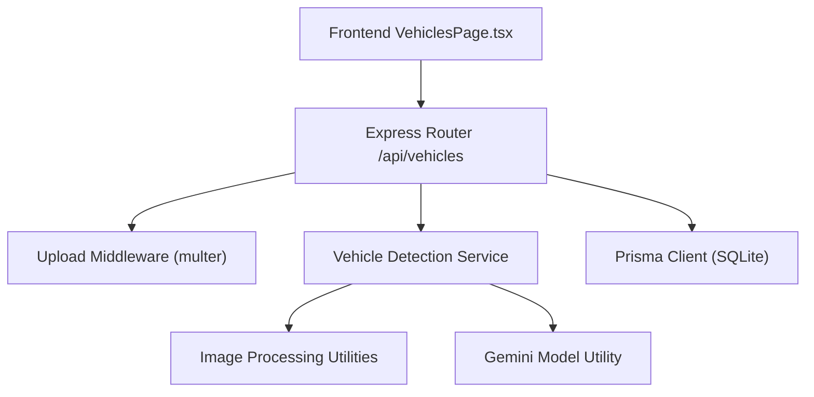
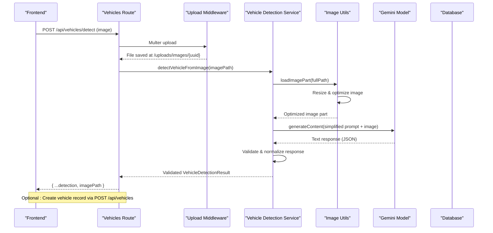
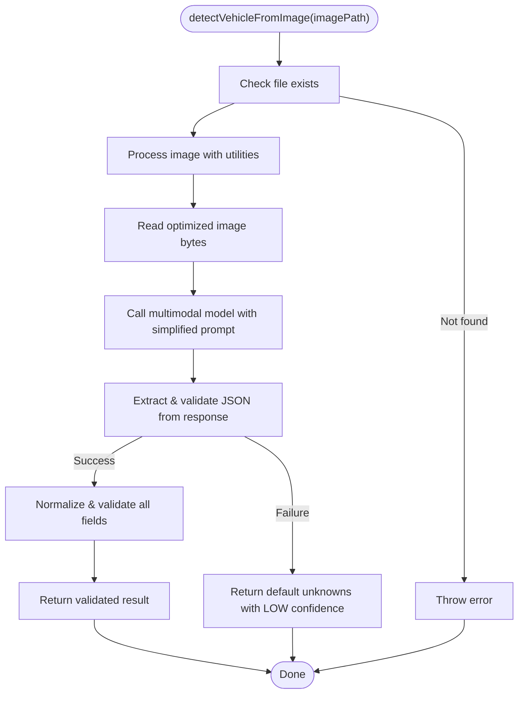
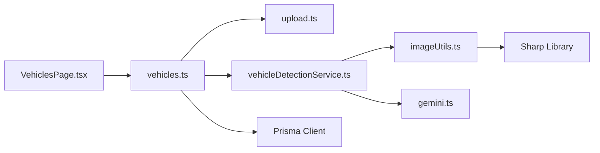

# Vehicle Detection Service

<cite>
**Referenced Files in This Document**
- [vehicleDetectionService.ts](file://backend/src/services/vehicleDetectionService.ts)
- [imageUtils.ts](file://backend/src/utils/imageUtils.ts)
- [vehicles.ts](file://backend/src/routes/vehicles.ts)
- [upload.ts](file://backend/src/middleware/upload.ts)
- [gemini.ts](file://backend/src/utils/gemini.ts)
- [schema.prisma](file://backend/prisma/schema.prisma)
- [index.ts (types)](file://backend/src/types/index.ts)
- [VehiclesPage.tsx](file://frontend/src/pages/VehiclesPage.tsx)
</cite>

## Update Summary
**Changes Made**
- Enhanced with centralized image processing utilities for optimized image handling
- Implemented comprehensive confidence scoring system (HIGH/MEDIUM/LOW) with validation
- Added robust validation and normalization of detected vehicle attributes
- Simplified detection prompt focusing on essential identification tasks
- Improved cross-environment path resolution with configurable UPLOAD_DIR support
- Enhanced error handling with fallback mechanisms for AI response parsing

## Table of Contents
1. Introduction
2. Project Structure
3. Core Components
4. Architecture Overview
5. Detailed Component Analysis
6. Dependency Analysis
7. Performance Considerations
8. Troubleshooting Guide
9. Conclusion
10. Appendices

## Introduction
This document explains the Vehicle Detection Service that identifies and validates vehicles from uploaded images, extracts vehicle make, model, year, color, and license plate information, and integrates with the application's data layer to persist vehicle records. The service uses a multimodal AI model with enhanced image processing capabilities to analyze images and return structured results with confidence scoring, which are then stored in the database and exposed via REST endpoints. It outlines the comprehensive validation system, error handling, and guidance for expanding capabilities such as VIN extraction, anti-fraud checks, and integration with external databases.

## Project Structure
The vehicle detection feature spans backend services, routes, middleware, utilities, database schema, and frontend UI:
- Backend service performs image analysis using a multimodal AI model with centralized image processing utilities
- Routes expose endpoints for detection and CRUD operations on vehicles
- Middleware handles secure file uploads with type validation and size limits
- Utilities provide optimized image processing and AI model configuration
- Database schema defines the Vehicle entity and related models
- Frontend provides an interactive form with drag-and-drop image upload and auto-fill from AI detection

**Diagram sources**
- [vehicles.ts:16-32](file://backend/src/routes/vehicles.ts#L16-L32)
- [upload.ts:17-47](file://backend/src/middleware/upload.ts#L17-L47)
- [vehicleDetectionService.ts:46-95](file://backend/src/services/vehicleDetectionService.ts#L46-L95)
- [imageUtils.ts:15-40](file://backend/src/utils/imageUtils.ts#L15-L40)
- [gemini.ts:6-9](file://backend/src/utils/gemini.ts#L6-L9)
- [schema.prisma:27-43](file://backend/prisma/schema.prisma#L27-L43)

**Section sources**
- [vehicles.ts:1-169](file://backend/src/routes/vehicles.ts#L1-L169)
- [upload.ts:1-54](file://backend/src/middleware/upload.ts#L1-L54)
- [vehicleDetectionService.ts:1-83](file://backend/src/services/vehicleDetectionService.ts#L1-L83)
- [imageUtils.ts:1-60](file://backend/src/utils/imageUtils.ts#L1-L60)
- [gemini.ts:1-183](file://backend/src/utils/gemini.ts#L1-L183)
- [schema.prisma:1-282](file://backend/prisma/schema.prisma#L1-L282)
- [VehiclesPage.tsx:1-399](file://frontend/src/pages/VehiclesPage.tsx#L1-L399)

## Core Components
- Vehicle Detection Service: Reads uploaded image files through centralized image processing utilities, encodes them with optimization, sends to the multimodal AI model with a simplified structured prompt, parses JSON output into a typed result with comprehensive validation, and returns vehicle attributes including confidence scoring.
- Vehicles Route: Handles authentication, image upload, calls detection service, persists vehicle records, and exposes GET/PUT/DELETE endpoints.
- Upload Middleware: Validates file types, enforces size limits, and stores files under configured directories with cross-environment compatibility.
- Image Processing Utilities: Centralized image handling with automatic resizing, format optimization, and EXIF orientation correction.
- Gemini Utility: Configures and returns the multimodal model instance used for image analysis with model cascade fallback.
- Database Schema: Defines Vehicle and related entities; supports storing photos and linking claims.
- Frontend: Provides drag-and-drop upload, invokes detection endpoint, displays confidence levels, and auto-fills form fields.

**Section sources**
- [vehicleDetectionService.ts:4-12](file://backend/src/services/vehicleDetectionService.ts#L4-L12)
- [vehicleDetectionService.ts:46-83](file://backend/src/services/vehicleDetectionService.ts#L46-L83)
- [imageUtils.ts:15-40](file://backend/src/utils/imageUtils.ts#L15-L40)
- [vehicles.ts:16-63](file://backend/src/routes/vehicles.ts#L16-L63)
- [upload.ts:17-47](file://backend/src/middleware/upload.ts#L17-L47)
- [gemini.ts:6-9](file://backend/src/utils/gemini.ts#L6-L9)
- [schema.prisma:27-43](file://backend/prisma/schema.prisma#L27-L43)
- [VehiclesPage.tsx:156-181](file://frontend/src/pages/VehiclesPage.tsx#L156-L181)

## Architecture Overview
The end-to-end workflow for vehicle detection with enhanced image processing:
1. User uploads an image via the frontend.
2. Express route authenticates request and uses multer to save the file.
3. Route calls the detection service with the saved file path.
4. Service uses centralized image processing utilities to optimize and resize the image.
5. Service reads the optimized file and sends it to the multimodal AI model along with a simplified prompt.
6. Service parses the response with comprehensive validation and returns it to the route.
7. Route responds with detection results or persists a new vehicle record when requested.

**Diagram sources**
- [vehicles.ts:16-32](file://backend/src/routes/vehicles.ts#L16-L32)
- [upload.ts:17-47](file://backend/src/middleware/upload.ts#L17-L47)
- [vehicleDetectionService.ts:46-83](file://backend/src/services/vehicleDetectionService.ts#L46-L83)
- [imageUtils.ts:26-40](file://backend/src/utils/imageUtils.ts#L26-L40)
- [gemini.ts:91-142](file://backend/src/utils/gemini.ts#L91-L142)

## Detailed Component Analysis

### Vehicle Detection Service
Responsibilities:
- Resolve and validate image file paths with enhanced cross-environment compatibility.
- Use centralized image processing utilities for optimal image handling.
- Invoke the multimodal AI model with a simplified prompt focused on essential identification tasks.
- Parse the response with comprehensive validation and normalization.
- Provide robust fallback values when parsing fails.

**Updated** Enhanced with centralized image processing utilities that automatically resize images to 1280px maximum dimension and compress to JPEG format with 80% quality. The service now uses a simplified prompt focusing on core vehicle identification tasks and implements comprehensive validation with confidence scoring (HIGH/MEDIUM/LOW).

Key behaviors:
- Confidence levels: HIGH, MEDIUM, LOW based on clarity and recognizability with strict validation.
- License plate text is extracted if visible.
- Additional info includes trim level, generation, body style observations.
- **Enhanced**: Comprehensive validation ensures all required fields are present and properly formatted.
- **Enhanced**: Simplified prompt reduces complexity while maintaining accuracy for essential identification tasks.

Error handling:
- Throws if image file not found after path resolution.
- Catches JSON parse errors and returns a safe default with LOW confidence and instructions to fill manually.
- **Enhanced**: Robust fallback mechanism ensures service reliability even with malformed AI responses.

Performance considerations:
- Single-image processing per request with optimized image handling.
- Base64 encoding and network call to AI model dominate latency.
- **Enhanced**: Centralized image processing reduces memory usage and improves upload speed through automatic compression.

**Diagram sources**
- [vehicleDetectionService.ts:46-83](file://backend/src/services/vehicleDetectionService.ts#L46-L83)
- [imageUtils.ts:26-40](file://backend/src/utils/imageUtils.ts#L26-L40)

**Section sources**
- [vehicleDetectionService.ts:4-12](file://backend/src/services/vehicleDetectionService.ts#L4-L12)
- [vehicleDetectionService.ts:14-29](file://backend/src/services/vehicleDetectionService.ts#L14-L29)
- [vehicleDetectionService.ts:31-44](file://backend/src/services/vehicleDetectionService.ts#L31-L44)
- [vehicleDetectionService.ts:46-83](file://backend/src/services/vehicleDetectionService.ts#L46-L83)

### Image Processing Utilities
Capabilities:
- Centralized image processing with automatic resizing to 1280px maximum dimension.
- Format optimization converting images to JPEG with 80% quality for reduced payload size.
- EXIF orientation correction for proper display of phone camera images.
- Cross-environment path resolution with configurable UPLOAD_DIR support.
- Error handling for missing or corrupt files without failing the entire process.

**Updated** New centralized utility module providing consistent image processing across the application. Includes automatic image optimization, format conversion, and robust error handling.

Key features:
- Automatic image resizing to prevent API payload limit issues.
- Quality optimization balancing detail preservation with file size reduction.
- Resilient error handling that skips unreadable files gracefully.
- **Enhanced**: Path resolution works consistently across development and production environments.

**Section sources**
- [imageUtils.ts:1-60](file://backend/src/utils/imageUtils.ts#L1-L60)

### Vehicles Route
Endpoints:
- POST /api/vehicles/detect: Accepts image upload, runs detection with enhanced image processing, returns results with image path.
- POST /api/vehicles: Creates a vehicle record with required fields (make, model, year, licensePlate, color), optional VIN and mileage, and serialized photos array.
- GET /api/vehicles: Lists user's vehicles with claim counts.
- GET /api/vehicles/:id: Retrieves a specific vehicle with recent claims.
- PUT /api/vehicles/:id: Updates vehicle fields selectively.
- DELETE /api/vehicles/:id: Deletes a vehicle.

Authentication:
- All routes require auth middleware.

Validation:
- Requires core fields for creation; returns 400 if missing.

Persistence:
- Uses Prisma client to interact with SQLite database.

**Section sources**
- [vehicles.ts:10-11](file://backend/src/routes/vehicles.ts#L10-L11)
- [vehicles.ts:16-32](file://backend/src/routes/vehicles.ts#L16-L32)
- [vehicles.ts:34-63](file://backend/src/routes/vehicles.ts#L34-L63)
- [vehicles.ts:65-81](file://backend/src/routes/vehicles.ts#L65-L81)
- [vehicles.ts:83-111](file://backend/src/routes/vehicles.ts#L83-L111)
- [vehicles.ts:113-146](file://backend/src/routes/vehicles.ts#L113-L146)
- [vehicles.ts:148-166](file://backend/src/routes/vehicles.ts#L148-L166)

### Upload Middleware
Capabilities:
- Ensures upload directories exist with cross-environment compatibility.
- Stores files under images or documents subdirectories based on field name.
- Generates unique filenames using UUID.
- Filters allowed MIME types: JPEG, PNG, WebP, JPG.
- Enforces 10MB file size limit.

Security and reliability:
- Type filtering prevents non-image uploads.
- Size limits protect server resources.
- **Enhanced**: Consistent use of UPLOAD_DIR environment variable for cross-environment compatibility.

**Section sources**
- [upload.ts:6-15](file://backend/src/middleware/upload.ts#L6-L15)
- [upload.ts:17-28](file://backend/src/middleware/upload.ts#L17-L28)
- [upload.ts:30-41](file://backend/src/middleware/upload.ts#L30-L41)
- [upload.ts:43-53](file://backend/src/middleware/upload.ts#L43-L53)

### Gemini Utility
Purpose:
- Initializes GoogleGenerativeAI with API key from environment.
- Returns a configured model instance with model cascade fallback system.
- Provides robust error handling with retry logic and model switching.

Usage:
- Used by detection and other AI-powered services to process images and text.
- **Enhanced**: Model cascade system automatically falls back to alternative models if primary fails.

**Section sources**
- [gemini.ts:1-183](file://backend/src/utils/gemini.ts#L1-L183)

### Database Schema (Vehicle and Related)
Vehicle model fields:
- id, userId, make, model, year, vin (optional), licensePlate, color, mileage (optional), photos (JSON array), valuation (optional), timestamps.
- Relationships: belongs to User, has many Claims.

Related models relevant to vehicle context:
- Claim links to Vehicle and Policy, includes images, assessments, estimates, payouts, documents, and chat messages.

Data integrity:
- Cascade deletes ensure consistency when users or vehicles are removed.

**Section sources**
- [schema.prisma:27-43](file://backend/prisma/schema.prisma#L27-L43)
- [schema.prisma:71-94](file://backend/prisma/schema.prisma#L71-L94)

### Frontend Integration
Features:
- Drag-and-drop image upload for vehicle detection with visual feedback.
- Calls POST /api/vehicles/detect and displays detected details with confidence levels.
- Auto-fills form fields when detection succeeds with intelligent field mapping.
- Supports manual entry and submission to create a vehicle record.
- **Enhanced**: Visual confidence indicators with color-coded severity levels.

User experience:
- Visual indicators for confidence levels (HIGH/MEDIUM/LOW) with appropriate styling.
- Error messaging for failed detections with helpful guidance.
- **Enhanced**: Improved user interface with better feedback during detection process.

**Section sources**
- [VehiclesPage.tsx:156-181](file://frontend/src/pages/VehiclesPage.tsx#L156-L181)
- [VehiclesPage.tsx:218-222](file://frontend/src/pages/VehiclesPage.tsx#L218-L222)
- [VehiclesPage.tsx:283-297](file://frontend/src/pages/VehiclesPage.tsx#L283-L297)
- [VehiclesPage.tsx:313-364](file://frontend/src/pages/VehiclesPage.tsx#L313-L364)

## Dependency Analysis
Component relationships:
- VehiclesRoute depends on AuthMiddleware, UploadMiddleware, VehicleDetectionService, and Prisma.
- VehicleDetectionService depends on centralized image processing utilities and Gemini utility.
- Image processing utilities depend on Sharp library for image manipulation.
- Gemini utility depends on environment configuration for API keys and model selection.
- Frontend depends on backend routes and handles state for detection flow with confidence visualization.

Potential coupling points:
- Prompt structure in service tightly couples AI behavior to expected JSON schema.
- Upload middleware constraints affect supported formats and sizes.
- **Enhanced**: Centralized image processing creates dependency on consistent configuration across components.
- **Enhanced**: Confidence scoring system requires consistent validation across all components.

External dependencies:
- Google Generative AI SDK for multimodal processing with model cascade fallback.
- Sharp library for image processing and optimization.
- Prisma ORM for database interactions.

**Diagram sources**
- [vehicles.ts:1-169](file://backend/src/routes/vehicles.ts#L1-L169)
- [upload.ts:1-54](file://backend/src/middleware/upload.ts#L1-L54)
- [vehicleDetectionService.ts:1-83](file://backend/src/services/vehicleDetectionService.ts#L1-L83)
- [imageUtils.ts:1-60](file://backend/src/utils/imageUtils.ts#L1-L60)
- [gemini.ts:1-183](file://backend/src/utils/gemini.ts#L1-L183)
- [VehiclesPage.tsx:1-399](file://frontend/src/pages/VehiclesPage.tsx#L1-L399)

**Section sources**
- [vehicles.ts:1-169](file://backend/src/routes/vehicles.ts#L1-L169)
- [vehicleDetectionService.ts:1-83](file://backend/src/services/vehicleDetectionService.ts#L1-L83)
- [imageUtils.ts:1-60](file://backend/src/utils/imageUtils.ts#L1-L60)
- [gemini.ts:1-183](file://backend/src/utils/gemini.ts#L1-L183)
- [upload.ts:1-54](file://backend/src/middleware/upload.ts#L1-L54)
- [VehiclesPage.tsx:1-399](file://frontend/src/pages/VehiclesPage.tsx#L1-L399)

## Performance Considerations
- Image size and format: Limiting to 10MB and common image types reduces memory usage and improves upload speed.
- AI model latency: Multimodal calls are network-bound; consider caching repeated requests or batching where feasible.
- Parsing overhead: Robust JSON extraction avoids retries due to malformed responses.
- Database writes: Minimal writes during detection; vehicle creation is separate and atomic.
- **Enhanced**: Centralized image processing significantly reduces payload size through automatic compression and resizing.
- **Enhanced**: Model cascade system optimizes performance by trying fastest models first with automatic fallback.

Optimization opportunities:
- Implement request-level caching for identical images to reduce redundant AI calls.
- Add retry logic with exponential backoff for transient AI service failures.
- Preprocess images (resize/compress) before sending to AI to reduce payload size.
- **Enhanced**: Centralized image processing already handles optimization automatically.
- **Enhanced**: Consider implementing batch processing for multiple image analysis requests.

## Troubleshooting Guide
Common issues and resolutions:
- No image uploaded: Ensure multipart/form-data includes the correct field name and file selection.
- Unsupported file type: Only JPEG, PNG, WebP, and JPG are accepted; convert or re-export accordingly.
- File too large: Keep uploads under 10MB; compress images if necessary.
- Image file not found: Verify upload directory permissions and that the file was persisted correctly.
- **Enhanced**: Path resolution issues: Ensure UPLOAD_DIR environment variable is set consistently across all components and matches actual file system structure.
- AI response parsing failure: The service falls back to a safe default with LOW confidence; review logs and consider re-uploading a clearer image.
- Missing required fields for vehicle creation: Provide make, model, year, licensePlate, and color; optional fields include VIN and mileage.
- **Enhanced**: Image processing errors: Check Sharp library installation and file permissions for image processing operations.

Operational tips:
- Inspect server logs for detailed error messages including image processing and AI model calls.
- Validate environment variables for database URL, AI API key, and UPLOAD_DIR.
- Confirm upload directories exist and are writable.
- **Enhanced**: Test path resolution in both development and production environments to ensure compatibility.
- **Enhanced**: Monitor image processing performance and adjust compression settings as needed.

**Section sources**
- [vehicles.ts:16-32](file://backend/src/routes/vehicles.ts#L16-L32)
- [upload.ts:30-47](file://backend/src/middleware/upload.ts#L30-L47)
- [vehicleDetectionService.ts:46-83](file://backend/src/services/vehicleDetectionService.ts#L46-L83)
- [imageUtils.ts:26-40](file://backend/src/utils/imageUtils.ts#L26-L40)

## Conclusion
The Vehicle Detection Service leverages a multimodal AI model with enhanced image processing capabilities to extract vehicle attributes from images and integrates seamlessly with the application's routing, upload, and persistence layers. With centralized image processing utilities, comprehensive confidence scoring, and robust validation systems, the service now provides improved reliability and performance across different environments. The simplified detection prompt focuses on essential identification tasks while maintaining accuracy, and the enhanced error handling ensures graceful degradation when AI responses are malformed. Future enhancements can introduce VIN extraction, anti-fraud checks, and integrations with external vehicle databases to further improve accuracy and security.

## Appendices

### Expansion Guidance
- VIN extraction: Extend the detection prompt to specifically request VIN parsing when visible; add validation rules for 17-character VIN format and store in the Vehicle model.
- Anti-fraud measures: Cross-check license plates and VINs against theft databases; flag mismatches and low-confidence detections for manual review.
- Manufacturer specifications: Integrate with manufacturer APIs to validate make/model/year combinations and enrich additionalInfo with trim and generation details.
- Batch processing: Implement a queue-based processor to handle multiple images asynchronously, improving throughput and enabling background jobs.
- Accuracy optimization: Tune prompts, preprocess images (enhance contrast, normalize lighting), and implement confidence thresholds to trigger human verification when needed.
- **Enhanced**: Environment configuration: Standardize UPLOAD_DIR configuration across all services and implement proper environment variable validation.
- **Enhanced**: Image processing optimization: Fine-tune compression settings and resize dimensions based on deployment environment and performance requirements.

### Environment Configuration
The vehicle detection service uses the following environment variables:
- `UPLOAD_DIR`: Base directory for uploaded files (defaults to `./uploads` for development)
- `GOOGLE_API_KEY`: API key for Google Generative AI service
- `DATABASE_URL`: Database connection string for Prisma
- `GEMINI_MODEL`: Optional override for specific Gemini model selection

**Deployment Notes**:
- Development: Uses relative path `./uploads` for easy local testing
- Production: Configure absolute path like `/data/uploads` for persistent storage
- Containerized deployments: Ensure volume mounts align with configured UPLOAD_DIR
- **Enhanced**: Image processing automatically optimizes uploads for both development and production environments

[No sources needed since this section provides general guidance]