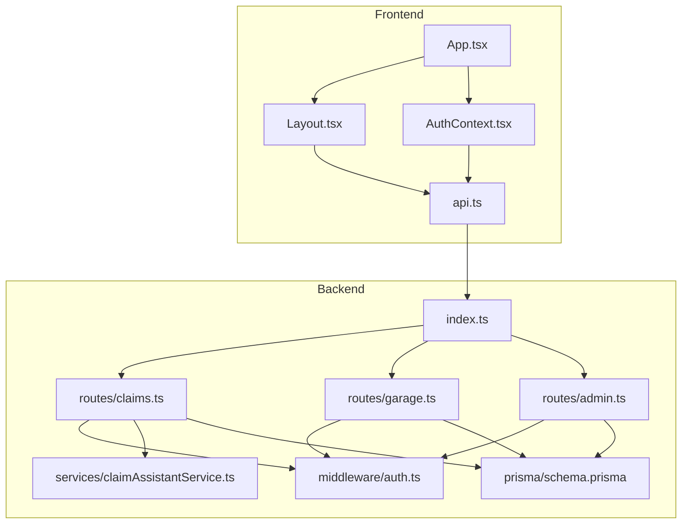
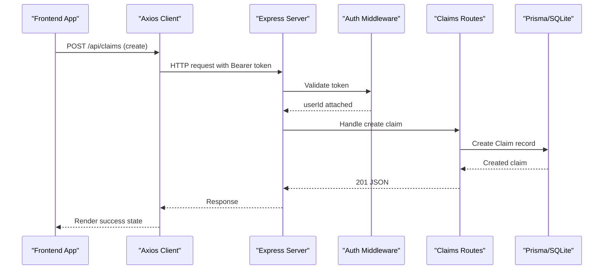
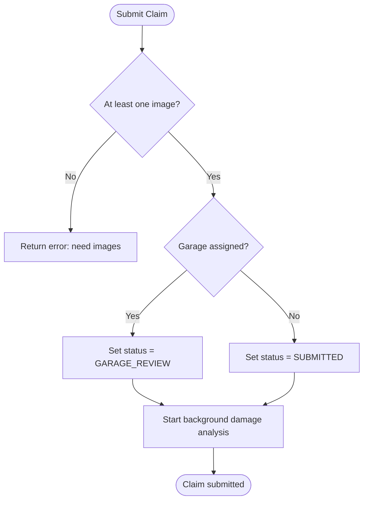
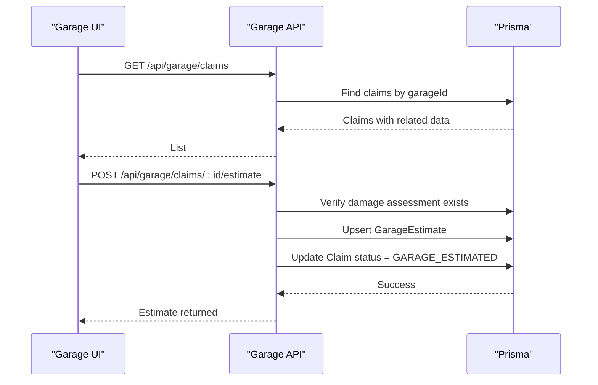
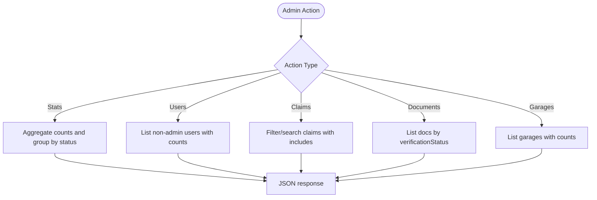
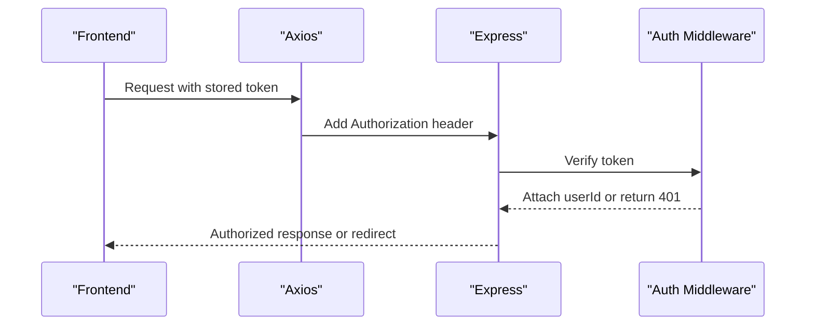
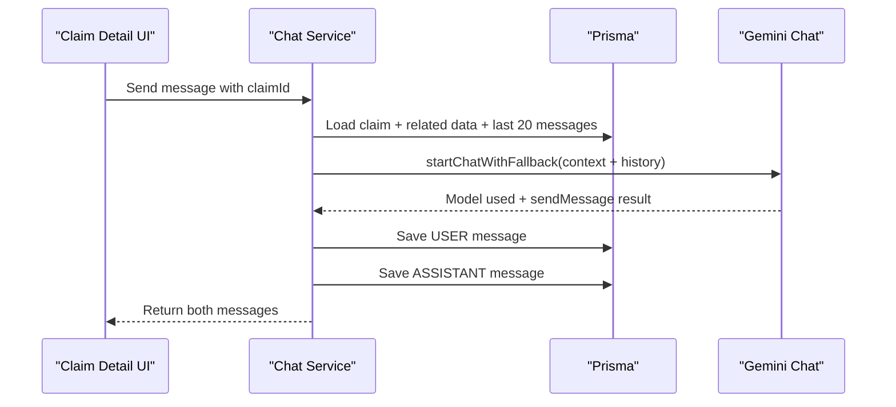
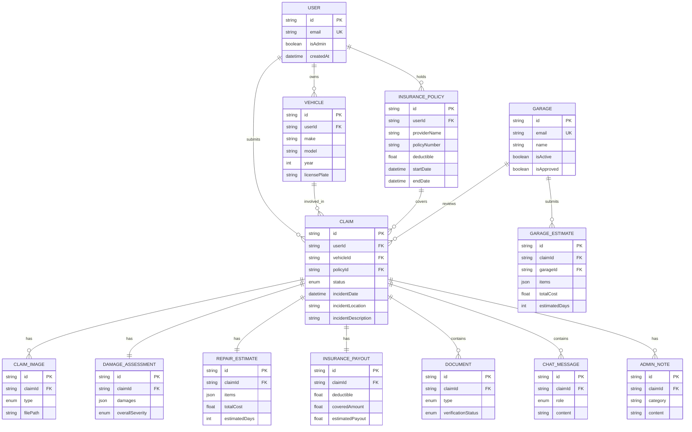
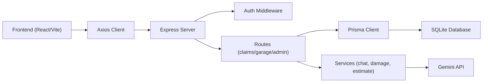

# Garage Management System

<cite>
**Referenced Files in This Document**
- [index.ts](file://backend/src/index.ts)
- [schema.prisma](file://backend/prisma/schema.prisma)
- [claims.ts](file://backend/src/routes/claims.ts)
- [garage.ts](file://backend/src/routes/garage.ts)
- [admin.ts](file://backend/src/routes/admin.ts)
- [auth.ts](file://backend/src/middleware/auth.ts)
- [claimAssistantService.ts](file://backend/src/services/claimAssistantService.ts)
- [App.tsx](file://frontend/src/App.tsx)
- [Layout.tsx](file://frontend/src/components/Layout.tsx)
- [AuthContext.tsx](file://frontend/src/context/AuthContext.tsx)
- [api.ts](file://frontend/src/services/api.ts)
- [package.json (backend)](file://backend/package.json)
- [package.json (frontend)](file://frontend/package.json)
</cite>

## Table of Contents
1. [Introduction](#introduction)
2. [Project Structure](#project-structure)
3. [Core Components](#core-components)
4. [Architecture Overview](#architecture-overview)
5. [Detailed Component Analysis](#detailed-component-analysis)
6. [Dependency Analysis](#dependency-analysis)
7. [Performance Considerations](#performance-considerations)
8. [Troubleshooting Guide](#troubleshooting-guide)
9. [Conclusion](#conclusion)

## Introduction
This document describes the Garage Management System, a full-stack application for managing vehicle insurance claims with roles for policyholders, garages, and administrators. The system supports claim creation, AI-assisted damage analysis, repair estimates, document verification, chat assistance, and administrative oversight including garage approvals. It is built with an Express backend, Prisma ORM with SQLite, and a React frontend using Vite and Tailwind CSS.

## Project Structure
The repository is organized into two main parts:
- Backend (Express + TypeScript + Prisma): API endpoints, middleware, services, and database schema.
- Frontend (React + TypeScript + Vite): Routing, protected routes, context-based authentication, and UI layouts.

**Diagram sources**
- [index.ts:28-51](file://backend/src/index.ts#L28-L51)
- [App.tsx:30-66](file://frontend/src/App.tsx#L30-L66)
- [Layout.tsx:15-177](file://frontend/src/components/Layout.tsx#L15-L177)
- [AuthContext.tsx:17-73](file://frontend/src/context/AuthContext.tsx#L17-L73)
- [api.ts:7-24](file://frontend/src/services/api.ts#L7-L24)
- [schema.prisma:10-256](file://backend/prisma/schema.prisma#L10-L256)

**Section sources**
- [index.ts:1-71](file://backend/src/index.ts#L1-L71)
- [App.tsx:1-71](file://frontend/src/App.tsx#L1-L71)
- [schema.prisma:1-256](file://backend/prisma/schema.prisma#L1-L256)

## Core Components
- Authentication and Authorization: JWT-based middleware protects user, garage, and admin routes.
- Claims Management: Create, update, submit, list, and retrieve claims; upload images and documents; trigger AI analysis and estimates; chat assistant per claim.
- Garage Portal: List assigned claims, view details, and submit repair estimates; updates claim status accordingly.
- Admin Portal: Dashboard stats, user management, claim oversight, document approval/rejection, garage approval/toggle.
- Data Layer: Prisma models define users, vehicles, policies, claims, assessments, estimates, payouts, documents, messages, notes, garages, and garage estimates.

**Section sources**
- [auth.ts:5-22](file://backend/src/middleware/auth.ts#L5-L22)
- [claims.ts:38-476](file://backend/src/routes/claims.ts#L38-L476)
- [garage.ts:11-133](file://backend/src/routes/garage.ts#L11-L133)
- [admin.ts:11-299](file://backend/src/routes/admin.ts#L11-L299)
- [schema.prisma:10-256](file://backend/prisma/schema.prisma#L10-L256)

## Architecture Overview
The system follows a layered architecture:
- Frontend pages and components call a centralized Axios client that injects auth tokens and handles 401 redirects.
- Backend Express app mounts route modules under /api namespaces.
- Route handlers enforce role-based access via middleware and delegate to Prisma for data operations.
- Services encapsulate AI-driven features like damage analysis and chat responses.

**Diagram sources**
- [api.ts:11-24](file://frontend/src/services/api.ts#L11-L24)
- [index.ts:43-51](file://backend/src/index.ts#L43-L51)
- [auth.ts:5-22](file://backend/src/middleware/auth.ts#L5-L22)
- [claims.ts:38-76](file://backend/src/routes/claims.ts#L38-L76)
- [schema.prisma:73-100](file://backend/prisma/schema.prisma#L73-L100)

## Detailed Component Analysis

### Claims Module
Responsibilities:
- CRUD for claims with ownership checks.
- Image and document uploads with file storage paths.
- Submitting claims triggers background AI damage analysis and sets appropriate status based on garage assignment.
- Repair estimate generation requires prior damage assessment.
- Per-claim chat assistant integrates claim context and conversation history.

Key flows:
- Create claim: validates required fields, ensures vehicle ownership, persists claim.
- Submit claim: enforces minimum images, transitions status to SUBMITTED or GARAGE_REVIEW, starts background analysis.
- Upload images/documents: stores files and records metadata.
- Analyze damage: invokes service to process images and produce assessment.
- Generate estimate: depends on existing damage assessment.
- Chat: builds context from claim data and recent messages, calls AI assistant, persists messages.

**Diagram sources**
- [claims.ts:175-218](file://backend/src/routes/claims.ts#L175-L218)

**Section sources**
- [claims.ts:17-476](file://backend/src/routes/claims.ts#L17-L476)

### Garage Module
Responsibilities:
- List and view claims assigned to the authenticated garage.
- Submit or update repair estimates; require prior AI damage assessment.
- Update claim status to GARAGE_ESTIMATED upon estimate submission.

**Diagram sources**
- [garage.ts:11-133](file://backend/src/routes/garage.ts#L11-L133)

**Section sources**
- [garage.ts:1-136](file://backend/src/routes/garage.ts#L1-L136)

### Admin Module
Responsibilities:
- Dashboard statistics: user counts, claims grouped by status, document counts and pending verifications.
- User listing with counts of vehicles and claims.
- Claims listing with search and filters; detailed view including all related entities.
- Status transitions for claims.
- Document approval/rejection workflow.
- Garage management: list, approve, toggle active status.

**Diagram sources**
- [admin.ts:11-299](file://backend/src/routes/admin.ts#L11-L299)

**Section sources**
- [admin.ts:1-300](file://backend/src/routes/admin.ts#L1-L300)

### Authentication and Authorization
- JWT middleware validates bearer tokens and attaches userId to requests.
- Protected routes use this middleware to ensure only authenticated users can access resources.
- Frontend Axios interceptor adds Authorization header and redirects on 401.

**Diagram sources**
- [auth.ts:5-22](file://backend/src/middleware/auth.ts#L5-L22)
- [api.ts:11-36](file://frontend/src/services/api.ts#L11-L36)

**Section sources**
- [auth.ts:1-23](file://backend/src/middleware/auth.ts#L1-L23)
- [api.ts:1-40](file://frontend/src/services/api.ts#L1-L40)

### AI Chat Assistant
- Builds rich context from claim data (vehicle, policy, damage assessment, estimates, payout, documents).
- Maintains conversation history per claim and persists both user and assistant messages.
- Uses a fallback-enabled chat utility to handle model availability.

**Diagram sources**
- [claimAssistantService.ts:20-128](file://backend/src/services/claimAssistantService.ts#L20-L128)

**Section sources**
- [claimAssistantService.ts:1-128](file://backend/src/services/claimAssistantService.ts#L1-L128)

### Data Models and Relationships
The Prisma schema defines the core entities and relationships:
- Users, Vehicles, Insurance Policies, Claims, Garages.
- Supporting entities: ClaimImage, DamageAssessment, RepairEstimate, InsurancePayout, Document, ChatMessage, AdminNote, GarageEstimate.
- Enums standardize statuses and types across the system.

**Diagram sources**
- [schema.prisma:10-256](file://backend/prisma/schema.prisma#L10-L256)

**Section sources**
- [schema.prisma:1-256](file://backend/prisma/schema.prisma#L1-L256)

## Dependency Analysis
- Frontend dependencies: React, React Router, Axios, Tailwind, Vite.
- Backend dependencies: Express, Prisma, JWT, Multer, Zod, Google Generative AI, bcryptjs.
- Routing layer: index.ts wires route modules to URL prefixes.
- Middleware layer: auth.ts secures routes; other middleware (upload, error handling) support specific features.
- Services layer: claimAssistantService orchestrates AI interactions and persistence.

**Diagram sources**
- [package.json (frontend):12-29](file://frontend/package.json#L12-L29)
- [package.json (backend):20-31](file://backend/package.json#L20-L31)
- [index.ts:28-64](file://backend/src/index.ts#L28-L64)

**Section sources**
- [package.json (frontend):1-32](file://frontend/package.json#L1-L32)
- [package.json (backend):1-44](file://backend/package.json#L1-L44)
- [index.ts:1-71](file://backend/src/index.ts#L1-L71)

## Performance Considerations
- Background processing: Damage analysis is triggered asynchronously to avoid blocking claim submission.
- Query optimization: Use selective field inclusion to reduce payload sizes (e.g., selecting only needed fields for lists).
- File uploads: Enforce reasonable limits and consider offloading large files to object storage in production.
- Caching: Consider caching frequent reads (e.g., garage listings) if traffic increases.
- Database: For high concurrency, migrate from SQLite to a relational database with proper indexing on foreign keys and frequently filtered columns.

[No sources needed since this section provides general guidance]

## Troubleshooting Guide
Common issues and resolutions:
- Missing environment variables: Ensure JWT_SECRET, GEMINI_API_KEY, DATABASE_URL are set before starting the server.
- CORS errors: Configure CORS_ORIGIN appropriately for your frontend origin.
- 401 Unauthorized: Verify token presence and validity; frontend clears token and redirects on 401.
- Upload failures: Confirm UPLOAD_DIR exists and is writable; check multer configuration and file size limits.
- AI service errors: Implement retries and fallbacks; log model usage and errors for diagnostics.

**Section sources**
- [index.ts:18-25](file://backend/src/index.ts#L18-L25)
- [index.ts:31-41](file://backend/src/index.ts#L31-L41)
- [api.ts:26-36](file://frontend/src/services/api.ts#L26-L36)
- [claims.ts:220-258](file://backend/src/routes/claims.ts#L220-L258)

## Conclusion
The Garage Management System provides a comprehensive platform for managing vehicle insurance claims with robust role-based access, AI-assisted workflows, and administrative oversight. Its modular backend and reactive frontend enable scalable feature development. Future enhancements may include advanced analytics, notifications, and migration to a cloud database for production scale.