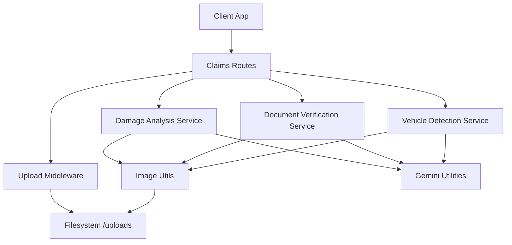
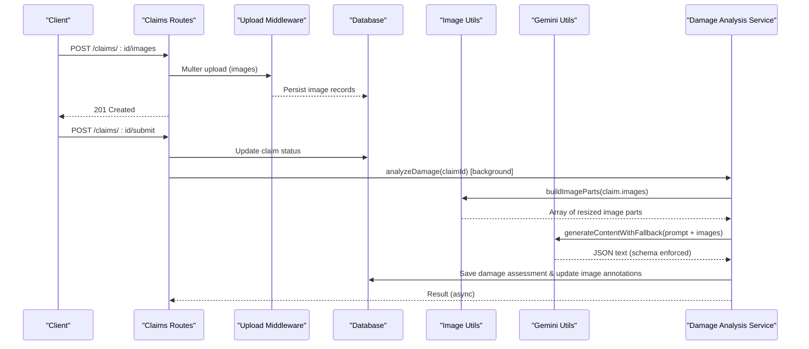
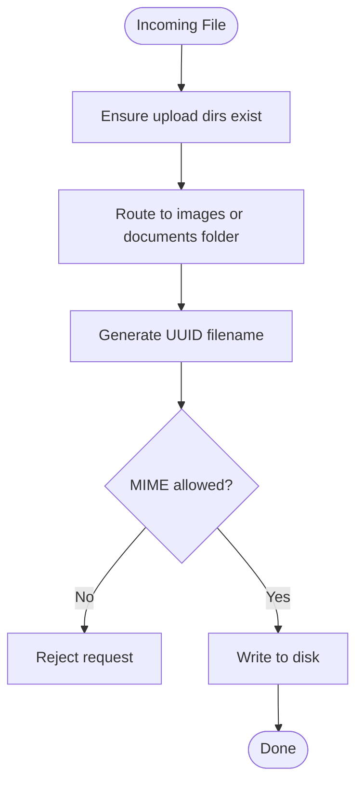
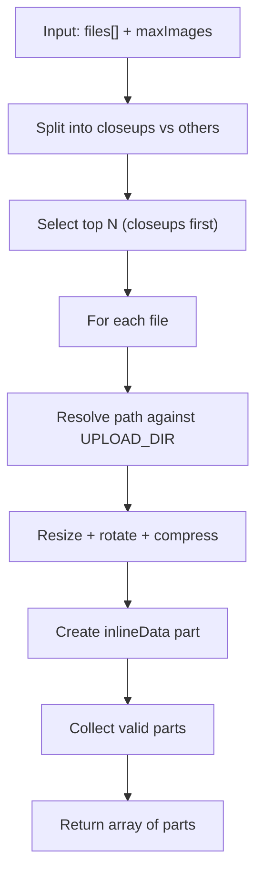
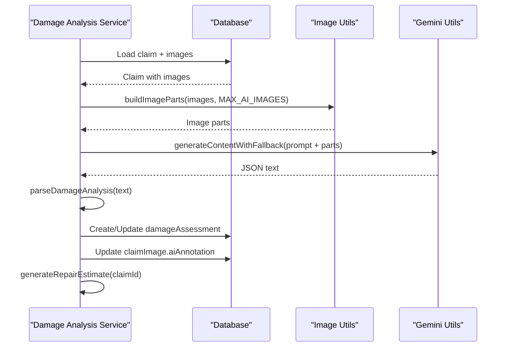
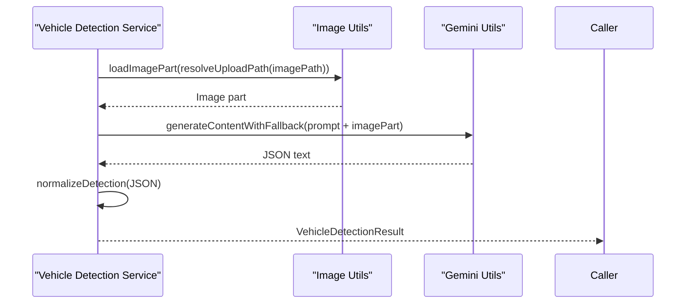
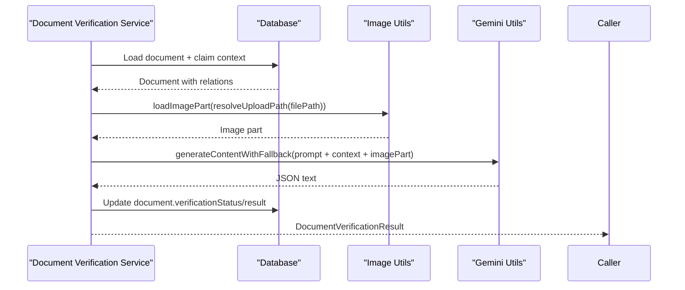
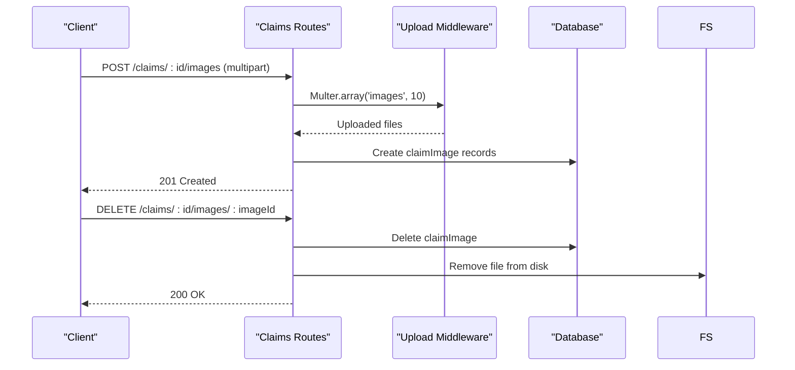
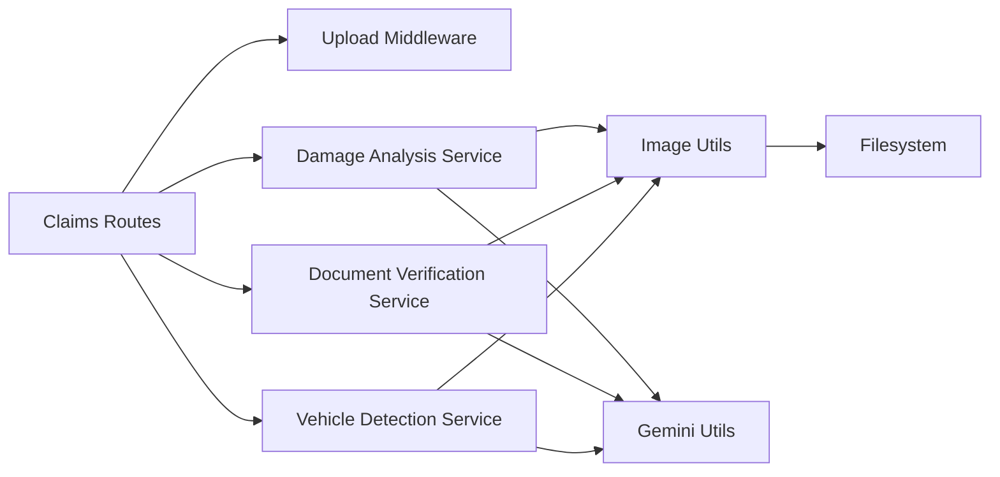

# Image Processing Utility

<cite>
**Referenced Files in This Document**
- [imageUtils.ts](file://backend/src/utils/imageUtils.ts)
- [upload.ts](file://backend/src/middleware/upload.ts)
- [damageAnalysisService.ts](file://backend/src/services/damageAnalysisService.ts)
- [vehicleDetectionService.ts](file://backend/src/services/vehicleDetectionService.ts)
- [documentVerificationService.ts](file://backend/src/services/documentVerificationService.ts)
- [gemini.ts](file://backend/src/utils/gemini.ts)
- [claims.ts](file://backend/src/routes/claims.ts)
- [index.ts](file://backend/src/types/index.ts)
</cite>

## Table of Contents
1. [Introduction](#introduction)
2. [Project Structure](#project-structure)
3. [Core Components](#core-components)
4. [Architecture Overview](#architecture-overview)
5. [Detailed Component Analysis](#detailed-component-analysis)
6. [Dependency Analysis](#dependency-analysis)
7. [Performance Considerations](#performance-considerations)
8. [Troubleshooting Guide](#troubleshooting-guide)
9. [Conclusion](#conclusion)

## Introduction
This document explains the image processing utility used by the Smart Vehicle Insurance Claim System backend. It covers how images are uploaded, optimized, and consumed by AI services for vehicle damage analysis, vehicle detection, and document verification. The goal is to make the system robust, fast, and reliable while keeping large phone photos within API payload limits and ensuring consistent structured outputs from AI models.

## Project Structure
The image processing pipeline spans middleware (uploads), utilities (image optimization), services (AI integration), and routes (API endpoints). Key responsibilities:
- Uploads: Accept and store images with type filtering and size limits.
- Optimization: Resize and compress images to reduce payload size and improve AI performance.
- AI Integration: Send optimized images to Gemini models with strict JSON schemas for deterministic parsing.
- Routes: Expose endpoints to upload images/documents and trigger analysis flows.

**Diagram sources**
- [claims.ts:298-336](file://backend/src/routes/claims.ts#L298-L336)
- [upload.ts:17-47](file://backend/src/middleware/upload.ts#L17-L47)
- [imageUtils.ts:15-59](file://backend/src/utils/imageUtils.ts#L15-L59)
- [damageAnalysisService.ts:110-199](file://backend/src/services/damageAnalysisService.ts#L110-L199)
- [documentVerificationService.ts:40-98](file://backend/src/services/documentVerificationService.ts#L40-L98)
- [vehicleDetectionService.ts:46-82](file://backend/src/services/vehicleDetectionService.ts#L46-L82)
- [gemini.ts:91-142](file://backend/src/utils/gemini.ts#L91-L142)

**Section sources**
- [upload.ts:1-54](file://backend/src/middleware/upload.ts#L1-54)
- [imageUtils.ts:1-60](file://backend/src/utils/imageUtils.ts#L1-60)
- [claims.ts:298-336](file://backend/src/routes/claims.ts#L298-L336)

## Core Components
- Image Upload Middleware: Validates file types, enforces size limits, and stores files under dedicated directories.
- Image Utilities: Resizes, rotates, and compresses images; builds compact inline data parts for AI requests; resolves storage paths safely.
- Damage Analysis Service: Builds image sets prioritizing closeups, calls Gemini with a schema-enforced prompt, parses results, persists assessments, updates image annotations, and triggers repair estimates.
- Vehicle Detection Service: Extracts make/model/year/color/license plate from a single image using a schema-enforced response.
- Document Verification Service: Verifies authenticity/completeness of documents via AI and persists results.
- Gemini Utilities: Model cascade with fallbacks, timeouts, retries, and structured output configuration.

**Section sources**
- [upload.ts:17-47](file://backend/src/middleware/upload.ts#L17-L47)
- [imageUtils.ts:15-59](file://backend/src/utils/imageUtils.ts#L15-L59)
- [damageAnalysisService.ts:110-199](file://backend/src/services/damageAnalysisService.ts#L110-L199)
- [vehicleDetectionService.ts:46-82](file://backend/src/services/vehicleDetectionService.ts#L46-L82)
- [documentVerificationService.ts:40-98](file://backend/src/services/documentVerificationService.ts#L40-L98)
- [gemini.ts:91-142](file://backend/src/utils/gemini.ts#L91-L142)

## Architecture Overview
End-to-end flow for claim submission with image uploads and AI-driven analysis:

**Diagram sources**
- [claims.ts:253-296](file://backend/src/routes/claims.ts#L253-L296)
- [claims.ts:298-336](file://backend/src/routes/claims.ts#L298-L336)
- [damageAnalysisService.ts:110-199](file://backend/src/services/damageAnalysisService.ts#L110-L199)
- [imageUtils.ts:47-59](file://backend/src/utils/imageUtils.ts#L47-L59)
- [gemini.ts:91-142](file://backend/src/utils/gemini.ts#L91-L142)

## Detailed Component Analysis

### Image Upload Middleware
- Ensures upload directories exist.
- Stores files under /uploads/images or /uploads/documents based on field name.
- Assigns unique filenames using UUIDs.
- Filters allowed MIME types and enforces a 10MB size limit.

**Diagram sources**
- [upload.ts:8-15](file://backend/src/middleware/upload.ts#L8-L15)
- [upload.ts:17-47](file://backend/src/middleware/upload.ts#L17-L47)

**Section sources**
- [upload.ts:1-54](file://backend/src/middleware/upload.ts#L1-54)

### Image Utilities
- Resolves absolute paths relative to UPLOAD_DIR.
- Loads images with EXIF rotation, resizes to a maximum dimension, and compresses to JPEG at a fixed quality.
- Converts to base64 inlineData suitable for AI payloads.
- Selects up to N images per request, prioritizing DAMAGE_CLOSEUP over full-vehicle shots.

**Diagram sources**
- [imageUtils.ts:15-59](file://backend/src/utils/imageUtils.ts#L15-L59)

**Section sources**
- [imageUtils.ts:1-60](file://backend/src/utils/imageUtils.ts#L1-60)

### Damage Analysis Service
- Retrieves claim and associated images; validates presence of images.
- Builds image parts prioritizing closeups; sends them to Gemini with a schema-enforced prompt.
- Parses and normalizes model output into a strict result shape.
- Persists damage assessment and updates per-image AI annotations.
- Auto-triggers repair estimate generation.

**Diagram sources**
- [damageAnalysisService.ts:110-199](file://backend/src/services/damageAnalysisService.ts#L110-L199)
- [imageUtils.ts:47-59](file://backend/src/utils/imageUtils.ts#L47-L59)
- [gemini.ts:91-142](file://backend/src/utils/gemini.ts#L91-L142)

**Section sources**
- [damageAnalysisService.ts:1-200](file://backend/src/services/damageAnalysisService.ts#L1-L200)

### Vehicle Detection Service
- Resolves image path and loads an optimized image part.
- Sends a concise prompt plus image to Gemini with a strict schema for vehicle details.
- Normalizes and returns a typed result; falls back to safe defaults if parsing fails.

**Diagram sources**
- [vehicleDetectionService.ts:46-82](file://backend/src/services/vehicleDetectionService.ts#L46-L82)
- [imageUtils.ts:26-39](file://backend/src/utils/imageUtils.ts#L26-L39)
- [gemini.ts:91-142](file://backend/src/utils/gemini.ts#L91-L142)

**Section sources**
- [vehicleDetectionService.ts:1-83](file://backend/src/services/vehicleDetectionService.ts#L1-L83)

### Document Verification Service
- Loads the document image, enriches context with claim and vehicle info.
- Calls Gemini with a detailed prompt and expects a JSON object describing verification status, issues, extracted info, and recommendations.
- Persists verification results to the document record.

**Diagram sources**
- [documentVerificationService.ts:40-98](file://backend/src/services/documentVerificationService.ts#L40-L98)
- [imageUtils.ts:26-39](file://backend/src/utils/imageUtils.ts#L26-L39)
- [gemini.ts:91-142](file://backend/src/utils/gemini.ts#L91-L142)

**Section sources**
- [documentVerificationService.ts:1-99](file://backend/src/services/documentVerificationService.ts#L1-L99)

### Claims Routes (Image Endpoints)
- POST /claims/:id/images: Accepts multiple images, persists metadata, and stores files.
- DELETE /claims/:id/images/:imageId: Removes database record and deletes file from disk.
- POST /claims/:id/analyze: Triggers damage analysis synchronously.
- POST /claims/:id/submit: Submits claim and starts background damage analysis.

**Diagram sources**
- [claims.ts:298-336](file://backend/src/routes/claims.ts#L298-L336)
- [claims.ts:338-372](file://backend/src/routes/claims.ts#L338-L372)
- [upload.ts:17-47](file://backend/src/middleware/upload.ts#L17-L47)

**Section sources**
- [claims.ts:298-372](file://backend/src/routes/claims.ts#L298-L372)

## Dependency Analysis
High-level dependencies among components:

**Diagram sources**
- [claims.ts:298-336](file://backend/src/routes/claims.ts#L298-L336)
- [damageAnalysisService.ts:110-199](file://backend/src/services/damageAnalysisService.ts#L110-L199)
- [documentVerificationService.ts:40-98](file://backend/src/services/documentVerificationService.ts#L40-L98)
- [vehicleDetectionService.ts:46-82](file://backend/src/services/vehicleDetectionService.ts#L46-L82)
- [imageUtils.ts:15-59](file://backend/src/utils/imageUtils.ts#L15-L59)
- [gemini.ts:91-142](file://backend/src/utils/gemini.ts#L91-L142)

**Section sources**
- [imageUtils.ts:15-59](file://backend/src/utils/imageUtils.ts#L15-L59)
- [gemini.ts:91-142](file://backend/src/utils/gemini.ts#L91-L142)
- [damageAnalysisService.ts:110-199](file://backend/src/services/damageAnalysisService.ts#L110-L199)
- [documentVerificationService.ts:40-98](file://backend/src/services/documentVerificationService.ts#L40-L98)
- [vehicleDetectionService.ts:46-82](file://backend/src/services/vehicleDetectionService.ts#L46-L82)
- [claims.ts:298-336](file://backend/src/routes/claims.ts#L298-L336)

## Performance Considerations
- Image sizing: Images are resized to a maximum dimension and compressed to JPEG to keep payloads small and speed up AI inference.
- Closeup priority: When building image sets, closeups are prioritized because they carry the most detail for damage assessment.
- Model cascade: Requests automatically fall back across multiple Gemini models to handle rate limits, outages, or incompatibilities.
- Timeouts and retries: Each model call is wrapped with a timeout; transient errors trigger short retries before moving to the next model.
- Structured outputs: Using responseMimeType and responseSchema ensures deterministic JSON responses, reducing parsing overhead and error handling complexity.

[No sources needed since this section provides general guidance]

## Troubleshooting Guide
Common issues and resolutions:
- No readable images: If all images fail to load or resize, analysis will fail. Ensure files exist on disk and are valid images.
- AI model failures: If all models fail, check API keys, quotas, and network connectivity. The service logs which model was last attempted.
- Invalid document images: If verification cannot parse a response, it returns a safe default indicating unreadable; re-upload a clearer image.
- Upload rejections: Only specific MIME types are accepted; ensure client sends supported formats.

**Section sources**
- [damageAnalysisService.ts:120-130](file://backend/src/services/damageAnalysisService.ts#L120-L130)
- [gemini.ts:117-142](file://backend/src/utils/gemini.ts#L117-L142)
- [documentVerificationService.ts:70-86](file://backend/src/services/documentVerificationService.ts#L70-L86)
- [upload.ts:30-41](file://backend/src/middleware/upload.ts#L30-L41)

## Conclusion
The image processing utility integrates secure uploads, efficient image optimization, and resilient AI-powered analysis to support vehicle damage assessment, vehicle detection, and document verification. By enforcing strict schemas, prioritizing critical images, and implementing model fallbacks with timeouts, the system delivers reliable and fast results even under variable conditions.

[No sources needed since this section summarizes without analyzing specific files]