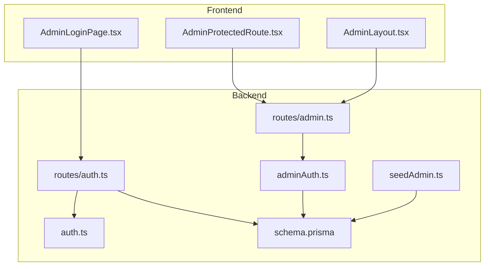
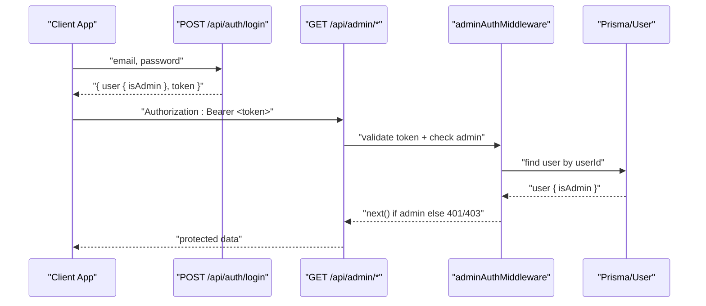
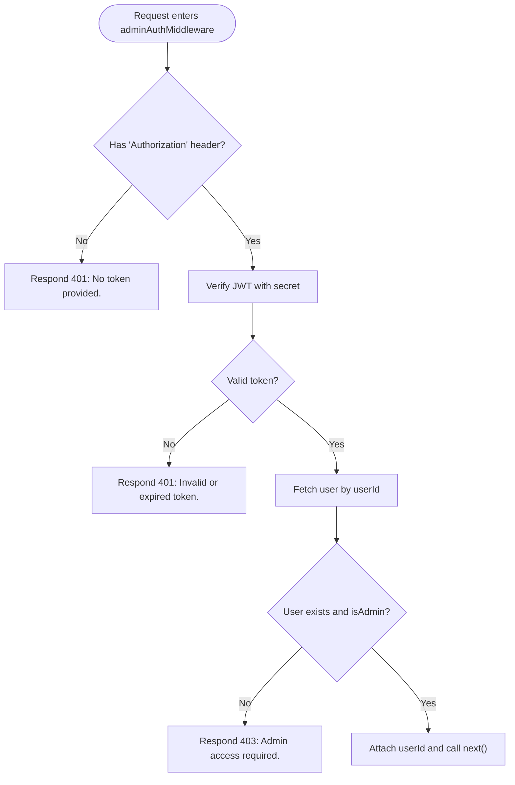
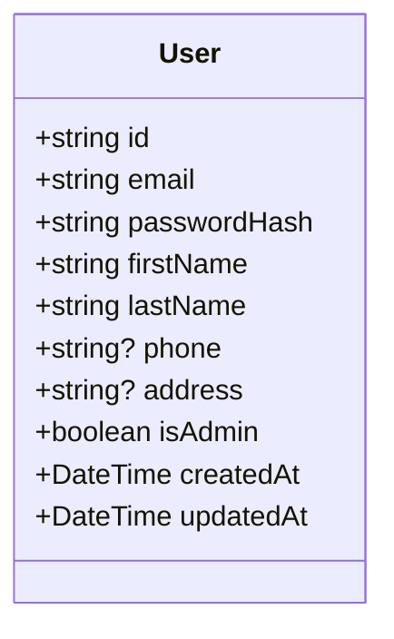
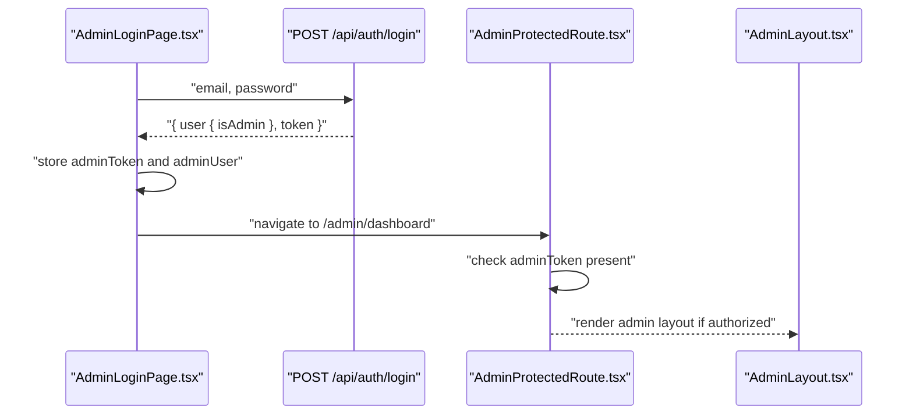
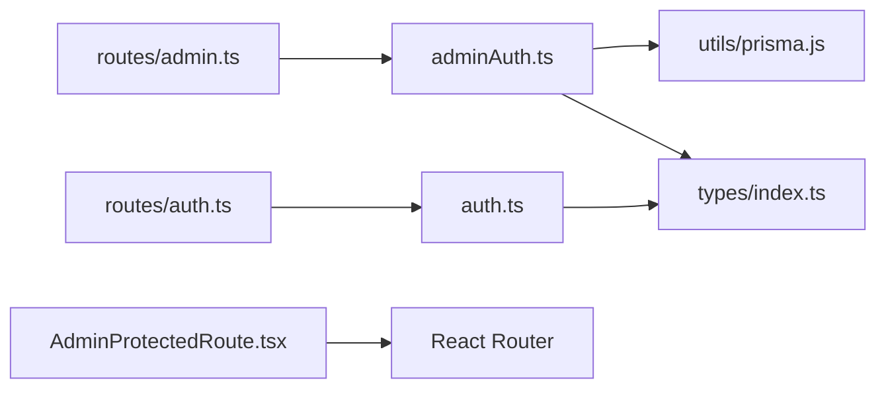

# Admin Authorization Middleware

<cite>
**Referenced Files in This Document**
- [adminAuth.ts](file://backend/src/middleware/adminAuth.ts)
- [auth.ts](file://backend/src/middleware/auth.ts)
- [admin.ts](file://backend/src/routes/admin.ts)
- [auth.ts](file://backend/src/routes/auth.ts)
- [schema.prisma](file://backend/prisma/schema.prisma)
- [seedAdmin.ts](file://backend/src/scripts/seedAdmin.ts)
- [index.ts](file://backend/src/types/index.ts)
- [AdminProtectedRoute.tsx](file://frontend/src/components/AdminProtectedRoute.tsx)
- [AdminLayout.tsx](file://frontend/src/components/AdminLayout.tsx)
- [AdminLoginPage.tsx](file://frontend/src/pages/admin/AdminLoginPage.tsx)
</cite>

## Table of Contents
1. [Introduction](#introduction)
2. [Project Structure](#project-structure)
3. [Core Components](#core-components)
4. [Architecture Overview](#architecture-overview)
5. [Detailed Component Analysis](#detailed-component-analysis)
6. [Dependency Analysis](#dependency-analysis)
7. [Performance Considerations](#performance-considerations)
8. [Troubleshooting Guide](#troubleshooting-guide)
9. [Conclusion](#conclusion)
10. [Appendices](#appendices)

## Introduction
This document explains the admin authorization middleware that enforces administrative privileges across the system. It covers role-based access control (RBAC), permission checking mechanisms, and how admin-only routes are protected. It also details integration with user roles, prevention of privilege escalation, and guidance for extending the authorization system to support multiple admin roles and granular permissions. Where applicable, it includes examples of creating admin-only endpoints, implementing fine-grained permissions, and handling unauthorized access attempts.

## Project Structure
The admin authorization system spans backend middleware, routes, data model, seed script, and frontend routing components:
- Backend middleware validates tokens and admin status before allowing access to protected routes.
- Routes define admin-only endpoints for statistics, users, claims, and documents.
- The data model defines a boolean flag on users to indicate admin status.
- A seed script creates or ensures an admin user exists.
- Frontend guards protect admin pages and enforce client-side checks.

**Diagram sources**
- [adminAuth.ts:6-26](file://backend/src/middleware/adminAuth.ts#L6-L26)
- [auth.ts:5-22](file://backend/src/middleware/auth.ts#L5-L22)
- [admin.ts:1-187](file://backend/src/routes/admin.ts#L1-L187)
- [auth.ts:11-168](file://backend/src/routes/auth.ts#L11-L168)
- [schema.prisma:10-25](file://backend/prisma/schema.prisma#L10-L25)
- [seedAdmin.ts:9-34](file://backend/src/scripts/seedAdmin.ts#L9-L34)
- [AdminProtectedRoute.tsx:3-7](file://frontend/src/components/AdminProtectedRoute.tsx#L3-L7)
- [AdminLayout.tsx:11-74](file://frontend/src/components/AdminLayout.tsx#L11-L74)
- [AdminLoginPage.tsx:13-32](file://frontend/src/pages/admin/AdminLoginPage.tsx#L13-L32)

**Section sources**
- [adminAuth.ts:6-26](file://backend/src/middleware/adminAuth.ts#L6-L26)
- [auth.ts:5-22](file://backend/src/middleware/auth.ts#L5-L22)
- [admin.ts:1-187](file://backend/src/routes/admin.ts#L1-L187)
- [auth.ts:11-168](file://backend/src/routes/auth.ts#L11-L168)
- [schema.prisma:10-25](file://backend/prisma/schema.prisma#L10-L25)
- [seedAdmin.ts:9-34](file://backend/src/scripts/seedAdmin.ts#L9-L34)
- [AdminProtectedRoute.tsx:3-7](file://frontend/src/components/AdminProtectedRoute.tsx#L3-L7)
- [AdminLayout.tsx:11-74](file://frontend/src/components/AdminLayout.tsx#L11-L74)
- [AdminLoginPage.tsx:13-32](file://frontend/src/pages/admin/AdminLoginPage.tsx#L13-L32)

## Core Components
- Admin authorization middleware: Validates JWT presence and signature, fetches the user from the database, and enforces that the user has admin privileges before proceeding.
- Auth middleware: Validates JWT presence and signature for non-admin protected routes.
- Admin routes: Grouped under a router that applies the admin middleware globally, protecting all endpoints beneath it.
- Data model: User entity includes an admin flag used by the middleware to authorize requests.
- Seed script: Ensures an initial admin account exists and is marked as admin.
- Frontend guards: Protect admin UI routes and handle admin login flow.

Key responsibilities:
- Token validation and decoding.
- Role verification against the database.
- Centralized protection of admin endpoints.
- Consistent error responses for missing or invalid tokens and insufficient privileges.

**Section sources**
- [adminAuth.ts:6-26](file://backend/src/middleware/adminAuth.ts#L6-L26)
- [auth.ts:5-22](file://backend/src/middleware/auth.ts#L5-L22)
- [admin.ts:1-187](file://backend/src/routes/admin.ts#L1-L187)
- [schema.prisma:10-25](file://backend/prisma/schema.prisma#L10-L25)
- [seedAdmin.ts:9-34](file://backend/src/scripts/seedAdmin.ts#L9-L34)
- [AdminProtectedRoute.tsx:3-7](file://frontend/src/components/AdminProtectedRoute.tsx#L3-L7)

## Architecture Overview
The authorization architecture uses JWTs issued at login. Regular routes use auth middleware to ensure a valid token. Admin routes use admin middleware to additionally verify that the authenticated user has admin privileges. The frontend enforces admin access via route guards and stores admin tokens locally.

**Diagram sources**
- [auth.ts:62-105](file://backend/src/routes/auth.ts#L62-L105)
- [adminAuth.ts:6-26](file://backend/src/middleware/adminAuth.ts#L6-L26)
- [admin.ts:1-187](file://backend/src/routes/admin.ts#L1-L187)
- [schema.prisma:10-25](file://backend/prisma/schema.prisma#L10-L25)

## Detailed Component Analysis

### Admin Authorization Middleware
Responsibilities:
- Extract and validate the Bearer token.
- Decode payload and retrieve the user record.
- Enforce admin status; otherwise return 401 or 403.
- Attach userId to the request for downstream handlers.

Behavior highlights:
- Missing or malformed token results in 401.
- Invalid/expired token results in 401.
- Non-admin user results in 403.
- Successful admin authentication proceeds to next handler.

**Diagram sources**
- [adminAuth.ts:6-26](file://backend/src/middleware/adminAuth.ts#L6-L26)

**Section sources**
- [adminAuth.ts:6-26](file://backend/src/middleware/adminAuth.ts#L6-L26)

### Auth Middleware (Non-Admin)
Responsibilities:
- Validate Bearer token presence and signature.
- Attach userId to the request for regular protected routes.

Error behavior:
- Missing or invalid token returns 401.

**Section sources**
- [auth.ts:5-22](file://backend/src/middleware/auth.ts#L5-L22)

### Admin Routes Protection
All admin routes are grouped under a router that applies the admin middleware globally. This ensures every endpoint under this router requires an authenticated admin user.

Examples of protected endpoints:
- GET /api/admin/stats
- GET /api/admin/users
- GET /api/admin/claims
- GET /api/admin/claims/:id
- PATCH /api/admin/claims/:id/status
- GET /api/admin/documents
- PATCH /api/admin/documents/:id/approve
- PATCH /api/admin/documents/:id/reject

These endpoints rely on the middleware to gate access and then perform domain-specific logic such as querying claims, updating statuses, and approving or rejecting documents.

**Section sources**
- [admin.ts:1-187](file://backend/src/routes/admin.ts#L1-L187)

### User Roles and Privilege Model
The User model includes an admin flag used to determine administrative privileges. This flag is checked during admin authorization to prevent non-admin users from accessing sensitive endpoints.

**Diagram sources**
- [schema.prisma:10-25](file://backend/prisma/schema.prisma#L10-L25)

**Section sources**
- [schema.prisma:10-25](file://backend/prisma/schema.prisma#L10-L25)

### Admin Account Seeding
A seed script ensures an admin user exists and sets the admin flag appropriately. It either creates a new admin user or updates an existing one to be an admin.

Operational notes:
- Uses bcrypt to hash the password.
- Creates or updates a user with admin privileges.
- Logs created credentials for setup purposes.

**Section sources**
- [seedAdmin.ts:9-34](file://backend/src/scripts/seedAdmin.ts#L9-L34)

### Frontend Admin Access Control
- Admin login page authenticates via the same login endpoint and verifies the returned user has admin privileges before storing the admin token and navigating to the admin dashboard.
- AdminProtectedRoute redirects unauthenticated users to the admin login page.
- AdminLayout provides navigation and logout functionality for the admin panel.

**Diagram sources**
- [AdminLoginPage.tsx:13-32](file://frontend/src/pages/admin/AdminLoginPage.tsx#L13-L32)
- [AdminProtectedRoute.tsx:3-7](file://frontend/src/components/AdminProtectedRoute.tsx#L3-L7)
- [AdminLayout.tsx:11-74](file://frontend/src/components/AdminLayout.tsx#L11-L74)

**Section sources**
- [AdminLoginPage.tsx:13-32](file://frontend/src/pages/admin/AdminLoginPage.tsx#L13-L32)
- [AdminProtectedRoute.tsx:3-7](file://frontend/src/components/AdminProtectedRoute.tsx#L3-L7)
- [AdminLayout.tsx:11-74](file://frontend/src/components/AdminLayout.tsx#L11-L74)

### Permission Checking Mechanisms
- Token-based: All protected endpoints require a valid JWT.
- Role-based: Admin endpoints additionally require the authenticated user to have admin privileges.
- Database-backed: Admin status is verified against the stored user record to prevent stale or tampered tokens from bypassing checks.

This design prevents privilege escalation because even if a token contains only a userId, the server re-validates admin status on each request.

**Section sources**
- [adminAuth.ts:6-26](file://backend/src/middleware/adminAuth.ts#L6-L26)
- [auth.ts:5-22](file://backend/src/middleware/auth.ts#L5-L22)
- [schema.prisma:10-25](file://backend/prisma/schema.prisma#L10-L25)

### Audit Logging for Administrative Actions
Current implementation does not include explicit audit logging for administrative actions. To add audit logging:
- Introduce an AuditLog model to record who performed what action, when, and on which resource.
- Wrap admin route handlers with a logging wrapper that captures method, path, userId, and outcome.
- Persist logs asynchronously to avoid impacting response times.

[No sources needed since this section proposes enhancements without analyzing specific files]

## Dependency Analysis
The admin authorization system depends on:
- JWT library for token verification.
- Prisma client to read user records.
- Express middleware pipeline to apply authorization checks.
- Frontend components to guard routes and manage tokens.

**Diagram sources**
- [adminAuth.ts:1-26](file://backend/src/middleware/adminAuth.ts#L1-L26)
- [auth.ts:1-22](file://backend/src/middleware/auth.ts#L1-L22)
- [admin.ts:1-187](file://backend/src/routes/admin.ts#L1-L187)
- [auth.ts:1-168](file://backend/src/routes/auth.ts#L1-L168)
- [index.ts:3-10](file://backend/src/types/index.ts#L3-L10)
- [AdminProtectedRoute.tsx:1-7](file://frontend/src/components/AdminProtectedRoute.tsx#L1-L7)

**Section sources**
- [adminAuth.ts:1-26](file://backend/src/middleware/adminAuth.ts#L1-L26)
- [auth.ts:1-22](file://backend/src/middleware/auth.ts#L1-L22)
- [admin.ts:1-187](file://backend/src/routes/admin.ts#L1-L187)
- [auth.ts:1-168](file://backend/src/routes/auth.ts#L1-L168)
- [index.ts:3-10](file://backend/src/types/index.ts#L3-L10)
- [AdminProtectedRoute.tsx:1-7](file://frontend/src/components/AdminProtectedRoute.tsx#L1-L7)

## Performance Considerations
- Each admin request performs a database lookup to verify admin status. For high-traffic systems, consider caching user roles in memory with short TTLs to reduce DB load.
- Ensure indexes on frequently queried fields (e.g., userId) to speed up lookups.
- Avoid heavy operations inside middleware; keep middleware lightweight and delegate business logic to route handlers.

[No sources needed since this section provides general guidance]

## Troubleshooting Guide
Common issues and resolutions:
- 401 Unauthorized:
  - Missing Authorization header or malformed token format.
  - Invalid or expired token.
  - Resolution: Ensure the client sends a valid Bearer token and that the server’s JWT secret is configured correctly.
- 403 Forbidden:
  - User is authenticated but not an admin.
  - Resolution: Confirm the user’s admin flag is set in the database and that the correct token is being used.
- Frontend redirect loops:
  - AdminProtectedRoute may redirect if no admin token is present.
  - Resolution: Ensure the admin login flow stores the token and navigates to protected routes after successful login.

**Section sources**
- [adminAuth.ts:6-26](file://backend/src/middleware/adminAuth.ts#L6-L26)
- [auth.ts:5-22](file://backend/src/middleware/auth.ts#L5-L22)
- [AdminProtectedRoute.tsx:3-7](file://frontend/src/components/AdminProtectedRoute.tsx#L3-L7)
- [AdminLoginPage.tsx:13-32](file://frontend/src/pages/admin/AdminLoginPage.tsx#L13-L32)

## Conclusion
The admin authorization middleware provides robust, database-backed enforcement of administrative privileges using JWTs. It integrates cleanly with existing authentication flows and protects all admin routes through a single middleware application. While the current implementation lacks granular role-based permissions and audit logging, it offers a solid foundation to extend into multi-role systems and comprehensive auditing.

[No sources needed since this section summarizes without analyzing specific files]

## Appendices

### Examples: Creating Admin-Only Endpoints
- Define a new route under the admin router where the global admin middleware is already applied.
- Implement your handler logic; access to the route will automatically require a valid admin token.

Reference paths:
- [admin.ts:1-187](file://backend/src/routes/admin.ts#L1-L187)

**Section sources**
- [admin.ts:1-187](file://backend/src/routes/admin.ts#L1-L187)

### Examples: Implementing Granular Permissions
To implement granular permissions beyond simple admin flags:
- Extend the User model with a roles field or a separate Role model with permissions.
- Create a middleware that decodes the token, loads roles/permissions, and checks them per endpoint.
- Apply role-based middleware selectively on routes requiring specific capabilities.

[No sources needed since this section proposes enhancements without analyzing specific files]

### Handling Unauthorized Access Attempts
- Return consistent error messages for missing tokens, invalid tokens, and insufficient privileges.
- Log failed attempts for security monitoring.
- On the frontend, redirect to login or display appropriate errors.

Reference paths:
- [adminAuth.ts:6-26](file://backend/src/middleware/adminAuth.ts#L6-L26)
- [auth.ts:5-22](file://backend/src/middleware/auth.ts#L5-L22)
- [AdminProtectedRoute.tsx:3-7](file://frontend/src/components/AdminProtectedRoute.tsx#L3-L7)

**Section sources**
- [adminAuth.ts:6-26](file://backend/src/middleware/adminAuth.ts#L6-L26)
- [auth.ts:5-22](file://backend/src/middleware/auth.ts#L5-L22)
- [AdminProtectedRoute.tsx:3-7](file://frontend/src/components/AdminProtectedRoute.tsx#L3-L7)

### Extending the Authorization System for Different Admin Roles
Recommended steps:
- Add a roles column or a Role table to represent distinct admin roles (e.g., super_admin, reviewer).
- Store roles in the JWT payload or fetch them per request.
- Build a role-checking middleware that compares requested permissions against the user’s roles.
- Update admin routes to require specific roles or permissions.

[No sources needed since this section proposes enhancements without analyzing specific files]