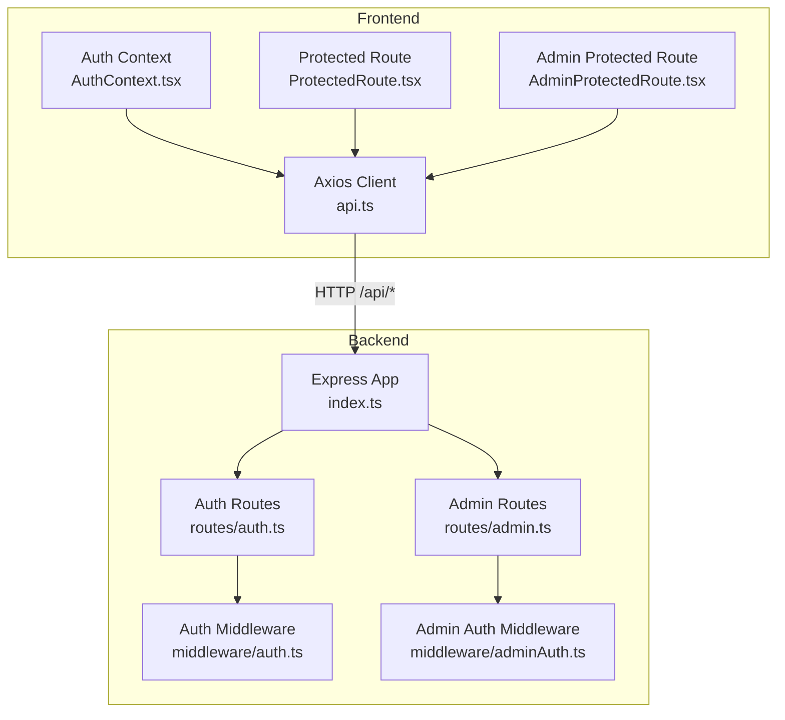
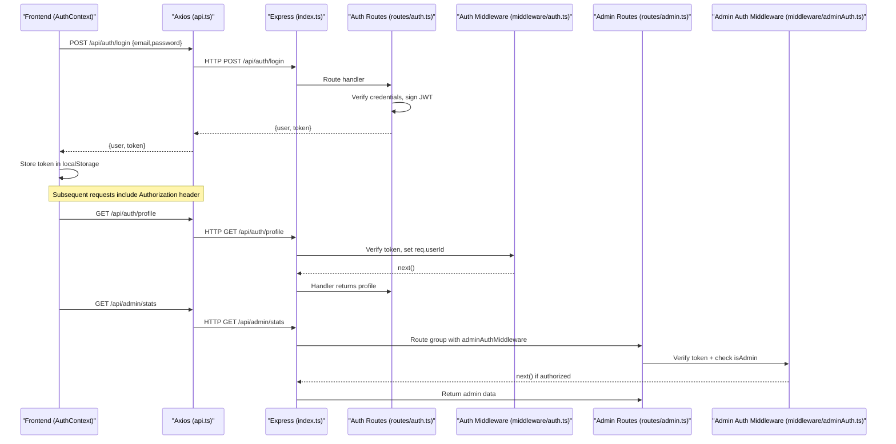
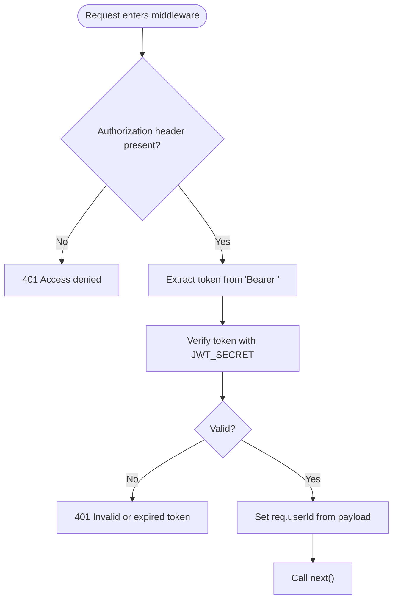
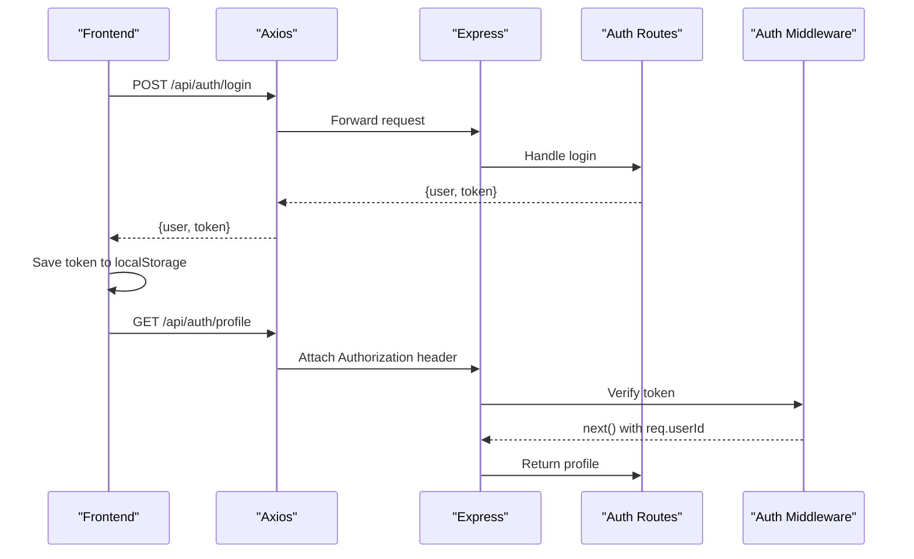
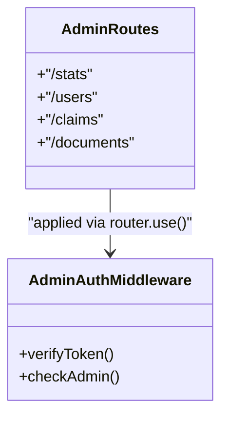
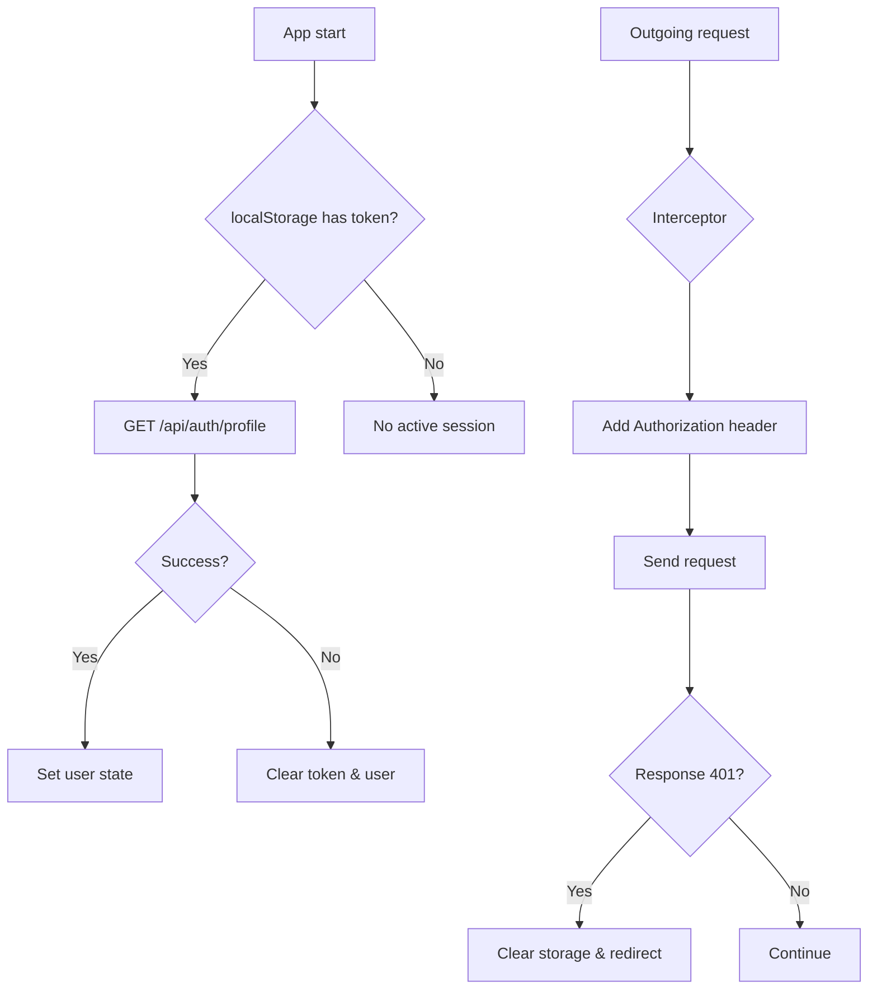
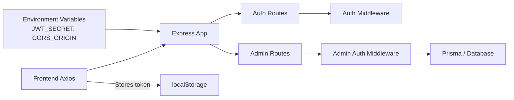

# Authentication Middleware

<cite>
**Referenced Files in This Document**
- [auth.ts](file://backend/src/middleware/auth.ts)
- [adminAuth.ts](file://backend/src/middleware/adminAuth.ts)
- [auth.ts](file://backend/src/routes/auth.ts)
- [admin.ts](file://backend/src/routes/admin.ts)
- [index.ts](file://backend/src/index.ts)
- [index.ts](file://backend/src/types/index.ts)
- [api.ts](file://frontend/src/services/api.ts)
- [AuthContext.tsx](file://frontend/src/context/AuthContext.tsx)
- [ProtectedRoute.tsx](file://frontend/src/components/ProtectedRoute.tsx)
- [AdminProtectedRoute.tsx](file://frontend/src/components/AdminProtectedRoute.tsx)
</cite>

## Table of Contents
1. [Introduction](#introduction)
2. [Project Structure](#project-structure)
3. [Core Components](#core-components)
4. [Architecture Overview](#architecture-overview)
5. [Detailed Component Analysis](#detailed-component-analysis)
6. [Dependency Analysis](#dependency-analysis)
7. [Performance Considerations](#performance-considerations)
8. [Troubleshooting Guide](#troubleshooting-guide)
9. [Conclusion](#conclusion)
10. [Appendices](#appendices)

## Introduction
This document explains the JWT-based authentication middleware used by the backend and how it integrates with the frontend to protect routes, manage user sessions, and enforce role-based access control. It covers token validation, request context augmentation, the login-to-protected-route flow, token expiration handling, and best practices for security and storage.

## Project Structure
The authentication system spans both backend and frontend:
- Backend Express app registers API routes and applies middleware to protect endpoints.
- Frontend Axios client attaches tokens to requests and handles 401 responses.
- React components guard routes based on authentication state.

**Diagram sources**
- [index.ts:25-45](file://backend/src/index.ts#L25-L45)
- [auth.ts:5-22](file://backend/src/middleware/auth.ts#L5-L22)
- [adminAuth.ts:6-26](file://backend/src/middleware/adminAuth.ts#L6-L26)
- [auth.ts:10-168](file://backend/src/routes/auth.ts#L10-L168)
- [admin.ts:1-8](file://backend/src/routes/admin.ts#L1-L8)
- [api.ts:11-37](file://frontend/src/services/api.ts#L11-L37)
- [AuthContext.tsx:17-73](file://frontend/src/context/AuthContext.tsx#L17-L73)
- [ProtectedRoute.tsx:4-20](file://frontend/src/components/ProtectedRoute.tsx#L4-L20)
- [AdminProtectedRoute.tsx:3-7](file://frontend/src/components/AdminProtectedRoute.tsx#L3-L7)

**Section sources**
- [index.ts:25-45](file://backend/src/index.ts#L25-L45)
- [api.ts:11-37](file://frontend/src/services/api.ts#L11-L37)
- [AuthContext.tsx:17-73](file://frontend/src/context/AuthContext.tsx#L17-L73)

## Core Components
- Token issuance and verification:
  - Login and registration issue JWTs with a fixed expiration window.
  - Middleware verifies tokens using the configured secret and augments the request with user identity.
- Role-based protection:
  - General auth middleware ensures a valid token is present.
  - Admin middleware additionally checks that the authenticated user has admin privileges.
- Frontend integration:
  - Axios interceptor injects Authorization headers automatically.
  - 401 responses clear local storage and redirect to login.
  - React route guards prevent unauthenticated or non-admin navigation.

Key responsibilities:
- Validate tokens and set req.userId for downstream handlers.
- Enforce admin-only access on protected admin routes.
- Persist tokens in the browser and attach them to outgoing requests.

**Section sources**
- [auth.ts:5-22](file://backend/src/middleware/auth.ts#L5-L22)
- [adminAuth.ts:6-26](file://backend/src/middleware/adminAuth.ts#L6-L26)
- [auth.ts:10-168](file://backend/src/routes/auth.ts#L10-L168)
- [admin.ts:1-8](file://backend/src/routes/admin.ts#L1-L8)
- [api.ts:11-37](file://frontend/src/services/api.ts#L11-L37)
- [AuthContext.tsx:17-73](file://frontend/src/context/AuthContext.tsx#L17-L73)

## Architecture Overview
End-to-end authentication flow from login to protected route access:

**Diagram sources**
- [auth.ts:61-105](file://backend/src/routes/auth.ts#L61-L105)
- [auth.ts:107-134](file://backend/src/routes/auth.ts#L107-L134)
- [auth.ts:136-165](file://backend/src/routes/auth.ts#L136-L165)
- [auth.ts:5-22](file://backend/src/middleware/auth.ts#L5-L22)
- [admin.ts:1-8](file://backend/src/routes/admin.ts#L1-L8)
- [adminAuth.ts:6-26](file://backend/src/middleware/adminAuth.ts#L6-L26)
- [api.ts:11-37](file://frontend/src/services/api.ts#L11-L37)
- [AuthContext.tsx:38-54](file://frontend/src/context/AuthContext.tsx#L38-L54)

## Detailed Component Analysis

### Token Validation and Request Context Augmentation
- The general auth middleware extracts the Authorization header, validates the token against the configured secret, and sets req.userId on success. On failure, it responds with 401.
- The admin auth middleware performs the same token validation and then queries the database to ensure the user exists and has admin privileges before allowing access.

**Diagram sources**
- [auth.ts:5-22](file://backend/src/middleware/auth.ts#L5-L22)
- [adminAuth.ts:6-26](file://backend/src/middleware/adminAuth.ts#L6-L26)

**Section sources**
- [auth.ts:5-22](file://backend/src/middleware/auth.ts#L5-L22)
- [adminAuth.ts:6-26](file://backend/src/middleware/adminAuth.ts#L6-L26)
- [index.ts:1-10](file://backend/src/types/index.ts#L1-L10)

### Authentication Flow: Login and Protected Routes
- Login endpoint authenticates credentials and issues a JWT with a fixed expiration window.
- Registration also returns a JWT upon successful account creation.
- Protected routes use the auth middleware to require a valid token; admin routes add an additional admin check.

**Diagram sources**
- [auth.ts:61-105](file://backend/src/routes/auth.ts#L61-L105)
- [auth.ts:107-134](file://backend/src/routes/auth.ts#L107-L134)
- [auth.ts:5-22](file://backend/src/middleware/auth.ts#L5-L22)
- [api.ts:11-37](file://frontend/src/services/api.ts#L11-L37)

**Section sources**
- [auth.ts:10-168](file://backend/src/routes/auth.ts#L10-L168)
- [api.ts:11-37](file://frontend/src/services/api.ts#L11-L37)

### Role-Based Access Control (RBAC)
- Admin routes are grouped under a router that applies adminAuthMiddleware globally, ensuring all admin endpoints require a valid token and an admin user.
- The frontend includes an admin route guard that checks for an admin token stored in localStorage before rendering admin pages.

**Diagram sources**
- [admin.ts:1-8](file://backend/src/routes/admin.ts#L1-L8)
- [adminAuth.ts:6-26](file://backend/src/middleware/adminAuth.ts#L6-L26)

**Section sources**
- [admin.ts:1-8](file://backend/src/routes/admin.ts#L1-L8)
- [adminAuth.ts:6-26](file://backend/src/middleware/adminAuth.ts#L6-L26)
- [AdminProtectedRoute.tsx:3-7](file://frontend/src/components/AdminProtectedRoute.tsx#L3-L7)

### Token Storage and Automatic Header Injection
- The frontend stores the token in localStorage after login/register and restores session state on app load by calling the profile endpoint.
- An Axios interceptor automatically adds the Authorization header to every request when a token exists.
- On 401 responses, the interceptor clears stored tokens and redirects to the login page.

**Diagram sources**
- [AuthContext.tsx:17-73](file://frontend/src/context/AuthContext.tsx#L17-L73)
- [api.ts:11-37](file://frontend/src/services/api.ts#L11-L37)

**Section sources**
- [AuthContext.tsx:17-73](file://frontend/src/context/AuthContext.tsx#L17-L73)
- [api.ts:11-37](file://frontend/src/services/api.ts#L11-L37)

### Protecting Routes and Extracting User Information
- Protecting routes:
  - Backend: Apply authMiddleware to any route that requires authentication.
  - Frontend: Use ProtectedRoute to guard UI routes; use AdminProtectedRoute for admin-only pages.
- Extracting user information:
  - Backend: After middleware runs, handlers can read req.userId to fetch user-specific data.
  - Frontend: The AuthContext exposes the current user object and token for UI logic.

Examples of usage patterns:
- Protect a profile endpoint with authMiddleware and return user details based on req.userId.
- Guard admin endpoints with adminAuthMiddleware to restrict access to administrators.
- Wrap frontend routes with ProtectedRoute to prevent unauthenticated users from accessing sensitive pages.

**Section sources**
- [auth.ts:107-165](file://backend/src/routes/auth.ts#L107-L165)
- [admin.ts:1-8](file://backend/src/routes/admin.ts#L1-L8)
- [ProtectedRoute.tsx:4-20](file://frontend/src/components/ProtectedRoute.tsx#L4-L20)
- [AdminProtectedRoute.tsx:3-7](file://frontend/src/components/AdminProtectedRoute.tsx#L3-L7)

### Token Refresh Strategies and Expiration Handling
Current implementation:
- Tokens are issued with a fixed expiration window.
- There is no explicit refresh token mechanism implemented in the codebase.
- When a token expires, the backend middleware rejects requests with 401, and the frontend interceptor clears local storage and redirects to login.

Recommended enhancements:
- Implement a short-lived access token paired with a long-lived refresh token stored securely (e.g., httpOnly cookie).
- Provide a /refresh endpoint that exchanges a valid refresh token for a new access token without requiring re-authentication.
- On receiving 401, attempt a silent refresh before prompting the user to log in again.

**Section sources**
- [auth.ts:61-105](file://backend/src/routes/auth.ts#L61-L105)
- [api.ts:26-37](file://frontend/src/services/api.ts#L26-L37)

## Dependency Analysis
The authentication system depends on:
- JSON Web Tokens for stateless authentication.
- Environment configuration for secrets and CORS settings.
- Database access for admin authorization checks.
- Frontend Axios interceptors for seamless token management.

**Diagram sources**
- [index.ts:13-45](file://backend/src/index.ts#L13-L45)
- [auth.ts:5-22](file://backend/src/middleware/auth.ts#L5-L22)
- [adminAuth.ts:6-26](file://backend/src/middleware/adminAuth.ts#L6-L26)
- [api.ts:11-37](file://frontend/src/services/api.ts#L11-L37)

**Section sources**
- [index.ts:13-45](file://backend/src/index.ts#L13-L45)
- [auth.ts:5-22](file://backend/src/middleware/auth.ts#L5-L22)
- [adminAuth.ts:6-26](file://backend/src/middleware/adminAuth.ts#L6-L26)
- [api.ts:11-37](file://frontend/src/services/api.ts#L11-L37)

## Performance Considerations
- Token verification is lightweight and stateless; avoid unnecessary database calls in general auth middleware.
- Admin middleware performs a database lookup per request; consider caching admin status if appropriate for your workload.
- Keep token payloads minimal to reduce network overhead.
- Ensure CORS is configured precisely to minimize preflight overhead.

[No sources needed since this section provides general guidance]

## Troubleshooting Guide
Common issues and resolutions:
- Missing or malformed Authorization header:
  - Ensure the frontend attaches Authorization: Bearer <token> to requests.
  - Verify the Axios interceptor is enabled and not overridden.
- Invalid or expired token:
  - Backend returns 401; frontend clears storage and redirects to login.
  - Re-authenticate to obtain a new token.
- Admin access denied:
  - Backend returns 403 if the user is not an admin.
  - Confirm the user’s admin flag in the database and that the token is valid.
- CORS errors:
  - Ensure CORS_ORIGIN matches the frontend origin and credentials are allowed.

Operational tips:
- Log failed verifications during development to identify misconfigurations.
- Validate environment variables at startup to catch missing secrets early.

**Section sources**
- [auth.ts:5-22](file://backend/src/middleware/auth.ts#L5-L22)
- [adminAuth.ts:6-26](file://backend/src/middleware/adminAuth.ts#L6-L26)
- [api.ts:26-37](file://frontend/src/services/api.ts#L26-L37)
- [index.ts:15-22](file://backend/src/index.ts#L15-L22)

## Conclusion
The authentication system uses JWTs to secure backend routes and manages sessions on the frontend through localStorage and Axios interceptors. General and admin middleware provide layered protection, while route guards enforce client-side access control. While there is no built-in token refresh flow, the architecture supports adding refresh tokens and silent renewal to improve resilience against token expiration. Following the recommended security practices will strengthen the overall authentication posture.

[No sources needed since this section summarizes without analyzing specific files]

## Appendices

### Security Best Practices
- Store secrets in environment variables and validate them at startup.
- Use HTTPS in production to protect tokens in transit.
- Prefer httpOnly cookies for storing tokens to mitigate XSS risks.
- Limit token payload size and scope to only necessary claims.
- Implement rate limiting on login and registration endpoints.
- Log authentication events for auditability without logging sensitive data.

[No sources needed since this section provides general guidance]

### Token Storage Strategies
- Current approach: localStorage for tokens.
- Recommended: httpOnly cookies for server-managed tokens; consider short-lived access tokens with refresh tokens.
- Avoid storing tokens in memory-only strategies for SPAs unless you implement robust token refresh flows.

[No sources needed since this section provides general guidance]

### Handling Authentication Failures
- Backend: Return consistent 401/403 responses with clear error messages.
- Frontend: Intercept 401 to clear local state and redirect to login; optionally attempt token refresh before prompting re-login.
- UX: Show meaningful messages to users and allow easy re-authentication.

**Section sources**
- [auth.ts:5-22](file://backend/src/middleware/auth.ts#L5-L22)
- [adminAuth.ts:6-26](file://backend/src/middleware/adminAuth.ts#L6-L26)
- [api.ts:26-37](file://frontend/src/services/api.ts#L26-L37)