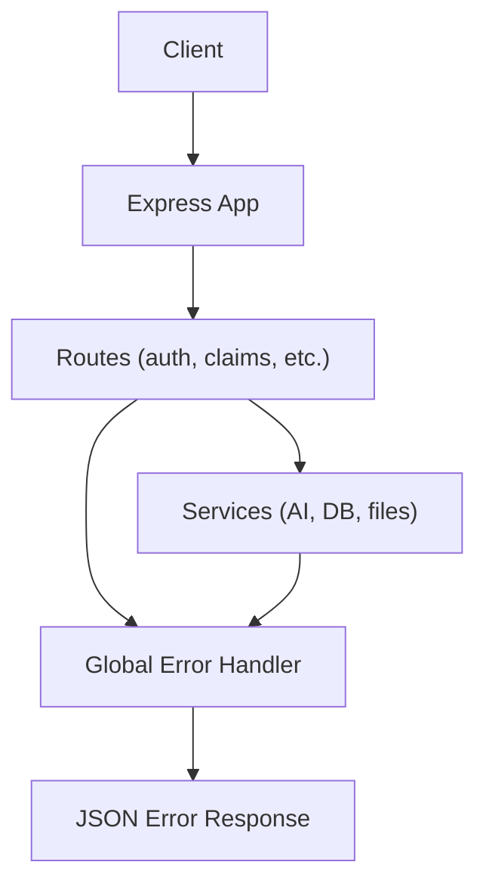
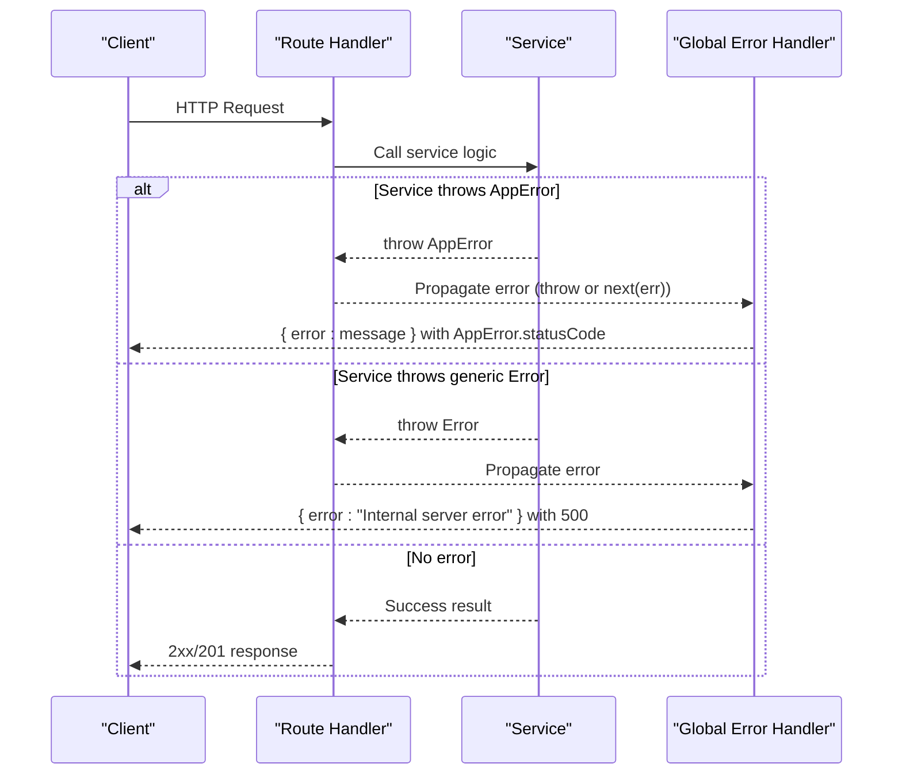
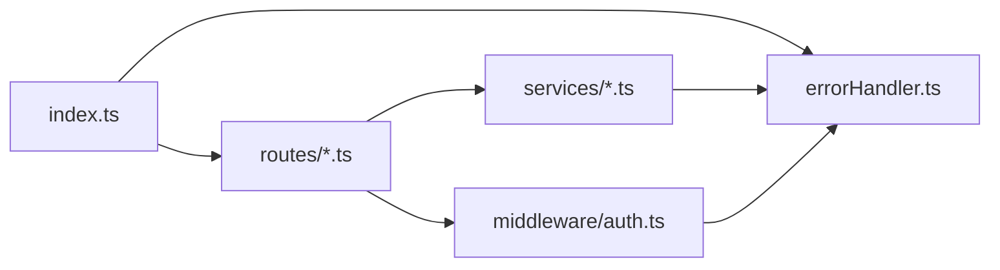

# Error Handling Middleware

<cite>
**Referenced Files in This Document**
- [errorHandler.ts](file://backend/src/middleware/errorHandler.ts)
- [index.ts](file://backend/src/index.ts)
- [auth.ts](file://backend/src/routes/auth.ts)
- [claims.ts](file://backend/src/routes/claims.ts)
- [auth.ts](file://backend/src/middleware/auth.ts)
- [claimAssistantService.ts](file://backend/src/services/claimAssistantService.ts)
</cite>

## Table of Contents
1. [Introduction](#introduction)
2. [Project Structure](#project-structure)
3. [Core Components](#core-components)
4. [Architecture Overview](#architecture-overview)
5. [Detailed Component Analysis](#detailed-component-analysis)
6. [Dependency Analysis](#dependency-analysis)
7. [Performance Considerations](#performance-considerations)
8. [Troubleshooting Guide](#troubleshooting-guide)
9. [Conclusion](#conclusion)

## Introduction
This document explains the error handling middleware system for the backend API. It covers the AppError class, the centralized Express error middleware, how errors propagate through the request pipeline, how responses are formatted, and where logging occurs. It also provides guidance on throwing custom errors from services, handling asynchronous errors consistently, and maintaining uniform error responses across the API.

## Project Structure
The error handling is implemented as a dedicated middleware module and registered globally in the application bootstrap. Routes and services currently handle validation and business errors by responding directly with status codes and JSON bodies. The global error handler is present and ready to standardize error responses when routes throw errors or pass them via next().

**Diagram sources**
- [index.ts:25-58](file://backend/src/index.ts#L25-L58)
- [errorHandler.ts:13-27](file://backend/src/middleware/errorHandler.ts#L13-L27)

**Section sources**
- [index.ts:25-58](file://backend/src/index.ts#L25-L58)
- [errorHandler.ts:13-27](file://backend/src/middleware/errorHandler.ts#L13-L27)

## Core Components
- AppError class: A typed error that carries a numeric HTTP status code alongside the message.
- Global error handler: An Express error middleware that logs the error, distinguishes AppError instances, and returns consistent JSON error responses.

Key behaviors:
- Logging: All errors are logged to the console with a simple prefix.
- Status mapping: AppError uses its statusCode; unknown errors default to 500.
- Response shape: Errors return a JSON object with an error field containing the message.

**Section sources**
- [errorHandler.ts:3-11](file://backend/src/middleware/errorHandler.ts#L3-L11)
- [errorHandler.ts:13-27](file://backend/src/middleware/errorHandler.ts#L13-L27)

## Architecture Overview
The application registers the global error handler after all routes so it can catch thrown errors and unhandled rejections that bubble up. Currently, most route handlers use try/catch and respond directly with status codes and JSON bodies. To fully leverage the global handler, routes should either throw AppError or call next(error).

**Diagram sources**
- [index.ts:40-58](file://backend/src/index.ts#L40-L58)
- [errorHandler.ts:13-27](file://backend/src/middleware/errorHandler.ts#L13-L27)

## Detailed Component Analysis

### AppError Class
- Purpose: Encapsulate domain/business errors with explicit HTTP status codes.
- Fields:
  - message: inherited from Error
  - statusCode: numeric HTTP status (defaults to 500 if not provided)
  - name: set to 'AppError' for easy identification

Usage pattern:
- Throw AppError with a descriptive message and appropriate status code from services or controllers/route handlers.
- Example statuses:
  - 400 Bad Request for validation failures
  - 401 Unauthorized for authentication issues
  - 403 Forbidden for authorization issues
  - 404 Not Found for missing resources
  - 409 Conflict for duplicate entities
  - 500 Internal Server Error for unexpected failures

**Section sources**
- [errorHandler.ts:3-11](file://backend/src/middleware/errorHandler.ts#L3-L11)

### Global Error Handler
- Role: Centralized error capture and response formatting.
- Behavior:
  - Logs the error message to the console.
  - If the error is an instance of AppError, responds with its statusCode and message.
  - Otherwise, responds with 500 and a generic message.

Integration:
- Registered once in the app bootstrap after all routes, ensuring it catches errors from any route or middleware.

**Section sources**
- [errorHandler.ts:13-27](file://backend/src/middleware/errorHandler.ts#L13-L27)
- [index.ts:57-58](file://backend/src/index.ts#L57-L58)

### Current Route-Level Error Handling
- Validation and business checks often respond directly with status codes and JSON bodies (e.g., 400, 401, 404, 409).
- Asynchronous errors are caught with try/catch and converted into 500 responses with a generic message.
- Some background tasks (e.g., async operations started without awaiting) log errors but do not affect the response.

Implications:
- Responses are inconsistent: some paths return structured errors, others return generic messages.
- The global error handler is underutilized because routes rarely throw or pass errors to next().

**Section sources**
- [auth.ts:11-59](file://backend/src/routes/auth.ts#L11-L59)
- [auth.ts:61-105](file://backend/src/routes/auth.ts#L61-L105)
- [auth.ts:107-134](file://backend/src/routes/auth.ts#L107-L134)
- [auth.ts:136-165](file://backend/src/routes/auth.ts#L136-L165)
- [claims.ts:21-57](file://backend/src/routes/claims.ts#L21-L57)
- [claims.ts:152-193](file://backend/src/routes/claims.ts#L152-L193)
- [claims.ts:270-288](file://backend/src/routes/claims.ts#L270-L288)
- [claims.ts:290-314](file://backend/src/routes/claims.ts#L290-L314)
- [claims.ts:316-353](file://backend/src/routes/claims.ts#L316-L353)
- [claims.ts:379-397](file://backend/src/routes/claims.ts#L379-L397)
- [claims.ts:423-447](file://backend/src/routes/claims.ts#L423-L447)

### Service-Level Errors
- Services throw plain Error objects for specific conditions (e.g., resource not found, missing inputs).
- These errors are not wrapped in AppError, so they will be treated as internal server errors by the global handler unless routes catch and map them.

Recommendation:
- Wrap service-level errors with AppError using appropriate status codes to centralize response formatting.

**Section sources**
- [claimAssistantService.ts:19-38](file://backend/src/services/claimAssistantService.ts#L19-L38)

### Authentication Middleware Errors
- The auth middleware validates tokens and responds directly with 401 and a JSON body when invalid or missing.
- This bypasses the global error handler and is acceptable for auth-specific flows, but consider unifying with AppError for consistency.

**Section sources**
- [auth.ts:5-22](file://backend/src/middleware/auth.ts#L5-L22)

## Dependency Analysis
- index.ts imports and registers errorHandler after routes.
- errorHandler depends on AppError to differentiate known vs unknown errors.
- Routes depend on services; services may throw errors that need to be mapped to AppError upstream.
- Auth middleware short-circuits with 401 responses for token issues.

**Diagram sources**
- [index.ts:5-11](file://backend/src/index.ts#L5-L11)
- [index.ts:40-58](file://backend/src/index.ts#L40-L58)
- [errorHandler.ts:1-27](file://backend/src/middleware/errorHandler.ts#L1-L27)
- [auth.ts:5-22](file://backend/src/middleware/auth.ts#L5-L22)

**Section sources**
- [index.ts:5-11](file://backend/src/index.ts#L5-L11)
- [index.ts:40-58](file://backend/src/index.ts#L40-L58)
- [errorHandler.ts:1-27](file://backend/src/middleware/errorHandler.ts#L1-L27)
- [auth.ts:5-22](file://backend/src/middleware/auth.ts#L5-L22)

## Performance Considerations
- Logging overhead: The current logger writes to console.error for every error. In production, consider structured logging to a file or external service.
- Error propagation cost: Throwing and catching errors has minimal overhead compared to I/O operations. Prefer throwing AppError to avoid duplicated error-handling code.
- Background tasks: Async operations detached from the request lifecycle (e.g., background analysis) should log failures separately to avoid blocking responses.

[No sources needed since this section provides general guidance]

## Troubleshooting Guide
Common scenarios and how to debug:

- Unexpected 500 responses:
  - Check if the route’s try/catch is swallowing the error and returning a generic message.
  - Ensure services throw AppError with the correct status code instead of generic Error.
  - Verify the global error handler is registered last in the middleware stack.

- Missing error details:
  - The current handler only logs the message. Enhance logging to include stack traces and request context (method, URL, userId) for debugging.

- Inconsistent responses:
  - Standardize by always throwing AppError from services and letting the global handler format responses.
  - Remove ad-hoc error responses in routes and replace with throw new AppError(message, status).

- Authentication failures:
  - The auth middleware returns 401 directly. If you want unified behavior, convert these to AppError(401) and let the global handler respond.

- Background task failures:
  - Ensure background promises are properly handled with .catch() and logged. Do not rely on the global error handler for detached tasks.

**Section sources**
- [errorHandler.ts:13-27](file://backend/src/middleware/errorHandler.ts#L13-L27)
- [auth.ts:5-22](file://backend/src/middleware/auth.ts#L5-L22)
- [claims.ts:152-193](file://backend/src/routes/claims.ts#L152-L193)

## Conclusion
The backend defines a solid foundation for error handling with AppError and a global Express error middleware. However, current route implementations largely bypass the global handler by responding directly. To achieve consistent, maintainable error handling:

- Convert service-level errors to AppError with precise status codes.
- Update routes to throw AppError or pass errors to next(), removing inline error responses.
- Keep the global error handler as the single source of truth for error formatting and logging.
- Extend logging to include request context and stack traces for better diagnostics.
- Treat authentication middleware similarly by using AppError for standardized responses.

Adopting these practices will ensure uniform error responses, clearer debugging, and easier maintenance across the API.

[No sources needed since this section summarizes without analyzing specific files]