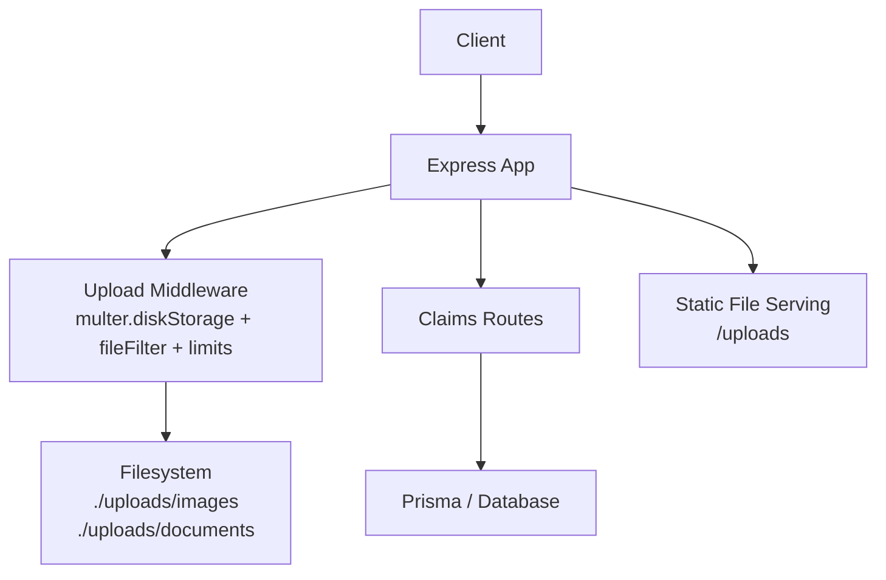
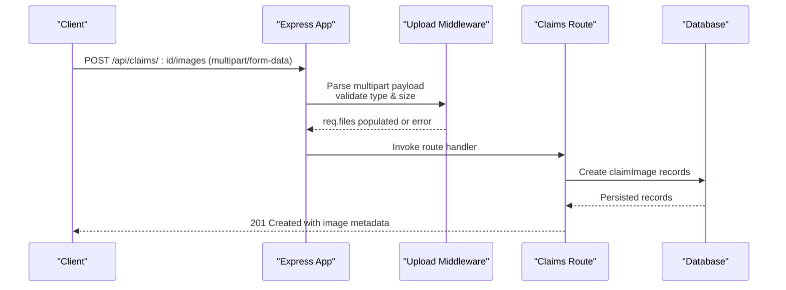
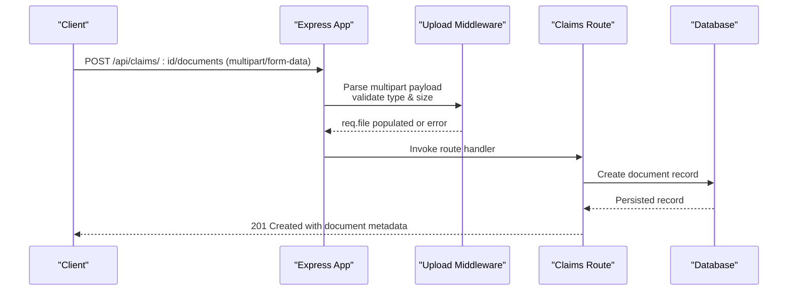
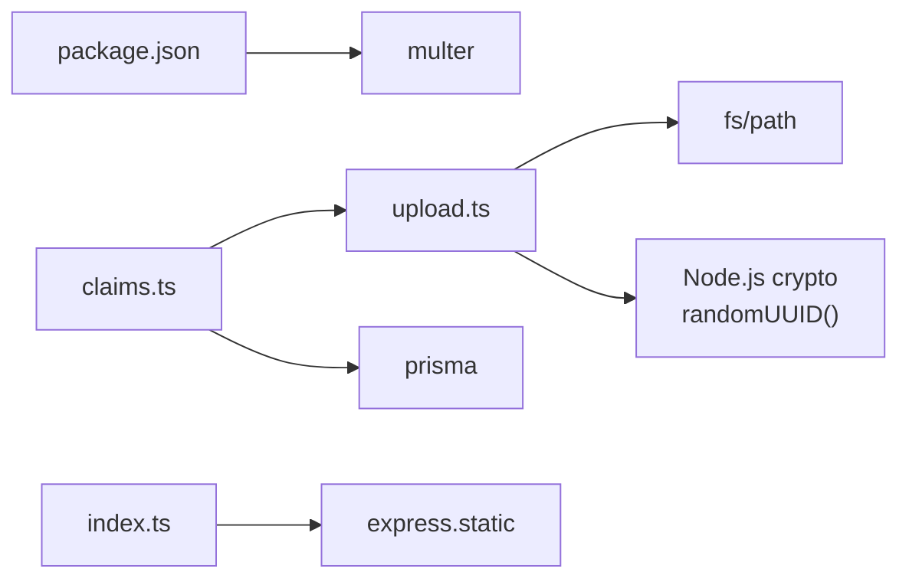
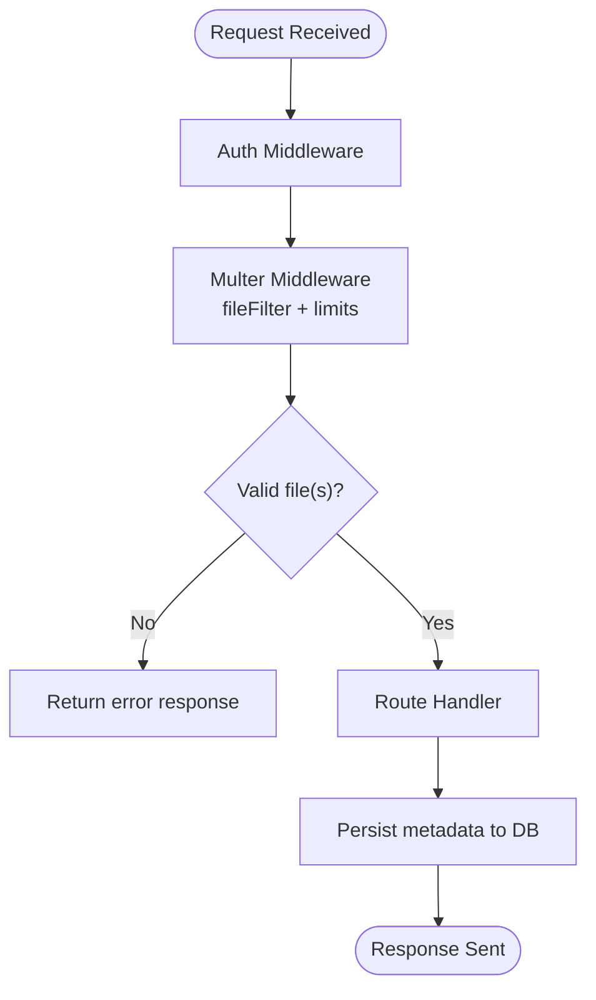

# File Upload Middleware

<cite>
**Referenced Files in This Document**
- [upload.ts](file://backend/src/middleware/upload.ts)
- [claims.ts](file://backend/src/routes/claims.ts)
- [index.ts](file://backend/src/index.ts)
- [errorHandler.ts](file://backend/src/middleware/errorHandler.ts)
- [package.json](file://backend/package.json)
</cite>

## Update Summary
**Changes Made**
- Updated filename generation implementation to use Node.js built-in crypto.randomUUID() function
- Removed dependency on external uuid npm package
- Enhanced performance by eliminating unnecessary third-party dependencies
- Maintained identical functionality for generating unique filenames

## Table of Contents
1. [Introduction](#introduction)
2. [Project Structure](#project-structure)
3. [Core Components](#core-components)
4. [Architecture Overview](#architecture-overview)
5. [Detailed Component Analysis](#detailed-component-analysis)
6. [Dependency Analysis](#dependency-analysis)
7. [Performance Considerations](#performance-considerations)
8. [Troubleshooting Guide](#troubleshooting-guide)
9. [Conclusion](#conclusion)
10. [Appendices](#appendices)

## Introduction
This document explains the file upload middleware implementation using Multer in the backend. It covers configuration for size limits, file type validation, storage destination setup, and how uploads are integrated into the claims routes. It also outlines security measures against malicious uploads, guidance for handling multiple files, image optimization, temporary file cleanup, cloud storage integration, progress tracking, and graceful failure handling.

**Updated** The filename generation now uses Node.js built-in `crypto.randomUUID()` function instead of an external uuid package, providing better performance and reduced dependencies while maintaining identical functionality.

## Project Structure
The upload functionality is implemented as a reusable middleware module and consumed by specific routes:
- The upload middleware defines storage strategy, file filtering, and size limits.
- Routes use the middleware to accept single or multiple file uploads and persist metadata to the database.
- Static file serving exposes uploaded files via a public path.

**Diagram sources**
- [index.ts:36-38](file://backend/src/index.ts#L36-L38)
- [upload.ts:17-47](file://backend/src/middleware/upload.ts#L17-L47)
- [claims.ts:195-233](file://backend/src/routes/claims.ts#L195-L233)
- [claims.ts:316-353](file://backend/src/routes/claims.ts#L316-L353)

**Section sources**
- [index.ts:36-38](file://backend/src/index.ts#L36-L38)
- [upload.ts:1-54](file://backend/src/middleware/upload.ts#L1-54)
- [claims.ts:195-233](file://backend/src/routes/claims.ts#L195-233)
- [claims.ts:316-353](file://backend/src/routes/claims.ts#L316-353)

## Core Components
- Storage strategy: Disk storage with per-file naming and subdirectories based on field name.
- File type validation: Whitelist of allowed MIME types for images.
- Size limits: Maximum file size enforced by Multer.
- Route handlers: Endpoints for uploading multiple images and single documents, storing references in the database.
- Static serving: Public exposure of uploaded files under a consistent URL prefix.

Key behaviors:
- Destination selection: If the incoming field is named "document", files go to the documents folder; otherwise, they go to images.
- Filename generation: Uses Node.js built-in `crypto.randomUUID()` with original extensions to avoid collisions and preserve format.
- Allowed types: Only JPEG, PNG, WebP, and JPG are accepted.
- Limits: Each file is limited to 10 MB.

**Updated** The filename generation now leverages Node.js native crypto module for improved performance and reduced external dependencies.

**Section sources**
- [upload.ts:17-47](file://backend/src/middleware/upload.ts#L17-47)
- [claims.ts:195-233](file://backend/src/routes/claims.ts#L195-233)
- [claims.ts:316-353](file://backend/src/routes/claims.ts#L316-353)
- [index.ts:36-38](file://backend/src/index.ts#L36-38)

## Architecture Overview
The upload flow integrates Multer middleware before route logic. Requests pass through authentication, then the appropriate upload handler (single or array), which persists files to disk and records metadata in the database. Uploaded assets are later served statically.

**Diagram sources**
- [claims.ts:195-233](file://backend/src/routes/claims.ts#L195-233)
- [upload.ts:17-47](file://backend/src/middleware/upload.ts#L17-47)

**Diagram sources**
- [claims.ts:316-353](file://backend/src/routes/claims.ts#L316-353)
- [upload.ts:17-47](file://backend/src/middleware/upload.ts#L17-47)

## Detailed Component Analysis

### Upload Middleware Configuration
- Storage:
  - Destination routing: Determines whether to save under images or documents based on the form field name.
  - Filename: Generates a unique filename using Node.js built-in `crypto.randomUUID()` while preserving the original extension.
- File filter:
  - Allows only specific image MIME types.
- Limits:
  - Enforces a maximum file size of 10 MB per file.
- Directory initialization:
  - Ensures images and documents directories exist under the configured upload directory at startup.

Security considerations:
- Type whitelist prevents execution of non-image payloads.
- Size limits mitigate memory exhaustion and disk abuse.
- Randomized filenames reduce predictability and collision risks.

Operational notes:
- The upload directory can be configured via an environment variable; defaults to a local uploads folder.
- Static serving exposes files under a consistent URL prefix.

**Updated** The filename generation now uses Node.js native crypto.randomUUID() function, eliminating the need for external uuid package dependencies while maintaining identical UUID generation functionality.

**Section sources**
- [upload.ts:6-15](file://backend/src/middleware/upload.ts#L6-L15)
- [upload.ts:17-47](file://backend/src/middleware/upload.ts#L17-47)
- [index.ts:36-38](file://backend/src/index.ts#L36-38)

### Image Upload Endpoint
- Accepts multiple images via a named field with a maximum count.
- Validates that at least one image is provided.
- Persists each image's metadata (claim association, type, label, and file path).
- Returns created records upon success.

Error handling:
- Missing claim or missing files result in appropriate client errors.
- Database failures return server errors.

**Section sources**
- [claims.ts:195-233](file://backend/src/routes/claims.ts#L195-233)

### Document Upload Endpoint
- Accepts a single document via a named field.
- Validates presence of the file.
- Validates document type against a whitelist.
- Persists document metadata (claim association, type, and file path).
- Returns created record upon success.

Error handling:
- Missing claim or missing file result in client errors.
- Invalid document type returns a client error.
- Database failures return server errors.

**Section sources**
- [claims.ts:316-353](file://backend/src/routes/claims.ts#L316-353)

### Static File Serving
- Exposes the uploads directory under a public path so clients can retrieve files directly.
- Uses a configurable base directory from environment variables.

**Section sources**
- [index.ts:36-38](file://backend/src/index.ts#L36-38)

### Error Handling Integration
- Global error handler centralizes error responses.
- Multer validation errors propagate to the global handler, returning standardized error responses.

**Section sources**
- [errorHandler.ts:13-27](file://backend/src/middleware/errorHandler.ts#L13-L27)

## Dependency Analysis
- Multer dependency is declared in the project manifest.
- The upload middleware depends on filesystem utilities and Node.js built-in crypto module for UUID generation.
- Routes depend on the upload middleware and Prisma for persistence.
- The application exposes static files for uploaded content.

**Updated** The external uuid npm package dependency has been removed, reducing bundle size and improving startup time by using Node.js native crypto.randomUUID() function instead.

**Diagram sources**
- [package.json:20-31](file://backend/package.json#L20-L31)
- [upload.ts:1-4](file://backend/src/middleware/upload.ts#L1-L4)
- [claims.ts:1-11](file://backend/src/routes/claims.ts#L1-L11)
- [index.ts:1-11](file://backend/src/index.ts#L1-L11)

**Section sources**
- [package.json:20-31](file://backend/package.json#L20-L31)
- [upload.ts:1-4](file://backend/src/middleware/upload.ts#L1-L4)
- [claims.ts:1-11](file://backend/src/routes/claims.ts#L1-L11)
- [index.ts:1-11](file://backend/src/index.ts#L1-L11)

## Performance Considerations
- File size limit: Set to 10 MB per file to balance usability and resource protection.
- Concurrency: Multiple images are processed concurrently when persisted to the database.
- I/O: Disk writes occur during upload; ensure adequate disk space and permissions.
- Static serving: Directly serves files from disk; consider caching headers or CDN usage for high traffic.
- **Performance Optimization**: Using Node.js built-in crypto.randomUUID() eliminates external package overhead and improves startup performance.

**Updated** The removal of the external uuid package reduces memory footprint and improves application startup time by leveraging Node.js native crypto functions.

[No sources needed since this section provides general guidance]

## Troubleshooting Guide
Common issues and resolutions:
- Invalid file type: Ensure the client sends supported MIME types (JPEG, PNG, WebP, JPG).
- File too large: Reduce file size to meet the 10 MB limit.
- Missing files: Verify the request includes the correct field names ("images" for multiple images, "document" for single document).
- Permission errors: Confirm the process has write access to the uploads directory.
- Static access errors: Ensure the static path matches the stored file paths and the server is running.

Error propagation:
- Validation and parsing errors from Multer are handled by the global error handler, returning structured error responses.

**Section sources**
- [upload.ts:30-41](file://backend/src/middleware/upload.ts#L30-L41)
- [errorHandler.ts:13-27](file://backend/src/middleware/errorHandler.ts#L13-L27)

## Conclusion
The upload system uses Multer with strict type and size controls, organized storage, and clear route integrations. It supports multiple image uploads and single document uploads, persists metadata to the database, and serves files statically. Security is addressed via whitelisted types, randomized filenames, and size limits. 

**Updated** The recent optimization replaces the external uuid npm package with Node.js built-in crypto.randomUUID() function, improving performance and reducing dependencies while maintaining identical functionality for generating unique filenames. For production, consider adding image processing, cloud storage, progress tracking, and robust cleanup strategies.

[No sources needed since this section summarizes without analyzing specific files]

## Appendices

### A. Upload Middleware Chain and Processing Pipeline

**Diagram sources**
- [claims.ts:195-233](file://backend/src/routes/claims.ts#L195-233)
- [claims.ts:316-353](file://backend/src/routes/claims.ts#L316-353)
- [upload.ts:17-47](file://backend/src/middleware/upload.ts#L17-47)

### B. Examples and Guidance

- Multiple file uploads:
  - Use the endpoint that accepts an array of images with a maximum count.
  - Include a type and optional label per image.
  - Reference: [claims.ts:195-233](file://backend/src/routes/claims.ts#L195-233)

- Single document upload:
  - Use the endpoint that accepts a single document with a validated type.
  - Reference: [claims.ts:316-353](file://backend/src/routes/claims.ts#L316-353)

- Image optimization:
  - Not currently implemented. Add a post-upload step to resize/compress images before saving or after saving to optimize storage and delivery.

- Temporary file cleanup:
  - Files are written directly to disk via disk storage. Implement periodic cleanup jobs to remove orphaned files or expired uploads if needed.

- Cloud storage integration:
  - Replace disk storage with a stream-based storage adapter targeting your cloud provider. Update the storage configuration accordingly and adjust file path handling in routes.

- Progress tracking:
  - Multer does not provide built-in progress events. Implement progress by streaming uploads and emitting progress updates via Server-Sent Events or WebSocket channels.

- Graceful failure handling:
  - Validate inputs early, handle Multer errors centrally, and return meaningful messages. Ensure database failures do not leave partial state.

- **Filename Generation Optimization**:
  - The system now uses Node.js built-in crypto.randomUUID() for generating unique filenames, eliminating external dependencies while maintaining identical UUID functionality.
  - This optimization improves performance and reduces bundle size without affecting functionality.

[No sources needed since this section provides general guidance]