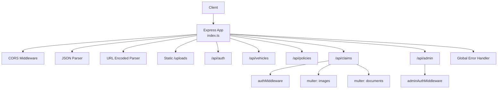
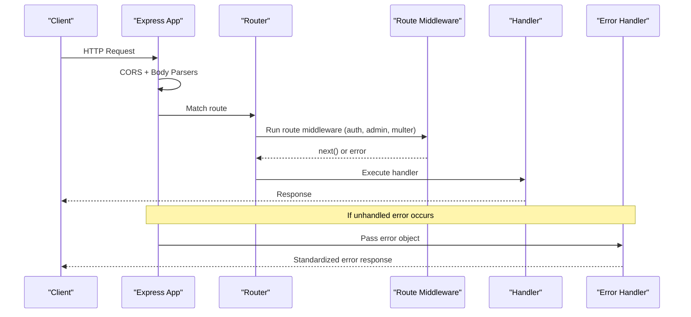
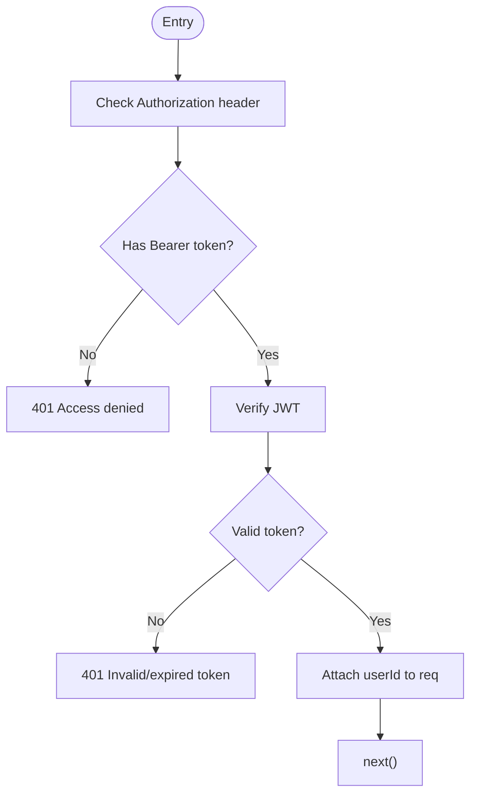
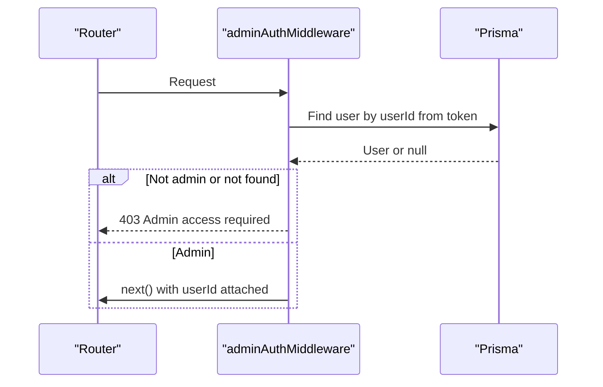
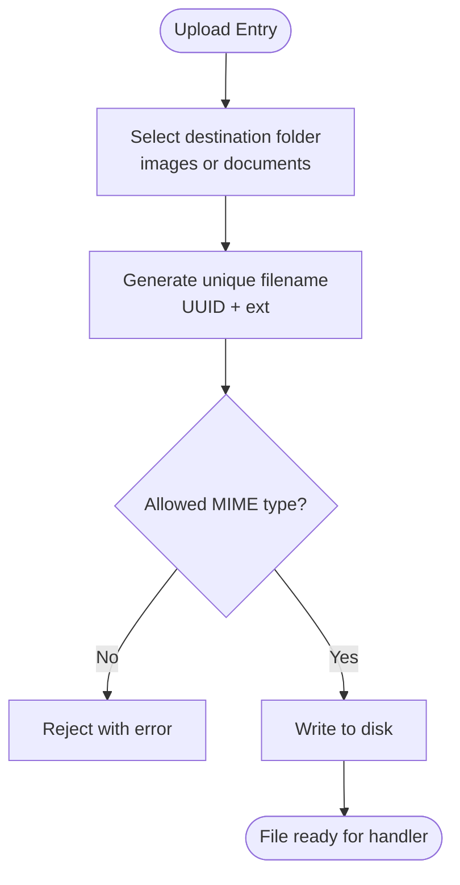
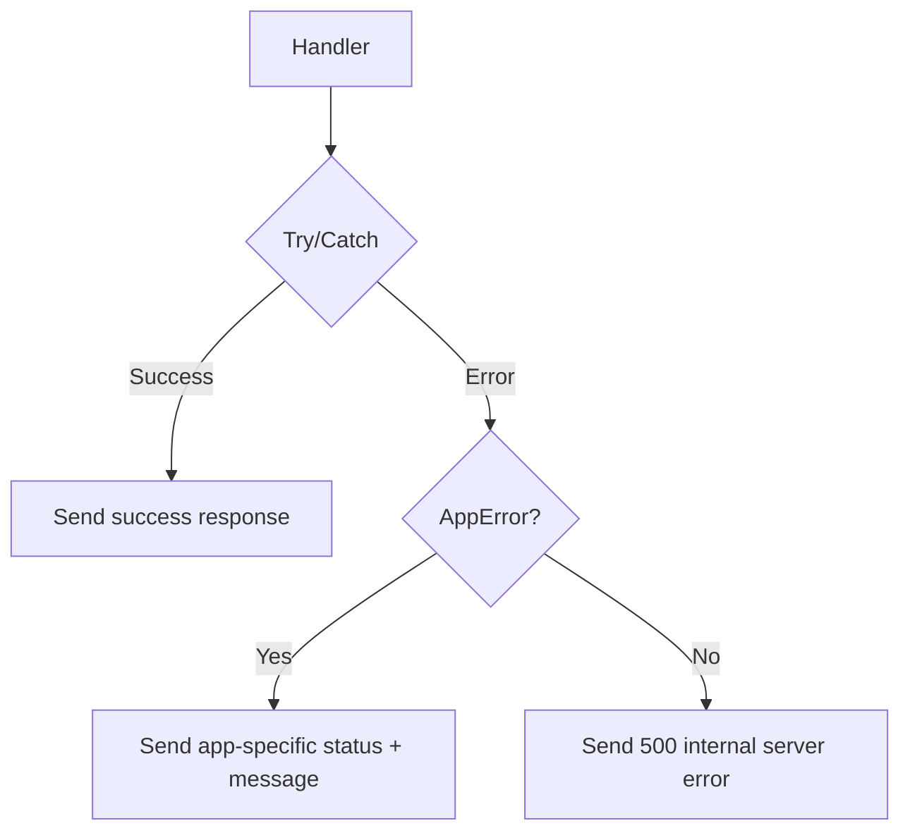
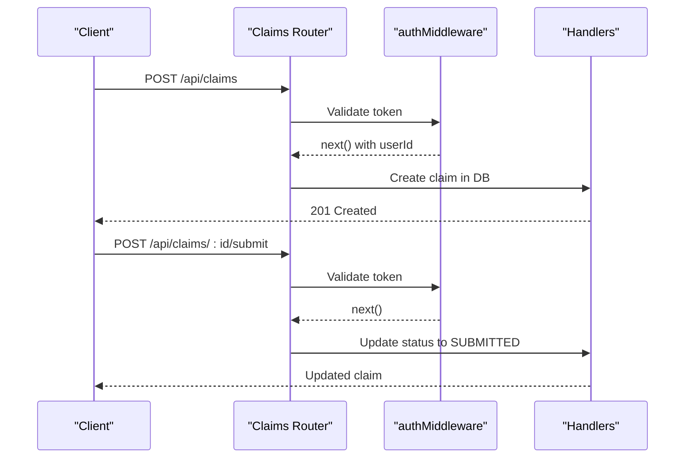
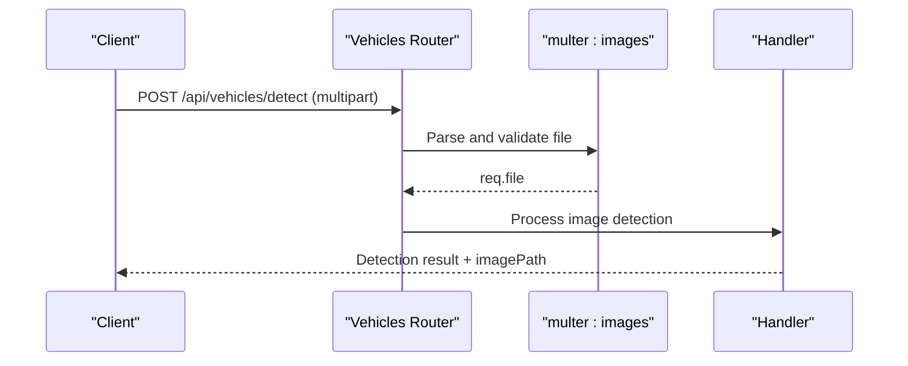
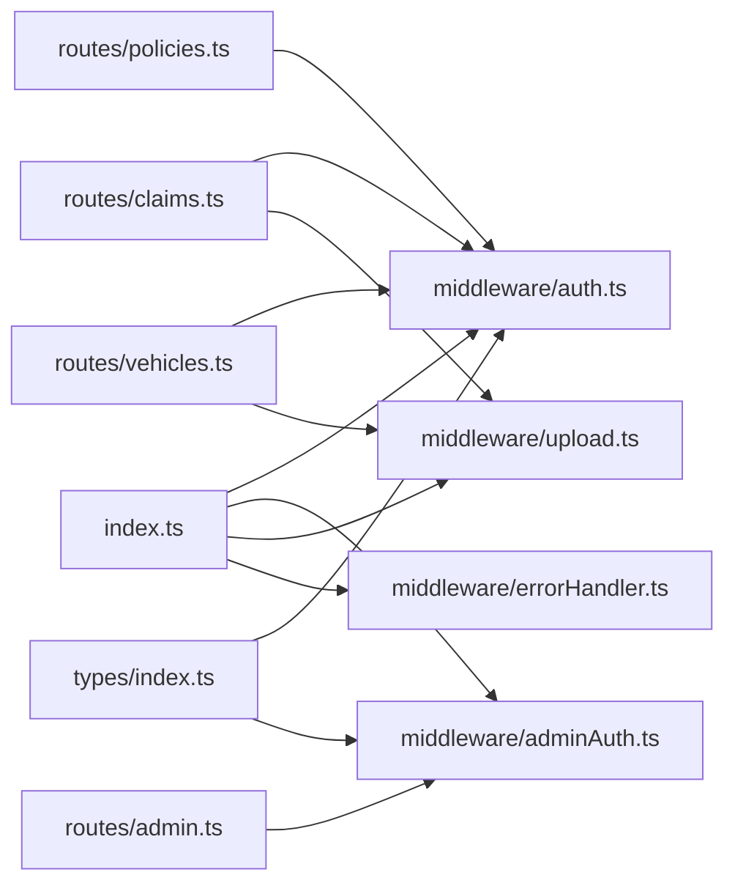

# Middleware & Request Processing

<cite>
**Referenced Files in This Document**
- [index.ts](file://backend/src/index.ts)
- [auth.ts](file://backend/src/middleware/auth.ts)
- [adminAuth.ts](file://backend/src/middleware/adminAuth.ts)
- [upload.ts](file://backend/src/middleware/upload.ts)
- [errorHandler.ts](file://backend/src/middleware/errorHandler.ts)
- [claims.ts](file://backend/src/routes/claims.ts)
- [vehicles.ts](file://backend/src/routes/vehicles.ts)
- [policies.ts](file://backend/src/routes/policies.ts)
- [admin.ts](file://backend/src/routes/admin.ts)
- [types/index.ts](file://backend/src/types/index.ts)
</cite>

## Table of Contents
1. Introduction
2. Project Structure
3. Core Components
4. Architecture Overview
5. Detailed Component Analysis
6. Dependency Analysis
7. Performance Considerations
8. Troubleshooting Guide
9. Conclusion

## Introduction
This document explains the middleware layer and request processing pipeline for the backend API. It covers how requests flow through global and route-level middleware, how authentication and authorization are enforced, how file uploads are handled with Multer, and how errors are centralized. It also provides guidance on creating reusable middleware, handling asynchronous operations, managing state across middleware, debugging issues, and optimizing performance.

## Project Structure
The Express application wires up global middleware (CORS, JSON parsing, URL-encoded parsing, static files), mounts feature routers, and installs a global error handler at the end. Each router applies its own middleware (authentication, authorization, file upload) before handlers execute.

**Diagram sources**
- [index.ts:24-52](file://backend/src/index.ts#L24-L52)
- [claims.ts:15-317](file://backend/src/routes/claims.ts#L15-L317)
- [vehicles.ts:10-16](file://backend/src/routes/vehicles.ts#L10-L16)
- [policies.ts:8-8](file://backend/src/routes/policies.ts#L8-L8)
- [admin.ts:7-7](file://backend/src/routes/admin.ts#L7-L7)

**Section sources**
- [index.ts:24-52](file://backend/src/index.ts#L24-L52)

## Core Components
- Authentication middleware validates JWTs and attaches user identity to the request.
- Authorization middleware enforces admin-only access by checking user roles.
- File upload middleware configures Multer storage, filename generation, allowed MIME types, and size limits.
- Global error handler centralizes error responses using a custom error class.

Key responsibilities:
- Enforce consistent security checks early in the pipeline.
- Isolate cross-cutting concerns (auth, uploads, errors) from business logic.
- Provide typed request objects for safer handler code.

**Section sources**
- [auth.ts:5-22](file://backend/src/middleware/auth.ts#L5-L22)
- [adminAuth.ts:6-26](file://backend/src/middleware/adminAuth.ts#L6-L26)
- [upload.ts:17-53](file://backend/src/middleware/upload.ts#L17-L53)
- [errorHandler.ts:3-27](file://backend/src/middleware/errorHandler.ts#L3-L27)
- [types/index.ts:3-10](file://backend/src/types/index.ts#L3-L10)

## Architecture Overview
Request lifecycle:
1. Express receives a request.
2. Global middleware runs: CORS, body parsers, static file serving.
3. Router selection matches the path prefix.
4. Route-level middleware runs (e.g., auth, admin auth, multer).
5. Controller/handler executes business logic.
6. Errors bubble to the global error handler if not caught.

**Diagram sources**
- [index.ts:24-52](file://backend/src/index.ts#L24-L52)
- [claims.ts:15-317](file://backend/src/routes/claims.ts#L15-L317)
- [admin.ts:7-7](file://backend/src/routes/admin.ts#L7-L7)
- [errorHandler.ts:13-27](file://backend/src/middleware/errorHandler.ts#L13-L27)

## Detailed Component Analysis

### Authentication Middleware
- Validates presence and format of Authorization header.
- Verifies JWT and decodes payload.
- Attaches userId to the request for downstream use.
- Returns standardized 401 responses for missing or invalid tokens.

**Diagram sources**
- [auth.ts:5-22](file://backend/src/middleware/auth.ts#L5-L22)

**Section sources**
- [auth.ts:5-22](file://backend/src/middleware/auth.ts#L5-L22)
- [types/index.ts:3-10](file://backend/src/types/index.ts#L3-L10)

### Admin Authorization Middleware
- Re-validates the token and fetches the user record.
- Ensures the user has admin privileges; otherwise returns 403.
- Attaches userId for subsequent handlers.

**Diagram sources**
- [adminAuth.ts:6-26](file://backend/src/middleware/adminAuth.ts#L6-L26)

**Section sources**
- [adminAuth.ts:6-26](file://backend/src/middleware/adminAuth.ts#L6-L26)

### File Upload Middleware (Multer)
- Creates upload directories on startup if missing.
- Routes files to subdirectories based on field name (images vs documents).
- Generates unique filenames using UUIDs while preserving original extensions.
- Filters allowed image MIME types and enforces size limits.
- Exposes two configured instances: one for arrays of images and one for single documents.

**Diagram sources**
- [upload.ts:8-53](file://backend/src/middleware/upload.ts#L8-L53)

Usage examples:
- Image array upload endpoint uses the array uploader and persists metadata to the database.
- Single document upload endpoint uses the single uploader and stores the document reference.

**Section sources**
- [upload.ts:8-53](file://backend/src/middleware/upload.ts#L8-L53)
- [claims.ts:195-233](file://backend/src/routes/claims.ts#L195-L233)
- [claims.ts:316-353](file://backend/src/routes/claims.ts#L316-L353)
- [vehicles.ts:15-32](file://backend/src/routes/vehicles.ts#L15-L32)

### Input Validation Patterns
- Route handlers perform explicit validation of required fields and enums.
- For example, claim creation validates core fields; status updates validate allowed values; document uploads validate document type.
- This approach keeps validation close to business rules and avoids extra dependencies.

Best practices:
- Validate early and return clear 400 errors with descriptive messages.
- Centralize shared validation schemas when complexity grows (e.g., using a library like Zod).

**Section sources**
- [claims.ts:21-57](file://backend/src/routes/claims.ts#L21-L57)
- [claims.ts:105-123](file://backend/src/routes/claims.ts#L105-L123)
- [claims.ts:316-353](file://backend/src/routes/claims.ts#L316-L353)

### Logging and Monitoring
- The current implementation logs errors via console.error within handlers and the global error handler.
- There is no dedicated logging or metrics middleware yet.

Recommendations:
- Add structured logging middleware that records method, path, userId (when available), duration, and status.
- Integrate a metrics collector (e.g., Prometheus client) to expose latency and error rates.
- Use correlation IDs per request to trace logs across services.

[No sources needed since this section provides general guidance]

### Error Handling Strategy
- Custom AppError class carries a status code for domain errors.
- Global error handler distinguishes AppError from unexpected errors and returns standardized JSON.
- Handlers catch errors and either respond directly or let them bubble to the global handler.

**Diagram sources**
- [errorHandler.ts:3-27](file://backend/src/middleware/errorHandler.ts#L3-L27)

**Section sources**
- [errorHandler.ts:3-27](file://backend/src/middleware/errorHandler.ts#L3-L27)

### Request Processing Pipeline Examples

#### Claims: Create and Submit

**Diagram sources**
- [claims.ts:15-193](file://backend/src/routes/claims.ts#L15-L193)
- [auth.ts:5-22](file://backend/src/middleware/auth.ts#L5-L22)

#### Vehicles: Detect from Image

**Diagram sources**
- [vehicles.ts:10-32](file://backend/src/routes/vehicles.ts#L10-L32)
- [upload.ts:17-53](file://backend/src/middleware/upload.ts#L17-L53)

### Creating Reusable Middleware
Patterns used in this codebase:
- Pure functions with standard (req, res, next) signature.
- Early returns for error cases to avoid deep nesting.
- Extending the request object with typed properties (e.g., userId) via TypeScript augmentation.

Guidelines:
- Keep middleware focused on one concern (auth, uploads, logging).
- Avoid side effects other than what’s necessary (e.g., attaching data to req).
- Use async functions when I/O is required and handle errors consistently.

**Section sources**
- [auth.ts:5-22](file://backend/src/middleware/auth.ts#L5-L22)
- [adminAuth.ts:6-26](file://backend/src/middleware/adminAuth.ts#L6-L26)
- [types/index.ts:3-10](file://backend/src/types/index.ts#L3-L10)

### Managing Middleware State
- State is typically passed via the request object (e.g., userId).
- For complex flows, consider a context object attached to the request to group related data.
- Ensure cleanup or disposal happens in handlers or finalizers to avoid leaks.

**Section sources**
- [auth.ts:15-18](file://backend/src/middleware/auth.ts#L15-L18)
- [adminAuth.ts:14-22](file://backend/src/middleware/adminAuth.ts#L14-L22)

## Dependency Analysis
- index.ts registers global middleware and mounts routers.
- Routers depend on middleware modules for auth, authorization, and uploads.
- Types module defines shared interfaces used by middleware and routes.

**Diagram sources**
- [index.ts:24-52](file://backend/src/index.ts#L24-L52)
- [claims.ts:15-317](file://backend/src/routes/claims.ts#L15-L317)
- [vehicles.ts:10-16](file://backend/src/routes/vehicles.ts#L10-L16)
- [policies.ts:8-8](file://backend/src/routes/policies.ts#L8-L8)
- [admin.ts:7-7](file://backend/src/routes/admin.ts#L7-L7)
- [types/index.ts:3-10](file://backend/src/types/index.ts#L3-L10)

**Section sources**
- [index.ts:24-52](file://backend/src/index.ts#L24-L52)
- [claims.ts:15-317](file://backend/src/routes/claims.ts#L15-L317)
- [vehicles.ts:10-16](file://backend/src/routes/vehicles.ts#L10-L16)
- [policies.ts:8-8](file://backend/src/routes/policies.ts#L8-L8)
- [admin.ts:7-7](file://backend/src/routes/admin.ts#L7-L7)
- [types/index.ts:3-10](file://backend/src/types/index.ts#L3-L10)

## Performance Considerations
- Prefer route-level middleware only where needed to reduce overhead on unrelated endpoints.
- Limit payload sizes with body parser limits and Multer size constraints already in place.
- Use background tasks for long-running operations (e.g., AI analysis) to keep response times low.
- Cache frequently accessed read data where appropriate.
- Profile hot paths and add request timing/logging to identify bottlenecks.

[No sources needed since this section provides general guidance]

## Troubleshooting Guide
Common issues and remedies:
- Missing environment variables cause startup failure; ensure all required variables are set.
- Authentication failures indicate malformed or missing Authorization headers; verify token format and secret configuration.
- Upload rejections due to unsupported MIME types or size limits; adjust filters and limits as needed.
- Unexpected errors are caught by the global error handler; inspect logs for stack traces and messages.

Debugging tips:
- Log request identifiers and durations in a dedicated logging middleware.
- Reproduce issues with minimal payloads and isolate problematic middleware by commenting out non-essential steps.
- Validate Multer configuration by testing with known-good files first.

**Section sources**
- [index.ts:14-21](file://backend/src/index.ts#L14-L21)
- [auth.ts:5-22](file://backend/src/middleware/auth.ts#L5-L22)
- [upload.ts:30-47](file://backend/src/middleware/upload.ts#L30-L47)
- [errorHandler.ts:13-27](file://backend/src/middleware/errorHandler.ts#L13-L27)

## Conclusion
The middleware layer cleanly separates cross-cutting concerns from business logic. Authentication and authorization are enforced at both global and route levels, while Multer handles secure and validated file uploads. A centralized error handler ensures consistent error responses. To further improve observability and performance, consider adding structured logging, metrics, and caching strategies tailored to your workload.