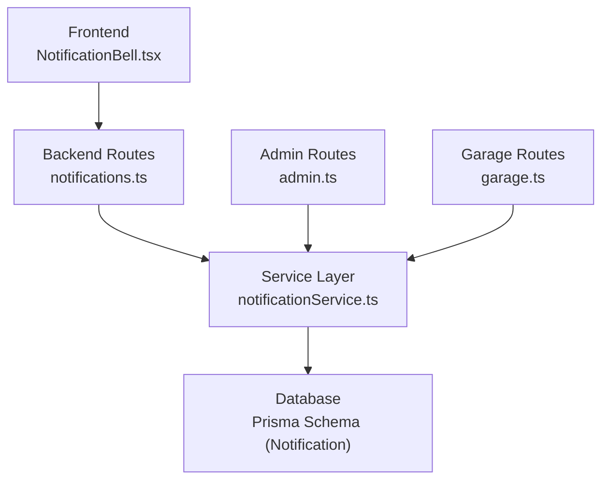
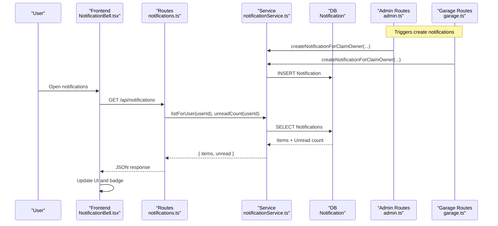
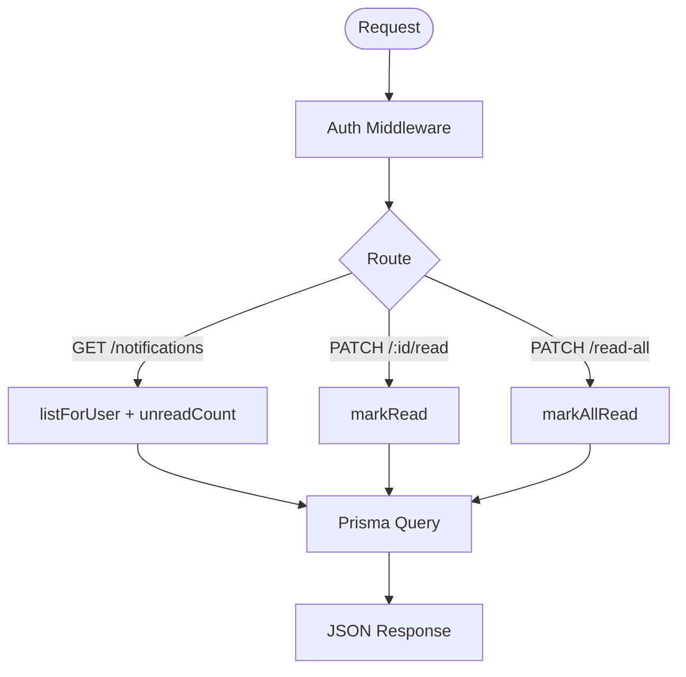
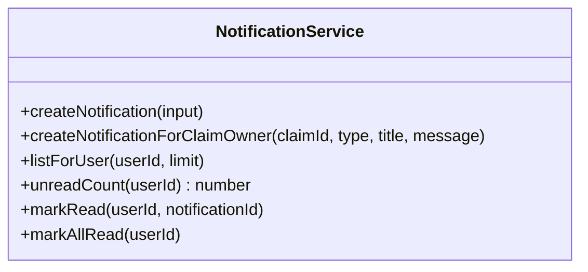
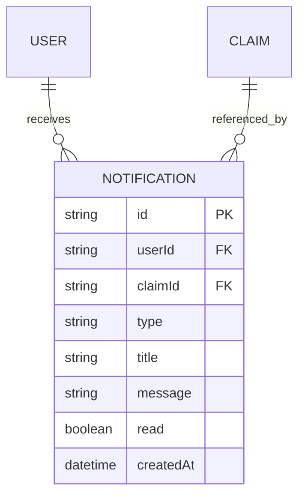
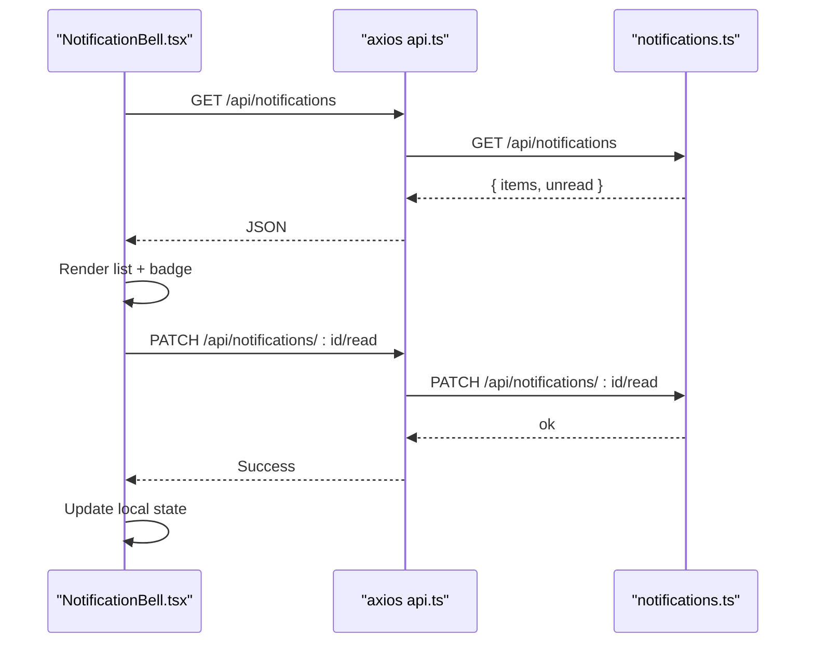
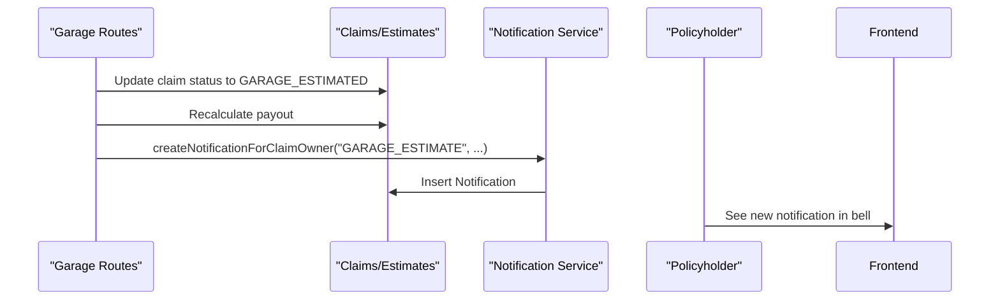
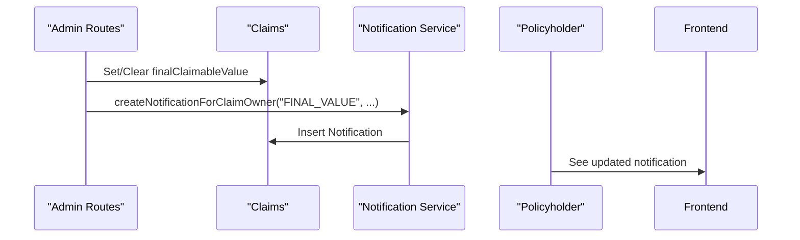
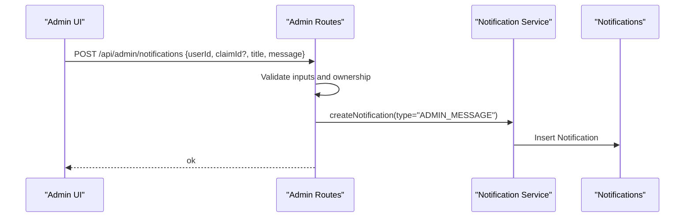
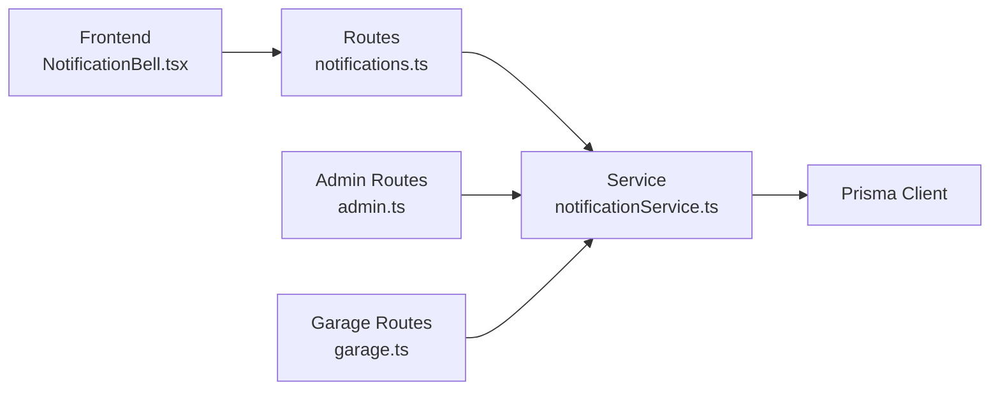

# Notification System

<cite>
**Referenced Files in This Document**
- [notifications.ts](file://backend/src/routes/notifications.ts)
- [notificationService.ts](file://backend/src/services/notificationService.ts)
- [schema.prisma](file://backend/prisma/schema.prisma)
- [NotificationBell.tsx](file://frontend/src/components/NotificationBell.tsx)
- [api.ts](file://frontend/src/services/api.ts)
- [admin.ts](file://backend/src/routes/admin.ts)
- [garage.ts](file://backend/src/routes/garage.ts)
</cite>

## Table of Contents
1. [Introduction](#introduction)
2. [Project Structure](#project-structure)
3. [Core Components](#core-components)
4. [Architecture Overview](#architecture-overview)
5. [Detailed Component Analysis](#detailed-component-analysis)
6. [Dependency Analysis](#dependency-analysis)
7. [Performance Considerations](#performance-considerations)
8. [Troubleshooting Guide](#troubleshooting-guide)
9. [Conclusion](#conclusion)

## Introduction
This document explains the end-to-end notification system used by the Smart Vehicle Insurance Claim System. It covers how notifications are created, stored, and consumed by users, including automatic triggers during claim processing and manual messages from administrators. The system provides a simple in-app notification feed with unread counts and read status management.

## Project Structure
The notification feature spans backend routes, services, database schema, and a frontend component:
- Backend exposes REST endpoints for listing, marking as read, and marking all as read.
- A service layer encapsulates Prisma operations to create, list, count, and update notifications.
- The database defines a Notification model linked to Users and Claims.
- Frontend renders a bell icon with an unread badge and a dropdown panel that polls for updates and allows marking items read.

**Diagram sources**
- [notifications.ts:1-44](file://backend/src/routes/notifications.ts#L1-L44)
- [notificationService.ts:1-55](file://backend/src/services/notificationService.ts#L1-L55)
- [schema.prisma:327-339](file://backend/prisma/schema.prisma#L327-L339)
- [NotificationBell.tsx:1-155](file://frontend/src/components/NotificationBell.tsx#L1-L155)
- [admin.ts:696-728](file://backend/src/routes/admin.ts#L696-L728)
- [garage.ts:147-164](file://backend/src/routes/garage.ts#L147-L164)

**Section sources**
- [notifications.ts:1-44](file://backend/src/routes/notifications.ts#L1-L44)
- [notificationService.ts:1-55](file://backend/src/services/notificationService.ts#L1-L55)
- [schema.prisma:327-339](file://backend/prisma/schema.prisma#L327-L339)
- [NotificationBell.tsx:1-155](file://frontend/src/components/NotificationBell.tsx#L1-L155)
- [admin.ts:696-728](file://backend/src/routes/admin.ts#L696-L728)
- [garage.ts:147-164](file://backend/src/routes/garage.ts#L147-L164)

## Core Components
- REST API for notifications:
  - GET /api/notifications returns both the latest notifications and the unread count in one call.
  - PATCH /api/notifications/:id/read marks a single notification as read.
  - PATCH /api/notifications/read-all marks all user notifications as read.
- Service functions:
  - Create notifications for a specific user or automatically for claim owners.
  - List recent notifications per user.
  - Count unread notifications.
  - Mark individual or all notifications as read.
- Database model:
  - Notification stores type, title, message, read flag, and optional link to a claim.
- Frontend UI:
  - Polls the API periodically to refresh the notification list and unread badge.
  - Allows marking items read individually or all at once.
  - Navigates to the related claim when a notification is clicked.

**Section sources**
- [notifications.ts:9-41](file://backend/src/routes/notifications.ts#L9-L41)
- [notificationService.ts:13-54](file://backend/src/services/notificationService.ts#L13-L54)
- [schema.prisma:327-339](file://backend/prisma/schema.prisma#L327-L339)
- [NotificationBell.tsx:34-81](file://frontend/src/components/NotificationBell.tsx#L34-L81)

## Architecture Overview
The notification flow integrates into key claim lifecycle events and admin workflows:
- Automatic triggers:
  - When a garage submits an estimate, the system notifies the policyholder.
  - When an admin sets or clears the final claimable value, the policyholder is notified.
- Manual triggers:
  - Admins can send direct messages to users, optionally tied to a claim.
- Consumption:
  - The frontend polls for updates and displays them in a bell dropdown with an unread badge.

**Diagram sources**
- [admin.ts:612-646](file://backend/src/routes/admin.ts#L612-L646)
- [garage.ts:147-164](file://backend/src/routes/garage.ts#L147-L164)
- [notificationService.ts:13-54](file://backend/src/services/notificationService.ts#L13-L54)
- [notifications.ts:9-41](file://backend/src/routes/notifications.ts#L9-L41)
- [NotificationBell.tsx:42-56](file://frontend/src/components/NotificationBell.tsx#L42-L56)

## Detailed Component Analysis

### Backend: Notification Routes
- Authentication: All notification endpoints require authentication via middleware.
- Endpoints:
  - GET /api/notifications: Returns the latest notifications and unread count for the authenticated user.
  - PATCH /api/notifications/:id/read: Marks a specific notification as read.
  - PATCH /api/notifications/read-all: Marks all notifications for the user as read.
- Error handling: Each endpoint catches errors and returns a 500 error with a descriptive message.

**Diagram sources**
- [notifications.ts:1-44](file://backend/src/routes/notifications.ts#L1-L44)

**Section sources**
- [notifications.ts:1-44](file://backend/src/routes/notifications.ts#L1-L44)

### Backend: Notification Service
- Creation:
  - createNotification: Inserts a notification record for a given user and optional claim.
  - createNotificationForClaimOwner: Resolves the claim owner and creates a notification on their behalf.
- Reading and updating:
  - listForUser: Fetches recent notifications ordered by creation time.
  - unreadCount: Counts unread notifications for a user.
  - markRead: Marks a specific notification as read if it belongs to the user.
  - markAllRead: Marks all unread notifications for a user as read.

**Diagram sources**
- [notificationService.ts:13-54](file://backend/src/services/notificationService.ts#L13-L54)

**Section sources**
- [notificationService.ts:13-54](file://backend/src/services/notificationService.ts#L13-L54)

### Database Model: Notification
- Fields:
  - id: Primary key.
  - userId: Owner of the notification.
  - claimId: Optional link to a claim.
  - type: Category such as DOC_REMINDER, GARAGE_ESTIMATE, FINAL_VALUE, ADMIN_MESSAGE.
  - title and message: Human-readable content.
  - read: Boolean flag indicating whether the user has seen it.
  - createdAt: Timestamp.
- Relationships:
  - Linked to User (cascade delete).
  - Optionally linked to Claim (cascade delete).

**Diagram sources**
- [schema.prisma:327-339](file://backend/prisma/schema.prisma#L327-L339)

**Section sources**
- [schema.prisma:327-339](file://backend/prisma/schema.prisma#L327-L339)

### Frontend: Notification Bell Component
- Behavior:
  - Loads notifications and unread count from GET /api/notifications.
  - Polls every minute to keep the UI fresh.
  - Displays a badge with the unread count.
  - Clicking a notification marks it as read and navigates to the related claim if present.
  - Provides a “Mark all read” action.
- Integration:
  - Uses the shared axios client which attaches the auth token and handles 401 redirects.

**Diagram sources**
- [NotificationBell.tsx:42-81](file://frontend/src/components/NotificationBell.tsx#L42-L81)
- [api.ts:1-40](file://frontend/src/services/api.ts#L1-L40)
- [notifications.ts:9-41](file://backend/src/routes/notifications.ts#L9-L41)

**Section sources**
- [NotificationBell.tsx:1-155](file://frontend/src/components/NotificationBell.tsx#L1-L155)
- [api.ts:1-40](file://frontend/src/services/api.ts#L1-L40)

### Automatic Triggers: Garage Estimate
- When a garage submits or updates an estimate:
  - The claim status is updated to GARAGE_ESTIMATED.
  - Payout recalculation is triggered.
  - A notification is created for the claim owner informing them about the new estimate.

**Diagram sources**
- [garage.ts:147-164](file://backend/src/routes/garage.ts#L147-L164)
- [notificationService.ts:25-34](file://backend/src/services/notificationService.ts#L25-L34)

**Section sources**
- [garage.ts:147-164](file://backend/src/routes/garage.ts#L147-L164)

### Automatic Triggers: Final Value Updates
- When an admin sets or clears the final claimable value:
  - The claim is updated accordingly.
  - A notification is created for the policyholder explaining the change.

**Diagram sources**
- [admin.ts:612-646](file://backend/src/routes/admin.ts#L612-L646)
- [notificationService.ts:25-34](file://backend/src/services/notificationService.ts#L25-L34)

**Section sources**
- [admin.ts:612-646](file://backend/src/routes/admin.ts#L612-L646)

### Manual Triggers: Admin Messages
- Admins can send direct messages to users:
  - The admin route validates inputs and ensures the target user exists.
  - If a claimId is provided, it verifies the claim belongs to the user.
  - A notification of type ADMIN_MESSAGE is created.

**Diagram sources**
- [admin.ts:696-728](file://backend/src/routes/admin.ts#L696-L728)
- [notificationService.ts:13-23](file://backend/src/services/notificationService.ts#L13-L23)

**Section sources**
- [admin.ts:696-728](file://backend/src/routes/admin.ts#L696-L728)

## Dependency Analysis
- Coupling:
  - Routes depend on the service layer for data operations, keeping HTTP concerns separate from business logic.
  - Service layer depends on Prisma for persistence.
  - Frontend depends on the shared axios client for authenticated requests.
- External integrations:
  - None beyond Prisma; notifications are persisted locally and surfaced via REST.
- Potential circular dependencies:
  - None observed between routes and services; flows are unidirectional.

**Diagram sources**
- [notifications.ts:1-44](file://backend/src/routes/notifications.ts#L1-L44)
- [notificationService.ts:1-55](file://backend/src/services/notificationService.ts#L1-L55)
- [admin.ts:696-728](file://backend/src/routes/admin.ts#L696-L728)
- [garage.ts:147-164](file://backend/src/routes/garage.ts#L147-L164)

**Section sources**
- [notifications.ts:1-44](file://backend/src/routes/notifications.ts#L1-L44)
- [notificationService.ts:1-55](file://backend/src/services/notificationService.ts#L1-L55)
- [admin.ts:696-728](file://backend/src/routes/admin.ts#L696-L728)
- [garage.ts:147-164](file://backend/src/routes/garage.ts#L147-L164)

## Performance Considerations
- Polling interval:
  - The frontend polls every 60 seconds; consider adjusting based on expected notification volume and user expectations.
- Batch reads:
  - The GET endpoint returns both items and unread count in one call, reducing round trips.
- Limits:
  - listForUser uses a default limit; ensure pagination is considered if notification history grows large.
- Indexing:
  - Ensure efficient queries by indexing frequently filtered fields like userId and read status in the database.

[No sources needed since this section provides general guidance]

## Troubleshooting Guide
- Authentication failures:
  - If the frontend receives a 401, the shared axios interceptor clears session data and redirects to login.
- Endpoint errors:
  - Backend routes return 500 with descriptive messages on unexpected errors; check server logs for stack traces.
- Missing notifications:
  - Verify that triggers (garage estimate submission, admin final value updates, admin messages) are calling the service correctly.
- Read status not updating:
  - Confirm that the PATCH endpoints are called with the correct notification ID and that the user owns the notification.

**Section sources**
- [api.ts:26-37](file://frontend/src/services/api.ts#L26-L37)
- [notifications.ts:15-41](file://backend/src/routes/notifications.ts#L15-L41)

## Conclusion
The notification system provides a lightweight, reliable way to keep policyholders informed about important claim events and administrative messages. It integrates seamlessly into the claim workflow through automatic triggers and supports manual messaging from admins. The frontend offers a responsive interface with real-time-like updates via polling and clear actions to manage read status. For scaling, consider adding pagination, background job queuing for high-volume triggers, and database indexes to optimize query performance.