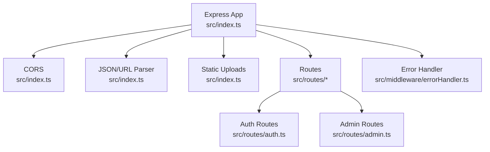
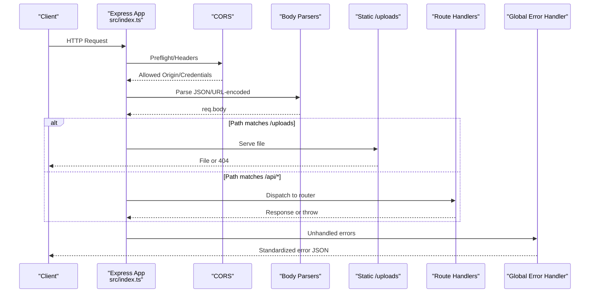
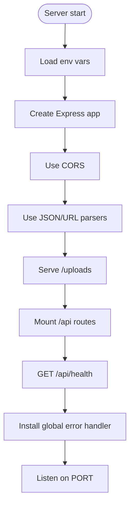
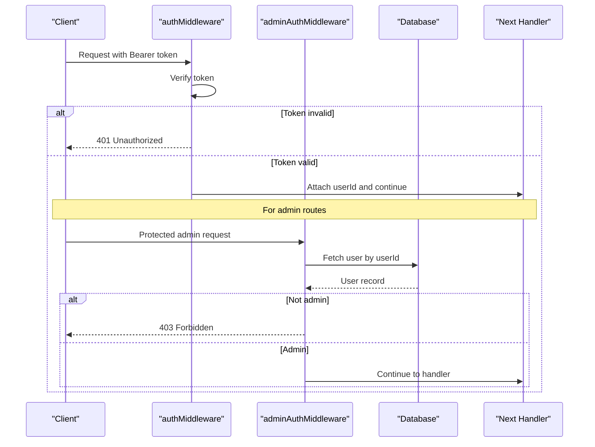
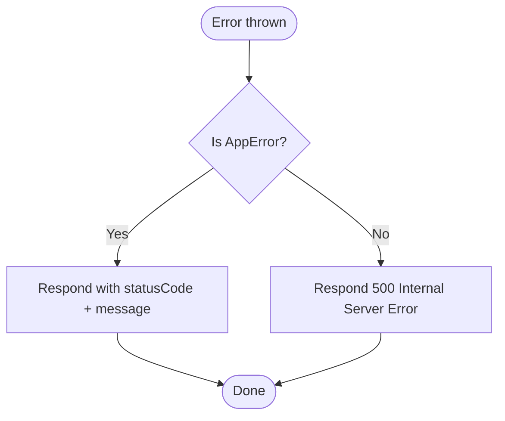
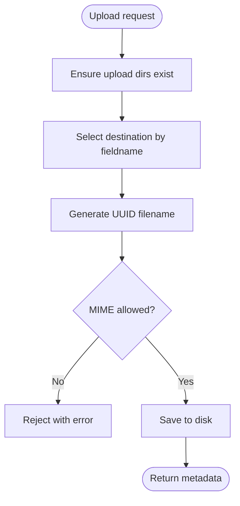
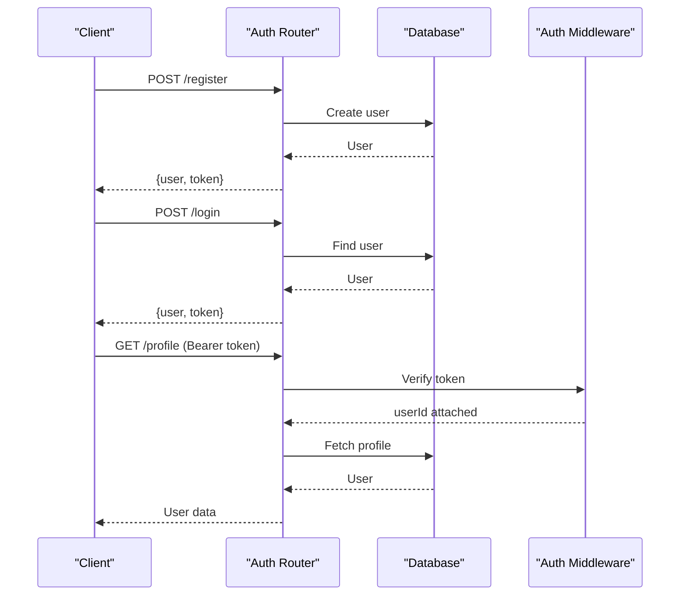
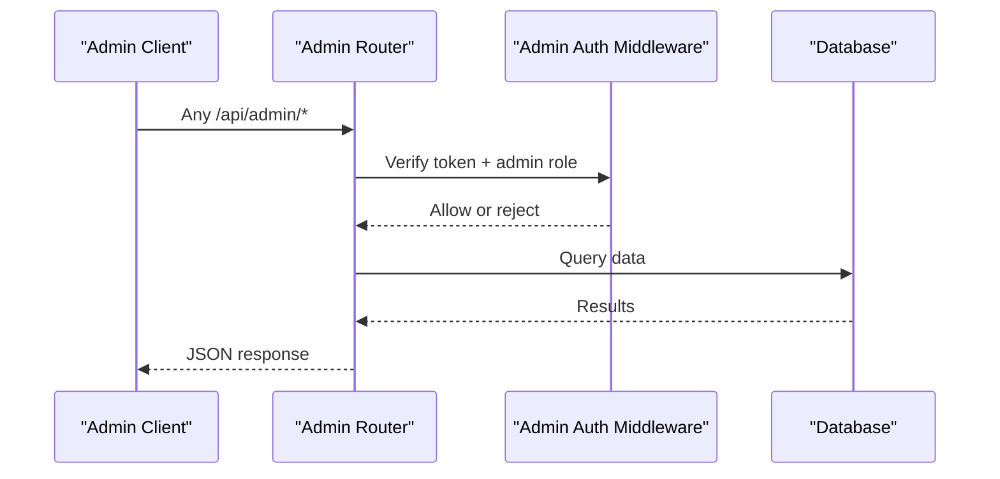
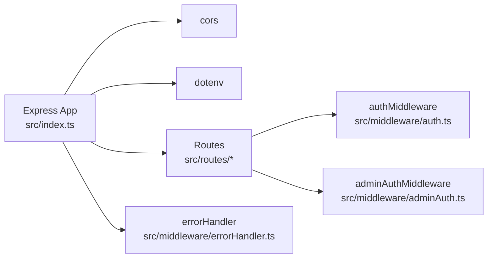

# Server Architecture & Setup

<cite>
**Referenced Files in This Document**
- [index.ts](file://backend/src/index.ts)
- [errorHandler.ts](file://backend/src/middleware/errorHandler.ts)
- [auth.ts](file://backend/src/middleware/auth.ts)
- [adminAuth.ts](file://backend/src/middleware/adminAuth.ts)
- [upload.ts](file://backend/src/middleware/upload.ts)
- [auth.ts](file://backend/src/routes/auth.ts)
- [admin.ts](file://backend/src/routes/admin.ts)
- [index.ts](file://backend/src/types/index.ts)
- [package.json](file://backend/package.json)
</cite>

## Table of Contents
1. [Introduction](#introduction)
2. [Project Structure](#project-structure)
3. [Core Components](#core-components)
4. [Architecture Overview](#architecture-overview)
5. [Detailed Component Analysis](#detailed-component-analysis)
6. [Dependency Analysis](#dependency-analysis)
7. [Performance Considerations](#performance-considerations)
8. [Troubleshooting Guide](#troubleshooting-guide)
9. [Conclusion](#conclusion)
10. [Appendices](#appendices)

## Introduction
This document explains the Express.js server architecture and setup for the Smart Vehicle Insurance Claim System backend. It covers server initialization, middleware configuration (CORS, JSON parsing, static file serving), environment variable management with dotenv, port configuration, health check endpoint, error handling, and guidance for extending the server with additional middleware, security headers, and performance optimizations.

## Project Structure
The backend is organized around a single application entry point that wires up middleware and routes:
- Application entry: initializes Express, loads environment variables, configures middleware, mounts route modules, defines a health check, and starts listening on a configured port.
- Middleware: centralized error handling, authentication, admin authorization, and file upload utilities.
- Routes: feature-based route modules under src/routes for auth, vehicles, policies, claims, and admin.
- Types: shared TypeScript types used across middleware and routes.

**Diagram sources**
- [index.ts:1-49](file://backend/src/index.ts#L1-L49)
- [auth.ts:1-168](file://backend/src/routes/auth.ts#L1-L168)
- [admin.ts:1-187](file://backend/src/routes/admin.ts#L1-L187)
- [errorHandler.ts:1-28](file://backend/src/middleware/errorHandler.ts#L1-L28)

**Section sources**
- [index.ts:1-49](file://backend/src/index.ts#L1-L49)
- [package.json:1-43](file://backend/package.json#L1-L43)

## Core Components
- Server bootstrap: creates an Express app, loads environment variables, sets CORS, JSON and URL parsers, serves uploads statically, mounts API routes, adds a health check, installs global error handler, and listens on a configurable port.
- Middleware:
  - Authentication: validates JWT bearer tokens and attaches user context to requests.
  - Admin authorization: verifies token and ensures the user has admin privileges.
  - Error handling: standardized error responses using a custom error class.
  - File uploads: Multer-based upload handlers with directory creation and type filtering.
- Routes:
  - Auth: registration, login, profile retrieval/update with protected endpoints.
  - Admin: statistics, users, claims, documents with admin-only access.

Key responsibilities and behaviors are implemented in the files listed below.

**Section sources**
- [index.ts:12-46](file://backend/src/index.ts#L12-L46)
- [auth.ts:5-22](file://backend/src/middleware/auth.ts#L5-L22)
- [adminAuth.ts:6-26](file://backend/src/middleware/adminAuth.ts#L6-L26)
- [errorHandler.ts:3-27](file://backend/src/middleware/errorHandler.ts#L3-L27)
- [upload.ts:6-53](file://backend/src/middleware/upload.ts#L6-L53)
- [auth.ts:10-167](file://backend/src/routes/auth.ts#L10-L167)
- [admin.ts:11-186](file://backend/src/routes/admin.ts#L11-L186)

## Architecture Overview
The request lifecycle flows through global middleware before reaching route handlers, then returns via a unified error handler.

**Diagram sources**
- [index.ts:17-42](file://backend/src/index.ts#L17-L42)
- [errorHandler.ts:13-27](file://backend/src/middleware/errorHandler.ts#L13-L27)

## Detailed Component Analysis

### Server Initialization and Configuration
- Environment loading: dotenv is invoked at startup to load environment variables from .env.
- Port configuration: uses process.env.PORT with a fallback default.
- Middleware order:
  - CORS with credentials enabled and origin from environment.
  - JSON parser with a size limit.
  - URL-encoded parser with extended mode.
  - Static file serving for uploads under a configurable directory.
- Routes mounted under /api prefixes for auth, vehicles, policies, claims, and admin.
- Health check: GET /api/health returns a simple status object.
- Global error handler: installed last to catch unhandled errors.

**Diagram sources**
- [index.ts:12-46](file://backend/src/index.ts#L12-L46)

**Section sources**
- [index.ts:12-46](file://backend/src/index.ts#L12-L46)

### Middleware: Authentication and Authorization
- Authentication middleware:
  - Validates presence and format of Authorization header.
  - Verifies JWT using secret from environment.
  - Attaches userId to the request for downstream use.
- Admin authorization middleware:
  - Reuses token verification.
  - Checks user role in the database to ensure admin access.
  - Returns appropriate 401/403 responses on failure.

**Diagram sources**
- [auth.ts:5-22](file://backend/src/middleware/auth.ts#L5-L22)
- [adminAuth.ts:6-26](file://backend/src/middleware/adminAuth.ts#L6-L26)

**Section sources**
- [auth.ts:5-22](file://backend/src/middleware/auth.ts#L5-L22)
- [adminAuth.ts:6-26](file://backend/src/middleware/adminAuth.ts#L6-L26)

### Middleware: Error Handling
- Custom error class carries a status code.
- Global error handler logs errors and responds with standardized JSON.
- Unknown errors return a generic 500 response.

**Diagram sources**
- [errorHandler.ts:3-27](file://backend/src/middleware/errorHandler.ts#L3-L27)

**Section sources**
- [errorHandler.ts:3-27](file://backend/src/middleware/errorHandler.ts#L3-L27)

### Middleware: File Uploads
- Ensures upload directories exist at startup.
- Uses disk storage with UUID filenames and subdirectories based on field name.
- Filters allowed image MIME types.
- Enforces file size limits.
- Exposes reusable upload handlers for images and documents.

**Diagram sources**
- [upload.ts:6-53](file://backend/src/middleware/upload.ts#L6-L53)

**Section sources**
- [upload.ts:6-53](file://backend/src/middleware/upload.ts#L6-L53)

### Routes: Auth
- Registration: validates input, hashes password, creates user, issues JWT.
- Login: validates credentials, issues JWT.
- Profile: protected by authentication middleware; supports read and update.

**Diagram sources**
- [auth.ts:10-167](file://backend/src/routes/auth.ts#L10-L167)
- [auth.ts:5-22](file://backend/src/middleware/auth.ts#L5-L22)

**Section sources**
- [auth.ts:10-167](file://backend/src/routes/auth.ts#L10-L167)

### Routes: Admin
- All routes are guarded by admin authorization middleware.
- Provides endpoints for stats, users, claims, and document approvals/rejections.

**Diagram sources**
- [admin.ts:1-186](file://backend/src/routes/admin.ts#L1-186)
- [adminAuth.ts:6-26](file://backend/src/middleware/adminAuth.ts#L6-L26)

**Section sources**
- [admin.ts:1-186](file://backend/src/routes/admin.ts#L1-186)

## Dependency Analysis
- The application depends on Express, CORS, dotenv, and route modules.
- Routes depend on middleware for authentication and authorization.
- Error handling is centralized and applied globally after routes.

**Diagram sources**
- [index.ts:1-49](file://backend/src/index.ts#L1-L49)
- [auth.ts:5-22](file://backend/src/middleware/auth.ts#L5-L22)
- [adminAuth.ts:6-26](file://backend/src/middleware/adminAuth.ts#L6-L26)
- [errorHandler.ts:13-27](file://backend/src/middleware/errorHandler.ts#L13-L27)

**Section sources**
- [index.ts:1-49](file://backend/src/index.ts#L1-L49)
- [package.json:18-30](file://backend/package.json#L18-L30)

## Performance Considerations
- Body parsing size: JSON body limit is set to a fixed value suitable for typical payloads. Adjust if large payloads are expected.
- Static assets: Uploads are served directly from disk; consider moving to object storage and using CDN in production for better scalability.
- Database queries: Admin endpoints batch operations where possible; ensure indexes on frequently filtered fields.
- Concurrency: Node.js handles concurrency well; monitor memory usage and consider clustering for high-throughput deployments.
- Logging: Centralize structured logging and add request IDs for tracing.

[No sources needed since this section provides general guidance]

## Troubleshooting Guide
- CORS errors:
  - Ensure the frontend origin matches the configured CORS origin.
  - Confirm credentials are enabled when cookies or auth headers are used.
- Authentication failures:
  - Verify JWT_SECRET is set and consistent between token issuance and verification.
  - Check that the Authorization header uses the correct scheme and includes the token.
- Upload issues:
  - Ensure UPLOAD_DIR exists or is writable.
  - Confirm file MIME types match allowed list.
- Health check:
  - If /api/health fails, verify the server is running and no middleware is intercepting the route.
- Errors:
  - Review logs from the global error handler for stack traces and messages.
  - Use the custom error class to surface meaningful status codes and messages.

**Section sources**
- [index.ts:17-27](file://backend/src/index.ts#L17-L27)
- [auth.ts:5-22](file://backend/src/middleware/auth.ts#L5-L22)
- [adminAuth.ts:6-26](file://backend/src/middleware/adminAuth.ts#L6-L26)
- [upload.ts:6-53](file://backend/src/middleware/upload.ts#L6-L53)
- [errorHandler.ts:13-27](file://backend/src/middleware/errorHandler.ts#L13-L27)

## Conclusion
The backend follows a clean, modular structure with clear separation of concerns:
- Centralized server setup with explicit middleware ordering.
- Feature-based routing with robust authentication and admin authorization.
- Centralized error handling and a simple health check for monitoring.
To extend the server, add new route modules, attach them under /api, and apply appropriate middleware. For production, configure environment variables securely, enable HTTPS, add security headers, and optimize performance per the guidance above.

[No sources needed since this section summarizes without analyzing specific files]

## Appendices

### Extending the Server
- Add new middleware:
  - Place logic in src/middleware and import into index.ts before routes.
  - Apply selectively per route or globally depending on scope.
- Add security headers:
  - Insert a middleware before routes to set headers such as Content-Security-Policy, X-Frame-Options, and Strict-Transport-Security.
- Configure rate limiting:
  - Add a rate-limiting middleware to protect endpoints from abuse.
- Add logging:
  - Integrate a structured logger early in the middleware chain.

[No sources needed since this section provides general guidance]

### Environment Variables and Ports
- Required variables:
  - PORT: server listen port.
  - CORS_ORIGIN: allowed origin for CORS.
  - JWT_SECRET: secret for signing and verifying tokens.
  - UPLOAD_DIR: absolute or relative path for uploaded files.
- Defaults:
  - PORT defaults to a standard development port if not provided.
  - CORS_ORIGIN defaults to a local development frontend address if not provided.
  - UPLOAD_DIR defaults to a local uploads folder if not provided.

**Section sources**
- [index.ts:12-27](file://backend/src/index.ts#L12-L27)
- [auth.ts:15-17](file://backend/src/middleware/auth.ts#L15-L17)
- [adminAuth.ts:14-16](file://backend/src/middleware/adminAuth.ts#L14-L16)
- [upload.ts:6-15](file://backend/src/middleware/upload.ts#L6-L15)

### Common Server Configurations
- Development:
  - Enable verbose logging and relaxed CORS for local debugging.
- Production:
  - Pin CORS_ORIGIN to trusted domains.
  - Set strict security headers and disable debug responses.
  - Use a reverse proxy (e.g., Nginx) for TLS termination and caching.

[No sources needed since this section provides general guidance]