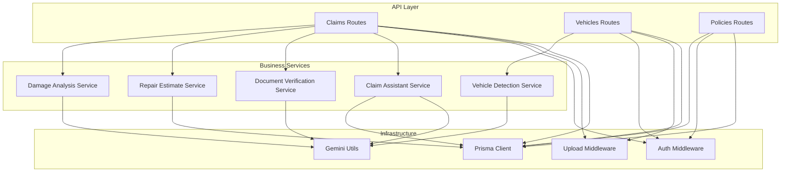
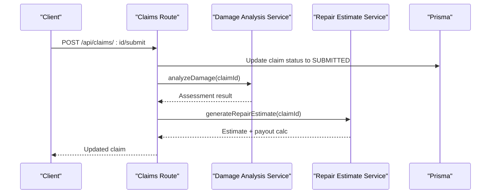
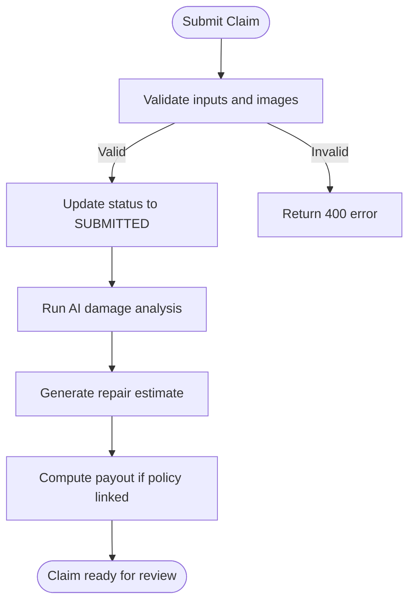
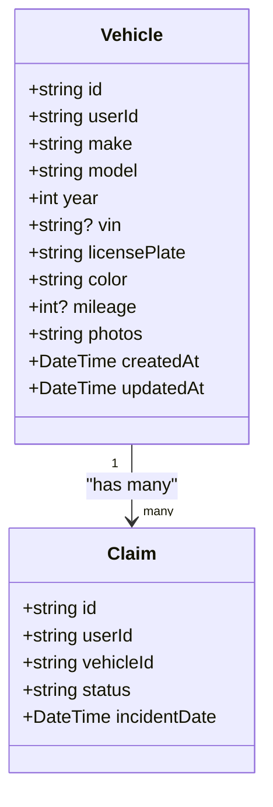
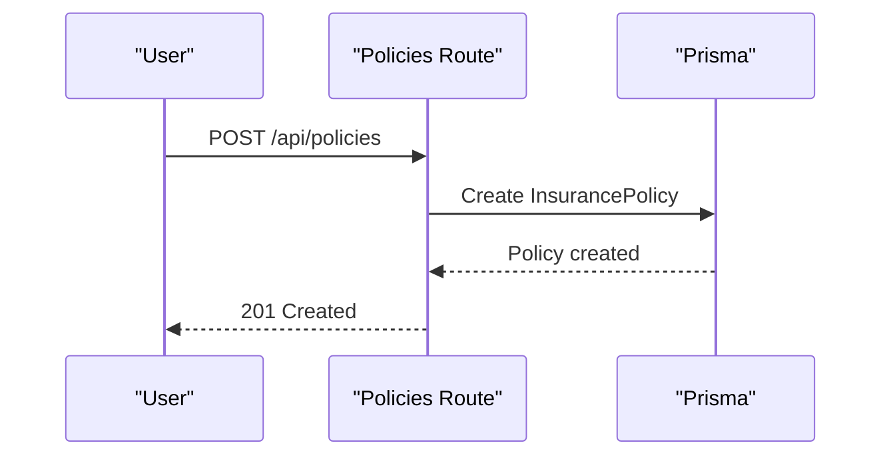
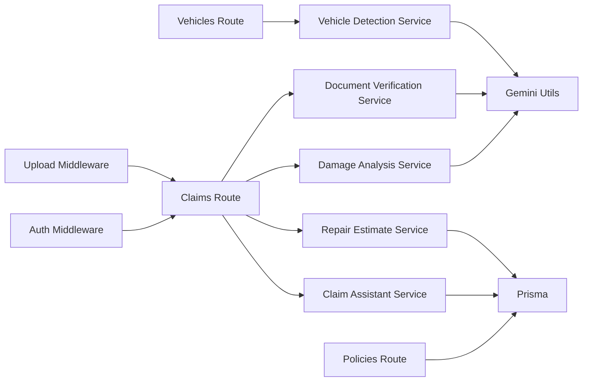
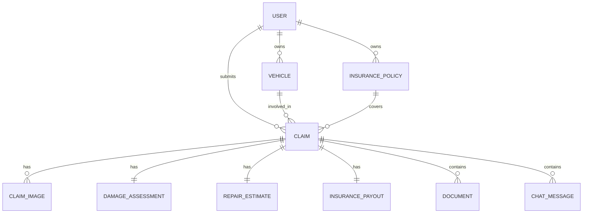

# Business Logic Layer

<cite>
**Referenced Files in This Document**
- [schema.prisma](file://backend/prisma/schema.prisma)
- [claims.ts](file://backend/src/routes/claims.ts)
- [policies.ts](file://backend/src/routes/policies.ts)
- [vehicles.ts](file://backend/src/routes/vehicles.ts)
- [damageAnalysisService.ts](file://backend/src/services/damageAnalysisService.ts)
- [repairEstimateService.ts](file://backend/src/services/repairEstimateService.ts)
- [documentVerificationService.ts](file://backend/src/services/documentVerificationService.ts)
- [vehicleDetectionService.ts](file://backend/src/services/vehicleDetectionService.ts)
- [claimAssistantService.ts](file://backend/src/services/claimAssistantService.ts)
- [auth.ts](file://backend/src/middleware/auth.ts)
- [upload.ts](file://backend/src/middleware/upload.ts)
- [errorHandler.ts](file://backend/src/middleware/errorHandler.ts)
- [gemini.ts](file://backend/src/utils/gemini.ts)
- [index.ts (types)](file://backend/src/types/index.ts)
</cite>

## Table of Contents
1. Introduction
2. Project Structure
3. Core Components
4. Architecture Overview
5. Detailed Component Analysis
6. Dependency Analysis
7. Performance Considerations
8. Troubleshooting Guide
9. Conclusion
10. Appendices

## Introduction
This document explains the business logic layer that implements core insurance domain functionality for vehicle claims, vehicles, and policies. It covers:
- Claims processing workflow: submission, status transitions, approval workflows, and notifications via an AI assistant chat.
- Vehicle management: registration validation, photo processing, and history tracking.
- Policy management: creation, coverage calculations, premium adjustments, and renewal considerations.
- Business rule validation, data integrity checks, and automation patterns.
- Error handling for business rule violations, consistency maintenance, and audit trail generation.
- Extensibility guidance for new claim types or policy variations.

## Project Structure
The backend exposes REST endpoints organized by domain (claims, vehicles, policies). Each route enforces authentication and delegates to services for specialized logic such as AI-based damage analysis, repair estimates, document verification, and vehicle detection. Data is persisted using Prisma with a SQLite database.

**Diagram sources**
- [claims.ts:1-450](file://backend/src/routes/claims.ts#L1-L450)
- [vehicles.ts:1-169](file://backend/src/routes/vehicles.ts#L1-L169)
- [policies.ts:1-131](file://backend/src/routes/policies.ts#L1-L131)
- [damageAnalysisService.ts:1-154](file://backend/src/services/damageAnalysisService.ts#L1-L154)
- [repairEstimateService.ts:1-199](file://backend/src/services/repairEstimateService.ts#L1-L199)
- [documentVerificationService.ts:1-107](file://backend/src/services/documentVerificationService.ts#L1-L107)
- [vehicleDetectionService.ts:1-96](file://backend/src/services/vehicleDetectionService.ts#L1-L96)
- [claimAssistantService.ts:1-130](file://backend/src/services/claimAssistantService.ts#L1-L130)
- [auth.ts:1-23](file://backend/src/middleware/auth.ts#L1-L23)
- [upload.ts:1-54](file://backend/src/middleware/upload.ts#L1-L54)
- [gemini.ts:1-12](file://backend/src/utils/gemini.ts#L1-L12)

**Section sources**
- [claims.ts:1-450](file://backend/src/routes/claims.ts#L1-L450)
- [vehicles.ts:1-169](file://backend/src/routes/vehicles.ts#L1-L169)
- [policies.ts:1-131](file://backend/src/routes/policies.ts#L1-L131)
- [schema.prisma:1-202](file://backend/prisma/schema.prisma#L1-L202)

## Core Components
- Claims API: Create, read, update, submit, analyze, estimate, upload images/documents, verify documents, and chat assistance.
- Vehicles API: Detect vehicle from image, register/update/delete vehicles, list vehicles with claim counts.
- Policies API: Create/read/update/delete policies; used to link coverage to claims.
- Services:
  - Damage analysis: AI-driven assessment of images to identify damages and severity.
  - Repair estimate: Itemized cost calculation based on damage assessment and policy deductible.
  - Document verification: AI-based authenticity and completeness checks.
  - Vehicle detection: Extract make/model/year/color/license plate from images.
  - Claim assistant: Context-aware chat responses using stored claim context and conversation history.
- Middleware:
  - Authentication: JWT-based authorization ensuring user-scoped access.
  - Uploads: Multer-based file handling with type and size constraints.
- Data model: Prisma schema defines entities and relationships for users, vehicles, policies, claims, assessments, estimates, payouts, documents, and chat messages.

**Section sources**
- [claims.ts:20-447](file://backend/src/routes/claims.ts#L20-L447)
- [vehicles.ts:15-166](file://backend/src/routes/vehicles.ts#L15-L166)
- [policies.ts:12-128](file://backend/src/routes/policies.ts#L12-L128)
- [damageAnalysisService.ts:50-153](file://backend/src/services/damageAnalysisService.ts#L50-L153)
- [repairEstimateService.ts:104-199](file://backend/src/services/repairEstimateService.ts#L104-L199)
- [documentVerificationService.ts:41-107](file://backend/src/services/documentVerificationService.ts#L41-L107)
- [vehicleDetectionService.ts:46-96](file://backend/src/services/vehicleDetectionService.ts#L46-L96)
- [claimAssistantService.ts:19-130](file://backend/src/services/claimAssistantService.ts#L19-L130)
- [auth.ts:5-23](file://backend/src/middleware/auth.ts#L5-L23)
- [upload.ts:17-54](file://backend/src/middleware/upload.ts#L17-L54)
- [schema.prisma:10-202](file://backend/prisma/schema.prisma#L10-L202)

## Architecture Overview
The system follows a layered architecture:
- API routes enforce authentication and input validation, then delegate to services.
- Services encapsulate business rules and orchestrate external AI calls and database operations.
- Prisma provides strongly-typed data access and relational integrity.
- File uploads are handled by middleware and referenced by records.

**Diagram sources**
- [claims.ts:152-193](file://backend/src/routes/claims.ts#L152-L193)
- [damageAnalysisService.ts:50-153](file://backend/src/services/damageAnalysisService.ts#L50-L153)
- [repairEstimateService.ts:104-199](file://backend/src/services/repairEstimateService.ts#L104-L199)

## Detailed Component Analysis

### Claims Processing Workflow
- Submission:
  - Validates required fields and ownership of the vehicle.
  - Creates a claim in DRAFT state.
  - On submit, requires at least one image; transitions status to SUBMITTED and triggers background AI damage analysis.
- Status transitions:
  - DRAFT -> SUBMITTED on explicit submit.
  - Subsequent statuses (UNDER_REVIEW, APPROVED, REJECTED, COMPLETED) are modeled in the schema and can be updated by admin flows or future automation.
- AI integration:
  - Damage analysis reads uploaded images, sends them to Gemini, parses structured JSON, persists assessment, updates image annotations, and auto-generates repair estimates.
- Estimates and payouts:
  - Repair estimate calculates itemized costs and total days; if a policy is linked, computes covered amount and estimated payout after deductible.
- Documents:
  - Supports uploading LICENSE, REGISTRATION, ACCIDENT_REPORT, REPAIR_ESTIMATE.
  - Verification uses AI to determine VERIFIED, ISSUES_FOUND, or UNREADABLE and stores results.
- Chat assistant:
  - Builds rich context from claim, vehicle, policy, assessment, estimate, payout, and documents.
  - Persists conversation history per claim for continuity.

**Diagram sources**
- [claims.ts:152-193](file://backend/src/routes/claims.ts#L152-L193)
- [damageAnalysisService.ts:50-153](file://backend/src/services/damageAnalysisService.ts#L50-L153)
- [repairEstimateService.ts:104-199](file://backend/src/services/repairEstimateService.ts#L104-L199)

**Section sources**
- [claims.ts:20-447](file://backend/src/routes/claims.ts#L20-L447)
- [damageAnalysisService.ts:50-153](file://backend/src/services/damageAnalysisService.ts#L50-L153)
- [repairEstimateService.ts:104-199](file://backend/src/services/repairEstimateService.ts#L104-L199)
- [documentVerificationService.ts:41-107](file://backend/src/services/documentVerificationService.ts#L41-L107)
- [claimAssistantService.ts:19-130](file://backend/src/services/claimAssistantService.ts#L19-L130)
- [schema.prisma:62-94](file://backend/prisma/schema.prisma#L62-L94)

### Vehicle Management Logic
- Registration validation:
  - Required fields include make, model, year, license plate, color.
  - Optional VIN and mileage supported; photos stored as JSON array.
- Photo processing:
  - Image upload supports JPEG/PNG/WebP up to 10MB.
  - Dedicated endpoint detects vehicle details from an image using AI and returns confidence level and additional observations.
- History tracking:
  - Vehicle listing includes count of associated claims.
  - Vehicle detail includes recent claims with key fields for quick history review.

**Diagram sources**
- [schema.prisma:27-43](file://backend/prisma/schema.prisma#L27-L43)
- [schema.prisma:71-94](file://backend/prisma/schema.prisma#L71-L94)

**Section sources**
- [vehicles.ts:15-166](file://backend/src/routes/vehicles.ts#L15-L166)
- [vehicleDetectionService.ts:46-96](file://backend/src/services/vehicleDetectionService.ts#L46-L96)
- [upload.ts:17-54](file://backend/src/middleware/upload.ts#L17-L54)
- [schema.prisma:27-43](file://backend/prisma/schema.prisma#L27-L43)

### Policy Management Functionality
- Creation:
  - Requires provider name, policy number, coverage type, deductible, premium amount, start/end dates.
  - Stores numeric values with appropriate parsing and date conversion.
- Coverage calculations:
  - Deductible applied when computing covered amounts during repair estimate generation.
- Premium adjustments:
  - Update endpoint allows changing premium amount and other fields.
- Renewal processing:
  - End date field enables lifecycle tracking; future automation could trigger renewal reminders or re-pricing based on expiry.

**Diagram sources**
- [policies.ts:12-40](file://backend/src/routes/policies.ts#L12-L40)
- [schema.prisma:45-60](file://backend/prisma/schema.prisma#L45-L60)

**Section sources**
- [policies.ts:12-128](file://backend/src/routes/policies.ts#L12-L128)
- [schema.prisma:45-60](file://backend/prisma/schema.prisma#L45-L60)

### Business Rule Validation and Data Integrity
- Input validation:
  - Claims require essential incident details and at least one image before submission.
  - Documents must be of allowed types; files validated by upload middleware.
- Ownership enforcement:
  - All queries filter by authenticated userId to ensure isolation.
- Referential integrity:
  - Relationships enforced by Prisma schema with cascade behaviors where appropriate.
- Consistency:
  - Damage assessment and repair estimate are tied to claims; estimates auto-generated post-assessment.
  - Payouts computed only when a policy is linked.

**Section sources**
- [claims.ts:20-193](file://backend/src/routes/claims.ts#L20-L193)
- [upload.ts:30-54](file://backend/src/middleware/upload.ts#L30-L54)
- [auth.ts:5-23](file://backend/src/middleware/auth.ts#L5-L23)
- [schema.prisma:27-202](file://backend/prisma/schema.prisma#L27-L202)

### Workflow Automation Patterns
- Background processing:
  - Submitting a claim triggers asynchronous damage analysis to avoid blocking the response.
- Auto-generation:
  - After damage analysis, repair estimates are automatically generated and saved.
  - If a policy is linked, estimated payouts are calculated and persisted.
- Conversational automation:
  - Chat assistant builds context from multiple related entities and persists conversation history for continuity.

**Section sources**
- [claims.ts:175-188](file://backend/src/routes/claims.ts#L175-L188)
- [damageAnalysisService.ts:144-150](file://backend/src/services/damageAnalysisService.ts#L144-L150)
- [repairEstimateService.ts:158-189](file://backend/src/services/repairEstimateService.ts#L158-L189)
- [claimAssistantService.ts:40-130](file://backend/src/services/claimAssistantService.ts#L40-L130)

### Error Handling and Audit Trail
- Error handling:
  - Centralized error handler distinguishes application errors from internal server errors.
  - Route handlers return consistent error shapes for client consumption.
- Audit trail:
  - Chat messages persist both user and assistant messages per claim, providing an audit log of interactions.
  - Document verification results stored alongside verification status for traceability.
  - AI raw responses preserved in damage assessments for debugging and compliance.

**Section sources**
- [errorHandler.ts:1-28](file://backend/src/middleware/errorHandler.ts#L1-L28)
- [claimAssistantService.ts:107-130](file://backend/src/services/claimAssistantService.ts#L107-L130)
- [documentVerificationService.ts:96-107](file://backend/src/services/documentVerificationService.ts#L96-L107)
- [damageAnalysisService.ts:110-130](file://backend/src/services/damageAnalysisService.ts#L110-L130)

### Extending Business Logic
- New claim types:
  - Add a new enum value to ClaimStatus if needed and extend status transition logic in routes or admin services.
  - Introduce new document types in the schema and validate in upload handlers.
  - Extend damage analysis prompts to recognize new damage categories and map to cost tables in repair estimates.
- Policy variations:
  - Add new coverage types and adjust payout calculations in repair estimate service based on coverage rules.
  - Implement renewal workflows by monitoring endDate and triggering reminders or re-quoting processes.
- Notifications:
  - Integrate email/SMS providers in services triggered by status changes or verification outcomes.
  - Persist notification events to support audit trails.

[No sources needed since this section provides general extension guidance]

## Dependency Analysis
- Routes depend on middleware for auth and uploads, and on services for domain logic.
- Services depend on Prisma for persistence and Gemini utils for AI capabilities.
- Types define shared interfaces across services and routes.

**Diagram sources**
- [claims.ts:1-450](file://backend/src/routes/claims.ts#L1-L450)
- [vehicles.ts:1-169](file://backend/src/routes/vehicles.ts#L1-L169)
- [policies.ts:1-131](file://backend/src/routes/policies.ts#L1-L131)
- [damageAnalysisService.ts:1-154](file://backend/src/services/damageAnalysisService.ts#L1-L154)
- [repairEstimateService.ts:1-199](file://backend/src/services/repairEstimateService.ts#L1-L199)
- [documentVerificationService.ts:1-107](file://backend/src/services/documentVerificationService.ts#L1-L107)
- [vehicleDetectionService.ts:1-96](file://backend/src/services/vehicleDetectionService.ts#L1-L96)
- [claimAssistantService.ts:1-130](file://backend/src/services/claimAssistantService.ts#L1-L130)
- [auth.ts:1-23](file://backend/src/middleware/auth.ts#L1-L23)
- [upload.ts:1-54](file://backend/src/middleware/upload.ts#L1-L54)
- [gemini.ts:1-12](file://backend/src/utils/gemini.ts#L1-L12)

**Section sources**
- [index.ts (types):1-51](file://backend/src/types/index.ts#L1-L51)
- [schema.prisma:10-202](file://backend/prisma/schema.prisma#L10-L202)

## Performance Considerations
- Asynchronous processing:
  - Damage analysis runs in the background upon claim submission to reduce latency.
- Efficient queries:
  - Use selective includes and ordering to minimize payload sizes and improve load times.
- File handling:
  - Enforce file size limits and allowed MIME types to prevent abuse and optimize storage.
- AI call optimization:
  - Cache or deduplicate repeated analyses if applicable; consider batching requests where feasible.
- Database indexing:
  - Ensure frequently queried fields (e.g., userId, status, claimId) are indexed by Prisma conventions or database configuration.

[No sources needed since this section provides general guidance]

## Troubleshooting Guide
- Common errors:
  - Missing images on claim submission: ensure at least one image is uploaded before submitting.
  - Invalid document type: use allowed types (LICENSE, REGISTRATION, ACCIDENT_REPORT, REPAIR_ESTIMATE).
  - Unauthorized access: verify Bearer token presence and validity.
  - File not found: confirm upload paths exist and permissions are correct.
- Diagnostics:
  - Check AI parsing logs if damage analysis or document verification fails to parse responses.
  - Review stored aiRawResponse and verificationResult for insights into AI outputs.
- Recovery steps:
  - Re-upload images/documents if corrupted or unreadable.
  - Retry AI calls after transient failures; implement retries with backoff for robustness.

**Section sources**
- [claims.ts:170-193](file://backend/src/routes/claims.ts#L170-L193)
- [claims.ts:316-353](file://backend/src/routes/claims.ts#L316-L353)
- [auth.ts:5-23](file://backend/src/middleware/auth.ts#L5-L23)
- [damageAnalysisService.ts:85-103](file://backend/src/services/damageAnalysisService.ts#L85-L103)
- [documentVerificationService.ts:78-94](file://backend/src/services/documentVerificationService.ts#L78-L94)

## Conclusion
The business logic layer integrates claims, vehicles, and policies through well-defined routes and services. It leverages AI for damage analysis, document verification, and conversational assistance while maintaining strong data integrity via Prisma. The design supports extensibility for new claim types and policy variations, with clear error handling and audit trails to support operational needs.

[No sources needed since this section summarizes without analyzing specific files]

## Appendices

### Data Model Summary

**Diagram sources**
- [schema.prisma:10-202](file://backend/prisma/schema.prisma#L10-L202)