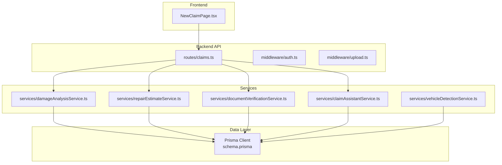
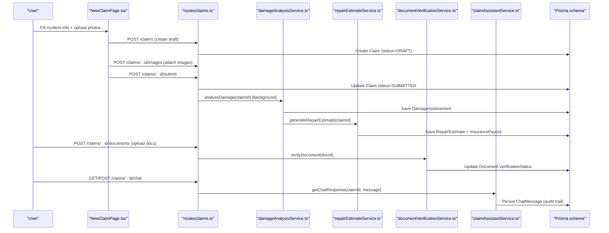
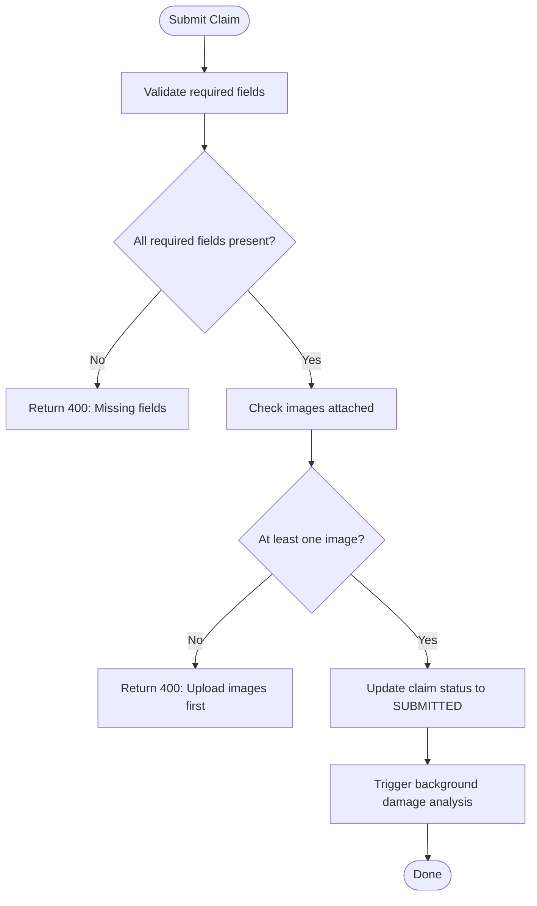
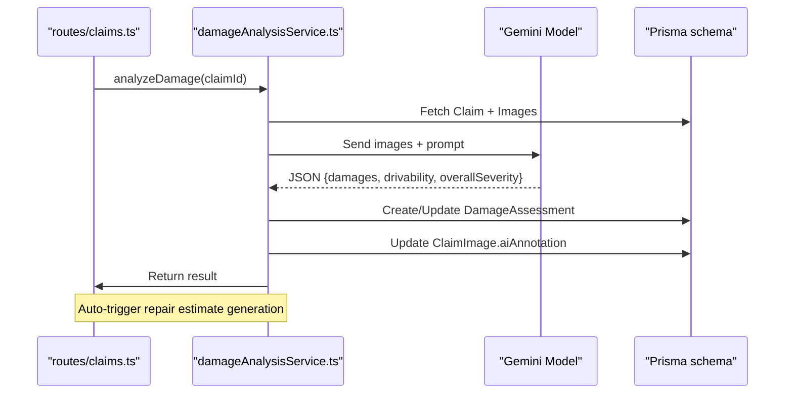
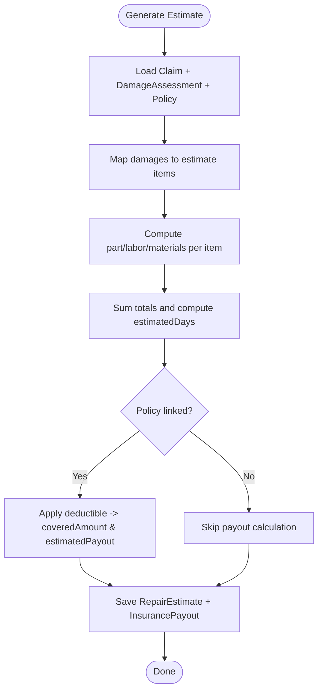
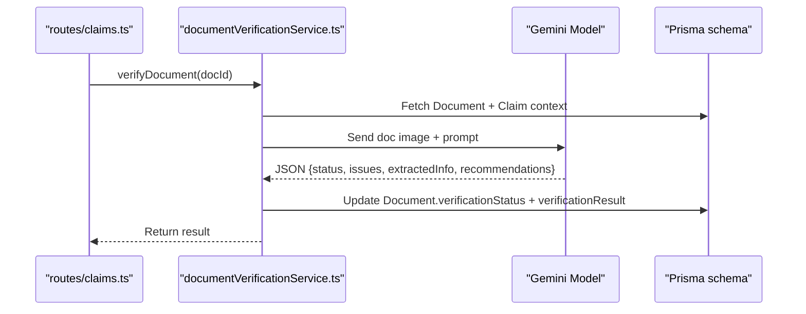
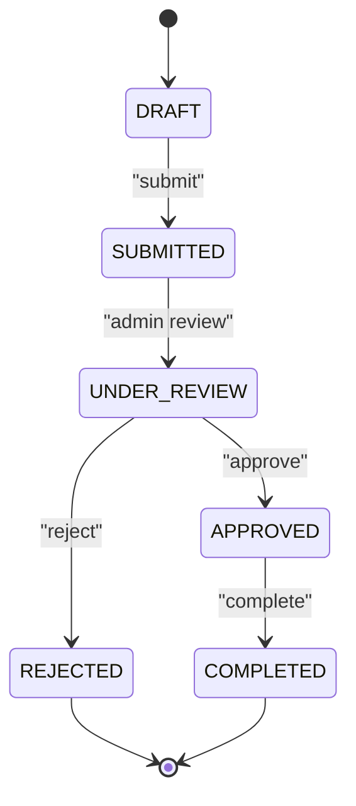
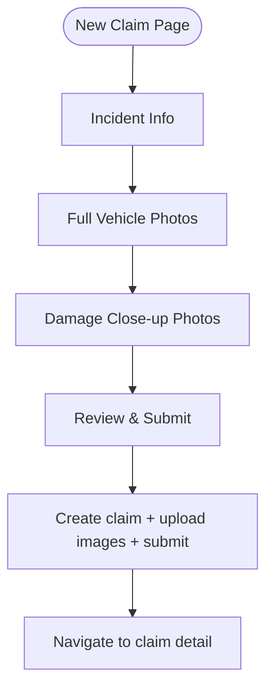
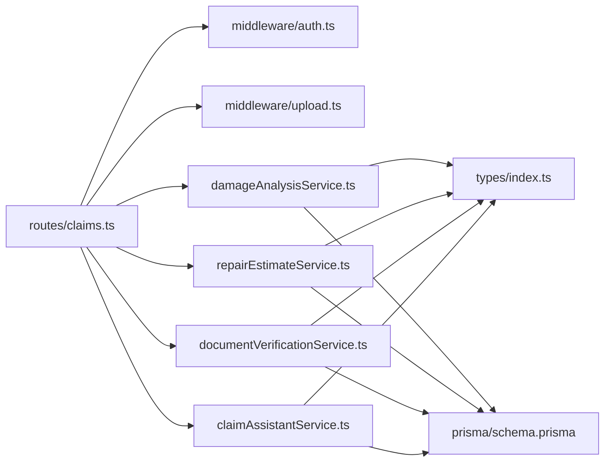

# Claims Processing Workflow

<cite>
**Referenced Files in This Document**
- [claims.ts](file://backend/src/routes/claims.ts)
- [claimAssistantService.ts](file://backend/src/services/claimAssistantService.ts)
- [damageAnalysisService.ts](file://backend/src/services/damageAnalysisService.ts)
- [documentVerificationService.ts](file://backend/src/services/documentVerificationService.ts)
- [repairEstimateService.ts](file://backend/src/services/repairEstimateService.ts)
- [vehicleDetectionService.ts](file://backend/src/services/vehicleDetectionService.ts)
- [schema.prisma](file://backend/prisma/schema.prisma)
- [index.ts (types)](file://backend/src/types/index.ts)
- [NewClaimPage.tsx](file://frontend/src/pages/NewClaimPage.tsx)
</cite>

## Table of Contents
1. Introduction
2. Project Structure
3. Core Components
4. Architecture Overview
5. Detailed Component Analysis
6. Dependency Analysis
7. Performance Considerations
8. Troubleshooting Guide
9. Conclusion
10. Appendices

## Introduction
This document describes the end-to-end insurance claim lifecycle implemented by the Smart Vehicle Insurance Claim System. It covers claim submission with validation and initial status assignment, AI-powered damage assessment using image analysis, automated repair estimate generation, document verification for authenticity and quality, and the overall workflow from submission to approval/rejection. It also explains how notifications and audit trails are maintained through chat logs and persisted records, and provides guidance for extending workflows and business rules.

## Project Structure
The system is organized into a backend API with services for AI-driven processing and a React frontend that guides users through claim creation and management.

**Diagram sources**
- [claims.ts:1-450](file://backend/src/routes/claims.ts#L1-L450)
- [schema.prisma:1-202](file://backend/prisma/schema.prisma#L1-L202)

**Section sources**
- [claims.ts:1-450](file://backend/src/routes/claims.ts#L1-L450)
- [schema.prisma:1-202](file://backend/prisma/schema.prisma#L1-L202)

## Core Components
- Claim Submission and Validation: Enforces required fields and ensures at least one image before submission; sets initial status to SUBMITTED.
- AI Damage Assessment: Analyzes uploaded images to identify damages, classify severity, and assess drivability.
- Repair Estimate Generation: Computes itemized costs for parts, labor, and materials; calculates total cost and estimated repair days; derives insurance payout estimates based on policy deductible.
- Document Verification: Validates uploaded documents for readability, completeness, and potential issues; updates verification status.
- AI Chat Assistant: Provides contextual responses about claim status, assessments, estimates, and next steps; persists conversation as an audit trail.
- Data Model: Defines claims, vehicles, policies, images, assessments, estimates, payouts, documents, and chat messages with relationships and enums.

**Section sources**
- [claims.ts:21-193](file://backend/src/routes/claims.ts#L21-L193)
- [damageAnalysisService.ts:50-153](file://backend/src/services/damageAnalysisService.ts#L50-L153)
- [repairEstimateService.ts:104-199](file://backend/src/services/repairEstimateService.ts#L104-L199)
- [documentVerificationService.ts:41-106](file://backend/src/services/documentVerificationService.ts#L41-L106)
- [claimAssistantService.ts:19-129](file://backend/src/services/claimAssistantService.ts#L19-L129)
- [schema.prisma:62-202](file://backend/prisma/schema.prisma#L62-L202)

## Architecture Overview
The claim workflow integrates user input, AI services, and persistent storage to automate and assist claim processing.

**Diagram sources**
- [claims.ts:21-193](file://backend/src/routes/claims.ts#L21-L193)
- [damageAnalysisService.ts:50-153](file://backend/src/services/damageAnalysisService.ts#L50-L153)
- [repairEstimateService.ts:104-199](file://backend/src/services/repairEstimateService.ts#L104-L199)
- [documentVerificationService.ts:41-106](file://backend/src/services/documentVerificationService.ts#L41-L106)
- [claimAssistantService.ts:19-129](file://backend/src/services/claimAssistantService.ts#L19-L129)
- [schema.prisma:62-202](file://backend/prisma/schema.prisma#L62-L202)

## Detailed Component Analysis

### Claim Submission Process
- Required fields: vehicleId, incidentDate, incidentLocation, incidentDescription. Optional fields include policyId, weatherConditions, hasPoliceReport.
- Validation:
  - Backend validates required fields on create.
  - On submit, requires at least one image; otherwise returns an error.
- Initial status:
  - Created as DRAFT.
  - After successful submit, status transitions to SUBMITTED.
- Background processing:
  - Submit triggers background AI damage analysis which auto-generates repair estimates and updates related records.

**Diagram sources**
- [claims.ts:21-57](file://backend/src/routes/claims.ts#L21-L57)
- [claims.ts:152-193](file://backend/src/routes/claims.ts#L152-L193)

**Section sources**
- [claims.ts:21-57](file://backend/src/routes/claims.ts#L21-L57)
- [claims.ts:152-193](file://backend/src/routes/claims.ts#L152-L193)

### AI-Powered Damage Assessment
- Input: All images associated with the claim.
- Processing:
  - Reads image files and sends them to the AI model with a structured prompt to detect dents, scratches, cracks, broken lights, bumper damage, glass damage, wheel/frame issues, etc.
  - Returns JSON with damages array, drivability assessment, and overall severity.
  - Parses response robustly, handling markdown-wrapped JSON; falls back to a safe default if parsing fails.
- Output:
  - Creates or updates DamageAssessment record linked to the claim.
  - Updates per-image AI annotations based on damage locations.
  - Auto-calls repair estimate generation after successful assessment.

**Diagram sources**
- [damageAnalysisService.ts:50-153](file://backend/src/services/damageAnalysisService.ts#L50-L153)
- [claims.ts:270-288](file://backend/src/routes/claims.ts#L270-L288)

**Section sources**
- [damageAnalysisService.ts:50-153](file://backend/src/services/damageAnalysisService.ts#L50-L153)

### Repair Estimate Generation
- Inputs: DamageAssessment items with type, severity, location, description, affectedParts.
- Cost Calculation:
  - Uses predefined cost ranges for parts and labor hours by damage type and severity.
  - Applies severity-based labor rates and paint material costs.
  - Computes subtotal per item: partCost + laborCost + paintMaterials.
  - Aggregates totals: totalPartsCost, totalLaborCost, totalCost, totalLaborHours.
  - Estimates repair days based on total labor hours divided by standard daily capacity.
- Outputs:
  - Creates or updates RepairEstimate with itemized details and totals.
  - If a policy is linked, computes covered amount and estimated payout after applying deductible; stores InsurancePayout.

**Diagram sources**
- [repairEstimateService.ts:104-199](file://backend/src/services/repairEstimateService.ts#L104-L199)

**Section sources**
- [repairEstimateService.ts:104-199](file://backend/src/services/repairEstimateService.ts#L104-L199)

### Document Verification Workflow
- Supported types: LICENSE, REGISTRATION, ACCIDENT_REPORT, REPAIR_ESTIMATE.
- Processing:
  - Reads document file and sends it to the AI model with context (document type, vehicle, policyholder).
  - Checks readability, identifies document type, verifies presence of key information, flags issues like expiration or tampering.
  - Returns JSON with status (VERIFIED, ISSUES_FOUND, UNREADABLE), issues list, extractedInfo, and recommendations.
- Output:
  - Updates Document record with verificationStatus and verificationResult.

**Diagram sources**
- [documentVerificationService.ts:41-106](file://backend/src/services/documentVerificationService.ts#L41-L106)
- [claims.ts:379-397](file://backend/src/routes/claims.ts#L379-L397)

**Section sources**
- [documentVerificationService.ts:41-106](file://backend/src/services/documentVerificationService.ts#L41-L106)
- [claims.ts:316-353](file://backend/src/routes/claims.ts#L316-L353)

### Claim Status Transitions and Audit Trail
- Statuses: DRAFT, SUBMITTED, UNDER_REVIEW, APPROVED, REJECTED, COMPLETED.
- Current transitions:
  - DRAFT -> SUBMITTED on submit endpoint.
  - Other transitions (UNDER_REVIEW, APPROVED, REJECTED, COMPLETED) can be extended via admin routes or additional endpoints.
- Audit trail:
  - Chat messages are persisted per claim with roles USER and ASSISTANT, providing a chronological log of interactions and decisions.
  - DamageAssessment, RepairEstimate, InsurancePayout, and Document verification results serve as immutable artifacts for auditing.

**Diagram sources**
- [schema.prisma:62-69](file://backend/prisma/schema.prisma#L62-L69)
- [claims.ts:152-193](file://backend/src/routes/claims.ts#L152-L193)

**Section sources**
- [schema.prisma:62-69](file://backend/prisma/schema.prisma#L62-L69)
- [claims.ts:152-193](file://backend/src/routes/claims.ts#L152-L193)

### Frontend Claim Creation Flow
- Steps: Incident Info, Full Vehicle Photos, Damage Close-up Photos, Review & Submit.
- Validation:
  - Requires vehicle selection, incident date/location/description.
  - Requires at least one full vehicle photo before proceeding.
- Submission:
  - Creates claim, uploads images, then submits; navigates to claim detail page.

**Diagram sources**
- [NewClaimPage.tsx:1-252](file://frontend/src/pages/NewClaimPage.tsx#L1-L252)

**Section sources**
- [NewClaimPage.tsx:1-252](file://frontend/src/pages/NewClaimPage.tsx#L1-L252)

## Dependency Analysis
- Routes depend on middleware for authentication and file uploads.
- Services encapsulate AI integrations and database operations.
- Prisma schema defines entities and relationships used across services.
- Types define shared interfaces for requests/responses and service outputs.

**Diagram sources**
- [claims.ts:1-450](file://backend/src/routes/claims.ts#L1-L450)
- [index.ts:1-51](file://backend/src/types/index.ts#L1-L51)
- [schema.prisma:1-202](file://backend/prisma/schema.prisma#L1-L202)

**Section sources**
- [claims.ts:1-450](file://backend/src/routes/claims.ts#L1-L450)
- [index.ts:1-51](file://backend/src/types/index.ts#L1-L51)
- [schema.prisma:1-202](file://backend/prisma/schema.prisma#L1-L202)

## Performance Considerations
- Image handling: Reading and encoding images to base64 for AI calls can be memory-intensive; consider streaming or optimizing image sizes where possible.
- Background processing: Damage analysis runs asynchronously after submit; ensure robust error handling and retries for long-running tasks.
- Database queries: Use selective includes to minimize payload size when fetching claim details for UI or chat context.
- Caching: Consider caching frequent lookups (e.g., vehicle/policy data) if read-heavy workloads emerge.
- Rate limits: Respect external AI provider rate limits and implement exponential backoff for retries.

[No sources needed since this section provides general guidance]

## Troubleshooting Guide
- Missing required fields on claim creation: Ensure vehicleId, incidentDate, incidentLocation, and incidentDescription are provided.
- No images on submit: At least one image must be attached before submitting; otherwise, the request will fail.
- Damage analysis failures: If AI parsing fails, a fallback assessment is stored; manual review may be required.
- Document verification unreadable: If the document image is blurry or damaged, the system marks it UNREADABLE; prompt users to re-upload clearer images.
- Estimate generation errors: Requires a valid DamageAssessment; ensure damage analysis completes successfully before generating estimates.
- Chat assistant errors: Verify claim exists and that chat history retrieval succeeds; check AI model availability.

**Section sources**
- [claims.ts:21-57](file://backend/src/routes/claims.ts#L21-L57)
- [claims.ts:152-193](file://backend/src/routes/claims.ts#L152-L193)
- [damageAnalysisService.ts:85-103](file://backend/src/services/damageAnalysisService.ts#L85-L103)
- [documentVerificationService.ts:78-94](file://backend/src/services/documentVerificationService.ts#L78-L94)
- [repairEstimateService.ts:114-116](file://backend/src/services/repairEstimateService.ts#L114-L116)
- [claimAssistantService.ts:36-38](file://backend/src/services/claimAssistantService.ts#L36-L38)

## Conclusion
The system implements a comprehensive, AI-assisted claims processing workflow that automates damage assessment, generates repair estimates, verifies documents, and maintains an auditable chat history. The modular architecture separates concerns between routing, services, and data modeling, enabling extensibility for custom claim types, additional workflow stages, and business rule modifications.

[No sources needed since this section summarizes without analyzing specific files]

## Appendices

### Custom Claim Types and Extensions
- Extend the ClaimStatus enum to add new states (e.g., PAUSED, RESUBMITTED) and update route handlers to support transitions.
- Add new document types in the DocumentType enum and update validation logic in the document upload route.
- Introduce new AI prompts in services to handle specialized damage categories or document formats.

**Section sources**
- [schema.prisma:62-69](file://backend/prisma/schema.prisma#L62-L69)
- [schema.prisma:162-167](file://backend/prisma/schema.prisma#L162-L167)
- [claims.ts:316-353](file://backend/src/routes/claims.ts#L316-L353)

### Business Rule Modifications
- Adjust cost ranges and labor rates in repair estimate calculations to reflect regional pricing or vendor agreements.
- Modify validation rules for claim submission (e.g., require police report for certain severities).
- Implement notification triggers upon status changes (e.g., email/SMS on APPROVED/REJECTED) by adding hooks in route handlers.

**Section sources**
- [repairEstimateService.ts:4-58](file://backend/src/services/repairEstimateService.ts#L4-L58)
- [claims.ts:21-57](file://backend/src/routes/claims.ts#L21-L57)