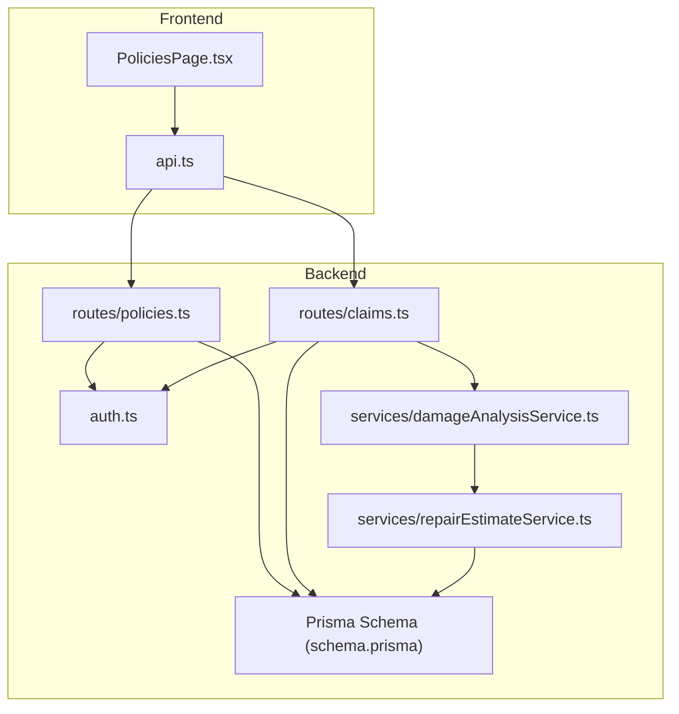
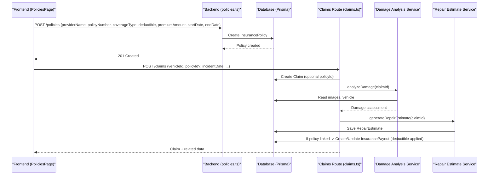
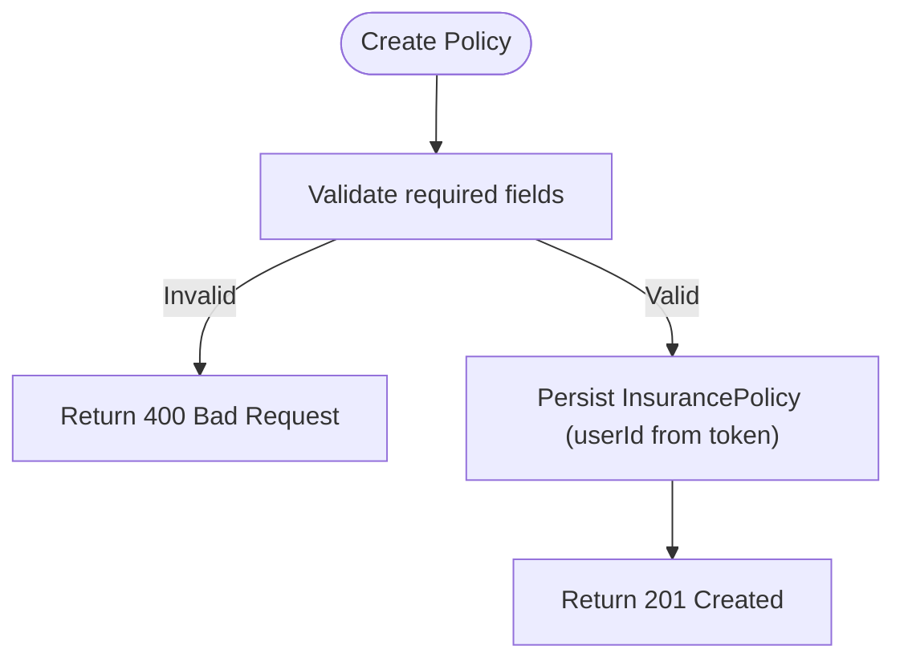
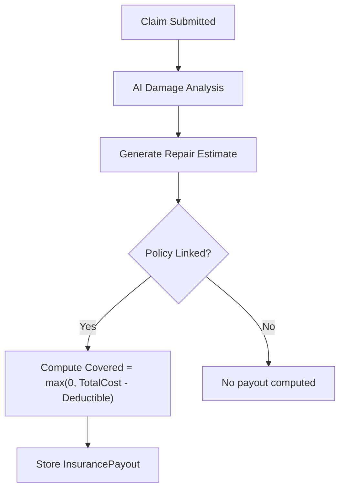
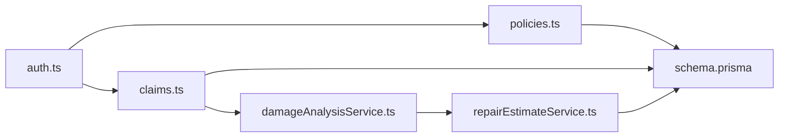
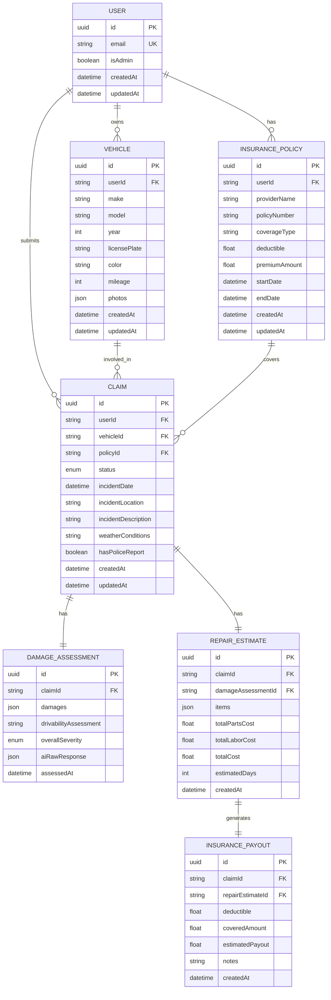

# Policy Management System

<cite>
**Referenced Files in This Document**
- [schema.prisma](file://backend/prisma/schema.prisma)
- [policies.ts](file://backend/src/routes/policies.ts)
- [claims.ts](file://backend/src/routes/claims.ts)
- [damageAnalysisService.ts](file://backend/src/services/damageAnalysisService.ts)
- [repairEstimateService.ts](file://backend/src/services/repairEstimateService.ts)
- [auth.ts](file://backend/src/middleware/auth.ts)
- [index.ts (types)](file://backend/src/types/index.ts)
- [PoliciesPage.tsx](file://frontend/src/pages/PoliciesPage.tsx)
- [api.ts](file://frontend/src/services/api.ts)
- [index.ts (frontend types)](file://frontend/src/types/index.ts)
</cite>

## Table of Contents
1. [Introduction](#introduction)
2. [Project Structure](#project-structure)
3. [Core Components](#core-components)
4. [Architecture Overview](#architecture-overview)
5. [Detailed Component Analysis](#detailed-component-analysis)
6. [Dependency Analysis](#dependency-analysis)
7. [Performance Considerations](#performance-considerations)
8. [Troubleshooting Guide](#troubleshooting-guide)
9. [Conclusion](#conclusion)
10. [Appendices](#appendices)

## Introduction
This document describes the policy management system for vehicle insurance within a claim processing application. It covers policy creation, coverage selection, premium and deductible handling, lifecycle states, renewal considerations, validation rules, and integration with claims and payout calculations. The system currently stores policies as first-class entities linked to users and claims, with pricing fields captured at creation time and used during payout estimation.

## Project Structure
The system is organized into backend API routes, services, middleware, Prisma data models, and a React frontend that manages user interactions for policies and claims.

**Diagram sources**
- [PoliciesPage.tsx:1-102](file://frontend/src/pages/PoliciesPage.tsx#L1-L102)
- [api.ts:1-36](file://frontend/src/services/api.ts#L1-L36)
- [policies.ts:1-131](file://backend/src/routes/policies.ts#L1-L131)
- [claims.ts:1-450](file://backend/src/routes/claims.ts#L1-L450)
- [damageAnalysisService.ts:1-154](file://backend/src/services/damageAnalysisService.ts#L1-L154)
- [repairEstimateService.ts:1-199](file://backend/src/services/repairEstimateService.ts#L1-L199)
- [schema.prisma:45-60](file://backend/prisma/schema.prisma#L45-L60)

**Section sources**
- [schema.prisma:10-60](file://backend/prisma/schema.prisma#L10-L60)
- [policies.ts:1-131](file://backend/src/routes/policies.ts#L1-L131)
- [claims.ts:1-450](file://backend/src/routes/claims.ts#L1-L450)
- [PoliciesPage.tsx:1-102](file://frontend/src/pages/PoliciesPage.tsx#L1-L102)
- [api.ts:1-36](file://frontend/src/services/api.ts#L1-L36)

## Core Components
- Policy model and CRUD endpoints:
  - Data model includes provider name, policy number, coverage type, deductible, premium amount, start/end dates, and timestamps.
  - Endpoints support create, read, update, delete with authentication and ownership checks.
- Claims integration:
  - Claims can be created with an optional policyId link.
  - Claim submission triggers AI damage analysis and automatic repair estimate generation.
- Payout calculation:
  - When a policy is linked to a claim, the system computes covered amounts based on total repair cost minus deductible.

Key responsibilities:
- Policies: store and manage insurance policy metadata and terms (coverage type, deductible, premium).
- Claims: orchestrate assessment and estimates; optionally use linked policy for payout math.
- Services: implement AI-based damage analysis and deterministic repair cost estimation.

**Section sources**
- [schema.prisma:45-60](file://backend/prisma/schema.prisma#L45-L60)
- [policies.ts:12-40](file://backend/src/routes/policies.ts#L12-L40)
- [claims.ts:20-57](file://backend/src/routes/claims.ts#L20-L57)
- [repairEstimateService.ts:158-189](file://backend/src/services/repairEstimateService.ts#L158-L189)

## Architecture Overview
The policy management workflow integrates with claims to compute payouts using stored policy terms.

**Diagram sources**
- [policies.ts:12-40](file://backend/src/routes/policies.ts#L12-L40)
- [claims.ts:20-57](file://backend/src/routes/claims.ts#L20-L57)
- [damageAnalysisService.ts:50-153](file://backend/src/services/damageAnalysisService.ts#L50-L153)
- [repairEstimateService.ts:104-199](file://backend/src/services/repairEstimateService.ts#L104-L199)
- [schema.prisma:71-94](file://backend/prisma/schema.prisma#L71-L94)

## Detailed Component Analysis

### Policy Creation Workflow
- Frontend form collects provider name, policy number, coverage type, deductible, premium amount, and validity dates.
- Backend validates required fields, persists the policy under the authenticated user, and returns the created record.
- Ownership is enforced via userId from JWT-decoded claims.

**Diagram sources**
- [policies.ts:12-40](file://backend/src/routes/policies.ts#L12-L40)
- [auth.ts:5-22](file://backend/src/middleware/auth.ts#L5-L22)

**Section sources**
- [policies.ts:12-40](file://backend/src/routes/policies.ts#L12-L40)
- [auth.ts:5-22](file://backend/src/middleware/auth.ts#L5-L22)
- [PoliciesPage.tsx:16-31](file://frontend/src/pages/PoliciesPage.tsx#L16-L31)

### Coverage Selection and Terms Definition
- Coverage type is stored as a string field; supported values are defined by UI options (e.g., Comprehensive, Collision, Liability, Full Coverage).
- Deductible and premium amount are numeric fields persisted with the policy.
- Start and end dates define the policy term window.

Implementation notes:
- No server-side enum enforcement for coverage type; validation is minimal beyond presence checks.
- Premium amount is accepted but not recalculated by the backend; it is treated as a stored term.

**Section sources**
- [schema.prisma:45-60](file://backend/prisma/schema.prisma#L45-L60)
- [PoliciesPage.tsx:55-67](file://frontend/src/pages/PoliciesPage.tsx#L55-L67)
- [policies.ts:12-40](file://backend/src/routes/policies.ts#L12-L40)

### Coverage Calculation Engine
- The engine operates during claim processing when a policy is linked.
- Steps:
  1. AI analyzes uploaded images to produce damage items with severity levels.
  2. A deterministic estimator calculates parts, labor, paint/materials per item using severity and damage type ranges.
  3. Total repair cost is computed.
  4. If a policy is linked, payout is calculated as max(0, totalCost - deductible), and stored as InsurancePayout.

**Diagram sources**
- [damageAnalysisService.ts:50-153](file://backend/src/services/damageAnalysisService.ts#L50-L153)
- [repairEstimateService.ts:104-199](file://backend/src/services/repairEstimateService.ts#L104-L199)

**Section sources**
- [damageAnalysisService.ts:50-153](file://backend/src/services/damageAnalysisService.ts#L50-L153)
- [repairEstimateService.ts:104-199](file://backend/src/services/repairEstimateService.ts#L104-L199)

### Risk Assessment Factors and Pricing Algorithms
- Risk factors considered in estimates:
  - Damage type (dent, scratch, crack, broken light, bumper damage, glass damage, panel deformation, wheel damage, structural damage, other).
  - Severity level (MINOR, MODERATE, SEVERE).
  - Affected parts list influences part naming and potentially cost mapping.
- Pricing algorithm:
  - Parts cost derived from predefined ranges per damage type and severity.
  - Labor hours estimated from severity-specific ranges; labor rate varies by severity.
  - Paint materials added based on severity.
  - Estimated days derived from total labor hours divided by standard daily capacity.

Note: These algorithms apply to repair estimates and indirectly influence payout when a policy is linked. There is no separate premium recalculation engine in this codebase.

**Section sources**
- [repairEstimateService.ts:4-58](file://backend/src/services/repairEstimateService.ts#L4-L58)
- [repairEstimateService.ts:74-102](file://backend/src/services/repairEstimateService.ts#L74-L102)
- [repairEstimateService.ts:120-128](file://backend/src/services/repairEstimateService.ts#L120-L128)

### Policy Status Management
- Current implementation does not include a status field on InsurancePolicy.
- Lifecycle transitions (active, suspended, expired, cancelled) are not modeled or enforced in the schema or routes.
- Practical implications:
  - Expiration is represented only by endDate; clients may treat policies past their end date as expired.
  - No server-side state machine for policy statuses exists.

Recommendation:
- Add a status enum to the InsurancePolicy model and enforce transitions in business logic.

**Section sources**
- [schema.prisma:45-60](file://backend/prisma/schema.prisma#L45-L60)

### Renewal Processing Automation
- No automated renewal endpoints or background jobs are present.
- Clients should handle renewal workflows by creating new policies with updated terms and dates.
- Suggested automation points:
  - Scheduled job to scan expiring policies and trigger notifications.
  - Rate adjustment service to compute new premiums based on risk factors and market rules.
  - Policy update endpoint to extend terms and set status to renewed.

[No sources needed since this section proposes enhancements not implemented in the codebase]

### Policy Validation Rules
- Required fields for creation: providerName, policyNumber, coverageType, deductible, premiumAmount, startDate, endDate.
- Numeric fields are parsed as floats; invalid inputs will cause errors.
- Ownership validation ensures users can only access their own policies.
- No explicit regulatory compliance checks or cross-field validations (e.g., coverage vs. deductible consistency) are implemented.

Suggested improvements:
- Enforce coverage-type-specific minimum deductibles and maximum limits.
- Validate that startDate < endDate and that renewals do not overlap improperly.
- Add compliance flags and audit fields for regulatory reporting.

**Section sources**
- [policies.ts:12-40](file://backend/src/routes/policies.ts#L12-L40)
- [policies.ts:76-108](file://backend/src/routes/policies.ts#L76-L108)
- [auth.ts:5-22](file://backend/src/middleware/auth.ts#L5-L22)

### Examples: Custom Policy Types, Coverage Options, New Pricing Models
- Custom policy types:
  - Extend the coverageType field semantics on the client and add server-side validation if needed.
  - Optionally introduce an enum in the schema to constrain valid types.
- Modify coverage options:
  - Update frontend select options and backend validation to reflect new coverage categories.
  - Adjust any downstream logic that depends on coverage type (e.g., eligibility rules).
- Implement new pricing models:
  - Introduce a pricing service that computes premiums based on risk factors (vehicle age, mileage, driver history, coverage type).
  - Store computed premiums in the policy or a dedicated pricing table and expose endpoints to recalculate upon updates.

[No sources needed since this section provides guidance for extending the system]

## Dependency Analysis
- Authentication dependency:
  - All policy and claim routes require a valid JWT token; unauthorized requests are rejected.
- Data dependencies:
  - Policies depend on User (ownership).
  - Claims depend on Vehicle and optionally InsurancePolicy.
  - Repair estimates depend on DamageAssessment and optionally InsurancePolicy for payout computation.
- Service dependencies:
  - Damage analysis depends on Gemini model utilities and file I/O for images.
  - Repair estimate depends on damage assessment and policy linkage.

**Diagram sources**
- [auth.ts:5-22](file://backend/src/middleware/auth.ts#L5-L22)
- [policies.ts:1-131](file://backend/src/routes/policies.ts#L1-L131)
- [claims.ts:1-450](file://backend/src/routes/claims.ts#L1-L450)
- [damageAnalysisService.ts:1-154](file://backend/src/services/damageAnalysisService.ts#L1-L154)
- [repairEstimateService.ts:1-199](file://backend/src/services/repairEstimateService.ts#L1-L199)
- [schema.prisma:10-60](file://backend/prisma/schema.prisma#L10-L60)

**Section sources**
- [auth.ts:5-22](file://backend/src/middleware/auth.ts#L5-L22)
- [policies.ts:1-131](file://backend/src/routes/policies.ts#L1-L131)
- [claims.ts:1-450](file://backend/src/routes/claims.ts#L1-L450)

## Performance Considerations
- Image processing:
  - Damage analysis reads image files from disk and encodes them to base64; ensure efficient storage paths and avoid unnecessary large payloads.
- Database queries:
  - Use selective includes to reduce payload size (e.g., fetching only necessary relations).
- Background tasks:
  - Damage analysis runs asynchronously after claim submission; consider queueing for scalability.
- Estimation computations:
  - Repair estimate calculations are lightweight; however, repeated calls can be cached if inputs remain unchanged.

[No sources needed since this section provides general guidance]

## Troubleshooting Guide
Common issues and resolutions:
- Unauthorized access:
  - Ensure Authorization header contains a valid Bearer token; check token expiration and secret configuration.
- Missing policy fields:
  - Verify all required fields are provided when creating or updating policies.
- Policy not found:
  - Confirm the policy belongs to the authenticated user and exists in the database.
- Claim submission without images:
  - Upload at least one image before submitting a claim; otherwise, submission fails.
- Damage analysis failures:
  - Check image availability and Gemini model configuration; fallback behavior logs raw responses.
- Estimate generation prerequisites:
  - Damage assessment must exist before generating repair estimates.

**Section sources**
- [auth.ts:5-22](file://backend/src/middleware/auth.ts#L5-L22)
- [policies.ts:12-40](file://backend/src/routes/policies.ts#L12-L40)
- [policies.ts:57-74](file://backend/src/routes/policies.ts#L57-L74)
- [claims.ts:152-193](file://backend/src/routes/claims.ts#L152-L193)
- [damageAnalysisService.ts:50-153](file://backend/src/services/damageAnalysisService.ts#L50-L153)
- [claims.ts:290-314](file://backend/src/routes/claims.ts#L290-L314)

## Conclusion
The current policy management system provides robust policy storage and basic lifecycle operations, integrated tightly with claim processing and payout estimation. While advanced features like policy status management, automated renewals, and dynamic premium pricing are not yet implemented, the architecture supports straightforward extensions. Adding status enums, renewal automation, and a pricing service would enhance operational capabilities and compliance readiness.

[No sources needed since this section summarizes without analyzing specific files]

## Appendices

### Data Model Overview

**Diagram sources**
- [schema.prisma:10-60](file://backend/prisma/schema.prisma#L10-L60)
- [schema.prisma:71-160](file://backend/prisma/schema.prisma#L71-L160)