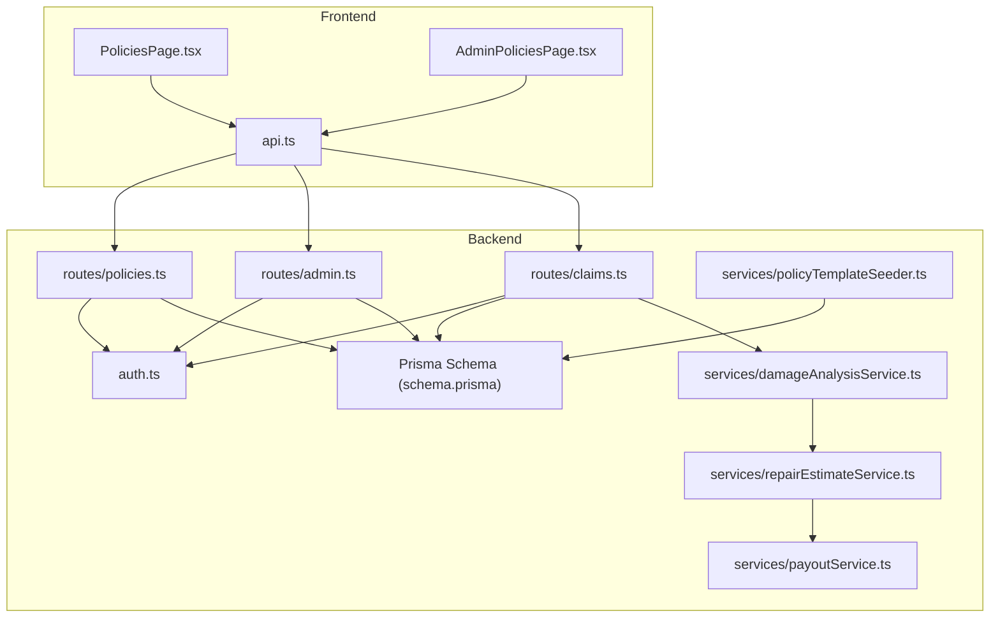
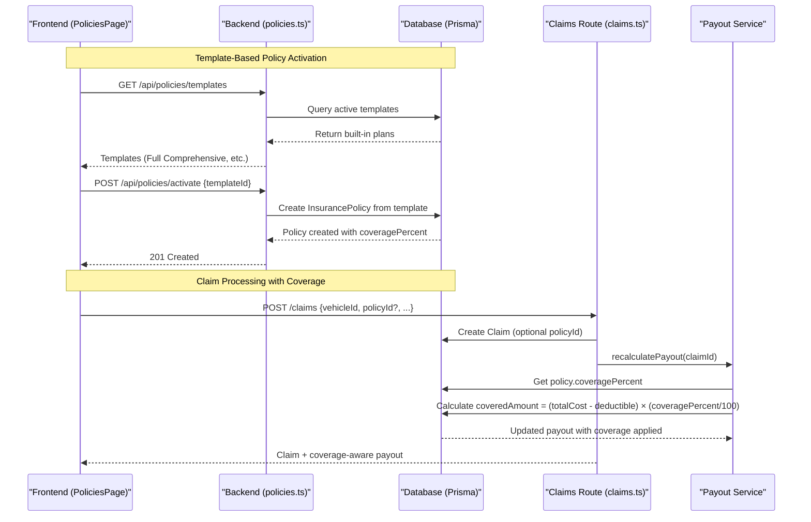
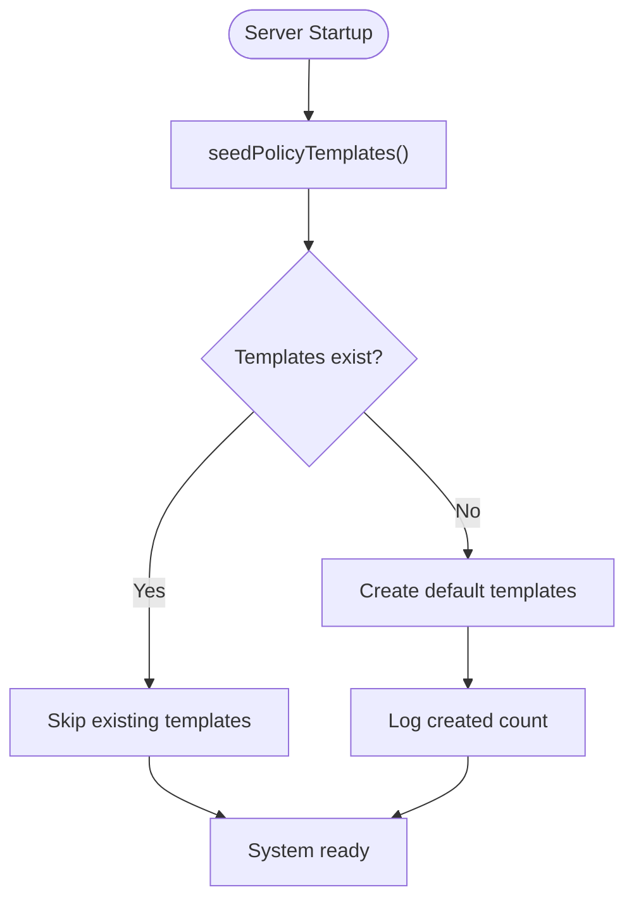
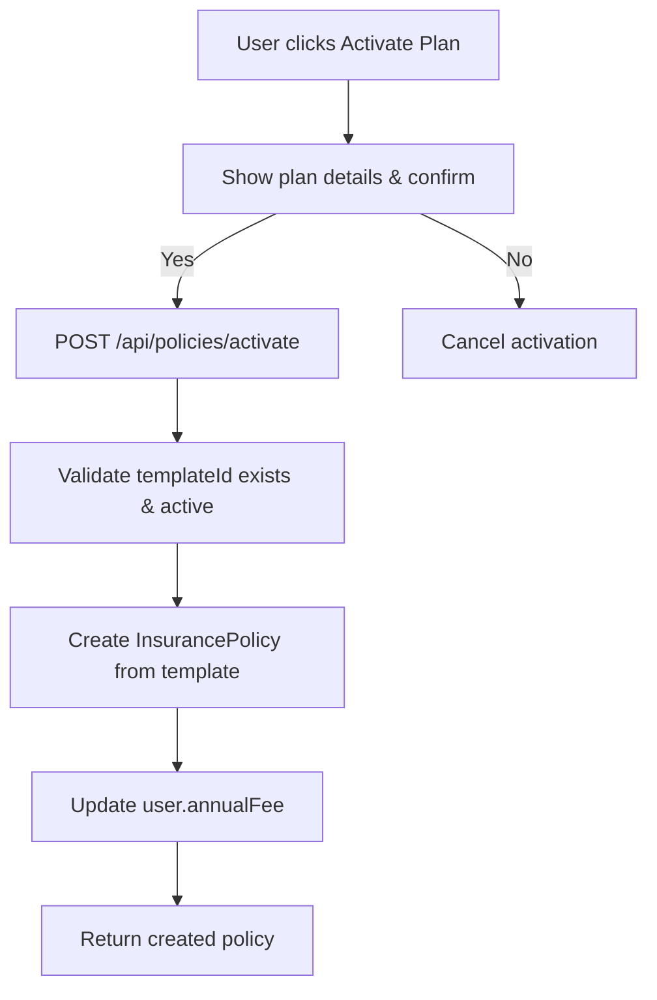
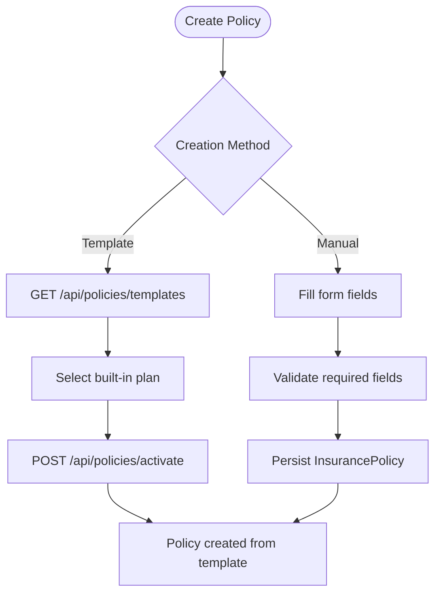
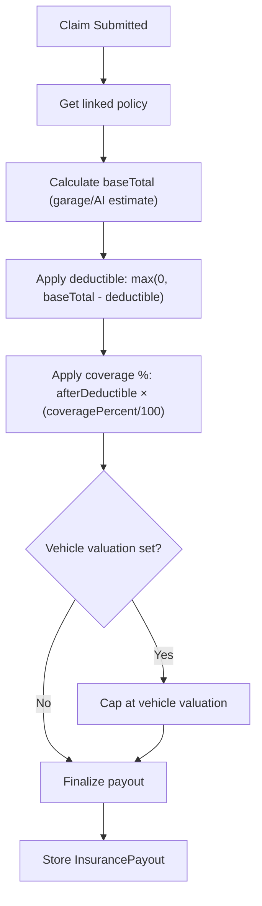
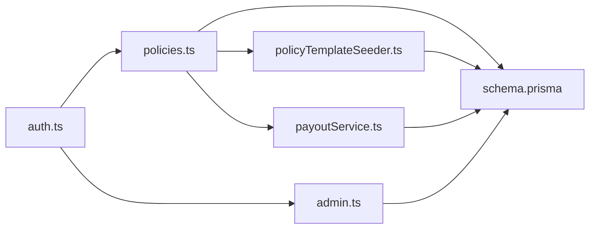
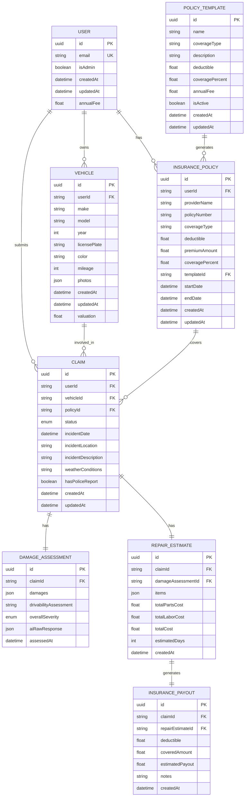

# Policy Management System

<cite>
**Referenced Files in This Document**
- [schema.prisma](file://backend/prisma/schema.prisma)
- [policies.ts](file://backend/src/routes/policies.ts)
- [claims.ts](file://backend/src/routes/claims.ts)
- [damageAnalysisService.ts](file://backend/src/services/damageAnalysisService.ts)
- [repairEstimateService.ts](file://backend/src/services/repairEstimateService.ts)
- [auth.ts](file://backend/src/middleware/auth.ts)
- [index.ts (types)](file://backend/src/types/index.ts)
- [PoliciesPage.tsx](file://frontend/src/pages/PoliciesPage.tsx)
- [api.ts](file://frontend/src/services/api.ts)
- [index.ts (frontend types)](file://frontend/src/types/index.ts)
- [policyTemplateSeeder.ts](file://backend/src/services/policyTemplateSeeder.ts)
- [payoutService.ts](file://backend/src/services/payoutService.ts)
- [admin.ts](file://backend/src/routes/admin.ts)
- [AdminPoliciesPage.tsx](file://frontend/src/pages/admin/AdminPoliciesPage.tsx)
- [index.ts (backend main)](file://backend/src/index.ts)
</cite>

## Update Summary
**Changes Made**
- Added comprehensive policy template system with built-in insurance plans
- Implemented automated policy activation flow for users
- Enhanced policy management endpoints with GET/POST /api/policies/templates and POST /api/policies/activate
- Added coverage percentage calculation engine for payouts
- Integrated policy templates with admin management interface
- Updated payout calculation to use coverage percentages from templates

## Table of Contents
1. [Introduction](#introduction)
2. [Project Structure](#project-structure)
3. [Core Components](#core-components)
4. [Architecture Overview](#architecture-overview)
5. [Detailed Component Analysis](#detailed-component-analysis)
6. [Dependency Analysis](#dependency-analysis)
7. [Performance Considerations](#performance-considerations)
8. [Troubleshooting Guide](#troubleshooting-guide)
9. [Conclusion](#conclusion)
10. [Appendices](#appendices)

## Introduction
This document describes the enhanced policy management system for vehicle insurance within a claim processing application. The system now includes a comprehensive policy template system with built-in insurance plans (Full Comprehensive, Standard Comprehensive, Third Party Plus, Third Party Only), automated policy activation flow, and enhanced policy management capabilities. It covers policy creation through templates, coverage selection, premium calculation, lifecycle states, renewal considerations, validation rules, and integration with claims and payout calculations using coverage percentages.

## Project Structure
The system is organized into backend API routes, services, middleware, Prisma data models, and a React frontend that manages user interactions for policies and claims.

**Diagram sources**
- [PoliciesPage.tsx:1-82](file://frontend/src/pages/PoliciesPage.tsx#L1-L82)
- [AdminPoliciesPage.tsx:1-195](file://frontend/src/pages/admin/AdminPoliciesPage.tsx#L1-L195)
- [api.ts:1-36](file://frontend/src/services/api.ts#L1-L36)
- [policies.ts:1-194](file://backend/src/routes/policies.ts#L1-L194)
- [admin.ts:140-339](file://backend/src/routes/admin.ts#L140-L339)
- [claims.ts:1-450](file://backend/src/routes/claims.ts#L1-L450)
- [policyTemplateSeeder.ts:1-56](file://backend/src/services/policyTemplateSeeder.ts#L1-L56)
- [damageAnalysisService.ts:1-154](file://backend/src/services/damageAnalysisService.ts#L1-L154)
- [repairEstimateService.ts:1-199](file://backend/src/services/repairEstimateService.ts#L1-L199)
- [payoutService.ts:1-67](file://backend/src/services/payoutService.ts#L1-L67)
- [schema.prisma:52-86](file://backend/prisma/schema.prisma#L52-L86)

**Section sources**
- [schema.prisma:10-86](file://backend/prisma/schema.prisma#L10-L86)
- [policies.ts:1-194](file://backend/src/routes/policies.ts#L1-L194)
- [claims.ts:1-450](file://backend/src/routes/claims.ts#L1-L450)
- [PoliciesPage.tsx:1-82](file://frontend/src/pages/PoliciesPage.tsx#L1-L82)
- [api.ts:1-36](file://frontend/src/services/api.ts#L1-L36)

## Core Components
- **Policy Template System**: Built-in insurance plans with predefined coverage levels, deductibles, and annual fees
  - Full Comprehensive: 100% coverage after Rs. 25,000 deductible, Rs. 85,000 annual fee
  - Standard Comprehensive: 80% coverage after Rs. 50,000 deductible, Rs. 55,000 annual fee
  - Third Party Plus: 50% coverage after Rs. 75,000 deductible, Rs. 28,000 annual fee
  - Third Party Only: 30% coverage after Rs. 100,000 deductible, Rs. 15,000 annual fee
- **Automated Policy Activation**: One-click activation of built-in plans with automatic policy creation
- **Enhanced Policy CRUD**: Traditional policy management with template-based creation
- **Coverage Percentage Engine**: Dynamic payout calculation based on plan coverage percentages
- **Claims Integration**: Claims automatically linked to active policies with coverage-aware payout calculation

Key responsibilities:
- Templates: Define standard insurance plans with coverage parameters
- Policies: Store individual policy instances linked to templates or custom configurations
- Payout Calculation: Apply deductibles and coverage percentages to determine claim payouts
- Admin Management: Create, edit, activate/deactivate policy templates

**Section sources**
- [schema.prisma:52-86](file://backend/prisma/schema.prisma#L52-L86)
- [policyTemplateSeeder.ts:5-38](file://backend/src/services/policyTemplateSeeder.ts#L5-L38)
- [policies.ts:12-72](file://backend/src/routes/policies.ts#L12-L72)
- [payoutService.ts:11-66](file://backend/src/services/payoutService.ts#L11-L66)

## Architecture Overview
The enhanced policy management workflow integrates template-based plan activation with automated policy creation and coverage-aware claim processing.

**Diagram sources**
- [policies.ts:12-72](file://backend/src/routes/policies.ts#L12-L72)
- [claims.ts:20-57](file://backend/src/routes/claims.ts#L20-L57)
- [payoutService.ts:11-66](file://backend/src/services/payoutService.ts#L11-L66)
- [policyTemplateSeeder.ts:42-56](file://backend/src/services/policyTemplateSeeder.ts#L42-L56)

## Detailed Component Analysis

### Policy Template System
**Updated** Added comprehensive policy template system with four built-in insurance plans that are automatically seeded on startup.

- **Built-in Plans**: 
  - Full Comprehensive: 100% coverage, Rs. 25,000 deductible, Rs. 85,000 annual fee
  - Standard Comprehensive: 80% coverage, Rs. 50,000 deductible, Rs. 55,000 annual fee  
  - Third Party Plus: 50% coverage, Rs. 75,000 deductible, Rs. 28,000 annual fee
  - Third Party Only: 30% coverage, Rs. 100,000 deductible, Rs. 15,000 annual fee
- **Template Management**: Admins can create, edit, activate/deactivate, and delete policy templates
- **Automatic Seeding**: Default templates are created on server startup using idempotent seeding
- **Coverage Percentages**: Each template defines the percentage of repair costs covered after deductible

**Diagram sources**
- [policyTemplateSeeder.ts:42-56](file://backend/src/services/policyTemplateSeeder.ts#L42-L56)
- [index.ts:67-78](file://backend/src/index.ts#L67-L78)

**Section sources**
- [policyTemplateSeeder.ts:1-56](file://backend/src/services/policyTemplateSeeder.ts#L1-L56)
- [index.ts:67-78](file://backend/src/index.ts#L67-L78)
- [schema.prisma:52-66](file://backend/prisma/schema.prisma#L52-L66)

### Automated Policy Activation Flow
**Updated** Users can now activate built-in insurance plans with a single click, automatically creating policies with appropriate coverage terms.

- **Activation Endpoint**: `POST /api/policies/activate` accepts templateId and creates corresponding policy
- **Automatic Configuration**: Policy fields (coverageType, deductible, premiumAmount, coveragePercent) are populated from template
- **User Fee Synchronization**: User's annualFee field is updated to match activated plan's annualFee
- **One-Year Duration**: Activated policies run for one year from activation date
- **Confirmation Workflow**: Frontend shows plan details before activation confirmation

**Diagram sources**
- [policies.ts:26-72](file://backend/src/routes/policies.ts#L26-L72)
- [PoliciesPage.tsx:25-37](file://frontend/src/pages/PoliciesPage.tsx#L25-L37)

**Section sources**
- [policies.ts:26-72](file://backend/src/routes/policies.ts#L26-L72)
- [PoliciesPage.tsx:25-37](file://frontend/src/pages/PoliciesPage.tsx#L25-L37)

### Enhanced Policy Creation Workflow
**Updated** Policy creation now supports both traditional manual entry and template-based activation.

- **Template-Based Creation**: `POST /api/policies/activate` creates policies from built-in plans
- **Manual Creation**: `POST /api/policies` continues to support custom policy creation
- **Template Selection**: Frontend displays available templates grouped by insurance type
- **Field Mapping**: Template fields map directly to policy fields (coverageType, deductible, premiumAmount, coveragePercent)

**Diagram sources**
- [policies.ts:12-102](file://backend/src/routes/policies.ts#L12-L102)
- [PoliciesPage.tsx:13-21](file://frontend/src/pages/PoliciesPage.tsx#L13-L21)

**Section sources**
- [policies.ts:12-102](file://backend/src/routes/policies.ts#L12-L102)
- [PoliciesPage.tsx:13-21](file://frontend/src/pages/PoliciesPage.tsx#L13-L21)

### Coverage Calculation Engine
**Updated** Enhanced payout calculation now uses coverage percentages from policy templates to determine claim payouts.

- **Coverage Percentage Application**: Payout = max(0, totalCost - deductible) × (coveragePercent / 100)
- **Vehicle Valuation Cap**: Final payout capped at vehicle valuation if set
- **Template Integration**: Coverage percentages come from activated policy templates
- **Dynamic Recalculation**: Payouts recalculated when estimates change or policies are updated

**Diagram sources**
- [payoutService.ts:11-66](file://backend/src/services/payoutService.ts#L11-L66)
- [claims.ts:290-314](file://backend/src/routes/claims.ts#L290-L314)

**Section sources**
- [payoutService.ts:11-66](file://backend/src/services/payoutService.ts#L11-L66)
- [claims.ts:290-314](file://backend/src/routes/claims.ts#L290-L314)

### Risk Assessment Factors and Pricing Algorithms
**Updated** Risk factors now include coverage percentage from policy templates in addition to damage severity and type.

- **Template-Based Pricing**: Annual fees determined by selected policy template
- **Coverage Level Impact**: Higher coverage percentages result in higher premiums
- **Deductible Relationship**: Lower deductibles typically correlate with higher coverage percentages
- **Risk Categories**: Different template categories (Comprehensive vs Third Party) have distinct pricing structures

**Section sources**
- [policyTemplateSeeder.ts:5-38](file://backend/src/services/policyTemplateSeeder.ts#L5-L38)
- [payoutService.ts:28-35](file://backend/src/services/payoutService.ts#L28-L35)

### Policy Status Management
**Updated** Policy status is now managed through template activation and expiration dates rather than explicit status fields.

- **Active Status**: Determined by comparing endDate with current date
- **Template Linking**: Policies maintain reference to source template via templateId
- **Expiration Handling**: Policies past their end date are treated as expired in UI
- **Template Deactivation**: Inactive templates cannot be used for new activations

**Section sources**
- [schema.prisma:68-86](file://backend/prisma/schema.prisma#L68-L86)
- [PoliciesPage.tsx:72-82](file://frontend/src/pages/PoliciesPage.tsx#L72-L82)

### Renewal Processing Automation
**Updated** Renewal workflows now leverage the template system for consistent policy terms.

- **Template-Based Renewals**: New policies created from existing templates ensure consistent terms
- **Annual Fee Updates**: User annualFee automatically synced with activated plan
- **Coverage Continuity**: Renewed policies maintain same coverage percentage as original
- **Admin-Assisted Renewals**: Admins can assign templates to users for standardized renewals

**Section sources**
- [policies.ts:61-65](file://backend/src/routes/policies.ts#L61-L65)
- [admin.ts:222-226](file://backend/src/routes/admin.ts#L222-L226)

### Policy Validation Rules
**Updated** Enhanced validation now includes coverage percentage constraints and template-specific validations.

- **Coverage Percentage Range**: Must be between 1-100% for all policy types
- **Template Validation**: Activated policies must reference active templates
- **Deductible Constraints**: Non-negative values enforced for all policies
- **Annual Fee Validation**: Non-negative values required for premium amounts
- **Template Field Overrides**: Admins can override template values during policy assignment

**Section sources**
- [policies.ts:28-40](file://backend/src/routes/policies.ts#L28-L40)
- [admin.ts:175-181](file://backend/src/routes/admin.ts#L175-L181)

### Examples: Custom Policy Types, Coverage Options, New Pricing Models
**Updated** The template system provides a foundation for extending policy types and pricing models.

- **Custom Templates**: Admins can create new policy templates with unique coverage combinations
- **Tiered Coverage**: Multiple templates per insurance type allow for different coverage tiers
- **Dynamic Pricing**: Templates enable flexible pricing based on coverage levels and risk factors
- **Market Segmentation**: Different templates can target various customer segments with tailored offerings

**Section sources**
- [AdminPoliciesPage.tsx:6-18](file://frontend/src/pages/admin/AdminPoliciesPage.tsx#L6-L18)
- [policyTemplateSeeder.ts:5-38](file://backend/src/services/policyTemplateSeeder.ts#L5-L38)

## Dependency Analysis
**Updated** Enhanced dependencies now include template management and coverage calculation services.

- **Template Dependencies**: Policy creation depends on PolicyTemplate model and seeder service
- **Coverage Dependencies**: Payout calculation depends on policy.coveragePercent field
- **Admin Dependencies**: Template management requires admin authentication and CRUD operations
- **Frontend Dependencies**: Policy pages depend on template APIs and activation endpoints

**Diagram sources**
- [auth.ts:5-22](file://backend/src/middleware/auth.ts#L5-L22)
- [policies.ts:1-194](file://backend/src/routes/policies.ts#L1-L194)
- [admin.ts:140-339](file://backend/src/routes/admin.ts#L140-L339)
- [policyTemplateSeeder.ts:1-56](file://backend/src/services/policyTemplateSeeder.ts#L1-L56)
- [payoutService.ts:1-67](file://backend/src/services/payoutService.ts#L1-L67)
- [schema.prisma:52-86](file://backend/prisma/schema.prisma#L52-L86)

**Section sources**
- [auth.ts:5-22](file://backend/src/middleware/auth.ts#L5-L22)
- [policies.ts:1-194](file://backend/src/routes/policies.ts#L1-L194)
- [admin.ts:140-339](file://backend/src/routes/admin.ts#L140-L339)

## Performance Considerations
**Updated** Performance considerations now include template caching and coverage calculation optimization.

- **Template Caching**: Active templates can be cached to reduce database queries
- **Coverage Calculation Optimization**: Coverage percentage calculations are lightweight but should be batched for multiple claims
- **Template Seeding Efficiency**: Idempotent seeding prevents unnecessary database operations on startup
- **Policy Lookup Optimization**: Include template relationships efficiently to avoid N+1 queries

[No sources needed since this section provides general guidance]

## Troubleshooting Guide
**Updated** Common issues now include template-related problems and coverage calculation errors.

- **Template Not Found**: Ensure template exists and is active before activation
- **Coverage Percentage Errors**: Verify coverage percent is between 1-100%
- **Template Activation Failures**: Check template validity and user permissions
- **Payout Calculation Issues**: Verify policy has valid coveragePercent and deductible values
- **Template Seeding Problems**: Check database connectivity and seed script execution

**Section sources**
- [policies.ts:28-40](file://backend/src/routes/policies.ts#L28-L40)
- [admin.ts:175-181](file://backend/src/routes/admin.ts#L175-L181)
- [payoutService.ts:28-35](file://backend/src/services/payoutService.ts#L28-L35)

## Conclusion
The enhanced policy management system now provides a comprehensive solution for insurance policy administration through template-based plan management, automated activation workflows, and coverage-aware payout calculations. The system supports both traditional policy creation and modern template-based approaches, enabling flexible policy management while maintaining consistency through standardized templates. The integration of coverage percentages allows for nuanced claim processing that reflects actual insurance policy terms.

[No sources needed since this section summarizes without analyzing specific files]

## Appendices

### Enhanced Data Model Overview

**Diagram sources**
- [schema.prisma:10-86](file://backend/prisma/schema.prisma#L10-L86)
- [schema.prisma:99-192](file://backend/prisma/schema.prisma#L99-L192)