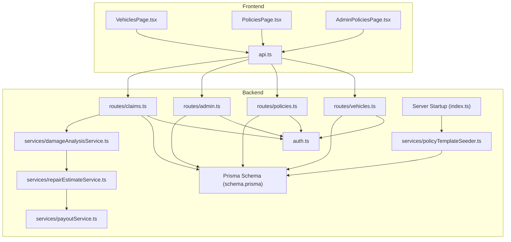
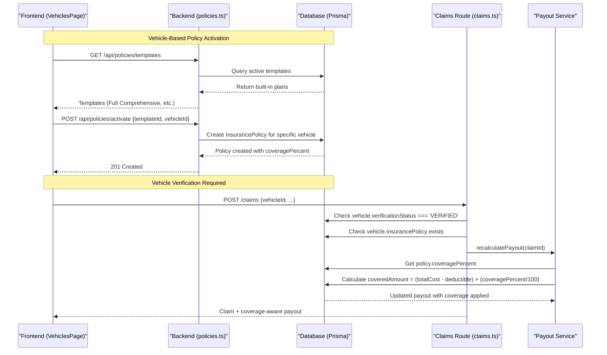
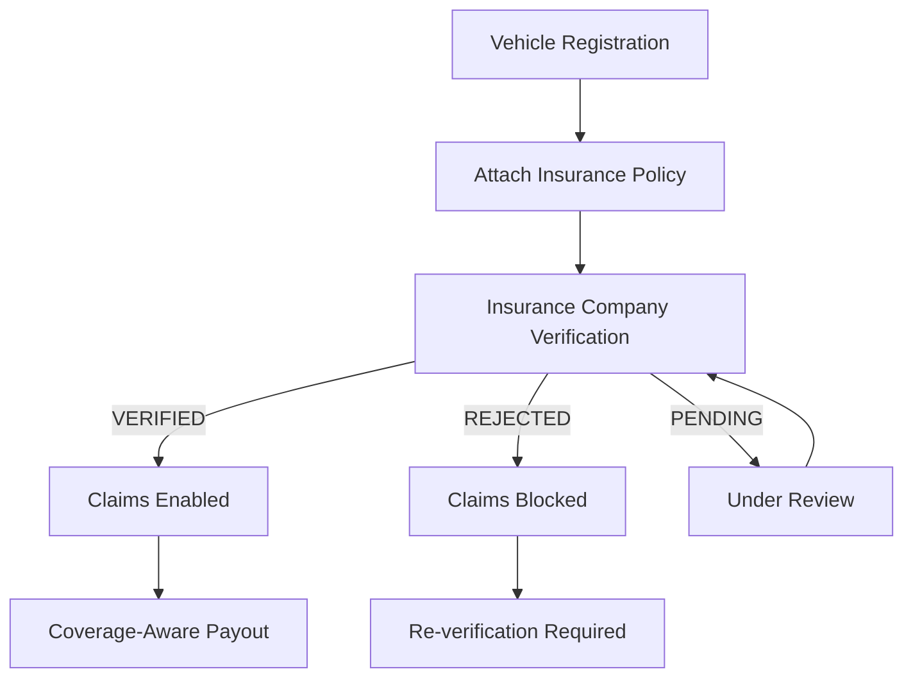
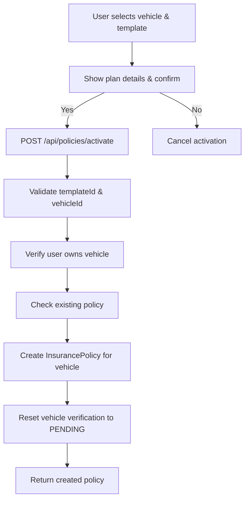
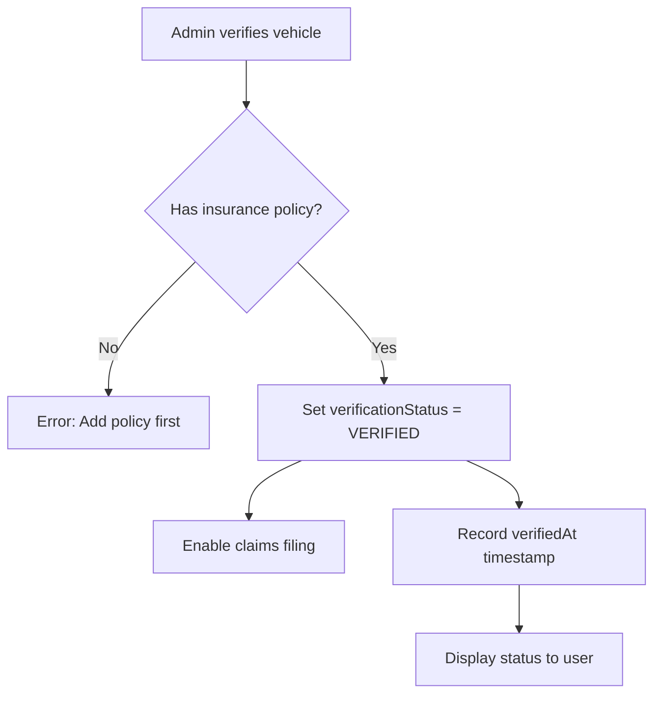
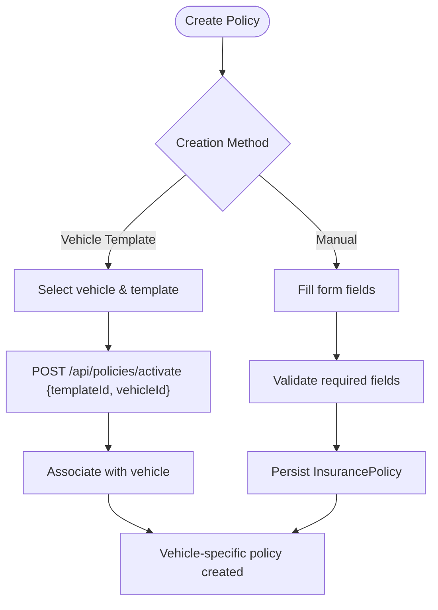
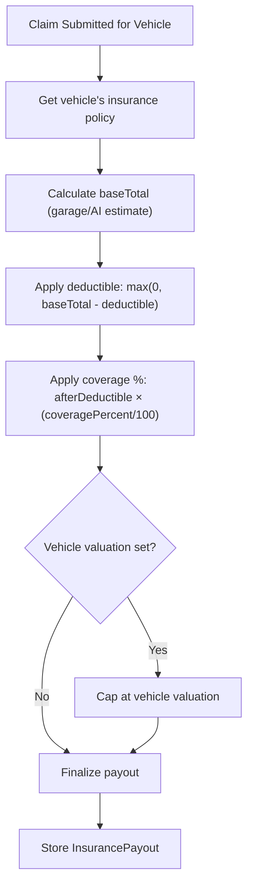
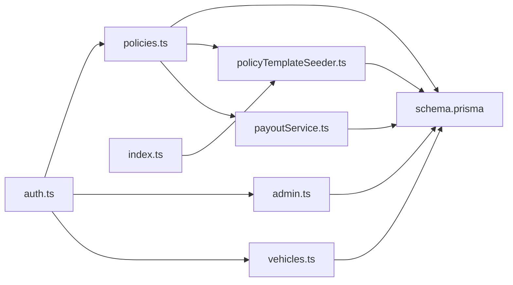

# Policy Management System

<cite>
**Referenced Files in This Document**
- [schema.prisma](file://backend/prisma/schema.prisma)
- [policies.ts](file://backend/src/routes/policies.ts)
- [claims.ts](file://backend/src/routes/claims.ts)
- [admin.ts](file://backend/src/routes/admin.ts)
- [vehicles.ts](file://backend/src/routes/vehicles.ts)
- [damageAnalysisService.ts](file://backend/src/services/damageAnalysisService.ts)
- [repairEstimateService.ts](file://backend/src/services/repairEstimateService.ts)
- [auth.ts](file://backend/src/middleware/auth.ts)
- [index.ts (types)](file://backend/src/types/index.ts)
- [PoliciesPage.tsx](file://frontend/src/pages/PoliciesPage.tsx)
- [VehiclesPage.tsx](file://frontend/src/pages/VehiclesPage.tsx)
- [api.ts](file://frontend/src/services/api.ts)
- [index.ts (frontend types)](file://frontend/src/types/index.ts)
- [policyTemplateSeeder.ts](file://backend/src/services/policyTemplateSeeder.ts)
- [payoutService.ts](file://backend/src/services/payoutService.ts)
- [AdminPoliciesPage.tsx](file://frontend/src/pages/admin/AdminPoliciesPage.tsx)
- [index.ts (backend main)](file://backend/src/index.ts)
</cite>

## Update Summary
**Changes Made**
- **MAJOR ARCHITECTURAL SHIFT**: Transitioned from user-level policies to vehicle-specific policies with mandatory verification status
- **Vehicle Verification System**: Implemented PENDING, VERIFIED, REJECTED status workflow for vehicles and their insurance policies
- **Enhanced Policy Activation**: Updated activation endpoint to require both templateId and vehicleId parameters
- **Claim Filing Restrictions**: Claims can only be filed for verified vehicles with active insurance policies
- **Policy Deletion Impact**: Deleting a policy automatically resets vehicle verification status to PENDING
- **Admin Vehicle Management**: Enhanced admin panel for vehicle verification and policy assignment
- **Frontend Updates**: Updated UI to display vehicle verification status and policy management per vehicle

## Table of Contents
1. [Introduction](#introduction)
2. [Project Structure](#project-structure)
3. [Core Components](#core-components)
4. [Architecture Overview](#architecture-overview)
5. [Detailed Component Analysis](#detailed-component-analysis)
6. [Dependency Analysis](#dependency-analysis)
7. [Performance Considerations](#performance-considerations)
8. [Troubleshooting Guide](#troubleshooting-guide)
9. [Conclusion](#conclusion)
10. [Appendices](#appendices)

## Introduction
This document describes the enhanced policy management system for vehicle insurance within a claim processing application. The system has undergone a major architectural shift from user-level policies to vehicle-specific policies, where each vehicle must have its own insurance policy with verification status (PENDING, VERIFIED, REJECTED) before claims can be filed. The system includes comprehensive policy template management, automated policy activation flows, vehicle verification workflows, and enhanced policy management capabilities. It covers vehicle-based policy creation through templates, coverage selection, premium calculation, lifecycle states, renewal considerations, validation rules, and integration with claims and payout calculations using coverage percentages.

## Project Structure
The system is organized into backend API routes, services, middleware, Prisma data models, and a React frontend that manages user interactions for vehicles, policies, and claims with vehicle-specific verification workflows.



**Diagram sources**
- [VehiclesPage.tsx:1-521](file://frontend/src/pages/VehiclesPage.tsx#L1-L521)
- [PoliciesPage.tsx:1-196](file://frontend/src/pages/PoliciesPage.tsx#L1-L196)
- [AdminPoliciesPage.tsx:1-195](file://frontend/src/pages/admin/AdminPoliciesPage.tsx#L1-L195)
- [api.ts:1-36](file://frontend/src/services/api.ts#L1-L36)
- [vehicles.ts:35-110](file://backend/src/routes/vehicles.ts#L35-L110)
- [policies.ts:1-214](file://backend/src/routes/policies.ts#L1-L214)
- [admin.ts:186-385](file://backend/src/routes/admin.ts#L186-L385)
- [claims.ts:1-551](file://backend/src/routes/claims.ts#L1-L551)
- [policyTemplateSeeder.ts:1-56](file://backend/src/services/policyTemplateSeeder.ts#L1-L56)
- [damageAnalysisService.ts:1-154](file://backend/src/services/damageAnalysisService.ts#L1-L154)
- [repairEstimateService.ts:1-199](file://backend/src/services/repairEstimateService.ts#L1-L199)
- [payoutService.ts:1-67](file://backend/src/services/payoutService.ts#L1-L67)
- [schema.prisma:32-100](file://backend/prisma/schema.prisma#L32-L100)
- [index.ts:67-78](file://backend/src/index.ts#L67-L78)

**Section sources**
- [schema.prisma:32-100](file://backend/prisma/schema.prisma#L32-L100)
- [vehicles.ts:35-110](file://backend/src/routes/vehicles.ts#L35-L110)
- [policies.ts:1-214](file://backend/src/routes/policies.ts#L1-L214)
- [claims.ts:1-551](file://backend/src/routes/claims.ts#L1-L551)
- [VehiclesPage.tsx:1-521](file://frontend/src/pages/VehiclesPage.tsx#L1-L521)
- [PoliciesPage.tsx:1-196](file://frontend/src/pages/PoliciesPage.tsx#L1-L196)
- [api.ts:1-36](file://frontend/src/services/api.ts#L1-L36)

## Core Components
- **Vehicle-Specific Policy System**: Each vehicle maintains its own insurance policy with unique verification status (PENDING, VERIFIED, REJECTED)
- **Vehicle Verification Workflow**: Insurance company verifies vehicles and their policies before claims can be filed
- **Policy Template System**: Built-in insurance plans with predefined coverage levels, deductibles, and annual fees
  - Full Comprehensive: 100% coverage after Rs. 25,000 deductible, Rs. 85,000 annual fee
  - Standard Comprehensive: 80% coverage after Rs. 50,000 deductible, Rs. 55,000 annual fee
  - Third Party Plus: 50% coverage after Rs. 75,000 deductible, Rs. 28,000 annual fee
  - Third Party Only: 30% coverage after Rs. 100,000 deductible, Rs. 15,000 annual fee
- **Automated Policy Activation**: One-click activation of built-in plans for specific vehicles with automatic policy creation
- **Enhanced Policy CRUD**: Traditional policy management with template-based creation and vehicle association
- **Coverage Percentage Engine**: Dynamic payout calculation based on plan coverage percentages
- **Claims Integration**: Claims automatically linked to verified vehicle policies with coverage-aware payout calculation
- **Automatic Template Seeding**: Built-in templates are created automatically during server startup

Key responsibilities:
- Vehicles: Store vehicle information with verification status and associated insurance policy
- Templates: Define standard insurance plans with coverage parameters
- Policies: Store individual vehicle-specific policy instances linked to templates or custom configurations
- Payout Calculation: Apply deductibles and coverage percentages to determine claim payouts
- Admin Management: Verify/reject vehicles and manage vehicle-specific policies
- Server Initialization: Ensure built-in templates exist in every environment

**Section sources**
- [schema.prisma:32-100](file://backend/prisma/schema.prisma#L32-L100)
- [policyTemplateSeeder.ts:5-38](file://backend/src/services/policyTemplateSeeder.ts#L5-L38)
- [policies.ts:26-82](file://backend/src/routes/policies.ts#L26-L82)
- [payoutService.ts:11-66](file://backend/src/services/payoutService.ts#L11-L66)

## Architecture Overview
The enhanced policy management workflow integrates vehicle-specific policy activation with mandatory verification workflows and automated policy creation for claims processing.



**Diagram sources**
- [policies.ts:26-82](file://backend/src/routes/policies.ts#L26-L82)
- [claims.ts:38-89](file://backend/src/routes/claims.ts#L38-L89)
- [payoutService.ts:11-66](file://backend/src/services/payoutService.ts#L11-L66)
- [policyTemplateSeeder.ts:42-56](file://backend/src/services/policyTemplateSeeder.ts#L42-L56)

## Detailed Component Analysis

### Vehicle-Specific Policy Architecture
**Updated** Major architectural shift from user-level policies to vehicle-specific policies with mandatory verification status.

- **One Policy Per Vehicle**: Each vehicle has exactly one insurance policy with unique ID and vehicleId relationship
- **Verification Status System**: Vehicles maintain PENDING, VERIFIED, or REJECTED status for insurance verification
- **Claim Access Control**: Claims can only be filed for vehicles with VERIFIED status and active insurance policies
- **Policy Deletion Impact**: Deleting a vehicle's policy automatically resets verification status to PENDING
- **Admin Verification Workflow**: Insurance company verifies vehicles and their policies before claims unlock



**Diagram sources**
- [schema.prisma:32-61](file://backend/prisma/schema.prisma#L32-L61)
- [policies.ts:26-82](file://backend/src/routes/policies.ts#L26-L82)
- [claims.ts:38-89](file://backend/src/routes/claims.ts#L38-L89)
- [admin.ts:186-225](file://backend/src/routes/admin.ts#L186-L225)

**Section sources**
- [schema.prisma:32-61](file://backend/prisma/schema.prisma#L32-L61)
- [policies.ts:26-82](file://backend/src/routes/policies.ts#L26-L82)
- [claims.ts:38-89](file://backend/src/routes/claims.ts#L38-L89)
- [admin.ts:186-225](file://backend/src/routes/admin.ts#L186-L225)

### Enhanced Policy Activation Flow
**Updated** Policy activation now requires both templateId and vehicleId parameters, creating vehicle-specific policies.

- **Vehicle-Specific Activation**: `POST /api/policies/activate` accepts templateId and vehicleId to create policies for specific vehicles
- **Vehicle Ownership Validation**: Ensures the requesting user owns the specified vehicle
- **Existing Policy Check**: Prevents multiple policies per vehicle with appropriate error handling
- **Automatic Configuration**: Policy fields (coverageType, deductible, premiumAmount, coveragePercent) are populated from template
- **One-Year Duration**: Activated policies run for one year from activation date
- **Verification Reset**: New policies reset vehicle verification status to PENDING for re-verification



**Diagram sources**
- [policies.ts:26-82](file://backend/src/routes/policies.ts#L26-L82)
- [PoliciesPage.tsx:29-42](file://frontend/src/pages/PoliciesPage.tsx#L29-L42)

**Section sources**
- [policies.ts:26-82](file://backend/src/routes/policies.ts#L26-L82)
- [PoliciesPage.tsx:29-42](file://frontend/src/pages/PoliciesPage.tsx#L29-L42)

### Vehicle Verification Management
**Updated** Comprehensive vehicle verification system with admin controls and status tracking.

- **Verification States**: PENDING (initial), VERIFIED (claims enabled), REJECTED (claims blocked)
- **Admin Verification Endpoint**: `PATCH /api/admin/vehicles/:id/verify` allows insurance company to verify/reject vehicles
- **Policy Requirement**: VERIFIED status requires an attached insurance policy
- **Status Reset**: Policy changes automatically reset verification to PENDING for re-review
- **User Feedback**: Frontend displays verification status with explanatory messages and notes



**Diagram sources**
- [admin.ts:186-225](file://backend/src/routes/admin.ts#L186-L225)
- [VehiclesPage.tsx:126-144](file://frontend/src/pages/VehiclesPage.tsx#L126-L144)

**Section sources**
- [admin.ts:186-225](file://backend/src/routes/admin.ts#L186-L225)
- [VehiclesPage.tsx:126-144](file://frontend/src/pages/VehiclesPage.tsx#L126-L144)

### Enhanced Policy Creation Workflow
**Updated** Policy creation now supports both traditional manual entry and vehicle-specific template activation.

- **Vehicle-Specific Template Activation**: `POST /api/policies/activate` creates policies for specific vehicles using built-in plans
- **Manual Creation**: `POST /api/policies` continues to support custom policy creation (legacy)
- **Vehicle Association**: All new policies are linked to specific vehicles via vehicleId field
- **Template Selection**: Frontend displays available templates grouped by insurance type for vehicle selection
- **Field Mapping**: Template fields map directly to policy fields (coverageType, deductible, premiumAmount, coveragePercent)



**Diagram sources**
- [policies.ts:26-112](file://backend/src/routes/policies.ts#L26-L112)
- [PoliciesPage.tsx:29-42](file://frontend/src/pages/PoliciesPage.tsx#L29-L42)

**Section sources**
- [policies.ts:26-112](file://backend/src/routes/policies.ts#L26-L112)
- [PoliciesPage.tsx:29-42](file://frontend/src/pages/PoliciesPage.tsx#L29-L42)

### Coverage Calculation Engine
**Updated** Enhanced payout calculation uses coverage percentages from vehicle-specific policy templates to determine claim payouts.

- **Coverage Percentage Application**: Payout = max(0, totalCost - deductible) × (coveragePercent / 100)
- **Vehicle Valuation Cap**: Final payout capped at vehicle valuation if set
- **Template Integration**: Coverage percentages come from activated vehicle-specific policy templates
- **Dynamic Recalculation**: Payouts recalculated when estimates change or vehicle policies are updated
- **Policy Changes Impact**: Modifying vehicle policies triggers recalculation of all related claims



**Diagram sources**
- [payoutService.ts:11-66](file://backend/src/services/payoutService.ts#L11-L66)
- [claims.ts:391-415](file://backend/src/routes/claims.ts#L391-L415)

**Section sources**
- [payoutService.ts:11-66](file://backend/src/services/payoutService.ts#L11-L66)
- [claims.ts:391-415](file://backend/src/routes/claims.ts#L391-L415)

### Risk Assessment Factors and Pricing Algorithms
**Updated** Risk factors now include vehicle-specific coverage percentage from policy templates in addition to damage severity and type.

- **Vehicle-Specific Pricing**: Annual fees determined by selected policy template for each vehicle
- **Coverage Level Impact**: Higher coverage percentages result in higher premiums per vehicle
- **Deductible Relationship**: Lower deductibles typically correlate with higher coverage percentages
- **Risk Categories**: Different template categories (Comprehensive vs Third Party) have distinct pricing structures
- **Vehicle Valuation**: Vehicle value affects maximum payout caps and risk assessment

**Section sources**
- [policyTemplateSeeder.ts:5-38](file://backend/src/services/policyTemplateSeeder.ts#L5-L38)
- [payoutService.ts:28-35](file://backend/src/services/payoutService.ts#L28-L35)

### Policy Status Management
**Updated** Policy status is now managed through vehicle verification status and expiration dates rather than explicit status fields.

- **Vehicle Verification Status**: PENDING, VERIFIED, or REJECTED determines claim eligibility
- **Template Linking**: Policies maintain reference to source template via templateId
- **Expiration Handling**: Policies past their end date are treated as expired in UI
- **Template Deactivation**: Inactive templates cannot be used for new activations
- **Policy Deletion Impact**: Deleting policies resets vehicle verification to PENDING

**Section sources**
- [schema.prisma:32-61](file://backend/prisma/schema.prisma#L32-L61)
- [schema.prisma:79-100](file://backend/prisma/schema.prisma#L79-L100)
- [policies.ts:183-211](file://backend/src/routes/policies.ts#L183-L211)

### Renewal Processing Automation
**Updated** Renewal workflows now leverage the vehicle-specific template system for consistent policy terms.

- **Vehicle-Specific Renewals**: New policies created from existing templates ensure consistent terms per vehicle
- **Annual Fee Updates**: Vehicle policies maintain separate annual fees based on selected plan
- **Coverage Continuity**: Renewed vehicle policies maintain same coverage percentage as original
- **Admin-Assisted Renewals**: Admins can assign templates to vehicles for standardized renewals
- **Verification Reset**: Policy renewals trigger vehicle re-verification process

**Section sources**
- [policies.ts:60-74](file://backend/src/routes/policies.ts#L60-L74)
- [admin.ts:227-330](file://backend/src/routes/admin.ts#L227-L330)

### Policy Validation Rules
**Updated** Enhanced validation now includes vehicle-specific constraints and coverage percentage validations.

- **Vehicle Ownership Validation**: Users can only activate policies for their own vehicles
- **Coverage Percentage Range**: Must be between 1-100% for all vehicle policies
- **Template Validation**: Activated policies must reference active templates
- **Deductible Constraints**: Non-negative values enforced for all vehicle policies
- **Annual Fee Validation**: Non-negative values required for premium amounts
- **Single Policy Constraint**: Each vehicle can have only one active policy at a time

**Section sources**
- [policies.ts:28-54](file://backend/src/routes/policies.ts#L28-L54)
- [admin.ts:267-286](file://backend/src/routes/admin.ts#L267-L286)

### Examples: Custom Policy Types, Coverage Options, New Pricing Models
**Updated** The vehicle-specific template system provides a foundation for extending policy types and pricing models per vehicle.

- **Vehicle-Specific Templates**: Admins can create new policy templates with unique coverage combinations for different vehicle types
- **Tiered Coverage**: Multiple templates per insurance type allow for different coverage tiers across vehicle fleets
- **Dynamic Pricing**: Templates enable flexible pricing based on vehicle type, coverage levels, and risk factors
- **Market Segmentation**: Different templates can target various customer segments with tailored vehicle offerings

**Section sources**
- [AdminPoliciesPage.tsx:6-18](file://frontend/src/pages/admin/AdminPoliciesPage.tsx#L6-L18)
- [policyTemplateSeeder.ts:5-38](file://backend/src/services/policyTemplateSeeder.ts#L5-L38)

## Dependency Analysis
**Updated** Enhanced dependencies now include vehicle-specific policy management and verification services.

- **Vehicle Dependencies**: Policy creation depends on Vehicle model and verification status
- **Template Dependencies**: Policy creation depends on PolicyTemplate model and seeder service
- **Coverage Dependencies**: Payout calculation depends on vehicle.policy.coveragePercent field
- **Admin Dependencies**: Vehicle verification requires admin authentication and CRUD operations
- **Frontend Dependencies**: Vehicle and policy pages depend on verification APIs and activation endpoints
- **Startup Dependencies**: Server initialization depends on template seeding service



**Diagram sources**
- [auth.ts:5-22](file://backend/src/middleware/auth.ts#L5-L22)
- [policies.ts:1-214](file://backend/src/routes/policies.ts#L1-L214)
- [admin.ts:186-385](file://backend/src/routes/admin.ts#L186-L385)
- [vehicles.ts:35-110](file://backend/src/routes/vehicles.ts#L35-L110)
- [policyTemplateSeeder.ts:1-56](file://backend/src/services/policyTemplateSeeder.ts#L1-L56)
- [payoutService.ts:1-67](file://backend/src/services/payoutService.ts#L1-L67)
- [schema.prisma:32-100](file://backend/prisma/schema.prisma#L32-L100)
- [index.ts:67-78](file://backend/src/index.ts#L67-L78)

**Section sources**
- [auth.ts:5-22](file://backend/src/middleware/auth.ts#L5-L22)
- [policies.ts:1-214](file://backend/src/routes/policies.ts#L1-L214)
- [admin.ts:186-385](file://backend/src/routes/admin.ts#L186-L385)
- [vehicles.ts:35-110](file://backend/src/routes/vehicles.ts#L35-L110)

## Performance Considerations
**Updated** Performance considerations now include vehicle-specific policy caching and verification status optimization.

- **Vehicle Policy Caching**: Vehicle-specific policies can be cached along with verification status to reduce database queries
- **Coverage Calculation Optimization**: Coverage percentage calculations are lightweight but should be batched for multiple vehicle claims
- **Template Seeding Efficiency**: Idempotent seeding prevents unnecessary database operations on startup
- **Vehicle Lookup Optimization**: Include vehicle relationships efficiently to avoid N+1 queries
- **Verification Status Caching**: Vehicle verification status can be cached to reduce repeated status checks
- **Startup Performance**: Template seeding runs asynchronously and doesn't block server startup

## Troubleshooting Guide
**Updated** Common issues now include vehicle-specific problems and verification workflow errors.

- **Vehicle Not Found**: Ensure vehicle exists and belongs to the requesting user before policy activation
- **Policy Already Exists**: Each vehicle can have only one policy; delete existing policy before activating new one
- **Vehicle Not Verified**: Claims require vehicle verification status to be VERIFIED
- **Missing Insurance Policy**: VERIFIED vehicles must have an attached insurance policy
- **Coverage Percentage Errors**: Verify coverage percent is between 1-100% for vehicle policies
- **Template Activation Failures**: Check template validity and vehicle ownership permissions
- **Payout Calculation Issues**: Verify vehicle policy has valid coveragePercent and deductible values
- **Template Seeding Problems**: Check database connectivity and seed script execution
- **Startup Issues**: Template seeding failures don't block server startup due to error handling

**Section sources**
- [policies.ts:28-54](file://backend/src/routes/policies.ts#L28-L54)
- [claims.ts:49-68](file://backend/src/routes/claims.ts#L49-L68)
- [admin.ts:195-206](file://backend/src/routes/admin.ts#L195-L206)
- [payoutService.ts:28-35](file://backend/src/services/payoutService.ts#L28-L35)
- [index.ts:70-74](file://backend/src/index.ts#L70-L74)

## Conclusion
The enhanced policy management system now provides a comprehensive solution for vehicle-specific insurance policy administration through template-based plan management, mandatory verification workflows, and coverage-aware payout calculations. The major architectural shift from user-level to vehicle-specific policies ensures proper insurance coverage tracking per vehicle while maintaining the flexibility of template-based plan activation. The vehicle verification system provides robust control over claim filing capabilities, ensuring that only properly verified vehicles with active insurance policies can submit claims. The integration of coverage percentages allows for nuanced claim processing that reflects actual insurance policy terms while maintaining consistency through standardized templates. The automatic template seeding system ensures that built-in insurance plans are always available across all environments, providing a seamless user experience from deployment to production.

## Appendices

### Enhanced Data Model Overview
```mermaid
erDiagram
USER {
uuid id PK
string email UK
boolean isAdmin
datetime createdAt
datetime updatedAt
float annualFee
}
VEHICLE {
uuid id PK
string userId FK
string make
string model
int year
string licensePlate
string color
int mileage
json photos
datetime createdAt
datetime updatedAt
float valuation
enum verificationStatus
datetime verifiedAt
string verificationNotes
}
POLICY_TEMPLATE {
uuid id PK
string name
string coverageType
string description
float deductible
float coveragePercent
float annualFee
boolean isActive
datetime createdAt
datetime updatedAt
}
INSURANCE_POLICY {
uuid id PK
string userId FK
string providerName
string policyNumber
string coverageType
float deductible
float premiumAmount
float coveragePercent
string templateId FK
string vehicleId FK UK
datetime startDate
datetime endDate
datetime createdAt
datetime updatedAt
}
CLAIM {
uuid id PK
string userId FK
string vehicleId FK
string policyId FK
enum status
datetime incidentDate
string incidentLocation
string incidentDescription
string weatherConditions
boolean hasPoliceReport
datetime createdAt
datetime updatedAt
}
DAMAGE_ASSESSMENT {
uuid id PK
string claimId FK
json damages
string drivabilityAssessment
enum overallSeverity
json aiRawResponse
datetime assessedAt
}
REPAIR_ESTIMATE {
uuid id PK
string claimId FK
string damageAssessmentId FK
json items
float totalPartsCost
float totalLaborCost
float totalCost
int estimatedDays
datetime createdAt
}
INSURANCE_PAYOUT {
uuid id PK
string claimId FK
string repairEstimateId FK
float deductible
float coveredAmount
float estimatedPayout
string notes
datetime createdAt
}
USER ||--o{ VEHICLE : owns
USER ||--o{ INSURANCE_POLICY : has
USER ||--o{ CLAIM : submits
VEHICLE ||--o{ CLAIM : involved_in
VEHICLE ||--|| INSURANCE_POLICY : has_one
POLICY_TEMPLATE ||--o{ INSURANCE_POLICY : generates
INSURANCE_POLICY ||--o{ CLAIM : covers
CLAIM ||--|| DAMAGE_ASSESSMENT : has
CLAIM ||--|| REPAIR_ESTIMATE : has
REPAIR_ESTIMATE ||--|| INSURANCE_PAYOUT : generates
```

**Diagram sources**
- [schema.prisma:10-100](file://backend/prisma/schema.prisma#L10-L100)
- [schema.prisma:113-209](file://backend/prisma/schema.prisma#L113-L209)