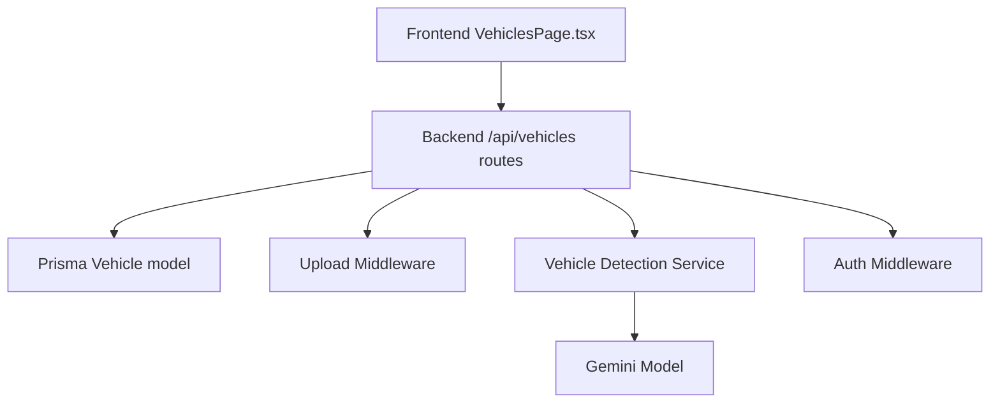
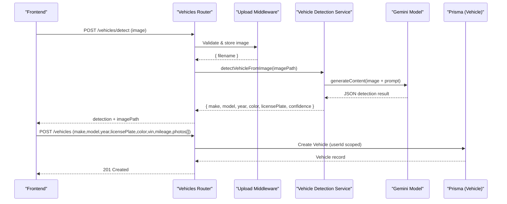
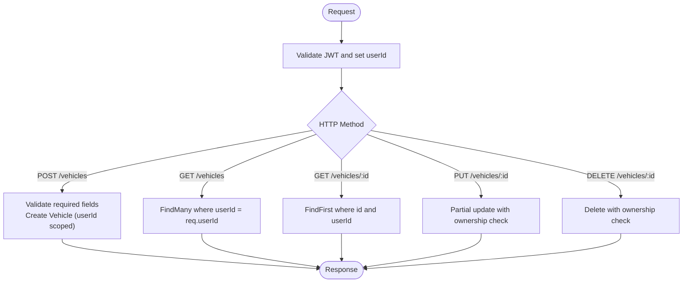
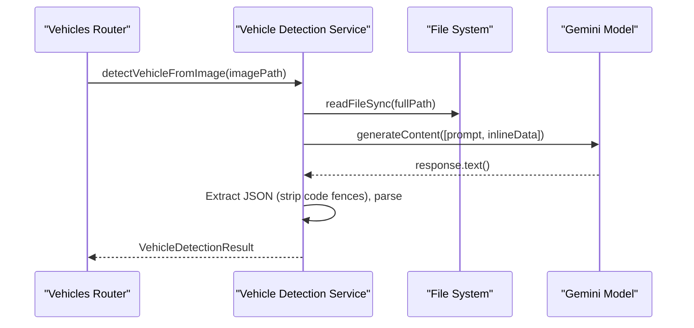
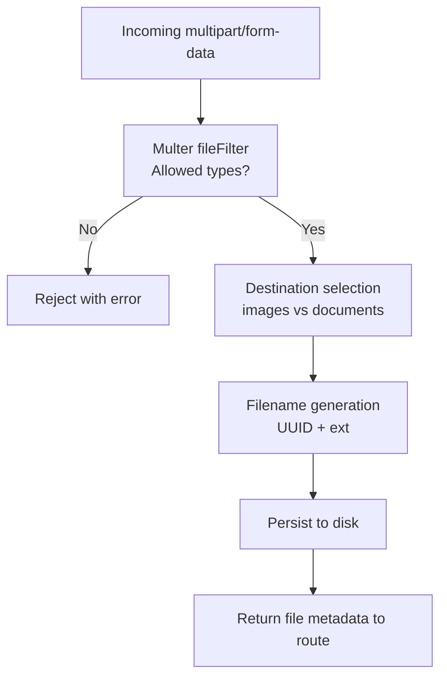
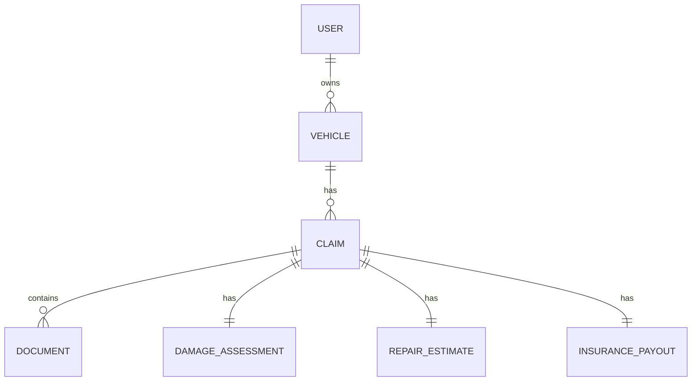
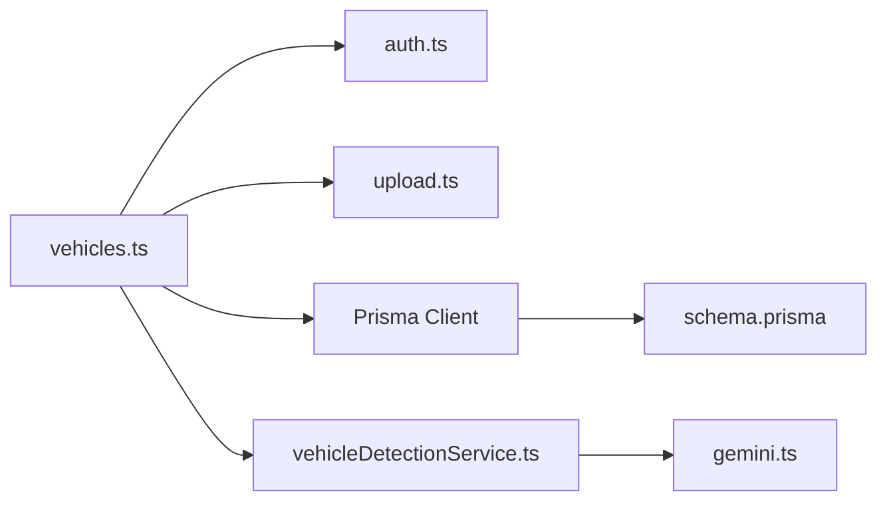

# Vehicle Management Logic

<cite>
**Referenced Files in This Document**
- [schema.prisma](file://backend/prisma/schema.prisma)
- [vehicles.ts](file://backend/src/routes/vehicles.ts)
- [vehicleDetectionService.ts](file://backend/src/services/vehicleDetectionService.ts)
- [upload.ts](file://backend/src/middleware/upload.ts)
- [gemini.ts](file://backend/src/utils/gemini.ts)
- [auth.ts](file://backend/src/middleware/auth.ts)
- [index.ts (types)](file://backend/src/types/index.ts)
- [VehiclesPage.tsx](file://frontend/src/pages/VehiclesPage.tsx)
- [index.ts (frontend types)](file://frontend/src/types/index.ts)
</cite>

## Table of Contents
1. Introduction
2. Project Structure
3. Core Components
4. Architecture Overview
5. Detailed Component Analysis
6. Dependency Analysis
7. Performance Considerations
8. Troubleshooting Guide
9. Conclusion
10. Appendices

## Introduction
This document explains the vehicle management business logic for registration, validation, and lifecycle management. It covers:
- Vehicle registration flow with required fields and ownership scoping
- AI-powered vehicle detection from images (make/model/year/color/license plate)
- Photo upload and processing pipeline (validation, storage organization)
- Vehicle history tracking via claims and related records
- Validation rules for data integrity and compliance considerations
- Guidance to extend attributes, add validations, and integrate external vehicle databases

## Project Structure
The vehicle feature spans backend routes, services, middleware, Prisma schema, and frontend pages. The key pieces are:
- Backend API routes for vehicle CRUD and AI detection
- AI service for image-based vehicle identification
- File upload middleware for secure storage
- Prisma models defining vehicles, claims, documents, and relationships
- Frontend pages for listing, adding, and viewing vehicles, including AI-assisted auto-fill

**Diagram sources**
- [vehicles.ts:1-169](file://backend/src/routes/vehicles.ts#L1-L169)
- [vehicleDetectionService.ts:1-96](file://backend/src/services/vehicleDetectionService.ts#L1-L96)
- [upload.ts:1-54](file://backend/src/middleware/upload.ts#L1-L54)
- [gemini.ts:1-12](file://backend/src/utils/gemini.ts#L1-L12)
- [auth.ts:1-23](file://backend/src/middleware/auth.ts#L1-L23)
- [schema.prisma:27-43](file://backend/prisma/schema.prisma#L27-L43)
- [VehiclesPage.tsx:1-369](file://frontend/src/pages/VehiclesPage.tsx#L1-L369)

**Section sources**
- [vehicles.ts:1-169](file://backend/src/routes/vehicles.ts#L1-L169)
- [schema.prisma:27-43](file://backend/prisma/schema.prisma#L27-L43)
- [VehiclesPage.tsx:1-369](file://frontend/src/pages/VehiclesPage.tsx#L1-L369)

## Core Components
- Vehicle Registration API: Creates a vehicle record scoped to the authenticated user; requires make, model, year, licensePlate, color; optional VIN and mileage; stores photos as JSON array.
- AI Vehicle Detection: Accepts an uploaded image, calls Gemini to extract make, model, year, color, license plate, confidence, and additional info; returns results to prefill the form.
- Upload Pipeline: Validates file type and size, organizes files under uploads/images or uploads/documents using UUID filenames.
- Data Model: Vehicle entity linked to User and Claim entities; supports photo metadata and timestamps.
- Ownership and Access Control: All vehicle endpoints require authentication; queries filter by userId to ensure ownership isolation.

**Section sources**
- [vehicles.ts:34-63](file://backend/src/routes/vehicles.ts#L34-L63)
- [vehicleDetectionService.ts:46-95](file://backend/src/services/vehicleDetectionService.ts#L46-L95)
- [upload.ts:17-47](file://backend/src/middleware/upload.ts#L17-L47)
- [schema.prisma:27-43](file://backend/prisma/schema.prisma#L27-L43)
- [auth.ts:5-22](file://backend/src/middleware/auth.ts#L5-L22)

## Architecture Overview
End-to-end flows for vehicle management:

**Diagram sources**
- [vehicles.ts:15-63](file://backend/src/routes/vehicles.ts#L15-L63)
- [vehicleDetectionService.ts:46-95](file://backend/src/services/vehicleDetectionService.ts#L46-L95)
- [upload.ts:17-47](file://backend/src/middleware/upload.ts#L17-L47)
- [gemini.ts:6-8](file://backend/src/utils/gemini.ts#L6-L8)
- [schema.prisma:27-43](file://backend/prisma/schema.prisma#L27-L43)

## Detailed Component Analysis

### Vehicle Registration and Lifecycle
- Creation: Requires make, model, year, licensePlate, color; optional vin and mileage; photos stored as JSON string.
- Retrieval: Lists vehicles for the authenticated user with claim counts; fetches single vehicle with related claims.
- Update: Partial updates supported; ensures ownership by matching userId.
- Deletion: Deletes vehicle if owned by the requester.

Ownership and access control are enforced at the route level by filtering on userId from the JWT-decoded request.

**Diagram sources**
- [vehicles.ts:34-166](file://backend/src/routes/vehicles.ts#L34-L166)
- [auth.ts:5-22](file://backend/src/middleware/auth.ts#L5-L22)

**Section sources**
- [vehicles.ts:34-166](file://backend/src/routes/vehicles.ts#L34-L166)
- [schema.prisma:27-43](file://backend/prisma/schema.prisma#L27-L43)
- [auth.ts:5-22](file://backend/src/middleware/auth.ts#L5-L22)

### AI Vehicle Detection Service
- Input: Uploaded image path.
- Processing: Reads file, determines MIME type, sends image with a structured prompt to Gemini.
- Output: Parsed JSON containing make, model, year, color, licensePlate, confidence, and optional additionalInfo. On parse failure, returns safe defaults with LOW confidence.

**Diagram sources**
- [vehicleDetectionService.ts:46-95](file://backend/src/services/vehicleDetectionService.ts#L46-L95)
- [gemini.ts:6-8](file://backend/src/utils/gemini.ts#L6-L8)

**Section sources**
- [vehicleDetectionService.ts:1-96](file://backend/src/services/vehicleDetectionService.ts#L1-L96)
- [gemini.ts:1-12](file://backend/src/utils/gemini.ts#L1-L12)

### Photo Upload and Processing Pipeline
- Allowed types: JPEG, PNG, WebP; max 10MB.
- Storage: Organized into uploads/images or uploads/documents based on field name; filenames use UUIDs to avoid collisions.
- Usage: Vehicle detection endpoint uses this middleware to accept and store images before analysis.

**Diagram sources**
- [upload.ts:17-47](file://backend/src/middleware/upload.ts#L17-L47)

**Section sources**
- [upload.ts:1-54](file://backend/src/middleware/upload.ts#L1-L54)
- [vehicles.ts:15-32](file://backend/src/routes/vehicles.ts#L15-L32)

### Vehicle History Tracking
- Claims association: Each claim links to a vehicle; retrieving a vehicle includes its claims list.
- Documents: Documents can be attached to claims and verified; while not directly tied to vehicles, they support vehicle-related evidence in claims.
- Timestamps: Vehicle and related entities track creation/update times for auditability.

**Diagram sources**
- [schema.prisma:27-43](file://backend/prisma/schema.prisma#L27-L43)
- [schema.prisma:71-94](file://backend/prisma/schema.prisma#L71-L94)
- [schema.prisma:169-186](file://backend/prisma/schema.prisma#L169-L186)

**Section sources**
- [schema.prisma:27-43](file://backend/prisma/schema.prisma#L27-L43)
- [schema.prisma:71-94](file://backend/prisma/schema.prisma#L71-L94)
- [schema.prisma:169-186](file://backend/prisma/schema.prisma#L169-L186)

### Validation Rules and Compliance
- Required fields: make, model, year, licensePlate, color must be present for registration.
- Ownership scoping: All operations enforce userId from JWT; users cannot access other users’ vehicles.
- Image constraints: Only specific image formats and sizes accepted.
- AI fallback: If parsing fails, detection returns conservative defaults to prevent invalid data entry.

Notes:
- No explicit duplicate prevention (e.g., unique license plate or VIN) is implemented in the current routes or schema.
- No VIN format validation or external database checks are present in the current implementation.

**Section sources**
- [vehicles.ts:34-63](file://backend/src/routes/vehicles.ts#L34-L63)
- [auth.ts:5-22](file://backend/src/middleware/auth.ts#L5-L22)
- [upload.ts:30-47](file://backend/src/middleware/upload.ts#L30-L47)
- [vehicleDetectionService.ts:73-95](file://backend/src/services/vehicleDetectionService.ts#L73-L95)

### Extending Vehicle Attributes and Adding Validations
To extend the system:
- Add new fields to the Vehicle model in the schema and regenerate the client.
- Update routes to accept and persist new fields; add server-side validation before create/update.
- Update frontend forms and types to reflect new fields.
- For duplicate prevention, add unique constraints (e.g., licensePlate per user) and handle constraint errors in routes.
- For VIN validation, implement regex/format checks and optionally call an external VIN decoder service before saving.

Example integration points:
- Schema extension: Add fields to Vehicle model and relations as needed.
- Route validation: Insert checks in POST/PUT handlers before Prisma calls.
- External DB integration: Call third-party APIs within routes or services after local validation.

[No sources needed since this section provides general guidance]

## Dependency Analysis
Key dependencies and their roles:
- Express router orchestrates vehicle endpoints and composes middleware and services.
- Multer handles file uploads with strict filters and organized storage.
- Gemini model performs image analysis for vehicle detection and document verification.
- Prisma manages persistence and relationships between User, Vehicle, Claim, and related entities.
- JWT middleware secures endpoints and enforces ownership.

**Diagram sources**
- [vehicles.ts:1-169](file://backend/src/routes/vehicles.ts#L1-L169)
- [auth.ts:1-23](file://backend/src/middleware/auth.ts#L1-L23)
- [upload.ts:1-54](file://backend/src/middleware/upload.ts#L1-L54)
- [vehicleDetectionService.ts:1-96](file://backend/src/services/vehicleDetectionService.ts#L1-L96)
- [gemini.ts:1-12](file://backend/src/utils/gemini.ts#L1-L12)
- [schema.prisma:1-202](file://backend/prisma/schema.prisma#L1-L202)

**Section sources**
- [vehicles.ts:1-169](file://backend/src/routes/vehicles.ts#L1-L169)
- [schema.prisma:1-202](file://backend/prisma/schema.prisma#L1-L202)

## Performance Considerations
- Image handling: Large images increase memory usage when reading into base64; consider resizing/compressing before sending to AI.
- AI latency: Gemini calls can be slow; cache frequent detections or debounce repeated requests.
- Database queries: Use selective includes to reduce payload size; paginate lists if datasets grow.
- Storage: UUID filenames avoid collisions but do not group by owner; consider organizing directories by userId for scalability.

[No sources needed since this section provides general guidance]

## Troubleshooting Guide
Common issues and resolutions:
- Missing image in detection: Ensure the upload middleware receives a valid file; verify frontend FormData includes the correct field name.
- Invalid file type: Only JPEG, PNG, WebP are allowed; adjust client acceptance or server filter if extending formats.
- AI parse failure: If Gemini returns non-JSON or malformed content, the service falls back to safe defaults; inspect logs and improve prompt robustness.
- Unauthorized access: Verify JWT presence and validity; ensure Authorization header format is correct.
- Not found errors: Confirm that the requested vehicle belongs to the authenticated user; check userId scoping in queries.

**Section sources**
- [vehicles.ts:15-32](file://backend/src/routes/vehicles.ts#L15-L32)
- [upload.ts:30-47](file://backend/src/middleware/upload.ts#L30-L47)
- [vehicleDetectionService.ts:73-95](file://backend/src/services/vehicleDetectionService.ts#L73-L95)
- [auth.ts:5-22](file://backend/src/middleware/auth.ts#L5-L22)

## Conclusion
The vehicle management logic provides a secure, user-scoped registration workflow with AI-assisted vehicle identification and a robust upload pipeline. While basic validation and ownership enforcement are in place, advanced features like VIN validation, duplicate prevention, and external database integrations can be added by extending the schema, routes, and services. The existing structure supports future enhancements with clear separation of concerns and well-defined integration points.

[No sources needed since this section summarizes without analyzing specific files]

## Appendices

### API Reference Summary
- POST /api/vehicles/detect: Upload image for AI vehicle detection; returns detected details and image path.
- POST /api/vehicles: Register a new vehicle; requires make, model, year, licensePlate, color; optional vin, mileage, photos.
- GET /api/vehicles: List vehicles for the authenticated user with claim counts.
- GET /api/vehicles/:id: Get a specific vehicle with associated claims.
- PUT /api/vehicles/:id: Update vehicle fields with ownership checks.
- DELETE /api/vehicles/:id: Delete a vehicle with ownership checks.

**Section sources**
- [vehicles.ts:15-166](file://backend/src/routes/vehicles.ts#L15-L166)

### Frontend Integration Notes
- The Add Vehicle page integrates AI detection to auto-fill fields and validates inputs client-side.
- Vehicle detail view displays key attributes and claim history.

**Section sources**
- [VehiclesPage.tsx:124-369](file://frontend/src/pages/VehiclesPage.tsx#L124-L369)
- [index.ts (frontend types):12-26](file://frontend/src/types/index.ts#L12-L26)