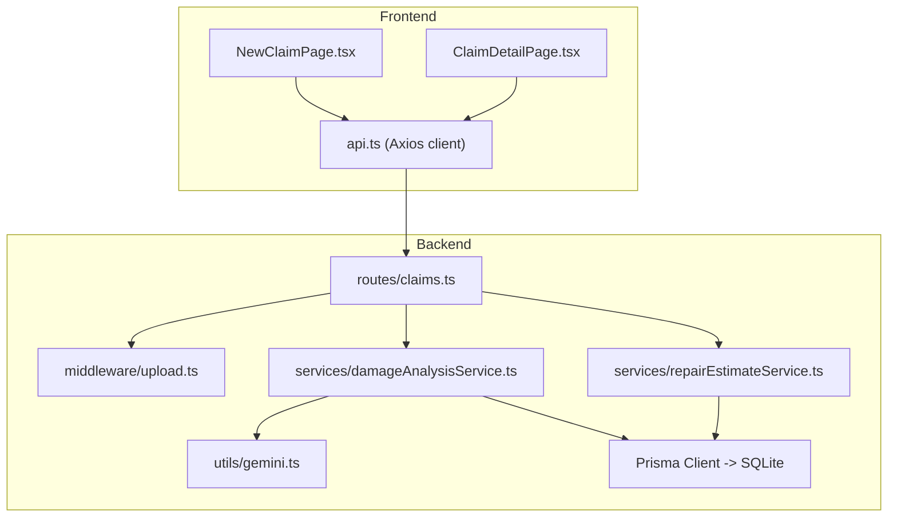
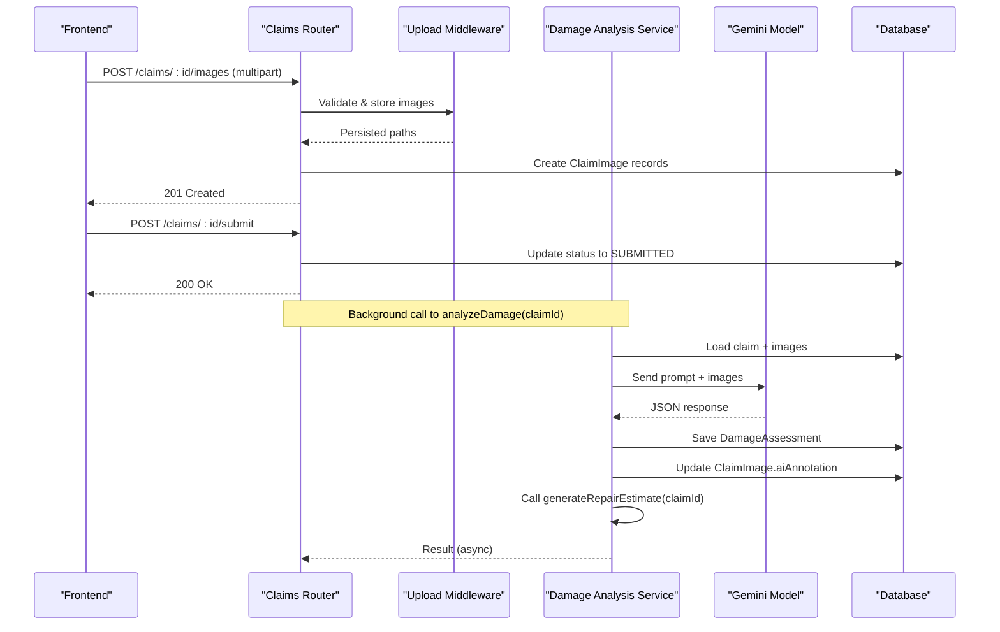
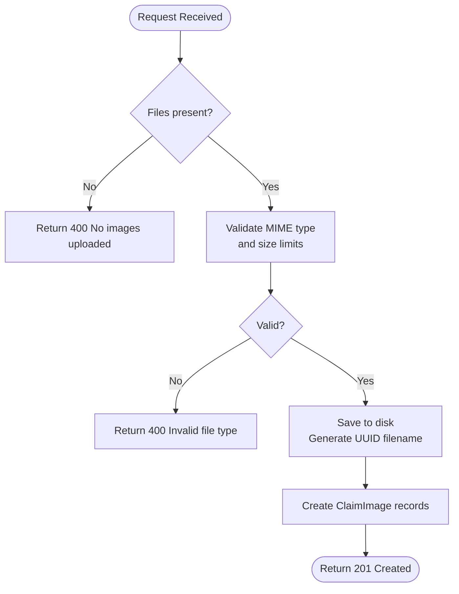
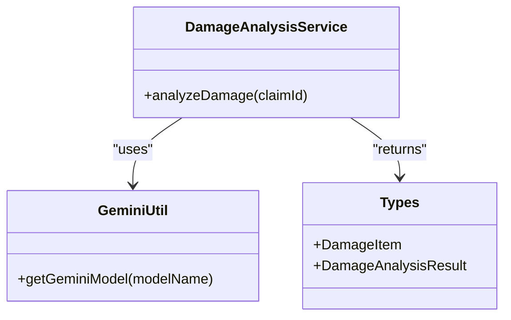
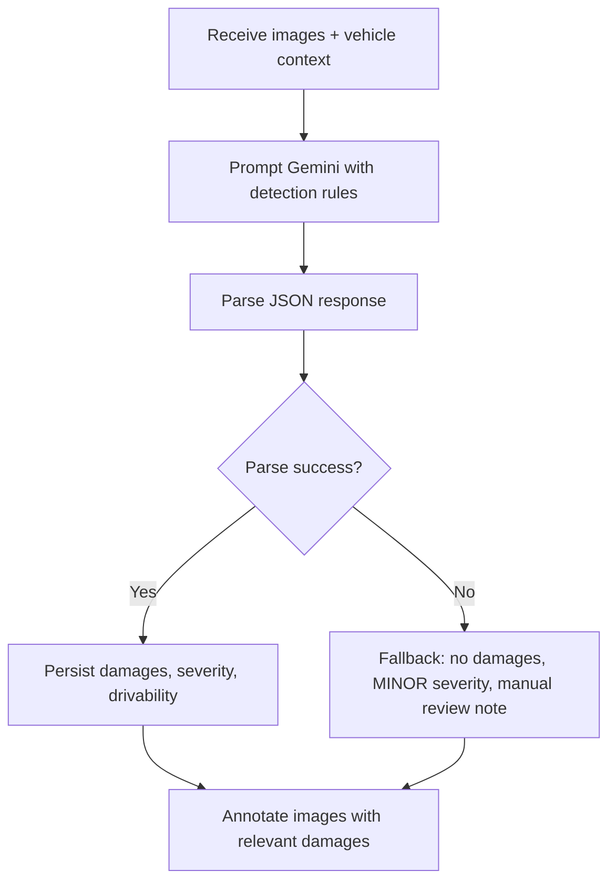
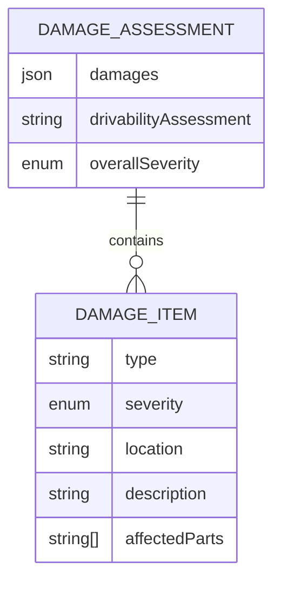
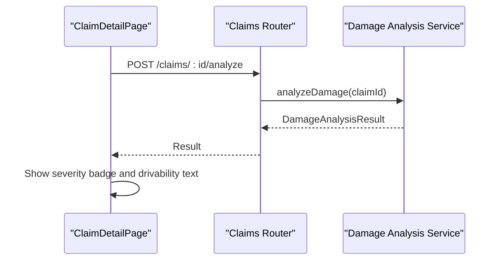
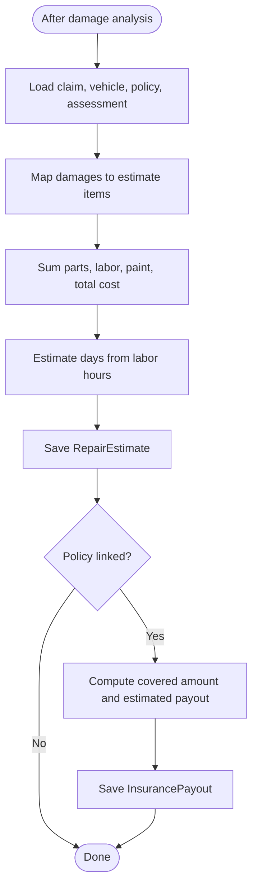
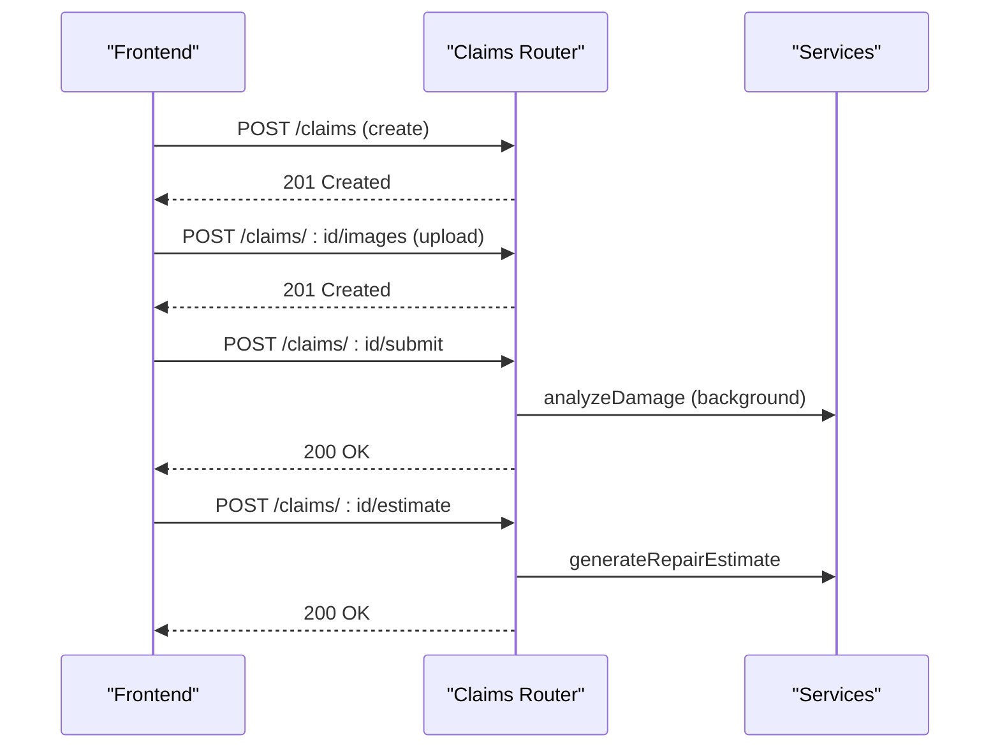
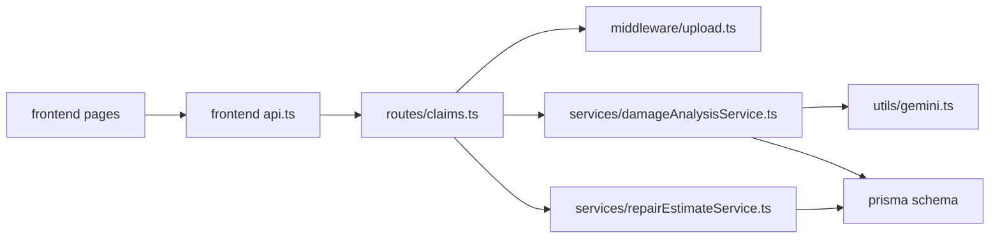

# AI Damage Assessment

<cite>
**Referenced Files in This Document**
- [damageAnalysisService.ts](file://backend/src/services/damageAnalysisService.ts)
- [gemini.ts](file://backend/src/utils/gemini.ts)
- [upload.ts](file://backend/src/middleware/upload.ts)
- [claims.ts](file://backend/src/routes/claims.ts)
- [schema.prisma](file://backend/prisma/schema.prisma)
- [types/index.ts](file://backend/src/types/index.ts)
- [repairEstimateService.ts](file://backend/src/services/repairEstimateService.ts)
- [NewClaimPage.tsx](file://frontend/src/pages/NewClaimPage.tsx)
- [ClaimDetailPage.tsx](file://frontend/src/pages/ClaimDetailPage.tsx)
- [api.ts](file://frontend/src/services/api.ts)
</cite>

## Table of Contents
1. [Introduction](#introduction)
2. [Project Structure](#project-structure)
3. [Core Components](#core-components)
4. [Architecture Overview](#architecture-overview)
5. [Detailed Component Analysis](#detailed-component-analysis)
6. [Dependency Analysis](#dependency-analysis)
7. [Performance Considerations](#performance-considerations)
8. [Troubleshooting Guide](#troubleshooting-guide)
9. [Conclusion](#conclusion)
10. [Appendices](#appendices)

## Introduction
This document explains the AI-powered damage assessment system that integrates Google Gemini for computer vision analysis of vehicle images. It covers how images are uploaded and validated, how damage is detected (dents, scratches, cracks, broken lights, structural damage), how severity is classified (MINOR, MODERATE, SEVERE), how drivability is assessed, and how results are returned as structured JSON. It also documents integration with claim workflows and automatic repair estimate generation, configuration options for the AI model and prompts, fallback mechanisms, and example inputs/outputs and error handling scenarios.

## Project Structure
The backend exposes REST endpoints to create claims, upload images/documents, trigger AI damage analysis, generate repair estimates, and interact with an AI assistant. The frontend provides a multi-step claim creation flow, image uploads, and a detail view where users can run analysis and view results.

**Diagram sources**
- [claims.ts:15-314](file://backend/src/routes/claims.ts#L15-L314)
- [upload.ts:17-53](file://backend/src/middleware/upload.ts#L17-L53)
- [damageAnalysisService.ts:50-152](file://backend/src/services/damageAnalysisService.ts#L50-L152)
- [repairEstimateService.ts:104-199](file://backend/src/services/repairEstimateService.ts#L104-L199)
- [gemini.ts:6-10](file://backend/src/utils/gemini.ts#L6-L10)
- [NewClaimPage.tsx:62-88](file://frontend/src/pages/NewClaimPage.tsx#L62-L88)
- [ClaimDetailPage.tsx:27-34](file://frontend/src/pages/ClaimDetailPage.tsx#L27-L34)
- [api.ts:3-17](file://frontend/src/services/api.ts#L3-L17)

**Section sources**
- [claims.ts:15-314](file://backend/src/routes/claims.ts#L15-L314)
- [NewClaimPage.tsx:62-88](file://frontend/src/pages/NewClaimPage.tsx#L62-L88)
- [ClaimDetailPage.tsx:27-34](file://frontend/src/pages/ClaimDetailPage.tsx#L27-L34)
- [api.ts:3-17](file://frontend/src/services/api.ts#L3-L17)

## Core Components
- Image upload and validation middleware ensures only supported image formats and sizes are accepted and stores them under dedicated directories.
- Damage analysis service orchestrates reading stored images, building a prompt with vehicle context, calling Gemini, parsing structured JSON, persisting results, annotating images, and triggering repair estimate generation.
- Repair estimate service computes itemized costs based on detected damages, severity, and policy deductible, then persists totals and estimated payout.
- Routes expose endpoints for creating claims, uploading images/documents, submitting claims (which triggers background analysis), running analysis on demand, generating estimates, and chat interactions.
- Frontend pages implement the user journey: step-by-step claim creation, image uploads, and a detail page to analyze damage and view estimates.

**Section sources**
- [upload.ts:17-53](file://backend/src/middleware/upload.ts#L17-L53)
- [damageAnalysisService.ts:50-152](file://backend/src/services/damageAnalysisService.ts#L50-L152)
- [repairEstimateService.ts:104-199](file://backend/src/services/repairEstimateService.ts#L104-L199)
- [claims.ts:152-314](file://backend/src/routes/claims.ts#L152-L314)
- [NewClaimPage.tsx:62-88](file://frontend/src/pages/NewClaimPage.tsx#L62-L88)
- [ClaimDetailPage.tsx:27-34](file://frontend/src/pages/ClaimDetailPage.tsx#L27-L34)

## Architecture Overview
The system follows a layered architecture:
- Presentation layer (React frontend) collects incident details and images, calls backend APIs.
- API layer (Express routes) validates requests, handles file uploads, and delegates to services.
- Service layer contains business logic: damage analysis via Gemini, repair estimate calculation, and persistence via Prisma.
- Data layer uses Prisma with SQLite for claims, images, assessments, estimates, and payouts.

**Diagram sources**
- [claims.ts:195-233](file://backend/src/routes/claims.ts#L195-L233)
- [claims.ts:152-193](file://backend/src/routes/claims.ts#L152-L193)
- [damageAnalysisService.ts:50-152](file://backend/src/services/damageAnalysisService.ts#L50-L152)
- [upload.ts:17-53](file://backend/src/middleware/upload.ts#L17-L53)

## Detailed Component Analysis

### Image Upload Handling and Validation
- Accepts multiple images per request with a field name for images and supports an optional imageType parameter to classify as FULL_VEHICLE or DAMAGE_CLOSEUP.
- Enforces allowed MIME types (JPEG, PNG, WebP) and a 10MB size limit.
- Stores files under uploads/images with unique filenames and records metadata in the database.

**Diagram sources**
- [upload.ts:17-53](file://backend/src/middleware/upload.ts#L17-L53)
- [claims.ts:195-233](file://backend/src/routes/claims.ts#L195-L233)

**Section sources**
- [upload.ts:17-53](file://backend/src/middleware/upload.ts#L17-L53)
- [claims.ts:195-233](file://backend/src/routes/claims.ts#L195-L233)

### Google Gemini Integration for Computer Vision
- Initializes the Gemini client using an environment variable for the API key and a configurable model name (default gemini-2.5-flash).
- Builds a detailed prompt instructing the model to identify dents, scratches, cracks, broken lights, bumper damage, glass/windshield damage, wheel/tire damage, frame/structural damage, and other collision-related defects.
- Includes vehicle context (year, make, model, color) to improve accuracy.
- Sends full vehicle and close-up images inline as base64 data with appropriate MIME types.

**Diagram sources**
- [gemini.ts:6-10](file://backend/src/utils/gemini.ts#L6-L10)
- [damageAnalysisService.ts:50-83](file://backend/src/services/damageAnalysisService.ts#L50-L83)
- [types/index.ts:12-24](file://backend/src/types/index.ts#L12-L24)

**Section sources**
- [gemini.ts:6-10](file://backend/src/utils/gemini.ts#L6-L10)
- [damageAnalysisService.ts:50-83](file://backend/src/services/damageAnalysisService.ts#L50-L83)

### Damage Detection Algorithms and Severity Classification
- The Gemini model is prompted to detect specific damage types and assign severity levels:
  - MINOR: Cosmetic-only issues (small scratches, minor dents, paint chips)
  - MODERATE: Functional but likely drivable (dented panels, cracked bumper, damaged lights)
  - SEVERE: Safety-critical or major structural issues (frame damage, shattered glass, deployed airbags, wheel damage, severe body damage)
- The model returns a structured JSON array of damages with fields: type, severity, location, description, affectedParts.
- Drivability assessment is included as a free-text summary indicating safety concerns.

**Diagram sources**
- [damageAnalysisService.ts:7-48](file://backend/src/services/damageAnalysisService.ts#L7-L48)
- [damageAnalysisService.ts:85-103](file://backend/src/services/damageAnalysisService.ts#L85-L103)
- [types/index.ts:12-24](file://backend/src/types/index.ts#L12-L24)

**Section sources**
- [damageAnalysisService.ts:7-48](file://backend/src/services/damageAnalysisService.ts#L7-L48)
- [damageAnalysisService.ts:85-103](file://backend/src/services/damageAnalysisService.ts#L85-L103)
- [types/index.ts:12-24](file://backend/src/types/index.ts#L12-L24)

### Structured JSON Response Format
- The expected output from the AI includes:
  - damages: array of items with type, severity, location, description, affectedParts
  - drivabilityAssessment: string describing whether the vehicle is safe to drive
  - overallSeverity: MINOR | MODERATE | SEVERE
- The service parses the response, handles markdown code blocks if present, and falls back to a safe default when parsing fails.

**Diagram sources**
- [types/index.ts:12-24](file://backend/src/types/index.ts#L12-L24)
- [damageAnalysisService.ts:85-103](file://backend/src/services/damageAnalysisService.ts#L85-L103)

**Section sources**
- [types/index.ts:12-24](file://backend/src/types/index.ts#L12-L24)
- [damageAnalysisService.ts:85-103](file://backend/src/services/damageAnalysisService.ts#L85-L103)

### Drivability Assessment Logic
- The drivability assessment is provided by the AI model based on detected damage and overall severity.
- If severity is SEVERE, the frontend displays a safety warning with the drivability text.
- In case of parsing failure, the fallback sets a message indicating manual review is required.

**Diagram sources**
- [claims.ts:270-288](file://backend/src/routes/claims.ts#L270-L288)
- [damageAnalysisService.ts:50-103](file://backend/src/services/damageAnalysisService.ts#L50-L103)
- [ClaimDetailPage.tsx:27-34](file://frontend/src/pages/ClaimDetailPage.tsx#L27-L34)
- [ClaimDetailPage.tsx:99-108](file://frontend/src/pages/ClaimDetailPage.tsx#L99-L108)

**Section sources**
- [claims.ts:270-288](file://backend/src/routes/claims.ts#L270-L288)
- [damageAnalysisService.ts:50-103](file://backend/src/services/damageAnalysisService.ts#L50-L103)
- [ClaimDetailPage.tsx:99-108](file://frontend/src/pages/ClaimDetailPage.tsx#L99-L108)

### Automatic Repair Estimate Generation
- After damage analysis, the system automatically generates a repair estimate:
  - Uses a cost lookup table mapping damage types and severities to parts and labor ranges.
  - Calculates part costs, labor hours, labor rates, paint materials, and subtotal per item.
  - Aggregates totals and estimates repair days based on total labor hours.
  - Persists the estimate and calculates insurance payout considering deductible.

**Diagram sources**
- [repairEstimateService.ts:5-58](file://backend/src/services/repairEstimateService.ts#L5-L58)
- [repairEstimateService.ts:74-102](file://backend/src/services/repairEstimateService.ts#L74-L102)
- [repairEstimateService.ts:104-199](file://backend/src/services/repairEstimateService.ts#L104-L199)

**Section sources**
- [repairEstimateService.ts:5-58](file://backend/src/services/repairEstimateService.ts#L5-L58)
- [repairEstimateService.ts:74-102](file://backend/src/services/repairEstimateService.ts#L74-L102)
- [repairEstimateService.ts:104-199](file://backend/src/services/repairEstimateService.ts#L104-L199)

### Integration with Claim Workflows
- Creating a claim:
  - Frontend collects incident info and images, posts to backend, which creates a claim record.
- Submitting a claim:
  - Updates status to SUBMITTED and triggers background damage analysis.
- Analyzing damage:
  - On-demand endpoint runs analysis synchronously and returns results.
- Generating estimates:
  - Endpoint requires prior damage assessment; otherwise returns an error.
- Documents:
  - Supports uploading license, registration, accident report, repair estimate; can verify documents via a separate service.

**Diagram sources**
- [claims.ts:20-57](file://backend/src/routes/claims.ts#L20-L57)
- [claims.ts:152-193](file://backend/src/routes/claims.ts#L152-L193)
- [claims.ts:290-314](file://backend/src/routes/claims.ts#L290-L314)
- [NewClaimPage.tsx:72-88](file://frontend/src/pages/NewClaimPage.tsx#L72-L88)

**Section sources**
- [claims.ts:20-57](file://backend/src/routes/claims.ts#L20-L57)
- [claims.ts:152-193](file://backend/src/routes/claims.ts#L152-L193)
- [claims.ts:290-314](file://backend/src/routes/claims.ts#L290-L314)
- [NewClaimPage.tsx:72-88](file://frontend/src/pages/NewClaimPage.tsx#L72-L88)

### Configuration Options
- AI model:
  - Model name defaults to gemini-2.5-flash but can be configured via the utility function.
- API key:
  - Loaded from environment variable for Gemini authentication.
- Upload settings:
  - Allowed MIME types and 10MB size limit enforced by upload middleware.
- Prompt engineering:
  - Comprehensive prompt instructs the model to detect specific damage types and return structured JSON with severity and drivability assessment.

**Section sources**
- [gemini.ts:6-10](file://backend/src/utils/gemini.ts#L6-L10)
- [upload.ts:30-47](file://backend/src/middleware/upload.ts#L30-L47)
- [damageAnalysisService.ts:7-48](file://backend/src/services/damageAnalysisService.ts#L7-L48)

### Fallback Mechanisms
- If Gemini response cannot be parsed to JSON, the system logs the raw response and returns a safe fallback:
  - Empty damages array
  - Overall severity set to MINOR
  - Drivability assessment indicates manual review is required
- This ensures the workflow continues even when AI parsing fails.

**Section sources**
- [damageAnalysisService.ts:85-103](file://backend/src/services/damageAnalysisService.ts#L85-L103)

## Dependency Analysis
- Routes depend on middleware for uploads and services for business logic.
- Services depend on Prisma for persistence and Gemini for AI capabilities.
- Frontend depends on Axios client configured with base URL and auth token handling.

**Diagram sources**
- [claims.ts:15-314](file://backend/src/routes/claims.ts#L15-L314)
- [upload.ts:17-53](file://backend/src/middleware/upload.ts#L17-L53)
- [damageAnalysisService.ts:50-152](file://backend/src/services/damageAnalysisService.ts#L50-L152)
- [repairEstimateService.ts:104-199](file://backend/src/services/repairEstimateService.ts#L104-L199)
- [gemini.ts:6-10](file://backend/src/utils/gemini.ts#L6-L10)
- [schema.prisma:70-159](file://backend/prisma/schema.prisma#L70-L159)
- [api.ts:3-17](file://frontend/src/services/api.ts#L3-L17)

**Section sources**
- [claims.ts:15-314](file://backend/src/routes/claims.ts#L15-L314)
- [schema.prisma:70-159](file://backend/prisma/schema.prisma#L70-L159)
- [api.ts:3-17](file://frontend/src/services/api.ts#L3-L17)

## Performance Considerations
- Image uploads are limited to 10MB to prevent large payloads.
- Background processing for damage analysis avoids blocking submission responses.
- Repair estimate calculation uses simple arithmetic and lookup tables for fast computation.
- Consider caching frequently accessed vehicle or policy data if read-heavy workloads emerge.
- For high concurrency, consider queuing background jobs for analysis and estimates.

[No sources needed since this section provides general guidance]

## Troubleshooting Guide
- Missing images:
  - Submitting a claim without images returns an error requiring at least one image.
- Invalid file types:
  - Upload middleware rejects unsupported MIME types with an error.
- Parsing failures:
  - If Gemini response is not valid JSON, the system logs the raw response and returns a fallback assessment.
- Estimate generation prerequisites:
  - Attempting to generate an estimate without a prior damage assessment returns an error.
- Authentication:
  - Frontend interceptors handle 401 responses by clearing tokens and redirecting to login.

**Section sources**
- [claims.ts:170-173](file://backend/src/routes/claims.ts#L170-L173)
- [upload.ts:30-41](file://backend/src/middleware/upload.ts#L30-L41)
- [damageAnalysisService.ts:85-103](file://backend/src/services/damageAnalysisService.ts#L85-L103)
- [claims.ts:303-306](file://backend/src/routes/claims.ts#L303-L306)
- [api.ts:20-29](file://frontend/src/services/api.ts#L20-L29)

## Conclusion
The AI-powered damage assessment system integrates Google Gemini to analyze vehicle images, detect damage types, classify severity, assess drivability, and produce structured JSON outputs. It seamlessly integrates with claim workflows by triggering analysis on submission and automatically generating repair estimates and insurance payout calculations. Robust upload validation, fallback mechanisms, and clear error handling ensure reliability. The frontend provides an intuitive experience for users to submit claims, upload images, and view assessments and estimates.

[No sources needed since this section summarizes without analyzing specific files]

## Appendices

### Example Input Images
- Full vehicle photos from multiple angles (front, rear, left, right sides).
- Close-up photos of specific damaged areas (e.g., dents, scratches, cracked glass, broken lights).

[No sources needed since this section describes conceptual inputs]

### Expected Outputs
- Damage assessment JSON:
  - damages: array of items with type, severity, location, description, affectedParts
  - drivabilityAssessment: string
  - overallSeverity: MINOR | MODERATE | SEVERE
- Repair estimate:
  - items: array with damageType, partName, partCost, laborHours, laborRate, laborCost, paintMaterials, subtotal
  - totalPartsCost, totalLaborCost, totalCost, estimatedDays
- Insurance payout:
  - deductible, coveredAmount, estimatedPayout, notes

**Section sources**
- [types/index.ts:12-43](file://backend/src/types/index.ts#L12-L43)
- [repairEstimateService.ts:104-199](file://backend/src/services/repairEstimateService.ts#L104-L199)

### Error Handling Scenarios
- No images uploaded before submission: returns 400 with descriptive error.
- Invalid file type during upload: returns 400 with allowed types message.
- Failed AI parsing: returns fallback assessment with MINOR severity and manual review note.
- Estimate without assessment: returns 400 requiring prior damage analysis.
- Authentication errors: frontend clears tokens and redirects to login.

**Section sources**
- [claims.ts:170-173](file://backend/src/routes/claims.ts#L170-L173)
- [upload.ts:30-41](file://backend/src/middleware/upload.ts#L30-L41)
- [damageAnalysisService.ts:85-103](file://backend/src/services/damageAnalysisService.ts#L85-L103)
- [claims.ts:303-306](file://backend/src/routes/claims.ts#L303-L306)
- [api.ts:20-29](file://frontend/src/services/api.ts#L20-L29)