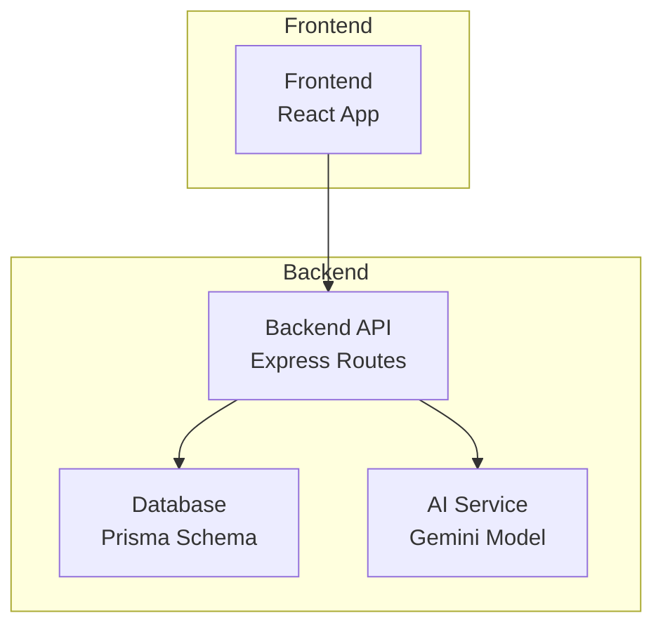
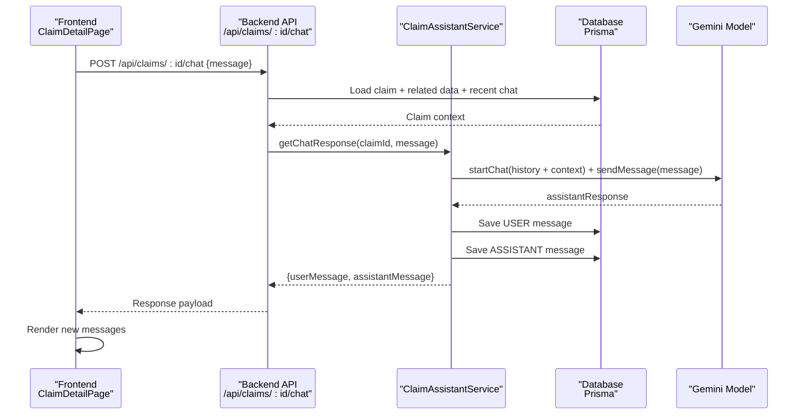
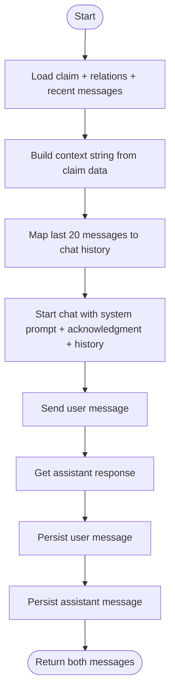
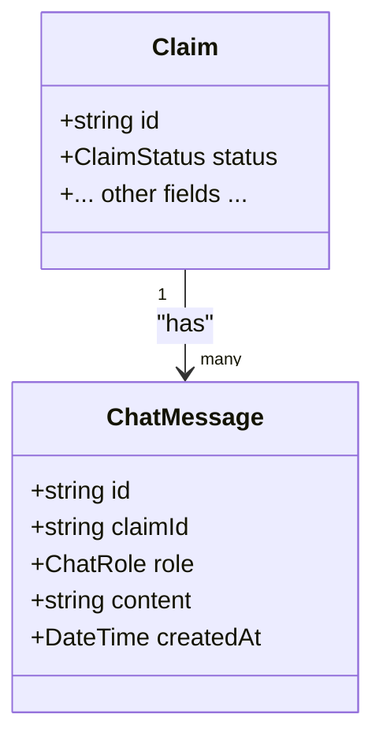
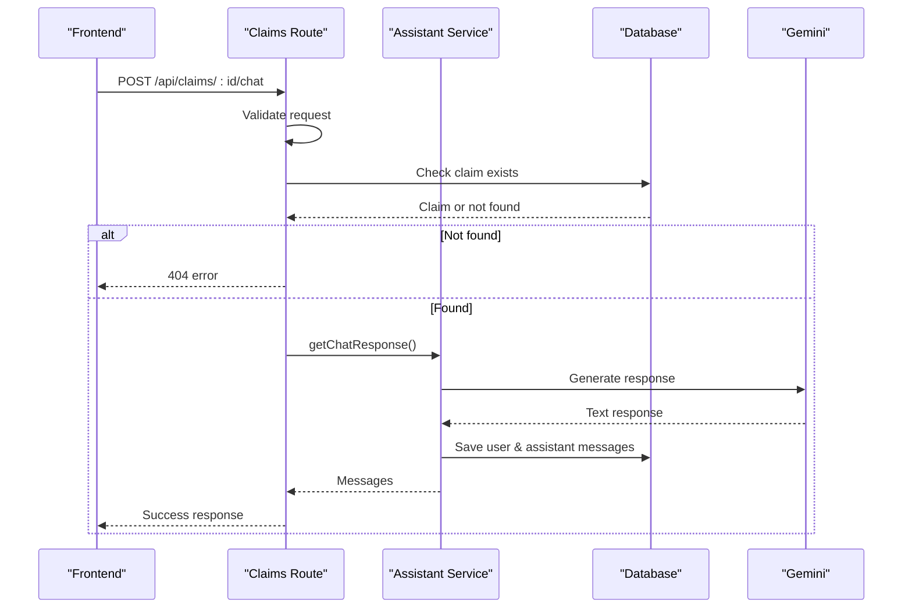
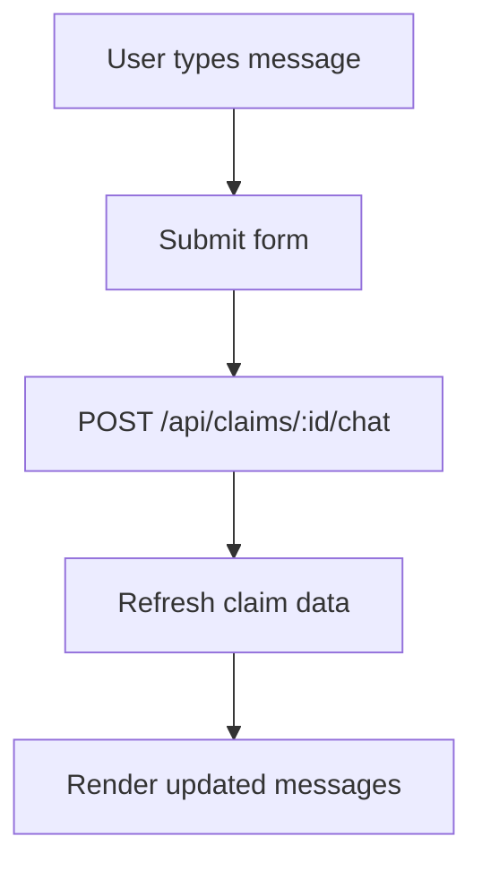
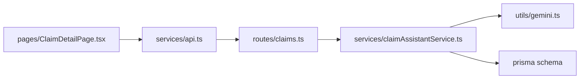
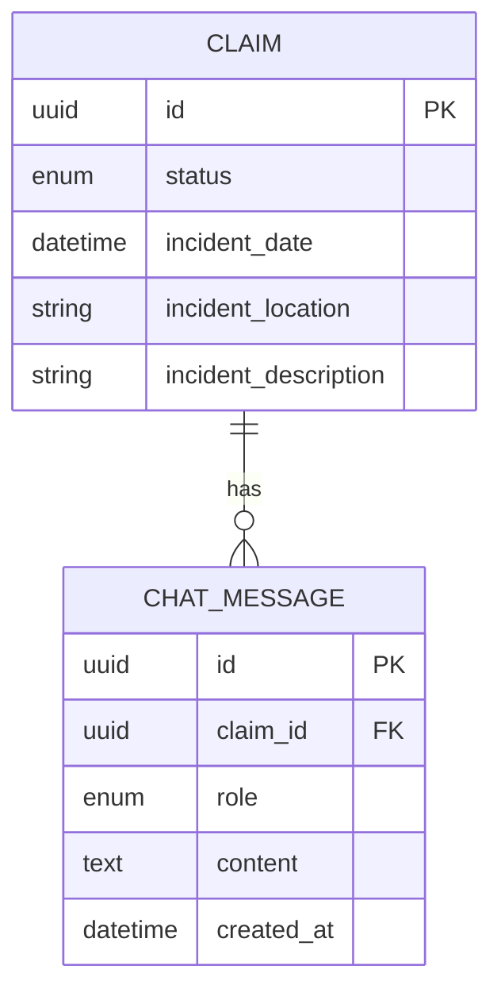

# Chat Assistant

<cite>
**Referenced Files in This Document**
- [backend/src/services/claimAssistantService.ts](file://backend/src/services/claimAssistantService.ts)
- [backend/src/utils/gemini.ts](file://backend/src/utils/gemini.ts)
- [backend/src/routes/claims.ts](file://backend/src/routes/claims.ts)
- [backend/prisma/schema.prisma](file://backend/prisma/schema.prisma)
- [frontend/src/pages/ClaimDetailPage.tsx](file://frontend/src/pages/ClaimDetailPage.tsx)
- [frontend/src/services/api.ts](file://frontend/src/services/api.ts)
- [frontend/src/types/index.ts](file://frontend/src/types/index.ts)
</cite>

## Table of Contents
1. [Introduction](#introduction)
2. [Project Structure](#project-structure)
3. [Core Components](#core-components)
4. [Architecture Overview](#architecture-overview)
5. [Detailed Component Analysis](#detailed-component-analysis)
6. [Dependency Analysis](#dependency-analysis)
7. [Performance Considerations](#performance-considerations)
8. [Troubleshooting Guide](#troubleshooting-guide)
9. [Conclusion](#conclusion)
10. [Appendices](#appendices)

## Introduction
This document explains the AI-powered chat assistant that guides policyholders through their vehicle insurance claim process. It covers the context-aware conversation engine, knowledge base, conversation flow and state persistence, integration with claim data for personalized assistance, message formatting and response generation, error handling, frontend chat interface, real-time communication patterns (as implemented), API endpoints, logging, privacy considerations, and content moderation practices.

## Project Structure
The chat assistant spans backend services, routes, database schema, and a React frontend:
- Backend: Express server with Prisma ORM, Gemini-based AI service, and claim-specific routes including chat endpoints.
- Frontend: React page with an embedded chat sidebar integrated into the claim detail view.

**Diagram sources**
- [backend/src/routes/claims.ts:423-447](file://backend/src/routes/claims.ts#L423-L447)
- [backend/src/services/claimAssistantService.ts:19-129](file://backend/src/services/claimAssistantService.ts#L19-L129)
- [backend/src/utils/gemini.ts:1-13](file://backend/src/utils/gemini.ts#L1-L13)
- [backend/prisma/schema.prisma:187-200](file://backend/prisma/schema.prisma#L187-L200)
- [frontend/src/pages/ClaimDetailPage.tsx:57-67](file://frontend/src/pages/ClaimDetailPage.tsx#L57-L67)

**Section sources**
- [backend/src/routes/claims.ts:423-447](file://backend/src/routes/claims.ts#L423-L447)
- [backend/src/services/claimAssistantService.ts:19-129](file://backend/src/services/claimAssistantService.ts#L19-L129)
- [backend/src/utils/gemini.ts:1-13](file://backend/src/utils/gemini.ts#L1-L13)
- [backend/prisma/schema.prisma:187-200](file://backend/prisma/schema.prisma#L187-L200)
- [frontend/src/pages/ClaimDetailPage.tsx:57-67](file://frontend/src/pages/ClaimDetailPage.tsx#L57-L67)

## Core Components
- Context-aware conversation engine: Builds rich claim context from database records and recent chat history to inform AI responses.
- Knowledge base: Embedded system prompt defines responsibilities such as explaining status, damage assessments, repair estimates, missing documents, step-by-step guidance, safety advice, and general insurance questions.
- Conversation flow management: The assistant composes a chat session with system context, a model acknowledgment, and the last N messages to maintain continuity.
- State persistence: All user and assistant messages are stored per claim, enabling retrieval and continuation across sessions.
- Personalized assistance: Claim details, vehicle info, policy coverage, damage assessment, repair estimate, payout estimate, and document statuses are injected into the context.
- Message formatting and response generation: The AI returns text; the frontend renders it within styled bubbles and preserves whitespace.
- Error handling: Route-level validation and try/catch blocks return structured errors; frontend shows alerts on failures.

**Section sources**
- [backend/src/services/claimAssistantService.ts:4-17](file://backend/src/services/claimAssistantService.ts#L4-L17)
- [backend/src/services/claimAssistantService.ts:40-84](file://backend/src/services/claimAssistantService.ts#L40-L84)
- [backend/src/services/claimAssistantService.ts:86-105](file://backend/src/services/claimAssistantService.ts#L86-L105)
- [backend/src/services/claimAssistantService.ts:107-128](file://backend/src/services/claimAssistantService.ts#L107-L128)
- [frontend/src/pages/ClaimDetailPage.tsx:255-283](file://frontend/src/pages/ClaimDetailPage.tsx#L255-L283)

## Architecture Overview
The chat assistant integrates three layers:
- Frontend: Sends messages via HTTP POST and displays conversation history.
- Backend: Validates input, loads claim context, calls AI, persists messages, and returns results.
- Database: Persists claims, related entities, and chat messages.

**Diagram sources**
- [backend/src/routes/claims.ts:423-447](file://backend/src/routes/claims.ts#L423-L447)
- [backend/src/services/claimAssistantService.ts:19-129](file://backend/src/services/claimAssistantService.ts#L19-L129)
- [backend/src/utils/gemini.ts:6-10](file://backend/src/utils/gemini.ts#L6-L10)
- [backend/prisma/schema.prisma:187-200](file://backend/prisma/schema.prisma#L187-L200)
- [frontend/src/pages/ClaimDetailPage.tsx:57-67](file://frontend/src/pages/ClaimDetailPage.tsx#L57-L67)

## Detailed Component Analysis

### Context-Aware Conversation Engine
- Loads the claim with related entities (vehicle, policy, damage assessment, repair estimate, payout, documents).
- Constructs a textual context summarizing status, vehicle, incident details, policy coverage, damage assessment, repair estimate, payout estimate, and required document statuses.
- Composes a chat history using the last 20 messages, reversed and mapped to roles compatible with the AI model.
- Starts a chat session with a system prompt defining the assistant’s role and guidelines, followed by a model acknowledgment, then the conversation history.

**Diagram sources**
- [backend/src/services/claimAssistantService.ts:19-34](file://backend/src/services/claimAssistantService.ts#L19-L34)
- [backend/src/services/claimAssistantService.ts:40-84](file://backend/src/services/claimAssistantService.ts#L40-L84)
- [backend/src/services/claimAssistantService.ts:86-105](file://backend/src/services/claimAssistantService.ts#L86-L105)
- [backend/src/services/claimAssistantService.ts:107-128](file://backend/src/services/claimAssistantService.ts#L107-L128)

**Section sources**
- [backend/src/services/claimAssistantService.ts:19-129](file://backend/src/services/claimAssistantService.ts#L19-L129)

### Knowledge Base and Guidance Scope
- Responsibilities include: answering claim status and next steps, explaining damage assessments, breaking down repair costs, identifying missing/incomplete documents, guiding users through the process, providing safety advice, and answering general insurance questions.
- Tone and style: concise, professional, empathetic, simple language, formatted lists when appropriate.

**Section sources**
- [backend/src/services/claimAssistantService.ts:4-17](file://backend/src/services/claimAssistantService.ts#L4-L17)

### Conversation Flow Management and State Persistence
- History window: Last 20 messages are included to keep context manageable while preserving continuity.
- Persistence: Both user and assistant messages are saved immediately after each exchange.
- Retrieval: GET endpoint returns all messages ordered chronologically for display.

**Diagram sources**
- [backend/prisma/schema.prisma:70-93](file://backend/prisma/schema.prisma#L70-L93)
- [backend/prisma/schema.prisma:187-200](file://backend/prisma/schema.prisma#L187-L200)

**Section sources**
- [backend/src/services/claimAssistantService.ts:29-33](file://backend/src/services/claimAssistantService.ts#L29-L33)
- [backend/src/services/claimAssistantService.ts:107-128](file://backend/src/services/claimAssistantService.ts#L107-L128)
- [backend/src/routes/claims.ts:399-421](file://backend/src/routes/claims.ts#L399-L421)

### Integration with Claim Data for Personalized Assistance
- Injected context includes:
  - Claim status, vehicle make/model/year/color, incident date/location/description
  - Policy provider, number, coverage type, deductible
  - Damage assessment count, overall severity, drivability assessment, individual damages
  - Repair estimate totals, parts/labor breakdown, estimated days
  - Payout estimate and deductible
  - Required document upload and verification statuses
- This ensures responses are tailored to the specific claim lifecycle stage and available information.

**Section sources**
- [backend/src/services/claimAssistantService.ts:40-84](file://backend/src/services/claimAssistantService.ts#L40-L84)

### Message Formatting, Response Generation, and Error Handling
- Message formatting:
  - Frontend renders messages in styled bubbles based on role and preserves line breaks.
  - System prompt instructs the assistant to use clear formatting like bullet points or numbered lists.
- Response generation:
  - Uses a generative model configured via environment variables.
  - Returns plain text which is persisted and displayed.
- Error handling:
  - Backend validates inputs and claim existence; returns structured error objects.
  - Frontend shows alerts on failure and resets loading states.

**Diagram sources**
- [backend/src/routes/claims.ts:423-447](file://backend/src/routes/claims.ts#L423-L447)
- [backend/src/services/claimAssistantService.ts:19-129](file://backend/src/services/claimAssistantService.ts#L19-L129)
- [frontend/src/pages/ClaimDetailPage.tsx:57-67](file://frontend/src/pages/ClaimDetailPage.tsx#L57-L67)

**Section sources**
- [backend/src/routes/claims.ts:423-447](file://backend/src/routes/claims.ts#L423-L447)
- [backend/src/services/claimAssistantService.ts:19-129](file://backend/src/services/claimAssistantService.ts#L19-L129)
- [frontend/src/pages/ClaimDetailPage.tsx:255-283](file://frontend/src/pages/ClaimDetailPage.tsx#L255-L283)

### Frontend Chat Interface Components and Real-Time Patterns
- Chat UI:
  - Sidebar with scrollable message list, quick prompts, and input form.
  - Displays user and assistant messages with distinct styling.
- Real-time behavior:
  - Uses standard HTTP requests; no WebSocket or SSE implementation is present.
  - After sending a message, the page refreshes claim data to fetch updated messages.

**Diagram sources**
- [frontend/src/pages/ClaimDetailPage.tsx:57-67](file://frontend/src/pages/ClaimDetailPage.tsx#L57-L67)
- [frontend/src/pages/ClaimDetailPage.tsx:255-283](file://frontend/src/pages/ClaimDetailPage.tsx#L255-L283)

**Section sources**
- [frontend/src/pages/ClaimDetailPage.tsx:255-283](file://frontend/src/pages/ClaimDetailPage.tsx#L255-L283)
- [frontend/src/services/api.ts:1-33](file://frontend/src/services/api.ts#L1-L33)

### API Endpoints for Chat
- GET /api/claims/:id/chat
  - Purpose: Retrieve conversation history for a claim.
  - Behavior: Returns messages ordered by creation time.
- POST /api/claims/:id/chat
  - Purpose: Send a message and receive an AI-generated response.
  - Behavior: Validates input, builds context, calls AI, persists messages, returns both user and assistant messages.

**Section sources**
- [backend/src/routes/claims.ts:399-421](file://backend/src/routes/claims.ts#L399-L421)
- [backend/src/routes/claims.ts:423-447](file://backend/src/routes/claims.ts#L423-L447)

### Assistant Configuration
- Model selection: Default model name is set in the utility module.
- API key: Loaded from environment variables.
- CORS and JSON limits: Configured at the application level.

**Section sources**
- [backend/src/utils/gemini.ts:1-13](file://backend/src/utils/gemini.ts#L1-L13)
- [backend/src/index.ts:16-22](file://backend/src/index.ts#L16-L22)

## Dependency Analysis
Key dependencies and relationships:
- Routes depend on services for business logic and on Prisma for data access.
- Services depend on the AI utility for model instantiation and on Prisma for reading/writing claim-related data.
- Frontend depends on a centralized Axios client that injects auth tokens and handles 401 redirects.

**Diagram sources**
- [backend/src/routes/claims.ts:423-447](file://backend/src/routes/claims.ts#L423-L447)
- [backend/src/services/claimAssistantService.ts:19-129](file://backend/src/services/claimAssistantService.ts#L19-L129)
- [backend/src/utils/gemini.ts:1-13](file://backend/src/utils/gemini.ts#L1-L13)
- [frontend/src/pages/ClaimDetailPage.tsx:57-67](file://frontend/src/pages/ClaimDetailPage.tsx#L57-L67)
- [frontend/src/services/api.ts:1-33](file://frontend/src/services/api.ts#L1-L33)

**Section sources**
- [backend/src/routes/claims.ts:423-447](file://backend/src/routes/claims.ts#L423-L447)
- [backend/src/services/claimAssistantService.ts:19-129](file://backend/src/services/claimAssistantService.ts#L19-L129)
- [frontend/src/services/api.ts:1-33](file://frontend/src/services/api.ts#L1-L33)

## Performance Considerations
- Context size: Limiting chat history to the last 20 messages helps control token usage and latency.
- Database queries: Eager loading related entities reduces N+1 query issues during context building.
- Asynchronous processing: AI calls are awaited; consider background jobs for long-running tasks if needed.
- Payload size: JSON body limit is set to accommodate larger payloads if necessary.

[No sources needed since this section provides general guidance]

## Troubleshooting Guide
Common issues and resolutions:
- Claim not found: Ensure the claim ID exists and belongs to the authenticated user.
- Missing message: Validate that the request body contains a non-empty message field.
- AI service errors: Verify environment configuration for the API key and network connectivity.
- Frontend errors: Check browser console for network errors; ensure authentication token is present and valid.

Operational checks:
- Health endpoint confirms backend availability.
- Review route-level logs for stack traces and error messages.

**Section sources**
- [backend/src/routes/claims.ts:423-447](file://backend/src/routes/claims.ts#L423-L447)
- [backend/src/index.ts:34-37](file://backend/src/index.ts#L34-L37)
- [frontend/src/services/api.ts:19-30](file://frontend/src/services/api.ts#L19-L30)

## Conclusion
The chat assistant delivers personalized, context-aware support throughout the claim lifecycle by combining rich claim data with AI-driven responses. It persists conversations for continuity, exposes straightforward APIs, and integrates seamlessly into the frontend claim detail view. While current communication uses HTTP polling, future enhancements could introduce real-time updates and additional safeguards for privacy and content moderation.

[No sources needed since this section summarizes without analyzing specific files]

## Appendices

### Data Models Relevant to Chat

**Diagram sources**
- [backend/prisma/schema.prisma:70-93](file://backend/prisma/schema.prisma#L70-L93)
- [backend/prisma/schema.prisma:187-200](file://backend/prisma/schema.prisma#L187-L200)

### Privacy and Content Moderation Notes
- Current implementation does not include explicit content moderation or logging beyond database storage of messages.
- Recommended enhancements:
  - Add content filtering before sending to the AI and after receiving responses.
  - Implement audit logging for sensitive operations and errors.
  - Enforce data retention policies for chat messages.
  - Ensure secure handling of personal data in contexts sent to external AI services.

[No sources needed since this section provides general guidance]