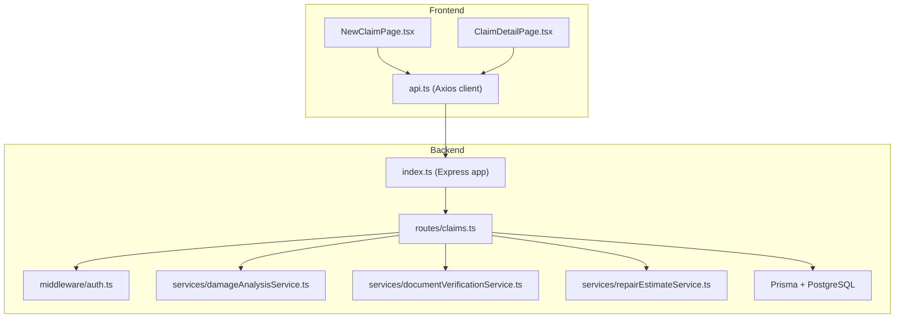
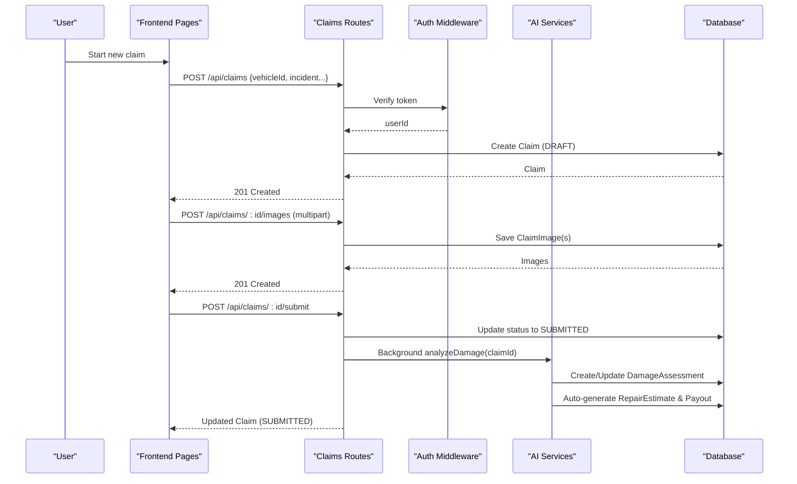
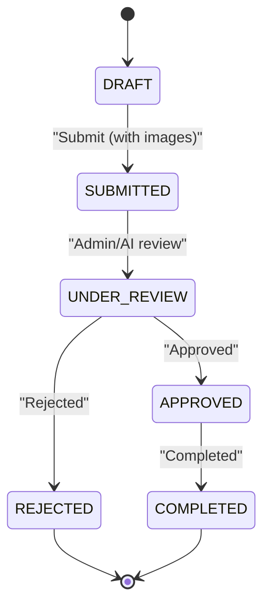
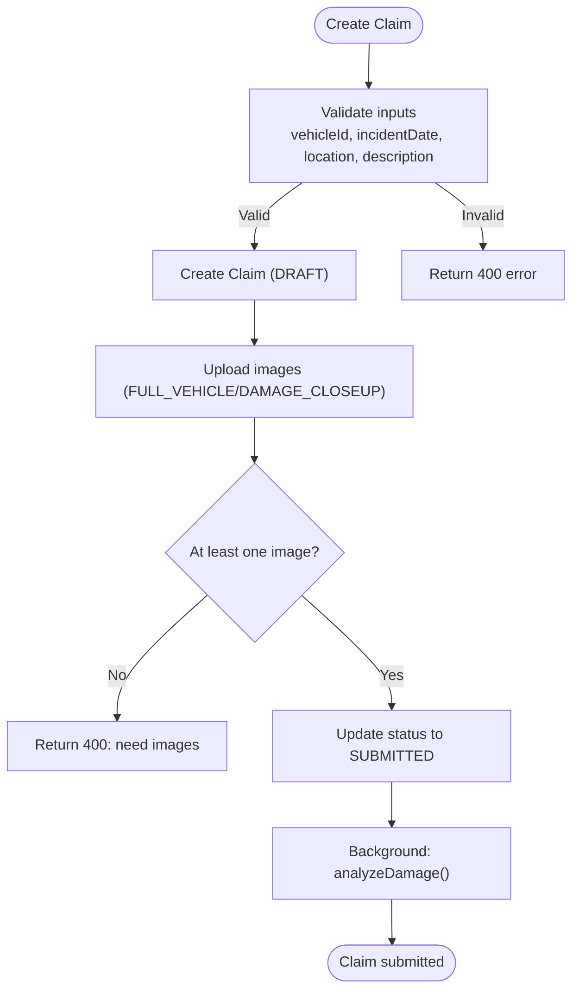
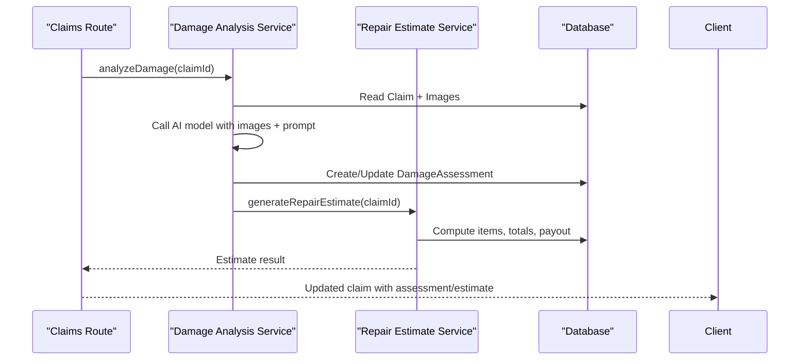
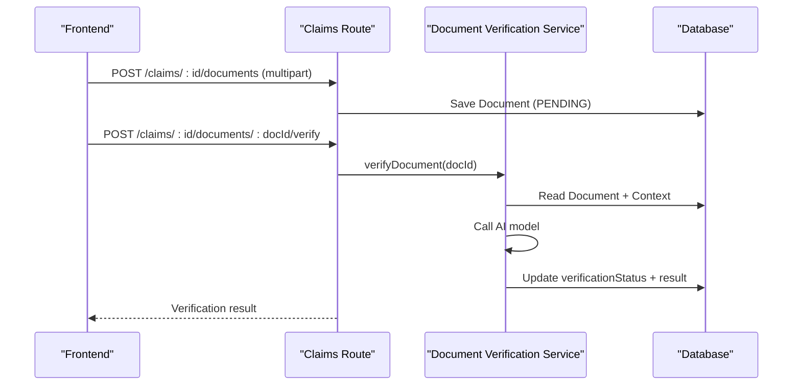
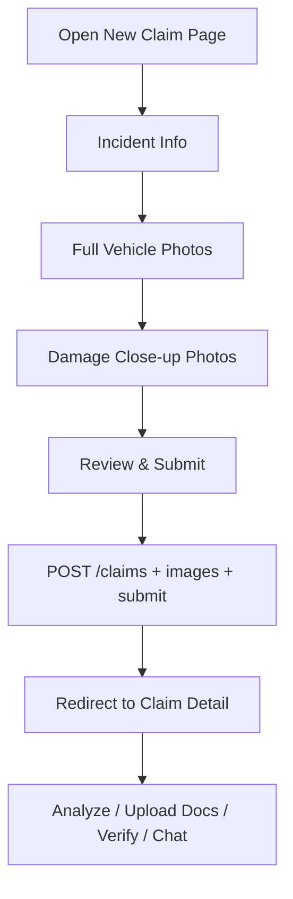
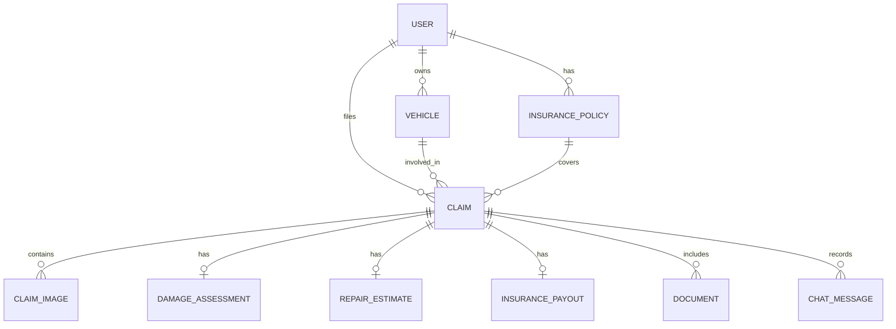
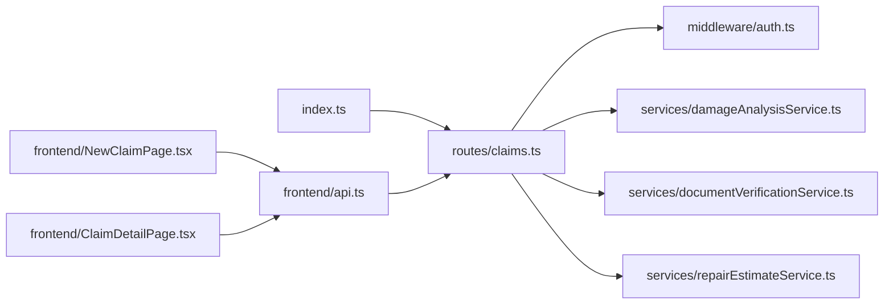

# Claim Processing Workflow

<cite>
**Referenced Files in This Document**
- [schema.prisma](file://backend/prisma/schema.prisma)
- [index.ts](file://backend/src/index.ts)
- [claims.ts](file://backend/src/routes/claims.ts)
- [auth.ts](file://backend/src/middleware/auth.ts)
- [damageAnalysisService.ts](file://backend/src/services/damageAnalysisService.ts)
- [documentVerificationService.ts](file://backend/src/services/documentVerificationService.ts)
- [repairEstimateService.ts](file://backend/src/services/repairEstimateService.ts)
- [NewClaimPage.tsx](file://frontend/src/pages/NewClaimPage.tsx)
- [ClaimDetailPage.tsx](file://frontend/src/pages/ClaimDetailPage.tsx)
- [api.ts](file://frontend/src/services/api.ts)
- [types/index.ts](file://frontend/src/types/index.ts)
</cite>

## Table of Contents
1. [Introduction](#introduction)
2. [Project Structure](#project-structure)
3. [Core Components](#core-components)
4. [Architecture Overview](#architecture-overview)
5. [Detailed Component Analysis](#detailed-component-analysis)
6. [Dependency Analysis](#dependency-analysis)
7. [Performance Considerations](#performance-considerations)
8. [Troubleshooting Guide](#troubleshooting-guide)
9. [Conclusion](#conclusion)
10. [Appendices](#appendices)

## Introduction
This document explains the end-to-end claim processing workflow for the Smart Vehicle Insurance Claim System. It covers the lifecycle from draft creation through submission, automated AI-driven damage assessment and repair estimate generation, document verification, status transitions, editing constraints, and user interface interactions. It also documents data models, API endpoints, error handling patterns, and integration points with AI services.

## Project Structure
The system is a full-stack application:
- Backend (Express + TypeScript): REST API, Prisma ORM, middleware for authentication and uploads, and services for AI integrations.
- Frontend (React + TypeScript): Multi-step claim creation UI, claim detail view with chat assistant, image/document management, and status visualization.

**Diagram sources**
- [index.ts:1-47](file://backend/src/index.ts#L1-L47)
- [claims.ts:1-450](file://backend/src/routes/claims.ts#L1-L450)
- [auth.ts:1-23](file://backend/src/middleware/auth.ts#L1-L23)
- [damageAnalysisService.ts:1-154](file://backend/src/services/damageAnalysisService.ts#L1-L154)
- [documentVerificationService.ts:1-107](file://backend/src/services/documentVerificationService.ts#L1-L107)
- [repairEstimateService.ts:1-199](file://backend/src/services/repairEstimateService.ts#L1-L199)
- [NewClaimPage.tsx:1-252](file://frontend/src/pages/NewClaimPage.tsx#L1-L252)
- [ClaimDetailPage.tsx:1-290](file://frontend/src/pages/ClaimDetailPage.tsx#L1-L290)
- [api.ts:1-33](file://frontend/src/services/api.ts#L1-L33)

**Section sources**
- [index.ts:1-47](file://backend/src/index.ts#L1-L47)
- [claims.ts:1-450](file://backend/src/routes/claims.ts#L1-L450)
- [NewClaimPage.tsx:1-252](file://frontend/src/pages/NewClaimPage.tsx#L1-L252)
- [ClaimDetailPage.tsx:1-290](file://frontend/src/pages/ClaimDetailPage.tsx#L1-L290)
- [api.ts:1-33](file://frontend/src/services/api.ts#L1-L33)

## Core Components
- Data model and state machine:
  - Claim statuses: DRAFT, SUBMITTED, UNDER_REVIEW, APPROVED, REJECTED, COMPLETED.
  - Entities: User, Vehicle, InsurancePolicy, Claim, ClaimImage, DamageAssessment, RepairEstimate, InsurancePayout, Document, ChatMessage.
- API layer:
  - Claims CRUD, submit, images/documents upload, analyze, estimate, verify, chat.
- Services:
  - AI damage analysis, document verification, repair estimate generation, payout calculation.
- Frontend:
  - Multi-step claim creation wizard, claim detail dashboard, AI assistant chat, document upload and verification triggers.

Key responsibilities:
- Create claims in DRAFT with vehicle selection and incident details.
- Enforce at least one image before submission.
- Transition to SUBMITTED on successful submission; trigger background AI analysis.
- Generate damage assessments and repair estimates automatically.
- Allow editing only while in DRAFT.
- Provide document upload and AI-based verification.
- Offer an in-context AI assistant via chat messages.

**Section sources**
- [schema.prisma:61-93](file://backend/prisma/schema.prisma#L61-L93)
- [claims.ts:20-193](file://backend/src/routes/claims.ts#L20-L193)
- [damageAnalysisService.ts:50-153](file://backend/src/services/damageAnalysisService.ts#L50-L153)
- [repairEstimateService.ts:104-199](file://backend/src/services/repairEstimateService.ts#L104-L199)
- [documentVerificationService.ts:41-106](file://backend/src/services/documentVerificationService.ts#L41-L106)
- [NewClaimPage.tsx:72-94](file://frontend/src/pages/NewClaimPage.tsx#L72-L94)
- [ClaimDetailPage.tsx:17-67](file://frontend/src/pages/ClaimDetailPage.tsx#L17-L67)

## Architecture Overview
The workflow integrates frontend steps with backend routes and AI services. Authentication is enforced via JWT middleware. The database schema defines the state machine and relationships.

**Diagram sources**
- [claims.ts:20-193](file://backend/src/routes/claims.ts#L20-L193)
- [damageAnalysisService.ts:50-153](file://backend/src/services/damageAnalysisService.ts#L50-L153)
- [repairEstimateService.ts:104-199](file://backend/src/services/repairEstimateService.ts#L104-L199)
- [schema.prisma:61-93](file://backend/prisma/schema.prisma#L61-L93)

## Detailed Component Analysis

### Claim Lifecycle and Status Management
- Draft creation:
  - Frontend collects vehicle, policy (optional), incident date/location/description, weather, police report flag.
  - Creates a claim in DRAFT and returns the claim ID.
- Submission:
  - Requires at least one image uploaded to the claim.
  - Updates status to SUBMITTED and triggers background AI damage analysis.
- Editing:
  - Only allowed when status is DRAFT.
- Status transitions:
  - DRAFT -> SUBMITTED on submit.
  - Other statuses (UNDER_REVIEW, APPROVED, REJECTED, COMPLETED) are modeled and can be updated by admin workflows or future automation.

**Diagram sources**
- [schema.prisma:61-68](file://backend/prisma/schema.prisma#L61-L68)
- [claims.ts:152-193](file://backend/src/routes/claims.ts#L152-L193)

**Section sources**
- [claims.ts:20-150](file://backend/src/routes/claims.ts#L20-L150)
- [claims.ts:152-193](file://backend/src/routes/claims.ts#L152-L193)
- [schema.prisma:61-93](file://backend/prisma/schema.prisma#L61-L93)

### Claim Creation and Submission Flow
- New claim creation:
  - Validates required fields and ownership of the selected vehicle.
  - Persists claim in DRAFT.
- Image upload:
  - Supports multiple images with type FULL_VEHICLE or DAMAGE_CLOSEUP.
  - Stores file paths and optional labels.
- Submit:
  - Ensures at least one image exists.
  - Transitions to SUBMITTED and starts background AI analysis.

**Diagram sources**
- [claims.ts:20-57](file://backend/src/routes/claims.ts#L20-L57)
- [claims.ts:195-233](file://backend/src/routes/claims.ts#L195-L233)
- [claims.ts:152-193](file://backend/src/routes/claims.ts#L152-L193)

**Section sources**
- [claims.ts:20-57](file://backend/src/routes/claims.ts#L20-L57)
- [claims.ts:195-233](file://backend/src/routes/claims.ts#L195-L233)
- [claims.ts:152-193](file://backend/src/routes/claims.ts#L152-L193)

### AI Damage Assessment and Repair Estimate
- Damage analysis:
  - Reads all images for the claim and sends them to the AI model with a structured prompt.
  - Parses JSON response into damages array, drivability assessment, and overall severity.
  - Saves or updates DamageAssessment and annotates images.
  - Automatically generates a repair estimate afterward.
- Repair estimate:
  - Computes itemized costs based on damage types and severity using predefined cost ranges and labor rates.
  - Calculates totals, estimated days, and insurance payout if a policy is linked.

**Diagram sources**
- [damageAnalysisService.ts:50-153](file://backend/src/services/damageAnalysisService.ts#L50-L153)
- [repairEstimateService.ts:104-199](file://backend/src/services/repairEstimateService.ts#L104-L199)
- [claims.ts:270-314](file://backend/src/routes/claims.ts#L270-L314)

**Section sources**
- [damageAnalysisService.ts:50-153](file://backend/src/services/damageAnalysisService.ts#L50-L153)
- [repairEstimateService.ts:104-199](file://backend/src/services/repairEstimateService.ts#L104-L199)
- [claims.ts:270-314](file://backend/src/routes/claims.ts#L270-L314)

### Document Verification
- Upload:
  - Accepts a single document per request with a typed field (LICENSE, REGISTRATION, ACCIDENT_REPORT, REPAIR_ESTIMATE).
- Verification:
  - Calls AI service to assess readability, completeness, and potential issues.
  - Updates verification status and stores extracted info and recommendations.

**Diagram sources**
- [claims.ts:316-397](file://backend/src/routes/claims.ts#L316-L397)
- [documentVerificationService.ts:41-106](file://backend/src/services/documentVerificationService.ts#L41-L106)

**Section sources**
- [claims.ts:316-397](file://backend/src/routes/claims.ts#L316-L397)
- [documentVerificationService.ts:41-106](file://backend/src/services/documentVerificationService.ts#L41-L106)

### User Interface Walkthroughs
- Creating a new claim:
  - Step 1: Incident Info — select vehicle, optional policy, incident date/location/description, weather, police report flag.
  - Step 2: Full Vehicle Photos — drag-and-drop multiple images.
  - Step 3: Damage Close-up Photos — drag-and-drop close-ups.
  - Step 4: Review & Submit — summary and submit button triggers creation, image uploads, and submission.
- Viewing claim details:
  - Displays claim header, status badge, images, damage assessment, repair estimate, insurance payout, and documents.
  - Allows re-analyzing damage, uploading documents, verifying documents, and chatting with the AI assistant.

**Diagram sources**
- [NewClaimPage.tsx:72-94](file://frontend/src/pages/NewClaimPage.tsx#L72-L94)
- [ClaimDetailPage.tsx:17-67](file://frontend/src/pages/ClaimDetailPage.tsx#L17-L67)

**Section sources**
- [NewClaimPage.tsx:10-94](file://frontend/src/pages/NewClaimPage.tsx#L10-L94)
- [ClaimDetailPage.tsx:7-67](file://frontend/src/pages/ClaimDetailPage.tsx#L7-L67)

### Data Models and Relationships

**Diagram sources**
- [schema.prisma:10-201](file://backend/prisma/schema.prisma#L10-L201)

**Section sources**
- [schema.prisma:10-201](file://backend/prisma/schema.prisma#L10-L201)

### API Endpoints Summary
- Claims
  - POST /api/claims — Create claim (DRAFT)
  - GET /api/claims — List claims (filter by status)
  - GET /api/claims/:id — Get claim details (includes related entities)
  - PUT /api/claims/:id — Edit claim (only in DRAFT)
  - POST /api/claims/:id/submit — Submit claim (requires images)
  - POST /api/claims/:id/images — Upload images (multipart)
  - DELETE /api/claims/:id/images/:imageId — Delete image
  - POST /api/claims/:id/analyze — Trigger AI damage analysis
  - POST /api/claims/:id/estimate — Generate repair estimate
  - POST /api/claims/:id/documents — Upload document
  - GET /api/claims/:id/documents — List documents
  - POST /api/claims/:id/documents/:docId/verify — Verify document
  - GET /api/claims/:id/chat — Get chat messages
  - POST /api/claims/:id/chat — Send message to AI assistant

- Auth
  - Protected routes require Authorization: Bearer <token>.

- Health
  - GET /api/health — Service health check

**Section sources**
- [claims.ts:20-447](file://backend/src/routes/claims.ts#L20-L447)
- [auth.ts:5-22](file://backend/src/middleware/auth.ts#L5-L22)
- [index.ts:28-40](file://backend/src/index.ts#L28-L40)

### Error Handling Patterns
- Validation errors return 400 with descriptive messages (e.g., missing fields, invalid document type, no images).
- Not found returns 404 (e.g., claim not found, image not found).
- Unauthorized returns 401 when token is missing or invalid.
- Server errors return 500 with generic messages; internal logs capture stack traces.
- Frontend Axios interceptor clears auth state and redirects on 401 responses.

**Section sources**
- [claims.ts:20-57](file://backend/src/routes/claims.ts#L20-L57)
- [claims.ts:114-150](file://backend/src/routes/claims.ts#L114-L150)
- [claims.ts:152-193](file://backend/src/routes/claims.ts#L152-L193)
- [claims.ts:195-233](file://backend/src/routes/claims.ts#L195-L233)
- [claims.ts:316-397](file://backend/src/routes/claims.ts#L316-L397)
- [auth.ts:5-22](file://backend/src/middleware/auth.ts#L5-L22)
- [api.ts:10-30](file://frontend/src/services/api.ts#L10-L30)

## Dependency Analysis
- Routing and middleware:
  - Express app mounts routes under /api.
  - All claim routes protected by JWT middleware.
- Services:
  - Damage analysis depends on AI model utility and Prisma.
  - Document verification depends on AI model utility and Prisma.
  - Repair estimate depends on Prisma and uses deterministic cost tables.
- Frontend:
  - Axios client adds Authorization header and handles 401 redirects.
  - Pages call specific endpoints to drive the workflow.

**Diagram sources**
- [index.ts:1-47](file://backend/src/index.ts#L1-L47)
- [claims.ts:1-450](file://backend/src/routes/claims.ts#L1-L450)
- [auth.ts:1-23](file://backend/src/middleware/auth.ts#L1-L23)
- [api.ts:1-33](file://frontend/src/services/api.ts#L1-L33)
- [NewClaimPage.tsx:1-252](file://frontend/src/pages/NewClaimPage.tsx#L1-L252)
- [ClaimDetailPage.tsx:1-290](file://frontend/src/pages/ClaimDetailPage.tsx#L1-L290)

**Section sources**
- [index.ts:1-47](file://backend/src/index.ts#L1-L47)
- [claims.ts:1-450](file://backend/src/routes/claims.ts#L1-L450)
- [api.ts:1-33](file://frontend/src/services/api.ts#L1-L33)

## Performance Considerations
- Background processing:
  - Damage analysis runs asynchronously after submission to avoid blocking the submit response.
- Batch operations:
  - Image uploads use arrays to minimize round trips.
- Database queries:
  - Use selective includes to reduce payload size where possible.
- File handling:
  - Ensure efficient storage and retrieval of images and documents; consider CDN for static assets.

[No sources needed since this section provides general guidance]

## Troubleshooting Guide
- Cannot submit claim:
  - Ensure at least one image is uploaded before submitting.
  - Check that the claim is still in DRAFT; edits are blocked otherwise.
- AI analysis fails:
  - Verify images exist and are readable.
  - Check AI model configuration and network connectivity.
- Document verification issues:
  - Confirm document is clear and well-lit.
  - Re-upload if unreadable; retry verification.
- Authentication errors:
  - Ensure token is present and valid; 401 triggers logout redirect on frontend.

**Section sources**
- [claims.ts:152-193](file://backend/src/routes/claims.ts#L152-L193)
- [damageAnalysisService.ts:50-153](file://backend/src/services/damageAnalysisService.ts#L50-L153)
- [documentVerificationService.ts:41-106](file://backend/src/services/documentVerificationService.ts#L41-L106)
- [api.ts:10-30](file://frontend/src/services/api.ts#L10-L30)

## Conclusion
The system provides a robust, AI-enhanced claim processing workflow. Users create claims in DRAFT, attach images, and submit to transition to SUBMITTED. Automated AI services perform damage assessment and generate repair estimates and payouts. Documents can be uploaded and verified via AI. The frontend offers a guided, step-by-step experience and a rich claim detail view with interactive features.

[No sources needed since this section summarizes without analyzing specific files]

## Appendices

### Example Data Structures
- Claim:
  - Fields include identifiers, status, incident details, timestamps, and relations to vehicle, policy, images, assessments, estimates, payouts, documents, and chat messages.
- DamageAssessment:
  - Contains damages array, drivability assessment, overall severity, and timestamp.
- RepairEstimate:
  - Includes itemized costs, totals, and estimated days.
- InsurancePayout:
  - Deductible, covered amount, estimated payout, and notes.
- Document:
  - Type, path, verification status, and results.
- ChatMessage:
  - Role (user/assistant), content, and timestamp.

**Section sources**
- [types/index.ts:121-143](file://frontend/src/types/index.ts#L121-L143)
- [schema.prisma:70-201](file://backend/prisma/schema.prisma#L70-L201)