# Core Features

<cite>
**Referenced Files in This Document**
- [index.ts](file://backend/src/index.ts)
- [schema.prisma](file://backend/prisma/schema.prisma)
- [claims.ts](file://backend/src/routes/claims.ts)
- [vehicles.ts](file://backend/src/routes/vehicles.ts)
- [policies.ts](file://backend/src/routes/policies.ts)
- [damageAnalysisService.ts](file://backend/src/services/damageAnalysisService.ts)
- [repairEstimateService.ts](file://backend/src/services/repairEstimateService.ts)
- [documentVerificationService.ts](file://backend/src/services/documentVerificationService.ts)
- [claimAssistantService.ts](file://backend/src/services/claimAssistantService.ts)
- [gemini.ts](file://backend/src/utils/gemini.ts)
- [types/index.ts](file://backend/src/types/index.ts)
- [App.tsx](file://frontend/src/App.tsx)
- [NewClaimPage.tsx](file://frontend/src/pages/NewClaimPage.tsx)
- [ClaimDetailPage.tsx](file://frontend/src/pages/ClaimDetailPage.tsx)
- [VehiclesPage.tsx](file://frontend/src/pages/VehiclesPage.tsx)
- [api.ts](file://frontend/src/services/api.ts)
</cite>

## Table of Contents
1. Introduction
2. Project Structure
3. Core Components
4. Architecture Overview
5. Detailed Component Analysis
6. Dependency Analysis
7. Performance Considerations
8. Troubleshooting Guide
9. Conclusion
10. Appendices

## Introduction
This document explains the core features of the Smart Vehicle Insurance Claim System, covering the end-to-end claim workflow from incident reporting to resolution, vehicle and policy management, AI-powered damage assessment using Google Gemini, document verification, repair cost estimation and payout calculation, and a context-aware chat assistant. It also provides user interface walkthroughs and integration examples for each feature area.

## Project Structure
The system consists of:
- Backend (Express + TypeScript): API routes, services for AI analysis, estimates, and verification, Prisma data models, and Gemini integration.
- Frontend (React + TypeScript): Pages for vehicles, policies, claims creation and detail view, and an integrated chat assistant.

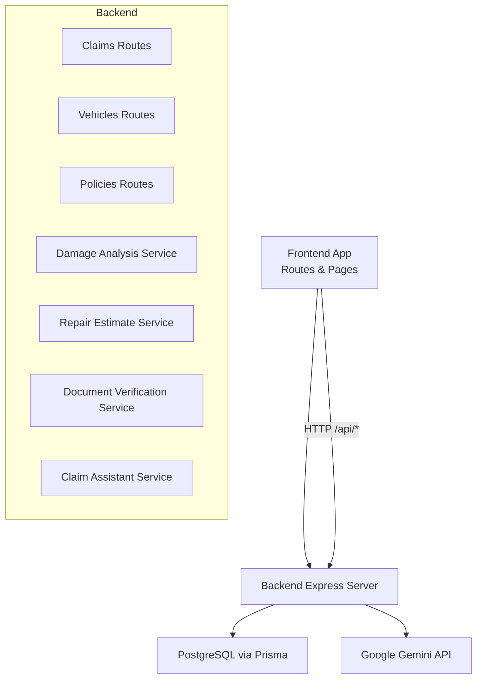

**Diagram sources**
- [index.ts:13-44](file://backend/src/index.ts#L13-L44)
- [claims.ts:13-15](file://backend/src/routes/claims.ts#L13-L15)
- [vehicles.ts:6-9](file://backend/src/routes/vehicles.ts#L6-L9)
- [policies.ts:6-8](file://backend/src/routes/policies.ts#L6-L8)
- [damageAnalysisService.ts:1-5](file://backend/src/services/damageAnalysisService.ts#L1-L5)
- [repairEstimateService.ts:1-2](file://backend/src/services/repairEstimateService.ts#L1-L2)
- [documentVerificationService.ts:1-5](file://backend/src/services/documentVerificationService.ts#L1-L5)
- [claimAssistantService.ts:1-2](file://backend/src/services/claimAssistantService.ts#L1-L2)
- [gemini.ts:1-10](file://backend/src/utils/gemini.ts#L1-L10)
- [schema.prisma:5-8](file://backend/prisma/schema.prisma#L5-L8)

**Section sources**
- [index.ts:13-44](file://backend/src/index.ts#L13-L44)
- [App.tsx:15-35](file://frontend/src/App.tsx#L15-L35)

## Core Components
- Claims lifecycle: draft creation, image upload, submission, AI damage analysis, estimate generation, and payout calculation.
- Vehicles: profile creation with optional VIN and photos; listing and details.
- Policies: create/read/update/delete insurance policies linked to users and claims.
- AI services: damage analysis, document verification, and chat assistant powered by Google Gemini.
- Data layer: Prisma schema defines Users, Vehicles, InsurancePolicy, Claim, images, assessments, estimates, payouts, documents, and chat messages.

**Section sources**
- [schema.prisma:10-201](file://backend/prisma/schema.prisma#L10-L201)
- [claims.ts:20-447](file://backend/src/routes/claims.ts#L20-L447)
- [vehicles.ts:13-147](file://backend/src/routes/vehicles.ts#L13-L147)
- [policies.ts:12-131](file://backend/src/routes/policies.ts#L12-L131)

## Architecture Overview
High-level flow:
- Frontend pages call backend REST endpoints under /api.
- Routes enforce authentication and delegate to services.
- Services interact with Prisma (PostgreSQL) and Google Gemini for AI tasks.
- Uploaded files are served statically from an uploads directory.

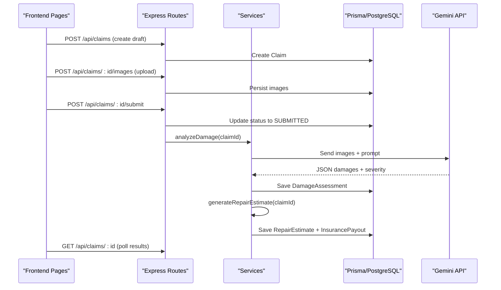

**Diagram sources**
- [claims.ts:20-193](file://backend/src/routes/claims.ts#L20-L193)
- [damageAnalysisService.ts:50-152](file://backend/src/services/damageAnalysisService.ts#L50-L152)
- [repairEstimateService.ts:104-199](file://backend/src/services/repairEstimateService.ts#L104-L199)
- [index.ts:24-32](file://backend/src/index.ts#L24-L32)

## Detailed Component Analysis

### Claim Processing Workflow
- Draft creation: validates required fields, links vehicle and optional policy, persists claim.
- Image upload: supports multiple images with type labels (full vehicle or close-up).
- Submission: transitions claim to SUBMITTED and triggers background AI damage analysis.
- Manual re-analysis: endpoint to run AI analysis on demand.
- Estimate generation: requires prior damage assessment; computes parts/labor costs and estimated days.
- Payout calculation: applies deductible to total cost when a policy is linked.

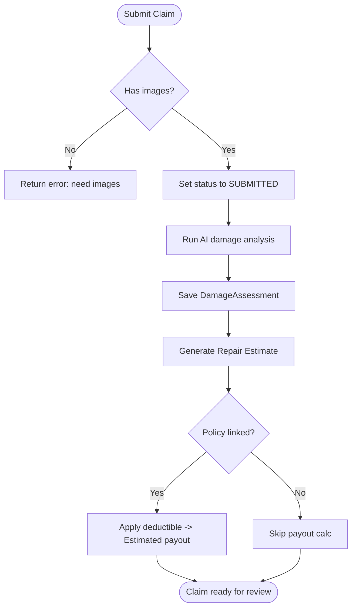

**Diagram sources**
- [claims.ts:152-193](file://backend/src/routes/claims.ts#L152-L193)
- [claims.ts:270-314](file://backend/src/routes/claims.ts#L270-L314)
- [damageAnalysisService.ts:50-152](file://backend/src/services/damageAnalysisService.ts#L50-L152)
- [repairEstimateService.ts:104-199](file://backend/src/services/repairEstimateService.ts#L104-L199)

**Section sources**
- [claims.ts:20-193](file://backend/src/routes/claims.ts#L20-L193)
- [claims.ts:270-314](file://backend/src/routes/claims.ts#L270-L314)
- [damageAnalysisService.ts:50-152](file://backend/src/services/damageAnalysisService.ts#L50-L152)
- [repairEstimateService.ts:104-199](file://backend/src/services/repairEstimateService.ts#L104-L199)

### Vehicle Management
- Create vehicle profiles with make, model, year, license plate, color, optional VIN and mileage.
- List and view vehicles with claim counts and history.
- Update and delete vehicles.

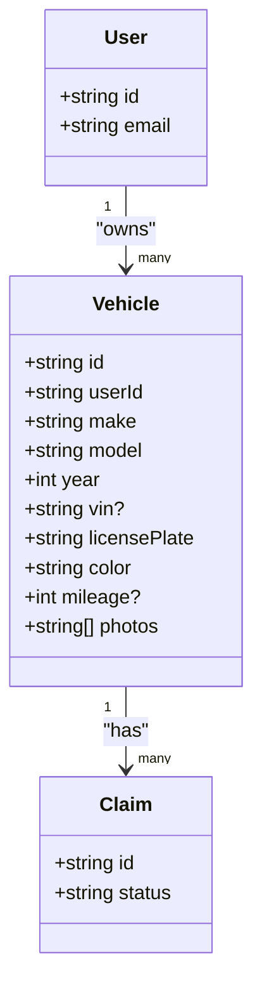

**Diagram sources**
- [schema.prisma:10-42](file://backend/prisma/schema.prisma#L10-L42)

**Section sources**
- [vehicles.ts:13-147](file://backend/src/routes/vehicles.ts#L13-L147)
- [schema.prisma:26-42](file://backend/prisma/schema.prisma#L26-L42)

### Policy Management
- Create, read, update, delete insurance policies per user.
- Link policies to claims to enable payout calculations.

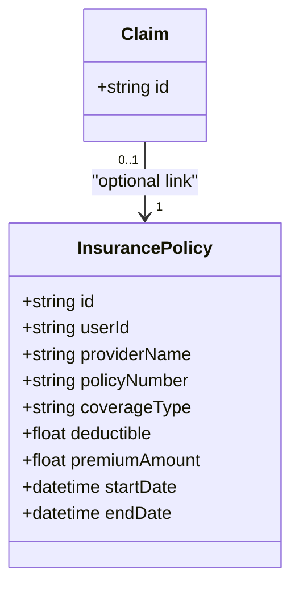

**Diagram sources**
- [schema.prisma:44-59](file://backend/prisma/schema.prisma#L44-L59)

**Section sources**
- [policies.ts:12-131](file://backend/src/routes/policies.ts#L12-L131)
- [schema.prisma:44-59](file://backend/prisma/schema.prisma#L44-L59)

### AI-Powered Damage Assessment (Google Gemini)
- Reads all images for a claim, builds a structured prompt with vehicle context, sends images to Gemini, parses JSON response, saves assessment, annotates images, and auto-generates repair estimate.

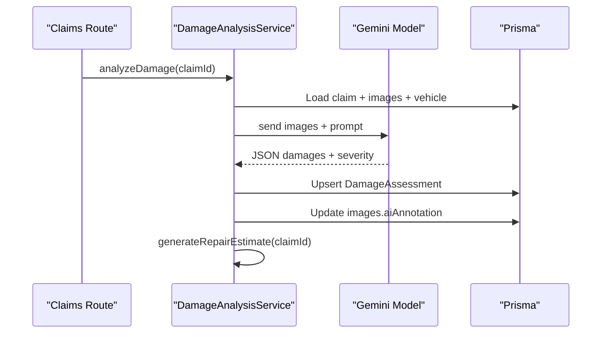

**Diagram sources**
- [damageAnalysisService.ts:50-152](file://backend/src/services/damageAnalysisService.ts#L50-L152)
- [gemini.ts:1-10](file://backend/src/utils/gemini.ts#L1-L10)
- [claims.ts:270-288](file://backend/src/routes/claims.ts#L270-L288)

**Section sources**
- [damageAnalysisService.ts:50-152](file://backend/src/services/damageAnalysisService.ts#L50-L152)
- [gemini.ts:1-10](file://backend/src/utils/gemini.ts#L1-L10)

### Document Verification
- Upload documents (license, registration, accident report, repair estimate).
- Verify via Gemini: readability, type identification, key info extraction, issues detection.
- Persist verification status and result.

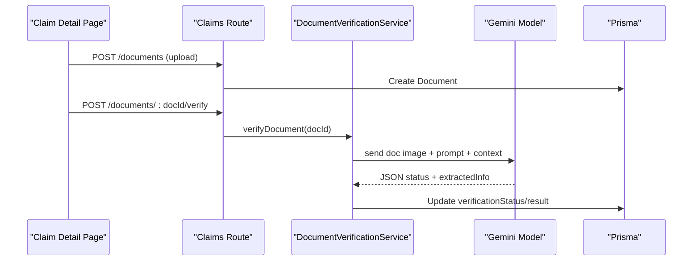

**Diagram sources**
- [claims.ts:316-397](file://backend/src/routes/claims.ts#L316-L397)
- [documentVerificationService.ts:41-107](file://backend/src/services/documentVerificationService.ts#L41-L107)

**Section sources**
- [claims.ts:316-397](file://backend/src/routes/claims.ts#L316-L397)
- [documentVerificationService.ts:41-107](file://backend/src/services/documentVerificationService.ts#L41-L107)

### Repair Cost Estimation and Payout Calculation
- Estimates itemized costs based on damage types and severity using internal lookup tables and labor rates.
- Computes total parts, labor, paint materials, and estimated repair days.
- If a policy is linked, calculates covered amount and estimated payout after applying deductible.

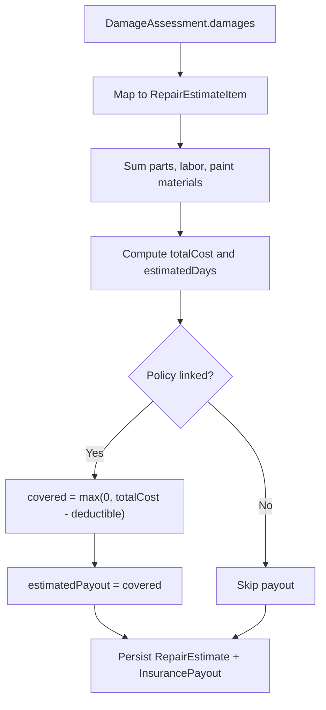

**Diagram sources**
- [repairEstimateService.ts:4-58](file://backend/src/services/repairEstimateService.ts#L4-L58)
- [repairEstimateService.ts:74-102](file://backend/src/services/repairEstimateService.ts#L74-L102)
- [repairEstimateService.ts:104-199](file://backend/src/services/repairEstimateService.ts#L104-L199)

**Section sources**
- [repairEstimateService.ts:4-58](file://backend/src/services/repairEstimateService.ts#L4-L58)
- [repairEstimateService.ts:74-102](file://backend/src/services/repairEstimateService.ts#L74-L102)
- [repairEstimateService.ts:104-199](file://backend/src/services/repairEstimateService.ts#L104-L199)

### Chat Assistant
- Context-aware assistant that reads claim state, vehicle, policy, assessment, estimate, payout, and documents to answer questions and guide users.
- Persists conversation history per claim.

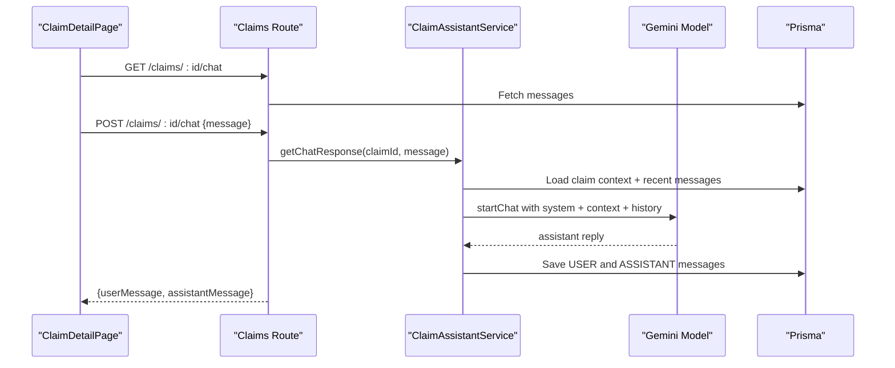

**Diagram sources**
- [claims.ts:399-447](file://backend/src/routes/claims.ts#L399-L447)
- [claimAssistantService.ts:19-130](file://backend/src/services/claimAssistantService.ts#L19-L130)

**Section sources**
- [claims.ts:399-447](file://backend/src/routes/claims.ts#L399-L447)
- [claimAssistantService.ts:19-130](file://backend/src/services/claimAssistantService.ts#L19-L130)

### User Interface Walkthroughs
- New Claim:
  - Step 1: Select vehicle, optional policy, incident date/location/description, weather, police report flag.
  - Step 2: Drag-and-drop full vehicle photos.
  - Step 3: Drag-and-drop damage close-up photos.
  - Step 4: Review and submit; backend sets status to SUBMITTED and runs AI analysis in background.
- Claim Detail:
  - View images, trigger AI analysis, see damage assessment and severity, view repair estimate and payout if available.
  - Upload documents and verify them; use chat assistant for guidance.
- Vehicles:
  - Add vehicle with basic details and optional VIN/mileage/photos; view details and claim history.

**Section sources**
- [NewClaimPage.tsx:1-252](file://frontend/src/pages/NewClaimPage.tsx#L1-L252)
- [ClaimDetailPage.tsx:1-290](file://frontend/src/pages/ClaimDetailPage.tsx#L1-L290)
- [VehiclesPage.tsx:1-169](file://frontend/src/pages/VehiclesPage.tsx#L1-L169)

### Integration Examples
- Create a claim:
  - POST /api/claims with vehicleId, incidentDate, incidentLocation, incidentDescription, optional policyId, weatherConditions, hasPoliceReport.
- Upload images:
  - POST /api/claims/:id/images with multipart form field images and imageType (FULL_VEHICLE or DAMAGE_CLOSEUP).
- Submit claim:
  - POST /api/claims/:id/submit to transition to SUBMITTED and trigger background analysis.
- Trigger analysis:
  - POST /api/claims/:id/analyze to run AI damage assessment immediately.
- Generate estimate:
  - POST /api/claims/:id/estimate to compute repair estimate and payout if policy is linked.
- Upload and verify documents:
  - POST /api/claims/:id/documents with document and documentType.
  - POST /api/claims/:id/documents/:docId/verify to run verification.
- Chat:
  - GET /api/claims/:id/chat to load messages.
  - POST /api/claims/:id/chat with message to send and receive assistant responses.

**Section sources**
- [claims.ts:20-447](file://backend/src/routes/claims.ts#L20-L447)
- [api.ts:1-33](file://frontend/src/services/api.ts#L1-L33)

## Dependency Analysis
- Routes depend on middleware (auth), Prisma client, and services.
- Services depend on Prisma and Gemini utilities.
- Frontend depends on axios-based api client which injects auth tokens and handles 401 redirects.

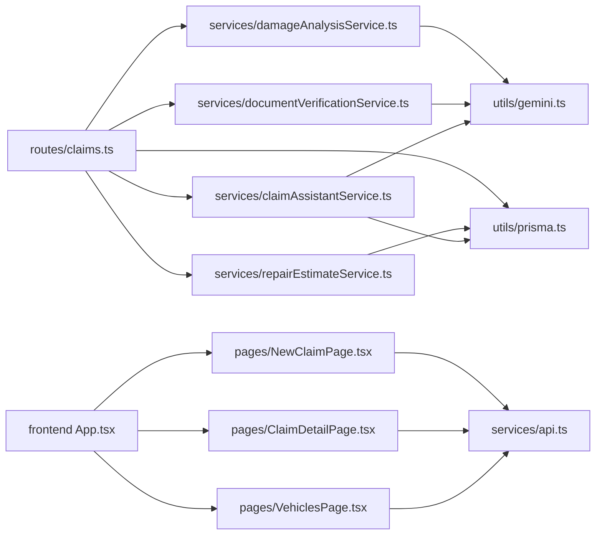

**Diagram sources**
- [claims.ts:1-15](file://backend/src/routes/claims.ts#L1-L15)
- [damageAnalysisService.ts:1-5](file://backend/src/services/damageAnalysisService.ts#L1-L5)
- [repairEstimateService.ts:1-2](file://backend/src/services/repairEstimateService.ts#L1-L2)
- [documentVerificationService.ts:1-5](file://backend/src/services/documentVerificationService.ts#L1-L5)
- [claimAssistantService.ts:1-2](file://backend/src/services/claimAssistantService.ts#L1-L2)
- [gemini.ts:1-10](file://backend/src/utils/gemini.ts#L1-L10)
- [App.tsx:15-35](file://frontend/src/App.tsx#L15-L35)
- [api.ts:1-33](file://frontend/src/services/api.ts#L1-L33)

**Section sources**
- [claims.ts:1-15](file://backend/src/routes/claims.ts#L1-L15)
- [App.tsx:15-35](file://frontend/src/App.tsx#L15-L35)
- [api.ts:1-33](file://frontend/src/services/api.ts#L1-L33)

## Performance Considerations
- Background processing: Damage analysis is triggered asynchronously upon claim submission to avoid blocking the request.
- Batch operations: Image uploads use array handling to minimize round trips.
- Efficient queries: Routes include only necessary relations and counts to reduce payload size.
- Static file serving: Uploaded assets are served directly via static middleware to reduce server load.

[No sources needed since this section provides general guidance]

## Troubleshooting Guide
- No images to analyze: Ensure at least one image is uploaded before submitting or analyzing.
- Missing damage assessment: Estimate generation requires a completed damage assessment; run analysis first.
- Invalid document type: Only LICENSE, REGISTRATION, ACCIDENT_REPORT, REPAIR_ESTIMATE are accepted.
- File not found on disk: Verify upload paths and ensure files exist before verification or deletion.
- Authentication failures: Frontend clears token and redirects on 401; ensure valid token is present.

**Section sources**
- [damageAnalysisService.ts:56-62](file://backend/src/services/damageAnalysisService.ts#L56-L62)
- [claims.ts:170-173](file://backend/src/routes/claims.ts#L170-L173)
- [claims.ts:333-337](file://backend/src/routes/claims.ts#L333-L337)
- [documentVerificationService.ts:51-55](file://backend/src/services/documentVerificationService.ts#L51-L55)
- [api.ts:19-30](file://frontend/src/services/api.ts#L19-L30)

## Conclusion
The Smart Vehicle Insurance Claim System automates and streamlines the claim process through robust workflows, AI-driven analysis, and clear user interfaces. It integrates vehicle and policy management with intelligent damage assessment, document verification, and transparent cost estimation and payout calculation, while providing a helpful chat assistant throughout the journey.

[No sources needed since this section summarizes without analyzing specific files]

## Appendices

### Data Models Overview
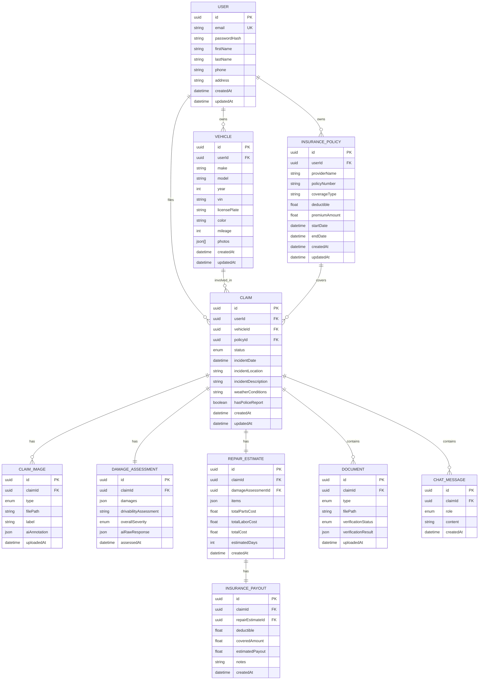

**Diagram sources**
- [schema.prisma:10-201](file://backend/prisma/schema.prisma#L10-L201)