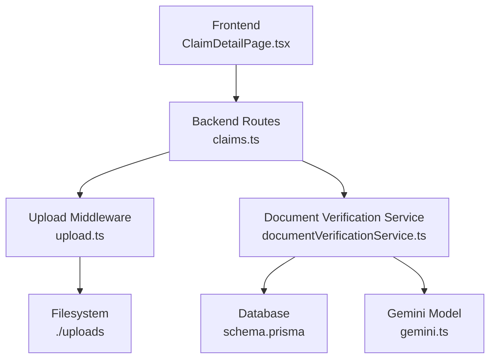
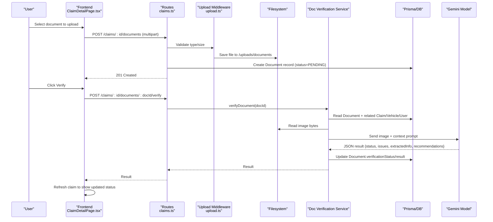
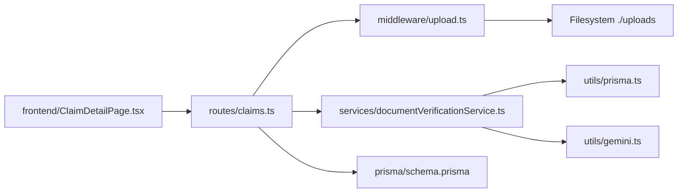

# Document Verification

<cite>
**Referenced Files in This Document**
- [documentVerificationService.ts](file://backend/src/services/documentVerificationService.ts)
- [upload.ts](file://backend/src/middleware/upload.ts)
- [claims.ts](file://backend/src/routes/claims.ts)
- [schema.prisma](file://backend/prisma/schema.prisma)
- [index.ts (types)](file://backend/src/types/index.ts)
- [gemini.ts](file://backend/src/utils/gemini.ts)
- [ClaimDetailPage.tsx](file://frontend/src/pages/ClaimDetailPage.tsx)
- [api.ts](file://frontend/src/services/api.ts)
</cite>

## Table of Contents
1. [Introduction](#introduction)
2. [Project Structure](#project-structure)
3. [Core Components](#core-components)
4. [Architecture Overview](#architecture-overview)
5. [Detailed Component Analysis](#detailed-component-analysis)
6. [Dependency Analysis](#dependency-analysis)
7. [Performance Considerations](#performance-considerations)
8. [Troubleshooting Guide](#troubleshooting-guide)
9. [Conclusion](#conclusion)
10. [Appendices](#appendices)

## Introduction
This document explains the automated document verification system for insurance claims, covering supported document types, format and size requirements, AI-powered authenticity checks, secure storage, status tracking, manual review workflow, frontend upload interfaces, API specifications, and security considerations.

The system supports uploading documents such as driver’s licenses, vehicle registrations, accident reports, and repair estimates. Uploaded files are stored securely on disk with access controls enforced by authentication middleware. An AI-powered analysis step validates readability, completeness, and potential issues, then updates the document’s verification status for display in the UI.

## Project Structure
The document verification feature spans backend routes, services, middleware, database schema, and frontend pages:

- Backend routes handle uploads, listing, and verification requests.
- A service orchestrates AI-based verification using a generative model.
- Middleware configures file storage, allowed types, and size limits.
- The database schema defines document entities and verification statuses.
- Frontend provides upload UI, progress indicators, and status displays.

**Diagram sources**
- [claims.ts:316-397](file://backend/src/routes/claims.ts#L316-L397)
- [upload.ts:17-53](file://backend/src/middleware/upload.ts#L17-L53)
- [documentVerificationService.ts:41-106](file://backend/src/services/documentVerificationService.ts#L41-L106)
- [schema.prisma:161-185](file://backend/prisma/schema.prisma#L161-L185)
- [gemini.ts:6-10](file://backend/src/utils/gemini.ts#L6-L10)
- [ClaimDetailPage.tsx:36-55](file://frontend/src/pages/ClaimDetailPage.tsx#L36-L55)

**Section sources**
- [claims.ts:316-397](file://backend/src/routes/claims.ts#L316-L397)
- [upload.ts:1-53](file://backend/src/middleware/upload.ts#L1-L53)
- [documentVerificationService.ts:1-107](file://backend/src/services/documentVerificationService.ts#L1-L107)
- [schema.prisma:161-185](file://backend/prisma/schema.prisma#L161-L185)
- [gemini.ts:1-13](file://backend/src/utils/gemini.ts#L1-L13)
- [ClaimDetailPage.tsx:1-290](file://frontend/src/pages/ClaimDetailPage.tsx#L1-L290)

## Core Components
- Upload middleware: Validates file type and size, stores files under /uploads/images or /uploads/documents with unique filenames.
- Claims routes: Provide endpoints to upload documents, list them, and trigger verification per document.
- Document verification service: Reads the stored file, sends it to an AI model with a structured prompt, parses results, and persists verification status and details.
- Database schema: Defines Document entity with fields for type, path, verification status, and result payload; enumerations for document types and verification statuses.
- Frontend: Displays document sections per type, allows uploads, shows verification status badges, and triggers verification.

Key behaviors:
- Supported document types: LICENSE, REGISTRATION, ACCIDENT_REPORT, REPAIR_ESTIMATE.
- Allowed formats: JPEG, PNG, WebP, JPG.
- Size limit: 10 MB per file.
- Verification statuses: PENDING, VERIFIED, ISSUES_FOUND, UNREADABLE.

**Section sources**
- [upload.ts:30-53](file://backend/src/middleware/upload.ts#L30-L53)
- [claims.ts:316-397](file://backend/src/routes/claims.ts#L316-L397)
- [documentVerificationService.ts:41-106](file://backend/src/services/documentVerificationService.ts#L41-L106)
- [schema.prisma:161-185](file://backend/prisma/schema.prisma#L161-L185)
- [ClaimDetailPage.tsx:207-245](file://frontend/src/pages/ClaimDetailPage.tsx#L207-L245)

## Architecture Overview
The end-to-end flow for document verification:

**Diagram sources**
- [claims.ts:316-397](file://backend/src/routes/claims.ts#L316-L397)
- [upload.ts:17-53](file://backend/src/middleware/upload.ts#L17-L53)
- [documentVerificationService.ts:41-106](file://backend/src/services/documentVerificationService.ts#L41-L106)
- [schema.prisma:161-185](file://backend/prisma/schema.prisma#L161-L185)
- [gemini.ts:6-10](file://backend/src/utils/gemini.ts#L6-L10)
- [ClaimDetailPage.tsx:36-55](file://frontend/src/pages/ClaimDetailPage.tsx#L36-L55)

## Detailed Component Analysis

### Upload Middleware
- Ensures directories exist for images and documents.
- Stores files with UUID-based names to avoid collisions.
- Accepts only image MIME types: JPEG, PNG, WebP, JPG.
- Enforces a 10 MB file size limit.
- Separates uploads into /uploads/images vs /uploads/documents based on field name.

Security notes:
- File type is validated via MIME type filtering.
- No executable or non-image content is accepted.
- File size limits protect against resource exhaustion.

**Section sources**
- [upload.ts:6-15](file://backend/src/middleware/upload.ts#L6-L15)
- [upload.ts:17-28](file://backend/src/middleware/upload.ts#L17-L28)
- [upload.ts:30-53](file://backend/src/middleware/upload.ts#L30-L53)

### Claims Routes (Documents)
- POST /api/claims/:id/documents
  - Requires authenticated user.
  - Validates document type against allowed enum values.
  - Saves file via upload middleware and creates a Document record with status PENDING.
- GET /api/claims/:id/documents
  - Returns all documents for the authenticated user’s claim.
- POST /api/claims/:id/documents/:docId/verify
  - Triggers AI verification for a specific document.

Error handling:
- Returns 404 if claim or document not found.
- Returns 400 for invalid document type or missing file.
- Returns 500 on unexpected errors.

**Section sources**
- [claims.ts:316-353](file://backend/src/routes/claims.ts#L316-L353)
- [claims.ts:355-377](file://backend/src/routes/claims.ts#L355-L377)
- [claims.ts:379-397](file://backend/src/routes/claims.ts#L379-L397)

### Document Verification Service
Responsibilities:
- Retrieve document and associated claim context (vehicle, user).
- Read the stored image from disk.
- Build a context string including document type and claim details.
- Call the Gemini model with a strict JSON response prompt.
- Parse the model’s JSON output robustly (handles markdown-wrapped JSON).
- Persist verification status and result back to the Document record.

Supported checks (as defined by the prompt):
- Readability and legibility.
- Document type identification.
- Presence of key information depending on document type:
  - Driver’s License: name, DOB, license number, expiration, photo.
  - Vehicle Registration: make/model/year, VIN, owner name, registration date, expiration.
  - Accident Report: date, location, parties, description, officer info.
  - Repair Estimate: shop name, itemized parts/labor, total cost, vehicle info, date.
- Potential issues: blur/darkness, expired documents, missing info, tampering signs, inconsistencies.

Output structure:
- status: VERIFIED | ISSUES_FOUND | UNREADABLE
- issues: array of strings describing problems
- extractedInfo: key-value pairs of extracted data
- recommendations: guidance for re-upload or corrections

Fallback behavior:
- If parsing fails, defaults to UNREADABLE with a message prompting manual review and clearer re-upload.

**Section sources**
- [documentVerificationService.ts:7-39](file://backend/src/services/documentVerificationService.ts#L7-L39)
- [documentVerificationService.ts:41-106](file://backend/src/services/documentVerificationService.ts#L41-L106)

### Database Schema (Documents and Statuses)
- DocumentType enum: LICENSE, REGISTRATION, ACCIDENT_REPORT, REPAIR_ESTIMATE.
- VerificationStatus enum: PENDING, VERIFIED, ISSUES_FOUND, UNREADABLE.
- Document model includes:
  - id, claimId, type, filePath, verificationStatus, verificationResult (JSON), uploadedAt.
  - Relation to Claim.

This schema drives validation and UI rendering of document states and metadata.

**Section sources**
- [schema.prisma:161-185](file://backend/prisma/schema.prisma#L161-L185)

### Frontend: Document Upload and Status Display
- Renders four document sections: LICENSE, REGISTRATION, ACCIDENT_REPORT, REPAIR_ESTIMATE.
- For each section:
  - Shows an upload control when no document exists.
  - Displays a thumbnail and current verification status badge.
  - Provides a “Verify” button when status is PENDING.
- On upload:
  - Creates FormData with document and documentType.
  - Posts to /api/claims/:id/documents.
  - Refreshes claim data to reflect new document and status.
- On verify:
  - Calls /api/claims/:id/documents/:docId/verify.
  - Refreshes claim data to update status and any issues.

Progress indicators:
- Disables upload controls during upload.
- Shows spinner-like feedback where applicable.

**Section sources**
- [ClaimDetailPage.tsx:36-55](file://frontend/src/pages/ClaimDetailPage.tsx#L36-L55)
- [ClaimDetailPage.tsx:207-245](file://frontend/src/pages/ClaimDetailPage.tsx#L207-L245)

### API Specifications

#### Upload Document
- Method: POST
- Path: /api/claims/:id/documents
- Headers: multipart/form-data
- Body:
  - document: file (image/jpeg, image/png, image/webp, image/jpg)
  - documentType: LICENSE | REGISTRATION | ACCIDENT_REPORT | REPAIR_ESTIMATE
- Success: 201 with created Document object
- Errors:
  - 400: Invalid document type or missing file
  - 404: Claim not found
  - 500: Server error

#### List Documents
- Method: GET
- Path: /api/claims/:id/documents
- Success: 200 with array of Document objects for the claim
- Errors:
  - 404: Claim not found
  - 500: Server error

#### Verify Document
- Method: POST
- Path: /api/claims/:id/documents/:docId/verify
- Success: 200 with verification result object:
  - status: VERIFIED | ISSUES_FOUND | UNREADABLE
  - issues: string[]
  - extractedInfo: Record<string,string>
  - recommendations: string[]
- Errors:
  - 404: Document not found
  - 500: Server error

Authentication:
- All endpoints are protected by auth middleware; requests must include a valid token.

**Section sources**
- [claims.ts:316-397](file://backend/src/routes/claims.ts#L316-L397)
- [api.ts:10-17](file://frontend/src/services/api.ts#L10-L17)

## Dependency Analysis
The following diagram shows how components depend on each other during document verification:

**Diagram sources**
- [claims.ts:316-397](file://backend/src/routes/claims.ts#L316-L397)
- [upload.ts:17-53](file://backend/src/middleware/upload.ts#L17-L53)
- [documentVerificationService.ts:41-106](file://backend/src/services/documentVerificationService.ts#L41-L106)
- [gemini.ts:6-10](file://backend/src/utils/gemini.ts#L6-L10)
- [schema.prisma:161-185](file://backend/prisma/schema.prisma#L161-L185)
- [ClaimDetailPage.tsx:36-55](file://frontend/src/pages/ClaimDetailPage.tsx#L36-L55)

**Section sources**
- [claims.ts:316-397](file://backend/src/routes/claims.ts#L316-L397)
- [documentVerificationService.ts:41-106](file://backend/src/services/documentVerificationService.ts#L41-L106)
- [upload.ts:17-53](file://backend/src/middleware/upload.ts#L17-L53)
- [gemini.ts:6-10](file://backend/src/utils/gemini.ts#L6-L10)
- [schema.prisma:161-185](file://backend/prisma/schema.prisma#L161-L185)
- [ClaimDetailPage.tsx:36-55](file://frontend/src/pages/ClaimDetailPage.tsx#L36-L55)

## Performance Considerations
- File size limit of 10 MB prevents large payloads that could degrade performance.
- AI verification involves reading the full image into memory and calling an external model; consider:
  - Caching repeated verifications for identical files.
  - Implementing rate limiting on verification calls.
  - Asynchronous processing queues for high-volume scenarios.
- Database queries fetch related claim, vehicle, and user data; ensure indexes on frequently filtered fields (e.g., claimId) to optimize lookups.

[No sources needed since this section provides general guidance]

## Troubleshooting Guide
Common issues and resolutions:

- Upload rejected due to unsupported format:
  - Ensure the file is JPEG, PNG, WebP, or JPG.
  - Check MIME type detection by the browser and server.
  - Reference: [upload.ts:30-41](file://backend/src/middleware/upload.ts#L30-L41)

- Upload exceeds size limit:
  - Reduce image resolution or compress before upload.
  - Reference: [upload.ts:43-53](file://backend/src/middleware/upload.ts#L43-L53)

- Verification returns UNREADABLE:
  - Re-upload a clearer, well-lit image.
  - Ensure the entire document is visible and not cropped.
  - Reference: [documentVerificationService.ts:78-94](file://backend/src/services/documentVerificationService.ts#L78-L94)

- Verification fails to parse AI response:
  - Retry verification; transient model issues may resolve.
  - Review logs for malformed responses.
  - Reference: [documentVerificationService.ts:76-94](file://backend/src/services/documentVerificationService.ts#L76-L94)

- Document not found on disk during verification:
  - Confirm the file was successfully saved and path mapping is correct.
  - Reference: [documentVerificationService.ts:51-55](file://backend/src/services/documentVerificationService.ts#L51-L55)

- Authentication errors:
  - Ensure a valid token is attached to requests.
  - Reference: [api.ts:10-17](file://frontend/src/services/api.ts#L10-L17)

**Section sources**
- [upload.ts:30-53](file://backend/src/middleware/upload.ts#L30-L53)
- [documentVerificationService.ts:51-94](file://backend/src/services/documentVerificationService.ts#L51-L94)
- [api.ts:10-17](file://frontend/src/services/api.ts#L10-L17)

## Conclusion
The document verification system integrates secure uploads, AI-powered analysis, and clear status tracking to streamline insurance claim workflows. It enforces strict file constraints, uses a structured prompt to extract and validate critical document information, and exposes simple APIs for upload, listing, and verification. The frontend provides intuitive controls for users to upload documents and monitor verification outcomes. Future enhancements can include asynchronous processing, malware scanning, and expanded compliance features.

[No sources needed since this section summarizes without analyzing specific files]

## Appendices

### Supported Document Types and Checks
- LICENSE: Verifies name, DOB, license number, expiration, photo presence.
- REGISTRATION: Verifies vehicle details, VIN, owner name, registration dates.
- ACCIDENT_REPORT: Verifies incident details, parties, and officer information.
- REPAIR_ESTIMATE: Verifies shop details, itemized costs, totals, and vehicle info.

These checks are driven by the verification prompt used by the AI model.

**Section sources**
- [documentVerificationService.ts:7-39](file://backend/src/services/documentVerificationService.ts#L7-L39)

### Security Considerations
- File validation: Only image MIME types are accepted; size limited to 10 MB.
- Storage: Files are stored under a configurable directory with randomized filenames to prevent path traversal and enumeration.
- Access control: Endpoints require authentication via middleware; tokens are injected by the frontend client.
- Privacy: Sensitive documents are stored server-side; ensure environment variables and logs do not leak secrets or PII.
- Malware detection: Not implemented in code; recommend integrating antivirus scanning before serving or processing files.

**Section sources**
- [upload.ts:6-15](file://backend/src/middleware/upload.ts#L6-L15)
- [upload.ts:17-53](file://backend/src/middleware/upload.ts#L17-L53)
- [api.ts:10-17](file://frontend/src/services/api.ts#L10-L17)