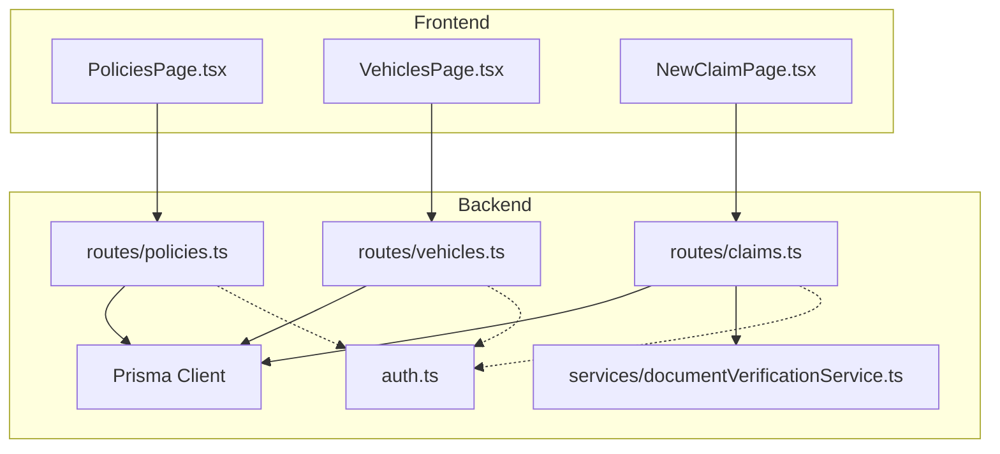
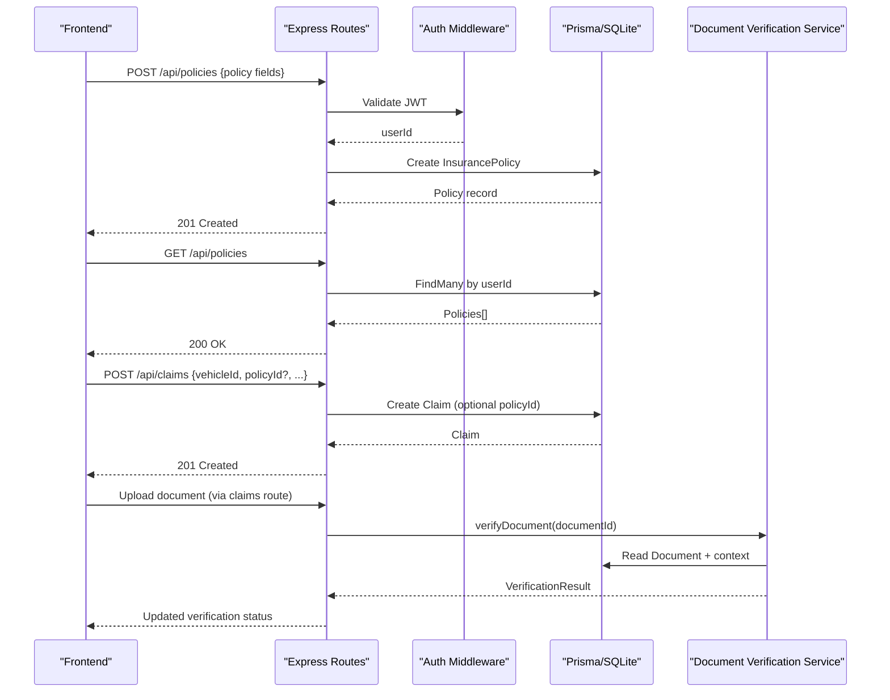
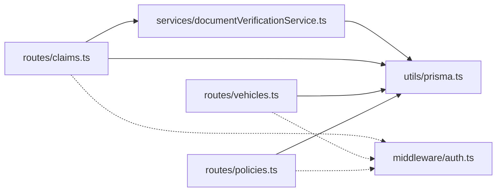
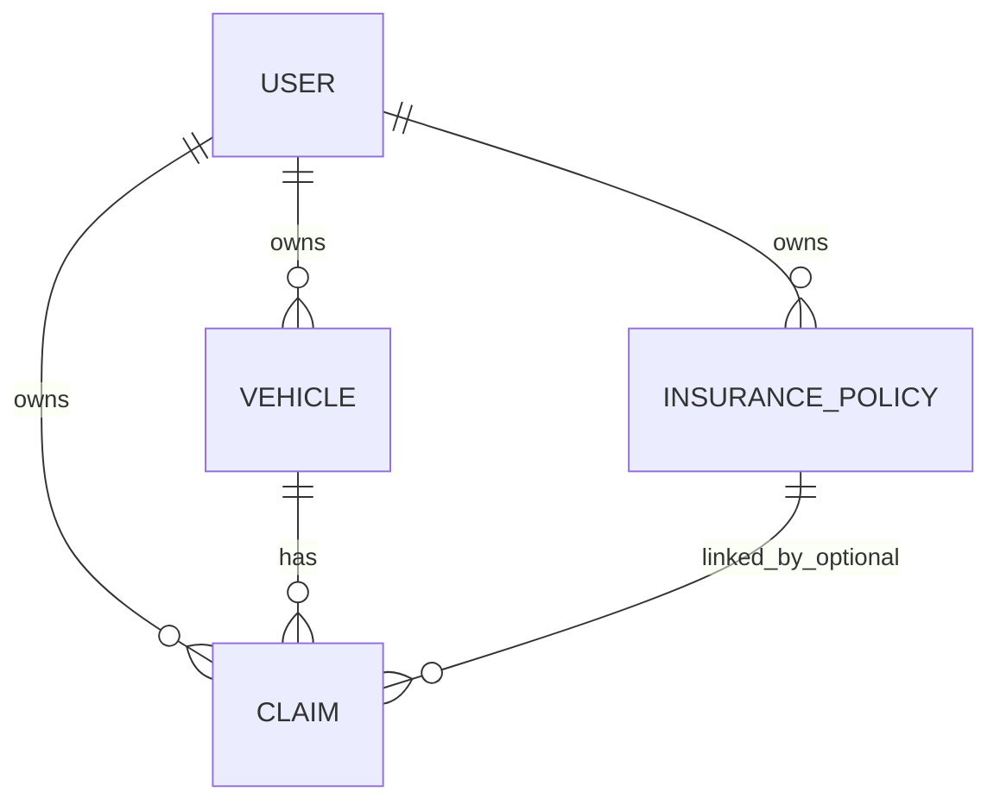
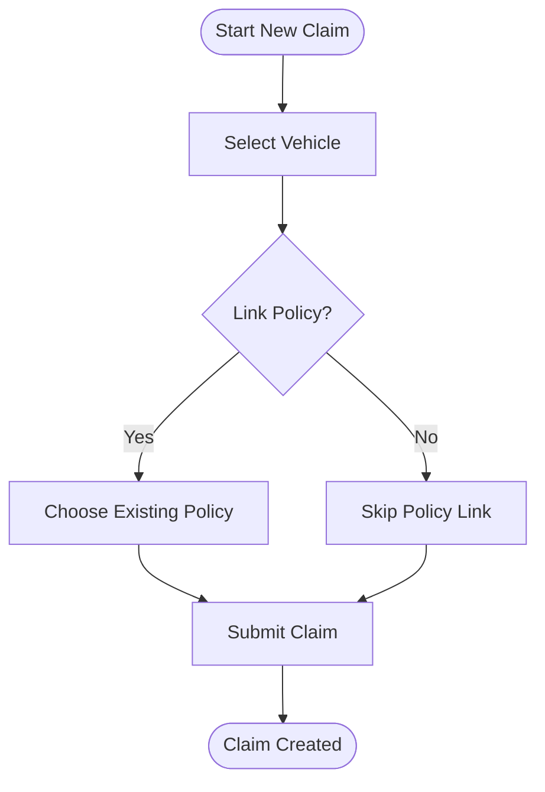

# Policy Management

<cite>
**Referenced Files in This Document**
- [schema.prisma](file://backend/prisma/schema.prisma)
- [policies.ts](file://backend/src/routes/policies.ts)
- [vehicles.ts](file://backend/src/routes/vehicles.ts)
- [claims.ts](file://backend/src/routes/claims.ts)
- [documentVerificationService.ts](file://backend/src/services/documentVerificationService.ts)
- [auth.ts](file://backend/src/middleware/auth.ts)
- [prisma.ts](file://backend/src/utils/prisma.ts)
- [types (backend)](file://backend/src/types/index.ts)
- [PoliciesPage.tsx](file://frontend/src/pages/PoliciesPage.tsx)
- [VehiclesPage.tsx](file://frontend/src/pages/VehiclesPage.tsx)
- [NewClaimPage.tsx](file://frontend/src/pages/NewClaimPage.tsx)
- [types (frontend)](file://frontend/src/types/index.ts)
</cite>

## Table of Contents
1. [Introduction](#introduction)
2. [Project Structure](#project-structure)
3. [Core Components](#core-components)
4. [Architecture Overview](#architecture-overview)
5. [Detailed Component Analysis](#detailed-component-analysis)
6. [Dependency Analysis](#dependency-analysis)
7. [Performance Considerations](#performance-considerations)
8. [Troubleshooting Guide](#troubleshooting-guide)
9. [Conclusion](#conclusion)
10. [Appendices](#appendices)

## Introduction
This document explains the insurance policy management system for vehicle claims, focusing on how policies are created, modified, and tracked; how vehicles integrate with policies; how documents are uploaded and verified; and what user interface components and APIs support these workflows. It also clarifies coverage types, deductibles, premium fields, and current limitations around status tracking, renewal notifications, and compliance features.

## Project Structure
The system is a full-stack application:
- Backend: Express + TypeScript with Prisma ORM over SQLite
- Frontend: React + TypeScript SPA
- Data model includes Users, Vehicles, Insurance Policies, Claims, Documents, and related entities

**Diagram sources**
- [policies.ts:1-131](file://backend/src/routes/policies.ts#L1-L131)
- [vehicles.ts:1-148](file://backend/src/routes/vehicles.ts#L1-L148)
- [claims.ts:1-73](file://backend/src/routes/claims.ts#L1-L73)
- [documentVerificationService.ts:1-107](file://backend/src/services/documentVerificationService.ts#L1-L107)
- [auth.ts:1-23](file://backend/src/middleware/auth.ts#L1-L23)

**Section sources**
- [schema.prisma:1-201](file://backend/prisma/schema.prisma#L1-L201)
- [policies.ts:1-131](file://backend/src/routes/policies.ts#L1-L131)
- [vehicles.ts:1-148](file://backend/src/routes/vehicles.ts#L1-L148)
- [claims.ts:1-73](file://backend/src/routes/claims.ts#L1-L73)

## Core Components
- Policy CRUD: Create, read, update, delete policies per authenticated user
- Vehicle CRUD: Register and manage vehicles per user
- Claim creation: Associate a claim to a vehicle and optionally link an existing policy
- Document verification: AI-assisted verification of uploaded documents tied to claims
- Authentication: JWT-based middleware protecting routes

Key data models:
- InsurancePolicy: providerName, policyNumber, coverageType, deductible, premiumAmount, startDate, endDate
- Vehicle: make, model, year, licensePlate, color, optional VIN and mileage
- Claim: links to vehicle and optional policyId; tracks incident details and status

**Section sources**
- [schema.prisma:44-59](file://backend/prisma/schema.prisma#L44-L59)
- [schema.prisma:26-42](file://backend/prisma/schema.prisma#L26-L42)
- [schema.prisma:70-93](file://backend/prisma/schema.prisma#L70-L93)
- [types (frontend):27-37](file://frontend/src/types/index.ts#L27-L37)
- [types (frontend):121-143](file://frontend/src/types/index.ts#L121-L143)

## Architecture Overview
The API layer enforces authentication and delegates persistence to Prisma. The frontend provides forms and lists for policies and vehicles, and a multi-step claim flow that can associate a policy.

**Diagram sources**
- [policies.ts:12-40](file://backend/src/routes/policies.ts#L12-L40)
- [policies.ts:42-55](file://backend/src/routes/policies.ts#L42-L55)
- [claims.ts:20-57](file://backend/src/routes/claims.ts#L20-L57)
- [documentVerificationService.ts:41-106](file://backend/src/services/documentVerificationService.ts#L41-L106)
- [auth.ts:5-22](file://backend/src/middleware/auth.ts#L5-L22)

## Detailed Component Analysis

### Policy Creation, Modification, and Deletion
- Create: Validates required fields, persists via Prisma, returns created policy
- Read: Lists all policies for the authenticated user, ordered by creation date
- Update: Partial updates allowed; validates existence before updating
- Delete: Removes policy if it belongs to the user

Validation rules enforced at the API level:
- All policy fields required on create
- Numeric fields parsed to floats
- Dates converted to Date objects

Coverage types supported by the UI dropdown include Comprehensive, Collision, Liability, Full Coverage. These are stored as strings in the database.

Deductible and premiumAmount are numeric fields used for policy metadata. There is no automated premium calculation logic in the backend.

Status tracking:
- No explicit status field exists on InsurancePolicy. Active/expired/cancelled states are not modeled or computed in the current codebase.

Renewal workflow:
- No renewal endpoints or automation exist. Policies are managed manually via CRUD operations.

**Section sources**
- [policies.ts:12-40](file://backend/src/routes/policies.ts#L12-L40)
- [policies.ts:76-108](file://backend/src/routes/policies.ts#L76-L108)
- [policies.ts:110-128](file://backend/src/routes/policies.ts#L110-L128)
- [schema.prisma:44-59](file://backend/prisma/schema.prisma#L44-L59)
- [PoliciesPage.tsx:50-69](file://frontend/src/pages/PoliciesPage.tsx#L50-L69)

### Vehicle-Policy Integration
- Vehicles are independent from policies in the data model. A claim can optionally reference a policyId.
- Automatic assignment: Not implemented. When creating a claim, users may select an existing policy from their list.
- Coverage validation: Not implemented. The system does not validate whether a selected policy covers the incident type or vehicle.

User flows:
- Vehicles page lists vehicles and allows adding new ones
- New claim form lets users pick a vehicle and optionally link a policy

**Section sources**
- [schema.prisma:26-42](file://backend/prisma/schema.prisma#L26-L42)
- [schema.prisma:70-93](file://backend/prisma/schema.prisma#L70-L93)
- [vehicles.ts:13-42](file://backend/src/routes/vehicles.ts#L13-L42)
- [claims.ts:20-57](file://backend/src/routes/claims.ts#L20-L57)
- [NewClaimPage.tsx:125-149](file://frontend/src/pages/NewClaimPage.tsx#L125-L149)
- [VehiclesPage.tsx:123-169](file://frontend/src/pages/VehiclesPage.tsx#L123-L169)

### Policy Document Upload and Verification
- Documents are associated with claims, not directly with policies.
- Uploads are handled through the claims route using upload middleware.
- Verification service reads the file, sends image content to an AI model with a structured prompt, parses JSON result, and updates verification status and results.

Verification outcomes:
- VERIFIED, ISSUES_FOUND, UNREADABLE
- Extracted info and recommendations are persisted alongside the document

Compliance note:
- The verification process uses external AI processing; ensure appropriate privacy and consent policies are in place for handling images and extracted data.

**Section sources**
- [documentVerificationService.ts:41-106](file://backend/src/services/documentVerificationService.ts#L41-L106)
- [schema.prisma:161-185](file://backend/prisma/schema.prisma#L161-L185)
- [types (backend):45-50](file://backend/src/types/index.ts#L45-L50)

### User Interface Components
- Policies page:
  - List view showing provider, policy number, coverage type, deductible, premium, and expiration date
  - Add policy form with required fields and coverage type selection
  - Delete policy action
- Vehicles page:
  - List view of vehicles with basic details and claim count
  - Detail view with vehicle attributes and claim history links
  - Add vehicle form with validation
- New claim flow:
  - Step-by-step form including vehicle selection and optional policy linking

These components call the corresponding backend endpoints and handle loading/error states.

**Section sources**
- [PoliciesPage.tsx:6-101](file://frontend/src/pages/PoliciesPage.tsx#L6-L101)
- [VehiclesPage.tsx:7-169](file://frontend/src/pages/VehiclesPage.tsx#L7-L169)
- [NewClaimPage.tsx:125-149](file://frontend/src/pages/NewClaimPage.tsx#L125-L149)

### API Specifications
Authentication:
- All protected routes require Bearer token via Authorization header
- Middleware decodes JWT and attaches userId to request

Policies:
- POST /api/policies: Create policy with required fields
- GET /api/policies: List user’s policies
- GET /api/policies/:id: Get single policy
- PUT /api/policies/:id: Update policy fields
- DELETE /api/policies/:id: Delete policy

Vehicles:
- POST /api/vehicles: Create vehicle with required fields
- GET /api/vehicles: List user’s vehicles
- GET /api/vehicles/:id: Get vehicle detail with claims summary
- PUT /api/vehicles/:id: Update vehicle fields
- DELETE /api/vehicles/:id: Delete vehicle

Claims (relevant to policy linkage):
- POST /api/claims: Create claim with vehicleId and optional policyId
- GET /api/claims: List claims with optional status filter

Error handling:
- Validation errors return 400 with error message
- Not found returns 404
- Server errors return 500 with generic error message

**Section sources**
- [auth.ts:5-22](file://backend/src/middleware/auth.ts#L5-L22)
- [policies.ts:12-128](file://backend/src/routes/policies.ts#L12-L128)
- [vehicles.ts:13-145](file://backend/src/routes/vehicles.ts#L13-L145)
- [claims.ts:20-73](file://backend/src/routes/claims.ts#L20-L73)

### Business Logic and Limitations
- Premium calculations: Not implemented; premiumAmount is stored as provided
- Status tracking: No active/expired/cancelled state on policies; only dates define validity
- Renewal reminders: Not implemented; no background jobs or notifications
- Compliance: Document verification uses external AI; ensure secure handling and user consent

[No sources needed since this section summarizes limitations without analyzing specific files]

## Dependency Analysis
The following diagram shows key dependencies between routes, services, and data access.

**Diagram sources**
- [policies.ts:1-131](file://backend/src/routes/policies.ts#L1-L131)
- [vehicles.ts:1-148](file://backend/src/routes/vehicles.ts#L1-L148)
- [claims.ts:1-73](file://backend/src/routes/claims.ts#L1-L73)
- [documentVerificationService.ts:1-107](file://backend/src/services/documentVerificationService.ts#L1-L107)
- [auth.ts:1-23](file://backend/src/middleware/auth.ts#L1-L23)
- [prisma.ts:1-6](file://backend/src/utils/prisma.ts#L1-L6)

**Section sources**
- [policies.ts:1-131](file://backend/src/routes/policies.ts#L1-L131)
- [vehicles.ts:1-148](file://backend/src/routes/vehicles.ts#L1-L148)
- [claims.ts:1-73](file://backend/src/routes/claims.ts#L1-L73)
- [documentVerificationService.ts:1-107](file://backend/src/services/documentVerificationService.ts#L1-L107)
- [auth.ts:1-23](file://backend/src/middleware/auth.ts#L1-L23)
- [prisma.ts:1-6](file://backend/src/utils/prisma.ts#L1-L6)

## Performance Considerations
- Database: SQLite is suitable for development; consider migration to a production-grade RDBMS for scale
- Queries: Current queries are simple and filtered by userId; add indexes on frequently queried fields like policyNumber and licensePlate if needed
- File I/O: Document verification reads files from disk; ensure efficient storage paths and caching strategies for large volumes
- AI calls: External model calls can be slow; implement retries, timeouts, and queueing for asynchronous verification

[No sources needed since this section provides general guidance]

## Troubleshooting Guide
Common issues and resolutions:
- 401 Unauthorized: Missing or invalid JWT token; ensure Authorization header is set correctly
- 400 Bad Request: Missing required fields in policy or vehicle creation; check payload completeness
- 404 Not Found: Policy, vehicle, or claim not found; verify IDs and ownership
- 500 Internal Server Error: Unexpected server-side failures; check logs for stack traces
- Document verification failures: If parsing fails, verification defaults to UNREADABLE; re-upload a clearer image

Operational tips:
- Validate inputs on both frontend and backend
- Log detailed errors during development; sanitize in production
- For document verification, confirm file paths exist and permissions are correct

**Section sources**
- [auth.ts:5-22](file://backend/src/middleware/auth.ts#L5-L22)
- [policies.ts:12-40](file://backend/src/routes/policies.ts#L12-L40)
- [vehicles.ts:13-42](file://backend/src/routes/vehicles.ts#L13-L42)
- [documentVerificationService.ts:78-94](file://backend/src/services/documentVerificationService.ts#L78-L94)

## Conclusion
The system provides robust CRUD for policies and vehicles, claim creation with optional policy linkage, and AI-assisted document verification. However, it currently lacks policy status modeling (active/expired/cancelled), premium calculation logic, renewal automation, and proactive notifications. Extending the data model and adding scheduled tasks would enable comprehensive policy lifecycle management and compliance reporting.

[No sources needed since this section summarizes without analyzing specific files]

## Appendices

### Data Model Relationships

**Diagram sources**
- [schema.prisma:10-24](file://backend/prisma/schema.prisma#L10-L24)
- [schema.prisma:26-42](file://backend/prisma/schema.prisma#L26-L42)
- [schema.prisma:44-59](file://backend/prisma/schema.prisma#L44-L59)
- [schema.prisma:70-93](file://backend/prisma/schema.prisma#L70-L93)

### Policy Form Fields and Validation
- Required fields: providerName, policyNumber, coverageType, deductible, premiumAmount, startDate, endDate
- Coverage types: Comprehensive, Collision, Liability, Full Coverage
- Deductible and premiumAmount: numeric values stored as floats
- Dates: stored as DateTime objects

**Section sources**
- [policies.ts:12-40](file://backend/src/routes/policies.ts#L12-L40)
- [PoliciesPage.tsx:50-69](file://frontend/src/pages/PoliciesPage.tsx#L50-L69)
- [schema.prisma:44-59](file://backend/prisma/schema.prisma#L44-L59)

### Claim-to-Policy Linkage Flow

**Diagram sources**
- [NewClaimPage.tsx:125-149](file://frontend/src/pages/NewClaimPage.tsx#L125-L149)
- [claims.ts:20-57](file://backend/src/routes/claims.ts#L20-L57)