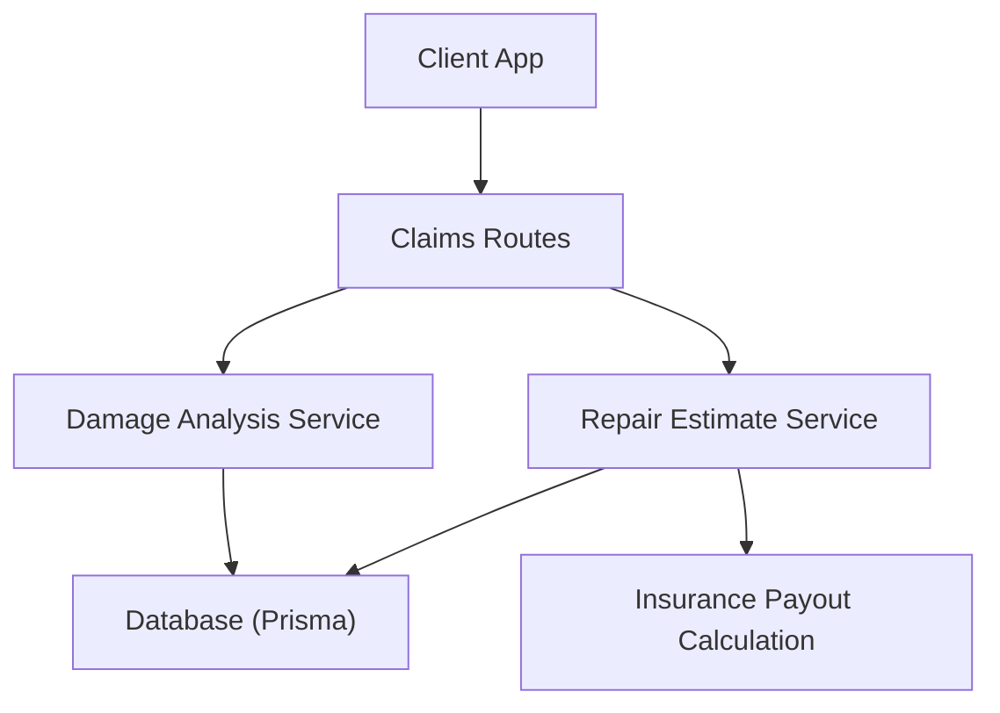
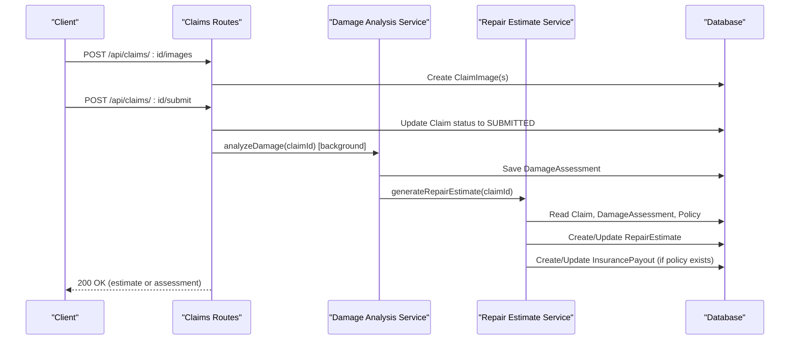
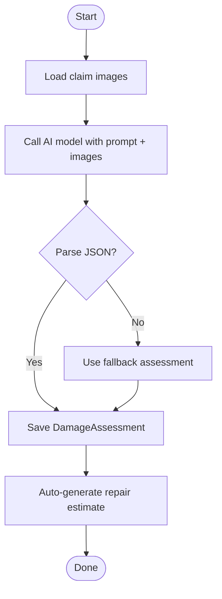
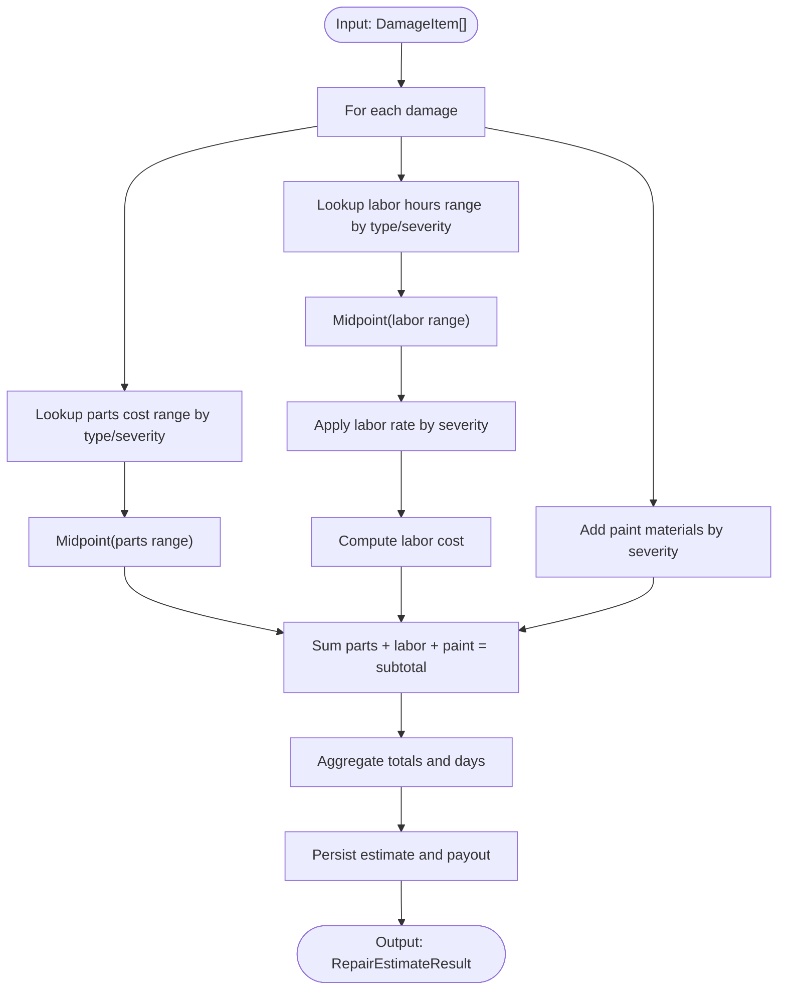
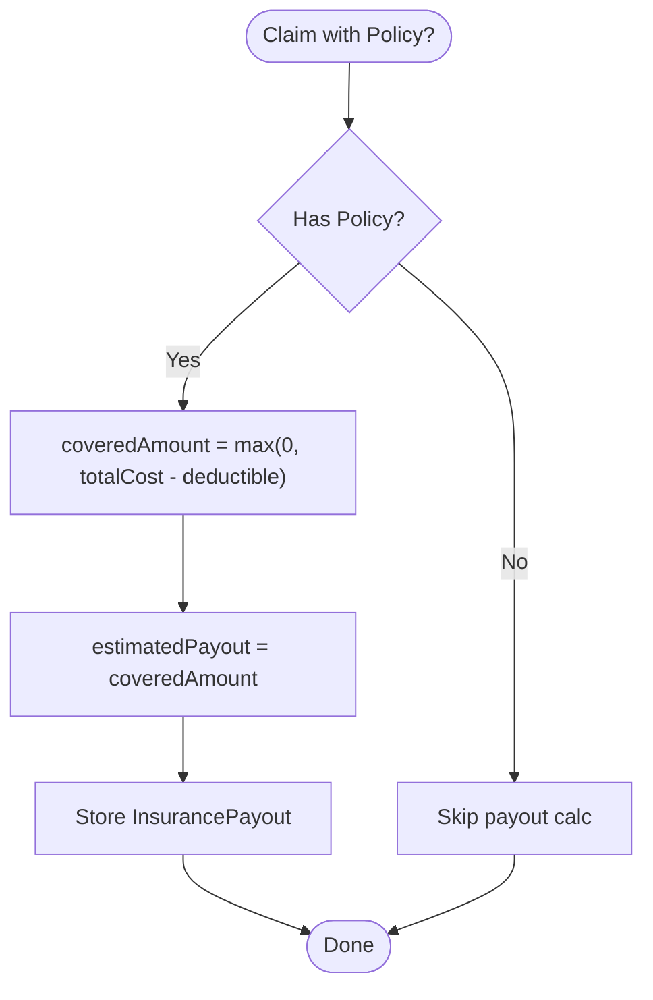
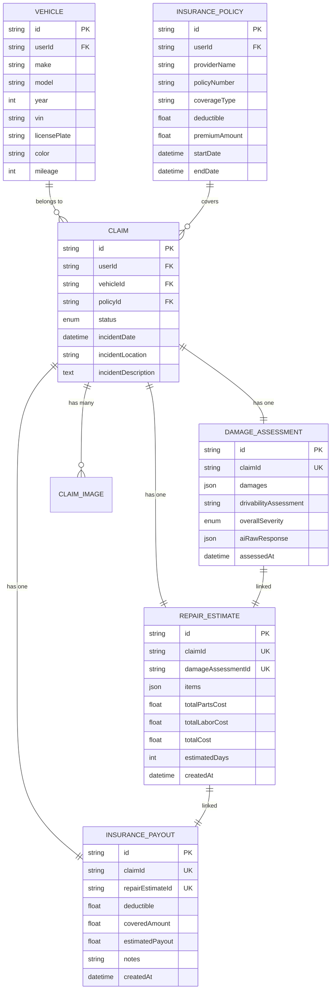
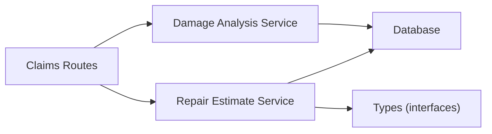

# Repair Cost Estimation

<cite>
**Referenced Files in This Document**
- [repairEstimateService.ts](file://backend/src/services/repairEstimateService.ts)
- [damageAnalysisService.ts](file://backend/src/services/damageAnalysisService.ts)
- [claims.ts](file://backend/src/routes/claims.ts)
- [schema.prisma](file://backend/prisma/schema.prisma)
- [index.ts (types)](file://backend/src/types/index.ts)
</cite>

## Table of Contents
1. Introduction
2. Project Structure
3. Core Components
4. Architecture Overview
5. Detailed Component Analysis
6. Dependency Analysis
7. Performance Considerations
8. Troubleshooting Guide
9. Conclusion
10. Appendices

## Introduction
This document explains the repair cost estimation system that converts AI-based damage assessment results into itemized repair estimates, calculates insurance payout implications, and persists all data for retrieval and updates. It covers the algorithmic approach to cost calculation, integration with damage analysis, estimate accuracy factors, regional pricing considerations, policy limit enforcement, approval workflow, manual adjustments, database schema, API endpoints, and relationships to claim payouts including deductibles and coverage limits.

## Project Structure
The repair estimation logic is implemented in the backend:
- Services: Damage analysis and repair estimate generation
- Routes: Claim lifecycle including image upload, damage analysis, and estimate generation
- Database: Prisma schema defines entities for claims, assessments, estimates, and payouts
- Types: Shared interfaces for damage items and estimate structures

**Diagram sources**
- [claims.ts:270-314](file://backend/src/routes/claims.ts#L270-L314)
- [damageAnalysisService.ts:50-153](file://backend/src/services/damageAnalysisService.ts#L50-L153)
- [repairEstimateService.ts:104-199](file://backend/src/services/repairEstimateService.ts#L104-L199)

**Section sources**
- [claims.ts:270-314](file://backend/src/routes/claims.ts#L270-L314)
- [damageAnalysisService.ts:50-153](file://backend/src/services/damageAnalysisService.ts#L50-L153)
- [repairEstimateService.ts:104-199](file://backend/src/services/repairEstimateService.ts#L104-L199)
- [schema.prisma:70-159](file://backend/prisma/schema.prisma#L70-L159)

## Core Components
- Damage Analysis Service: Analyzes uploaded images using an AI model, returns structured damage items with severity, location, description, and affected parts; saves assessment and auto-triggers estimate generation.
- Repair Estimate Service: Converts damage items into itemized costs (parts, labor, paint), aggregates totals, estimates repair days, persists estimates, and computes insurance payout when a policy is linked.
- Claims Routes: Expose endpoints to create/update claims, upload images/documents, trigger damage analysis, generate estimates, and retrieve full claim details including estimates and payouts.
- Database Schema: Defines entities for Claim, Vehicle, InsurancePolicy, DamageAssessment, RepairEstimate, InsurancePayout, and related associations.

**Section sources**
- [damageAnalysisService.ts:50-153](file://backend/src/services/damageAnalysisService.ts#L50-L153)
- [repairEstimateService.ts:104-199](file://backend/src/services/repairEstimateService.ts#L104-L199)
- [claims.ts:270-314](file://backend/src/routes/claims.ts#L270-L314)
- [schema.prisma:70-159](file://backend/prisma/schema.prisma#L70-L159)

## Architecture Overview
End-to-end flow from image upload to estimate and payout:

**Diagram sources**
- [claims.ts:195-193](file://backend/src/routes/claims.ts#L195-L193)
- [claims.ts:270-314](file://backend/src/routes/claims.ts#L270-L314)
- [damageAnalysisService.ts:50-153](file://backend/src/services/damageAnalysisService.ts#L50-L153)
- [repairEstimateService.ts:104-199](file://backend/src/services/repairEstimateService.ts#L104-L199)

## Detailed Component Analysis

### Damage Assessment to Estimate Integration
- The damage analysis service reads claim images, calls the AI model with a strict JSON prompt, parses the response, and persists the assessment. It then automatically invokes estimate generation for the same claim.
- If parsing fails, it stores a fallback result and still proceeds to ensure downstream processes can continue.

**Diagram sources**
- [damageAnalysisService.ts:50-153](file://backend/src/services/damageAnalysisService.ts#L50-L153)

**Section sources**
- [damageAnalysisService.ts:50-153](file://backend/src/services/damageAnalysisService.ts#L50-L153)

### Repair Cost Algorithm
The estimate service transforms each damage item into an itemized cost breakdown:
- Parts replacement cost: derived from a lookup table keyed by damage type and severity or specific part names (e.g., headlight, windshield).
- Labor cost: computed as labor hours multiplied by a severity-based labor rate.
- Paint materials: added per severity level.
- Subtotal per item: sum of parts, labor, and paint materials.
- Aggregates total parts cost, total labor cost (including paint), overall total cost, and estimated repair days based on total labor hours.

**Diagram sources**
- [repairEstimateService.ts:4-102](file://backend/src/services/repairEstimateService.ts#L4-L102)
- [repairEstimateService.ts:104-199](file://backend/src/services/repairEstimateService.ts#L104-L199)

**Section sources**
- [repairEstimateService.ts:4-102](file://backend/src/services/repairEstimateService.ts#L4-L102)
- [repairEstimateService.ts:104-199](file://backend/src/services/repairEstimateService.ts#L104-L199)

### Insurance Payout Calculation
When a policy is linked to the claim:
- Deductible is subtracted from the total repair cost to compute covered amount.
- Estimated payout equals the covered amount (non-negative).
- Results are persisted alongside the estimate.

**Diagram sources**
- [repairEstimateService.ts:158-189](file://backend/src/services/repairEstimateService.ts#L158-L189)

**Section sources**
- [repairEstimateService.ts:158-189](file://backend/src/services/repairEstimateService.ts#L158-L189)

### Data Models and Relationships
Key entities involved in estimation:
- Claim: Central record linking vehicle, policy, images, assessment, estimate, payout, documents, chat.
- DamageAssessment: Stores AI-detected damages, drivability assessment, overall severity, raw AI response.
- RepairEstimate: Itemized costs, totals, estimated days, linked to claim and assessment.
- InsurancePayout: Deductible, covered amount, estimated payout, notes, linked to claim and estimate.

**Diagram sources**
- [schema.prisma:70-159](file://backend/prisma/schema.prisma#L70-L159)

**Section sources**
- [schema.prisma:70-159](file://backend/prisma/schema.prisma#L70-L159)

### API Endpoints for Estimates
- POST /api/claims/:id/analyze
  - Purpose: Trigger AI damage analysis for a claim’s images.
  - Behavior: Validates claim ownership, runs analysis, persists assessment, auto-generates estimate if successful.
  - Response: Damage analysis result.

- POST /api/claims/:id/estimate
  - Purpose: Generate or update repair estimate for a claim.
  - Behavior: Requires prior damage assessment; computes itemized costs and totals; persists estimate and payout if applicable.
  - Response: Estimate result with items, totals, and estimated days.

- GET /api/claims/:id
  - Purpose: Retrieve full claim details including associated estimate and payout.
  - Behavior: Includes related entities such as vehicle, policy, images, assessment, estimate, payout, documents, and chat messages.
  - Response: Complete claim object.

Notes:
- All routes are protected by authentication middleware.
- Error handling returns appropriate status codes and error messages.

**Section sources**
- [claims.ts:270-314](file://backend/src/routes/claims.ts#L270-L314)
- [claims.ts:85-112](file://backend/src/routes/claims.ts#L85-L112)

### Estimate Accuracy Factors
- Severity classification: MINOR, MODERATE, SEVERE drives labor rates, paint material costs, and parts/labor ranges.
- Damage type specificity: Certain types have specialized parts mappings (e.g., glass, headlight, taillight, windshield).
- Affected parts list: Used to name parts and may influence selection within type-specific ranges.
- AI prompt constraints: Strict JSON output ensures consistent structure for downstream processing.
- Fallback behavior: Parsing failures produce a minimal assessment to keep workflows moving while flagging need for manual review.

**Section sources**
- [damageAnalysisService.ts:7-48](file://backend/src/services/damageAnalysisService.ts#L7-L48)
- [damageAnalysisService.ts:85-103](file://backend/src/services/damageAnalysisService.ts#L85-L103)
- [repairEstimateService.ts:4-58](file://backend/src/services/repairEstimateService.ts#L4-L58)

### Regional Pricing Adjustments
- Current implementation uses fixed USD ranges and labor rates without explicit regional multipliers.
- To support regional pricing, extend the lookup tables to include region-specific coefficients or separate tables keyed by region, then apply them during cost calculation.

[No sources needed since this section provides general guidance]

### Insurance Policy Limit Considerations
- Deductible enforcement: Covered amount is calculated as total cost minus deductible, ensuring non-negative values.
- Coverage limits: Not explicitly enforced in current code. To enforce policy limits, add a check against the policy’s maximum coverage and cap the estimated payout accordingly.

**Section sources**
- [repairEstimateService.ts:158-189](file://backend/src/services/repairEstimateService.ts#L158-L189)

### Estimate Approval Workflow and Manual Adjustments
- Workflow:
  - Submit claim triggers background damage analysis and automatic estimate generation.
  - Retrieval endpoint includes estimate and payout for review.
- Manual adjustments:
  - The current routes do not expose direct update endpoints for estimates or payouts.
  - To enable manual adjustments, add PUT endpoints for RepairEstimate and InsurancePayout that accept partial updates and validate changes against business rules (e.g., recompute totals and payout after edits).

[No sources needed since this section provides general guidance]

## Dependency Analysis
High-level dependencies among components:

**Diagram sources**
- [claims.ts:270-314](file://backend/src/routes/claims.ts#L270-L314)
- [damageAnalysisService.ts:50-153](file://backend/src/services/damageAnalysisService.ts#L50-L153)
- [repairEstimateService.ts:104-199](file://backend/src/services/repairEstimateService.ts#L104-L199)
- [index.ts (types):12-43](file://backend/src/types/index.ts#L12-L43)

**Section sources**
- [claims.ts:270-314](file://backend/src/routes/claims.ts#L270-L314)
- [damageAnalysisService.ts:50-153](file://backend/src/services/damageAnalysisService.ts#L50-L153)
- [repairEstimateService.ts:104-199](file://backend/src/services/repairEstimateService.ts#L104-L199)
- [index.ts (types):12-43](file://backend/src/types/index.ts#L12-L43)

## Performance Considerations
- Image processing: Reading and encoding multiple images to base64 for AI calls can be memory-intensive; consider streaming or batching where possible.
- Background processing: Damage analysis runs asynchronously after claim submission; ensure robust error handling and retries for long-running tasks.
- Database queries: Include only necessary fields to reduce payload size; current endpoints use selective includes for efficiency.
- Estimation computation: Linear over number of damage items; acceptable for typical claim sizes but monitor for large datasets.

[No sources needed since this section provides general guidance]

## Troubleshooting Guide
Common issues and resolutions:
- No images to analyze: Ensure at least one image is uploaded before submitting or analyzing.
- Damage analysis parse failure: System falls back to a minimal assessment; verify AI response format and retry.
- Estimate generation requires prior assessment: Run analysis first or rely on automatic invocation after submit.
- Missing policy linkage: Without a policy, payout calculations are skipped; link a policy to enable deductible and payout computations.

**Section sources**
- [damageAnalysisService.ts:60-62](file://backend/src/services/damageAnalysisService.ts#L60-L62)
- [damageAnalysisService.ts:85-103](file://backend/src/services/damageAnalysisService.ts#L85-L103)
- [claims.ts:303-306](file://backend/src/routes/claims.ts#L303-L306)

## Conclusion
The repair cost estimation system integrates AI-driven damage assessment with deterministic cost modeling to produce itemized estimates and preliminary payout calculations. It persists comprehensive data for retrieval and supports automated workflows upon claim submission. Extensibility points exist for regional pricing, coverage limit enforcement, and manual adjustment capabilities via additional endpoints.

[No sources needed since this section summarizes without analyzing specific files]

## Appendices

### API Reference Summary
- POST /api/claims/:id/analyze
  - Triggers AI damage analysis and auto-generates estimate.
- POST /api/claims/:id/estimate
  - Generates or updates repair estimate; requires prior assessment.
- GET /api/claims/:id
  - Retrieves full claim details including estimate and payout.

**Section sources**
- [claims.ts:270-314](file://backend/src/routes/claims.ts#L270-L314)
- [claims.ts:85-112](file://backend/src/routes/claims.ts#L85-L112)