# Vehicle Management

<cite>
**Referenced Files in This Document**
- [vehicles.ts](file://backend/src/routes/vehicles.ts)
- [schema.prisma](file://backend/prisma/schema.prisma)
- [VehiclesPage.tsx](file://frontend/src/pages/VehiclesPage.tsx)
- [api.ts](file://frontend/src/services/api.ts)
- [index.ts (types)](file://frontend/src/types/index.ts)
- [upload.ts](file://backend/src/middleware/upload.ts)
- [auth.ts](file://backend/src/middleware/auth.ts)
- [index.ts (server)](file://backend/src/index.ts)
- [claims.ts](file://backend/src/routes/claims.ts)
- [policies.ts](file://backend/src/routes/policies.ts)
- [vehicleDetectionService.ts](file://backend/src/services/vehicleDetectionService.ts)
- [gemini.ts](file://backend/src/utils/gemini.ts)
</cite>

## Update Summary
**Changes Made**
- Fixed critical data serialization issue where photos field was stored directly without JSON.stringify(), ensuring proper JSON stringification during vehicle creation and updates
- Enhanced user experience with success feedback and visual confirmation during vehicle registration process
- Updated API endpoint specifications to reflect proper photos field handling
- Improved frontend success state management with visual indicators

## Table of Contents
1. Introduction
2. Project Structure
3. Core Components
4. Architecture Overview
5. Detailed Component Analysis
6. Dependency Analysis
7. Performance Considerations
8. Troubleshooting Guide
9. Conclusion
10. Appendices

## Introduction
This document provides comprehensive documentation for the vehicle management system within the Smart Vehicle Insurance Claim System. It covers the enhanced vehicle profile creation workflow featuring AI-powered image recognition, drag-and-drop upload interface, and automated vehicle data extraction using Google's Gemini AI model; data validation rules for VIN, license plate, and make/model/year; photo upload handling and storage management with proper JSON serialization; search and filtering capabilities; relationships between vehicles and insurance policies; frontend component structure for forms, galleries, and listings; API specifications for all vehicle CRUD operations including AI detection; and guidance on data migration strategies and backup procedures.

## Project Structure
The vehicle management feature spans backend routes, Prisma schema, middleware for uploads and authentication, AI services for vehicle detection, and frontend pages with drag-and-drop interfaces. The server exposes REST endpoints under /api/vehicles, including a new AI detection endpoint, with file uploads served statically from an uploads directory. The frontend includes a listing page, detail view, and enhanced add form with AI-powered vehicle recognition capabilities and improved user feedback.

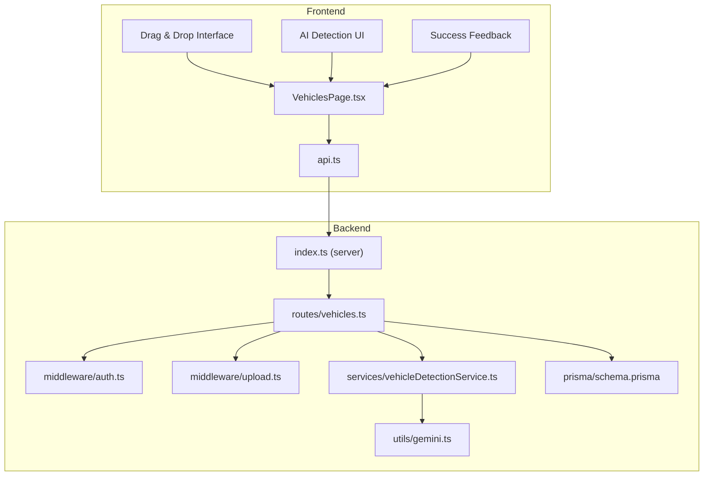

**Diagram sources**
- [index.ts (server):24-32](file://backend/src/index.ts#L24-L32)
- [vehicles.ts:1-169](file://backend/src/routes/vehicles.ts#L1-L169)
- [upload.ts:1-54](file://backend/src/middleware/upload.ts#L1-L54)
- [schema.prisma:26-42](file://backend/prisma/schema.prisma#L26-L42)
- [VehiclesPage.tsx:1-369](file://frontend/src/pages/VehiclesPage.tsx#L1-L369)
- [vehicleDetectionService.ts:1-96](file://backend/src/services/vehicleDetectionService.ts#L1-L96)
- [gemini.ts:1-12](file://backend/src/utils/gemini.ts#L1-L12)

**Section sources**
- [index.ts (server):14-32](file://backend/src/index.ts#L14-L32)
- [vehicles.ts:1-169](file://backend/src/routes/vehicles.ts#L1-L169)
- [schema.prisma:26-42](file://backend/prisma/schema.prisma#L26-L42)
- [VehiclesPage.tsx:1-369](file://frontend/src/pages/VehiclesPage.tsx#L1-L369)
- [api.ts:1-17](file://frontend/src/services/api.ts#L1-L17)

## Core Components
- Backend vehicle routes provide full CRUD for vehicles plus AI-powered detection with authentication enforcement and field validation, including proper JSON serialization for photos field.
- Prisma schema defines the Vehicle model and its relationships to User and Claim.
- Upload middleware supports image/document uploads with type filtering and size limits.
- Vehicle detection service integrates Google's Gemini AI for automated vehicle identification from images.
- Frontend VehiclesPage renders listing, detail, and enhanced add forms with drag-and-drop AI detection capabilities and improved success feedback.
- API service attaches auth tokens and handles 401 redirects.

Key responsibilities:
- Create, read, update, delete vehicles with proper data serialization
- Process AI-powered vehicle detection from uploaded images
- Enforce user isolation via userId
- Return claim counts and related claims for vehicle details
- Serve uploaded files statically
- Validate required fields on create/update
- Handle drag-and-drop image uploads with real-time preview
- Provide visual success feedback during vehicle registration

**Section sources**
- [vehicles.ts:15-32](file://backend/src/routes/vehicles.ts#L15-L32)
- [vehicles.ts:34-63](file://backend/src/routes/vehicles.ts#L34-L63)
- [vehicles.ts:65-81](file://backend/src/routes/vehicles.ts#L65-L81)
- [vehicles.ts:83-111](file://backend/src/routes/vehicles.ts#L83-L111)
- [vehicles.ts:113-146](file://backend/src/routes/vehicles.ts#L113-L146)
- [vehicles.ts:148-166](file://backend/src/routes/vehicles.ts#L148-L166)
- [vehicleDetectionService.ts:46-95](file://backend/src/services/vehicleDetectionService.ts#L46-L95)
- [VehiclesPage.tsx:124-369](file://frontend/src/pages/VehiclesPage.tsx#L124-L369)

## Architecture Overview
The enhanced vehicle management architecture follows a client-server pattern with AI integration:
- Frontend components call /api/vehicles endpoints using axios with Bearer token injection and drag-and-drop image uploads.
- Server applies CORS, JSON parsing, static file serving, route-level authentication, and AI processing.
- Routes interact with Prisma to persist or retrieve Vehicle records scoped by the authenticated user with proper JSON serialization.
- Vehicle detection service processes uploaded images through Google's Gemini AI model for automated data extraction.
- Uploaded images are stored on disk and served under /uploads.

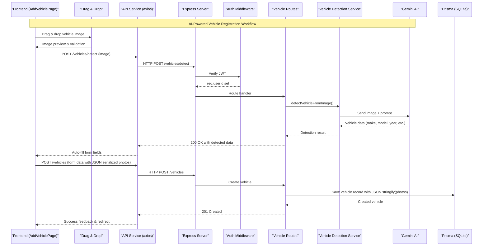

**Diagram sources**
- [VehiclesPage.tsx:140-180](file://frontend/src/pages/VehiclesPage.tsx#L140-L180)
- [api.ts:10-17](file://frontend/src/services/api.ts#L10-L17)
- [index.ts (server):16-32](file://backend/src/index.ts#L16-L32)
- [auth.ts:5-22](file://backend/src/middleware/auth.ts#L5-L22)
- [vehicles.ts:15-32](file://backend/src/routes/vehicles.ts#L15-L32)
- [vehicleDetectionService.ts:46-95](file://backend/src/services/vehicleDetectionService.ts#L46-L95)
- [gemini.ts:6-9](file://backend/src/utils/gemini.ts#L6-L9)

## Detailed Component Analysis

### Vehicle Data Model and Relationships
- Vehicle stores core attributes including make, model, year, optional VIN, license plate, color, mileage, and photos array (properly JSON serialized).
- Owned by a User via userId; cascade delete ensures referential integrity.
- Linked to Claims; each claim references a vehicle and optionally a policy.

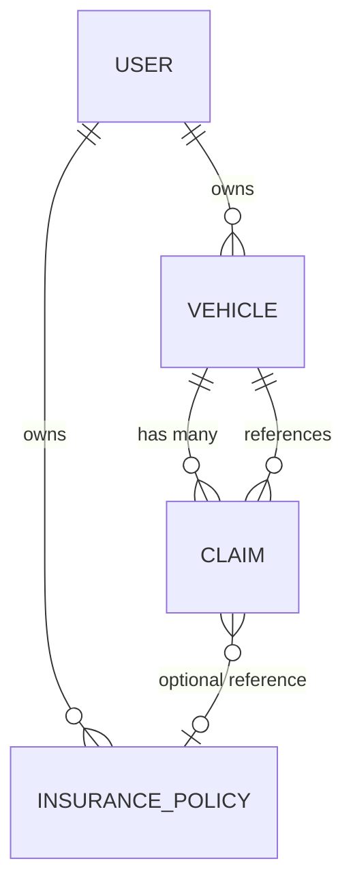

**Diagram sources**
- [schema.prisma:10-24](file://backend/prisma/schema.prisma#L10-L24)
- [schema.prisma:26-42](file://backend/prisma/schema.prisma#L26-L42)
- [schema.prisma:44-59](file://backend/prisma/schema.prisma#L44-L59)
- [schema.prisma:70-93](file://backend/prisma/schema.prisma#L70-L93)

**Section sources**
- [schema.prisma:26-42](file://backend/prisma/schema.prisma#L26-L42)
- [schema.prisma:70-93](file://backend/prisma/schema.prisma#L70-L93)

### Enhanced Vehicle Registration Workflow with AI Detection

#### AI-Powered Vehicle Detection
- New POST /api/vehicles/detect endpoint accepts vehicle images for AI analysis.
- Uses Google's Gemini AI model to automatically extract vehicle information from images.
- Detects make, model, year, color, and license plate with confidence scoring.
- Returns structured JSON data that auto-fills the vehicle registration form.

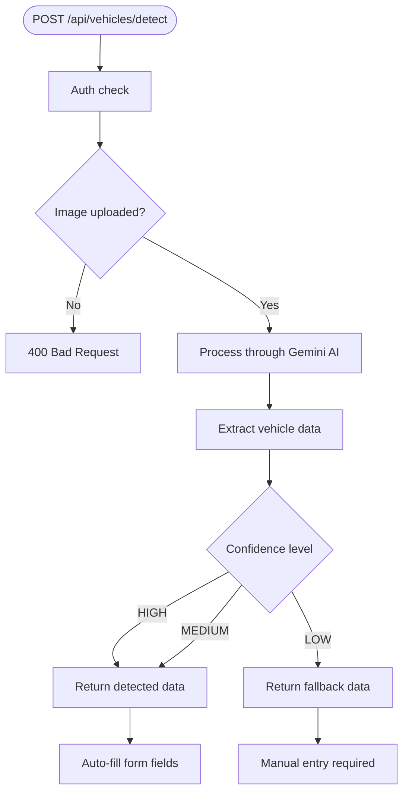

**Diagram sources**
- [vehicles.ts:15-32](file://backend/src/routes/vehicles.ts#L15-L32)
- [vehicleDetectionService.ts:46-95](file://backend/src/services/vehicleDetectionService.ts#L46-L95)
- [VehiclesPage.tsx:155-180](file://frontend/src/pages/VehiclesPage.tsx#L155-L180)

**Section sources**
- [vehicles.ts:15-32](file://backend/src/routes/vehicles.ts#L15-L32)
- [vehicleDetectionService.ts:15-44](file://backend/src/services/vehicleDetectionService.ts#L15-L44)
- [vehicleDetectionService.ts:46-95](file://backend/src/services/vehicleDetectionService.ts#L46-L95)

#### Drag-and-Drop Upload Interface
- Enhanced AddVehiclePage includes drag-and-drop functionality using react-dropzone.
- Real-time image preview with upload progress indicators.
- Supports multiple image formats: JPEG, PNG, WebP with 10MB limit.
- Visual feedback for drag states and file validation.

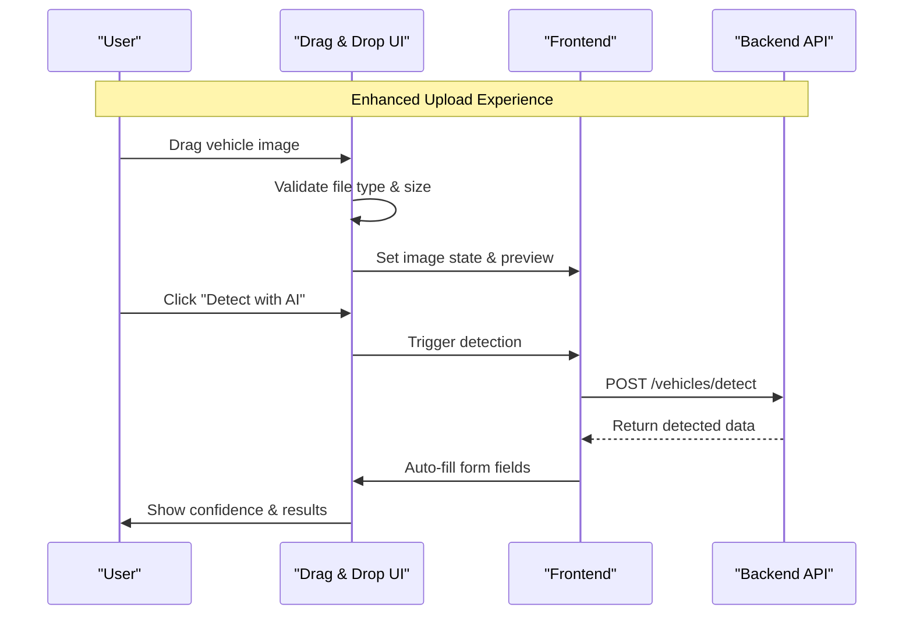

**Diagram sources**
- [VehiclesPage.tsx:140-153](file://frontend/src/pages/VehiclesPage.tsx#L140-L153)
- [VehiclesPage.tsx:223-297](file://frontend/src/pages/VehiclesPage.tsx#L223-L297)

**Section sources**
- [VehiclesPage.tsx:140-153](file://frontend/src/pages/VehiclesPage.tsx#L140-L153)
- [VehiclesPage.tsx:223-297](file://frontend/src/pages/VehiclesPage.tsx#L223-L297)

#### Automated Vehicle Data Extraction
- Vehicle detection service uses Google's Gemini AI model for intelligent image analysis.
- Processes vehicle images to identify make, model, year, color, and license plate.
- Provides confidence scoring (HIGH/MEDIUM/LOW) for detection accuracy.
- Includes additional observations like trim level and body style.

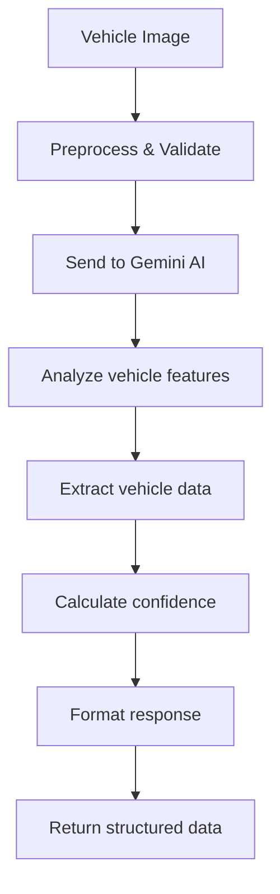

**Diagram sources**
- [vehicleDetectionService.ts:46-95](file://backend/src/services/vehicleDetectionService.ts#L46-L95)
- [gemini.ts:6-9](file://backend/src/utils/gemini.ts#L6-L9)

**Section sources**
- [vehicleDetectionService.ts:46-95](file://backend/src/services/vehicleDetectionService.ts#L46-L95)
- [gemini.ts:1-12](file://backend/src/utils/gemini.ts#L1-L12)

### Vehicle CRUD Workflows

#### Create Vehicle
- Requires authentication.
- Validates presence of make, model, year, licensePlate, and color.
- Persists vehicle with userId from token, converts year and mileage to integers, sets optional VIN and properly JSON serialized photos array.
- Returns created vehicle with 201 status.

**Updated** Photos field now uses JSON.stringify() to ensure proper data serialization during vehicle creation.

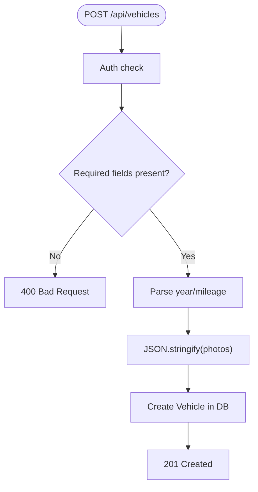

**Diagram sources**
- [vehicles.ts:34-63](file://backend/src/routes/vehicles.ts#L34-L63)
- [auth.ts:5-22](file://backend/src/middleware/auth.ts#L5-L22)

**Section sources**
- [vehicles.ts:34-63](file://backend/src/routes/vehicles.ts#L34-L63)

#### List Vehicles
- Returns all vehicles for the authenticated user, ordered by newest first, including claim count.

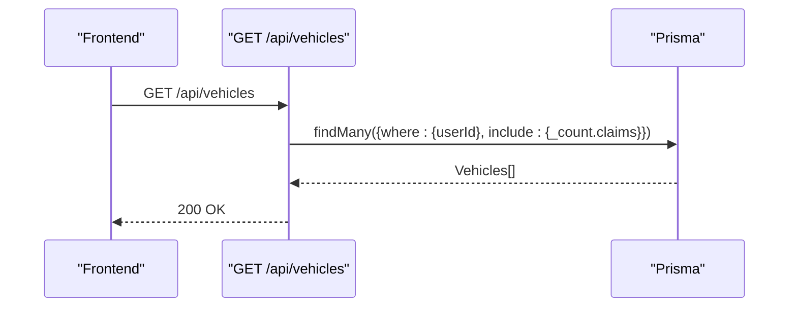

**Diagram sources**
- [vehicles.ts:65-81](file://backend/src/routes/vehicles.ts#L65-L81)

**Section sources**
- [vehicles.ts:65-81](file://backend/src/routes/vehicles.ts#L65-L81)

#### Get Vehicle Detail
- Retrieves a single vehicle by id scoped to the authenticated user.
- Includes recent claims with minimal fields.

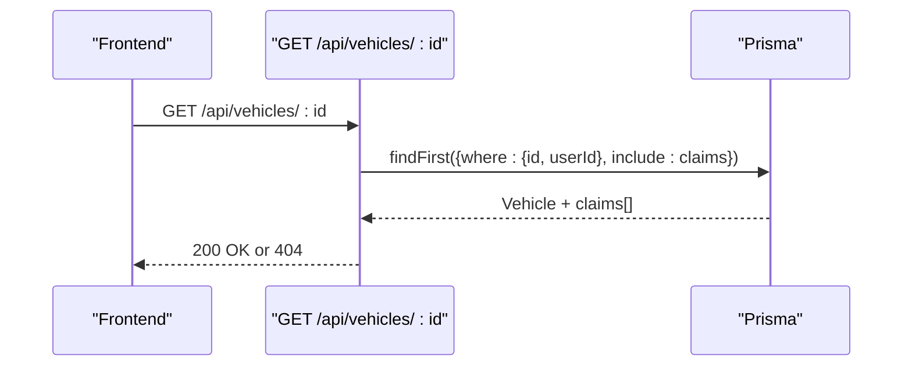

**Diagram sources**
- [vehicles.ts:83-111](file://backend/src/routes/vehicles.ts#L83-L111)

**Section sources**
- [vehicles.ts:83-111](file://backend/src/routes/vehicles.ts#L83-L111)

#### Update Vehicle
- Verifies ownership before updating.
- Allows partial updates for optional fields; converts year and mileage when provided.
- Properly serializes photos field using JSON.stringify() for consistent data handling.

**Updated** Photos field now uses JSON.stringify() to ensure proper data serialization during vehicle updates.

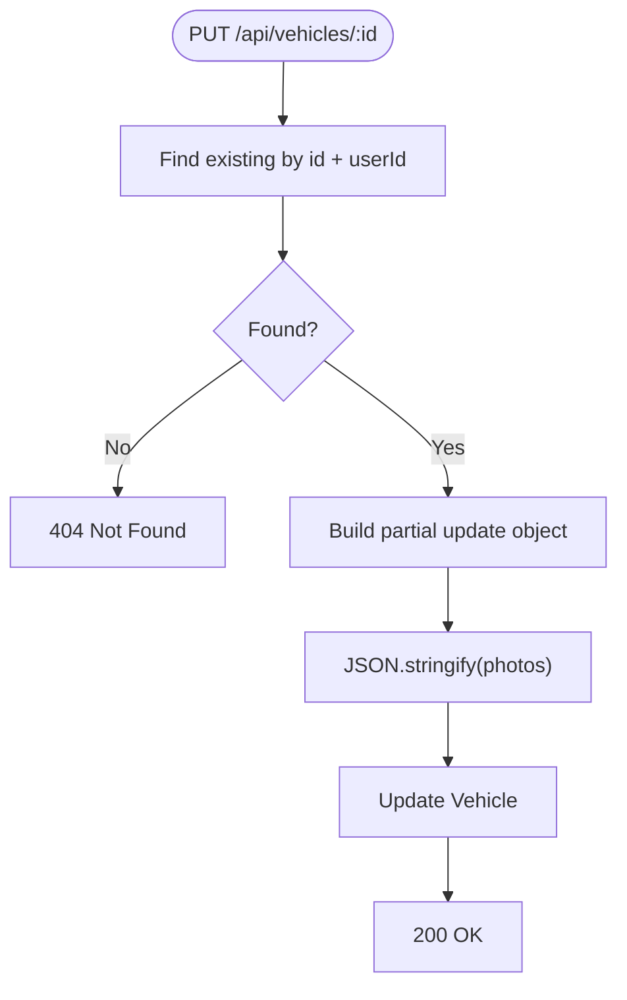

**Diagram sources**
- [vehicles.ts:113-146](file://backend/src/routes/vehicles.ts#L113-L146)

**Section sources**
- [vehicles.ts:113-146](file://backend/src/routes/vehicles.ts#L113-L146)

#### Delete Vehicle
- Confirms ownership then deletes the vehicle record.

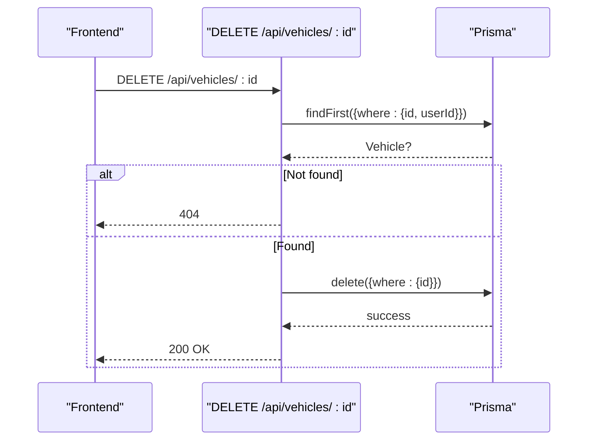

**Diagram sources**
- [vehicles.ts:148-166](file://backend/src/routes/vehicles.ts#L148-L166)

**Section sources**
- [vehicles.ts:148-166](file://backend/src/routes/vehicles.ts#L148-L166)

### Data Validation Rules
- Required fields on create: make, model, year, licensePlate, color.
- Optional fields: vin, mileage, photos.
- Type conversions: year and mileage parsed to integers; nulls allowed for optional numeric fields.
- Ownership enforced at route level via userId from JWT.
- AI detection provides confidence scoring and fallback handling for uncertain detections.
- **Updated** Photos field is now properly JSON serialized to ensure database consistency.

Note: There is no explicit VIN format validation or license plate regex validation in the current implementation. Year bounds are not validated server-side beyond parseInt conversion.

**Section sources**
- [vehicles.ts:37-42](file://backend/src/routes/vehicles.ts#L37-L42)
- [vehicles.ts:44-56](file://backend/src/routes/vehicles.ts#L44-L56)
- [vehicles.ts:125-138](file://backend/src/routes/vehicles.ts#L125-L138)
- [vehicleDetectionService.ts:37-44](file://backend/src/services/vehicleDetectionService.ts#L37-L44)

### Photo Upload Handling and Storage Management
- Upload middleware uses multer with disk storage, creating images and documents directories if missing.
- Allowed MIME types: JPEG, PNG, WebP, JPG.
- File size limit: 10 MB per file.
- Files are saved with UUID filenames to avoid collisions.
- Static serving configured at /uploads so clients can access files directly.
- Enhanced with drag-and-drop interface and real-time preview capabilities.
- **Updated** Photos field in vehicle records now uses proper JSON serialization for consistent data handling.

Important: The vehicle detection endpoint uses the same upload infrastructure but processes images through AI rather than storing them permanently.

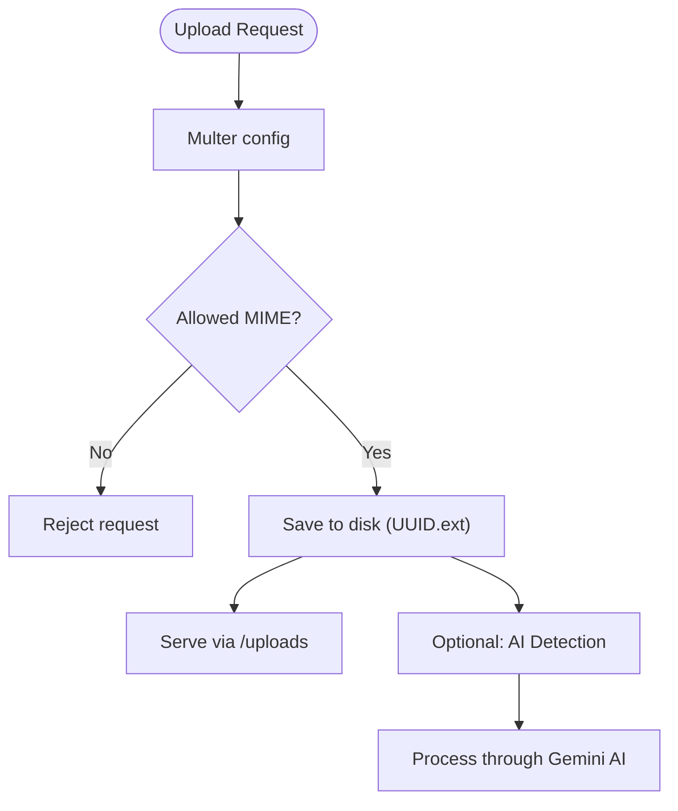

**Diagram sources**
- [upload.ts:17-54](file://backend/src/middleware/upload.ts#L17-L54)
- [index.ts (server):24-26](file://backend/src/index.ts#L24-L26)
- [vehicles.ts:15-32](file://backend/src/routes/vehicles.ts#L15-L32)

**Section sources**
- [upload.ts:1-54](file://backend/src/middleware/upload.ts#L1-L54)
- [index.ts (server):24-26](file://backend/src/index.ts#L24-L26)

### Search and Filtering Capabilities
- Current listing endpoint returns all vehicles for the authenticated user without query parameters for search or filter.
- Sorting is by createdAt descending.
- To implement search/filtering, extend the GET /api/vehicles route to accept query parameters (e.g., make, model, year, licensePlate) and build dynamic Prisma where clauses.

Recommendation: Add query parameter parsing and validation, then construct a Prisma findMany with conditional filters and pagination support.

**Section sources**
- [vehicles.ts:65-81](file://backend/src/routes/vehicles.ts#L65-L81)

### Relationship Between Vehicles and Insurance Policies
- Vehicle and InsurancePolicy are both owned by User but not directly linked.
- Claims link a Vehicle to an optional InsurancePolicy.
- Automatic policy association is not implemented for vehicles; however, during claim creation, users can select a policy associated with their account.

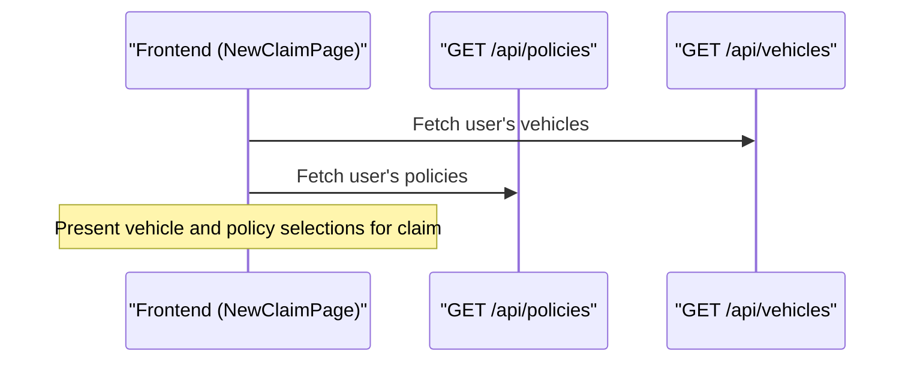

**Diagram sources**
- [policies.ts:42-55](file://backend/src/routes/policies.ts#L42-L55)
- [VehiclesPage.tsx:11-13](file://frontend/src/pages/VehiclesPage.tsx#L11-L13)

**Section sources**
- [schema.prisma:70-93](file://backend/prisma/schema.prisma#L70-93)
- [policies.ts:42-55](file://backend/src/routes/policies.ts#L42-L55)

### Frontend Component Structure
- VehiclesPage:
  - Lists user's vehicles with cards showing make/model/year, license plate, mileage, and claim count.
  - Navigates to detail and add forms.
- VehicleDetailPage:
  - Displays vehicle attributes and claim history.
  - Provides delete action and quick link to file a claim for the vehicle.
- AddVehiclePage:
  - Enhanced form with drag-and-drop AI detection interface.
  - Real-time image preview with confidence scoring display.
  - Auto-filled form fields based on AI detection results.
  - Manual override capabilities for all detected values.
  - **Updated** Enhanced success feedback with visual confirmation and automatic redirection.

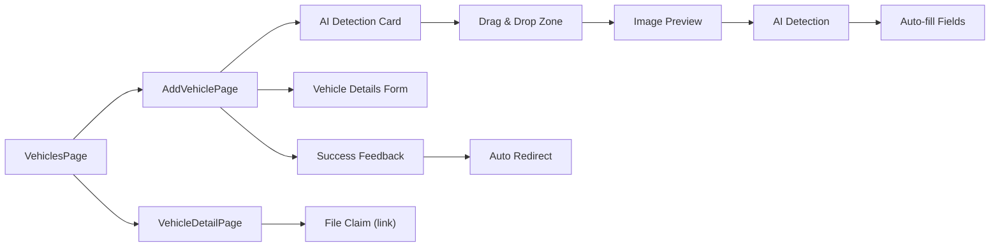

**Diagram sources**
- [VehiclesPage.tsx:8-55](file://frontend/src/pages/VehiclesPage.tsx#L8-L55)
- [VehiclesPage.tsx:57-122](file://frontend/src/pages/VehiclesPage.tsx#L57-L122)
- [VehiclesPage.tsx:124-369](file://frontend/src/pages/VehiclesPage.tsx#L124-L369)

**Section sources**
- [VehiclesPage.tsx:8-55](file://frontend/src/pages/VehiclesPage.tsx#L8-L55)
- [VehiclesPage.tsx:57-122](file://frontend/src/pages/VehiclesPage.tsx#L57-L122)
- [VehiclesPage.tsx:124-369](file://frontend/src/pages/VehiclesPage.tsx#L124-L369)

### API Endpoint Specifications

- Authentication
  - All vehicle endpoints require a valid Bearer token.
  - Token is injected by frontend axios interceptor and verified by server middleware.

- Endpoints
  - POST /api/vehicles/detect
    - Body: image file (multipart/form-data)
    - Response: 200 OK with detected vehicle data including make, model, year, color, licensePlate, confidence, and additionalInfo
    - Errors: 400 if no image uploaded; 500 on AI processing error
  - POST /api/vehicles
    - Body: make, model, year, licensePlate, color (required); vin, mileage, photos (optional, JSON serialized)
    - Response: 201 Created with vehicle object
    - Errors: 400 if required fields missing; 500 on server error
  - GET /api/vehicles
    - Response: 200 OK with array of vehicles including claim counts
  - GET /api/vehicles/:id
    - Response: 200 OK with vehicle and claims list; 404 if not found
  - PUT /api/vehicles/:id
    - Body: partial fields allowed; year/mileage converted to integers; photos JSON serialized
    - Response: 200 OK with updated vehicle; 404 if not found
  - DELETE /api/vehicles/:id
    - Response: 200 OK with message; 404 if not found

- File Uploads
  - Vehicle detection uses /api/vehicles/detect with single image upload.
  - Claim image uploads use /api/claims/:id/images with uploadImage middleware.

- Security
  - Authorization enforced via JWT middleware.
  - CORS configured for frontend origin.

**Section sources**
- [vehicles.ts:15-32](file://backend/src/routes/vehicles.ts#L15-L32)
- [vehicles.ts:34-63](file://backend/src/routes/vehicles.ts#L34-L63)
- [vehicles.ts:65-81](file://backend/src/routes/vehicles.ts#L65-L81)
- [vehicles.ts:83-111](file://backend/src/routes/vehicles.ts#L83-L111)
- [vehicles.ts:113-146](file://backend/src/routes/vehicles.ts#L113-L146)
- [vehicles.ts:148-166](file://backend/src/routes/vehicles.ts#L148-L166)
- [auth.ts:5-22](file://backend/src/middleware/auth.ts#L5-L22)
- [api.ts:10-17](file://frontend/src/services/api.ts#L10-L17)
- [index.ts (server):16-32](file://backend/src/index.ts#L16-L32)
- [claims.ts:195-233](file://backend/src/routes/claims.ts#L195-L233)

## Dependency Analysis
- Frontend depends on api service which adds Authorization headers and handles 401 redirects.
- Backend routes depend on auth middleware to attach userId to requests.
- Routes depend on Prisma client to interact with SQLite database defined in schema.
- Upload middleware is independent and used by other routes (e.g., claims).
- Vehicle detection service depends on Google's Gemini AI for image analysis.
- Enhanced frontend uses react-dropzone for drag-and-drop functionality.

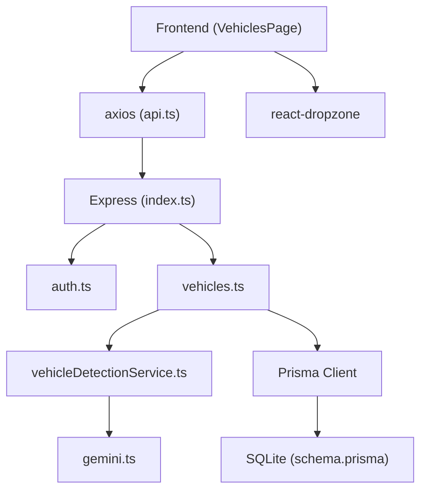

**Diagram sources**
- [api.ts:10-17](file://frontend/src/services/api.ts#L10-L17)
- [index.ts (server):16-32](file://backend/src/index.ts#L16-L32)
- [auth.ts:5-22](file://backend/src/middleware/auth.ts#L5-L22)
- [vehicles.ts:1-169](file://backend/src/routes/vehicles.ts#L1-L169)
- [vehicleDetectionService.ts:1-96](file://backend/src/services/vehicleDetectionService.ts#L1-L96)
- [gemini.ts:1-12](file://backend/src/utils/gemini.ts#L1-L12)
- [schema.prisma:5-8](file://backend/prisma/schema.prisma#L5-L8)

**Section sources**
- [api.ts:10-17](file://frontend/src/services/api.ts#L10-L17)
- [index.ts (server):16-32](file://backend/src/index.ts#L16-L32)
- [vehicles.ts:1-169](file://backend/src/routes/vehicles.ts#L1-L169)
- [vehicleDetectionService.ts:1-96](file://backend/src/services/vehicleDetectionService.ts#L1-L96)
- [gemini.ts:1-12](file://backend/src/utils/gemini.ts#L1-L12)
- [schema.prisma:5-8](file://backend/prisma/schema.prisma#L5-L8)

## Performance Considerations
- Use pagination for large vehicle lists to reduce payload size.
- Index frequently queried fields such as userId, licensePlate, and make/model if scaling beyond small datasets.
- Avoid loading unnecessary relations; only include claims when needed.
- For future photo uploads, consider resizing/compressing images server-side before storing to reduce storage and bandwidth.
- AI detection calls may be slow; implement caching for repeated image analysis.
- Consider rate limiting for AI detection endpoint to prevent abuse.
- Implement async processing for AI detection to avoid blocking requests.

[No sources needed since this section provides general guidance]

## Troubleshooting Guide
- 401 Unauthorized: Ensure Authorization header contains a valid Bearer token; verify JWT secret configuration on the server.
- 404 Not Found: Confirm the vehicle belongs to the authenticated user; check route parameter id correctness.
- 400 Bad Request: Ensure required fields (make, model, year, licensePlate, color) are present and correctly typed.
- Upload errors: Verify file MIME types and size limits; ensure uploads directory exists and is writable.
- AI detection failures: Check Gemini API key configuration; verify image quality and format; review error logs for parsing issues.
- Drag-and-drop issues: Ensure react-dropzone is properly configured; check browser compatibility; verify file input permissions.
- **Updated** Photos serialization errors: Ensure photos field is properly formatted as an array before JSON serialization.

**Section sources**
- [auth.ts:5-22](file://backend/src/middleware/auth.ts#L5-L22)
- [vehicles.ts:37-42](file://backend/src/routes/vehicles.ts#L37-L42)
- [vehicles.ts:101-103](file://backend/src/routes/vehicles.ts#L101-L103)
- [upload.ts:30-41](file://backend/src/middleware/upload.ts#L30-L41)
- [vehicleDetectionService.ts:51-53](file://backend/src/services/vehicleDetectionService.ts#L51-L53)
- [vehicleDetectionService.ts:81-92](file://backend/src/services/vehicleDetectionService.ts#L81-L92)

## Conclusion
The enhanced vehicle management system provides secure CRUD operations for user-owned vehicles with AI-powered registration capabilities and improved data serialization. The integration of Google's Gemini AI enables automated vehicle identification from images, significantly streamlining the registration process through drag-and-drop uploads and intelligent data extraction. The critical fix for photos field JSON serialization ensures data consistency across vehicle creation and update operations. Enhanced user experience features include visual success feedback and automatic redirection after successful vehicle registration. While traditional photo uploads for vehicles are not yet implemented, the infrastructure supports claim-related uploads and AI detection workflows. The system maintains robust security through JWT authentication while providing an intuitive user experience with real-time feedback and confidence scoring for AI-detected vehicle information.

[No sources needed since this section summarizes without analyzing specific files]

## Appendices

### Data Migration Strategies for Existing Vehicle Records
- Schema changes: If adding constraints or new fields to Vehicle, plan Prisma migrations to alter SQLite safely.
- Backward compatibility: Ensure API responses remain compatible; deprecate fields gradually.
- Data normalization: Consider moving photos from JSON arrays to separate tables if frequent updates are needed.
- Rollback strategy: Keep migration scripts reversible; test in staging before applying to production.
- **Updated** Photos field migration: Ensure existing vehicle records have properly serialized photos field data.

[No sources needed since this section provides general guidance]

### Backup Procedures
- Database backups: Schedule regular exports of SQLite database file; store offsite securely.
- File backups: Periodically back up the uploads directory containing images and documents.
- Integrity checks: Validate backups by restoring to a test environment and verifying data consistency.
- Access control: Restrict backup storage access and encrypt sensitive data at rest.

[No sources needed since this section provides general guidance]

### AI Integration Configuration
- Gemini API Key: Configure in environment variables for vehicle detection functionality.
- Model Selection: Currently uses gemini-2.5-flash for optimal performance and cost efficiency.
- Error Handling: Implements fallback mechanisms for failed AI detections with appropriate user messaging.
- Rate Limiting: Consider implementing API rate limiting to prevent excessive AI usage.

[No sources needed since this section provides general guidance]