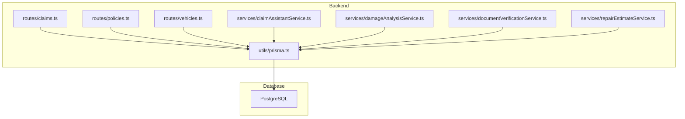
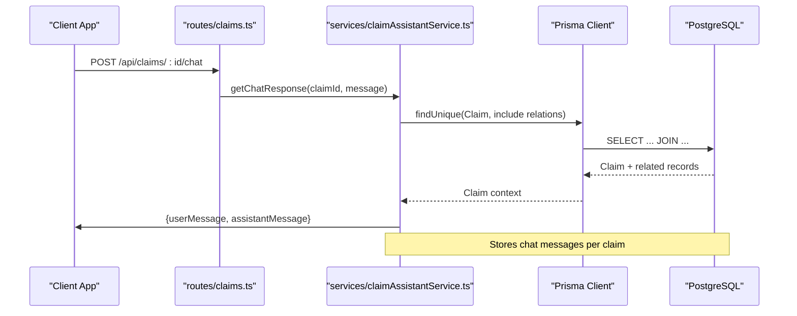
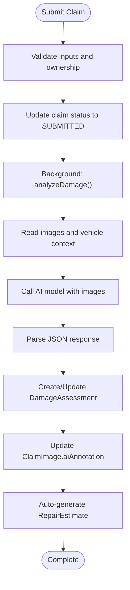
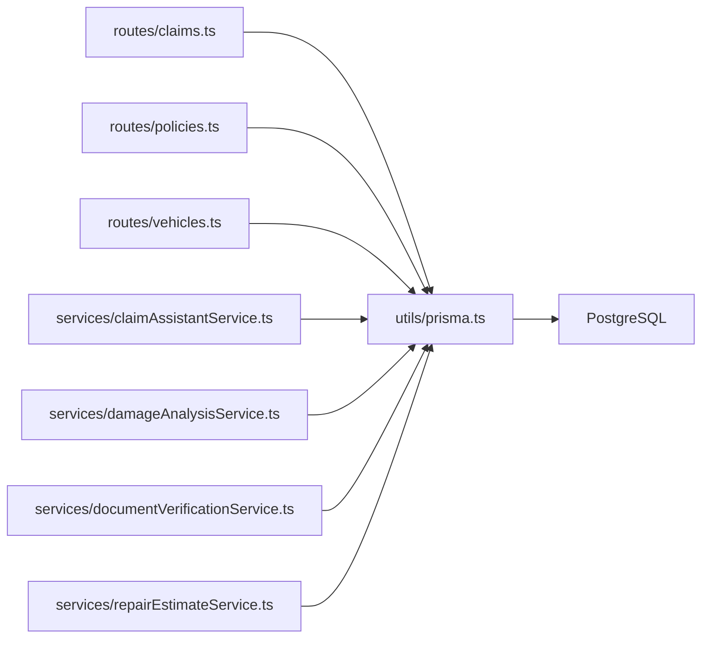

# Database Design

<cite>
**Referenced Files in This Document**
- [schema.prisma](file://backend/prisma/schema.prisma)
- [prisma.ts](file://backend/src/utils/prisma.ts)
- [claims.ts](file://backend/src/routes/claims.ts)
- [policies.ts](file://backend/src/routes/policies.ts)
- [vehicles.ts](file://backend/src/routes/vehicles.ts)
- [claimAssistantService.ts](file://backend/src/services/claimAssistantService.ts)
- [damageAnalysisService.ts](file://backend/src/services/damageAnalysisService.ts)
- [documentVerificationService.ts](file://backend/src/services/documentVerificationService.ts)
- [repairEstimateService.ts](file://backend/src/services/repairEstimateService.ts)
</cite>

## Table of Contents
1. [Introduction](#introduction)
2. [Project Structure](#project-structure)
3. [Core Components](#core-components)
4. [Architecture Overview](#architecture-overview)
5. [Detailed Component Analysis](#detailed-component-analysis)
6. [Dependency Analysis](#dependency-analysis)
7. [Performance Considerations](#performance-considerations)
8. [Troubleshooting Guide](#troubleshooting-guide)
9. [Conclusion](#conclusion)
10. [Appendices](#appendices)

## Introduction
This document provides a comprehensive database design for the Smart Vehicle Insurance Claim System using Prisma ORM. It details the entity relationship model, field definitions, constraints, indexing strategy, query patterns, migration approach, security considerations, and performance tuning recommendations. The system models Users, Vehicles, Insurance Policies, Claims, Damage Assessments, Repair Estimates, Documents, Chat Messages, and related entities to support end-to-end claim lifecycle management with AI-assisted damage analysis and document verification.

## Project Structure
The database schema is defined in a single Prisma schema file and consumed by backend services and routes that perform CRUD operations and orchestrate AI-driven workflows.



**Diagram sources**
- [claims.ts:1-450](file://backend/src/routes/claims.ts#L1-L450)
- [policies.ts:1-131](file://backend/src/routes/policies.ts#L1-L131)
- [vehicles.ts:1-148](file://backend/src/routes/vehicles.ts#L1-L148)
- [claimAssistantService.ts:1-130](file://backend/src/services/claimAssistantService.ts#L1-L130)
- [damageAnalysisService.ts:1-154](file://backend/src/services/damageAnalysisService.ts#L1-L154)
- [documentVerificationService.ts:1-107](file://backend/src/services/documentVerificationService.ts#L1-L107)
- [repairEstimateService.ts:1-199](file://backend/src/services/repairEstimateService.ts#L1-L199)
- [prisma.ts:1-6](file://backend/src/utils/prisma.ts#L1-L6)

**Section sources**
- [schema.prisma:1-201](file://backend/prisma/schema.prisma#L1-L201)
- [prisma.ts:1-6](file://backend/src/utils/prisma.ts#L1-L6)

## Core Components
The data model centers around the following core entities:
- User: Identity and profile information
- Vehicle: Policyholder’s registered vehicles
- InsurancePolicy: Coverage details linked to a user
- Claim: Incident record tied to a user, vehicle, and optionally a policy
- ClaimImage: Images attached to a claim with type annotations
- DamageAssessment: AI-generated assessment of damages and severity
- RepairEstimate: Itemized repair cost estimate derived from damage assessment
- InsurancePayout: Estimated payout calculation based on policy and estimate
- Document: Uploaded documents with verification status
- ChatMessage: Conversation history between user and assistant per claim

Key relationships:
- One User has many Vehicles, Policies, and Claims
- One Vehicle has many Claims
- One InsurancePolicy belongs to one User and can be referenced by many Claims
- One Claim has many ClaimImages, Documents, and ChatMessages; optional DamageAssessment, RepairEstimate, and InsurancePayout
- One DamageAssessment links to one RepairEstimate and one InsurancePayout (optional)

Indexes and constraints:
- Primary keys: id on all models
- Unique constraints: email on User; claimId on DamageAssessment, RepairEstimate, InsurancePayout; policyNumber not explicitly unique but recommended for uniqueness at DB level
- Foreign keys: userId, vehicleId, policyId, claimId across related tables
- Cascade deletes on most relationships to maintain referential integrity

Validation rules:
- Enums enforce allowed values for ClaimStatus, ImageType, SeverityLevel, DocumentType, VerificationStatus, ChatRole
- Required fields enforced via Prisma schema (e.g., incidentDate, incidentLocation, incidentDescription)
- Optional fields where appropriate (e.g., weatherConditions, vin, phone, address)

**Section sources**
- [schema.prisma:10-24](file://backend/prisma/schema.prisma#L10-L24)
- [schema.prisma:26-42](file://backend/prisma/schema.prisma#L26-L42)
- [schema.prisma:44-59](file://backend/prisma/schema.prisma#L44-L59)
- [schema.prisma:61-93](file://backend/prisma/schema.prisma#L61-L93)
- [schema.prisma:95-110](file://backend/prisma/schema.prisma#L95-L110)
- [schema.prisma:112-129](file://backend/prisma/schema.prisma#L112-L129)
- [schema.prisma:131-159](file://backend/prisma/schema.prisma#L131-L159)
- [schema.prisma:161-185](file://backend/prisma/schema.prisma#L161-L185)
- [schema.prisma:187-200](file://backend/prisma/schema.prisma#L187-L200)

## Architecture Overview
The application uses Prisma Client to interact with PostgreSQL. Routes handle HTTP requests and delegate to services that perform business logic and database operations. Services may call external AI APIs and persist results back to the database.



**Diagram sources**
- [claims.ts:423-447](file://backend/src/routes/claims.ts#L423-L447)
- [claimAssistantService.ts:19-129](file://backend/src/services/claimAssistantService.ts#L19-L129)

**Section sources**
- [claims.ts:1-450](file://backend/src/routes/claims.ts#L1-L450)
- [claimAssistantService.ts:1-130](file://backend/src/services/claimAssistantService.ts#L1-L130)

## Detailed Component Analysis

### Entity Relationship Diagram
```mermaid
erDiagram
USER {
string id PK
string email UK
string passwordHash
string firstName
string lastName
string phone
string address
datetime createdAt
datetime updatedAt
}
VEHICLE {
string id PK
string userId FK
string make
string model
int year
string vin
string licensePlate
string color
int mileage
json[] photos
datetime createdAt
datetime updatedAt
}
INSURANCE_POLICY {
string id PK
string userId FK
string providerName
string policyNumber
string coverageType
float deductible
float premiumAmount
datetime startDate
datetime endDate
datetime createdAt
datetime updatedAt
}
CLAIM {
string id PK
string userId FK
string vehicleId FK
string policyId FK
enum status
datetime incidentDate
string incidentLocation
string incidentDescription
string weatherConditions
boolean hasPoliceReport
datetime createdAt
datetime updatedAt
}
CLAIM_IMAGE {
string id PK
string claimId FK
enum type
string filePath
string label
json aiAnnotation
datetime uploadedAt
}
DAMAGE_ASSESSMENT {
string id PK
string claimId UK FK
json damages
string drivabilityAssessment
enum overallSeverity
json aiRawResponse
datetime assessedAt
}
REPAIR_ESTIMATE {
string id PK
string claimId UK FK
string damageAssessmentId UK FK
json items
float totalPartsCost
float totalLaborCost
float totalCost
int estimatedDays
datetime createdAt
}
INSURANCE_PAYOUT {
string id PK
string claimId UK FK
string repairEstimateId UK FK
float deductible
float coveredAmount
float estimatedPayout
string notes
datetime createdAt
}
DOCUMENT {
string id PK
string claimId FK
enum type
string filePath
enum verificationStatus
json verificationResult
datetime uploadedAt
}
CHAT_MESSAGE {
string id PK
string claimId FK
enum role
string content
datetime createdAt
}
USER ||--o{ VEHICLE : "has many"
USER ||--o{ INSURANCE_POLICY : "has many"
USER ||--o{ CLAIM : "has many"
VEHICLE ||--o{ CLAIM : "has many"
INSURANCE_POLICY ||--o{ CLAIM : "referenced by"
CLAIM ||--o{ CLAIM_IMAGE : "has many"
CLAIM ||--o{ DOCUMENT : "has many"
CLAIM ||--o{ CHAT_MESSAGE : "has many"
CLAIM ||--|| DAMAGE_ASSESSMENT : "one-to-one"
DAMAGE_ASSESSMENT ||--|| REPAIR_ESTIMATE : "one-to-one"
REPAIR_ESTIMATE ||--|| INSURANCE_PAYOUT : "one-to-one"
```

**Diagram sources**
- [schema.prisma:10-24](file://backend/prisma/schema.prisma#L10-L24)
- [schema.prisma:26-42](file://backend/prisma/schema.prisma#L26-L42)
- [schema.prisma:44-59](file://backend/prisma/schema.prisma#L44-L59)
- [schema.prisma:61-93](file://backend/prisma/schema.prisma#L61-L93)
- [schema.prisma:95-110](file://backend/prisma/schema.prisma#L95-L110)
- [schema.prisma:112-129](file://backend/prisma/schema.prisma#L112-L129)
- [schema.prisma:131-159](file://backend/prisma/schema.prisma#L131-L159)
- [schema.prisma:161-185](file://backend/prisma/schema.prisma#L161-L185)
- [schema.prisma:187-200](file://backend/prisma/schema.prisma#L187-L200)

### Field Definitions, Data Types, Constraints, and Validation Rules
- User
  - id: String, primary key, UUID default
  - email: String, unique
  - passwordHash: String (sensitive)
  - firstName, lastName: String
  - phone, address: String, nullable
  - createdAt, updatedAt: DateTime defaults
- Vehicle
  - id: String, primary key, UUID default
  - userId: String (FK to User)
  - make, model, licensePlate, color: String
  - year: Int
  - vin: String, nullable
  - mileage: Int, nullable
  - photos: String array
  - createdAt, updatedAt: DateTime defaults
- InsurancePolicy
  - id: String, primary key, UUID default
  - userId: String (FK to User)
  - providerName, policyNumber, coverageType: String
  - deductible, premiumAmount: Float
  - startDate, endDate: DateTime
  - createdAt, updatedAt: DateTime defaults
- Claim
  - id: String, primary key, UUID default
  - userId: String (FK to User)
  - vehicleId: String (FK to Vehicle)
  - policyId: String (FK to InsurancePolicy), nullable
  - status: Enum (DRAFT, SUBMITTED, UNDER_REVIEW, APPROVED, REJECTED, COMPLETED), default DRAFT
  - incidentDate: DateTime
  - incidentLocation, incidentDescription: String
  - weatherConditions: String, nullable
  - hasPoliceReport: Boolean, default false
  - createdAt, updatedAt: DateTime defaults
- ClaimImage
  - id: String, primary key, UUID default
  - claimId: String (FK to Claim)
  - type: Enum (FULL_VEHICLE, DAMAGE_CLOSEUP)
  - filePath: String
  - label: String, nullable
  - aiAnnotation: Json, nullable
  - uploadedAt: DateTime default
- DamageAssessment
  - id: String, primary key, UUID default
  - claimId: String, unique (FK to Claim)
  - damages: Json
  - drivabilityAssessment: String
  - overallSeverity: Enum (MINOR, MODERATE, SEVERE)
  - aiRawResponse: Json, nullable
  - assessedAt: DateTime default
- RepairEstimate
  - id: String, primary key, UUID default
  - claimId: String, unique (FK to Claim)
  - damageAssessmentId: String, unique (FK to DamageAssessment)
  - items: Json
  - totalPartsCost, totalLaborCost, totalCost: Float
  - estimatedDays: Int
  - createdAt: DateTime default
- InsurancePayout
  - id: String, primary key, UUID default
  - claimId: String, unique (FK to Claim)
  - repairEstimateId: String, unique (FK to RepairEstimate)
  - deductible, coveredAmount, estimatedPayout: Float
  - notes: String, nullable
  - createdAt: DateTime default
- Document
  - id: String, primary key, UUID default
  - claimId: String (FK to Claim)
  - type: Enum (LICENSE, REGISTRATION, ACCIDENT_REPORT, REPAIR_ESTIMATE)
  - filePath: String
  - verificationStatus: Enum (PENDING, VERIFIED, ISSUES_FOUND, UNREADABLE), default PENDING
  - verificationResult: Json, nullable
  - uploadedAt: DateTime default
- ChatMessage
  - id: String, primary key, UUID default
  - claimId: String (FK to Claim)
  - role: Enum (USER, ASSISTANT)
  - content: String
  - createdAt: DateTime default

Constraints and cascade behavior:
- onDelete: Cascade on most relationships to ensure referential integrity when parent records are deleted
- Unique constraints on claimId for DamageAssessment, RepairEstimate, InsurancePayout to enforce one-to-one relationships per claim

Validation rules:
- Enum fields restrict allowed values
- Required fields enforced at schema level
- Business validation in routes (e.g., required fields for creating claims, policies, vehicles)

**Section sources**
- [schema.prisma:10-24](file://backend/prisma/schema.prisma#L10-L24)
- [schema.prisma:26-42](file://backend/prisma/schema.prisma#L26-L42)
- [schema.prisma:44-59](file://backend/prisma/schema.prisma#L44-L59)
- [schema.prisma:61-93](file://backend/prisma/schema.prisma#L61-L93)
- [schema.prisma:95-110](file://backend/prisma/schema.prisma#L95-L110)
- [schema.prisma:112-129](file://backend/prisma/schema.prisma#L112-L129)
- [schema.prisma:131-159](file://backend/prisma/schema.prisma#L131-L159)
- [schema.prisma:161-185](file://backend/prisma/schema.prisma#L161-L185)
- [schema.prisma:187-200](file://backend/prisma/schema.prisma#L187-L200)

### Query Patterns and Examples
Common queries observed in routes and services:
- Create claim with validation and ownership checks
- List claims with filters and counts
- Retrieve full claim detail including related entities
- Upload images and associate with claim
- Submit claim and trigger background damage analysis
- Generate repair estimates after damage assessment
- Upload and verify documents
- Chat message retrieval and creation

Example patterns:
- Filtering by userId and status for claims listing
- Using includes to fetch nested relations efficiently
- Counting related records without loading full payloads
- Upsert-like behavior via findUnique followed by create or update

**Section sources**
- [claims.ts:21-57](file://backend/src/routes/claims.ts#L21-L57)
- [claims.ts:60-83](file://backend/src/routes/claims.ts#L60-L83)
- [claims.ts:86-112](file://backend/src/routes/claims.ts#L86-L112)
- [claims.ts:152-193](file://backend/src/routes/claims.ts#L152-L193)
- [claims.ts:196-233](file://backend/src/routes/claims.ts#L196-L233)
- [claims.ts:290-314](file://backend/src/routes/claims.ts#L290-L314)
- [claims.ts:317-353](file://backend/src/routes/claims.ts#L317-L353)
- [claims.ts:379-397](file://backend/src/routes/claims.ts#L379-L397)
- [claims.ts:399-447](file://backend/src/routes/claims.ts#L399-L447)
- [policies.ts:13-40](file://backend/src/routes/policies.ts#L13-L40)
- [policies.ts:43-55](file://backend/src/routes/policies.ts#L43-L55)
- [vehicles.ts:14-42](file://backend/src/routes/vehicles.ts#L14-L42)
- [vehicles.ts:45-60](file://backend/src/routes/vehicles.ts#L45-L60)

### Complex Queries Involving Joins and Aggregations
- Full claim detail retrieval with nested includes for vehicle, policy, images, damage assessment, repair estimate, insurance payout, documents, and chat messages
- Listing claims with aggregated counts for images and documents
- Retrieving vehicles with associated claim counts

These patterns minimize N+1 queries by leveraging Prisma’s include and _count features.

**Section sources**
- [claims.ts:86-112](file://backend/src/routes/claims.ts#L86-L112)
- [claims.ts:60-83](file://backend/src/routes/claims.ts#L60-L83)
- [vehicles.ts:45-60](file://backend/src/routes/vehicles.ts#L45-L60)

### Data Flows and Processing Logic
- Claim submission triggers background AI damage analysis which reads images, calls AI service, parses JSON response, persists assessment, updates image annotations, and auto-generates repair estimate
- Document verification reads stored files, calls AI service, parses result, and updates verification status and extracted info
- Chat assistant retrieves claim context and conversation history, composes prompt, sends to AI, and stores both user and assistant messages



**Diagram sources**
- [claims.ts:152-193](file://backend/src/routes/claims.ts#L152-L193)
- [damageAnalysisService.ts:50-154](file://backend/src/services/damageAnalysisService.ts#L50-L154)
- [repairEstimateService.ts:104-199](file://backend/src/services/repairEstimateService.ts#L104-L199)

**Section sources**
- [damageAnalysisService.ts:1-154](file://backend/src/services/damageAnalysisService.ts#L1-L154)
- [documentVerificationService.ts:1-107](file://backend/src/services/documentVerificationService.ts#L1-L107)
- [claimAssistantService.ts:1-130](file://backend/src/services/claimAssistantService.ts#L1-L130)

## Dependency Analysis
Component coupling and cohesion:
- Routes depend on Prisma Client and services for business logic
- Services encapsulate complex workflows and external integrations (AI models)
- Schema defines strict relationships ensuring data consistency

Direct dependencies:
- Routes import services and Prisma
- Services import Prisma and types
- No circular dependencies observed between modules

External dependencies:
- PostgreSQL via Prisma datasource
- External AI model integration within services

Potential risks:
- Tight coupling between services and AI responses requires robust parsing and fallbacks
- Large includes in queries can increase payload size; consider selective selects for performance



**Diagram sources**
- [claims.ts:1-450](file://backend/src/routes/claims.ts#L1-L450)
- [policies.ts:1-131](file://backend/src/routes/policies.ts#L1-L131)
- [vehicles.ts:1-148](file://backend/src/routes/vehicles.ts#L1-L148)
- [claimAssistantService.ts:1-130](file://backend/src/services/claimAssistantService.ts#L1-L130)
- [damageAnalysisService.ts:1-154](file://backend/src/services/damageAnalysisService.ts#L1-L154)
- [documentVerificationService.ts:1-107](file://backend/src/services/documentVerificationService.ts#L1-L107)
- [repairEstimateService.ts:1-199](file://backend/src/services/repairEstimateService.ts#L1-L199)
- [prisma.ts:1-6](file://backend/src/utils/prisma.ts#L1-L6)

**Section sources**
- [schema.prisma:1-201](file://backend/prisma/schema.prisma#L1-L201)
- [prisma.ts:1-6](file://backend/src/utils/prisma.ts#L1-L6)

## Performance Considerations
Indexing strategies:
- Add indexes on frequently filtered columns:
  - claims.userId, claims.status, claims.vehicleId, claims.policyId
  - documents.claimId, documents.type, documents.verificationStatus
  - chatMessages.claimId, chatMessages.createdAt
  - vehicles.userId
- Unique indexes already exist for email, claimId-related entities; consider adding unique index on policyNumber if needed

Query optimization:
- Use selective selects in includes to reduce payload size
- Leverage _count for aggregations instead of fetching full related records
- Paginate large result sets (e.g., chat messages, documents)
- Avoid deep nesting unless necessary; split into multiple queries if needed

Storage and I/O:
- Store large binary assets (images, documents) externally (object storage) and keep only paths in DB
- Compress images before upload to reduce storage and transfer costs

Scalability:
- Connection pooling configured via Prisma client environment variables
- Consider read replicas for heavy read workloads
- Partition large tables (e.g., chatMessages, documents) by time if growth is significant

[No sources needed since this section provides general guidance]

## Troubleshooting Guide
Common issues and resolutions:
- Claim not found: Ensure correct claimId and user ownership checks
- No images to analyze: Require at least one image before submitting or analyzing
- Document file not found: Verify file path resolution and storage location
- AI response parsing failures: Implement robust JSON extraction and fallback handling
- Status transitions: Enforce state machine rules (e.g., only DRAFT claims can be edited)

Error handling patterns:
- Route-level try/catch blocks returning standardized error responses
- Service-level validations and explicit error messages
- Logging errors for debugging and monitoring

**Section sources**
- [claims.ts:21-57](file://backend/src/routes/claims.ts#L21-L57)
- [claims.ts:152-193](file://backend/src/routes/claims.ts#L152-L193)
- [damageAnalysisService.ts:50-154](file://backend/src/services/damageAnalysisService.ts#L50-L154)
- [documentVerificationService.ts:41-107](file://backend/src/services/documentVerificationService.ts#L41-L107)

## Conclusion
The database design provides a robust foundation for managing vehicle insurance claims with clear entity relationships, strong constraints, and scalable query patterns. Prisma enforces type safety and simplifies migrations. AI-driven services integrate seamlessly with the data model to automate damage assessment, document verification, and repair estimation. Proper indexing, selective querying, and secure handling of sensitive data will ensure performance and reliability in production environments.

[No sources needed since this section summarizes without analyzing specific files]

## Appendices

### Migrations Strategy and Version Management
- Use Prisma Migrate to manage schema changes:
  - Initialize migrations with prisma migrate dev
  - Apply migrations to development and production environments
  - Review migration SQL before applying to production
- Version control:
  - Commit generated migration files alongside schema changes
  - Tag releases and track migration history
- Rollback strategy:
  - Plan down migrations carefully; avoid destructive changes in production
  - Use feature flags to gradually roll out schema changes

[No sources needed since this section provides general guidance]

### Security Considerations
- Sensitive fields:
  - passwordHash should be encrypted at rest and never logged
  - Consider encrypting personally identifiable information (PII) such as name, address, phone
- Access control:
  - Enforce user ownership checks on all CRUD operations (already implemented in routes)
  - Validate and sanitize inputs to prevent injection attacks
- Data privacy:
  - Minimize data exposure in API responses; use selective selects
  - Secure file storage with access controls and signed URLs

[No sources needed since this section provides general guidance]

### Sample Data Structures and Typical Use Cases
- Creating a claim:
  - Provide vehicleId, incidentDate, incidentLocation, incidentDescription
  - Optionally attach policyId and police report flag
- Uploading images:
  - Attach FULL_VEHICLE or DAMAGE_CLOSEUP images with labels
  - Trigger AI analysis to generate damage assessment and repair estimate
- Verifying documents:
  - Upload LICENSE, REGISTRATION, ACCIDENT_REPORT, or REPAIR_ESTIMATE
  - Run verification to update status and extract key information
- Chat assistance:
  - Retrieve recent messages and send new messages to get contextual responses

**Section sources**
- [claims.ts:21-57](file://backend/src/routes/claims.ts#L21-L57)
- [claims.ts:196-233](file://backend/src/routes/claims.ts#L196-L233)
- [claims.ts:317-353](file://backend/src/routes/claims.ts#L317-L353)
- [claims.ts:399-447](file://backend/src/routes/claims.ts#L399-L447)