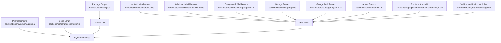
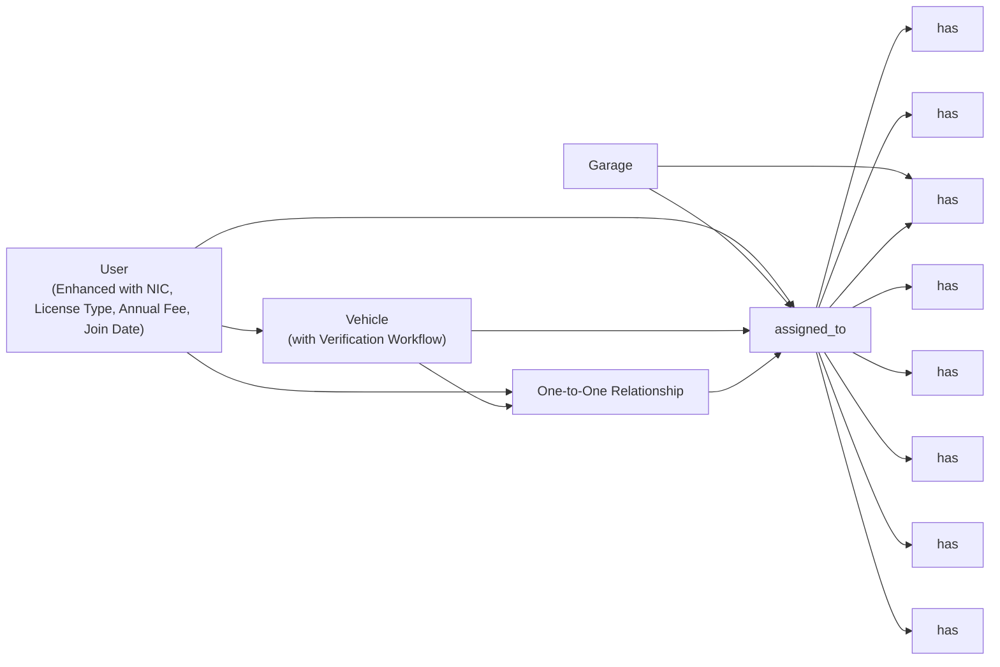
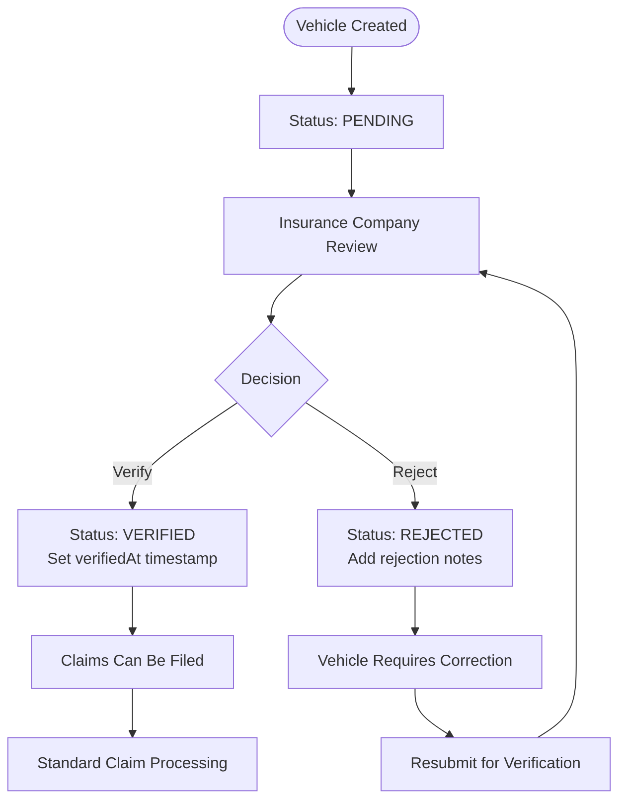

# Database Design

<cite>
**Referenced Files in This Document**
- [schema.prisma](file://backend/prisma/schema.prisma)
- [admin.ts](file://backend/src/routes/admin.ts)
- [vehicles.ts](file://backend/src/routes/vehicles.ts)
- [index.ts](file://frontend/src/types/index.ts)
- [AdminVehiclesPage.tsx](file://frontend/src/pages/admin/AdminVehiclesPage.tsx)
- [VehiclesPage.tsx](file://frontend/src/pages/VehiclesPage.tsx)
- [DashboardPage.tsx](file://frontend/src/pages/DashboardPage.tsx)
- [PoliciesPage.tsx](file://frontend/src/pages/PoliciesPage.tsx)
</cite>

## Update Summary
**Changes Made**
- Added VehicleVerification enum (PENDING, VERIFIED, REJECTED) for vehicle and policy validation workflow
- Enhanced Vehicle model with verificationStatus, verifiedAt, and verificationNotes fields for insurance company verification process
- Updated InsurancePolicy model with unique vehicleId field creating one-to-one relationship between vehicles and policies
- Implemented comprehensive vehicle verification workflow through admin API endpoints
- Added frontend interfaces and UI components for displaying and managing vehicle verification status
- Updated claim submission logic to require VERIFIED vehicles before claims can be filed

## Table of Contents
1. [Introduction](#introduction)
2. [Project Structure](#project-structure)
3. [Core Components](#core-components)
4. [Architecture Overview](#architecture-overview)
5. [Detailed Component Analysis](#detailed-component-analysis)
6. [Dependency Analysis](#dependency-analysis)
7. [Performance Considerations](#performance-considerations)
8. [Data Lifecycle and Audit Trails](#data-lifecycle-and-audit-trails)
9. [Database Migration Strategy](#database-migration-strategy)
10. [Seeding Procedures](#seeding-procedures)
11. [Backup and Recovery](#backup-and-recovery)
12. [Security Considerations](#security-considerations)
13. [Troubleshooting Guide](#troubleshooting-guide)
14. [Conclusion](#conclusion)

## Introduction
This document provides comprehensive data model documentation for the Prisma ORM schema used by the Smart Vehicle Insurance Claim System. It details all entity relationships, field definitions, constraints, indexes, validation rules enforced at the database level, and operational guidance including migrations, seeding, backup/recovery, and security considerations. The system models users, vehicles, insurance policies, claims, damage assessments, repair estimates, garage assignments, garage estimates, payouts, documents, images, and chat messages to support end-to-end claim processing with integrated garage workflow capabilities and enhanced insurance company administrative features.

**Updated** The data model now includes a comprehensive vehicle verification workflow that ensures vehicles and their associated insurance policies are validated by the insurance company before claims can be submitted.

## Project Structure
The data model is defined in a single Prisma schema file. Supporting scripts provide admin seeding and environment configuration via package scripts. Authentication middleware enforces access control patterns that influence how data is accessed and updated, including specialized garage authentication for repair shop workflows and enhanced administrative capabilities for insurance company operations.



**Diagram sources**
- [schema.prisma:1-299](file://backend/prisma/schema.prisma#L1-L299)
- [admin.ts:186-225](file://backend/src/routes/admin.ts#L186-L225)
- [AdminVehiclesPage.tsx:160-177](file://frontend/src/pages/admin/AdminVehiclesPage.tsx#L160-L177)
- [VehiclesPage.tsx:1-31](file://frontend/src/pages/VehiclesPage.tsx#L1-L31)

**Section sources**
- [schema.prisma:1-299](file://backend/prisma/schema.prisma#L1-L299)

## Core Components
The core data model centers on the following entities:
- **User**: Represents system users with authentication, profile fields, and enhanced insurance company administrative data including NIC, license type, annual fees, and registration dates.
- **Vehicle**: Owned by a user; linked to claims with comprehensive verification workflow.
- **InsurancePolicy**: Now uniquely linked to vehicles (one-to-one relationship); optionally linked to claims.
- **Garage**: New entity representing repair shops with authentication and approval workflow.
- **Claim**: Central entity linking user, vehicle, policy, and garage; includes status and incident metadata with enhanced workflow states.
- **DamageAssessment**: One-to-one with Claim; stores AI-derived damages and severity.
- **RepairEstimate**: One-to-one with Claim; references DamageAssessment; stores cost breakdown.
- **GarageEstimate**: New one-to-one with Claim; stores garage-submitted repair estimates.
- **InsurancePayout**: One-to-one with Claim; references RepairEstimate; stores payout calculations.
- **ClaimImage**: Images attached to a Claim with type and optional annotations.
- **Document**: Documents attached to a Claim with verification status.
- **ChatMessage**: Conversation history associated with a Claim.
- **AdminNote**: Administrative notes for claims.

Key relationships and constraints:
- User has many Vehicles, Policies, Claims.
- Vehicle belongs to a User; has many Claims; now has one-to-one relationship with InsurancePolicy.
- InsurancePolicy belongs to a User; has many Claims; now uniquely linked to one Vehicle.
- Garage has many Claims and GarageEstimates.
- Claim belongs to a User, Vehicle, and optionally InsurancePolicy and Garage.
- DamageAssessment, RepairEstimate, GarageEstimate, and InsurancePayout are each uniquely tied to a Claim (one-to-one).
- ClaimImage, Document, and ChatMessage belong to a Claim.
- AdminNote belongs to a Claim.

Indexes and unique constraints:
- Primary keys are UUIDs for all entities.
- Unique constraints exist on email (User and Garage), vehicleId (InsurancePolicy), and on claimId for ClaimImage, DamageAssessment, RepairEstimate, GarageEstimate, InsurancePayout.
- No explicit secondary indexes are declared beyond primary keys and unique constraints.

Validation rules enforced at the database level:
- Required fields are enforced by absence of nullable markers.
- Enumerations constrain values for ClaimStatus, ImageType, SeverityLevel, DocumentType, VerificationStatus, ChatRole, and VehicleVerification.
- Default values are applied for timestamps and booleans where specified.

**Updated** Enhanced Vehicle model with comprehensive verification workflow including VehicleVerification enum and related fields. InsurancePolicy model now has unique vehicleId constraint creating one-to-one relationship with vehicles.

**Section sources**
- [schema.prisma:10-30](file://backend/prisma/schema.prisma#L10-L30)
- [schema.prisma:32-61](file://backend/prisma/schema.prisma#L32-L61)
- [schema.prisma:79-100](file://backend/prisma/schema.prisma#L79-L100)
- [schema.prisma:246-281](file://backend/prisma/schema.prisma#L246-L281)

## Architecture Overview
The data architecture uses SQLite as the database provider with Prisma Client for type-safe queries. The schema defines strong relational integrity through foreign keys and cascade behaviors. Enums enforce domain-specific constraints at the database layer, including enhanced claim workflow states supporting garage integration and comprehensive insurance company administrative capabilities.

```mermaid
erDiagram
USER {
string id PK
string email UK
string passwordHash
string firstName
string lastName
string phone
string address
string nic
string licenseType
float annualFee
datetime joinedAt
boolean isAdmin
datetime createdAt
datetime updatedAt
}
VEHICLE {
string id PK
string userId FK
string make
string model
int year
string vin
string licensePlate
string color
int mileage
string photos
float valuation
enum verificationStatus
datetime verifiedAt
string verificationNotes
datetime createdAt
datetime updatedAt
}
INSURANCEPOLICY {
string id PK
string userId FK
string providerName
string policyNumber
string coverageType
float deductible
float premiumAmount
float coveragePercent
string templateId
string vehicleId UK
datetime startDate
datetime endDate
datetime createdAt
datetime updatedAt
}
GARAGE {
string id PK
string email UK
string passwordHash
string name
string ownerName
string phone
string address
string city
string licenseNumber
string specialties
boolean isActive
boolean isApproved
datetime createdAt
datetime updatedAt
}
CLAIM {
string id PK
string userId FK
string vehicleId FK
string policyId FK
enum status
string garageId FK
datetime incidentDate
string incidentLocation
string incidentDescription
string weatherConditions
boolean hasPoliceReport
datetime createdAt
datetime updatedAt
}
CLAIMIMAGE {
string id PK
string claimId FK
enum type
string filePath
string label
json aiAnnotation
datetime uploadedAt
}
DAMAGEASSESSMENT {
string id PK
string claimId UK FK
json damages
string drivabilityAssessment
enum overallSeverity
json aiRawResponse
datetime assessedAt
}
REPAIRESTIMATE {
string id PK
string claimId UK FK
string damageAssessmentId UK FK
json items
float totalPartsCost
float totalLaborCost
float totalCost
int estimatedDays
datetime createdAt
}
GARAGEESTIMATE {
string id PK
string claimId UK FK
string garageId FK
json items
float totalPartsCost
float totalLaborCost
float totalCost
int estimatedDays
string notes
datetime submittedAt
datetime updatedAt
}
INSURANCEPAYOUT {
string id PK
string claimId UK FK
string repairEstimateId UK FK
float deductible
float coveredAmount
float estimatedPayout
string notes
datetime createdAt
}
DOCUMENT {
string id PK
string claimId FK
enum type
string filePath
enum verificationStatus
json verificationResult
datetime uploadedAt
}
CHATMESSAGE {
string id PK
string claimId FK
enum role
string content
datetime createdAt
}
ADMINNOTE {
string id PK
string claimId FK
string category
string content
datetime createdAt
datetime updatedAt
}
USER ||--o{ VEHICLE : "owns"
USER ||--o{ INSURANCEPOLICY : "owns"
VEHICLE ||--|| INSURANCEPOLICY : "insures"
USER ||--o{ CLAIM : "submits"
VEHICLE ||--o{ CLAIM : "involved_in"
INSURANCEPOLICY ||--o{ CLAIM : "covers"
GARAGE ||--o{ CLAIM : "handles"
GARAGE ||--o{ GARAGEESTIMATE : "submits"
CLAIM ||--o{ CLAIMIMAGE : "has"
CLAIM ||--|| DAMAGEASSESSMENT : "has"
CLAIM ||--|| REPAIRESTIMATE : "has"
CLAIM ||--|| GARAGEESTIMATE : "has"
CLAIM ||--|| INSURANCEPAYOUT : "has"
CLAIM ||--o{ DOCUMENT : "has"
CLAIM ||--o{ CHATMESSAGE : "has"
CLAIM ||--o{ ADMINNOTE : "has"
```

**Diagram sources**
- [schema.prisma:10-299](file://backend/prisma/schema.prisma#L10-L299)

## Detailed Component Analysis

### User Model
- Purpose: Stores user identity, credentials, profile information, and insurance company administrative data.
- Key fields:
  - id: UUID primary key.
  - email: Unique string used for login.
  - passwordHash: Stored hashed password.
  - firstName, lastName: Profile names.
  - phone, address: Optional contact details.
  - nic: Optional National Identity Card number for user registration and identification.
  - licenseType: Optional driving license class (e.g., A, B, B1, C) for vehicle operation authorization.
  - annualFee: Optional annual insurance fee in Sri Lankan Rupees (LKR) for policy billing.
  - joinedAt: Optional timestamp indicating when the user registered with the insurance company.
  - isAdmin: Boolean flag for administrative access.
  - createdAt, updatedAt: Timestamps for audit.
- Relationships:
  - One-to-many with Vehicle, InsurancePolicy, Claim.
- Constraints:
  - email is unique.
  - isAdmin defaults to false.
  - Timestamps default to now or update automatically.
  - All new insurance company fields are optional to maintain backward compatibility.

**Section sources**
- [schema.prisma:10-30](file://backend/prisma/schema.prisma#L10-L30)

### Vehicle Model
- Purpose: Represents vehicles owned by users with comprehensive verification workflow.
- Key fields:
  - id: UUID primary key.
  - userId: Foreign key to User with cascade delete.
  - make, model, year, licensePlate, color: Identifying attributes.
  - vin, mileage: Optional identifiers and usage metrics.
  - photos: JSON array stored as string; defaults to empty array.
  - valuation: Optional vehicle value in LKR set by insurance company to cap claim payouts.
  - **verificationStatus**: VehicleVerification enum (PENDING, VERIFIED, REJECTED) controlling claim eligibility.
  - **verifiedAt**: Optional timestamp when vehicle was verified.
  - **verificationNotes**: Optional notes from insurance company regarding verification decision.
  - createdAt, updatedAt: Timestamps.
- Relationships:
  - Belongs to User; one-to-many with Claim; one-to-one with InsurancePolicy.
- Constraints:
  - onDelete Cascade ensures referential integrity when a user is removed.
  - verificationStatus defaults to PENDING requiring insurance company approval.

**Updated** Enhanced with comprehensive vehicle verification workflow including VehicleVerification enum and related tracking fields.

**Section sources**
- [schema.prisma:32-61](file://backend/prisma/schema.prisma#L32-L61)

### InsurancePolicy Model
- Purpose: Captures insurance coverage details uniquely linked to specific vehicles.
- Key fields:
  - id: UUID primary key.
  - userId: Foreign key to User with cascade delete.
  - providerName, policyNumber, coverageType: Policy metadata.
  - deductible, premiumAmount: Numeric financial fields.
  - coveragePercent: Percentage of remaining cost covered after deductible (defaults to 100%).
  - templateId: Optional reference to built-in policy templates.
  - **vehicleId**: Unique foreign key to Vehicle with cascade delete creating one-to-one relationship.
  - startDate, endDate: Coverage period.
  - createdAt, updatedAt: Timestamps.
- Relationships:
  - Belongs to User; one-to-one with Vehicle; one-to-many with Claim.
  - Optional relationship to PolicyTemplate.
- Constraints:
  - onDelete Cascade ensures referential integrity when a user or vehicle is removed.
  - vehicleId is unique ensuring one policy per vehicle.

**Updated** Enhanced with unique vehicleId field creating one-to-one relationship between vehicles and policies, replacing previous user-level policy structure.

**Section sources**
- [schema.prisma:79-100](file://backend/prisma/schema.prisma#L79-L100)

### Garage Model
- Purpose: Represents repair shops with authentication and approval workflow.
- Key fields:
  - id: UUID primary key.
  - email: Unique string used for garage authentication.
  - passwordHash: Stored hashed password for garage login.
  - name: Garage business name.
  - ownerName: Owner's personal name.
  - phone, address, city: Contact and location information.
  - licenseNumber: Business license identifier.
  - specialties: String containing JSON array of repair specialties; defaults to empty array.
  - isActive: Boolean flag for account activation; defaults to true.
  - isApproved: Boolean flag requiring admin approval; defaults to false.
  - createdAt, updatedAt: Timestamps for audit.
- Relationships:
  - One-to-many with Claim and GarageEstimate.
- Constraints:
  - email is unique.
  - isApproved requires admin approval before garage can log in.
  - isActive controls account availability.

**Section sources**
- [schema.prisma:263-281](file://backend/prisma/schema.prisma#L263-L281)

### Claim Model
- Purpose: Central record of an insurance claim event with enhanced workflow support.
- Key fields:
  - id: UUID primary key.
  - userId: Foreign key to User with cascade delete.
  - vehicleId: Foreign key to Vehicle with cascade delete.
  - policyId: Optional foreign key to InsurancePolicy with SetNull behavior.
  - status: Enum constrained to predefined lifecycle states including garage workflow states.
  - incidentDate, incidentLocation, incidentDescription: Incident details.
  - weatherConditions: Optional context.
  - hasPoliceReport: Boolean flag.
  - createdAt, updatedAt: Timestamps.
- Relationships:
  - Belongs to User and Vehicle; optionally to InsurancePolicy and Garage.
  - One-to-many with ClaimImage, Document, ChatMessage, AdminNote.
  - One-to-one with DamageAssessment, RepairEstimate, GarageEstimate, InsurancePayout.
- Constraints:
  - onDelete Cascade for User and Vehicle; SetNull for Policy and Garage to preserve claim records if deleted.

**Section sources**
- [schema.prisma:113-143](file://backend/prisma/schema.prisma#L113-L143)

### VehicleVerification Enum
- Purpose: Defines the verification status workflow for vehicles and their associated insurance policies.
- Values:
  - **PENDING**: Default state when vehicle is first created; requires insurance company review.
  - **VERIFIED**: Vehicle and policy have been approved by insurance company; claims can be filed.
  - **REJECTED**: Vehicle or policy failed verification; requires correction and resubmission.
- Usage: Controls whether vehicles are eligible for claim submission and displays appropriate UI feedback.

**New** Comprehensive vehicle verification workflow ensuring insurance company oversight of vehicle registrations and policies.

**Section sources**
- [schema.prisma:57-61](file://backend/prisma/schema.prisma#L57-L61)

### DamageAssessment Model
- Purpose: Stores AI-assessed damages and severity for a claim.
- Key fields:
  - id: UUID primary key.
  - claimId: Unique foreign key to Claim with cascade delete.
  - damages: JSON payload describing damages.
  - drivabilityAssessment: Textual assessment.
  - overallSeverity: Enum constrained to MINOR/MODERATE/SEVERE.
  - aiRawResponse: Optional raw AI output.
  - assessedAt: Timestamp.
- Relationships:
  - One-to-one with Claim; optional one-to-one with RepairEstimate.
- Constraints:
  - claimId is unique to ensure single assessment per claim.

**Section sources**
- [schema.prisma:168-179](file://backend/prisma/schema.prisma#L168-L179)

### RepairEstimate Model
- Purpose: Provides detailed repair cost estimation for a claim.
- Key fields:
  - id: UUID primary key.
  - claimId: Unique foreign key to Claim with cascade delete.
  - damageAssessmentId: Unique foreign key to DamageAssessment with cascade delete.
  - items: JSON array of line items.
  - totalPartsCost, totalLaborCost, totalCost: Aggregated costs.
  - estimatedDays: Estimated repair duration.
  - createdAt: Timestamp.
- Relationships:
  - One-to-one with Claim; one-to-one with DamageAssessment; optional one-to-one with InsurancePayout.
- Constraints:
  - claimId and damageAssessmentId are unique to maintain strict linkage.

**Section sources**
- [schema.prisma:181-195](file://backend/prisma/schema.prisma#L181-L195)

### GarageEstimate Model
- Purpose: Stores repair estimates submitted by garages for assigned claims.
- Key fields:
  - id: UUID primary key.
  - claimId: Unique foreign key to Claim with cascade delete.
  - garageId: Foreign key to Garage with cascade delete.
  - items: JSON array of repair line items.
  - totalPartsCost, totalLaborCost, totalCost: Aggregated costs.
  - estimatedDays: Estimated repair duration.
  - notes: Optional commentary from garage.
  - submittedAt: Timestamp for estimate submission.
  - updatedAt: Timestamp for updates.
- Relationships:
  - One-to-one with Claim; belongs to Garage.
- Constraints:
  - claimId is unique to ensure single garage estimate per claim.
  - onDelete Cascade ensures cleanup when related records are deleted.

**Section sources**
- [schema.prisma:283-299](file://backend/prisma/schema.prisma#L283-L299)

### InsurancePayout Model
- Purpose: Records payout calculations based on repair estimates and deductibles.
- Key fields:
  - id: UUID primary key.
  - claimId: Unique foreign key to Claim with cascade delete.
  - repairEstimateId: Unique foreign key to RepairEstimate with cascade delete.
  - deductible, coveredAmount, estimatedPayout: Financial figures.
  - notes: Optional commentary.
  - createdAt: Timestamp.
- Relationships:
  - One-to-one with Claim; one-to-one with RepairEstimate.
- Constraints:
  - claimId and repairEstimateId are unique to ensure single payout per claim/estimate.

**Section sources**
- [schema.prisma:197-209](file://backend/prisma/schema.prisma#L197-L209)

### ClaimImage Model
- Purpose: Stores image attachments related to claims.
- Key fields:
  - id: UUID primary key.
  - claimId: Foreign key to Claim with cascade delete.
  - type: Enum FULL_VEHICLE or DAMAGE_CLOSEUP.
  - filePath: Path to stored image.
  - label: Optional descriptive label.
  - aiAnnotation: Optional JSON annotation from AI analysis.
  - uploadedAt: Timestamp.
- Relationships:
  - Belongs to Claim.
- Constraints:
  - onDelete Cascade preserves referential integrity.

**Section sources**
- [schema.prisma:150-160](file://backend/prisma/schema.prisma#L150-L160)

### Document Model
- Purpose: Stores supporting documents for claims with verification status.
- Key fields:
  - id: UUID primary key.
  - claimId: Foreign key to Claim with cascade delete.
  - type: Enum LICENSE/REGISTRATION/ACCIDENT_REPORT/REPAIR_ESTIMATE.
  - filePath: Path to stored document.
  - verificationStatus: Enum PENDING/VERIFIED/ISSUES_FOUND/UNREADABLE.
  - verificationResult: Optional JSON result of verification.
  - uploadedAt: Timestamp.
- Relationships:
  - Belongs to Claim.
- Constraints:
  - onDelete Cascade ensures cleanup when claims are removed.

**Section sources**
- [schema.prisma:225-235](file://backend/prisma/schema.prisma#L225-L235)

### ChatMessage Model
- Purpose: Maintains conversation history for a claim.
- Key fields:
  - id: UUID primary key.
  - claimId: Foreign key to Claim with cascade delete.
  - role: Enum USER or ASSISTANT.
  - content: Message text.
  - createdAt: Timestamp.
- Relationships:
  - Belongs to Claim.
- Constraints:
  - onDelete Cascade maintains consistency.

**Section sources**
- [schema.prisma:242-250](file://backend/prisma/schema.prisma#L242-L250)

### AdminNote Model
- Purpose: Stores administrative notes for claims with categorization.
- Key fields:
  - id: UUID primary key.
  - claimId: Foreign key to Claim with cascade delete.
  - category: String field for note categorization ("vehicle" | "document" | "general").
  - content: Note text content.
  - createdAt, updatedAt: Timestamps for audit.
- Relationships:
  - Belongs to Claim.
- Constraints:
  - onDelete Cascade ensures cleanup when claims are removed.

**Section sources**
- [schema.prisma:252-261](file://backend/prisma/schema.prisma#L252-L261)

## Dependency Analysis
The data model exhibits clear hierarchical dependencies with enhanced vehicle verification workflow:
- User is the root entity for Vehicle and InsurancePolicy.
- Vehicle now has one-to-one relationship with InsurancePolicy through unique vehicleId constraint.
- Garage is an independent entity with its own authentication and approval workflow.
- Claim depends on User, Vehicle, and optionally InsurancePolicy and Garage.
- DamageAssessment, RepairEstimate, GarageEstimate, and InsurancePayout depend on Claim.
- ClaimImage, Document, ChatMessage, and AdminNote depend on Claim.



**Diagram sources**
- [schema.prisma:10-299](file://backend/prisma/schema.prisma#L10-L299)

**Section sources**
- [schema.prisma:10-299](file://backend/prisma/schema.prisma#L10-L299)

## Performance Considerations
- Indexing strategy:
  - Primary keys are indexed by default.
  - Unique constraints on email (User and Garage), vehicleId (InsurancePolicy), and claimId fields provide efficient lookups for those paths.
  - No additional secondary indexes are declared; consider adding indexes on frequently queried columns such as userId, vehicleId, policyId, garageId, and status if query performance degrades under load.
- Data types:
  - Use enums to restrict values and reduce validation overhead.
  - Store complex structures as JSON where appropriate (e.g., damages, items, aiAnnotation, specialties) to avoid excessive normalization while maintaining flexibility.
- Referential integrity:
  - Cascade deletes simplify cleanup but can cause large deletions; use cautiously in high-volume environments.
- Storage:
  - Photos stored as JSON arrays of strings; ensure file storage backend is optimized for large objects.
  - Specialties stored as JSON arrays for flexible skill categorization.
  - **Vehicle verification fields (verificationStatus, verifiedAt, verificationNotes) are optional to minimize storage overhead for existing vehicles**.

## Data Lifecycle and Audit Trails
Lifecycle stages with enhanced vehicle verification workflow:
- Creation:
  - Users create accounts; vehicles and policies are added.
  - **New vehicles start with verificationStatus = PENDING requiring insurance company approval**.
  - **Insurance company administrators can populate user records with NIC, license type, annual fees, and join dates**.
  - Garages register and require admin approval before becoming active.
  - Claims are created with status DRAFT and populated with incident details.
- Updates:
  - Status transitions progress through SUBMITTED, UNDER_REVIEW, GARAGE_REVIEW, GARAGE_ESTIMATED, APPROVED, REJECTED, COMPLETED.
  - **Administrators can verify or reject vehicles through dedicated admin endpoints with optional notes**.
  - **Vehicle verification must be VERIFIED before claims can be filed**.
  - Claims can be assigned to garages for repair assessment.
  - DamageAssessment and RepairEstimate are generated post-submission.
  - GarageEstimate is submitted by assigned garages during GARAGE_REVIEW phase.
  - InsurancePayout is calculated after estimate approval.
- Archival:
  - Soft delete pattern is not implemented in the schema; deletion cascades remove related records.
  - For archival needs, introduce a soft delete flag (e.g., deletedAt) and adjust queries accordingly.
- Audit trails:
  - createdAt and updatedAt timestamps provide basic auditability.
  - **Vehicle verification workflow tracked through verificationStatus, verifiedAt, and verificationNotes fields**.
  - **Insurance company administrative actions tracked through dedicated admin routes and validation**.
  - Garage authentication and approval workflow tracked through isApproved and isActive flags.
  - GarageEstimate includes submittedAt timestamp for estimate submission tracking.
  - Consider adding explicit audit tables or triggers for change tracking if required.



**Diagram sources**
- [schema.prisma:46-48](file://backend/prisma/schema.prisma#L46-L48)
- [admin.ts:186-225](file://backend/src/routes/admin.ts#L186-L225)

**Section sources**
- [schema.prisma:46-48](file://backend/prisma/schema.prisma#L46-L48)
- [schema.prisma:113-143](file://backend/prisma/schema.prisma#L113-L143)
- [admin.ts:186-225](file://backend/src/routes/admin.ts#L186-L225)

## Database Migration Strategy
- Provider: SQLite configured in the Prisma datasource.
- Development workflow:
  - Use Prisma migration commands to evolve schema changes safely.
  - Generate client code before running the application to ensure type safety.
- Recommended practices:
  - Version control schema changes via migrations.
  - Test migrations in a staging environment before applying to production.
  - Back up the database prior to major schema changes.
  - **Test vehicle verification workflow thoroughly before deployment**.
  - **Validate new vehicle fields (verificationStatus, verifiedAt, verificationNotes) in development environment**.
  - **Ensure unique vehicleId constraint on InsurancePolicy doesn't conflict with existing data**.

**Section sources**
- [schema.prisma:5-8](file://backend/prisma/schema.prisma#L5-L8)

## Seeding Procedures
- Admin seeding script:
  - Creates an initial admin user with a hashed password if none exists.
  - Ensures the admin flag is set for existing users.
- Execution:
  - Run the seed script against the development database to bootstrap administrative access.
- Security note:
  - Replace default credentials in production with secure provisioning processes.
- **Vehicle verification seeding**:
  - **Consider creating test vehicles with different verification statuses for development testing**.
  - **Include vehicles with various verification states (PENDING, VERIFIED, REJECTED)**.
  - **Test admin API endpoints for vehicle verification workflow**.
  - **Verify that claims cannot be filed for vehicles with PENDING or REJECTED status**.

**Section sources**
- [admin.ts:186-225](file://backend/src/routes/admin.ts#L186-L225)

## Backup and Recovery
- SQLite considerations:
  - Use consistent snapshots or WAL mode backups to avoid corruption.
  - Schedule regular backups of the database file.
- Recovery steps:
  - Restore from the latest known-good backup.
  - Validate integrity after restore using Prisma introspection or simple queries.
- Operational tips:
  - Automate backups and retention policies.
  - Test recovery procedures periodically.
  - **Ensure vehicle verification data integrity during recovery**.
  - **Verify vehicle verification status remains consistent after backup restoration**.

## Security Considerations
- Sensitive field protection:
  - Passwords are stored as hashes; never store plaintext passwords.
  - Avoid logging sensitive fields like passwordHash or personal identifiers.
  - **NIC numbers should be treated as sensitive personal information and protected accordingly**.
  - **Garage passwordHash fields are protected similarly to user passwords**.
- Access control patterns:
  - JWT-based authentication middleware validates tokens and attaches user context.
  - Admin-only routes require both valid token and admin privileges.
  - **Insurance company administrative operations restricted to admin users only**.
  - Garage-specific authentication middleware validates garage tokens and approval status.
  - **Garage accounts must be approved and active before they can authenticate**.
- Data minimization:
  - Only expose necessary fields in API responses.
  - Mask or omit sensitive data in logs and error messages.
  - **Limit exposure of NIC numbers and other personal identifiers in API responses**.
- Input validation:
  - Leverage Prisma enums and required fields to enforce constraints at the database level.
  - Apply application-level validation (e.g., Zod) for additional safety.
  - **Validate NIC format according to Sri Lankan national ID standards**.
  - **Validate license types against supported categories (A, B, C, etc.)**.
  - **Ensure annual fees are non-negative numeric values**.
- **Vehicle verification workflow security**:
  - **Vehicle verification endpoints require admin authentication**.
  - **Verification status changes are logged with timestamps and optional notes**.
  - **Claims can only be filed for vehicles with VERIFIED status**.
  - **Rejection reasons are captured in verificationNotes for transparency**.

**Updated** Enhanced security measures for vehicle verification workflow including admin-only access controls and verification audit trails.

**Section sources**
- [admin.ts:186-225](file://backend/src/routes/admin.ts#L186-L225)
- [schema.prisma:46-48](file://backend/prisma/schema.prisma#L46-L48)
- [schema.prisma:57-61](file://backend/prisma/schema.prisma#L57-L61)

## Troubleshooting Guide
Common issues and resolutions:
- Authentication failures:
  - Ensure JWT_SECRET is configured and tokens are valid.
  - Verify Authorization header format and token presence.
  - Check garage account approval status and active status for garage authentication issues.
- Admin access denied:
  - Confirm user has isAdmin flag set and token is valid.
  - **Verify admin authentication middleware is properly configured for vehicle verification operations**.
- **Vehicle verification issues**:
  - **Ensure admin routes for vehicle verification are properly secured and accessible only to authenticated admins**.
  - **Validate input data for verification status changes (VERIFIED, REJECTED, PENDING)**.
  - **Check database schema includes all new vehicle verification fields**.
  - **Verify that unique vehicleId constraint on InsurancePolicy is properly enforced**.
- **Vehicle status validation errors**:
  - **Ensure vehicles start with PENDING verification status by default**.
  - **Verify that claims cannot be filed for vehicles with PENDING or REJECTED status**.
  - **Check that verification notes are properly captured and displayed**.
  - **Ensure verifiedAt timestamps are set correctly when vehicles are verified**.
- Data integrity errors:
  - Check foreign key constraints and cascade behaviors when deleting records.
  - Validate enum values match schema definitions.
  - Ensure garage assignments are valid before updating claim status to GARAGE_REVIEW.
  - **Verify that vehicle-policy relationships are maintained correctly with unique vehicleId constraint**.
- Migration conflicts:
  - Roll back migrations carefully and reapply changes in a controlled manner.
  - **Test vehicle verification migrations thoroughly in development environment**.
  - **Validate new vehicle fields work correctly with existing data**.

**Updated** Added vehicle verification troubleshooting scenarios including status validation and admin access issues.

**Section sources**
- [admin.ts:186-225](file://backend/src/routes/admin.ts#L186-L225)
- [schema.prisma:46-61](file://backend/prisma/schema.prisma#L46-L61)

## Conclusion
The Prisma schema defines a robust, well-constrained data model tailored for vehicle insurance claim processing with comprehensive garage integration capabilities and enhanced insurance company administrative features. Strong relationships, enums, timestamps, and enhanced workflow states provide reliability and auditability. The addition of comprehensive vehicle verification workflow with VehicleVerification enum enables insurance companies to validate vehicles and their associated policies before claims can be filed. The unique vehicleId constraint on InsurancePolicy creates a clean one-to-one relationship between vehicles and policies, improving data integrity and simplifying policy management. The integration of Garage and GarageEstimate models supports repair shop collaboration throughout the claim lifecycle, from assignment through estimate submission. To enhance scalability and compliance, consider adding indexes, implementing soft deletes, and strengthening backup and security procedures. Migrations and seeding scripts streamline development workflows, while specialized middleware ensures secure access to sensitive data for users, admins, and garages alike. The enhanced vehicle verification capabilities provide insurance companies with the tools needed to maintain quality control over vehicle registrations and policy associations while ensuring only verified vehicles can participate in the claims process.