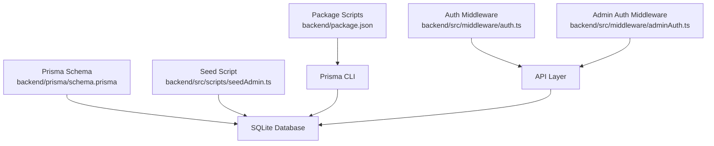
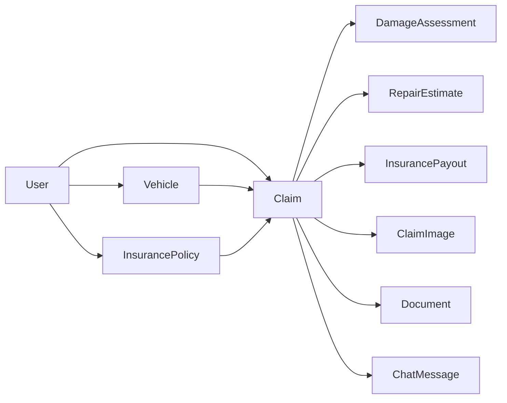
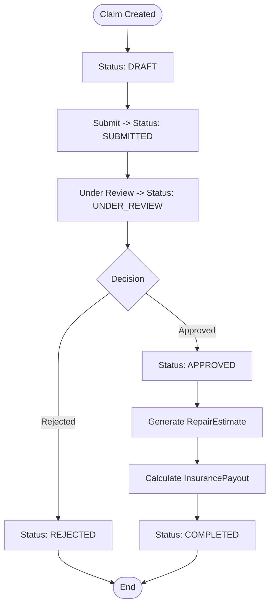

# Database Design

<cite>
**Referenced Files in This Document**
- [schema.prisma](file://backend/prisma/schema.prisma)
- [seedAdmin.ts](file://backend/src/scripts/seedAdmin.ts)
- [package.json](file://backend/package.json)
- [auth.ts](file://backend/src/middleware/auth.ts)
- [adminAuth.ts](file://backend/src/middleware/adminAuth.ts)
</cite>

## Table of Contents
1. [Introduction](#introduction)
2. [Project Structure](#project-structure)
3. [Core Components](#core-components)
4. [Architecture Overview](#architecture-overview)
5. [Detailed Component Analysis](#detailed-component-analysis)
6. [Dependency Analysis](#dependency-analysis)
7. [Performance Considerations](#performance-considerations)
8. [Data Lifecycle and Audit Trails](#data-lifecycle-and-audit-trails)
9. [Database Migration Strategy](#database-migration-strategy)
10. [Seeding Procedures](#seeding-procedures)
11. [Backup and Recovery](#backup-and-recovery)
12. [Security Considerations](#security-considerations)
13. [Troubleshooting Guide](#troubleshooting-guide)
14. [Conclusion](#conclusion)

## Introduction
This document provides comprehensive data model documentation for the Prisma ORM schema used by the Smart Vehicle Insurance Claim System. It details all entity relationships, field definitions, constraints, indexes, validation rules enforced at the database level, and operational guidance including migrations, seeding, backup/recovery, and security considerations. The system models users, vehicles, insurance policies, claims, damage assessments, repair estimates, payouts, documents, images, and chat messages to support end-to-end claim processing.

## Project Structure
The data model is defined in a single Prisma schema file. Supporting scripts provide admin seeding and environment configuration via package scripts. Authentication middleware enforces access control patterns that influence how data is accessed and updated.



**Diagram sources**
- [schema.prisma:1-202](file://backend/prisma/schema.prisma#L1-L202)
- [seedAdmin.ts:1-39](file://backend/src/scripts/seedAdmin.ts#L1-L39)
- [package.json:6-13](file://backend/package.json#L6-L13)
- [auth.ts:5-22](file://backend/src/middleware/auth.ts#L5-L22)
- [adminAuth.ts:6-26](file://backend/src/middleware/adminAuth.ts#L6-L26)

**Section sources**
- [schema.prisma:1-202](file://backend/prisma/schema.prisma#L1-L202)
- [package.json:6-13](file://backend/package.json#L6-L13)

## Core Components
The core data model centers on the following entities:
- User: Represents system users with authentication and profile fields.
- Vehicle: Owned by a user; linked to claims.
- InsurancePolicy: Owned by a user; optionally linked to claims.
- Claim: Central entity linking user, vehicle, and policy; includes status and incident metadata.
- DamageAssessment: One-to-one with Claim; stores AI-derived damages and severity.
- RepairEstimate: One-to-one with Claim; references DamageAssessment; stores cost breakdown.
- InsurancePayout: One-to-one with Claim; references RepairEstimate; stores payout calculations.
- ClaimImage: Images attached to a Claim with type and optional annotations.
- Document: Documents attached to a Claim with verification status.
- ChatMessage: Conversation history associated with a Claim.

Key relationships and constraints:
- User has many Vehicles, Policies, Claims.
- Vehicle belongs to a User; has many Claims.
- InsurancePolicy belongs to a User; has many Claims.
- Claim belongs to a User and a Vehicle; optionally belongs to an InsurancePolicy.
- DamageAssessment, RepairEstimate, InsurancePayout are each uniquely tied to a Claim (one-to-one).
- ClaimImage and Document belong to a Claim.
- ChatMessage belongs to a Claim.

Indexes and unique constraints:
- Primary keys are UUIDs for all entities.
- Unique constraints exist on email, and on claimId for ClaimImage, DamageAssessment, RepairEstimate, InsurancePayout.
- No explicit secondary indexes are declared beyond primary keys and unique constraints.

Validation rules enforced at the database level:
- Required fields are enforced by absence of nullable markers.
- Enumerations constrain values for ClaimStatus, ImageType, SeverityLevel, DocumentType, VerificationStatus, ChatRole.
- Default values are applied for timestamps and booleans where specified.

**Section sources**
- [schema.prisma:10-25](file://backend/prisma/schema.prisma#L10-L25)
- [schema.prisma:27-43](file://backend/prisma/schema.prisma#L27-L43)
- [schema.prisma:45-60](file://backend/prisma/schema.prisma#L45-L60)
- [schema.prisma:62-94](file://backend/prisma/schema.prisma#L62-L94)
- [schema.prisma:96-130](file://backend/prisma/schema.prisma#L96-L130)
- [schema.prisma:132-160](file://backend/prisma/schema.prisma#L132-L160)
- [schema.prisma:162-201](file://backend/prisma/schema.prisma#L162-L201)

## Architecture Overview
The data architecture uses SQLite as the database provider with Prisma Client for type-safe queries. The schema defines strong relational integrity through foreign keys and cascade behaviors. Enums enforce domain-specific constraints at the database layer.

```mermaid
erDiagram
USER {
string id PK
string email UK
string passwordHash
string firstName
string lastName
string phone
string address
boolean isAdmin
datetime createdAt
datetime updatedAt
}
VEHICLE {
string id PK
string userId FK
string make
string model
int year
string vin
string licensePlate
string color
int mileage
string photos
datetime createdAt
datetime updatedAt
}
INSURANCEPOLICY {
string id PK
string userId FK
string providerName
string policyNumber
string coverageType
float deductible
float premiumAmount
datetime startDate
datetime endDate
datetime createdAt
datetime updatedAt
}
CLAIM {
string id PK
string userId FK
string vehicleId FK
string policyId FK
enum status
datetime incidentDate
string incidentLocation
string incidentDescription
string weatherConditions
boolean hasPoliceReport
datetime createdAt
datetime updatedAt
}
CLAIMIMAGE {
string id PK
string claimId FK
enum type
string filePath
string label
json aiAnnotation
datetime uploadedAt
}
DAMAGEASSESSMENT {
string id PK
string claimId UK FK
json damages
string drivabilityAssessment
enum overallSeverity
json aiRawResponse
datetime assessedAt
}
REPAIRESTIMATE {
string id PK
string claimId UK FK
string damageAssessmentId UK FK
json items
float totalPartsCost
float totalLaborCost
float totalCost
int estimatedDays
datetime createdAt
}
INSURANCEPAYOUT {
string id PK
string claimId UK FK
string repairEstimateId UK FK
float deductible
float coveredAmount
float estimatedPayout
string notes
datetime createdAt
}
DOCUMENT {
string id PK
string claimId FK
enum type
string filePath
enum verificationStatus
json verificationResult
datetime uploadedAt
}
CHATMESSAGE {
string id PK
string claimId FK
enum role
string content
datetime createdAt
}
USER ||--o{ VEHICLE : "owns"
USER ||--o{ INSURANCEPOLICY : "owns"
USER ||--o{ CLAIM : "submits"
VEHICLE ||--o{ CLAIM : "involved_in"
INSURANCEPOLICY ||--o{ CLAIM : "covers"
CLAIM ||--o{ CLAIMIMAGE : "has"
CLAIM ||--|| DAMAGEASSESSMENT : "has"
CLAIM ||--|| REPAIRESTIMATE : "has"
CLAIM ||--|| INSURANCEPAYOUT : "has"
CLAIM ||--o{ DOCUMENT : "has"
CLAIM ||--o{ CHATMESSAGE : "has"
```

**Diagram sources**
- [schema.prisma:10-201](file://backend/prisma/schema.prisma#L10-L201)

## Detailed Component Analysis

### User Model
- Purpose: Stores user identity, credentials, and profile information.
- Key fields:
  - id: UUID primary key.
  - email: Unique string used for login.
  - passwordHash: Stored hashed password.
  - firstName, lastName: Profile names.
  - phone, address: Optional contact details.
  - isAdmin: Boolean flag for administrative access.
  - createdAt, updatedAt: Timestamps for audit.
- Relationships:
  - One-to-many with Vehicle, InsurancePolicy, Claim.
- Constraints:
  - email is unique.
  - isAdmin defaults to false.
  - Timestamps default to now or update automatically.

**Section sources**
- [schema.prisma:10-25](file://backend/prisma/schema.prisma#L10-L25)

### Vehicle Model
- Purpose: Represents vehicles owned by users.
- Key fields:
  - id: UUID primary key.
  - userId: Foreign key to User with cascade delete.
  - make, model, year, licensePlate, color: Identifying attributes.
  - vin, mileage: Optional identifiers and usage metrics.
  - photos: JSON array stored as string; defaults to empty array.
  - createdAt, updatedAt: Timestamps.
- Relationships:
  - Belongs to User; one-to-many with Claim.
- Constraints:
  - onDelete Cascade ensures referential integrity when a user is removed.

**Section sources**
- [schema.prisma:27-43](file://backend/prisma/schema.prisma#L27-L43)

### InsurancePolicy Model
- Purpose: Captures insurance coverage details per user.
- Key fields:
  - id: UUID primary key.
  - userId: Foreign key to User with cascade delete.
  - providerName, policyNumber, coverageType: Policy metadata.
  - deductible, premiumAmount: Numeric financial fields.
  - startDate, endDate: Coverage period.
  - createdAt, updatedAt: Timestamps.
- Relationships:
  - Belongs to User; one-to-many with Claim.
- Constraints:
  - onDelete Cascade ensures referential integrity when a user is removed.

**Section sources**
- [schema.prisma:45-60](file://backend/prisma/schema.prisma#L45-L60)

### Claim Model
- Purpose: Central record of an insurance claim event.
- Key fields:
  - id: UUID primary key.
  - userId: Foreign key to User with cascade delete.
  - vehicleId: Foreign key to Vehicle with cascade delete.
  - policyId: Optional foreign key to InsurancePolicy with SetNull behavior.
  - status: Enum constrained to predefined lifecycle states.
  - incidentDate, incidentLocation, incidentDescription: Incident details.
  - weatherConditions: Optional context.
  - hasPoliceReport: Boolean flag.
  - createdAt, updatedAt: Timestamps.
- Relationships:
  - Belongs to User and Vehicle; optionally to InsurancePolicy.
  - One-to-many with ClaimImage, Document, ChatMessage.
  - One-to-one with DamageAssessment, RepairEstimate, InsurancePayout.
- Constraints:
  - onDelete Cascade for User and Vehicle; SetNull for Policy to preserve claim records if policy is deleted.

**Section sources**
- [schema.prisma:62-94](file://backend/prisma/schema.prisma#L62-L94)

### DamageAssessment Model
- Purpose: Stores AI-assessed damages and severity for a claim.
- Key fields:
  - id: UUID primary key.
  - claimId: Unique foreign key to Claim with cascade delete.
  - damages: JSON payload describing damages.
  - drivabilityAssessment: Textual assessment.
  - overallSeverity: Enum constrained to MINOR/MODERATE/SEVERE.
  - aiRawResponse: Optional raw AI output.
  - assessedAt: Timestamp.
- Relationships:
  - One-to-one with Claim; optional one-to-one with RepairEstimate.
- Constraints:
  - claimId is unique to ensure single assessment per claim.

**Section sources**
- [schema.prisma:113-130](file://backend/prisma/schema.prisma#L113-L130)

### RepairEstimate Model
- Purpose: Provides detailed repair cost estimation for a claim.
- Key fields:
  - id: UUID primary key.
  - claimId: Unique foreign key to Claim with cascade delete.
  - damageAssessmentId: Unique foreign key to DamageAssessment with cascade delete.
  - items: JSON array of line items.
  - totalPartsCost, totalLaborCost, totalCost: Aggregated costs.
  - estimatedDays: Estimated repair duration.
  - createdAt: Timestamp.
- Relationships:
  - One-to-one with Claim; one-to-one with DamageAssessment; optional one-to-one with InsurancePayout.
- Constraints:
  - claimId and damageAssessmentId are unique to maintain strict linkage.

**Section sources**
- [schema.prisma:132-146](file://backend/prisma/schema.prisma#L132-L146)

### InsurancePayout Model
- Purpose: Records payout calculations based on repair estimates and deductibles.
- Key fields:
  - id: UUID primary key.
  - claimId: Unique foreign key to Claim with cascade delete.
  - repairEstimateId: Unique foreign key to RepairEstimate with cascade delete.
  - deductible, coveredAmount, estimatedPayout: Financial figures.
  - notes: Optional commentary.
  - createdAt: Timestamp.
- Relationships:
  - One-to-one with Claim; one-to-one with RepairEstimate.
- Constraints:
  - claimId and repairEstimateId are unique to ensure single payout per claim/estimate.

**Section sources**
- [schema.prisma:148-160](file://backend/prisma/schema.prisma#L148-L160)

### ClaimImage Model
- Purpose: Stores image attachments related to claims.
- Key fields:
  - id: UUID primary key.
  - claimId: Foreign key to Claim with cascade delete.
  - type: Enum FULL_VEHICLE or DAMAGE_CLOSEUP.
  - filePath: Path to stored image.
  - label: Optional descriptive label.
  - aiAnnotation: Optional JSON annotation from AI analysis.
  - uploadedAt: Timestamp.
- Relationships:
  - Belongs to Claim.
- Constraints:
  - onDelete Cascade preserves referential integrity.

**Section sources**
- [schema.prisma:96-111](file://backend/prisma/schema.prisma#L96-L111)

### Document Model
- Purpose: Stores supporting documents for claims with verification status.
- Key fields:
  - id: UUID primary key.
  - claimId: Foreign key to Claim with cascade delete.
  - type: Enum LICENSE/REGISTRATION/ACCIDENT_REPORT/REPAIR_ESTIMATE.
  - filePath: Path to stored document.
  - verificationStatus: Enum PENDING/VERIFIED/ISSUES_FOUND/UNREADABLE.
  - verificationResult: Optional JSON result of verification.
  - uploadedAt: Timestamp.
- Relationships:
  - Belongs to Claim.
- Constraints:
  - onDelete Cascade ensures cleanup when claims are removed.

**Section sources**
- [schema.prisma:162-186](file://backend/prisma/schema.prisma#L162-L186)

### ChatMessage Model
- Purpose: Maintains conversation history for a claim.
- Key fields:
  - id: UUID primary key.
  - claimId: Foreign key to Claim with cascade delete.
  - role: Enum USER or ASSISTANT.
  - content: Message text.
  - createdAt: Timestamp.
- Relationships:
  - Belongs to Claim.
- Constraints:
  - onDelete Cascade maintains consistency.

**Section sources**
- [schema.prisma:188-201](file://backend/prisma/schema.prisma#L188-L201)

## Dependency Analysis
The data model exhibits clear hierarchical dependencies:
- User is the root entity for Vehicle and InsurancePolicy.
- Claim depends on User and Vehicle; optionally on InsurancePolicy.
- DamageAssessment, RepairEstimate, and InsurancePayout depend on Claim.
- ClaimImage, Document, and ChatMessage depend on Claim.



**Diagram sources**
- [schema.prisma:10-201](file://backend/prisma/schema.prisma#L10-L201)

**Section sources**
- [schema.prisma:10-201](file://backend/prisma/schema.prisma#L10-L201)

## Performance Considerations
- Indexing strategy:
  - Primary keys are indexed by default.
  - Unique constraints on email and claimId fields provide efficient lookups for those paths.
  - No additional secondary indexes are declared; consider adding indexes on frequently queried columns such as userId, vehicleId, policyId, and status if query performance degrades under load.
- Data types:
  - Use enums to restrict values and reduce validation overhead.
  - Store complex structures as JSON where appropriate (e.g., damages, items, aiAnnotation) to avoid excessive normalization while maintaining flexibility.
- Referential integrity:
  - Cascade deletes simplify cleanup but can cause large deletions; use cautiously in high-volume environments.
- Storage:
  - Photos stored as JSON arrays of strings; ensure file storage backend is optimized for large objects.

[No sources needed since this section provides general guidance]

## Data Lifecycle and Audit Trails
Lifecycle stages:
- Creation:
  - Users create accounts; vehicles and policies are added.
  - Claims are created with status DRAFT and populated with incident details.
- Updates:
  - Status transitions progress through SUBMITTED, UNDER_REVIEW, APPROVED, REJECTED, COMPLETED.
  - DamageAssessment and RepairEstimate are generated post-submission.
  - InsurancePayout is calculated after estimate approval.
- Archival:
  - Soft delete pattern is not implemented in the schema; deletion cascades remove related records.
  - For archival needs, introduce a soft delete flag (e.g., deletedAt) and adjust queries accordingly.
- Audit trails:
  - createdAt and updatedAt timestamps provide basic auditability.
  - Consider adding explicit audit tables or triggers for change tracking if required.



**Diagram sources**
- [schema.prisma:62-94](file://backend/prisma/schema.prisma#L62-L94)
- [schema.prisma:132-160](file://backend/prisma/schema.prisma#L132-L160)

**Section sources**
- [schema.prisma:62-94](file://backend/prisma/schema.prisma#L62-L94)
- [schema.prisma:132-160](file://backend/prisma/schema.prisma#L132-L160)

## Database Migration Strategy
- Provider: SQLite configured in the Prisma datasource.
- Development workflow:
  - Use Prisma migration commands to evolve schema changes safely.
  - Generate client code before running the application to ensure type safety.
- Recommended practices:
  - Version control schema changes via migrations.
  - Test migrations in a staging environment before applying to production.
  - Back up the database prior to major schema changes.

**Section sources**
- [schema.prisma:5-8](file://backend/prisma/schema.prisma#L5-L8)
- [package.json:6-13](file://backend/package.json#L6-L13)

## Seeding Procedures
- Admin seeding script:
  - Creates an initial admin user with a hashed password if none exists.
  - Ensures the admin flag is set for existing users.
- Execution:
  - Run the seed script against the development database to bootstrap administrative access.
- Security note:
  - Replace default credentials in production with secure provisioning processes.

**Section sources**
- [seedAdmin.ts:9-34](file://backend/src/scripts/seedAdmin.ts#L9-L34)

## Backup and Recovery
- SQLite considerations:
  - Use consistent snapshots or WAL mode backups to avoid corruption.
  - Schedule regular backups of the database file.
- Recovery steps:
  - Restore from the latest known-good backup.
  - Validate integrity after restore using Prisma introspection or simple queries.
- Operational tips:
  - Automate backups and retention policies.
  - Test recovery procedures periodically.

[No sources needed since this section provides general guidance]

## Security Considerations
- Sensitive field protection:
  - Passwords are stored as hashes; never store plaintext passwords.
  - Avoid logging sensitive fields like passwordHash or personal identifiers.
- Access control patterns:
  - JWT-based authentication middleware validates tokens and attaches user context.
  - Admin-only routes require both valid token and admin privileges.
- Data minimization:
  - Only expose necessary fields in API responses.
  - Mask or omit sensitive data in logs and error messages.
- Input validation:
  - Leverage Prisma enums and required fields to enforce constraints at the database level.
  - Apply application-level validation (e.g., Zod) for additional safety.

**Section sources**
- [auth.ts:5-22](file://backend/src/middleware/auth.ts#L5-L22)
- [adminAuth.ts:6-26](file://backend/src/middleware/adminAuth.ts#L6-L26)
- [schema.prisma:10-25](file://backend/prisma/schema.prisma#L10-L25)

## Troubleshooting Guide
Common issues and resolutions:
- Authentication failures:
  - Ensure JWT_SECRET is configured and tokens are valid.
  - Verify Authorization header format and token presence.
- Admin access denied:
  - Confirm user has isAdmin flag set and token is valid.
- Data integrity errors:
  - Check foreign key constraints and cascade behaviors when deleting records.
  - Validate enum values match schema definitions.
- Migration conflicts:
  - Roll back migrations carefully and reapply changes in a controlled manner.

**Section sources**
- [auth.ts:5-22](file://backend/src/middleware/auth.ts#L5-L22)
- [adminAuth.ts:6-26](file://backend/src/middleware/adminAuth.ts#L6-L26)
- [schema.prisma:62-201](file://backend/prisma/schema.prisma#L62-L201)

## Conclusion
The Prisma schema defines a robust, well-constrained data model tailored for vehicle insurance claim processing. Strong relationships, enums, and timestamps provide reliability and auditability. To enhance scalability and compliance, consider adding indexes, implementing soft deletes, and strengthening backup and security procedures. Migrations and seeding scripts streamline development workflows, while middleware ensures secure access to sensitive data.