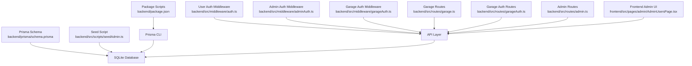
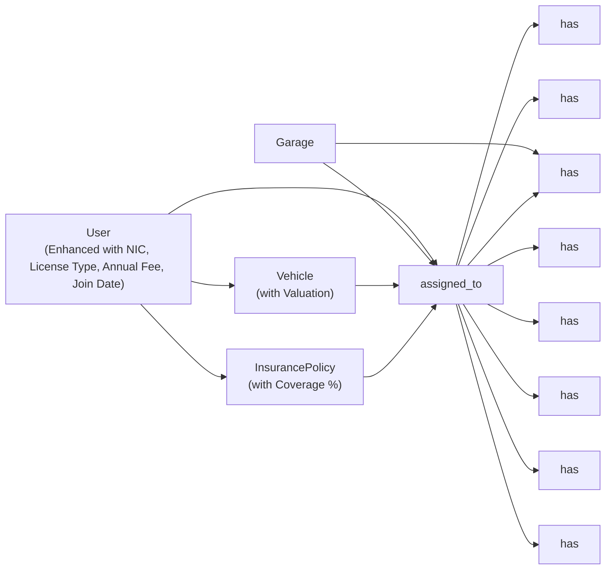
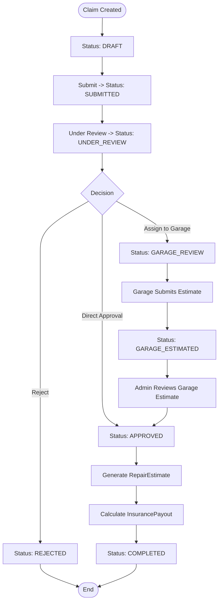

# Database Design

<cite>
**Referenced Files in This Document**
- [schema.prisma](file://backend/prisma/schema.prisma)
- [seedAdmin.ts](file://backend/src/scripts/seedAdmin.ts)
- [package.json](file://backend/package.json)
- [auth.ts](file://backend/src/middleware/auth.ts)
- [adminAuth.ts](file://backend/src/middleware/adminAuth.ts)
- [garageAuth.ts](file://backend/src/middleware/garageAuth.ts)
- [garage.ts](file://backend/src/routes/garage.ts)
- [garageAuth.ts](file://backend/src/routes/garageAuth.ts)
- [admin.ts](file://backend/src/routes/admin.ts)
- [index.ts](file://frontend/src/types/index.ts)
- [AdminUsersPage.tsx](file://frontend/src/pages/admin/AdminUsersPage.tsx)
</cite>

## Update Summary
**Changes Made**
- Extended User model with five new fields for insurance company administrative workflow: nic (National Identity Card number), licenseType (driving license class), annualFee (annual insurance fee in LKR), and joinedAt (user registration date)
- Updated admin API endpoints to support reading and updating the new user fields
- Enhanced frontend admin interface with forms for managing insurance company records
- Added validation and type definitions for the new fields across the application stack

## Table of Contents
1. [Introduction](#introduction)
2. [Project Structure](#project-structure)
3. [Core Components](#core-components)
4. [Architecture Overview](#architecture-overview)
5. [Detailed Component Analysis](#detailed-component-analysis)
6. [Dependency Analysis](#dependency-analysis)
7. [Performance Considerations](#performance-considerations)
8. [Data Lifecycle and Audit Trails](#data-lifecycle-and-audit-trails)
9. [Database Migration Strategy](#database-migration-strategy)
10. [Seeding Procedures](#seeding-procedures)
11. [Backup and Recovery](#backup-and-recovery)
12. [Security Considerations](#security-considerations)
13. [Troubleshooting Guide](#troubleshooting-guide)
14. [Conclusion](#conclusion)

## Introduction
This document provides comprehensive data model documentation for the Prisma ORM schema used by the Smart Vehicle Insurance Claim System. It details all entity relationships, field definitions, constraints, indexes, validation rules enforced at the database level, and operational guidance including migrations, seeding, backup/recovery, and security considerations. The system models users, vehicles, insurance policies, claims, damage assessments, repair estimates, garage assignments, garage estimates, payouts, documents, images, and chat messages to support end-to-end claim processing with integrated garage workflow capabilities and enhanced insurance company administrative features.

## Project Structure
The data model is defined in a single Prisma schema file. Supporting scripts provide admin seeding and environment configuration via package scripts. Authentication middleware enforces access control patterns that influence how data is accessed and updated, including specialized garage authentication for repair shop workflows and enhanced administrative capabilities for insurance company operations.



**Diagram sources**
- [schema.prisma:1-282](file://backend/prisma/schema.prisma#L1-L282)
- [seedAdmin.ts:1-39](file://backend/src/scripts/seedAdmin.ts#L1-L39)
- [package.json:6-13](file://backend/package.json#L6-L13)
- [auth.ts:5-22](file://backend/src/middleware/auth.ts#L5-L22)
- [adminAuth.ts:6-26](file://backend/src/middleware/adminAuth.ts#L6-L26)
- [garageAuth.ts:1-31](file://backend/src/middleware/garageAuth.ts#L1-L31)
- [garage.ts:1-136](file://backend/src/routes/garage.ts#L1-L136)
- [garageAuth.ts:1-135](file://backend/src/routes/garageAuth.ts#L1-L135)
- [admin.ts:1-591](file://backend/src/routes/admin.ts#L1-L591)
- [AdminUsersPage.tsx:1-250](file://frontend/src/pages/admin/AdminUsersPage.tsx#L1-L250)

**Section sources**
- [schema.prisma:1-282](file://backend/prisma/schema.prisma#L1-L282)
- [package.json:6-13](file://backend/package.json#L6-L13)

## Core Components
The core data model centers on the following entities:
- **User**: Represents system users with authentication, profile fields, and enhanced insurance company administrative data including NIC, license type, annual fees, and registration dates.
- Vehicle: Owned by a user; linked to claims.
- InsurancePolicy: Owned by a user; optionally linked to claims.
- Garage: New entity representing repair shops with authentication and approval workflow.
- Claim: Central entity linking user, vehicle, policy, and garage; includes status and incident metadata with enhanced workflow states.
- DamageAssessment: One-to-one with Claim; stores AI-derived damages and severity.
- RepairEstimate: One-to-one with Claim; references DamageAssessment; stores cost breakdown.
- GarageEstimate: New one-to-one with Claim; stores garage-submitted repair estimates.
- InsurancePayout: One-to-one with Claim; references RepairEstimate; stores payout calculations.
- ClaimImage: Images attached to a Claim with type and optional annotations.
- Document: Documents attached to a Claim with verification status.
- ChatMessage: Conversation history associated with a Claim.
- AdminNote: Administrative notes for claims.

Key relationships and constraints:
- User has many Vehicles, Policies, Claims.
- Vehicle belongs to a User; has many Claims.
- InsurancePolicy belongs to a User; has many Claims.
- Garage has many Claims and GarageEstimates.
- Claim belongs to a User, Vehicle, and optionally InsurancePolicy and Garage.
- DamageAssessment, RepairEstimate, GarageEstimate, and InsurancePayout are each uniquely tied to a Claim (one-to-one).
- ClaimImage, Document, and ChatMessage belong to a Claim.
- AdminNote belongs to a Claim.

Indexes and unique constraints:
- Primary keys are UUIDs for all entities.
- Unique constraints exist on email (User and Garage), and on claimId for ClaimImage, DamageAssessment, RepairEstimate, GarageEstimate, InsurancePayout.
- No explicit secondary indexes are declared beyond primary keys and unique constraints.

Validation rules enforced at the database level:
- Required fields are enforced by absence of nullable markers.
- Enumerations constrain values for ClaimStatus, ImageType, SeverityLevel, DocumentType, VerificationStatus, ChatRole.
- Default values are applied for timestamps and booleans where specified.

**Updated** Enhanced User model with insurance company administrative fields (nic, licenseType, annualFee, joinedAt) to support comprehensive user management and policy administration workflows.

**Section sources**
- [schema.prisma:10-30](file://backend/prisma/schema.prisma#L10-L30)
- [schema.prisma:32-50](file://backend/prisma/schema.prisma#L32-L50)
- [schema.prisma:68-86](file://backend/prisma/schema.prisma#L68-L86)
- [schema.prisma:246-264](file://backend/prisma/schema.prisma#L246-L264)
- [schema.prisma:99-126](file://backend/prisma/schema.prisma#L99-L126)
- [schema.prisma:151-162](file://backend/prisma/schema.prisma#L151-L162)
- [schema.prisma:164-178](file://backend/prisma/schema.prisma#L164-L178)
- [schema.prisma:266-281](file://backend/prisma/schema.prisma#L266-L281)
- [schema.prisma:180-192](file://backend/prisma/schema.prisma#L180-L192)
- [schema.prisma:133-143](file://backend/prisma/schema.prisma#L133-L143)
- [schema.prisma:208-218](file://backend/prisma/schema.prisma#L208-L218)
- [schema.prisma:225-233](file://backend/prisma/schema.prisma#L225-L233)
- [schema.prisma:235-244](file://backend/prisma/schema.prisma#L235-L244)

## Architecture Overview
The data architecture uses SQLite as the database provider with Prisma Client for type-safe queries. The schema defines strong relational integrity through foreign keys and cascade behaviors. Enums enforce domain-specific constraints at the database layer, including enhanced claim workflow states supporting garage integration and comprehensive insurance company administrative capabilities.

```mermaid
erDiagram
USER {
string id PK
string email UK
string passwordHash
string firstName
string lastName
string phone
string address
string nic
string licenseType
float annualFee
datetime joinedAt
boolean isAdmin
datetime createdAt
datetime updatedAt
}
VEHICLE {
string id PK
string userId FK
string make
string model
int year
string vin
string licensePlate
string color
int mileage
string photos
float valuation
datetime createdAt
datetime updatedAt
}
INSURANCEPOLICY {
string id PK
string userId FK
string providerName
string policyNumber
string coverageType
float deductible
float premiumAmount
float coveragePercent
string templateId
datetime startDate
datetime endDate
datetime createdAt
datetime updatedAt
}
GARAGE {
string id PK
string email UK
string passwordHash
string name
string ownerName
string phone
string address
string city
string licenseNumber
string specialties
boolean isActive
boolean isApproved
datetime createdAt
datetime updatedAt
}
CLAIM {
string id PK
string userId FK
string vehicleId FK
string policyId FK
enum status
string garageId FK
datetime incidentDate
string incidentLocation
string incidentDescription
string weatherConditions
boolean hasPoliceReport
datetime createdAt
datetime updatedAt
}
CLAIMIMAGE {
string id PK
string claimId FK
enum type
string filePath
string label
json aiAnnotation
datetime uploadedAt
}
DAMAGEASSESSMENT {
string id PK
string claimId UK FK
json damages
string drivabilityAssessment
enum overallSeverity
json aiRawResponse
datetime assessedAt
}
REPAIRESTIMATE {
string id PK
string claimId UK FK
string damageAssessmentId UK FK
json items
float totalPartsCost
float totalLaborCost
float totalCost
int estimatedDays
datetime createdAt
}
GARAGEESTIMATE {
string id PK
string claimId UK FK
string garageId FK
json items
float totalPartsCost
float totalLaborCost
float totalCost
int estimatedDays
string notes
datetime submittedAt
datetime updatedAt
}
INSURANCEPAYOUT {
string id PK
string claimId UK FK
string repairEstimateId UK FK
float deductible
float coveredAmount
float estimatedPayout
string notes
datetime createdAt
}
DOCUMENT {
string id PK
string claimId FK
enum type
string filePath
enum verificationStatus
json verificationResult
datetime uploadedAt
}
CHATMESSAGE {
string id PK
string claimId FK
enum role
string content
datetime createdAt
}
ADMINNOTE {
string id PK
string claimId FK
string category
string content
datetime createdAt
datetime updatedAt
}
USER ||--o{ VEHICLE : "owns"
USER ||--o{ INSURANCEPOLICY : "owns"
USER ||--o{ CLAIM : "submits"
VEHICLE ||--o{ CLAIM : "involved_in"
INSURANCEPOLICY ||--o{ CLAIM : "covers"
GARAGE ||--o{ CLAIM : "handles"
GARAGE ||--o{ GARAGEESTIMATE : "submits"
CLAIM ||--o{ CLAIMIMAGE : "has"
CLAIM ||--|| DAMAGEASSESSMENT : "has"
CLAIM ||--|| REPAIRESTIMATE : "has"
CLAIM ||--|| GARAGEESTIMATE : "has"
CLAIM ||--|| INSURANCEPAYOUT : "has"
CLAIM ||--o{ DOCUMENT : "has"
CLAIM ||--o{ CHATMESSAGE : "has"
CLAIM ||--o{ ADMINNOTE : "has"
```

**Diagram sources**
- [schema.prisma:10-281](file://backend/prisma/schema.prisma#L10-L281)

## Detailed Component Analysis

### User Model
- Purpose: Stores user identity, credentials, profile information, and insurance company administrative data.
- Key fields:
  - id: UUID primary key.
  - email: Unique string used for login.
  - passwordHash: Stored hashed password.
  - firstName, lastName: Profile names.
  - phone, address: Optional contact details.
  - **nic**: Optional National Identity Card number for user registration and identification.
  - **licenseType**: Optional driving license class (e.g., A, B, B1, C) for vehicle operation authorization.
  - **annualFee**: Optional annual insurance fee in Sri Lankan Rupees (LKR) for policy billing.
  - **joinedAt**: Optional timestamp indicating when the user registered with the insurance company.
  - isAdmin: Boolean flag for administrative access.
  - createdAt, updatedAt: Timestamps for audit.
- Relationships:
  - One-to-many with Vehicle, InsurancePolicy, Claim.
- Constraints:
  - email is unique.
  - isAdmin defaults to false.
  - Timestamps default to now or update automatically.
  - All new insurance company fields are optional to maintain backward compatibility.

**Updated** Enhanced with four new insurance company administrative fields to support comprehensive user management, policy administration, and regulatory compliance requirements.

**Section sources**
- [schema.prisma:10-30](file://backend/prisma/schema.prisma#L10-L30)

### Vehicle Model
- Purpose: Represents vehicles owned by users.
- Key fields:
  - id: UUID primary key.
  - userId: Foreign key to User with cascade delete.
  - make, model, year, licensePlate, color: Identifying attributes.
  - vin, mileage: Optional identifiers and usage metrics.
  - photos: JSON array stored as string; defaults to empty array.
  - **valuation**: Optional vehicle value in LKR set by insurance company to cap claim payouts.
  - createdAt, updatedAt: Timestamps.
- Relationships:
  - Belongs to User; one-to-many with Claim.
- Constraints:
  - onDelete Cascade ensures referential integrity when a user is removed.

**Updated** Added valuation field for insurance company to set vehicle values that cap claim payouts.

**Section sources**
- [schema.prisma:32-50](file://backend/prisma/schema.prisma#L32-L50)

### InsurancePolicy Model
- Purpose: Captures insurance coverage details per user.
- Key fields:
  - id: UUID primary key.
  - userId: Foreign key to User with cascade delete.
  - providerName, policyNumber, coverageType: Policy metadata.
  - deductible, premiumAmount: Numeric financial fields.
  - **coveragePercent**: Percentage of remaining cost covered after deductible (defaults to 100%).
  - **templateId**: Optional reference to built-in policy templates.
  - startDate, endDate: Coverage period.
  - createdAt, updatedAt: Timestamps.
- Relationships:
  - Belongs to User; one-to-many with Claim.
  - Optional relationship to PolicyTemplate.
- Constraints:
  - onDelete Cascade ensures referential integrity when a user is removed.

**Updated** Enhanced with coverage percentage and template support for standardized policy management.

**Section sources**
- [schema.prisma:68-86](file://backend/prisma/schema.prisma#L68-L86)

### Garage Model
- Purpose: Represents repair shops with authentication and approval workflow.
- Key fields:
  - id: UUID primary key.
  - email: Unique string used for garage authentication.
  - passwordHash: Stored hashed password for garage login.
  - name: Garage business name.
  - ownerName: Owner's personal name.
  - phone, address, city: Contact and location information.
  - licenseNumber: Business license identifier.
  - specialties: String containing JSON array of repair specialties; defaults to empty array.
  - isActive: Boolean flag for account activation; defaults to true.
  - isApproved: Boolean flag requiring admin approval; defaults to false.
  - createdAt, updatedAt: Timestamps for audit.
- Relationships:
  - One-to-many with Claim and GarageEstimate.
- Constraints:
  - email is unique.
  - isApproved requires admin approval before garage can log in.
  - isActive controls account availability.

**Updated** New model added to support repair shop integration with authentication and approval workflow.

**Section sources**
- [schema.prisma:246-264](file://backend/prisma/schema.prisma#L246-L264)

### Claim Model
- Purpose: Central record of an insurance claim event with enhanced workflow support.
- Key fields:
  - id: UUID primary key.
  - userId: Foreign key to User with cascade delete.
  - vehicleId: Foreign key to Vehicle with cascade delete.
  - policyId: Optional foreign key to InsurancePolicy with SetNull behavior.
  - **garageId**: Optional foreign key to Garage with SetNull behavior for garage assignment.
  - status: Enum constrained to predefined lifecycle states including garage workflow states.
  - incidentDate, incidentLocation, incidentDescription: Incident details.
  - weatherConditions: Optional context.
  - hasPoliceReport: Boolean flag.
  - createdAt, updatedAt: Timestamps.
- Relationships:
  - Belongs to User and Vehicle; optionally to InsurancePolicy and Garage.
  - One-to-many with ClaimImage, Document, ChatMessage, AdminNote.
  - One-to-one with DamageAssessment, RepairEstimate, GarageEstimate, InsurancePayout.
- Constraints:
  - onDelete Cascade for User and Vehicle; SetNull for Policy and Garage to preserve claim records if deleted.

**Updated** Enhanced with garage assignment capability and expanded claim status workflow states.

**Section sources**
- [schema.prisma:99-126](file://backend/prisma/schema.prisma#L99-L126)

### DamageAssessment Model
- Purpose: Stores AI-assessed damages and severity for a claim.
- Key fields:
  - id: UUID primary key.
  - claimId: Unique foreign key to Claim with cascade delete.
  - damages: JSON payload describing damages.
  - drivabilityAssessment: Textual assessment.
  - overallSeverity: Enum constrained to MINOR/MODERATE/SEVERE.
  - aiRawResponse: Optional raw AI output.
  - assessedAt: Timestamp.
- Relationships:
  - One-to-one with Claim; optional one-to-one with RepairEstimate.
- Constraints:
  - claimId is unique to ensure single assessment per claim.

**Section sources**
- [schema.prisma:151-162](file://backend/prisma/schema.prisma#L151-L162)

### RepairEstimate Model
- Purpose: Provides detailed repair cost estimation for a claim.
- Key fields:
  - id: UUID primary key.
  - claimId: Unique foreign key to Claim with cascade delete.
  - damageAssessmentId: Unique foreign key to DamageAssessment with cascade delete.
  - items: JSON array of line items.
  - totalPartsCost, totalLaborCost, totalCost: Aggregated costs.
  - estimatedDays: Estimated repair duration.
  - createdAt: Timestamp.
- Relationships:
  - One-to-one with Claim; one-to-one with DamageAssessment; optional one-to-one with InsurancePayout.
- Constraints:
  - claimId and damageAssessmentId are unique to maintain strict linkage.

**Section sources**
- [schema.prisma:164-178](file://backend/prisma/schema.prisma#L164-L178)

### GarageEstimate Model
- Purpose: Stores repair estimates submitted by garages for assigned claims.
- Key fields:
  - id: UUID primary key.
  - claimId: Unique foreign key to Claim with cascade delete.
  - garageId: Foreign key to Garage with cascade delete.
  - items: JSON array of repair line items.
  - totalPartsCost, totalLaborCost, totalCost: Aggregated costs.
  - estimatedDays: Estimated repair duration.
  - notes: Optional commentary from garage.
  - submittedAt: Timestamp for estimate submission.
  - updatedAt: Timestamp for updates.
- Relationships:
  - One-to-one with Claim; belongs to Garage.
- Constraints:
  - claimId is unique to ensure single garage estimate per claim.
  - onDelete Cascade ensures cleanup when related records are deleted.

**Updated** New model added to support garage-submitted repair estimates with full audit trail.

**Section sources**
- [schema.prisma:266-281](file://backend/prisma/schema.prisma#L266-L281)

### InsurancePayout Model
- Purpose: Records payout calculations based on repair estimates and deductibles.
- Key fields:
  - id: UUID primary key.
  - claimId: Unique foreign key to Claim with cascade delete.
  - repairEstimateId: Unique foreign key to RepairEstimate with cascade delete.
  - deductible, coveredAmount, estimatedPayout: Financial figures.
  - notes: Optional commentary.
  - createdAt: Timestamp.
- Relationships:
  - One-to-one with Claim; one-to-one with RepairEstimate.
- Constraints:
  - claimId and repairEstimateId are unique to ensure single payout per claim/estimate.

**Section sources**
- [schema.prisma:180-192](file://backend/prisma/schema.prisma#L180-L192)

### ClaimImage Model
- Purpose: Stores image attachments related to claims.
- Key fields:
  - id: UUID primary key.
  - claimId: Foreign key to Claim with cascade delete.
  - type: Enum FULL_VEHICLE or DAMAGE_CLOSEUP.
  - filePath: Path to stored image.
  - label: Optional descriptive label.
  - aiAnnotation: Optional JSON annotation from AI analysis.
  - uploadedAt: Timestamp.
- Relationships:
  - Belongs to Claim.
- Constraints:
  - onDelete Cascade preserves referential integrity.

**Section sources**
- [schema.prisma:133-143](file://backend/prisma/schema.prisma#L133-L143)

### Document Model
- Purpose: Stores supporting documents for claims with verification status.
- Key fields:
  - id: UUID primary key.
  - claimId: Foreign key to Claim with cascade delete.
  - type: Enum LICENSE/REGISTRATION/ACCIDENT_REPORT/REPAIR_ESTIMATE.
  - filePath: Path to stored document.
  - verificationStatus: Enum PENDING/VERIFIED/ISSUES_FOUND/UNREADABLE.
  - verificationResult: Optional JSON result of verification.
  - uploadedAt: Timestamp.
- Relationships:
  - Belongs to Claim.
- Constraints:
  - onDelete Cascade ensures cleanup when claims are removed.

**Section sources**
- [schema.prisma:208-218](file://backend/prisma/schema.prisma#L208-L218)

### ChatMessage Model
- Purpose: Maintains conversation history for a claim.
- Key fields:
  - id: UUID primary key.
  - claimId: Foreign key to Claim with cascade delete.
  - role: Enum USER or ASSISTANT.
  - content: Message text.
  - createdAt: Timestamp.
- Relationships:
  - Belongs to Claim.
- Constraints:
  - onDelete Cascade maintains consistency.

**Section sources**
- [schema.prisma:225-233](file://backend/prisma/schema.prisma#L225-L233)

### AdminNote Model
- Purpose: Stores administrative notes for claims with categorization.
- Key fields:
  - id: UUID primary key.
  - claimId: Foreign key to Claim with cascade delete.
  - category: String field for note categorization ("vehicle" | "document" | "general").
  - content: Note text content.
  - createdAt, updatedAt: Timestamps for audit.
- Relationships:
  - Belongs to Claim.
- Constraints:
  - onDelete Cascade ensures cleanup when claims are removed.

**Section sources**
- [schema.prisma:235-244](file://backend/prisma/schema.prisma#L235-L244)

## Dependency Analysis
The data model exhibits clear hierarchical dependencies with enhanced insurance company administrative capabilities:
- User is the root entity for Vehicle and InsurancePolicy, now with enhanced administrative data.
- Garage is an independent entity with its own authentication and approval workflow.
- Claim depends on User, Vehicle, and optionally InsurancePolicy and Garage.
- DamageAssessment, RepairEstimate, GarageEstimate, and InsurancePayout depend on Claim.
- ClaimImage, Document, ChatMessage, and AdminNote depend on Claim.



**Diagram sources**
- [schema.prisma:10-281](file://backend/prisma/schema.prisma#L10-L281)

**Section sources**
- [schema.prisma:10-281](file://backend/prisma/schema.prisma#L10-L281)

## Performance Considerations
- Indexing strategy:
  - Primary keys are indexed by default.
  - Unique constraints on email (User and Garage) and claimId fields provide efficient lookups for those paths.
  - No additional secondary indexes are declared; consider adding indexes on frequently queried columns such as userId, vehicleId, policyId, garageId, and status if query performance degrades under load.
- Data types:
  - Use enums to restrict values and reduce validation overhead.
  - Store complex structures as JSON where appropriate (e.g., damages, items, aiAnnotation, specialties) to avoid excessive normalization while maintaining flexibility.
- Referential integrity:
  - Cascade deletes simplify cleanup but can cause large deletions; use cautiously in high-volume environments.
- Storage:
  - Photos stored as JSON arrays of strings; ensure file storage backend is optimized for large objects.
  - Specialties stored as JSON arrays for flexible skill categorization.
  - **New insurance company fields (nic, licenseType, annualFee, joinedAt) are optional to minimize storage overhead for existing users**.

[No sources needed since this section provides general guidance]

## Data Lifecycle and Audit Trails
Lifecycle stages with enhanced insurance company administrative workflow:
- Creation:
  - Users create accounts; vehicles and policies are added.
  - **Insurance company administrators can populate user records with NIC, license type, annual fees, and join dates**.
  - Garages register and require admin approval before becoming active.
  - Claims are created with status DRAFT and populated with incident details.
- Updates:
  - Status transitions progress through SUBMITTED, UNDER_REVIEW, GARAGE_REVIEW, GARAGE_ESTIMATED, APPROVED, REJECTED, COMPLETED.
  - **Administrators can update user insurance company records including NIC validation, license type assignment, and fee management**.
  - Claims can be assigned to garages for repair assessment.
  - DamageAssessment and RepairEstimate are generated post-submission.
  - GarageEstimate is submitted by assigned garages during GARAGE_REVIEW phase.
  - InsurancePayout is calculated after estimate approval.
- Archival:
  - Soft delete pattern is not implemented in the schema; deletion cascades remove related records.
  - For archival needs, introduce a soft delete flag (e.g., deletedAt) and adjust queries accordingly.
- Audit trails:
  - createdAt and updatedAt timestamps provide basic auditability.
  - **Insurance company administrative actions tracked through dedicated admin routes and validation**.
  - Garage authentication and approval workflow tracked through isApproved and isActive flags.
  - GarageEstimate includes submittedAt timestamp for estimate submission tracking.
  - Consider adding explicit audit tables or triggers for change tracking if required.



**Diagram sources**
- [schema.prisma:88-97](file://backend/prisma/schema.prisma#L88-L97)
- [schema.prisma:99-126](file://backend/prisma/schema.prisma#L99-L126)
- [schema.prisma:266-281](file://backend/prisma/schema.prisma#L266-L281)

**Section sources**
- [schema.prisma:88-97](file://backend/prisma/schema.prisma#L88-L97)
- [schema.prisma:99-126](file://backend/prisma/schema.prisma#L99-L126)
- [schema.prisma:266-281](file://backend/prisma/schema.prisma#L266-L281)

## Database Migration Strategy
- Provider: SQLite configured in the Prisma datasource.
- Development workflow:
  - Use Prisma migration commands to evolve schema changes safely.
  - Generate client code before running the application to ensure type safety.
- Recommended practices:
  - Version control schema changes via migrations.
  - Test migrations in a staging environment before applying to production.
  - Back up the database prior to major schema changes.
  - **Test insurance company administrative workflow thoroughly before deployment**.
  - **Validate new user fields (NIC, license type, annual fees, join dates) in development environment**.

**Section sources**
- [schema.prisma:5-8](file://backend/prisma/schema.prisma#L5-L8)
- [package.json:6-13](file://backend/package.json#L6-L13)

## Seeding Procedures
- Admin seeding script:
  - Creates an initial admin user with a hashed password if none exists.
  - Ensures the admin flag is set for existing users.
- Execution:
  - Run the seed script against the development database to bootstrap administrative access.
- Security note:
  - Replace default credentials in production with secure provisioning processes.
- **Insurance company user seeding**:
  - **Consider creating test user accounts with various insurance company records for development testing**.
  - **Include users with different NIC formats, license types, annual fees, and join dates**.
  - **Test admin API endpoints for updating user insurance company records**.

**Section sources**
- [seedAdmin.ts:9-34](file://backend/src/scripts/seedAdmin.ts#L9-L34)

## Backup and Recovery
- SQLite considerations:
  - Use consistent snapshots or WAL mode backups to avoid corruption.
  - Schedule regular backups of the database file.
- Recovery steps:
  - Restore from the latest known-good backup.
  - Validate integrity after restore using Prisma introspection or simple queries.
- Operational tips:
  - Automate backups and retention policies.
  - Test recovery procedures periodically.
  - **Ensure insurance company administrative data integrity during recovery**.
  - **Verify user insurance company records (NIC, license type, annual fees) remain consistent after backup restoration**.

[No sources needed since this section provides general guidance]

## Security Considerations
- Sensitive field protection:
  - Passwords are stored as hashes; never store plaintext passwords.
  - Avoid logging sensitive fields like passwordHash or personal identifiers.
  - **NIC numbers should be treated as sensitive personal information and protected accordingly**.
  - **Garage passwordHash fields are protected similarly to user passwords**.
- Access control patterns:
  - JWT-based authentication middleware validates tokens and attaches user context.
  - Admin-only routes require both valid token and admin privileges.
  - **Insurance company administrative operations restricted to admin users only**.
  - Garage-specific authentication middleware validates garage tokens and approval status.
  - **Garage accounts must be approved and active before they can authenticate**.
- Data minimization:
  - Only expose necessary fields in API responses.
  - Mask or omit sensitive data in logs and error messages.
  - **Limit exposure of NIC numbers and other personal identifiers in API responses**.
- Input validation:
  - Leverage Prisma enums and required fields to enforce constraints at the database level.
  - Apply application-level validation (e.g., Zod) for additional safety.
  - **Validate NIC format according to Sri Lankan national ID standards**.
  - **Validate license types against supported categories (A, B, C, etc.)**.
  - **Ensure annual fees are non-negative numeric values**.
- **Insurance company workflow security**:
  - **All insurance company administrative operations require admin authentication**.
  - **User insurance company records can only be modified by authorized administrators**.
  - **Sensitive personal data (NIC) handled with appropriate security measures**.

**Updated** Enhanced security measures for insurance company administrative workflow including NIC protection and admin-only access controls.

**Section sources**
- [auth.ts:5-22](file://backend/src/middleware/auth.ts#L5-L22)
- [adminAuth.ts:6-26](file://backend/src/middleware/adminAuth.ts#L6-L26)
- [garageAuth.ts:1-31](file://backend/src/middleware/garageAuth.ts#L1-L31)
- [garageAuth.ts:1-135](file://backend/src/routes/garageAuth.ts#L1-L135)
- [admin.ts:55-109](file://backend/src/routes/admin.ts#L55-L109)
- [schema.prisma:10-30](file://backend/prisma/schema.prisma#L10-L30)
- [schema.prisma:246-264](file://backend/prisma/schema.prisma#L246-L264)

## Troubleshooting Guide
Common issues and resolutions:
- Authentication failures:
  - Ensure JWT_SECRET is configured and tokens are valid.
  - Verify Authorization header format and token presence.
  - Check garage account approval status and active status for garage authentication issues.
- Admin access denied:
  - Confirm user has isAdmin flag set and token is valid.
  - **Verify admin authentication middleware is properly configured for insurance company operations**.
- **Insurance company administrative issues**:
  - **Ensure admin routes are properly secured and accessible only to authenticated admins**.
  - **Validate input data for new user fields (NIC format, license types, annual fees)**.
  - **Check database schema includes all new insurance company fields**.
- **User field validation errors**:
  - **Verify NIC format matches Sri Lankan national ID standards**.
  - **Ensure license types are from supported list (A, B, C, etc.)**.
  - **Validate annual fees are non-negative numeric values**.
  - **Check joinedAt dates are properly formatted and valid**.
- Data integrity errors:
  - Check foreign key constraints and cascade behaviors when deleting records.
  - Validate enum values match schema definitions.
  - Ensure garage assignments are valid before updating claim status to GARAGE_REVIEW.
- Migration conflicts:
  - Roll back migrations carefully and reapply changes in a controlled manner.
  - **Test insurance company administrative migrations thoroughly in development environment**.
  - **Validate new user fields work correctly with existing data**.

**Updated** Added insurance company administrative troubleshooting scenarios including user field validation and admin access issues.

**Section sources**
- [auth.ts:5-22](file://backend/src/middleware/auth.ts#L5-L22)
- [adminAuth.ts:6-26](file://backend/src/middleware/adminAuth.ts#L6-L26)
- [garageAuth.ts:1-31](file://backend/src/middleware/garageAuth.ts#L1-L31)
- [garage.ts:1-136](file://backend/src/routes/garage.ts#L1-L136)
- [admin.ts:55-109](file://backend/src/routes/admin.ts#L55-L109)
- [schema.prisma:88-281](file://backend/prisma/schema.prisma#L88-L281)

## Conclusion
The Prisma schema defines a robust, well-constrained data model tailored for vehicle insurance claim processing with comprehensive garage integration capabilities and enhanced insurance company administrative features. Strong relationships, enums, timestamps, and enhanced workflow states provide reliability and auditability. The addition of insurance company administrative fields (NIC, license type, annual fees, join dates) enables comprehensive user management and policy administration. The integration of Garage and GarageEstimate models supports repair shop collaboration throughout the claim lifecycle, from assignment through estimate submission. To enhance scalability and compliance, consider adding indexes, implementing soft deletes, and strengthening backup and security procedures. Migrations and seeding scripts streamline development workflows, while specialized middleware ensures secure access to sensitive data for users, admins, and garages alike. The enhanced administrative capabilities provide insurance companies with the tools needed to manage user records, validate identities, and maintain accurate policy billing information.