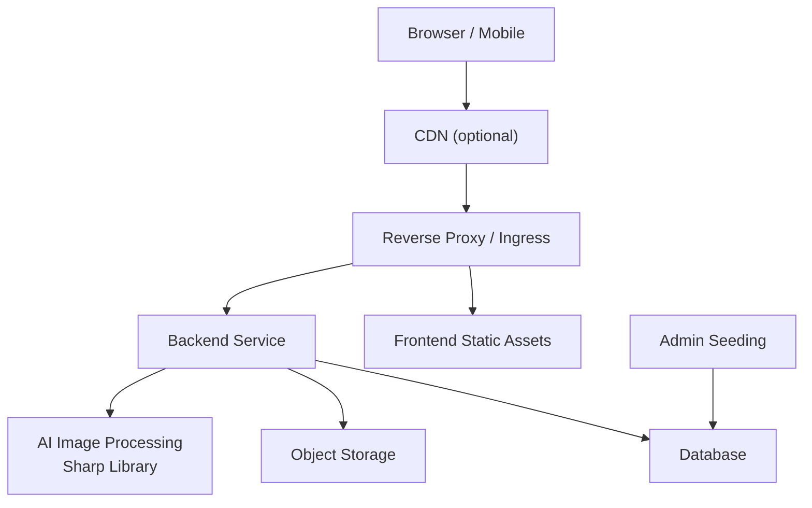
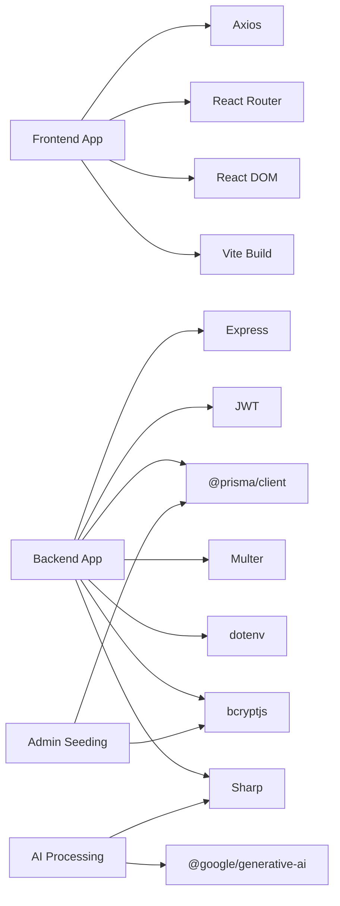

# Deployment & DevOps

<cite>
**Referenced Files in This Document**
- [railway.toml](file://railway.toml)
- [backend/railway.toml](file://backend/railway.toml)
- [backend/package.json](file://backend/package.json)
- [frontend/package.json](file://frontend/package.json)
- [frontend/vercel.json](file://frontend/vercel.json)
- [backend/src/index.ts](file://backend/src/index.ts)
- [backend/src/middleware/auth.ts](file://backend/src/middleware/auth.ts)
- [backend/src/middleware/upload.ts](file://backend/src/middleware/upload.ts)
- [backend/src/middleware/adminAuth.ts](file://backend/src/middleware/adminAuth.ts)
- [backend/prisma/schema.prisma](file://backend/prisma/schema.prisma)
- [backend/src/utils/prisma.ts](file://backend/src/utils/prisma.ts)
- [backend/src/scripts/seedAdmin.ts](file://backend/src/scripts/seedAdmin.ts)
- [backend/src/utils/imageUtils.ts](file://backend/src/utils/imageUtils.ts)
- [backend/src/services/damageAnalysisService.ts](file://backend/src/services/damageAnalysisService.ts)
- [backend/src/services/vehicleDetectionService.ts](file://backend/src/services/vehicleDetectionService.ts)
- [frontend/vite.config.ts](file://frontend/vite.config.ts)
- [frontend/src/services/api.ts](file://frontend/src/services/api.ts)
</cite>

## Update Summary
**Changes Made**
- Updated Railway deployment configuration section to reflect automated admin user seeding during deployment
- Added comprehensive documentation for administrative credentials setup and management
- Enhanced deployment guide with new admin seeding workflow
- Updated environment configuration to include admin-specific considerations
- Added security recommendations for production admin accounts
- **Updated** Node.js version requirements section to reflect Sharp library compatibility requirements for AI image processing
- Added detailed documentation for AI-powered vehicle damage assessment and document processing capabilities

## Table of Contents
1. Introduction
2. Project Structure
3. Core Components
4. Architecture Overview
5. Detailed Component Analysis
6. Dependency Analysis
7. Performance Considerations
8. Troubleshooting Guide
9. Conclusion
10. Appendices

## Introduction
This document provides production deployment and DevOps guidance for the Smart Vehicle Insurance Claim System. The system now utilizes an automated Railway deployment configuration that simplifies the deployment process while ensuring proper database synchronization and automatic administrative user seeding during deployment. It features advanced AI-powered image processing capabilities for vehicle damage assessment and claim document verification using the Sharp library, requiring Node.js >=20.9.0 for optimal performance. The system covers environment configuration, database setup, build processes, containerization, orchestration with Kubernetes, CI/CD pipelines, monitoring and logging, performance optimization, scaling, rollback procedures, backups, and disaster recovery. The guidance is grounded in the repository's backend (Express + TypeScript + Prisma), frontend (React + Vite), and related middleware and utilities.

## Project Structure
The system consists of:
- Backend: Express server with TypeScript, Prisma ORM, JWT authentication, file uploads, AI-powered image processing with Sharp, and API routes.
- Frontend: React application built with Vite, using Tailwind CSS and Axios for API calls.

```mermaid
graph TB
subgraph "Frontend"
FE["Vite Build<br/>Static Assets"]
end
subgraph "Backend"
BE["Express Server<br/>TypeScript"]
PRISMA["Prisma Client"]
DB["Database"]
FS["Filesystem / Uploads"]
ADMIN["Admin Seeding"]
AI["AI Image Processing<br/>Sharp Library"]
end
FE --> |"HTTP /api"* BE
BE --> PRISMA
PRISMA --> DB
BE --> FS
BE --> AI
ADMIN --> DB
```

**Diagram sources**
- [backend/src/index.ts:1-49](file://backend/src/index.ts#L1-L49)
- [backend/prisma/schema.prisma:1-202](file://backend/prisma/schema.prisma#L1-L202)
- [backend/src/scripts/seedAdmin.ts:1-39](file://backend/src/scripts/seedAdmin.ts#L1-L39)
- [backend/src/utils/imageUtils.ts:1-60](file://backend/src/utils/imageUtils.ts#L1-L60)
- [frontend/vite.config.ts:1-21](file://frontend/vite.config.ts#L1-L21)

**Section sources**
- [backend/package.json:1-48](file://backend/package.json#L1-L48)
- [frontend/package.json:1-32](file://frontend/package.json#L1-32)

## Core Components
- Backend entrypoint initializes Express, configures CORS, JSON parsing, static upload serving, mounts API routes, health check, error handler, and starts listening on a configurable port.
- Authentication middleware validates JWT tokens from Authorization headers.
- Admin authentication middleware validates both JWT tokens and admin privileges.
- File upload middleware handles image/document storage with size limits and allowed MIME types.
- AI-powered image processing using Sharp library for vehicle damage assessment and document verification.
- Prisma schema defines data models and relationships; Prisma client is instantiated centrally.
- Administrative user seeding script automatically creates default admin account during deployment.
- Frontend uses Axios to call backend APIs under /api and proxies during development.

Key responsibilities:
- Environment-driven configuration via process.env (port, CORS origin, JWT secret, upload directory).
- Centralized error handling returning structured JSON responses.
- Database access through Prisma with migrations and seeding workflows.
- Automated administrative user creation with secure password hashing.
- Advanced image processing pipeline for AI-powered claim analysis.

**Section sources**
- [backend/src/index.ts:1-49](file://backend/src/index.ts#L1-L49)
- [backend/src/middleware/auth.ts:1-22](file://backend/src/middleware/auth.ts#L1-L22)
- [backend/src/middleware/adminAuth.ts:1-26](file://backend/src/middleware/adminAuth.ts#L1-L26)
- [backend/src/middleware/upload.ts:1-54](file://backend/src/middleware/upload.ts#L1-L54)
- [backend/src/utils/imageUtils.ts:1-60](file://backend/src/utils/imageUtils.ts#L1-L60)
- [backend/prisma/schema.prisma:1-202](file://backend/prisma/schema.prisma#L1-L202)
- [backend/src/utils/prisma.ts:1-6](file://backend/src/utils/prisma.ts#L1-L6)
- [backend/src/scripts/seedAdmin.ts:1-39](file://backend/src/scripts/seedAdmin.ts#L1-L39)
- [frontend/src/services/api.ts:1-36](file://frontend/src/services/api.ts#L1-L36)

## Architecture Overview
Production architecture components:
- Reverse proxy / Ingress (e.g., Nginx or cloud load balancer) terminates TLS and routes traffic to frontend and backend.
- Frontend served as static assets.
- Backend runs as a stateless service behind the reverse proxy with AI image processing capabilities.
- Database managed by a hosted relational service or containerized instance.
- Object storage recommended for uploads in production.
- Administrative user seeding executed during deployment initialization.
- AI-powered image processing pipeline for vehicle damage assessment and document verification.



[No sources needed since this diagram shows conceptual workflow, not actual code structure]

## Detailed Component Analysis

### Railway Deployment Configuration
**Updated** The deployment process now includes automated administrative user seeding during deployment initialization with enhanced Node.js version requirements for AI image processing.

The root `railway.toml` file contains the primary deployment configuration:
- **Build Process**: Uses nixpacks builder to compile the backend TypeScript code
- **Start Command**: Executes `npx prisma db push && node dist/index.js` to ensure database schema synchronization before starting the application
- **Restart Policy**: Configured to restart on failure with maximum 3 retries
- **Node.js Version Pinning**: Pinned to Node.js 22.17.0 for Sharp library compatibility

```toml
[build]
builder = "nixpacks"
buildCommand = "cd backend && npm install && npm run build"

[deploy]
startCommand = "cd backend && npx prisma db push && node dist/index.js"
restartPolicyType = "on_failure"
restartPolicyMaxRetries = 3

[environments.production]
NODE_VERSION = "22.17.0"
NIXPACKS_NODE_VERSION = "22.17.0"
```

The backend-specific `railway.toml` provides enhanced configuration with administrative user seeding:
- **Environment Variables**: Production port set to 5000
- **Enhanced Start Command**: Executes database push, admin user seeding, then starts the application
- **Legacy Support**: Maintains compatibility with existing scripts
- **Node.js Requirements**: Ensures Node.js >=20.9.0 for Sharp library functionality

```toml
[build]
builder = "nixpacks"
buildCommand = "npm run build"

[deploy]
startCommand = "npx prisma db push && npx tsx src/scripts/seedAdmin.ts && node dist/index.js"
restartPolicyType = "on_failure"
restartPolicyMaxRetries = 3

[environments.production]
PORT = "5000"
NODE_VERSION = "22.17.0"
NIXPACKS_NODE_VERSION = "22.17.0"
```

**Section sources**
- [railway.toml:1-14](file://railway.toml#L1-L14)
- [backend/railway.toml:1-15](file://backend/railway.toml#L1-L15)

### Node.js Version Requirements and AI Image Processing
**New Section** Critical Node.js version requirements for AI-powered image processing functionality.

The system requires Node.js >=20.9.0 due to Sharp library dependencies for advanced image processing capabilities:

**Core Requirements:**
- **Minimum Node.js Version**: 20.9.0 (enforced via package.json engines field)
- **Recommended Runtime**: Node.js 22.17.0 (pinned in Railway configuration)
- **Sharp Library**: Version 0.35.4 requiring Node.js >=20.9.0
- **AI Image Processing**: Vehicle damage assessment and document verification

**Image Processing Capabilities:**
- **Vehicle Damage Assessment**: AI-powered analysis of vehicle damage from uploaded images
- **Document Verification**: Automated verification of insurance documents and claims
- **Image Optimization**: Automatic resizing and compression for AI model consumption
- **Multi-format Support**: JPEG, PNG, WebP, and other common image formats

**Performance Optimizations:**
- **Image Resizing**: Automatic downscaling to 1280px maximum dimension
- **Quality Compression**: JPEG quality set to 80% for optimal balance
- **Memory Management**: Efficient buffer handling for large image files
- **Concurrent Processing**: Parallel image processing for multiple claim images

**Section sources**
- [backend/package.json:20-22](file://backend/package.json#L20-L22)
- [backend/package.json:33](file://backend/package.json#L33)
- [backend/src/utils/imageUtils.ts:1-60](file://backend/src/utils/imageUtils.ts#L1-L60)
- [railway.toml:10-14](file://railway.toml#L10-L14)
- [backend/railway.toml:10-15](file://backend/railway.toml#L10-L15)

### Administrative User Seeding
**New Section** Automatic administrative user creation during deployment ensures immediate system accessibility.

The administrative user seeding system provides:
- **Automatic Creation**: Creates default admin account if none exists
- **Idempotent Operation**: Updates existing admin users to ensure proper permissions
- **Secure Password Handling**: Uses bcrypt hashing with appropriate salt rounds
- **Deployment Integration**: Executed as part of the Railway deployment pipeline

Key features:
- Default admin email: `admin@autoshield.com`
- Secure password hashing with bcryptjs
- Automatic isAdmin flag assignment
- Graceful handling of existing admin accounts
- Comprehensive error handling and logging

**Section sources**
- [backend/src/scripts/seedAdmin.ts:1-39](file://backend/src/scripts/seedAdmin.ts#L1-L39)
- [backend/railway.toml:5-6](file://backend/railway.toml#L5-L6)

### AI-Powered Image Processing Services
**New Section** Advanced AI capabilities for vehicle damage assessment and document verification.

**Damage Analysis Service:**
- **Vehicle Damage Detection**: Identifies dents, scratches, cracks, broken lights, bumper damage, glass damage, panel deformation, wheel damage, and structural damage
- **Severity Assessment**: Categorizes damage as MINOR, MODERATE, or SEVERE
- **Drivability Evaluation**: Provides safety assessments for vehicle operation
- **Multi-image Analysis**: Processes up to 6 images per claim for comprehensive assessment
- **Automated Repair Estimates**: Generates repair cost estimates based on damage analysis

**Vehicle Detection Service:**
- **Make and Model Identification**: Automatically identifies vehicle make, model, and approximate year
- **Color Recognition**: Detects vehicle paint color from images
- **License Plate Reading**: Extracts license plate information when visible
- **Confidence Scoring**: Provides confidence levels for detection accuracy

**Document Verification Service:**
- **Document Type Recognition**: Identifies driver's licenses, vehicle registrations, accident reports, and repair estimates
- **Information Extraction**: Extracts key information from various document types
- **Authenticity Verification**: Checks for signs of tampering or alteration
- **Completeness Validation**: Ensures all required information is present

**Section sources**
- [backend/src/services/damageAnalysisService.ts:1-200](file://backend/src/services/damageAnalysisService.ts#L1-L200)
- [backend/src/services/vehicleDetectionService.ts:1-83](file://backend/src/services/vehicleDetectionService.ts#L1-L83)
- [backend/src/services/documentVerificationService.ts:1-27](file://backend/src/services/documentVerificationService.ts#L1-L27)

### Environment Configuration
**Updated** Environment configuration now includes administrative considerations, AI processing requirements, and security best practices.

- Backend variables:
  - PORT: HTTP server port.
  - CORS_ORIGIN: Allowed origins for cross-origin requests.
  - JWT_SECRET: Secret used to sign and verify JWTs.
  - DATABASE_URL: Connection string for the database.
  - UPLOAD_DIR: Directory path for uploaded files.
  - NODE_VERSION: Node.js runtime version (22.17.0 recommended).
- Frontend variables:
  - During development, Vite proxies /api and /uploads to the backend.
  - In production, configure the reverse proxy to route /api to the backend and serve static assets separately.

Operational notes:
- Ensure CORS_ORIGIN matches the deployed frontend domain.
- Set a strong JWT_SECRET and rotate periodically.
- Use a managed database connection string for DATABASE_URL.
- For large-scale deployments, consider moving uploads to object storage and adjusting upload middleware accordingly.
- **AI Processing**: Ensure sufficient memory allocation for image processing operations.
- **Security**: Change default admin credentials immediately after deployment in production environments.

**Section sources**
- [backend/src/index.ts:1-49](file://backend/src/index.ts#L1-L49)
- [backend/src/middleware/auth.ts:1-22](file://backend/src/middleware/auth.ts#L1-L22)
- [backend/src/middleware/upload.ts:1-54](file://backend/src/middleware/upload.ts#L1-L54)
- [frontend/vite.config.ts:1-21](file://frontend/vite.config.ts#L1-L21)
- [railway.toml:10-14](file://railway.toml#L10-L14)

### Database Setup and Migrations
**Updated** Database synchronization now includes administrative user seeding during deployment.

The deployment process ensures complete database initialization through:
- **Automatic Schema Push**: The `npx prisma db push` command synchronizes the database schema with the Prisma schema definition
- **Administrative User Creation**: The `npx tsx src/scripts/seedAdmin.ts` script creates or updates the default admin account
- **Development Workflow**: Continue using `prisma migrate dev` for local development
- **Production Safety**: Schema changes and admin setup are applied safely before the application starts

Recommended production steps:
- Generate Prisma client before build (handled automatically by nixpacks)
- Apply migrations prior to deployment (automated via Railway)
- Back up the database regularly and test restore procedures
- **Security**: Immediately change default admin credentials after initial deployment

**Section sources**
- [backend/prisma/schema.prisma:1-202](file://backend/prisma/schema.prisma#L1-L202)
- [backend/src/utils/prisma.ts:1-6](file://backend/src/utils/prisma.ts#L1-L6)
- [backend/package.json:1-48](file://backend/package.json#L1-L48)
- [backend/railway.toml:5-6](file://backend/railway.toml#L5-L6)

### Build Processes
**Updated** Build processes are streamlined through Railway's nixpacks builder with integrated administrative setup and AI processing capabilities.

- Backend:
  - Compile TypeScript to JavaScript using nixpacks builder
  - Generate Prisma client automatically
  - Execute administrative user seeding during startup
  - Start the compiled server with database synchronization
  - **AI Processing**: Include Sharp library native bindings for image processing
- Frontend:
  - Type-check and build static assets with Vite
  - Serve the built output via a web server or CDN

Optimization strategies:
- Enable production builds that minify and tree-shake
- Cache dependencies in CI to speed up builds
- Split assets and enable compression at the reverse proxy
- **AI Optimization**: Configure adequate memory limits for image processing operations

**Section sources**
- [backend/package.json:1-48](file://backend/package.json#L1-L48)
- [frontend/package.json:1-32](file://frontend/package.json#L1-32)
- [backend/railway.toml:1-15](file://backend/railway.toml#L1-L15)

### Containerization (Docker)
**Updated** Recommended approach now includes AI image processing capabilities and Node.js version requirements.

Recommended approach:
- Multi-stage Dockerfiles:
  - Stage 1: Build frontend and backend artifacts with Node.js 22.17.0
  - Stage 2: Runtime image with only necessary binaries and dependencies
- Backend runtime:
  - Node.js 22.17.0 runtime with compiled JS
  - Copy generated Prisma client and migration files
  - Include administrative seeding script execution
  - **AI Processing**: Include Sharp library native dependencies for image processing
  - Expose the configured port
- Frontend runtime:
  - Serve static assets via a lightweight server or place behind a reverse proxy

Best practices:
- Use non-root user in containers
- Pin base image versions to Node.js 22.17.0
- Pass secrets via environment variables at runtime
- Keep images small by excluding dev dependencies
- **AI Processing**: Allocate sufficient memory for image processing operations
- **Security**: Implement proper credential rotation mechanisms

[No sources needed since this section provides general guidance]

### Orchestration (Kubernetes)
**Updated** Deployments now include AI processing resource requirements and Node.js version specifications.

Deployments:
- Deployments for frontend and backend services
- Services to expose ports internally
- ConfigMaps and Secrets for environment variables
- PersistentVolumeClaims if storing uploads locally (prefer object storage)
- HorizontalPodAutoscaler based on CPU/memory or custom metrics
- **Init Containers**: Consider using init containers for administrative setup tasks
- **Resource Limits**: Configure adequate memory limits for AI image processing

Ingress:
- Configure ingress to route /api to backend and root to frontend
- Terminate TLS at the ingress controller

Health checks:
- Liveness and readiness probes against /api/health and frontend endpoints

**Section sources**
- [backend/src/index.ts:36-49](file://backend/src/index.ts#L36-L49)

### Cloud Deployment Options
**Updated** Simplified deployment options available through automated platforms with enhanced administrative setup and AI processing capabilities.

- Platform-as-a-Service:
  - **Railway**: Primary deployment platform with automated configuration, database synchronization, administrative user seeding, and AI image processing support
  - Run backend as a managed service with environment variables and database provisioning
  - Serve frontend static assets from a hosting platform or CDN
  - **AI Processing**: Ensure adequate memory allocation for image processing operations
- Infrastructure-as-Code:
  - Define resources (load balancers, databases, storage buckets) in IaC templates
  - Use secrets management for sensitive values
  - **AI Processing**: Configure resource limits for image processing workloads
  - **Security**: Implement proper credential management and rotation policies

**Section sources**
- [railway.toml:1-14](file://railway.toml#L1-L14)
- [backend/railway.toml:1-15](file://backend/railway.toml#L1-L15)

### CI/CD Pipeline
**Updated** Suggested pipeline stages now include AI processing validation and Node.js version requirements.

Suggested pipeline stages:
- Lint and type-check both frontend and backend
- Install dependencies with caching
- Build frontend and backend artifacts
- Run unit tests (add test suites if present)
- Execute administrative seeding in test environments
- **AI Processing**: Validate Sharp library installation and image processing capabilities
- Build container images and push to registry
- Deploy to staging, run integration tests, then promote to production

Automation:
- Tag images with Git commit SHA and semantic version tags
- Use environment-specific configurations via ConfigMaps/Secrets
- Enforce branch protection and required approvals
- **Security**: Rotate default credentials in production deployments
- **AI Testing**: Include image processing test cases in CI pipeline

[No sources needed since this section provides general guidance]

### Monitoring and Logging
**Updated** Enhanced monitoring now includes AI processing metrics and Node.js performance tracking.

- Application logs:
  - Centralize logs from backend and frontend into a logging service
  - Include request IDs for tracing
  - **Security**: Monitor administrative access patterns and failed login attempts
  - **AI Processing**: Log image processing performance and errors
- Metrics:
  - Expose basic metrics (request rate, latency, errors) from the backend
  - Monitor container resource usage
  - Track administrative user creation and modification events
  - **AI Metrics**: Monitor image processing time, memory usage, and success rates
- Health endpoint:
  - Use /api/health for liveness/readiness probes and uptime dashboards

**Section sources**
- [backend/src/index.ts:36-49](file://backend/src/index.ts#L36-L49)

### Security Considerations
**Updated** Enhanced security considerations for administrative access, credential management, and AI processing security.

- CORS:
  - Restrict CORS_ORIGIN to trusted domains in production
- Authentication:
  - Validate JWT_SECRET and ensure secure token handling on the frontend
  - **Critical**: Change default admin credentials immediately after deployment
  - Implement proper session management and token expiration
- File uploads:
  - Limit file sizes and allowed MIME types
  - Consider virus scanning and content validation
  - **AI Processing**: Validate image formats and implement size limits for AI processing
- Secrets:
  - Store secrets in a vault or platform secrets manager
  - **Security**: Never commit default credentials to version control
  - Implement credential rotation policies
- Administrative Access:
  - Monitor and log all administrative actions
  - Implement IP whitelisting for administrative interfaces where possible
  - Use multi-factor authentication for administrative accounts
- **AI Security**: 
  - Implement input validation for image processing
  - Monitor AI service usage and costs
  - Rate limit AI processing requests to prevent abuse

**Section sources**
- [backend/src/index.ts:17-27](file://backend/src/index.ts#L17-L27)
- [backend/src/middleware/auth.ts:1-22](file://backend/src/middleware/auth.ts#L1-L22)
- [backend/src/middleware/adminAuth.ts:1-26](file://backend/src/middleware/adminAuth.ts#L1-L26)
- [backend/src/middleware/upload.ts:30-54](file://backend/src/middleware/upload.ts#L30-L54)
- [backend/src/scripts/seedAdmin.ts:20-33](file://backend/src/scripts/seedAdmin.ts#L20-L33)
- [frontend/src/services/api.ts:7-33](file://frontend/src/services/api.ts#L7-L33)

## Dependency Analysis
Runtime dependencies:
- Backend depends on Express, Prisma client, JWT library, file upload utilities, bcrypt for password hashing, and Sharp for AI image processing.
- Frontend depends on React, Vite, Axios, and routing libraries.

Build-time dependencies:
- TypeScript toolchains for both frontend and backend
- Vite plugins for React and Tailwind CSS
- Development tools for administrative seeding functionality
- **AI Processing**: Sharp library with native bindings for image processing



**Diagram sources**
- [backend/package.json:20-35](file://backend/package.json#L20-L35)
- [frontend/package.json:12-29](file://frontend/package.json#L12-L29)
- [backend/src/scripts/seedAdmin.ts:1-7](file://backend/src/scripts/seedAdmin.ts#L1-L7)

**Section sources**
- [backend/package.json:1-48](file://backend/package.json#L1-L48)
- [frontend/package.json:1-32](file://frontend/package.json#L1-32)

## Performance Considerations
**Updated** Performance considerations now include AI image processing optimizations and Node.js runtime tuning.

- Reverse proxy:
  - Enable gzip/brotli compression and HTTP/2
  - Cache static assets with long-lived cache headers
- Backend:
  - Tune JSON body size limits appropriately
  - Use connection pooling for databases if applicable
  - Avoid blocking operations in request handlers
  - **Optimization**: Consider making administrative seeding idempotent and cached
  - **AI Processing**: Configure adequate memory limits for image processing operations
  - **Sharp Optimization**: Utilize concurrent image processing for better throughput
- Frontend:
  - Leverage code splitting and lazy loading
  - Optimize images and assets
- Storage:
  - Move uploads to object storage for scalability and durability
  - Use CDN for static assets and images
  - **AI Processing**: Implement caching for processed images to reduce redundant processing

[No sources needed since this section provides general guidance]

## Troubleshooting Guide
**Updated** Common issues now include AI processing problems and Node.js version compatibility.

Common issues and resolutions:
- CORS errors:
  - Verify CORS_ORIGIN matches the frontend domain
- Authentication failures:
  - Ensure JWT_SECRET is set and consistent between services
  - Check token presence and format in requests
  - **Admin Access**: Verify admin user exists and has proper permissions
- Upload errors:
  - Confirm UPLOAD_DIR exists and is writable
  - Validate file types and sizes
- Database connectivity:
  - Validate DATABASE_URL and network access
  - Ensure migrations are applied (automatically handled by Railway deployment)
- Administrative seeding issues:
  - Check database connection during seeding phase
  - Verify bcryptjs dependency is properly installed
  - Review seeding script logs for specific errors
- **AI Processing Issues**:
  - Verify Node.js version meets minimum requirements (>=20.9.0)
  - Check Sharp library installation and native bindings
  - Monitor memory usage during image processing
  - Validate image file formats and sizes
  - Review AI service API keys and quotas

Error handling:
- Backend returns structured error responses via centralized error handler
- Frontend redirects to login on 401 responses
- **Admin Issues**: Log and alert on administrative access failures
- **AI Errors**: Implement fallback mechanisms for AI processing failures

**Section sources**
- [backend/src/middleware/errorHandler.ts:1-28](file://backend/src/middleware/errorHandler.ts#L1-L28)
- [backend/src/middleware/auth.ts:1-22](file://backend/src/middleware/auth.ts#L1-L22)
- [backend/src/middleware/adminAuth.ts:1-26](file://backend/src/middleware/adminAuth.ts#L1-L26)
- [backend/src/middleware/upload.ts:1-54](file://backend/src/middleware/upload.ts#L1-L54)
- [backend/src/scripts/seedAdmin.ts:36-39](file://backend/src/scripts/seedAdmin.ts#L36-L39)
- [frontend/src/services/api.ts:22-33](file://frontend/src/services/api.ts#L22-L33)

## Conclusion
This guide outlines a robust production deployment strategy for the Smart Vehicle Insurance Claim System. The enhanced Railway deployment configuration ensures automated database synchronization, administrative user seeding, and streamlined deployment processes with advanced AI-powered image processing capabilities. By configuring environment variables correctly, building optimized artifacts, containerizing services, orchestrating with Kubernetes, automating CI/CD, implementing monitoring and security best practices, and following proper administrative credential management procedures, you can deploy a scalable and maintainable system with sophisticated vehicle damage assessment and document verification capabilities. Follow the rollback, backup, and disaster recovery recommendations to ensure operational resilience.

[No sources needed since this section summarizes without analyzing specific files]

## Appendices

### A. Environment Variables Reference
**Updated** Environment variables now include AI processing and Node.js version requirements.

- Backend:
  - PORT: Server listen port
  - CORS_ORIGIN: Allowed frontend origins
  - JWT_SECRET: Secret for signing and verifying JWTs
  - DATABASE_URL: Database connection string
  - UPLOAD_DIR: Path for local file uploads
  - NODE_VERSION: Node.js runtime version (22.17.0 recommended)
- Frontend:
  - Development proxy targets configured in Vite
  - Production: Route /api to backend via reverse proxy
- **Security**: Implement proper secret management and rotation policies

**Section sources**
- [backend/src/index.ts:14-27](file://backend/src/index.ts#L14-L27)
- [backend/src/middleware/auth.ts:15-17](file://backend/src/middleware/auth.ts#L15-L17)
- [backend/src/middleware/upload.ts:6-15](file://backend/src/middleware/upload.ts#L6-L15)
- [frontend/vite.config.ts:8-18](file://frontend/vite.config.ts#L8-L18)
- [railway.toml:10-14](file://railway.toml#L10-L14)

### B. Build and Run Commands
**Updated** Commands now align with Railway deployment automation including administrative setup and AI processing capabilities.

- Backend:
  - Generate Prisma client (automated by nixpacks)
  - Build TypeScript (automated by nixpacks)
  - Execute administrative user seeding (automated by Railway)
  - Start server with database synchronization (automated by Railway)
  - **AI Processing**: Sharp library automatically included in build process
- Frontend:
  - Build static assets
  - Preview locally

**Section sources**
- [backend/package.json:6-15](file://backend/package.json#L6-L15)
- [frontend/package.json:6-10](file://frontend/package.json#L6-L10)
- [backend/railway.toml:5-6](file://backend/railway.toml#L5-L6)

### C. Administrative Credentials Management
**New Section** Comprehensive guide for managing administrative access and security.

#### Default Administrative Account
- **Email**: admin@autoshield.com
- **Password**: Admin@1234 (must be changed immediately in production)
- **Permissions**: Full administrative access to all system functions

#### Security Best Practices
- **Immediate Credential Change**: Change default password upon first deployment
- **Strong Password Policy**: Implement minimum complexity requirements
- **Access Logging**: Monitor all administrative actions and login attempts
- **IP Restrictions**: Consider limiting administrative access to specific IP ranges
- **Multi-Factor Authentication**: Implement additional security layers for admin accounts

#### Credential Rotation
- Regular password rotation schedule
- Secure credential storage in production environments
- Audit trails for administrative account modifications
- Emergency access procedures for locked-out administrators

**Section sources**
- [backend/src/scripts/seedAdmin.ts:10-33](file://backend/src/scripts/seedAdmin.ts#L10-L33)

### D. AI Image Processing Configuration
**New Section** Configuration and optimization guidelines for AI-powered image processing.

#### Sharp Library Configuration
- **Image Processing**: Automatic resizing to 1280px maximum dimension
- **Quality Settings**: JPEG quality set to 80% for optimal balance
- **Format Support**: JPEG, PNG, WebP, and other common formats
- **Memory Management**: Efficient buffer handling for large images

#### Performance Optimization
- **Concurrent Processing**: Process multiple images simultaneously
- **Caching Strategy**: Cache processed images to reduce redundant processing
- **Memory Limits**: Configure adequate memory allocation for image processing
- **Timeout Settings**: Implement appropriate timeouts for AI processing requests

#### Error Handling
- **Graceful Degradation**: Fallback to manual processing when AI fails
- **Logging**: Comprehensive logging of AI processing errors
- **Monitoring**: Track AI service usage and performance metrics

**Section sources**
- [backend/src/utils/imageUtils.ts:1-60](file://backend/src/utils/imageUtils.ts#L1-L60)
- [backend/src/services/damageAnalysisService.ts:1-200](file://backend/src/services/damageAnalysisService.ts#L1-L200)

### E. Rollback Procedures
**Updated** Rollback procedures now include AI processing considerations.

- Versioned container images:
  - Re-deploy previous known-good image tag
- Database migrations:
  - Maintain backward-compatible migrations
  - If necessary, roll back schema changes carefully with data preservation steps
- Frontend:
  - Serve previous static asset bundle while investigating issues
- **Administrative Access**: Ensure rollback procedures maintain administrative access capabilities
- **AI Processing**: Test AI processing capabilities after rollback to ensure Sharp library compatibility

[No sources needed since this section provides general guidance]

### F. Backup and Disaster Recovery
**Updated** Backup and disaster recovery procedures now include AI processing considerations.

- Database:
  - Schedule automated backups and retention policies
  - Test restore procedures regularly
  - **Security**: Encrypt backup files containing administrative credentials
- Uploads:
  - If using object storage, enable versioning and lifecycle policies
  - If using local filesystem, snapshot volumes and replicate offsite
  - **AI Processing**: Include processed images in backup strategy
- Configuration:
  - Back up ConfigMaps/Secrets and infrastructure definitions
  - **Critical**: Include administrative access configuration in backup strategy
  - **AI Configuration**: Backup AI service configurations and API keys

[No sources needed since this section provides general guidance]

### G. Railway Deployment Guide
**Updated** Enhanced deployment process using Railway's automated configuration with administrative setup and AI processing capabilities.

#### Quick Start
1. Connect your GitHub repository to Railway
2. Railway automatically detects the project structure and applies the configuration from `railway.toml`
3. Set environment variables in the Railway dashboard
4. Deploy with automatic database synchronization, administrative user seeding, and AI processing support

#### Environment Variables Required
- `DATABASE_URL`: PostgreSQL or SQLite connection string
- `JWT_SECRET`: Secret for JWT token signing
- `CORS_ORIGIN`: Allowed frontend domains
- `UPLOAD_DIR`: Path for file uploads (if using local storage)
- `NODE_VERSION`: Node.js runtime version (22.17.0 recommended)

#### Deployment Process
- **Build Phase**: Nixpacks automatically installs dependencies and compiles TypeScript
- **Database Sync**: Prisma schema is pushed to the database before application startup
- **Administrative Setup**: Default admin user is created or updated with proper permissions
- **AI Processing**: Sharp library is compiled with native bindings for image processing
- **Application Start**: Express server starts with all dependencies loaded and administrative access ready

#### Post-Deployment Security Checklist
- [ ] Change default admin password immediately
- [ ] Configure proper CORS settings for production domain
- [ ] Set up monitoring and alerting for administrative access
- [ ] Implement regular security audits
- [ ] Configure backup and disaster recovery procedures
- [ ] Test AI image processing capabilities
- [ ] Verify Node.js version compatibility

**Section sources**
- [railway.toml:1-14](file://railway.toml#L1-L14)
- [backend/railway.toml:1-15](file://backend/railway.toml#L1-L15)
- [backend/src/scripts/seedAdmin.ts:1-39](file://backend/src/scripts/seedAdmin.ts#L1-L39)