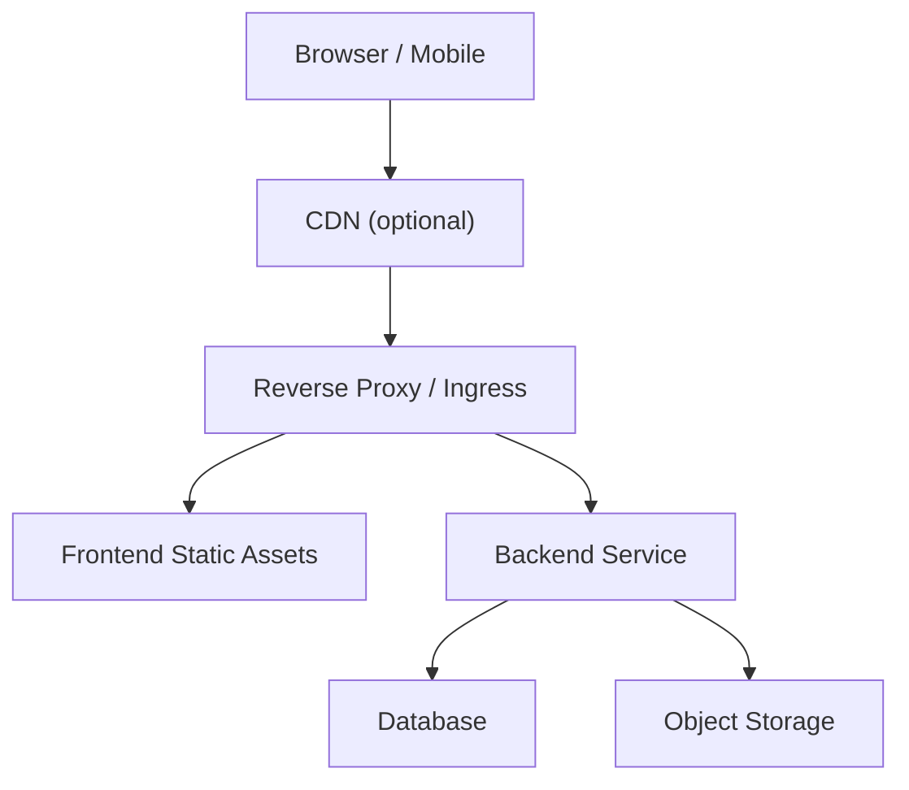
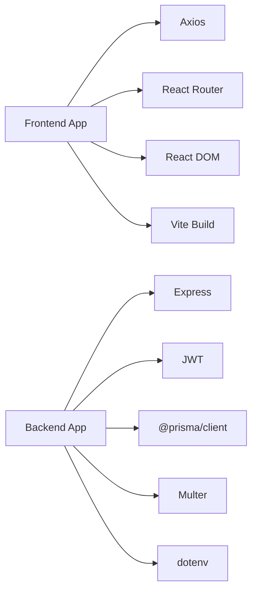

# Deployment & DevOps

<cite>
**Referenced Files in This Document**
- [backend/package.json](file://backend/package.json)
- [frontend/package.json](file://frontend/package.json)
- [backend/src/index.ts](file://backend/src/index.ts)
- [backend/src/middleware/auth.ts](file://backend/src/middleware/auth.ts)
- [backend/src/middleware/upload.ts](file://backend/src/middleware/upload.ts)
- [backend/prisma/schema.prisma](file://backend/prisma/schema.prisma)
- [backend/src/utils/prisma.ts](file://backend/src/utils/prisma.ts)
- [frontend/vite.config.ts](file://frontend/vite.config.ts)
- [frontend/src/services/api.ts](file://frontend/src/services/api.ts)
</cite>

## Table of Contents
1. Introduction
2. Project Structure
3. Core Components
4. Architecture Overview
5. Detailed Component Analysis
6. Dependency Analysis
7. Performance Considerations
8. Troubleshooting Guide
9. Conclusion
10. Appendices

## Introduction
This document provides production deployment and DevOps guidance for the Smart Vehicle Insurance Claim System. It covers environment configuration, database setup, build processes, containerization, orchestration with Kubernetes, CI/CD pipelines, monitoring and logging, performance optimization, scaling, rollback procedures, backups, and disaster recovery. The guidance is grounded in the repository’s backend (Express + TypeScript + Prisma), frontend (React + Vite), and related middleware and utilities.

## Project Structure
The system consists of:
- Backend: Express server with TypeScript, Prisma ORM, JWT authentication, file uploads, and API routes.
- Frontend: React application built with Vite, using Tailwind CSS and Axios for API calls.

```mermaid
graph TB
subgraph "Frontend"
FE["Vite Build<br/>Static Assets"]
end
subgraph "Backend"
BE["Express Server<br/>TypeScript"]
PRISMA["Prisma Client"]
DB["Database"]
FS["Filesystem / Uploads"]
end
FE --> |"HTTP /api"* BE
BE --> PRISMA
PRISMA --> DB
BE --> FS
```

**Diagram sources**
- [backend/src/index.ts:1-49](file://backend/src/index.ts#L1-L49)
- [backend/prisma/schema.prisma:1-202](file://backend/prisma/schema.prisma#L1-L202)
- [frontend/vite.config.ts:1-21](file://frontend/vite.config.ts#L1-L21)

**Section sources**
- [backend/package.json:1-43](file://backend/package.json#L1-L43)
- [frontend/package.json:1-32](file://frontend/package.json#L1-L32)

## Core Components
- Backend entrypoint initializes Express, configures CORS, JSON parsing, static upload serving, mounts API routes, health check, error handler, and starts listening on a configurable port.
- Authentication middleware validates JWT tokens from Authorization headers.
- File upload middleware handles image/document storage with size limits and allowed MIME types.
- Prisma schema defines data models and relationships; Prisma client is instantiated centrally.
- Frontend uses Axios to call backend APIs under /api and proxies during development.

Key responsibilities:
- Environment-driven configuration via process.env (port, CORS origin, JWT secret, upload directory).
- Centralized error handling returning structured JSON responses.
- Database access through Prisma with migrations and seeding workflows.

**Section sources**
- [backend/src/index.ts:1-49](file://backend/src/index.ts#L1-L49)
- [backend/src/middleware/auth.ts:1-23](file://backend/src/middleware/auth.ts#L1-L23)
- [backend/src/middleware/upload.ts:1-54](file://backend/src/middleware/upload.ts#L1-L54)
- [backend/prisma/schema.prisma:1-202](file://backend/prisma/schema.prisma#L1-L202)
- [backend/src/utils/prisma.ts:1-6](file://backend/src/utils/prisma.ts#L1-L6)
- [frontend/src/services/api.ts:1-36](file://frontend/src/services/api.ts#L1-L36)

## Architecture Overview
Production architecture components:
- Reverse proxy / Ingress (e.g., Nginx or cloud load balancer) terminates TLS and routes traffic to frontend and backend.
- Frontend served as static assets.
- Backend runs as a stateless service behind the reverse proxy.
- Database managed by a hosted relational service or containerized instance.
- Object storage recommended for uploads in production.



[No sources needed since this diagram shows conceptual workflow, not actual code structure]

## Detailed Component Analysis

### Environment Configuration
- Backend variables:
  - PORT: HTTP server port.
  - CORS_ORIGIN: Allowed origins for cross-origin requests.
  - JWT_SECRET: Secret used to sign and verify JWTs.
  - DATABASE_URL: Connection string for the database.
  - UPLOAD_DIR: Directory path for uploaded files.
- Frontend variables:
  - During development, Vite proxies /api and /uploads to the backend.
  - In production, configure the reverse proxy to route /api to the backend and serve static assets separately.

Operational notes:
- Ensure CORS_ORIGIN matches the deployed frontend domain.
- Set a strong JWT_SECRET and rotate periodically.
- Use a managed database connection string for DATABASE_URL.
- For large-scale deployments, consider moving uploads to object storage and adjusting upload middleware accordingly.

**Section sources**
- [backend/src/index.ts:1-49](file://backend/src/index.ts#L1-L49)
- [backend/src/middleware/auth.ts:1-23](file://backend/src/middleware/auth.ts#L1-L23)
- [backend/src/middleware/upload.ts:1-54](file://backend/src/middleware/upload.ts#L1-L54)
- [frontend/vite.config.ts:1-21](file://frontend/vite.config.ts#L1-L21)

### Database Setup and Migrations
- Schema provider is configured for SQLite in the schema file; ensure your runtime environment aligns with the intended provider.
- Use Prisma commands to generate client, run migrations, and manage schema changes.
- Initialize the Prisma client once at startup for reuse across requests.

Recommended production steps:
- Generate Prisma client before build.
- Apply migrations prior to deployment.
- Back up the database regularly and test restore procedures.

**Section sources**
- [backend/prisma/schema.prisma:1-202](file://backend/prisma/schema.prisma#L1-L202)
- [backend/src/utils/prisma.ts:1-6](file://backend/src/utils/prisma.ts#L1-L6)
- [backend/package.json:1-43](file://backend/package.json#L1-L43)

### Build Processes
- Backend:
  - Compile TypeScript to JavaScript.
  - Generate Prisma client.
  - Start the compiled server.
- Frontend:
  - Type-check and build static assets with Vite.
  - Serve the built output via a web server or CDN.

Optimization strategies:
- Enable production builds that minify and tree-shake.
- Cache dependencies in CI to speed up builds.
- Split assets and enable compression at the reverse proxy.

**Section sources**
- [backend/package.json:1-43](file://backend/package.json#L1-L43)
- [frontend/package.json:1-32](file://frontend/package.json#L1-L32)

### Containerization (Docker)
Recommended approach:
- Multi-stage Dockerfiles:
  - Stage 1: Build frontend and backend artifacts.
  - Stage 2: Runtime image with only necessary binaries and dependencies.
- Backend runtime:
  - Node.js runtime with compiled JS.
  - Copy generated Prisma client and migration files.
  - Expose the configured port.
- Frontend runtime:
  - Serve static assets via a lightweight server or place behind a reverse proxy.

Best practices:
- Use non-root user in containers.
- Pin base image versions.
- Pass secrets via environment variables at runtime.
- Keep images small by excluding dev dependencies.

[No sources needed since this section provides general guidance]

### Orchestration (Kubernetes)
Deployments:
- Deployments for frontend and backend services.
- Services to expose ports internally.
- ConfigMaps and Secrets for environment variables.
- PersistentVolumeClaims if storing uploads locally (prefer object storage).
- HorizontalPodAutoscaler based on CPU/memory or custom metrics.

Ingress:
- Configure ingress to route /api to backend and root to frontend.
- Terminate TLS at the ingress controller.

Health checks:
- Liveness and readiness probes against /api/health and frontend endpoints.

**Section sources**
- [backend/src/index.ts:36-49](file://backend/src/index.ts#L36-L49)

### Cloud Deployment Options
- Platform-as-a-Service:
  - Run backend as a managed service with environment variables and database provisioning.
  - Serve frontend static assets from a hosting platform or CDN.
- Infrastructure-as-Code:
  - Define resources (load balancers, databases, storage buckets) in IaC templates.
  - Use secrets management for sensitive values.

[No sources needed since this section provides general guidance]

### CI/CD Pipeline
Suggested pipeline stages:
- Lint and type-check both frontend and backend.
- Install dependencies with caching.
- Build frontend and backend artifacts.
- Run unit tests (add test suites if present).
- Build container images and push to registry.
- Deploy to staging, run integration tests, then promote to production.

Automation:
- Tag images with Git commit SHA and semantic version tags.
- Use environment-specific configurations via ConfigMaps/Secrets.
- Enforce branch protection and required approvals.

[No sources needed since this section provides general guidance]

### Monitoring and Logging
- Application logs:
  - Centralize logs from backend and frontend into a logging service.
  - Include request IDs for tracing.
- Metrics:
  - Expose basic metrics (request rate, latency, errors) from the backend.
  - Monitor container resource usage.
- Health endpoint:
  - Use /api/health for liveness/readiness probes and uptime dashboards.

**Section sources**
- [backend/src/index.ts:36-49](file://backend/src/index.ts#L36-L49)

### Security Considerations
- CORS:
  - Restrict CORS_ORIGIN to trusted domains in production.
- Authentication:
  - Validate JWT_SECRET and ensure secure token handling on the frontend.
- File uploads:
  - Limit file sizes and allowed MIME types.
  - Consider virus scanning and content validation.
- Secrets:
  - Store secrets in a vault or platform secrets manager.

**Section sources**
- [backend/src/index.ts:17-27](file://backend/src/index.ts#L17-L27)
- [backend/src/middleware/auth.ts:1-23](file://backend/src/middleware/auth.ts#L1-L23)
- [backend/src/middleware/upload.ts:30-54](file://backend/src/middleware/upload.ts#L30-L54)
- [frontend/src/services/api.ts:7-33](file://frontend/src/services/api.ts#L7-L33)

## Dependency Analysis
Runtime dependencies:
- Backend depends on Express, Prisma client, JWT library, and file upload utilities.
- Frontend depends on React, Vite, Axios, and routing libraries.

Build-time dependencies:
- TypeScript toolchains for both frontend and backend.
- Vite plugins for React and Tailwind CSS.



**Diagram sources**
- [backend/package.json:18-29](file://backend/package.json#L18-L29)
- [frontend/package.json:12-29](file://frontend/package.json#L12-L29)

**Section sources**
- [backend/package.json:1-43](file://backend/package.json#L1-L43)
- [frontend/package.json:1-32](file://frontend/package.json#L1-L32)

## Performance Considerations
- Reverse proxy:
  - Enable gzip/brotli compression and HTTP/2.
  - Cache static assets with long-lived cache headers.
- Backend:
  - Tune JSON body size limits appropriately.
  - Use connection pooling for databases if applicable.
  - Avoid blocking operations in request handlers.
- Frontend:
  - Leverage code splitting and lazy loading.
  - Optimize images and assets.
- Storage:
  - Move uploads to object storage for scalability and durability.
  - Use CDN for static assets and images.

[No sources needed since this section provides general guidance]

## Troubleshooting Guide
Common issues and resolutions:
- CORS errors:
  - Verify CORS_ORIGIN matches the frontend domain.
- Authentication failures:
  - Ensure JWT_SECRET is set and consistent between services.
  - Check token presence and format in requests.
- Upload errors:
  - Confirm UPLOAD_DIR exists and is writable.
  - Validate file types and sizes.
- Database connectivity:
  - Validate DATABASE_URL and network access.
  - Ensure migrations are applied.

Error handling:
- Backend returns structured error responses via centralized error handler.
- Frontend redirects to login on 401 responses.

**Section sources**
- [backend/src/middleware/errorHandler.ts:1-28](file://backend/src/middleware/errorHandler.ts#L1-L28)
- [backend/src/middleware/auth.ts:1-23](file://backend/src/middleware/auth.ts#L1-L23)
- [backend/src/middleware/upload.ts:1-54](file://backend/src/middleware/upload.ts#L1-L54)
- [frontend/src/services/api.ts:22-33](file://frontend/src/services/api.ts#L22-L33)

## Conclusion
This guide outlines a robust production deployment strategy for the Smart Vehicle Insurance Claim System. By configuring environment variables correctly, building optimized artifacts, containerizing services, orchestrating with Kubernetes, automating CI/CD, and implementing monitoring and security best practices, you can deploy a scalable and maintainable system. Follow the rollback, backup, and disaster recovery recommendations to ensure operational resilience.

[No sources needed since this section summarizes without analyzing specific files]

## Appendices

### A. Environment Variables Reference
- Backend:
  - PORT: Server listen port.
  - CORS_ORIGIN: Allowed frontend origins.
  - JWT_SECRET: Secret for signing and verifying JWTs.
  - DATABASE_URL: Database connection string.
  - UPLOAD_DIR: Path for local file uploads.
- Frontend:
  - Development proxy targets configured in Vite.
  - Production: Route /api to backend via reverse proxy.

**Section sources**
- [backend/src/index.ts:14-27](file://backend/src/index.ts#L14-L27)
- [backend/src/middleware/auth.ts:15-17](file://backend/src/middleware/auth.ts#L15-L17)
- [backend/src/middleware/upload.ts:6-15](file://backend/src/middleware/upload.ts#L6-L15)
- [frontend/vite.config.ts:8-18](file://frontend/vite.config.ts#L8-L18)

### B. Build and Run Commands
- Backend:
  - Generate Prisma client.
  - Build TypeScript.
  - Start server.
- Frontend:
  - Build static assets.
  - Preview locally.

**Section sources**
- [backend/package.json:6-13](file://backend/package.json#L6-L13)
- [frontend/package.json:6-10](file://frontend/package.json#L6-L10)

### C. Rollback Procedures
- Versioned container images:
  - Re-deploy previous known-good image tag.
- Database migrations:
  - Maintain backward-compatible migrations.
  - If necessary, roll back schema changes carefully with data preservation steps.
- Frontend:
  - Serve previous static asset bundle while investigating issues.

[No sources needed since this section provides general guidance]

### D. Backup and Disaster Recovery
- Database:
  - Schedule automated backups and retention policies.
  - Test restore procedures regularly.
- Uploads:
  - If using object storage, enable versioning and lifecycle policies.
  - If using local filesystem, snapshot volumes and replicate offsite.
- Configuration:
  - Back up ConfigMaps/Secrets and infrastructure definitions.

[No sources needed since this section provides general guidance]