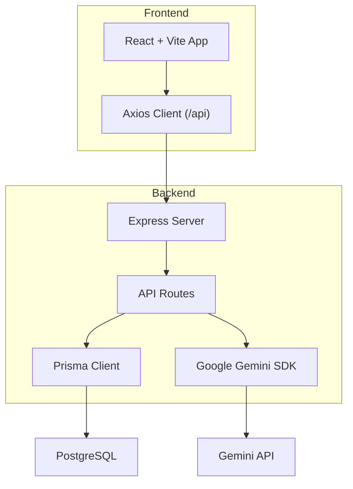
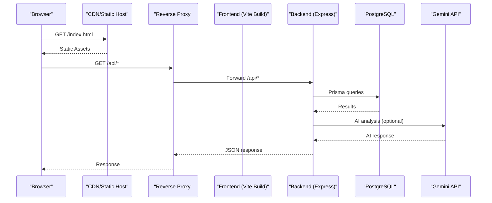
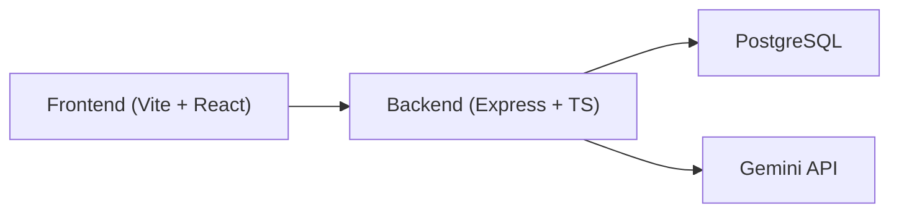

# Deployment Guide

<cite>
**Referenced Files in This Document**
- [backend/package.json](file://backend/package.json)
- [frontend/package.json](file://frontend/package.json)
- [backend/src/index.ts](file://backend/src/index.ts)
- [backend/tsconfig.json](file://backend/tsconfig.json)
- [frontend/vite.config.ts](file://frontend/vite.config.ts)
- [frontend/tsconfig.app.json](file://frontend/tsconfig.app.json)
- [backend/prisma/schema.prisma](file://backend/prisma/schema.prisma)
- [backend/src/utils/gemini.ts](file://backend/src/utils/gemini.ts)
- [backend/src/middleware/errorHandler.ts](file://backend/src/middleware/errorHandler.ts)
- [frontend/src/services/api.ts](file://frontend/src/services/api.ts)
</cite>

## Table of Contents
1. Introduction
2. Project Structure
3. Core Components
4. Architecture Overview
5. Detailed Component Analysis
6. Dependency Analysis
7. Performance Considerations
8. Troubleshooting Guide
9. Conclusion
10. Appendices

## Introduction
This guide provides production deployment instructions for the Smart Vehicle Insurance Claim System. It covers environment setup (Node.js, PostgreSQL, Google Gemini API), build processes for frontend and backend, containerization guidance, cloud deployment options, CI/CD pipeline configuration, monitoring and logging, security hardening, rollback and disaster recovery strategies, and performance tuning for high-traffic environments.

## Project Structure
The system consists of:
- Backend: Express + TypeScript server with Prisma ORM and PostgreSQL schema.
- Frontend: React + Vite application with TypeScript and Tailwind CSS.

**Diagram sources**
- [backend/src/index.ts:1-47](file://backend/src/index.ts#L1-L47)
- [backend/prisma/schema.prisma:1-201](file://backend/prisma/schema.prisma#L1-L201)
- [backend/src/utils/gemini.ts:1-13](file://backend/src/utils/gemini.ts#L1-L13)
- [frontend/src/services/api.ts:1-33](file://frontend/src/services/api.ts#L1-L33)

**Section sources**
- [backend/package.json:1-43](file://backend/package.json#L1-L43)
- [frontend/package.json:1-32](file://frontend/package.json#L1-L32)
- [backend/src/index.ts:1-47](file://backend/src/index.ts#L1-L47)
- [frontend/vite.config.ts:1-21](file://frontend/vite.config.ts#L1-L21)

## Core Components
- Backend runtime: Node.js with Express; compiled TypeScript to dist/index.js.
- Database: PostgreSQL via Prisma ORM with a comprehensive schema for users, vehicles, policies, claims, assessments, estimates, payouts, documents, and chat messages.
- AI integration: Google Gemini SDK configured via an API key environment variable.
- Frontend: React app built by Vite; proxies /api and /uploads to backend during development.

Key environment variables used at runtime:
- PORT: Backend HTTP port (default 5000).
- DATABASE_URL: PostgreSQL connection string for Prisma.
- CORS_ORIGIN: Allowed origins for cross-origin requests.
- UPLOAD_DIR: Directory path for uploaded files served statically.
- GEMINI_API_KEY: API key for Google Gemini.

**Section sources**
- [backend/src/index.ts:14-26](file://backend/src/index.ts#L14-L26)
- [backend/prisma/schema.prisma:5-8](file://backend/prisma/schema.prisma#L5-L8)
- [backend/src/utils/gemini.ts:6-9](file://backend/src/utils/gemini.ts#L6-L9)
- [frontend/vite.config.ts:8-18](file://frontend/vite.config.ts#L8-L18)

## Architecture Overview
Production architecture typically places a reverse proxy or CDN in front of the static frontend assets and routes API calls to the backend service. The backend connects to a managed PostgreSQL instance and calls the Gemini API over HTTPS.

**Diagram sources**
- [backend/src/index.ts:28-40](file://backend/src/index.ts#L28-L40)
- [backend/prisma/schema.prisma:5-8](file://backend/prisma/schema.prisma#L5-L8)
- [backend/src/utils/gemini.ts:6-9](file://backend/src/utils/gemini.ts#L6-L9)

## Detailed Component Analysis

### Backend Runtime and Configuration
- Entry point initializes Express, applies middleware (CORS, JSON parsing, URL-encoded parsing), serves uploads statically, mounts API routes, exposes a health endpoint, and starts listening on PORT.
- Environment-driven behavior:
  - CORS origin from CORS_ORIGIN.
  - Upload directory from UPLOAD_DIR.
  - Port from PORT.

Operational notes:
- Ensure NODE_ENV is set appropriately in production.
- Use process managers (e.g., systemd, PM2) to keep the process alive and restart on failure.

**Section sources**
- [backend/src/index.ts:1-47](file://backend/src/index.ts#L1-L47)
- [backend/package.json:6-13](file://backend/package.json#L6-L13)

### Database Schema and Migrations
- Prisma datasource points to PostgreSQL using DATABASE_URL.
- Schema defines core entities: User, Vehicle, InsurancePolicy, Claim, DamageAssessment, RepairEstimate, InsurancePayout, Document, ChatMessage, plus enums and relations.
- In production, run migrations against the target database before starting the service.

Recommended steps:
- Generate client and apply migrations using provided scripts.
- Back up the database regularly and test restore procedures.

**Section sources**
- [backend/prisma/schema.prisma:5-8](file://backend/prisma/schema.prisma#L5-L8)
- [backend/prisma/schema.prisma:10-201](file://backend/prisma/schema.prisma#L10-L201)
- [backend/package.json:10-13](file://backend/package.json#L10-L13)

### AI Integration (Google Gemini)
- The Gemini client is initialized with GEMINI_API_KEY and exposes a helper to retrieve a model instance.
- Services can call Gemini for claim assistance, damage analysis, document verification, and repair estimates.

Security note:
- Never commit API keys; use secrets management in your platform.

**Section sources**
- [backend/src/utils/gemini.ts:1-13](file://backend/src/utils/gemini.ts#L1-L13)

### Error Handling and Observability
- Centralized error handler logs errors and returns structured JSON responses.
- For production, integrate a structured logger and error tracking service to capture stack traces and context.

**Section sources**
- [backend/src/middleware/errorHandler.ts:1-28](file://backend/src/middleware/errorHandler.ts#L1-L28)

### Frontend API Client and Auth Flow
- Axios client sets base URL to /api and attaches Authorization Bearer token from localStorage when present.
- On 401 responses, it clears session data and redirects to login.

Deployment note:
- In production, ensure the reverse proxy forwards /api to the backend and preserves headers.

**Section sources**
- [frontend/src/services/api.ts:1-33](file://frontend/src/services/api.ts#L1-L33)

## Dependency Analysis
Runtime dependencies include Express, Prisma client, Google Generative AI SDK, JWT, bcryptjs, multer, uuid, zod, and dotenv. The frontend depends on React, Vite, Tailwind, and axios.

**Diagram sources**
- [backend/package.json:18-29](file://backend/package.json#L18-L29)
- [frontend/package.json:12-29](file://frontend/package.json#L12-L29)
- [backend/prisma/schema.prisma:5-8](file://backend/prisma/schema.prisma#L5-L8)
- [backend/src/utils/gemini.ts:1-13](file://backend/src/utils/gemini.ts#L1-L13)

**Section sources**
- [backend/package.json:1-43](file://backend/package.json#L1-L43)
- [frontend/package.json:1-32](file://frontend/package.json#L1-L32)

## Performance Considerations
- Backend:
  - Use a process manager to enable clustering if needed.
  - Tune request size limits and timeouts based on expected payload sizes.
  - Enable compression at the reverse proxy layer.
  - Cache frequent reads where appropriate.
- Database:
  - Use a managed PostgreSQL service with appropriate sizing and backups.
  - Add indexes for frequently queried columns (e.g., userId, vehicleId, policyId, status).
  - Monitor slow queries and adjust Prisma query patterns.
- Frontend:
  - Serve static assets via CDN.
  - Minimize bundle size and leverage code splitting.
- External APIs:
  - Implement retries and circuit breakers for Gemini API calls.
  - Cache results when feasible to reduce latency and cost.

[No sources needed since this section provides general guidance]

## Troubleshooting Guide
Common issues and resolutions:
- CORS errors: Verify CORS_ORIGIN matches the frontend’s origin and that credentials are allowed.
- 401 Unauthorized: Ensure the frontend includes Authorization header and the backend validates tokens correctly.
- File upload failures: Confirm UPLOAD_DIR exists and is writable by the process.
- Database connectivity: Validate DATABASE_URL format and network access to the database.
- Gemini API errors: Check GEMINI_API_KEY validity and quota limits.

Observability tips:
- Centralize logs and forward to a log aggregation service.
- Capture error contexts (request IDs, user IDs, endpoints) for faster debugging.

**Section sources**
- [backend/src/index.ts:17-26](file://backend/src/index.ts#L17-L26)
- [backend/src/middleware/errorHandler.ts:13-27](file://backend/src/middleware/errorHandler.ts#L13-L27)
- [frontend/src/services/api.ts:11-29](file://frontend/src/services/api.ts#L11-L29)

## Conclusion
Deploying the Smart Vehicle Insurance Claim System requires careful configuration of Node.js, PostgreSQL, and Gemini API, along with robust build and containerization practices. Follow the environment variable guidelines, secure secrets, implement monitoring and logging, and adopt security hardening measures. Plan for scaling, performance tuning, and reliable rollback and disaster recovery procedures to ensure a resilient production environment.

[No sources needed since this section summarizes without analyzing specific files]

## Appendices

### A. Environment Variables Reference
- PORT: Backend HTTP port (default 5000).
- DATABASE_URL: PostgreSQL connection string for Prisma.
- CORS_ORIGIN: Allowed frontend origin(s).
- UPLOAD_DIR: Absolute path to file uploads directory.
- GEMINI_API_KEY: Google Gemini API key.

**Section sources**
- [backend/src/index.ts:14-26](file://backend/src/index.ts#L14-L26)
- [backend/prisma/schema.prisma:5-8](file://backend/prisma/schema.prisma#L5-L8)
- [backend/src/utils/gemini.ts:6-9](file://backend/src/utils/gemini.ts#L6-L9)

### B. Build and Run Scripts
- Backend:
  - Development: run dev script to start TypeScript server with watch mode.
  - Build: compile TypeScript to dist.
  - Start: run compiled server.
  - Database: generate client, migrate, push schema, open studio.
- Frontend:
  - Development: start Vite dev server with proxy to backend.
  - Build: type-check and build static assets.
  - Lint: run linter.
  - Preview: preview production build locally.

**Section sources**
- [backend/package.json:6-13](file://backend/package.json#L6-L13)
- [frontend/package.json:6-10](file://frontend/package.json#L6-L10)

### C. Containerization Strategy
- Multi-stage Docker builds:
  - Stage 1: Install dependencies and build backend/frontend artifacts.
  - Stage 2: Minimal runtime image to serve compiled backend and static frontend assets.
- Best practices:
  - Use non-root user inside containers.
  - Pin dependency versions and images.
  - Inject secrets via environment variables or secret managers.
  - Expose only necessary ports.
  - Set health checks and resource limits.

[No sources needed since this section provides general guidance]

### D. Cloud Deployment Options
- AWS:
  - Frontend: S3 + CloudFront for static hosting.
  - Backend: ECS/Fargate or Elastic Beanstalk behind ALB.
  - Database: Amazon RDS for PostgreSQL.
  - Secrets: AWS Secrets Manager or Parameter Store.
- Azure:
  - Frontend: Azure Static Web Apps or CDN + Blob Storage.
  - Backend: Azure App Service or AKS.
  - Database: Azure Database for PostgreSQL.
  - Secrets: Azure Key Vault.
- Google Cloud Platform:
  - Frontend: Firebase Hosting or Cloud Storage + CDN.
  - Backend: Cloud Run or GKE.
  - Database: Cloud SQL for PostgreSQL.
  - Secrets: Secret Manager.

Environment variables should be provisioned through platform-native secret stores and injected at runtime.

[No sources needed since this section provides general guidance]

### E. CI/CD Pipeline
- Stages:
  - Lint and type-check both frontend and backend.
  - Install dependencies and run unit tests.
  - Build artifacts (backend dist, frontend static assets).
  - Push images or artifacts to registry/storage.
  - Deploy to staging, then promote to production after approvals.
- Artifacts:
  - Backend: compiled dist folder or container image.
  - Frontend: built static assets or container image.
- Environments:
  - Separate env files for staging and production.
  - Protect production deployments with branch protection and required reviews.

[No sources needed since this section provides general guidance]

### F. Monitoring and Logging
- Structured logging:
  - Emit JSON logs with correlation IDs, request metadata, and severity levels.
  - Ship logs to a centralized logging service.
- Metrics and tracing:
  - Collect request latency, error rates, and throughput metrics.
  - Integrate distributed tracing across services if applicable.
- Error tracking:
  - Capture unhandled exceptions and report to an error tracking service.
- Health checks:
  - Expose /api/health and configure readiness/liveness probes.

**Section sources**
- [backend/src/index.ts:34-40](file://backend/src/index.ts#L34-L40)
- [backend/src/middleware/errorHandler.ts:13-27](file://backend/src/middleware/errorHandler.ts#L13-L27)

### G. Security Hardening
- TLS/SSL:
  - Terminate TLS at the reverse proxy or load balancer.
  - Use strong cipher suites and enforce HTTPS.
- Firewall rules:
  - Restrict inbound traffic to ports 80/443; block direct database access from the internet.
- Security headers:
  - Configure HSTS, CSP, X-Frame-Options, Referrer-Policy, and Content-Security-Policy.
- Secrets management:
  - Store API keys and database URLs in secret managers; never commit to source control.
- Input validation:
  - Validate all inputs server-side; limit file upload sizes and types.
- CORS:
  - Whitelist only trusted origins.

**Section sources**
- [backend/src/index.ts:17-26](file://backend/src/index.ts#L17-L26)

### H. Rollback and Disaster Recovery
- Rollback strategy:
  - Keep previous artifact versions or container images.
  - Use blue/green or canary deployments to minimize risk.
  - Automate rollback on failed health checks or elevated error rates.
- Disaster recovery:
  - Schedule automated database backups and test restores.
  - Document runbooks for common failure scenarios.
  - Maintain incident response procedures and communication plans.

[No sources needed since this section provides general guidance]

### I. Performance Tuning and Scaling
- Horizontal scaling:
  - Scale backend instances behind a load balancer; ensure stateless design.
- Database scaling:
  - Use read replicas for read-heavy workloads.
  - Optimize queries and add indexes as needed.
- Caching:
  - Apply caching layers for frequently accessed data.
- External API resilience:
  - Implement retries, backoff, and circuit breakers for Gemini API calls.
- Frontend optimization:
  - Use CDN, compress assets, and lazy-load resources.

[No sources needed since this section provides general guidance]