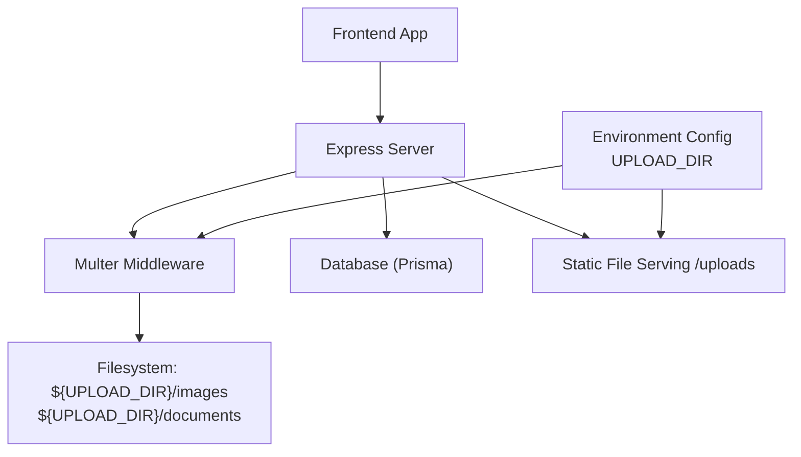
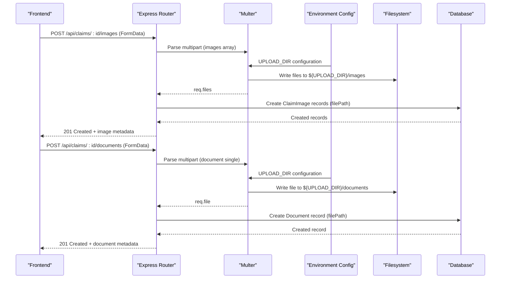
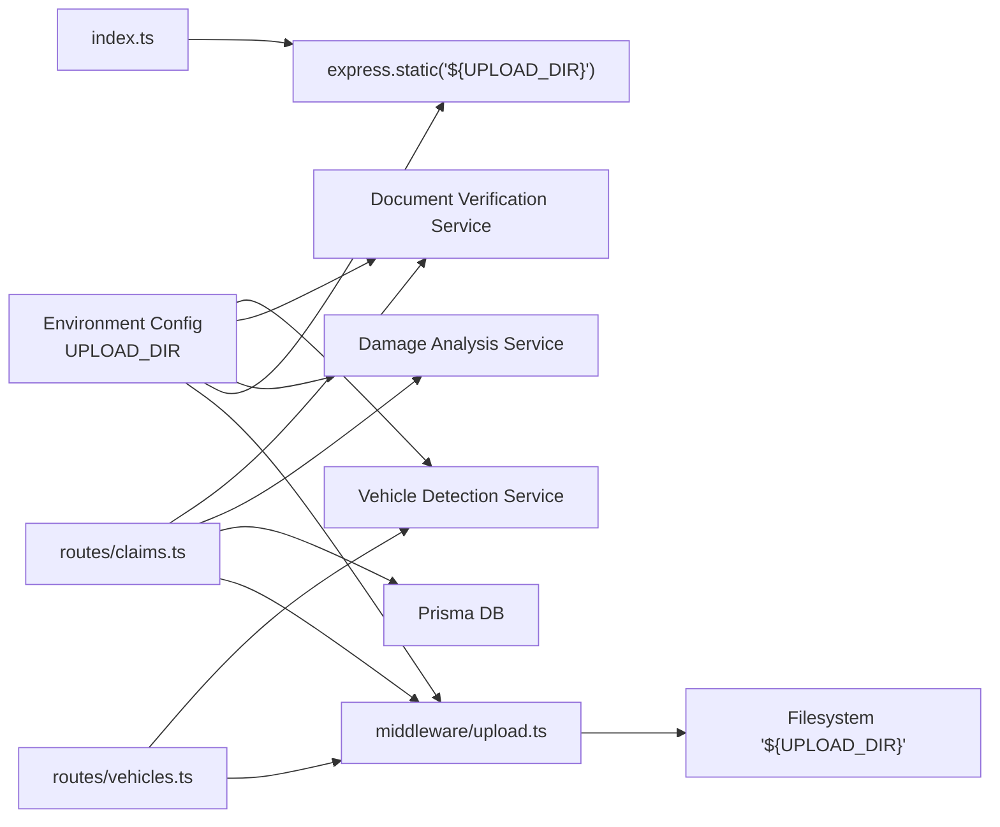

# File Upload & Storage

<cite>
**Referenced Files in This Document**
- [upload.ts](file://backend/src/middleware/upload.ts)
- [index.ts](file://backend/src/index.ts)
- [claims.ts](file://backend/src/routes/claims.ts)
- [vehicles.ts](file://backend/src/routes/vehicles.ts)
- [damageAnalysisService.ts](file://backend/src/services/damageAnalysisService.ts)
- [documentVerificationService.ts](file://backend/src/services/documentVerificationService.ts)
- [vehicleDetectionService.ts](file://backend/src/services/vehicleDetectionService.ts)
- [errorHandler.ts](file://backend/src/middleware/errorHandler.ts)
- [api.ts](file://frontend/src/services/api.ts)
</cite>

## Update Summary
**Changes Made**
- Enhanced file path resolution across all services with configurable UPLOAD_DIR environment variable support
- Updated Multer middleware to use environment-based upload directory configuration
- Modified static file serving to respect UPLOAD_DIR environment variable
- Updated claims routes for consistent file deletion with configurable paths
- Enhanced damage analysis service with proper file path resolution
- Improved document verification service with configurable upload directory
- Optimized vehicle detection service for cross-environment compatibility

## Table of Contents
1. [Introduction](#introduction)
2. [Project Structure](#project-structure)
3. [Core Components](#core-components)
4. [Architecture Overview](#architecture-overview)
5. [Detailed Component Analysis](#detailed-component-analysis)
6. [Environment Configuration](#environment-configuration)
7. [Dependency Analysis](#dependency-analysis)
8. [Performance Considerations](#performance-considerations)
9. [Troubleshooting Guide](#troubleshooting-guide)
10. [Conclusion](#conclusion)
11. [Appendices](#appendices)

## Introduction
This document explains the file upload and storage system used by the application. It covers Multer middleware configuration for multipart form data, supported file types and size limits, the processing pipeline from upload to storage and database recording, static file serving for uploaded content, and security measures such as file type validation and path traversal prevention. The system now supports configurable upload directories through environment variables for flexible deployment across different environments. It also provides guidance for adding new file types, implementing compression, optimizing storage efficiency, handling errors (including partial uploads and capacity issues), and examples for client-side uploads with progress tracking.

## Project Structure
The upload system is implemented on the backend using Express and Multer, with routes that accept images and documents, persist metadata to the database, and serve files via a static route. The system now supports configurable upload directories through the `UPLOAD_DIR` environment variable, enabling flexible deployment across development, staging, and production environments. The frontend uses an Axios instance configured to handle FormData uploads correctly.



**Diagram sources**
- [index.ts:36-38](file://backend/src/index.ts#L36-L38)
- [upload.ts:6-22](file://backend/src/middleware/upload.ts#L6-L22)
- [claims.ts:195-233](file://backend/src/routes/claims.ts#L195-L233)
- [claims.ts:316-353](file://backend/src/routes/claims.ts#L316-L353)

**Section sources**
- [index.ts:36-38](file://backend/src/index.ts#L36-L38)
- [upload.ts:1-54](file://backend/src/middleware/upload.ts#L1-L54)
- [claims.ts:195-233](file://backend/src/routes/claims.ts#L195-L233)
- [claims.ts:316-353](file://backend/src/routes/claims.ts#L316-L353)
- [vehicles.ts:15-32](file://backend/src/routes/vehicles.ts#L15-L32)
- [api.ts:1-40](file://frontend/src/services/api.ts#L1-L40)

## Core Components
- Multer configuration: disk storage with destination routing based on field name, filename generation using Node.js crypto.randomUUID(), and a file filter restricting allowed MIME types.
- Size limits: 10 MB per file for both image and document uploads.
- Routes:
  - Image upload endpoint for claims (multiple images).
  - Document upload endpoint for claims (single document).
  - Vehicle detection endpoint accepting a single image.
- Static file serving: /uploads serves files from the configured UPLOAD_DIR.
- Error handling: global error handler returns standardized JSON errors.

Key behaviors:
- Destination selection: if the field name is "document", files go to documents; otherwise to images.
- Filename: original extension preserved, prefixed with a cryptographically secure UUID generated via Node.js crypto.randomUUID() to avoid collisions.
- Allowed types: JPEG, PNG, WebP, JPG.
- Database records: filePath stored as absolute-like paths under /uploads/images or /uploads/documents.

**Updated** The system now supports configurable upload directories through the UPLOAD_DIR environment variable, defaulting to './uploads' when not specified. This enables flexible deployment across different environments while maintaining consistent file organization.

**Section sources**
- [upload.ts:6-54](file://backend/src/middleware/upload.ts#L6-L54)
- [claims.ts:195-233](file://backend/src/routes/claims.ts#L195-L233)
- [claims.ts:316-353](file://backend/src/routes/claims.ts#L316-L353)
- [vehicles.ts:15-32](file://backend/src/routes/vehicles.ts#L15-L32)
- [index.ts:36-38](file://backend/src/index.ts#L36-L38)

## Architecture Overview
End-to-end flow for uploading claim images and documents with configurable upload directory support:



**Diagram sources**
- [claims.ts:195-233](file://backend/src/routes/claims.ts#L195-L233)
- [claims.ts:316-353](file://backend/src/routes/claims.ts#L316-L353)
- [upload.ts:6-22](file://backend/src/middleware/upload.ts#L6-L22)

## Detailed Component Analysis

### Multer Middleware Configuration
- Storage:
  - Destination: chooses subdirectory based on field name ("document" -> documents, else images).
  - Filename: preserves original extension and prepends a cryptographically secure UUID generated via Node.js crypto.randomUUID() to prevent collisions.
- File filter:
  - Allows only specific image MIME types: JPEG, PNG, WebP, JPG.
- Limits:
  - fileSize: 10 MB per file.
- Directory initialization:
  - Ensures images and documents directories exist under UPLOAD_DIR (default ./uploads).

Security notes:
- Type validation via MIME whitelist prevents non-image uploads.
- Path traversal protection: filenames are generated with cryptographically secure UUIDs and extensions derived from originalname; no user-controlled directory segments are used.
- **Enhanced Security**: The use of Node.js crypto.randomUUID() provides cryptographically secure random identifiers, eliminating the need for external dependencies while ensuring high-quality randomness.

**Updated** The middleware now reads the UPLOAD_DIR environment variable to determine the base upload directory, enabling flexible deployment configurations while maintaining the same organizational structure within the upload directory.

**Section sources**
- [upload.ts:6-15](file://backend/src/middleware/upload.ts#L6-L15)
- [upload.ts:17-28](file://backend/src/middleware/upload.ts#L17-L28)
- [upload.ts:30-41](file://backend/src/middleware/upload.ts#L30-L41)
- [upload.ts:43-54](file://backend/src/middleware/upload.ts#L43-L54)

### Image Upload Pipeline (Claims)
- Endpoint: POST /api/claims/:id/images
- Behavior:
  - Validates claim ownership.
  - Accepts multiple images via Multer array.
  - Persists each image's metadata (claimId, type, filePath, optional label) to the database.
  - Returns created image records.

Error handling:
- Missing claim or files results in appropriate 4xx responses.
- Database errors return 500 with a generic message.

**Updated** File deletion operations now use the configurable UPLOAD_DIR environment variable to ensure consistent file path resolution across all operations.

**Section sources**
- [claims.ts:195-233](file://backend/src/routes/claims.ts#L195-L233)
- [claims.ts:257-261](file://backend/src/routes/claims.ts#L257-L261)

### Document Upload Pipeline (Claims)
- Endpoint: POST /api/claims/:id/documents
- Behavior:
  - Validates claim ownership.
  - Accepts a single document via Multer single.
  - Validates documentType against a whitelist.
  - Persists document metadata (claimId, type, filePath) to the database.
  - Returns created document record.

Error handling:
- Missing file or invalid documentType returns 4xx.
- Database errors return 500.

**Section sources**
- [claims.ts:316-353](file://backend/src/routes/claims.ts#L316-L353)

### Vehicle Detection Upload
- Endpoint: POST /api/vehicles/detect
- Behavior:
  - Accepts a single image via Multer.
  - Passes the saved image path to the vehicle detection service.
  - Returns detection result along with the image path.

Error handling:
- Missing image returns 400.
- Service errors return 500 with a descriptive message.

**Section sources**
- [vehicles.ts:15-32](file://backend/src/routes/vehicles.ts#L15-L32)

### Static File Serving
- The server exposes uploaded files at /uploads, serving from the configured UPLOAD_DIR.
- Clients reference files using paths like /uploads/images/<uuid>.ext or /uploads/documents/<uuid>.ext.

Security note:
- Only files written through the controlled upload pipeline are served.
- No directory listing is implied; ensure server configuration does not enable directory browsing.

**Updated** Static file serving now respects the UPLOAD_DIR environment variable, allowing different deployment targets while maintaining the same URL structure.

**Section sources**
- [index.ts:36-38](file://backend/src/index.ts#L36-L38)

### Frontend Upload Handling
- Axios instance automatically sets Content-Type for JSON but removes it for FormData to let the browser set the multipart boundary.
- Auth token is attached to requests; 401 responses trigger logout redirection.

Usage pattern:
- Construct FormData with fields (e.g., images[] or document) and send via axios.post('/api/...').

**Section sources**
- [api.ts:1-40](file://frontend/src/services/api.ts#L1-L40)

### AI Services Integration
The system includes several AI-powered services that process uploaded files:

#### Damage Analysis Service
- Reads claim images from the configured upload directory
- Processes images through Gemini AI for damage assessment
- Updates database with analysis results and repair estimates

#### Document Verification Service  
- Verifies uploaded documents (licenses, registrations, reports)
- Uses AI to extract information and validate authenticity
- Supports multiple document types with specific validation rules

#### Vehicle Detection Service
- Analyzes vehicle images to identify make, model, year, and color
- Extracts license plate information when visible
- Provides confidence scores for identification accuracy

**Updated** All AI services now use the configurable UPLOAD_DIR environment variable for consistent file path resolution across different deployment environments.

**Section sources**
- [damageAnalysisService.ts:67-78](file://backend/src/services/damageAnalysisService.ts#L67-L78)
- [documentVerificationService.ts:51-56](file://backend/src/services/documentVerificationService.ts#L51-L56)
- [vehicleDetectionService.ts:48-52](file://backend/src/services/vehicleDetectionService.ts#L48-L52)

## Environment Configuration
The system supports flexible deployment through environment variables:

### Required Environment Variables
- `UPLOAD_DIR`: Base directory for uploaded files (defaults to './uploads')
- `JWT_SECRET`: Secret for JWT token signing
- `GEMINI_API_KEY`: API key for Google Gemini AI services
- `DATABASE_URL`: Database connection string

### Upload Directory Configuration
The `UPLOAD_DIR` environment variable controls where uploaded files are stored:

```bash
# Development (default)
UPLOAD_DIR=./uploads

# Production (Linux)
UPLOAD_DIR=/data/uploads

# Production (Windows)
UPLOAD_DIR=C:\data\uploads

# Docker container
UPLOAD_DIR=/app/uploads
```

### Directory Structure
Regardless of the base upload directory, the following structure is maintained:
```
${UPLOAD_DIR}/
├── images/     # Uploaded claim images
└── documents/  # Uploaded claim documents
```

**Section sources**
- [upload.ts:6-15](file://backend/src/middleware/upload.ts#L6-L15)
- [index.ts:36-38](file://backend/src/index.ts#L36-L38)
- [claims.ts:257-261](file://backend/src/routes/claims.ts#L257-L261)
- [damageAnalysisService.ts:67-78](file://backend/src/services/damageAnalysisService.ts#L67-L78)
- [documentVerificationService.ts:51-56](file://backend/src/services/documentVerificationService.ts#L51-L56)
- [vehicleDetectionService.ts:48-52](file://backend/src/services/vehicleDetectionService.ts#L48-L52)

## Dependency Analysis
High-level dependencies between components involved in uploads:



**Diagram sources**
- [claims.ts:195-233](file://backend/src/routes/claims.ts#L195-L233)
- [claims.ts:316-353](file://backend/src/routes/claims.ts#L316-L353)
- [vehicles.ts:15-32](file://backend/src/routes/vehicles.ts#L15-L32)
- [upload.ts:6-54](file://backend/src/middleware/upload.ts#L6-L54)
- [index.ts:36-38](file://backend/src/index.ts#L36-L38)
- [damageAnalysisService.ts:67-78](file://backend/src/services/damageAnalysisService.ts#L67-L78)
- [documentVerificationService.ts:51-56](file://backend/src/services/documentVerificationService.ts#L51-L56)
- [vehicleDetectionService.ts:48-52](file://backend/src/services/vehicleDetectionService.ts#L48-L52)

**Section sources**
- [claims.ts:195-233](file://backend/src/routes/claims.ts#L195-L233)
- [claims.ts:316-353](file://backend/src/routes/claims.ts#L316-L353)
- [vehicles.ts:15-32](file://backend/src/routes/vehicles.ts#L15-L32)
- [upload.ts:6-54](file://backend/src/middleware/upload.ts#L6-L54)
- [index.ts:36-38](file://backend/src/index.ts#L36-L38)

## Performance Considerations
- Concurrency: The image upload handler processes multiple images concurrently using Promise.all for database writes.
- Disk I/O: Ensure sufficient disk space and consider mounting persistent volumes for uploads in production.
- Limits: Current limit is 10 MB per file; adjust based on business needs and infrastructure capacity.
- Caching: Serve static files via CDN or reverse proxy caching to reduce origin load.
- Compression: Not currently applied; see guidelines below for adding compression.
- **Optimization**: Using Node.js crypto.randomUUID() eliminates external dependency overhead and provides efficient UUID generation without performance impact.
- **Environment Flexibility**: Configurable upload directories enable optimal storage placement based on deployment environment and performance requirements.

[No sources needed since this section provides general guidance]

## Troubleshooting Guide
Common issues and resolutions:
- Unsupported file type:
  - Cause: MIME type not in the allowed list.
  - Resolution: Update the allowed types in the file filter or convert the file client-side before upload.
- File too large:
  - Cause: Exceeds 10 MB limit.
  - Resolution: Compress the file client-side or increase the limit if appropriate.
- Partial uploads:
  - Cause: Network interruption or server timeout.
  - Resolution: Implement retry logic and resume support on the client; monitor server logs for timeouts.
- Storage capacity issues:
  - Symptom: Write failures or ENOSPC errors.
  - Resolution: Monitor disk usage, implement cleanup policies, and scale storage.
- Path traversal attempts:
  - Mitigation: Filenames use cryptographically secure UUIDs and extensions; avoid trusting user-provided paths.
- Errors not surfaced:
  - Global error handler returns standardized JSON; ensure clients parse and display error messages.
- Upload directory not found:
  - Cause: UPLOAD_DIR environment variable points to non-existent directory.
  - Resolution: Ensure the directory exists or configure the application to create it automatically.
- Permission errors:
  - Cause: Insufficient permissions for the upload directory.
  - Resolution: Set appropriate file system permissions for the upload directory.

**Updated** The enhanced environment variable support improves troubleshooting by providing clear separation between development and production configurations, making it easier to identify deployment-specific issues.

**Section sources**
- [upload.ts:30-41](file://backend/src/middleware/upload.ts#L30-L41)
- [upload.ts:43-54](file://backend/src/middleware/upload.ts#L43-L54)
- [errorHandler.ts:13-27](file://backend/src/middleware/errorHandler.ts#L13-L27)

## Conclusion
The upload system uses Multer with strict type filtering and size limits, organizes files into dedicated directories, and persists references in the database. Static serving exposes files under /uploads. Security is enforced via MIME whitelisting and safe filename generation using cryptographically secure UUIDs. The system now supports configurable upload directories through environment variables, enabling flexible deployment across different environments while maintaining consistent file organization and access patterns. For future enhancements, consider adding compression, broader file type support, robust error reporting, and monitoring for storage capacity.

**Updated** The addition of configurable upload directory support enhances deployment flexibility while maintaining backward compatibility and security posture.

[No sources needed since this section summarizes without analyzing specific files]

## Appendices

### Adding New File Types
Steps:
- Extend the allowed MIME types in the file filter.
- If necessary, update any downstream validators or services that depend on image-only inputs.
- Test uploads across browsers and devices to ensure compatibility.

**Section sources**
- [upload.ts:30-41](file://backend/src/middleware/upload.ts#L30-L41)

### Implementing File Compression
Options:
- Client-side compression before upload (e.g., canvas-based image resizing/compression).
- Server-side compression after write (e.g., re-encode images to more efficient formats like WebP).
- Use streaming pipelines to avoid loading entire files into memory.

Considerations:
- Preserve quality thresholds.
- Maintain original files if required for audit.
- Update storage paths and metadata accordingly.

[No sources needed since this section provides general guidance]

### Optimizing Storage Efficiency
Recommendations:
- Normalize image dimensions and compress to efficient formats.
- Deduplicate identical files using content hashing.
- Implement lifecycle policies to archive or delete old assets.
- Use object storage (e.g., S3-compatible) for scalability and built-in optimizations.
- Configure appropriate UPLOAD_DIR values for different environments to optimize storage performance.

[No sources needed since this section provides general guidance]

### Client-Side Upload Examples and Progress Tracking
Patterns:
- Build FormData with fields matching the backend expectations (e.g., images[] for multiple images, document for single).
- Remove Content-Type header when sending FormData so the browser sets the correct multipart boundary.
- Attach authentication tokens via headers.
- Track progress using XMLHttpRequest.upload.onprogress or equivalent APIs.

References:
- Axios configuration for FormData and auth handling.

**Section sources**
- [api.ts:1-40](file://frontend/src/services/api.ts#L1-L40)

### Environment Setup Examples
Development setup:
```bash
export UPLOAD_DIR=./uploads
export JWT_SECRET=your-secret-key
export GEMINI_API_KEY=your-gemini-api-key
export DATABASE_URL=your-database-url
```

Production setup (Linux):
```bash
export UPLOAD_DIR=/data/uploads
export JWT_SECRET=production-secret-key
export GEMINI_API_KEY=production-gemini-api-key
export DATABASE_URL=production-database-url
```

Docker setup:
```dockerfile
ENV UPLOAD_DIR=/app/uploads
ENV JWT_SECRET=${JWT_SECRET}
ENV GEMINI_API_KEY=${GEMINI_API_KEY}
ENV DATABASE_URL=${DATABASE_URL}
```

**Section sources**
- [upload.ts:6-15](file://backend/src/middleware/upload.ts#L6-L15)
- [index.ts:36-38](file://backend/src/index.ts#L36-L38)