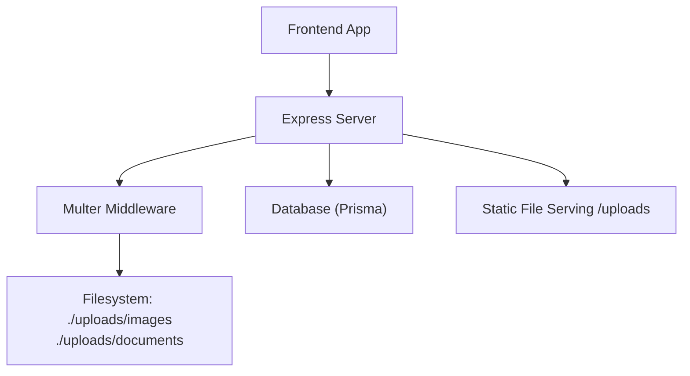
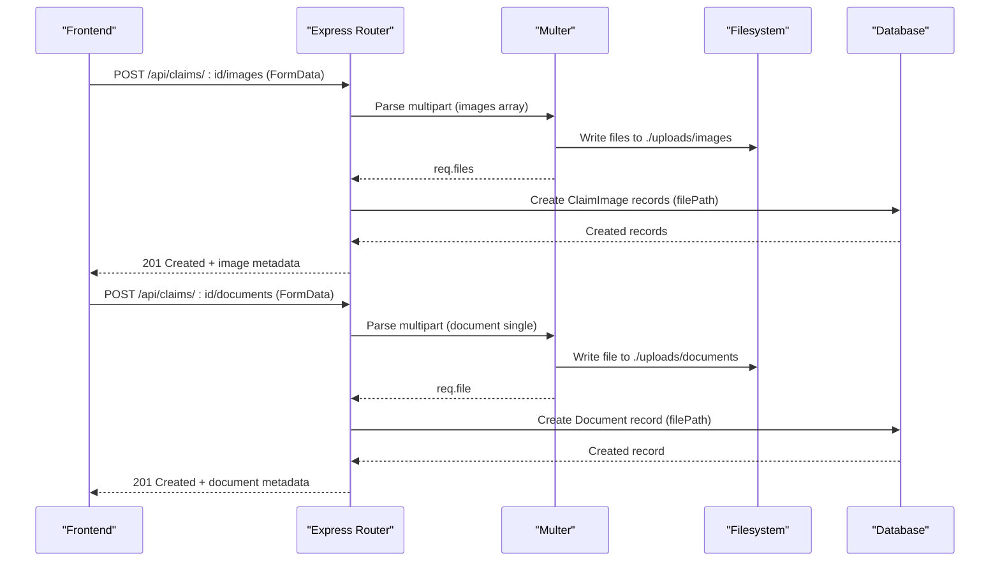
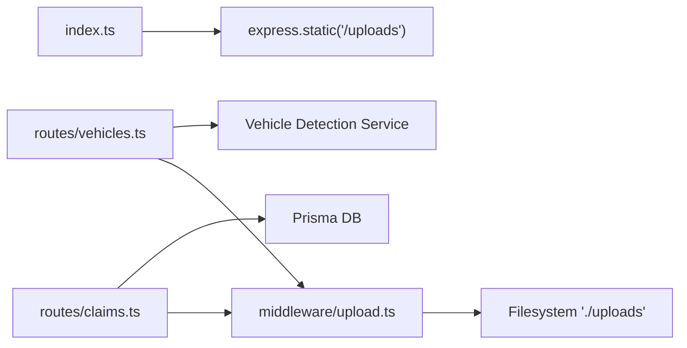

# File Upload & Storage

<cite>
**Referenced Files in This Document**
- [upload.ts](file://backend/src/middleware/upload.ts)
- [index.ts](file://backend/src/index.ts)
- [claims.ts](file://backend/src/routes/claims.ts)
- [vehicles.ts](file://backend/src/routes/vehicles.ts)
- [errorHandler.ts](file://backend/src/middleware/errorHandler.ts)
- [api.ts](file://frontend/src/services/api.ts)
</cite>

## Table of Contents
1. [Introduction](#introduction)
2. [Project Structure](#project-structure)
3. [Core Components](#core-components)
4. [Architecture Overview](#architecture-overview)
5. [Detailed Component Analysis](#detailed-component-analysis)
6. [Dependency Analysis](#dependency-analysis)
7. [Performance Considerations](#performance-considerations)
8. [Troubleshooting Guide](#troubleshooting-guide)
9. [Conclusion](#conclusion)
10. [Appendices](#appendices)

## Introduction
This document explains the file upload and storage system used by the application. It covers Multer middleware configuration for multipart form data, supported file types and size limits, the processing pipeline from upload to storage and database recording, static file serving for uploaded content, and security measures such as file type validation and path traversal prevention. It also provides guidance for adding new file types, implementing compression, optimizing storage efficiency, handling errors (including partial uploads and capacity issues), and examples for client-side uploads with progress tracking.

## Project Structure
The upload system is implemented on the backend using Express and Multer, with routes that accept images and documents, persist metadata to the database, and serve files via a static route. The frontend uses an Axios instance configured to handle FormData uploads correctly.

**Diagram sources**
- [index.ts:17-27](file://backend/src/index.ts#L17-L27)
- [upload.ts:17-28](file://backend/src/middleware/upload.ts#L17-L28)
- [claims.ts:195-233](file://backend/src/routes/claims.ts#L195-L233)
- [claims.ts:316-353](file://backend/src/routes/claims.ts#L316-L353)

**Section sources**
- [index.ts:17-27](file://backend/src/index.ts#L17-L27)
- [upload.ts:1-54](file://backend/src/middleware/upload.ts#L1-L54)
- [claims.ts:195-233](file://backend/src/routes/claims.ts#L195-L233)
- [claims.ts:316-353](file://backend/src/routes/claims.ts#L316-L353)
- [vehicles.ts:15-32](file://backend/src/routes/vehicles.ts#L15-L32)
- [api.ts:1-36](file://frontend/src/services/api.ts#L1-L36)

## Core Components
- Multer configuration: disk storage with destination routing based on field name, filename generation using UUIDs, and a file filter restricting allowed MIME types.
- Size limits: 10 MB per file for both image and document uploads.
- Routes:
  - Image upload endpoint for claims (multiple images).
  - Document upload endpoint for claims (single document).
  - Vehicle detection endpoint accepting a single image.
- Static file serving: /uploads serves files from the filesystem.
- Error handling: global error handler returns standardized JSON errors.

Key behaviors:
- Destination selection: if the field name is "document", files go to documents; otherwise to images.
- Filename: original extension preserved, prefixed with a UUID to avoid collisions.
- Allowed types: JPEG, PNG, WebP, JPG.
- Database records: filePath stored as absolute-like paths under /uploads/images or /uploads/documents.

**Section sources**
- [upload.ts:17-54](file://backend/src/middleware/upload.ts#L17-L54)
- [claims.ts:195-233](file://backend/src/routes/claims.ts#L195-L233)
- [claims.ts:316-353](file://backend/src/routes/claims.ts#L316-L353)
- [vehicles.ts:15-32](file://backend/src/routes/vehicles.ts#L15-L32)
- [index.ts:25-27](file://backend/src/index.ts#L25-L27)

## Architecture Overview
End-to-end flow for uploading claim images and documents:

**Diagram sources**
- [claims.ts:195-233](file://backend/src/routes/claims.ts#L195-L233)
- [claims.ts:316-353](file://backend/src/routes/claims.ts#L316-L353)
- [upload.ts:17-54](file://backend/src/middleware/upload.ts#L17-L54)

## Detailed Component Analysis

### Multer Middleware Configuration
- Storage:
  - Destination: chooses subdirectory based on field name ("document" -> documents, else images).
  - Filename: preserves original extension and prepends a UUID to prevent collisions.
- File filter:
  - Allows only specific image MIME types: JPEG, PNG, WebP, JPG.
- Limits:
  - fileSize: 10 MB per file.
- Directory initialization:
  - Ensures images and documents directories exist under UPLOAD_DIR (default ./uploads).

Security notes:
- Type validation via MIME whitelist prevents non-image uploads.
- Path traversal protection: filenames are generated with UUIDs and extensions derived from originalname; no user-controlled directory segments are used.

**Section sources**
- [upload.ts:6-15](file://backend/src/middleware/upload.ts#L6-L15)
- [upload.ts:17-28](file://backend/src/middleware/upload.ts#L17-L28)
- [upload.ts:30-41](file://backend/src/middleware/upload.ts#L30-L41)
- [upload.ts:43-54](file://backend/src/middleware/upload.ts#L43-L54)

### Image Upload Pipeline (Claims)
- Endpoint: POST /api/claims/:id/images
- Behavior:
  - Validates claim ownership.
  - Accepts multiple images via Multer array.
  - Persists each image’s metadata (claimId, type, filePath, optional label) to the database.
  - Returns created image records.

Error handling:
- Missing claim or files results in appropriate 4xx responses.
- Database errors return 500 with a generic message.

**Section sources**
- [claims.ts:195-233](file://backend/src/routes/claims.ts#L195-L233)

### Document Upload Pipeline (Claims)
- Endpoint: POST /api/claims/:id/documents
- Behavior:
  - Validates claim ownership.
  - Accepts a single document via Multer single.
  - Validates documentType against a whitelist.
  - Persists document metadata (claimId, type, filePath) to the database.
  - Returns created document record.

Error handling:
- Missing file or invalid documentType returns 4xx.
- Database errors return 500.

**Section sources**
- [claims.ts:316-353](file://backend/src/routes/claims.ts#L316-L353)

### Vehicle Detection Upload
- Endpoint: POST /api/vehicles/detect
- Behavior:
  - Accepts a single image via Multer.
  - Passes the saved image path to the vehicle detection service.
  - Returns detection result along with the image path.

Error handling:
- Missing image returns 400.
- Service errors return 500 with a descriptive message.

**Section sources**
- [vehicles.ts:15-32](file://backend/src/routes/vehicles.ts#L15-L32)

### Static File Serving
- The server exposes uploaded files at /uploads, serving from the configured UPLOAD_DIR.
- Clients reference files using paths like /uploads/images/<uuid>.ext or /uploads/documents/<uuid>.ext.

Security note:
- Only files written through the controlled upload pipeline are served.
- No directory listing is implied; ensure server configuration does not enable directory browsing.

**Section sources**
- [index.ts:25-27](file://backend/src/index.ts#L25-L27)

### Frontend Upload Handling
- Axios instance automatically sets Content-Type for JSON but removes it for FormData to let the browser set the multipart boundary.
- Auth token is attached to requests; 401 responses trigger logout redirection.

Usage pattern:
- Construct FormData with fields (e.g., images[] or document) and send via axios.post('/api/...').

**Section sources**
- [api.ts:1-36](file://frontend/src/services/api.ts#L1-L36)

## Dependency Analysis
High-level dependencies between components involved in uploads:

**Diagram sources**
- [claims.ts:195-233](file://backend/src/routes/claims.ts#L195-L233)
- [claims.ts:316-353](file://backend/src/routes/claims.ts#L316-L353)
- [vehicles.ts:15-32](file://backend/src/routes/vehicles.ts#L15-L32)
- [upload.ts:17-54](file://backend/src/middleware/upload.ts#L17-L54)
- [index.ts:25-27](file://backend/src/index.ts#L25-L27)

**Section sources**
- [claims.ts:195-233](file://backend/src/routes/claims.ts#L195-L233)
- [claims.ts:316-353](file://backend/src/routes/claims.ts#L316-L353)
- [vehicles.ts:15-32](file://backend/src/routes/vehicles.ts#L15-L32)
- [upload.ts:17-54](file://backend/src/middleware/upload.ts#L17-L54)
- [index.ts:25-27](file://backend/src/index.ts#L25-L27)

## Performance Considerations
- Concurrency: The image upload handler processes multiple images concurrently using Promise.all for database writes.
- Disk I/O: Ensure sufficient disk space and consider mounting persistent volumes for uploads in production.
- Limits: Current limit is 10 MB per file; adjust based on business needs and infrastructure capacity.
- Caching: Serve static files via CDN or reverse proxy caching to reduce origin load.
- Compression: Not currently applied; see guidelines below for adding compression.

[No sources needed since this section provides general guidance]

## Troubleshooting Guide
Common issues and resolutions:
- Unsupported file type:
  - Cause: MIME type not in the allowed list.
  - Resolution: Update the allowed types in the file filter or convert the file client-side before upload.
- File too large:
  - Cause: Exceeds 10 MB limit.
  - Resolution: Compress the file client-side or increase the limit if appropriate.
- Partial uploads:
  - Cause: Network interruption or server timeout.
  - Resolution: Implement retry logic and resume support on the client; monitor server logs for timeouts.
- Storage capacity issues:
  - Symptom: Write failures or ENOSPC errors.
  - Resolution: Monitor disk usage, implement cleanup policies, and scale storage.
- Path traversal attempts:
  - Mitigation: Filenames use UUIDs and extensions; avoid trusting user-provided paths.
- Errors not surfaced:
  - Global error handler returns standardized JSON; ensure clients parse and display error messages.

**Section sources**
- [upload.ts:30-41](file://backend/src/middleware/upload.ts#L30-L41)
- [upload.ts:43-54](file://backend/src/middleware/upload.ts#L43-L54)
- [errorHandler.ts:13-27](file://backend/src/middleware/errorHandler.ts#L13-L27)

## Conclusion
The upload system uses Multer with strict type filtering and size limits, organizes files into dedicated directories, and persists references in the database. Static serving exposes files under /uploads. Security is enforced via MIME whitelisting and safe filename generation. For future enhancements, consider adding compression, broader file type support, robust error reporting, and monitoring for storage capacity.

[No sources needed since this section summarizes without analyzing specific files]

## Appendices

### Adding New File Types
Steps:
- Extend the allowed MIME types in the file filter.
- If necessary, update any downstream validators or services that depend on image-only inputs.
- Test uploads across browsers and devices to ensure compatibility.

**Section sources**
- [upload.ts:30-41](file://backend/src/middleware/upload.ts#L30-L41)

### Implementing File Compression
Options:
- Client-side compression before upload (e.g., canvas-based image resizing/compression).
- Server-side compression after write (e.g., re-encode images to more efficient formats like WebP).
- Use streaming pipelines to avoid loading entire files into memory.

Considerations:
- Preserve quality thresholds.
- Maintain original files if required for audit.
- Update storage paths and metadata accordingly.

[No sources needed since this section provides general guidance]

### Optimizing Storage Efficiency
Recommendations:
- Normalize image dimensions and compress to efficient formats.
- Deduplicate identical files using content hashing.
- Implement lifecycle policies to archive or delete old assets.
- Use object storage (e.g., S3-compatible) for scalability and built-in optimizations.

[No sources needed since this section provides general guidance]

### Client-Side Upload Examples and Progress Tracking
Patterns:
- Build FormData with fields matching the backend expectations (e.g., images[] for multiple images, document for single).
- Remove Content-Type header when sending FormData so the browser sets the correct multipart boundary.
- Attach authentication tokens via headers.
- Track progress using XMLHttpRequest.upload.onprogress or equivalent APIs.

References:
- Axios configuration for FormData and auth handling.

**Section sources**
- [api.ts:1-36](file://frontend/src/services/api.ts#L1-L36)