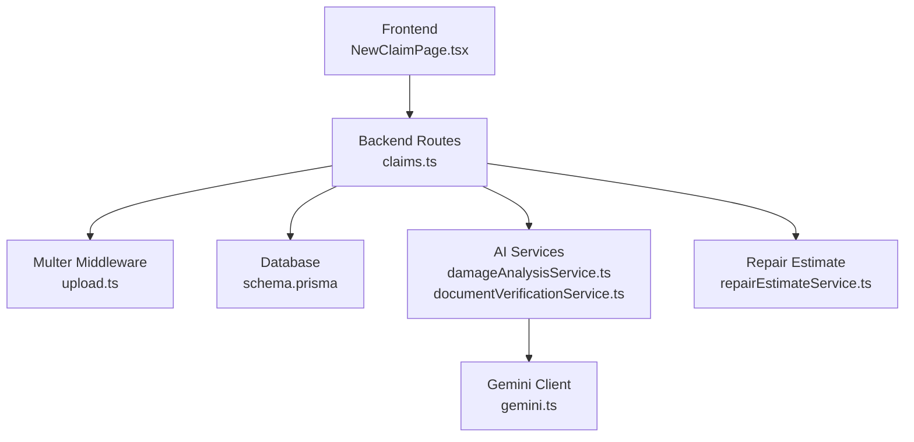
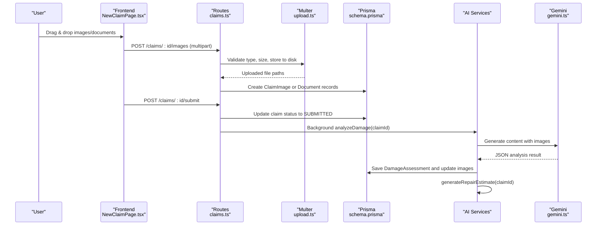
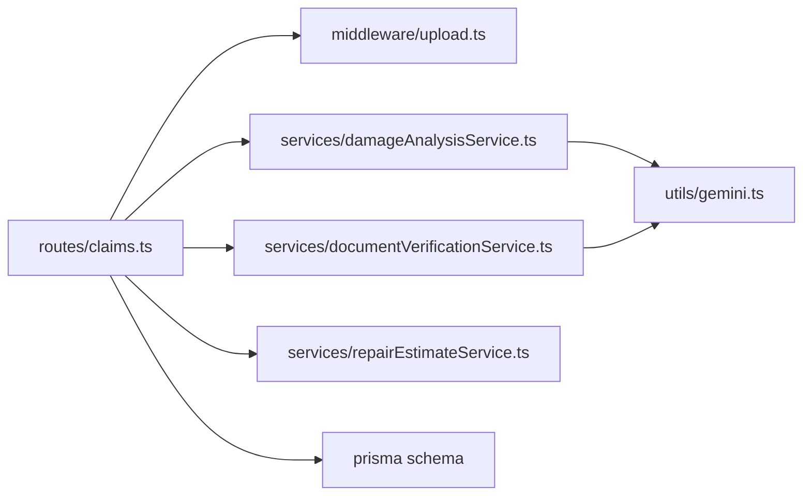

# File Upload System

<cite>
**Referenced Files in This Document**
- [upload.ts](file://backend/src/middleware/upload.ts)
- [claims.ts](file://backend/src/routes/claims.ts)
- [damageAnalysisService.ts](file://backend/src/services/damageAnalysisService.ts)
- [documentVerificationService.ts](file://backend/src/services/documentVerificationService.ts)
- [repairEstimateService.ts](file://backend/src/services/repairEstimateService.ts)
- [gemini.ts](file://backend/src/utils/gemini.ts)
- [schema.prisma](file://backend/prisma/schema.prisma)
- [NewClaimPage.tsx](file://frontend/src/pages/NewClaimPage.tsx)
- [api.ts](file://frontend/src/services/api.ts)
</cite>

## Update Summary
**Changes Made**
- Updated image upload support to include .jpg format alongside existing .jpeg, .png, and .webp formats
- Enhanced frontend dropzone configuration for both full vehicle and damage close-up images
- Updated backend file validation to accept .jpg MIME types
- Revised documentation sections to reflect expanded image format support

## Table of Contents
1. [Introduction](#introduction)
2. [Project Structure](#project-structure)
3. [Core Components](#core-components)
4. [Architecture Overview](#architecture-overview)
5. [Detailed Component Analysis](#detailed-component-analysis)
6. [Dependency Analysis](#dependency-analysis)
7. [Performance Considerations](#performance-considerations)
8. [Troubleshooting Guide](#troubleshooting-guide)
9. [Conclusion](#conclusion)

## Introduction
This document explains the file upload system for the Smart Vehicle Insurance Claim System. It covers Multer middleware configuration, upload workflows for vehicle photos and supporting documents, storage organization, AI integration for image analysis and document verification, frontend drag-and-drop and batch uploads, security measures, and performance optimizations.

## Project Structure
The upload flow spans backend routes, Multer middleware, services for AI analysis and estimates, Prisma data models, and a React frontend with drag-and-drop components.

**Diagram sources**
- [claims.ts:195-353](file://backend/src/routes/claims.ts#L195-L353)
- [upload.ts:17-53](file://backend/src/middleware/upload.ts#L17-L53)
- [damageAnalysisService.ts:50-153](file://backend/src/services/damageAnalysisService.ts#L50-L153)
- [documentVerificationService.ts:41-106](file://backend/src/services/documentVerificationService.ts#L41-L106)
- [repairEstimateService.ts:104-199](file://backend/src/services/repairEstimateService.ts#L104-L199)
- [gemini.ts:6-10](file://backend/src/utils/gemini.ts#L6-L10)
- [schema.prisma:70-185](file://backend/prisma/schema.prisma#L70-L185)

**Section sources**
- [claims.ts:195-353](file://backend/src/routes/claims.ts#L195-L353)
- [upload.ts:1-54](file://backend/src/middleware/upload.ts#L1-L54)
- [NewClaimPage.tsx:43-94](file://frontend/src/pages/NewClaimPage.tsx#L43-L94)

## Core Components
- Multer middleware for image and document uploads with size limits and type validation.
- Route handlers that persist uploaded files to disk and record metadata in the database.
- AI services that analyze images and verify documents using Google Gemini.
- Frontend drag-and-drop UI for selecting, previewing, and batching uploads.

Key responsibilities:
- Enforce allowed MIME types and maximum file size.
- Organize files into dedicated directories on disk.
- Persist references to uploaded files in the database.
- Trigger background AI analysis after claim submission.
- Provide user feedback and error handling across the stack.

**Section sources**
- [upload.ts:17-53](file://backend/src/middleware/upload.ts#L17-L53)
- [claims.ts:195-353](file://backend/src/routes/claims.ts#L195-L353)
- [damageAnalysisService.ts:50-153](file://backend/src/services/damageAnalysisService.ts#L50-L153)
- [documentVerificationService.ts:41-106](file://backend/src/services/documentVerificationService.ts#L41-L106)
- [NewClaimPage.tsx:43-94](file://frontend/src/pages/NewClaimPage.tsx#L43-L94)

## Architecture Overview
End-to-end upload and processing flow:

**Diagram sources**
- [claims.ts:152-193](file://backend/src/routes/claims.ts#L152-L193)
- [claims.ts:195-233](file://backend/src/routes/claims.ts#L195-L233)
- [claims.ts:316-353](file://backend/src/routes/claims.ts#L316-L353)
- [upload.ts:17-53](file://backend/src/middleware/upload.ts#L17-L53)
- [damageAnalysisService.ts:50-153](file://backend/src/services/damageAnalysisService.ts#L50-L153)
- [repairEstimateService.ts:104-199](file://backend/src/services/repairEstimateService.ts#L104-L199)
- [gemini.ts:6-10](file://backend/src/utils/gemini.ts#L6-L10)

## Detailed Component Analysis

### Multer Middleware Configuration
- Storage strategy:
  - Destination directory is determined by field name; images go to an images subfolder, documents to a documents subfolder under a configurable base directory.
  - Filenames are randomized with UUIDs and preserve original extensions.
- Type validation:
  - Only specific image MIME types are accepted (JPEG, PNG, WebP, and JPG).
- Size limits:
  - Maximum file size set to 10 MB per file.
- Directory initialization:
  - Ensures required directories exist before accepting uploads.

Security notes:
- MIME-based filtering reduces risk of executing non-image files.
- Randomized filenames prevent path traversal and collisions.
- No server-side virus scanning is implemented in this codebase.

**Updated** Enhanced file type validation now includes .jpg format support alongside existing .jpeg, .png, and .webp formats for comprehensive image compatibility.

**Section sources**
- [upload.ts:6-15](file://backend/src/middleware/upload.ts#L6-L15)
- [upload.ts:17-28](file://backend/src/middleware/upload.ts#L17-L28)
- [upload.ts:30-41](file://backend/src/middleware/upload.ts#L30-L41)
- [upload.ts:43-53](file://backend/src/middleware/upload.ts#L43-L53)

### Image Upload Workflow
- Frontend:
  - Uses drag-and-drop zones for full vehicle and damage close-up images.
  - Supports multiple file selection and previews via object URLs.
  - Sends multipart/form-data with an array of images and an imageType label.
- Backend route:
  - Validates ownership of the claim.
  - Accepts up to 10 images per request via Multer.
  - Persists each image's path and type to the database.
- Storage:
  - Files are saved under the images directory with unique names.

Progress tracking:
- The current implementation does not include server-side progress events; the frontend uses local previews and simple loading states.

Error handling:
- Missing files, invalid claims, and upload errors return appropriate HTTP status codes and messages.

**Updated** Both full vehicle and damage close-up image dropzones now support .jpg format in addition to .jpeg, .png, and .webp formats, providing enhanced compatibility with various camera and device outputs.

**Section sources**
- [NewClaimPage.tsx:43-94](file://frontend/src/pages/NewClaimPage.tsx#L43-L94)
- [claims.ts:195-233](file://backend/src/routes/claims.ts#L195-L233)
- [schema.prisma:100-110](file://backend/prisma/schema.prisma#L100-L110)

### Document Upload Workflow
- Frontend:
  - Not shown in the analyzed pages; supported by the backend endpoint for single document uploads.
- Backend route:
  - Accepts a single document with a validated document type.
  - Stores the file under the documents directory and persists metadata.
- Storage:
  - Files are saved under the documents directory with unique names.

Error handling:
- Returns errors for missing documents, invalid types, or unauthorized access.

**Section sources**
- [claims.ts:316-353](file://backend/src/routes/claims.ts#L316-L353)
- [schema.prisma:175-185](file://backend/prisma/schema.prisma#L175-L185)

### AI Integration: Automatic Image Analysis
- Trigger points:
  - Automatically invoked in the background when a claim is submitted.
  - Can be triggered explicitly via an analyze endpoint.
- Process:
  - Reads stored images from disk and encodes them for the AI model.
  - Sends a structured prompt and images to Gemini.
  - Parses the returned JSON describing damages, severity, and drivability assessment.
  - Saves the assessment and updates per-image annotations.
  - Triggers automatic repair estimate generation.

Error handling:
- If parsing fails, returns a fallback result indicating manual review is needed.

**Section sources**
- [claims.ts:152-193](file://backend/src/routes/claims.ts#L152-L193)
- [claims.ts:270-288](file://backend/src/routes/claims.ts#L270-L288)
- [damageAnalysisService.ts:50-153](file://backend/src/services/damageAnalysisService.ts#L50-L153)
- [gemini.ts:6-10](file://backend/src/utils/gemini.ts#L6-L10)

### AI Integration: Document Verification
- Trigger point:
  - Explicitly called via a verify endpoint for a given document.
- Process:
  - Reads the document image from disk and sends it to Gemini with a verification prompt.
  - Parses the JSON response containing status, issues, extracted info, and recommendations.
  - Updates the document record with verification results.

Error handling:
- Returns a default unreadable/manual-review result if parsing fails.

**Section sources**
- [claims.ts:379-397](file://backend/src/routes/claims.ts#L379-L397)
- [documentVerificationService.ts:41-106](file://backend/src/services/documentVerificationService.ts#L41-L106)
- [gemini.ts:6-10](file://backend/src/utils/gemini.ts#L6-L10)

### Repair Estimate Generation
- Trigger:
  - Automatically runs after successful damage analysis.
  - Also available via an explicit estimate endpoint.
- Process:
  - Calculates itemized costs based on detected damages and severity.
  - Computes totals, labor hours, and estimated days.
  - Optionally calculates insurance payout considering deductibles.

**Section sources**
- [damageAnalysisService.ts:144-150](file://backend/src/services/damageAnalysisService.ts#L144-L150)
- [claims.ts:290-314](file://backend/src/routes/claims.ts#L290-L314)
- [repairEstimateService.ts:104-199](file://backend/src/services/repairEstimateService.ts#L104-L199)

### Frontend Implementation: Drag-and-Drop, Preview, Batch Uploads
- Drag-and-drop:
  - Separate dropzones for full vehicle and damage close-up images.
  - Accepts JPEG, JPG, PNG, and WebP formats.
- Preview:
  - Generates temporary object URLs to display thumbnails immediately.
- Batch uploads:
  - Appends multiple files to FormData and sends them in one request.
- Submission flow:
  - Creates or reuses a claim ID, uploads images, then submits the claim.

Limitations:
- No server-side progress callbacks are used; the UI shows a simple loading state during submit.

**Updated** Enhanced image format support now includes .jpg files alongside .jpeg, .png, and .webp formats for both full vehicle and damage close-up photo uploads, improving compatibility with various camera devices and image sources.

**Section sources**
- [NewClaimPage.tsx:43-94](file://frontend/src/pages/NewClaimPage.tsx#L43-L94)
- [NewClaimPage.tsx:160-205](file://frontend/src/pages/NewClaimPage.tsx#L160-L205)
- [api.ts:1-33](file://frontend/src/services/api.ts#L1-L33)

## Dependency Analysis
High-level dependencies among upload-related modules:

**Diagram sources**
- [claims.ts:1-12](file://backend/src/routes/claims.ts#L1-L12)
- [upload.ts:1-5](file://backend/src/middleware/upload.ts#L1-L5)
- [damageAnalysisService.ts:1-5](file://backend/src/services/damageAnalysisService.ts#L1-L5)
- [documentVerificationService.ts:1-5](file://backend/src/services/documentVerificationService.ts#L1-L5)
- [repairEstimateService.ts:1-2](file://backend/src/services/repairEstimateService.ts#L1-L2)
- [gemini.ts:1-10](file://backend/src/utils/gemini.ts#L1-L10)
- [schema.prisma:70-185](file://backend/prisma/schema.prisma#L70-L185)

**Section sources**
- [claims.ts:1-12](file://backend/src/routes/claims.ts#L1-L12)
- [damageAnalysisService.ts:1-5](file://backend/src/services/damageAnalysisService.ts#L1-L5)
- [documentVerificationService.ts:1-5](file://backend/src/services/documentVerificationService.ts#L1-L5)
- [repairEstimateService.ts:1-2](file://backend/src/services/repairEstimateService.ts#L1-L2)
- [gemini.ts:1-10](file://backend/src/utils/gemini.ts#L1-L10)
- [schema.prisma:70-185](file://backend/prisma/schema.prisma#L70-L185)

## Performance Considerations
Current implementation characteristics:
- Synchronous disk reads for AI analysis may block the event loop for large images.
- No client-side image compression or resizing is performed before upload.
- No CDN or caching layer is configured in the analyzed code.

Recommended optimizations:
- Compress and resize images on the client before upload to reduce payload size and improve upload speed.
- Use streaming or chunked uploads for large files and implement server-side progress reporting.
- Offload AI processing to a background job queue to avoid blocking request threads.
- Serve static uploads through a CDN in production for faster delivery and caching.
- Implement lazy loading for image galleries and thumbnails.
- Add virus scanning at upload time or in a background pipeline to mitigate malicious file risks.

[No sources needed since this section provides general guidance]

## Troubleshooting Guide
Common issues and where they are handled:
- Invalid file type:
  - Multer rejects non-allowed MIME types and returns an error.
- File too large:
  - Multer enforces a 10 MB limit per file; exceeding it will fail the upload.
- Missing images on submit:
  - Submitting a claim without any images returns a validation error.
- Unauthorized access:
  - Routes enforce authentication and ownership checks for claims and related resources.
- AI parsing failures:
  - If Gemini returns unexpected output, services fall back to safe defaults and mark items for manual review.
- File deletion:
  - Deleting an image removes both the database record and the underlying file from disk.

Operational tips:
- Verify environment variables for upload directory and AI API keys.
- Ensure the application has write permissions to the upload directories.
- Monitor logs for background AI tasks and database operations.

**Updated** File type validation now supports .jpg format in addition to .jpeg, .png, and .webp formats, reducing potential upload rejections for users with .jpg image files.

**Section sources**
- [upload.ts:30-41](file://backend/src/middleware/upload.ts#L30-L41)
- [upload.ts:43-53](file://backend/src/middleware/upload.ts#L43-L53)
- [claims.ts:152-193](file://backend/src/routes/claims.ts#L152-L193)
- [claims.ts:235-268](file://backend/src/routes/claims.ts#L235-L268)
- [damageAnalysisService.ts:85-103](file://backend/src/services/damageAnalysisService.ts#L85-L103)
- [documentVerificationService.ts:78-94](file://backend/src/services/documentVerificationService.ts#L78-L94)

## Conclusion
The file upload system combines robust Multer-based validation and storage with AI-driven analysis and verification. Images and documents are organized into dedicated directories, referenced in the database, and processed asynchronously to support efficient claim handling. The frontend offers a modern drag-and-drop experience with previews and batch uploads. For production readiness, consider adding client-side compression, background job queues, CDN integration, and virus scanning to further enhance performance and security.

**Updated** The enhanced image upload support now includes .jpg format alongside existing .jpeg, .png, and .webp formats, providing better compatibility with various camera devices and image sources while maintaining the same security and performance characteristics.