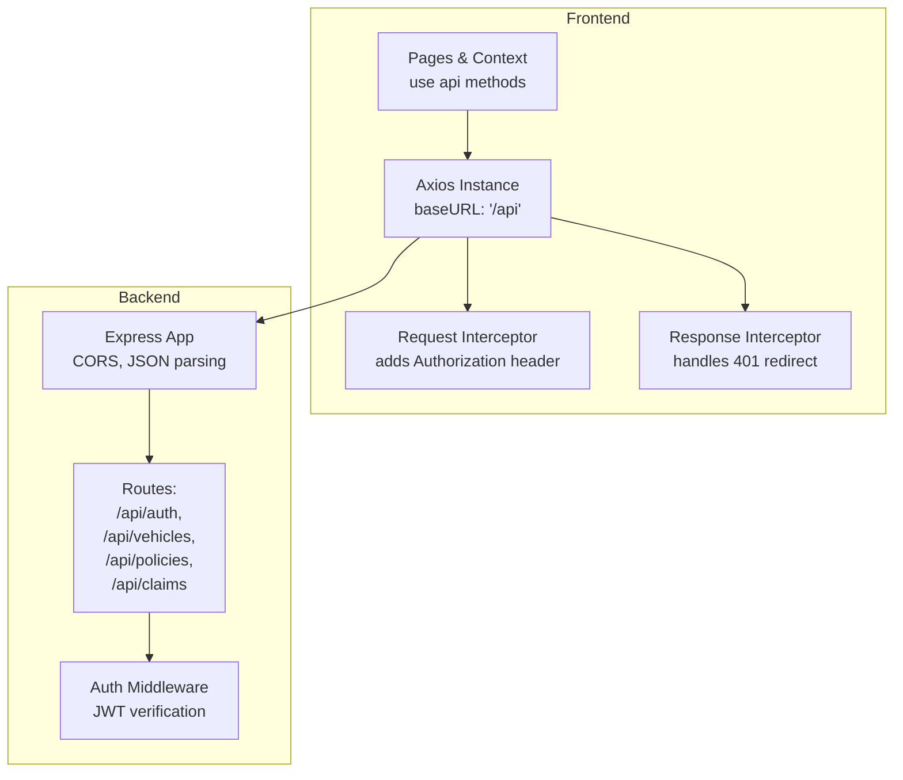
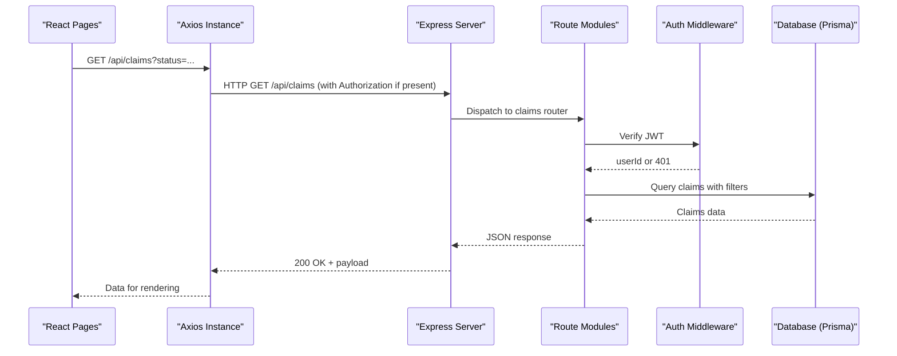
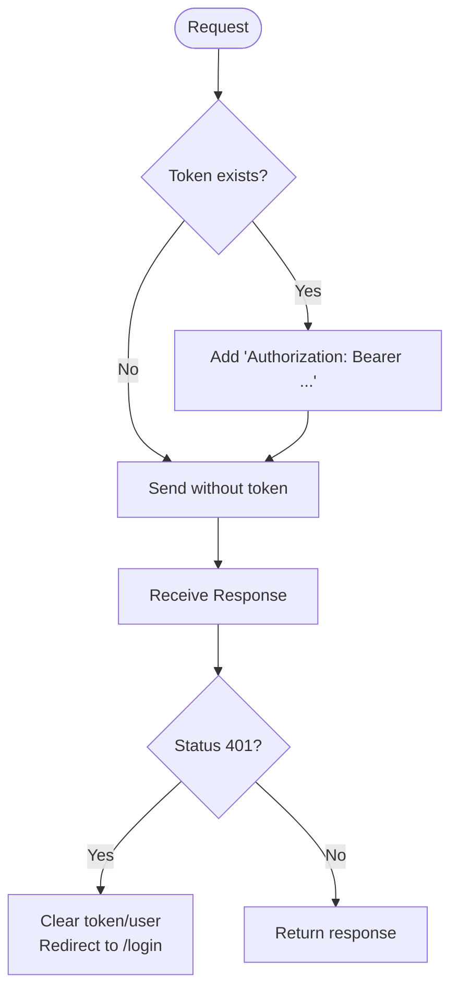
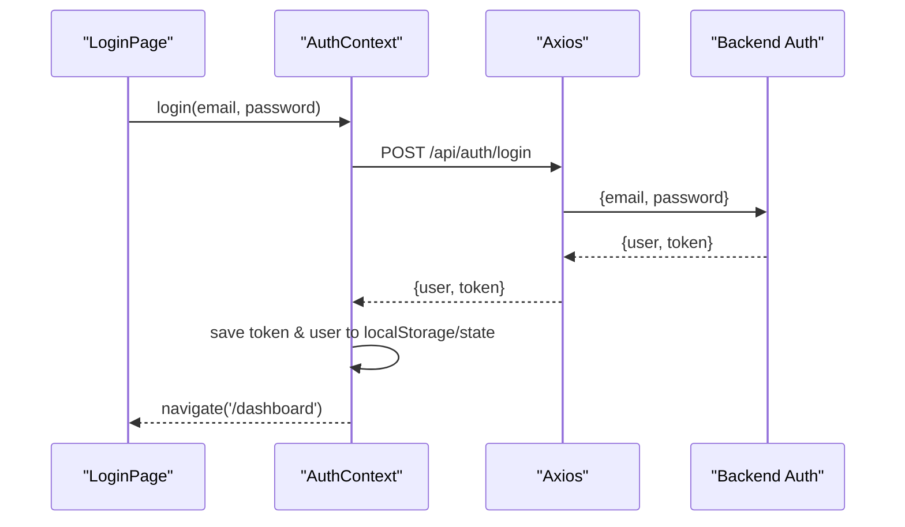
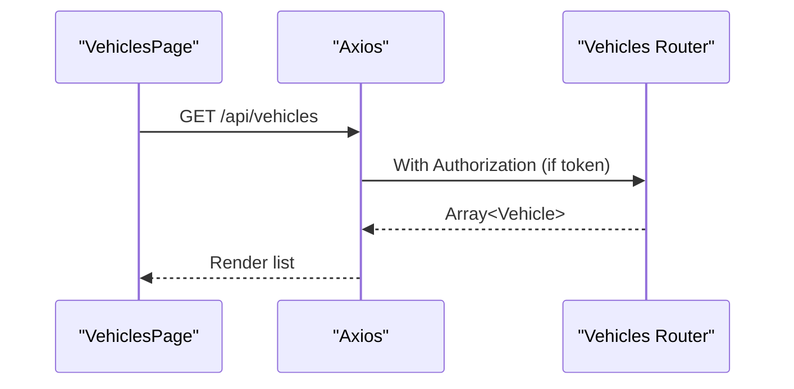
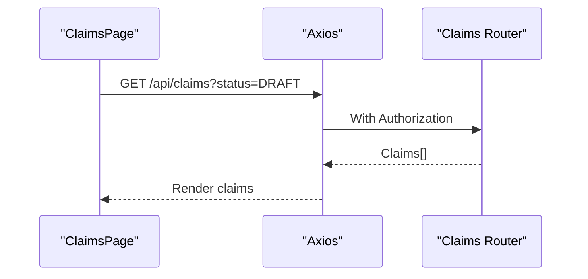
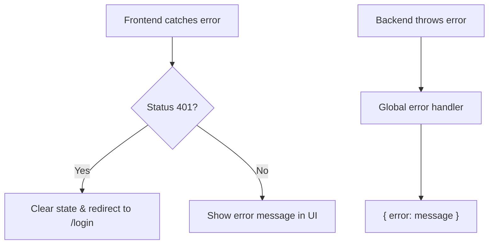
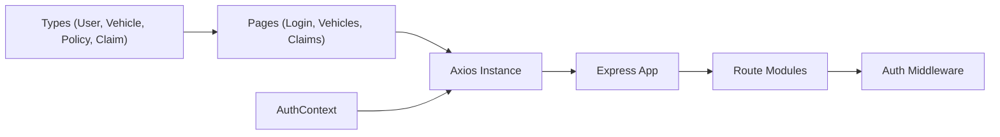

# API Integration

<cite>
**Referenced Files in This Document**
- [api.ts](file://frontend/src/services/api.ts)
- [AuthContext.tsx](file://frontend/src/context/AuthContext.tsx)
- [index.ts (types)](file://frontend/src/types/index.ts)
- [LoginPage.tsx](file://frontend/src/pages/LoginPage.tsx)
- [VehiclesPage.tsx](file://frontend/src/pages/VehiclesPage.tsx)
- [ClaimsPage.tsx](file://frontend/src/pages/ClaimsPage.tsx)
- [auth.ts (middleware)](file://backend/src/middleware/auth.ts)
- [errorHandler.ts](file://backend/src/middleware/errorHandler.ts)
- [index.ts (server)](file://backend/src/index.ts)
- [auth.ts (routes)](file://backend/src/routes/auth.ts)
- [vehicles.ts (routes)](file://backend/src/routes/vehicles.ts)
- [policies.ts (routes)](file://backend/src/routes/policies.ts)
- [claims.ts (routes)](file://backend/src/routes/claims.ts)
</cite>

## Table of Contents
1. [Introduction](#introduction)
2. [Project Structure](#project-structure)
3. [Core Components](#core-components)
4. [Architecture Overview](#architecture-overview)
5. [Detailed Component Analysis](#detailed-component-analysis)
6. [Dependency Analysis](#dependency-analysis)
7. [Performance Considerations](#performance-considerations)
8. [Troubleshooting Guide](#troubleshooting-guide)
9. [Conclusion](#conclusion)

## Introduction
This document describes the API integration layer built with Axios for the Smart Vehicle Insurance Claim System. It covers HTTP client configuration, request/response interceptors, authentication token handling, error handling strategies, and the service usage patterns across authentication, vehicles, policies, and claims. It also addresses security considerations such as CORS, CSRF implications, input validation on the backend, and secure communication practices. Where applicable, diagrams map directly to source files to aid understanding.

## Project Structure
The frontend uses a single Axios instance configured with a base URL and interceptors for authentication and 401 handling. The backend exposes REST endpoints under /api grouped by domain: auth, vehicles, policies, and claims. Authentication is enforced via JWT middleware on protected routes.

**Diagram sources**
- [api.ts:3-32](file://frontend/src/services/api.ts#L3-L32)
- [index.ts (server):17-32](file://backend/src/index.ts#L17-L32)
- [auth.ts (middleware):5-22](file://backend/src/middleware/auth.ts#L5-L22)

**Section sources**
- [api.ts:3-32](file://frontend/src/services/api.ts#L3-L32)
- [index.ts (server):17-32](file://backend/src/index.ts#L17-L32)

## Core Components
- Axios HTTP client: centralized instance with baseURL, headers, and interceptors for adding tokens and handling 401 errors.
- Authentication context: manages login/register/logout, persists token and user, and initializes session state.
- Typed models: shared TypeScript interfaces define request/response shapes for users, vehicles, policies, claims, and related entities.
- Backend routes: domain-specific routers implement CRUD and specialized operations with consistent error responses and JWT protection.

Key responsibilities:
- Frontend: configure Axios, attach tokens, handle auth lifecycle, manage loading states in UI.
- Backend: validate inputs, enforce authorization, persist data, return typed JSON responses.

**Section sources**
- [api.ts:3-32](file://frontend/src/services/api.ts#L3-L32)
- [AuthContext.tsx:17-66](file://frontend/src/context/AuthContext.tsx#L17-L66)
- [index.ts (types):1-149](file://frontend/src/types/index.ts#L1-L149)
- [auth.ts (routes):11-166](file://backend/src/routes/auth.ts#L11-L166)
- [vehicles.ts (routes):13-148](file://backend/src/routes/vehicles.ts#L13-L148)
- [policies.ts (routes):12-131](file://backend/src/routes/policies.ts#L12-L131)
- [claims.ts (routes):20-450](file://backend/src/routes/claims.ts#L20-L450)

## Architecture Overview
The system follows a standard SPA-to-API architecture:
- The React frontend calls a single Axios instance that prefixes all requests with /api.
- Requests include an Authorization header when a token exists.
- The Express server applies CORS, parses JSON, serves static uploads, and mounts route modules.
- Protected routes use JWT middleware to verify identity before processing.

**Diagram sources**
- [api.ts:10-17](file://frontend/src/services/api.ts#L10-L17)
- [index.ts (server):28-32](file://backend/src/index.ts#L28-L32)
- [claims.ts (routes):60-83](file://backend/src/routes/claims.ts#L60-L83)
- [auth.ts (middleware):5-22](file://backend/src/middleware/auth.ts#L5-L22)

## Detailed Component Analysis

### Axios Client Configuration and Interceptors
- Base URL: All requests are relative to /api, matching the backend’s route prefix.
- Headers: Default Content-Type set to application/json.
- Request interceptor: Reads token from localStorage and attaches Authorization: Bearer <token>.
- Response interceptor: On 401, clears stored credentials and redirects to login.

**Diagram sources**
- [api.ts:10-30](file://frontend/src/services/api.ts#L10-L30)

**Section sources**
- [api.ts:3-32](file://frontend/src/services/api.ts#L3-L32)

### Authentication Flow
- Login/Register: POST to /api/auth/login or /api/auth/register; store returned token and user in localStorage and React state.
- Profile: GET /api/auth/profile requires valid JWT; used to initialize session on app start.
- Logout: Clears local state and storage.

**Diagram sources**
- [AuthContext.tsx:38-45](file://frontend/src/context/AuthContext.tsx#L38-L45)
- [auth.ts (routes):61-104](file://backend/src/routes/auth.ts#L61-L104)

**Section sources**
- [AuthContext.tsx:17-66](file://frontend/src/context/AuthContext.tsx#L17-L66)
- [auth.ts (routes):11-166](file://backend/src/routes/auth.ts#L11-L166)

### Vehicles Service Usage
- List vehicles: GET /api/vehicles returns array of vehicles with claim counts.
- Get vehicle detail: GET /api/vehicles/:id includes recent claims.
- Create vehicle: POST /api/vehicles with required fields validated on backend.
- Delete vehicle: DELETE /api/vehicles/:id.

**Diagram sources**
- [VehiclesPage.tsx:11-13](file://frontend/src/pages/VehiclesPage.tsx#L11-L13)
- [vehicles.ts (routes):44-60](file://backend/src/routes/vehicles.ts#L44-L60)

**Section sources**
- [VehiclesPage.tsx:11-13](file://frontend/src/pages/VehiclesPage.tsx#L11-L13)
- [vehicles.ts (routes):13-148](file://backend/src/routes/vehicles.ts#L13-L148)

### Policies Service Usage
- Create policy: POST /api/policies with provider details and coverage parameters.
- List/get/update/delete: Standard CRUD under /api/policies with JWT protection.

**Section sources**
- [policies.ts (routes):12-131](file://backend/src/routes/policies.ts#L12-L131)

### Claims Service Usage
- Create claim: POST /api/claims with incident details and optional policyId.
- List claims: GET /api/claims supports status filter via query param.
- Submit claim: POST /api/claims/:id/submit transitions to SUBMITTED and triggers background AI analysis.
- Upload images/documents: Multipart endpoints under /api/claims/:id/images and /api/claims/:id/documents.
- AI features: Analyze damage, generate repair estimate, verify documents, chat assistant.

**Diagram sources**
- [ClaimsPage.tsx:27-30](file://frontend/src/pages/ClaimsPage.tsx#L27-L30)
- [claims.ts (routes):60-83](file://backend/src/routes/claims.ts#L60-L83)

**Section sources**
- [ClaimsPage.tsx:27-30](file://frontend/src/pages/ClaimsPage.tsx#L27-L30)
- [claims.ts (routes):20-450](file://backend/src/routes/claims.ts#L20-L450)

### Error Handling Strategies
- Frontend:
  - 401 responses trigger logout and redirect to login via response interceptor.
  - Pages catch network and validation errors and display user-friendly messages.
- Backend:
  - Centralized error handler returns structured JSON with error messages.
  - Route handlers validate inputs and return appropriate 4xx statuses.

**Diagram sources**
- [api.ts:20-30](file://frontend/src/services/api.ts#L20-L30)
- [errorHandler.ts:13-27](file://backend/src/middleware/errorHandler.ts#L13-L27)

**Section sources**
- [api.ts:20-30](file://frontend/src/services/api.ts#L20-L30)
- [errorHandler.ts:13-27](file://backend/src/middleware/errorHandler.ts#L13-L27)

### Retry Mechanisms and Timeouts
- Current implementation does not include retry logic or explicit timeout configuration in the Axios instance.
- Recommendations:
  - Add exponential backoff retries for transient network errors using axios-retry or custom interceptor logic.
  - Configure timeouts per request or globally to prevent hanging requests.
  - Implement idempotency keys for write operations where appropriate.

[No sources needed since this section provides general guidance]

### Caching Strategies, Loading States, and Optimistic Updates
- Caching: No in-memory or offline caching is implemented in the current codebase.
- Loading states: Each page sets a loading flag while fetching data and shows spinners or empty states accordingly.
- Optimistic updates: Not implemented; UI reflects server state after successful responses.

Recommendations:
- Introduce lightweight caching for read-only endpoints (e.g., vehicles, policies) with stale-while-revalidate semantics.
- Use optimistic UI updates for non-critical mutations (e.g., toggling draft status) with rollback on failure.
- Persist cache in memory or IndexedDB to improve perceived performance.

**Section sources**
- [VehiclesPage.tsx:8-15](file://frontend/src/pages/VehiclesPage.tsx#L8-L15)
- [ClaimsPage.tsx:22-32](file://frontend/src/pages/ClaimsPage.tsx#L22-L32)

### Security Considerations
- CORS: Backend configures CORS with a configurable origin and credentials enabled.
- CSRF: Since the frontend uses bearer tokens and same-origin or cross-origin requests with credentials, ensure proper CSP and avoid storing sensitive tokens in localStorage in high-security contexts. Consider SameSite cookies if switching to cookie-based auth.
- Input sanitization/validation: Backend validates required fields and types before persistence.
- Secure communication: Ensure HTTPS in production; configure CORS origins strictly.
- Token handling: Tokens are stored in localStorage and attached to requests; consider secure storage options and rotation strategies.

**Section sources**
- [index.ts (server):17-20](file://backend/src/index.ts#L17-L20)
- [auth.ts (routes):11-166](file://backend/src/routes/auth.ts#L11-L166)
- [vehicles.ts (routes):13-148](file://backend/src/routes/vehicles.ts#L13-L148)
- [policies.ts (routes):12-131](file://backend/src/routes/policies.ts#L12-L131)
- [claims.ts (routes):20-450](file://backend/src/routes/claims.ts#L20-L450)

## Dependency Analysis
The frontend depends on a single Axios instance which is consumed by pages and context. The backend composes Express with route modules and middleware.

**Diagram sources**
- [index.ts (types):1-149](file://frontend/src/types/index.ts#L1-L149)
- [api.ts:1-32](file://frontend/src/services/api.ts#L1-L32)
- [AuthContext.tsx:1-82](file://frontend/src/context/AuthContext.tsx#L1-L82)
- [index.ts (server):1-47](file://backend/src/index.ts#L1-L47)

**Section sources**
- [api.ts:1-32](file://frontend/src/services/api.ts#L1-L32)
- [AuthContext.tsx:1-82](file://frontend/src/context/AuthContext.tsx#L1-L82)
- [index.ts (server):1-47](file://backend/src/index.ts#L1-L47)

## Performance Considerations
- Network:
  - Add timeouts to prevent long-running requests.
  - Implement retries with backoff for resilient UX.
- Data:
  - Cache frequent reads (vehicles, policies) to reduce server load.
  - Paginate large lists (claims) to improve initial render time.
- UI:
  - Use skeleton loaders during fetches.
  - Defer heavy computations off the main thread.

[No sources needed since this section provides general guidance]

## Troubleshooting Guide
Common issues and resolutions:
- 401 Unauthorized:
  - Cause: Missing or invalid token.
  - Resolution: Ensure login succeeded and token is stored; interceptor will clear state and redirect to login.
- Validation errors:
  - Cause: Missing required fields in requests.
  - Resolution: Validate inputs on the frontend and show backend error messages.
- CORS errors:
  - Cause: Frontend origin not allowed by backend CORS settings.
  - Resolution: Update CORS_ORIGIN environment variable to match frontend dev/prod URLs.
- File upload failures:
  - Cause: Incorrect multipart field names or missing files.
  - Resolution: Match field names expected by backend (images, document) and ensure file presence.

**Section sources**
- [api.ts:20-30](file://frontend/src/services/api.ts#L20-L30)
- [auth.ts (routes):61-104](file://backend/src/routes/auth.ts#L61-L104)
- [vehicles.ts (routes):13-42](file://backend/src/routes/vehicles.ts#L13-L42)
- [claims.ts (routes):195-233](file://backend/src/routes/claims.ts#L195-L233)

## Conclusion
The API integration layer centers around a well-configured Axios client with authentication interceptors and robust 401 handling. The backend enforces authorization via JWT middleware and provides comprehensive CRUD endpoints for vehicles, policies, and claims, along with advanced features like AI-driven damage analysis and document verification. While caching and retries are not currently implemented, they are recommended to enhance resilience and performance. Security is addressed through CORS configuration, input validation, and token-based authentication, with further hardening possible via HTTPS enforcement and secure token storage strategies.