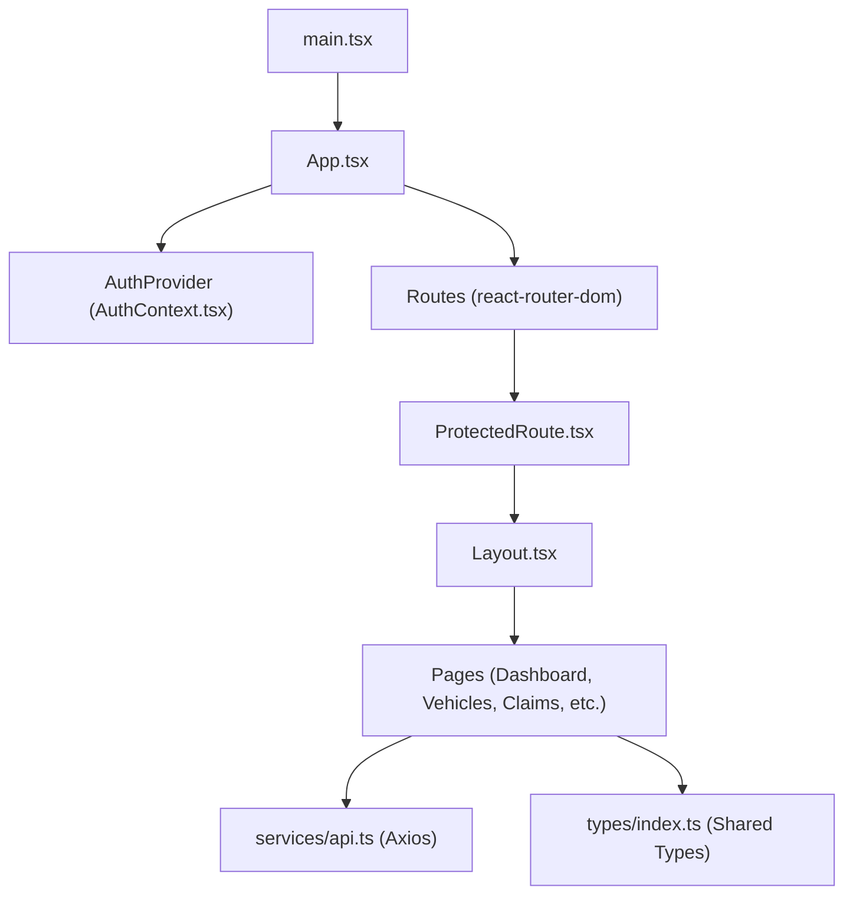
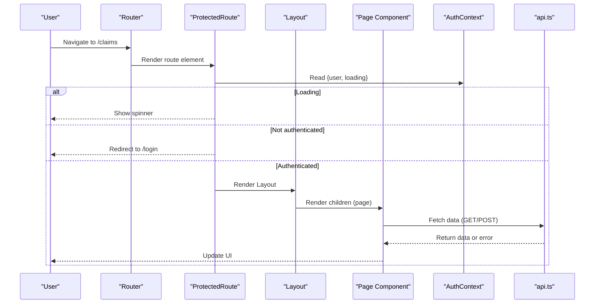
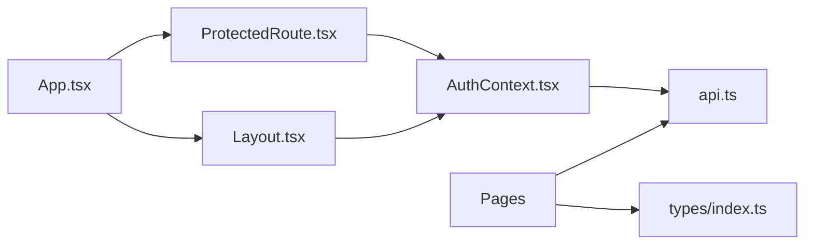

# Component Architecture

<cite>
**Referenced Files in This Document**
- [App.tsx](file://frontend/src/App.tsx)
- [main.tsx](file://frontend/src/main.tsx)
- [Layout.tsx](file://frontend/src/components/Layout.tsx)
- [ProtectedRoute.tsx](file://frontend/src/components/ProtectedRoute.tsx)
- [AuthContext.tsx](file://frontend/src/context/AuthContext.tsx)
- [api.ts](file://frontend/src/services/api.ts)
- [index.css](file://frontend/src/index.css)
- [DashboardPage.tsx](file://frontend/src/pages/DashboardPage.tsx)
- [LoginPage.tsx](file://frontend/src/pages/LoginPage.tsx)
- [ClaimsPage.tsx](file://frontend/src/pages/ClaimsPage.tsx)
- [VehiclesPage.tsx](file://frontend/src/pages/VehiclesPage.tsx)
- [NewClaimPage.tsx](file://frontend/src/pages/NewClaimPage.tsx)
- [ClaimDetailPage.tsx](file://frontend/src/pages/ClaimDetailPage.tsx)
- [types/index.ts](file://frontend/src/types/index.ts)
</cite>

## Table of Contents
1. Introduction
2. Project Structure
3. Core Components
4. Architecture Overview
5. Detailed Component Analysis
6. Dependency Analysis
7. Performance Considerations
8. Troubleshooting Guide
9. Conclusion

## Introduction
This document explains the React component architecture of the Smart Vehicle Insurance Claim System frontend. It focuses on:
- Layout components that provide consistent UI structure and navigation
- ProtectedRoute components that enforce authentication guards
- Page components that implement business logic for vehicles, claims, and user workflows
- Component composition patterns, prop interfaces, and state management
- Separation of concerns between presentational and container responsibilities
- Reusable UI patterns, lifecycle management, and performance techniques
- Styling with Tailwind CSS and responsive design
- Accessibility considerations and cross-browser compatibility strategies

## Project Structure
The application is a Vite + React SPA with TypeScript. The root entry renders the app inside StrictMode. Routing is handled by react-router-dom. Authentication state is centralized via a context provider. Pages are organized under pages/, shared layout and guards under components/, global types under types/, and HTTP client configuration under services/.

**Diagram sources**
- [main.tsx:1-11](file://frontend/src/main.tsx#L1-L11)
- [App.tsx:1-39](file://frontend/src/App.tsx#L1-L39)
- [AuthContext.tsx:1-82](file://frontend/src/context/AuthContext.tsx#L1-L82)
- [ProtectedRoute.tsx:1-21](file://frontend/src/components/ProtectedRoute.tsx#L1-L21)
- [Layout.tsx:1-176](file://frontend/src/components/Layout.tsx#L1-L176)
- [api.ts:1-33](file://frontend/src/services/api.ts#L1-L33)
- [types/index.ts:1-149](file://frontend/src/types/index.ts#L1-L149)

**Section sources**
- [main.tsx:1-11](file://frontend/src/main.tsx#L1-L11)
- [App.tsx:1-39](file://frontend/src/App.tsx#L1-L39)

## Core Components
- App: Bootstraps routing, wraps all routes with AuthProvider, and defines protected routes using ProtectedRoute and Layout.
- Layout: Provides desktop sidebar, mobile header, mobile overlay navigation, bottom nav, and main content area. Integrates with auth context for user info and logout.
- ProtectedRoute: Guards routes based on authentication state; shows a loading spinner while auth initializes and redirects to login if unauthenticated.
- AuthContext: Centralizes user state, token persistence, login/register/logout/profile update, and initialization from stored token.
- API Client: Axios instance with base URL, automatic Authorization header injection, and 401 handling that clears session and redirects to login.

Key responsibilities:
- Routing and navigation orchestration live in App and Layout.
- Authentication gating lives in ProtectedRoute and AuthContext.
- Data fetching and mutations live in page components via api.ts.
- Shared data contracts live in types/index.ts.

**Section sources**
- [App.tsx:1-39](file://frontend/src/App.tsx#L1-L39)
- [Layout.tsx:1-176](file://frontend/src/components/Layout.tsx#L1-L176)
- [ProtectedRoute.tsx:1-21](file://frontend/src/components/ProtectedRoute.tsx#L1-L21)
- [AuthContext.tsx:1-82](file://frontend/src/context/AuthContext.tsx#L1-L82)
- [api.ts:1-33](file://frontend/src/services/api.ts#L1-L33)

## Architecture Overview
The system follows a layered approach:
- Presentation layer: Pages render domain-specific views (dashboard, vehicles, claims).
- Container layer: Pages manage local state and side effects (data fetching, form handling).
- Infrastructure layer: AuthContext provides global auth state; api.ts handles HTTP concerns; types define contracts.

**Diagram sources**
- [App.tsx:15-35](file://frontend/src/App.tsx#L15-L35)
- [ProtectedRoute.tsx:4-20](file://frontend/src/components/ProtectedRoute.tsx#L4-L20)
- [Layout.tsx:14-176](file://frontend/src/components/Layout.tsx#L14-L176)
- [AuthContext.tsx:17-82](file://frontend/src/context/AuthContext.tsx#L17-L82)
- [api.ts:1-33](file://frontend/src/services/api.ts#L1-L33)

## Detailed Component Analysis

### Layout Component
Responsibilities:
- Consistent shell with responsive sidebar and mobile navigation
- Active route highlighting using location
- User profile display and sign-out action
- Wraps page content with appropriate spacing and margins

Composition pattern:
- Accepts children to inject page content
- Uses lucide icons for navigation items
- Uses Tailwind utility classes for responsive behavior

State and interactions:
- Local state for mobile sidebar toggle
- Reads user from AuthContext for profile and logout

Accessibility notes:
- Navigation links use semantic <nav> and <Link>
- Buttons have descriptive labels
- Focus states are styled via Tailwind focus utilities

Performance notes:
- Minimal re-renders by keeping state local to Layout
- Icons are lightweight SVGs

Styling approach:
- Tailwind theme colors defined in index.css
- Responsive breakpoints for desktop vs mobile layouts

**Section sources**
- [Layout.tsx:1-176](file://frontend/src/components/Layout.tsx#L1-L176)
- [index.css:1-39](file://frontend/src/index.css#L1-L39)

### ProtectedRoute Component
Responsibilities:
- Guard routes based on authentication state
- Display a loading indicator during auth initialization
- Redirect unauthenticated users to login

State and interactions:
- Reads user and loading from AuthContext
- Uses router redirect when not authenticated

Error handling:
- Relies on AuthContext to initialize auth state
- No direct network calls

**Section sources**
- [ProtectedRoute.tsx:1-21](file://frontend/src/components/ProtectedRoute.tsx#L1-L21)
- [AuthContext.tsx:17-36](file://frontend/src/context/AuthContext.tsx#L17-L36)

### AuthContext
Responsibilities:
- Provide user, token, and loading state globally
- Initialize session from stored token
- Implement login, register, logout, and profile update flows
- Persist token and user to localStorage

Lifecycle:
- On mount, validates existing token and fetches profile
- Updates state on successful operations

Error handling:
- Clears token and user on invalid profile fetch
- Throws if used outside provider

Integration:
- Used by Layout, ProtectedRoute, and pages for auth-related actions

**Section sources**
- [AuthContext.tsx:1-82](file://frontend/src/context/AuthContext.tsx#L1-L82)

### API Client
Responsibilities:
- Configure axios with base URL and default headers
- Inject Authorization header from localStorage
- Handle 401 responses by clearing session and redirecting to login

Usage:
- All pages call api.get/post/put/delete for backend communication

Error handling:
- Centralized 401 handling ensures consistent logout behavior

**Section sources**
- [api.ts:1-33](file://frontend/src/services/api.ts#L1-L33)

### Page Components

#### DashboardPage
- Displays overview stats for vehicles and claims
- Fetches data concurrently using Promise.all
- Shows recent claims list with status badges
- Uses Tailwind grid and cards for responsive layout

State and lifecycle:
- Local state for vehicles, claims, and loading
- useEffect to fetch initial data

Performance:
- Concurrent requests reduce load time
- Conditional rendering avoids unnecessary work

**Section sources**
- [DashboardPage.tsx:1-142](file://frontend/src/pages/DashboardPage.tsx#L1-L142)

#### LoginPage
- Handles email/password login form
- Integrates with AuthContext login
- Shows errors and loading states
- Navigates to dashboard on success

Accessibility:
- Form inputs have labels and required attributes
- Error messages are clearly presented

**Section sources**
- [LoginPage.tsx:1-95](file://frontend/src/pages/LoginPage.tsx#L1-L95)

#### ClaimsPage
- Lists claims with optional filter by status
- Fetches filtered data from backend
- Displays claim cards with vehicle info, severity, and image count

State and lifecycle:
- Local state for claims, loading, and filter
- useEffect triggers fetch on filter change

**Section sources**
- [ClaimsPage.tsx:1-98](file://frontend/src/pages/ClaimsPage.tsx#L1-L98)

#### VehiclesPage
- Lists vehicles and navigates to detail/add forms
- Detail view shows vehicle info, claim history, and delete action
- Add form creates new vehicle and navigates to detail

State and lifecycle:
- Local state for vehicles and loading
- useEffect to fetch vehicles
- Delete flow uses confirm dialog and navigation

**Section sources**
- [VehiclesPage.tsx:1-169](file://frontend/src/pages/VehiclesPage.tsx#L1-L169)

#### NewClaimPage
- Multi-step wizard for creating claims
- Steps: incident info, full vehicle photos, damage photos, review & submit
- Uses drag-and-drop for images and uploads via multipart/form-data
- Creates claim first, then uploads images, then submits

State and lifecycle:
- Local state for step, form, uploaded images, and loading
- Validation per step controls navigation
- Uploads images after claim creation

Performance:
- Uses useCallback for drop handlers to avoid unnecessary re-renders
- Stages uploads to improve UX

**Section sources**
- [NewClaimPage.tsx:1-252](file://frontend/src/pages/NewClaimPage.tsx#L1-L252)

#### ClaimDetailPage
- Displays claim details, images, damage assessment, repair estimate, payout, documents
- Supports AI analysis trigger, document upload, verification, and chat interaction
- Shows quick messages for common queries

State and lifecycle:
- Local state for claim, analyzing, chat input/loading, document upload state
- useEffect to fetch claim by id
- Actions trigger API calls and refresh claim data

Accessibility:
- Clear section headings and status badges
- Descriptive buttons and inputs

**Section sources**
- [ClaimDetailPage.tsx:1-290](file://frontend/src/pages/ClaimDetailPage.tsx#L1-L290)

### Component Composition Patterns
- Route composition: App composes Routes with ProtectedRoute wrapping Layout and page components.
- Shell composition: Layout composes children to render page content within a consistent shell.
- Context composition: AuthProvider wraps the app to provide auth state globally.

Prop interfaces:
- Layout accepts children: React.ReactNode
- ProtectedRoute accepts children: React.ReactNode
- Pages accept no props; they read from context and params

State management:
- Local state via useState for UI and data in each page
- Global state via AuthContext for authentication
- Side effects via useEffect for data fetching and initialization

Separation of concerns:
- Presentational: Layout and page JSX focus on UI and styling
- Container: Pages handle data fetching, form handling, and navigation
- Infrastructure: AuthContext and api.ts encapsulate auth and HTTP concerns

**Section sources**
- [App.tsx:15-35](file://frontend/src/App.tsx#L15-L35)
- [Layout.tsx:14-176](file://frontend/src/components/Layout.tsx#L14-L176)
- [ProtectedRoute.tsx:4-20](file://frontend/src/components/ProtectedRoute.tsx#L4-L20)
- [AuthContext.tsx:17-82](file://frontend/src/context/AuthContext.tsx#L17-L82)

## Dependency Analysis
High-level dependencies:
- App depends on Router, AuthProvider, ProtectedRoute, Layout, and pages
- Pages depend on api.ts for data and types for contracts
- Layout depends on AuthContext for user and logout
- ProtectedRoute depends on AuthContext for auth state
- AuthContext depends on api.ts for profile validation and updates

**Diagram sources**
- [App.tsx:1-39](file://frontend/src/App.tsx#L1-L39)
- [ProtectedRoute.tsx:1-21](file://frontend/src/components/ProtectedRoute.tsx#L1-L21)
- [Layout.tsx:1-176](file://frontend/src/components/Layout.tsx#L1-L176)
- [AuthContext.tsx:1-82](file://frontend/src/context/AuthContext.tsx#L1-L82)
- [api.ts:1-33](file://frontend/src/services/api.ts#L1-L33)
- [types/index.ts:1-149](file://frontend/src/types/index.ts#L1-L149)

**Section sources**
- [App.tsx:1-39](file://frontend/src/App.tsx#L1-L39)
- [api.ts:1-33](file://frontend/src/services/api.ts#L1-L33)
- [types/index.ts:1-149](file://frontend/src/types/index.ts#L1-L149)

## Performance Considerations
- Concurrent data fetching: Use Promise.all where possible to reduce total load time (e.g., dashboard fetching vehicles and claims together).
- Conditional rendering: Avoid rendering heavy sections until data is available.
- Memoization: Use useCallback for event handlers like dropzone callbacks to prevent unnecessary re-renders.
- State locality: Keep UI state close to where it is used to minimize re-renders across the tree.
- Image handling: Use object URLs for previews and ensure proper cleanup to avoid memory leaks.
- Network optimization: Centralize interceptors for auth and error handling to avoid redundant logic in components.

[No sources needed since this section provides general guidance]

## Troubleshooting Guide
Common issues and resolutions:
- Unauthenticated access: If a protected route redirects unexpectedly, verify that AuthContext has initialized and that the token exists in localStorage. Check 401 interceptor behavior in api.ts.
- Login failures: Ensure credentials are correct and that the backend returns expected response shape. Errors are surfaced in LoginPage.
- Data fetch errors: Pages catch errors and set loading to false; check console logs and network tab for failed requests.
- File uploads: Ensure Content-Type is set to multipart/form-data when uploading images or documents. Verify server endpoints accept multipart payloads.
- Session persistence: After logout, tokens and user data are cleared. Re-login required to access protected routes.

**Section sources**
- [ProtectedRoute.tsx:4-20](file://frontend/src/components/ProtectedRoute.tsx#L4-L20)
- [AuthContext.tsx:17-82](file://frontend/src/context/AuthContext.tsx#L17-L82)
- [api.ts:10-30](file://frontend/src/services/api.ts#L10-L30)
- [LoginPage.tsx:14-27](file://frontend/src/pages/LoginPage.tsx#L14-L27)
- [NewClaimPage.tsx:62-94](file://frontend/src/pages/NewClaimPage.tsx#L62-L94)
- [ClaimDetailPage.tsx:36-67](file://frontend/src/pages/ClaimDetailPage.tsx#L36-L67)

## Conclusion
The frontend architecture cleanly separates concerns:
- Routing and layout are managed centrally in App and Layout
- Authentication is abstracted via AuthContext and enforced by ProtectedRoute
- Pages encapsulate business logic and UI state
- Shared types ensure consistency across components
- Tailwind CSS enables responsive, accessible UI with consistent theming

This structure supports scalability, maintainability, and a good developer experience while providing a robust foundation for future enhancements.

[No sources needed since this section summarizes without analyzing specific files]