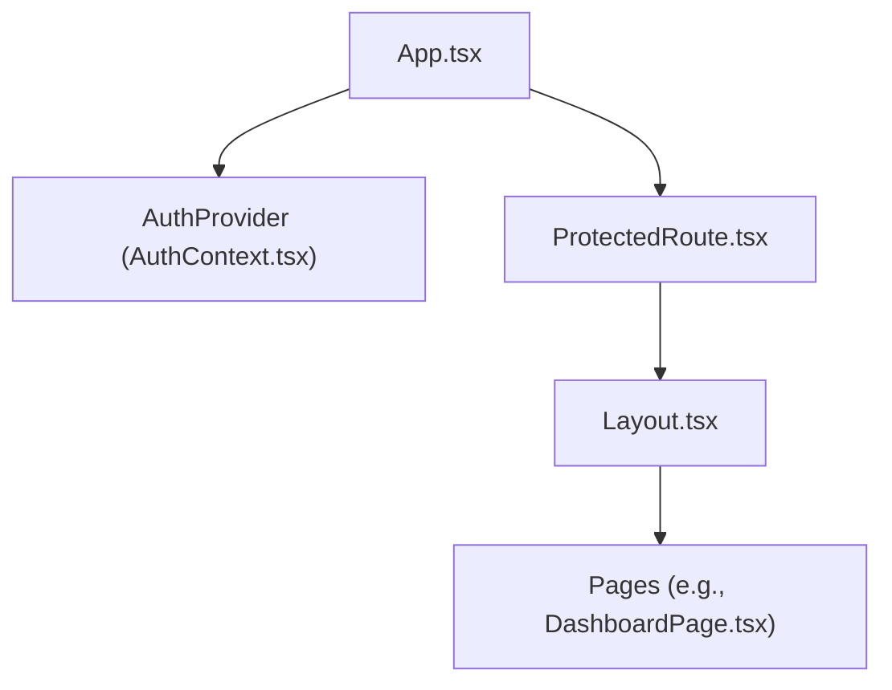
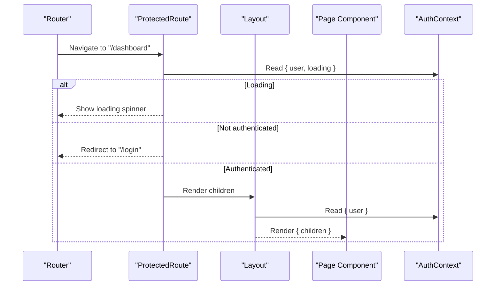
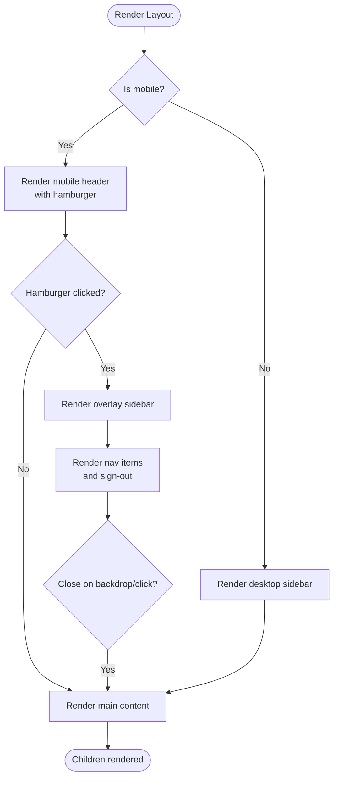
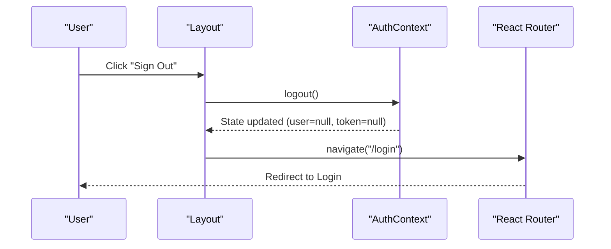
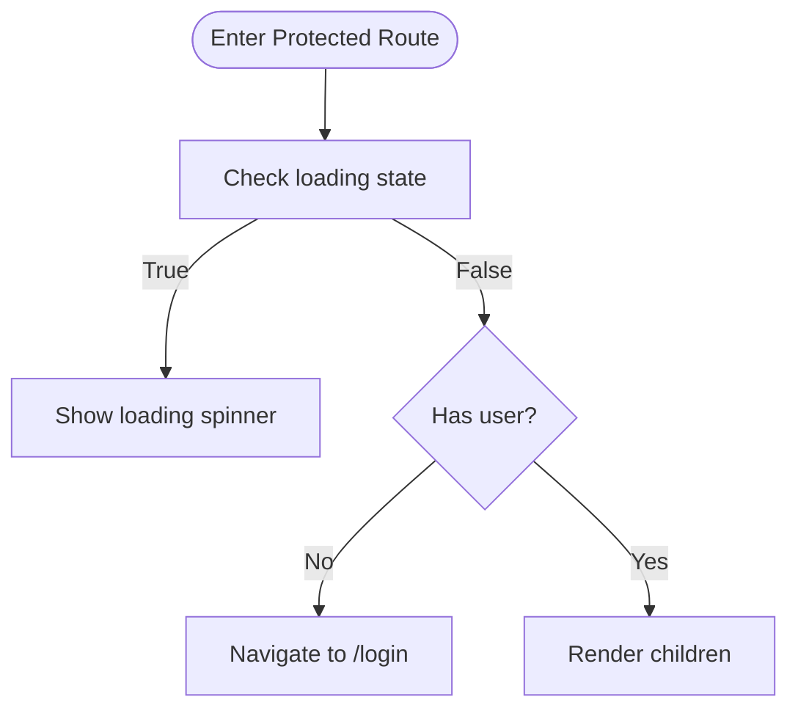
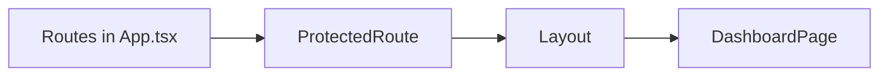
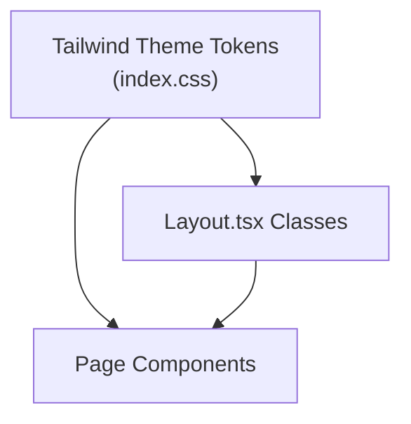
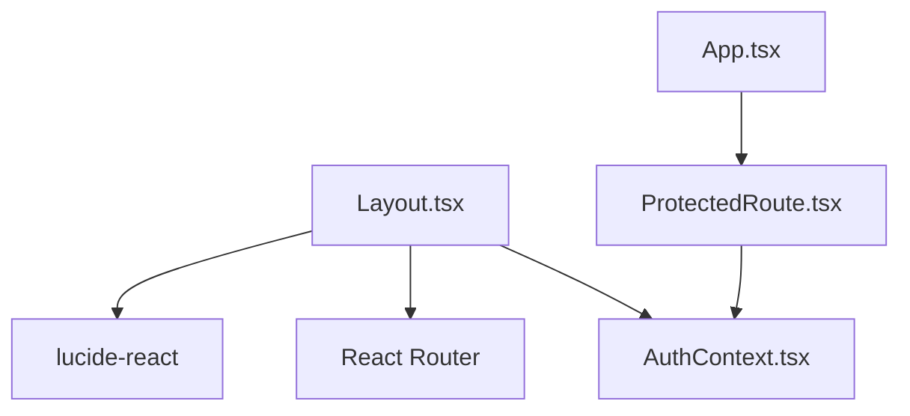

# Layout Components

<cite>
**Referenced Files in This Document**
- [Layout.tsx](file://frontend/src/components/Layout.tsx)
- [AuthContext.tsx](file://frontend/src/context/AuthContext.tsx)
- [App.tsx](file://frontend/src/App.tsx)
- [ProtectedRoute.tsx](file://frontend/src/components/ProtectedRoute.tsx)
- [DashboardPage.tsx](file://frontend/src/pages/DashboardPage.tsx)
- [index.css](file://frontend/src/index.css)
</cite>

## Table of Contents
1. [Introduction](#introduction)
2. [Project Structure](#project-structure)
3. [Core Components](#core-components)
4. [Architecture Overview](#architecture-overview)
5. [Detailed Component Analysis](#detailed-component-analysis)
6. [Dependency Analysis](#dependency-analysis)
7. [Performance Considerations](#performance-considerations)
8. [Troubleshooting Guide](#troubleshooting-guide)
9. [Conclusion](#conclusion)

## Introduction
This document explains the Layout component architecture in the Smart Vehicle Insurance Claim System. It focuses on how the main Layout provides a consistent UI shell, responsive navigation for desktop and mobile, user session management via authentication context, and integration with child pages. It also covers styling patterns using Tailwind CSS, accessibility considerations, and performance optimizations such as conditional rendering and state-driven navigation.

## Project Structure
The layout is implemented as a reusable wrapper that:
- Renders a desktop sidebar with navigation items and user profile controls
- Provides a mobile header with a hamburger menu and an overlay sidebar
- Includes a bottom navigation bar for quick access to primary sections on mobile
- Wraps all protected routes with this layout to ensure consistent chrome across pages

**Diagram sources**
- [App.tsx:15-35](file://frontend/src/App.tsx#L15-L35)
- [ProtectedRoute.tsx:4-20](file://frontend/src/components/ProtectedRoute.tsx#L4-L20)
- [Layout.tsx:14-175](file://frontend/src/components/Layout.tsx#L14-L175)
- [DashboardPage.tsx:8-142](file://frontend/src/pages/DashboardPage.tsx#L8-L142)

**Section sources**
- [App.tsx:15-35](file://frontend/src/App.tsx#L15-L35)
- [ProtectedRoute.tsx:4-20](file://frontend/src/components/ProtectedRoute.tsx#L4-L20)
- [Layout.tsx:14-175](file://frontend/src/components/Layout.tsx#L14-L175)

## Core Components
- Layout: The central container providing desktop sidebar, mobile header/overlay, bottom nav, and content area. It manages local state for mobile sidebar visibility and integrates with routing and authentication.
- AuthContext: Provides user data, token, loading state, and actions like login, register, logout, and profile updates.
- ProtectedRoute: Guards routes by checking authentication status and redirects unauthenticated users to login while showing a loading spinner during initialization.
- Pages: Child components rendered inside the Layout, such as DashboardPage, which demonstrate typical usage patterns within the layout’s content area.

Key responsibilities:
- Consistent structure: fixed sidebar on desktop, top header on mobile, and a main content area with padding.
- Navigation: active state based on current route path; links to dashboard, vehicles, claims, policies, and profile.
- User session: displays initials and name/email from the authenticated user; supports sign out.
- Responsive behavior: toggles between desktop and mobile navigation patterns using Tailwind breakpoints.

**Section sources**
- [Layout.tsx:14-175](file://frontend/src/components/Layout.tsx#L14-L175)
- [AuthContext.tsx:17-81](file://frontend/src/context/AuthContext.tsx#L17-L81)
- [ProtectedRoute.tsx:4-20](file://frontend/src/components/ProtectedRoute.tsx#L4-L20)
- [DashboardPage.tsx:8-142](file://frontend/src/pages/DashboardPage.tsx#L8-L142)

## Architecture Overview
The application bootstraps with a router and global auth provider. Protected routes wrap page components with the Layout to provide consistent navigation and user controls. The Layout consumes authentication context to render user-specific information and handle logout.

**Diagram sources**
- [App.tsx:15-35](file://frontend/src/App.tsx#L15-L35)
- [ProtectedRoute.tsx:4-20](file://frontend/src/components/ProtectedRoute.tsx#L4-L20)
- [Layout.tsx:14-175](file://frontend/src/components/Layout.tsx#L14-L175)
- [AuthContext.tsx:17-81](file://frontend/src/context/AuthContext.tsx#L17-L81)

## Detailed Component Analysis

### Layout Component
Responsibilities:
- Desktop sidebar:
  - Displays logo and branding
  - Lists navigation items with icons and labels
  - Highlights the active item based on current route
  - Shows user profile section with initials, name, email, and sign-out button
- Mobile header:
  - Fixed top bar with logo and hamburger toggle
  - Toggles overlay sidebar visibility
- Mobile overlay sidebar:
  - Full-screen backdrop with slide-in panel
  - Same navigation items and sign-out action
  - Closes on link click or backdrop tap
- Main content:
  - Responsive padding and margin adjustments
  - Renders child pages via props
- Mobile bottom navigation:
  - Fixed bottom bar with up to four primary items
  - Active state based on current route

State and interactions:
- Local state: sidebarOpen boolean toggles mobile overlay
- Routing: uses location and navigate to determine active states and perform navigation
- Authentication: reads user data and triggers logout flow

Styling patterns:
- Uses Tailwind utility classes for layout, spacing, colors, and responsive breakpoints
- Custom theme tokens (primary shades) are defined globally and referenced via class names

Accessibility considerations:
- Semantic elements: aside for navigation, main for content, nav for bottom bar
- Keyboard-friendly links and buttons
- Focus management: closing overlay on backdrop click helps return focus context
- ARIA enhancements can be added (e.g., aria-expanded on hamburger, aria-labels on icon-only buttons)

Performance considerations:
- Conditional rendering: mobile overlay only renders when needed
- Minimal re-renders: active state computed from route without extra state
- Lightweight icons and text-based labels reduce DOM complexity

**Diagram sources**
- [Layout.tsx:25-175](file://frontend/src/components/Layout.tsx#L25-L175)

**Section sources**
- [Layout.tsx:14-175](file://frontend/src/components/Layout.tsx#L14-L175)

### Authentication Context Integration
- The Layout consumes the authentication context to:
  - Display user initials and details in the sidebar
  - Trigger logout and redirect to login on sign-out
- The context maintains:
  - Current user object and token
  - Loading state during initial auth check
  - Actions for login, register, logout, and profile update

Logout flow:
- Clicking sign-out calls the logout function from context
- Clears persisted token and user data
- Navigates to the login route

**Diagram sources**
- [Layout.tsx:20-23](file://frontend/src/components/Layout.tsx#L20-L23)
- [AuthContext.tsx:56-61](file://frontend/src/context/AuthContext.tsx#L56-L61)

**Section sources**
- [AuthContext.tsx:17-81](file://frontend/src/context/AuthContext.tsx#L17-L81)
- [Layout.tsx:20-23](file://frontend/src/components/Layout.tsx#L20-L23)

### Protected Route Behavior
- Displays a loading spinner while authentication initializes
- Redirects unauthenticated users to login
- Renders wrapped children (pages) when authenticated

**Diagram sources**
- [ProtectedRoute.tsx:4-20](file://frontend/src/components/ProtectedRoute.tsx#L4-L20)

**Section sources**
- [ProtectedRoute.tsx:4-20](file://frontend/src/components/ProtectedRoute.tsx#L4-L20)

### Child Components Rendering Example
- All protected routes wrap their page components with Layout to inherit navigation and user controls
- Example: DashboardPage is rendered inside Layout under the protected route for /dashboard
- Pages can use the same Tailwind theme tokens and icons consistently

**Diagram sources**
- [App.tsx:23-31](file://frontend/src/App.tsx#L23-L31)
- [DashboardPage.tsx:8-142](file://frontend/src/pages/DashboardPage.tsx#L8-L142)

**Section sources**
- [App.tsx:23-31](file://frontend/src/App.tsx#L23-L31)
- [DashboardPage.tsx:8-142](file://frontend/src/pages/DashboardPage.tsx#L8-L142)

### Styling Patterns with Tailwind CSS
- Global theme tokens define a cohesive color palette used throughout the app
- Layout uses semantic classes for layout, spacing, typography, and responsive behavior
- Primary color tokens are applied via class names for active states, highlights, and accents

**Diagram sources**
- [index.css:3-27](file://frontend/src/index.css#L3-L27)
- [Layout.tsx:25-175](file://frontend/src/components/Layout.tsx#L25-L175)
- [DashboardPage.tsx:46-142](file://frontend/src/pages/DashboardPage.tsx#L46-L142)

**Section sources**
- [index.css:3-27](file://frontend/src/index.css#L3-L27)
- [Layout.tsx:25-175](file://frontend/src/components/Layout.tsx#L25-L175)
- [DashboardPage.tsx:46-142](file://frontend/src/pages/DashboardPage.tsx#L46-L142)

## Dependency Analysis
- Layout depends on:
  - React Router for navigation and active state detection
  - Authentication context for user data and logout
  - Icon library for visual cues
- App orchestrates providers and routes, ensuring Layout is available to protected pages
- ProtectedRoute depends on AuthContext to guard access

**Diagram sources**
- [Layout.tsx:1-4](file://frontend/src/components/Layout.tsx#L1-L4)
- [App.tsx:1-4](file://frontend/src/App.tsx#L1-L4)
- [ProtectedRoute.tsx:1-3](file://frontend/src/components/ProtectedRoute.tsx#L1-L3)
- [AuthContext.tsx:1-3](file://frontend/src/context/AuthContext.tsx#L1-L3)

**Section sources**
- [Layout.tsx:1-4](file://frontend/src/components/Layout.tsx#L1-L4)
- [App.tsx:1-4](file://frontend/src/App.tsx#L1-L4)
- [ProtectedRoute.tsx:1-3](file://frontend/src/components/ProtectedRoute.tsx#L1-L3)
- [AuthContext.tsx:1-3](file://frontend/src/context/AuthContext.tsx#L1-L3)

## Performance Considerations
- Conditional rendering:
  - Mobile overlay sidebar renders only when open, reducing unnecessary DOM nodes
  - Bottom navigation conditionally renders only on small screens
- Efficient active state:
  - Active state derived from current route path avoids extra state synchronization
- Minimal re-renders:
  - Local state limited to sidebar toggle; no heavy computations in render
- Accessibility and UX:
  - Backdrop click closes overlay quickly, improving responsiveness
  - Clear visual feedback for active navigation items

[No sources needed since this section provides general guidance]

## Troubleshooting Guide
Common issues and resolutions:
- Sign-out does not redirect:
  - Ensure logout is called and navigation to login occurs after clearing auth state
  - Verify that the router is available within the Layout context
- Mobile overlay not closing:
  - Confirm backdrop click handler sets sidebar state to false
  - Ensure onClick handlers are attached to both backdrop and close button
- Active state not updating:
  - Verify that route paths match navigation items and that pathname comparison logic is correct
- Unauthenticated access:
  - Confirm ProtectedRoute checks loading and user state, and redirects appropriately

**Section sources**
- [Layout.tsx:20-23](file://frontend/src/components/Layout.tsx#L20-L23)
- [Layout.tsx:96-143](file://frontend/src/components/Layout.tsx#L96-L143)
- [ProtectedRoute.tsx:4-20](file://frontend/src/components/ProtectedRoute.tsx#L4-L20)

## Conclusion
The Layout component provides a robust, responsive foundation for the Smart Vehicle Insurance Claim System. It standardizes navigation, user session display, and content presentation across desktop and mobile devices. By integrating with the authentication context and leveraging Tailwind CSS, it ensures a consistent user experience while maintaining performance through conditional rendering and efficient state management. Protected routes guarantee secure access to features, and the modular design allows easy extension for additional navigation items or UI enhancements.