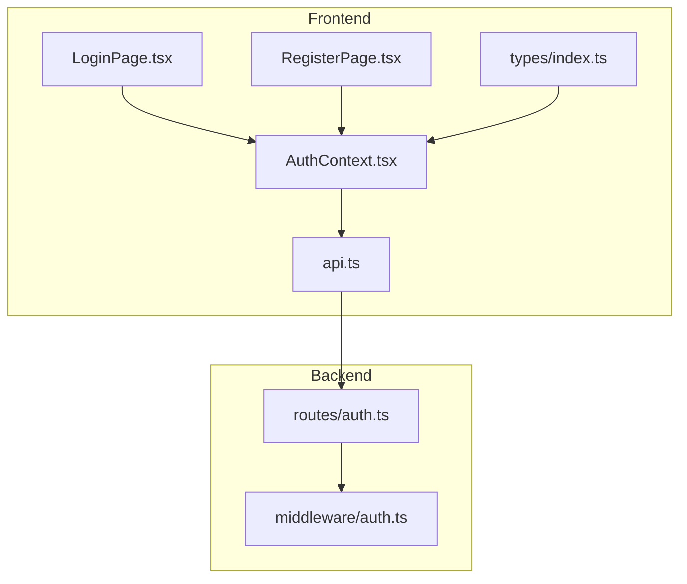
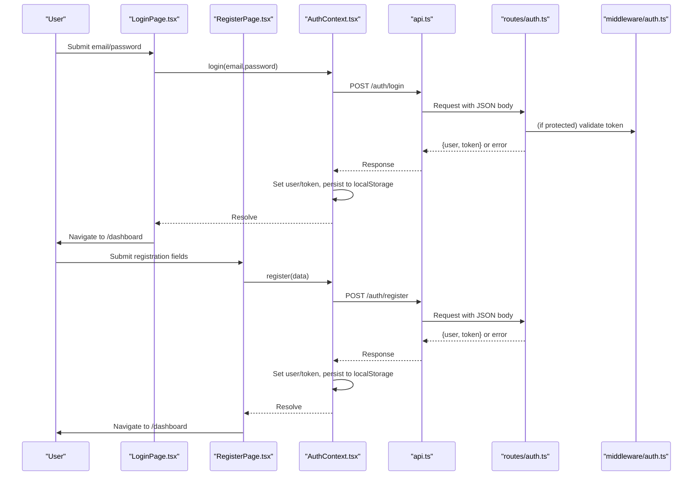
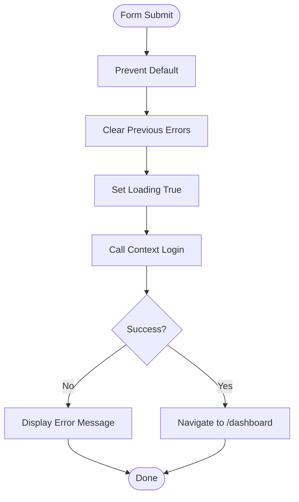
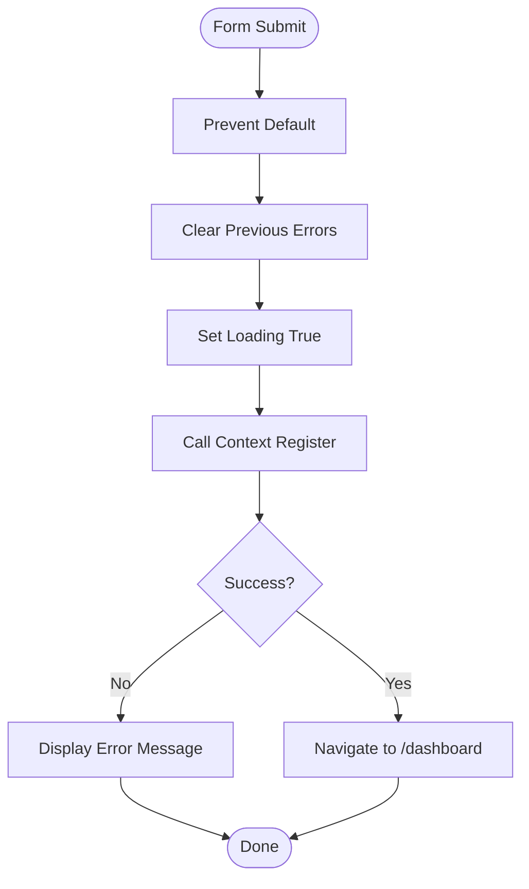
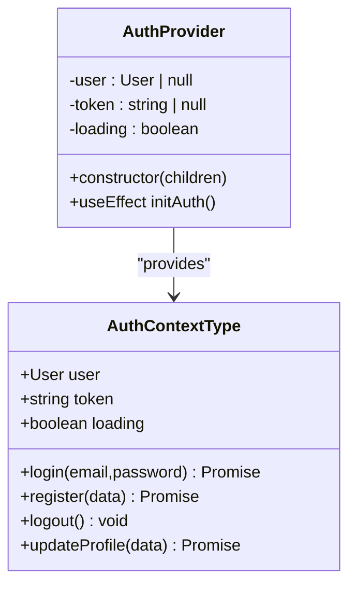
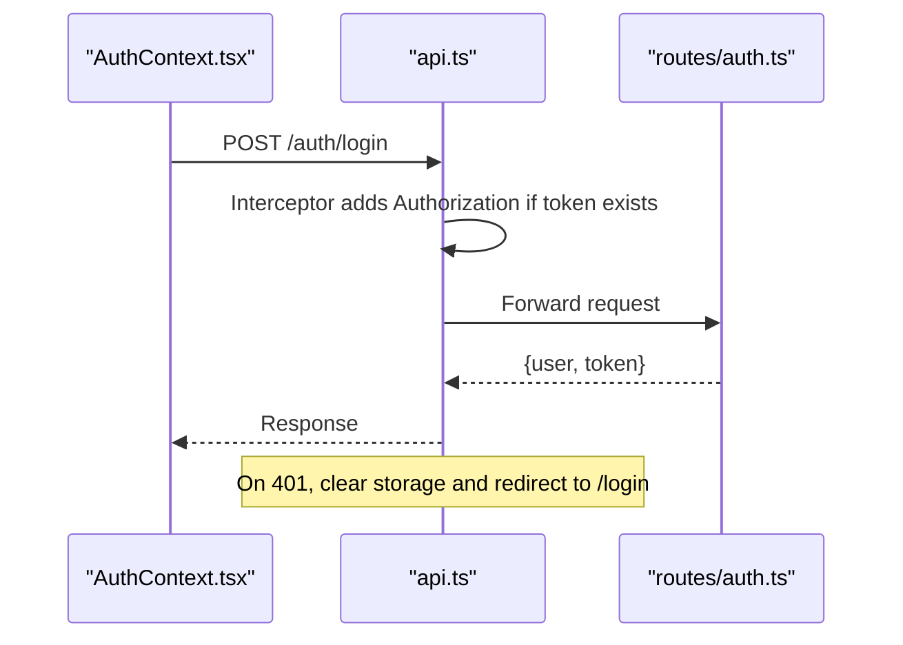
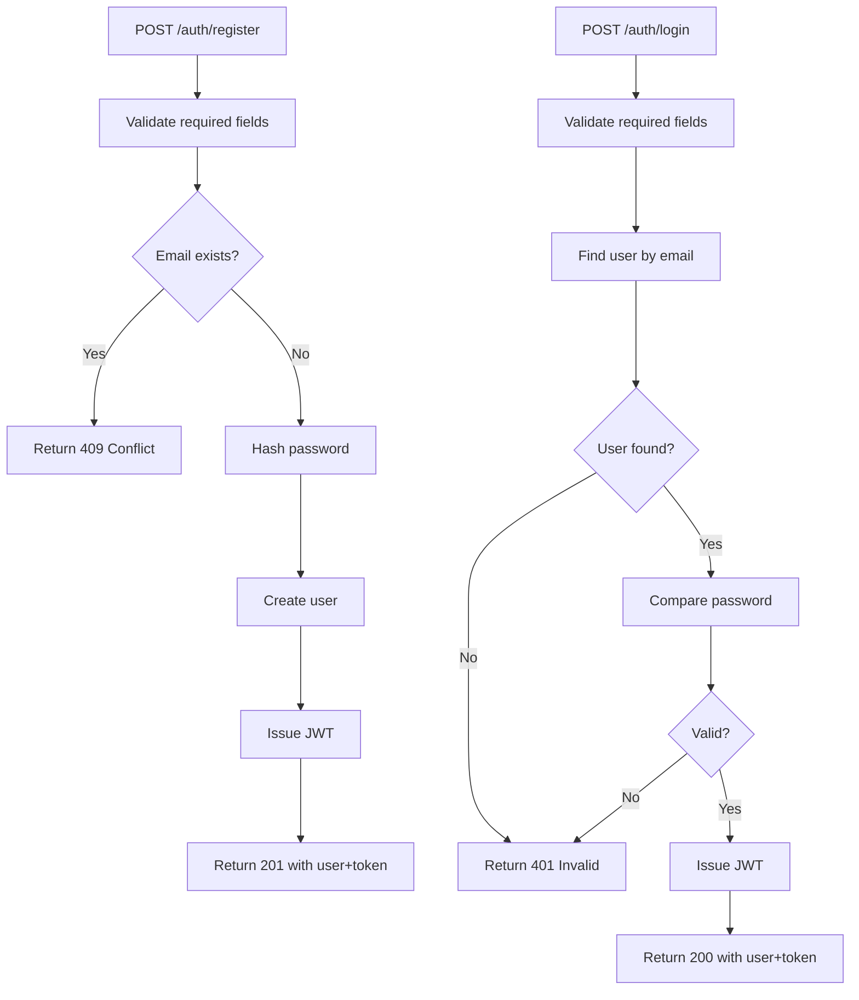
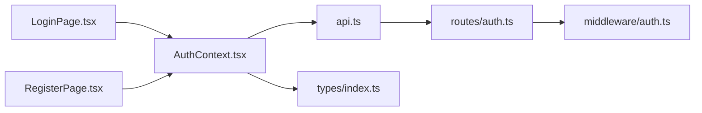

# Authentication Pages

<cite>
**Referenced Files in This Document**
- [LoginPage.tsx](file://frontend/src/pages/LoginPage.tsx)
- [RegisterPage.tsx](file://frontend/src/pages/RegisterPage.tsx)
- [AuthContext.tsx](file://frontend/src/context/AuthContext.tsx)
- [api.ts](file://frontend/src/services/api.ts)
- [index.ts (types)](file://frontend/src/types/index.ts)
- [auth.ts (routes)](file://backend/src/routes/auth.ts)
- [auth.ts (middleware)](file://backend/src/middleware/auth.ts)
</cite>

## Table of Contents
1. [Introduction](#introduction)
2. [Project Structure](#project-structure)
3. [Core Components](#core-components)
4. [Architecture Overview](#architecture-overview)
5. [Detailed Component Analysis](#detailed-component-analysis)
6. [Dependency Analysis](#dependency-analysis)
7. [Performance Considerations](#performance-considerations)
8. [Troubleshooting Guide](#troubleshooting-guide)
9. [Conclusion](#conclusion)

## Introduction
This document explains the authentication-related page components LoginPage and RegisterPage, focusing on form handling patterns, validation strategies, error handling mechanisms, integration with the authentication context for session management, and interaction with the API service layer. It also details field structures, input validation rules, user feedback, successful flows, error scenarios, redirect logic, and security considerations such as password handling and form sanitization.

## Project Structure
The authentication feature spans frontend pages, a shared authentication context, an HTTP client configuration, type definitions, and backend routes and middleware:
- Frontend pages implement forms and navigation
- AuthContext manages session state and token persistence
- api.ts configures axios interceptors for authorization and 401 handling
- Backend routes handle registration, login, profile retrieval, and updates
- Middleware validates tokens for protected endpoints

**Diagram sources**
- [LoginPage.tsx:1-95](file://frontend/src/pages/LoginPage.tsx#L1-L95)
- [RegisterPage.tsx:1-102](file://frontend/src/pages/RegisterPage.tsx#L1-L102)
- [AuthContext.tsx:1-82](file://frontend/src/context/AuthContext.tsx#L1-L82)
- [api.ts:1-33](file://frontend/src/services/api.ts#L1-L33)
- [auth.ts (routes):1-166](file://backend/src/routes/auth.ts#L1-L166)
- [auth.ts (middleware):1-23](file://backend/src/middleware/auth.ts#L1-L23)

**Section sources**
- [LoginPage.tsx:1-95](file://frontend/src/pages/LoginPage.tsx#L1-L95)
- [RegisterPage.tsx:1-102](file://frontend/src/pages/RegisterPage.tsx#L1-L102)
- [AuthContext.tsx:1-82](file://frontend/src/context/AuthContext.tsx#L1-L82)
- [api.ts:1-33](file://frontend/src/services/api.ts#L1-L33)
- [auth.ts (routes):1-166](file://backend/src/routes/auth.ts#L1-L166)
- [auth.ts (middleware):1-23](file://backend/src/middleware/auth.ts#L1-L23)

## Core Components
- LoginPage: Handles email/password submission, calls context login, navigates to dashboard on success, shows errors inline.
- RegisterPage: Handles multi-field registration form, calls context register, navigates to dashboard on success, shows errors inline.
- AuthContext: Provides login/register/logout/updateProfile, persists token and user to localStorage, initializes session from stored token by fetching profile.
- api.ts: Axios instance with base URL, automatic Authorization header injection via interceptor, and global 401 handling that clears storage and redirects to login.
- Backend auth routes: Implement registration, login, profile retrieval/updates with secure password hashing and JWT issuance/validation.
- Backend auth middleware: Validates Bearer tokens for protected endpoints.

Key responsibilities:
- Form handling: Controlled inputs, preventDefault, async submit handlers
- Validation: HTML5 constraints (required, minLength), plus backend validation
- Error handling: Try/catch in pages, backend status codes, global 401 interceptor
- Session management: Token/user stored in localStorage; context maintains React state
- Navigation: useNavigate to /dashboard after successful actions

**Section sources**
- [LoginPage.tsx:14-27](file://frontend/src/pages/LoginPage.tsx#L14-L27)
- [RegisterPage.tsx:13-26](file://frontend/src/pages/RegisterPage.tsx#L13-L26)
- [AuthContext.tsx:17-66](file://frontend/src/context/AuthContext.tsx#L17-L66)
- [api.ts:10-30](file://frontend/src/services/api.ts#L10-L30)
- [auth.ts (routes):11-104](file://backend/src/routes/auth.ts#L11-L104)
- [auth.ts (middleware):5-22](file://backend/src/middleware/auth.ts#L5-L22)

## Architecture Overview
The authentication flow integrates UI, context, HTTP client, and backend services:

**Diagram sources**
- [LoginPage.tsx:14-27](file://frontend/src/pages/LoginPage.tsx#L14-L27)
- [RegisterPage.tsx:13-26](file://frontend/src/pages/RegisterPage.tsx#L13-L26)
- [AuthContext.tsx:38-54](file://frontend/src/context/AuthContext.tsx#L38-L54)
- [api.ts:10-30](file://frontend/src/services/api.ts#L10-L30)
- [auth.ts (routes):11-104](file://backend/src/routes/auth.ts#L11-L104)
- [auth.ts (middleware):5-22](file://backend/src/middleware/auth.ts#L5-L22)

## Detailed Component Analysis

### LoginPage
- Form fields: email, password
- Validation: HTML5 required attributes; no custom regex
- Submission: Prevents default, clears previous errors, sets loading, calls context login
- Error handling: Catches errors from context, displays server-provided message or fallback
- Redirect: Navigates to /dashboard on success
- User feedback: Inline error banner with icon; button disabled while loading

**Diagram sources**
- [LoginPage.tsx:14-27](file://frontend/src/pages/LoginPage.tsx#L14-L27)

**Section sources**
- [LoginPage.tsx:14-27](file://frontend/src/pages/LoginPage.tsx#L14-L27)
- [LoginPage.tsx:43-48](file://frontend/src/pages/LoginPage.tsx#L43-L48)
- [LoginPage.tsx:50-82](file://frontend/src/pages/LoginPage.tsx#L50-L82)

### RegisterPage
- Form fields: firstName, lastName, email, password, phone (optional)
- Validation: HTML5 required for name/email/password; password has minimum length; optional phone
- Submission: Prevents default, clears previous errors, sets loading, calls context register
- Error handling: Catches errors from context, displays server-provided message or fallback
- Redirect: Navigates to /dashboard on success
- User feedback: Inline error banner; button disabled while loading

**Diagram sources**
- [RegisterPage.tsx:13-26](file://frontend/src/pages/RegisterPage.tsx#L13-L26)

**Section sources**
- [RegisterPage.tsx:13-26](file://frontend/src/pages/RegisterPage.tsx#L13-L26)
- [RegisterPage.tsx:45-50](file://frontend/src/pages/RegisterPage.tsx#L45-L50)
- [RegisterPage.tsx:52-91](file://frontend/src/pages/RegisterPage.tsx#L52-L91)

### AuthContext (Session Management)
- State: user, token, loading
- Initialization: If token exists in localStorage, fetches profile to hydrate user state; clears invalid sessions
- login: Posts credentials, stores user and token in state and localStorage
- register: Posts registration data, stores user and token in state and localStorage
- logout: Clears state and localStorage
- updateProfile: Updates user via PUT and refreshes state

**Diagram sources**
- [AuthContext.tsx:5-13](file://frontend/src/context/AuthContext.tsx#L5-L13)
- [AuthContext.tsx:17-66](file://frontend/src/context/AuthContext.tsx#L17-L66)

**Section sources**
- [AuthContext.tsx:17-66](file://frontend/src/context/AuthContext.tsx#L17-L66)

### API Service Layer
- Base URL set to /api
- Request interceptor injects Authorization header using token from localStorage when present
- Response interceptor handles 401 by clearing token/user from localStorage and redirecting to /login
- Used by AuthContext for all authenticated requests

**Diagram sources**
- [api.ts:10-30](file://frontend/src/services/api.ts#L10-L30)
- [AuthContext.tsx:38-54](file://frontend/src/context/AuthContext.tsx#L38-L54)
- [auth.ts (routes):11-104](file://backend/src/routes/auth.ts#L11-L104)

**Section sources**
- [api.ts:1-33](file://frontend/src/services/api.ts#L1-33)

### Backend Authentication Routes and Middleware
- Registration: Validates required fields, checks uniqueness, hashes password, creates user, issues JWT, returns user and token
- Login: Validates required fields, finds user, compares password hash, issues JWT, returns user and token
- Profile GET/PUT: Protected by middleware; reads/writes user fields
- Middleware: Extracts Bearer token, verifies signature, attaches userId to request

**Diagram sources**
- [auth.ts (routes):11-104](file://backend/src/routes/auth.ts#L11-L104)

**Section sources**
- [auth.ts (routes):11-104](file://backend/src/routes/auth.ts#L11-L104)
- [auth.ts (middleware):5-22](file://backend/src/middleware/auth.ts#L5-L22)

## Dependency Analysis
- LoginPage depends on:
  - React Router for navigation
  - AuthContext for login action
  - Types for implicit shape of user returned by context
- RegisterPage depends on:
  - React Router for navigation
  - AuthContext for register action
  - Types for implicit shape of user returned by context
- AuthContext depends on:
  - api.ts for HTTP calls
  - types/index.ts for User and AuthResponse shapes
- api.ts depends on:
  - axios for HTTP
  - localStorage for token persistence
- Backend routes depend on:
  - Prisma for database access
  - bcryptjs for password hashing
  - jsonwebtoken for token issuance
  - middleware/auth for protecting endpoints

**Diagram sources**
- [LoginPage.tsx:1-95](file://frontend/src/pages/LoginPage.tsx#L1-L95)
- [RegisterPage.tsx:1-102](file://frontend/src/pages/RegisterPage.tsx#L1-L102)
- [AuthContext.tsx:1-82](file://frontend/src/context/AuthContext.tsx#L1-L82)
- [api.ts:1-33](file://frontend/src/services/api.ts#L1-L33)
- [auth.ts (routes):1-166](file://backend/src/routes/auth.ts#L1-L166)
- [auth.ts (middleware):1-23](file://backend/src/middleware/auth.ts#L1-L23)
- [index.ts (types):1-149](file://frontend/src/types/index.ts#L1-L149)

**Section sources**
- [LoginPage.tsx:1-95](file://frontend/src/pages/LoginPage.tsx#L1-L95)
- [RegisterPage.tsx:1-102](file://frontend/src/pages/RegisterPage.tsx#L1-L102)
- [AuthContext.tsx:1-82](file://frontend/src/context/AuthContext.tsx#L1-L82)
- [api.ts:1-33](file://frontend/src/services/api.ts#L1-L33)
- [auth.ts (routes):1-166](file://backend/src/routes/auth.ts#L1-L166)
- [auth.ts (middleware):1-23](file://backend/src/middleware/auth.ts#L1-L23)
- [index.ts (types):1-149](file://frontend/src/types/index.ts#L1-L149)

## Performance Considerations
- Minimize re-renders: Both pages manage minimal local state; consider memoizing handlers if complexity grows.
- Debounce or throttle network calls only if needed; current flows are single-action per submit.
- Avoid unnecessary localStorage writes: AuthContext writes once per successful auth; ensure not called repeatedly.
- Use efficient error states: Clear errors before new submissions to avoid stale messages.

[No sources needed since this section provides general guidance]

## Troubleshooting Guide
Common issues and resolutions:
- Invalid credentials:
  - Backend returns 401 with error message; pages display the message in an alert banner.
  - Ensure email and password match registered values.
- Duplicate registration:
  - Backend returns 409 if email already exists; show user-friendly message.
- Expired or missing token:
  - api.ts interceptor clears storage and redirects to /login on 401 responses.
  - Re-authenticate to restore session.
- Network errors:
  - Catch blocks in pages will show fallback error messages; verify connectivity and backend availability.

Validation tips:
- Frontend uses HTML5 constraints (required, minLength); add custom validation for stricter rules if needed.
- Backend enforces required fields and business rules; always trust server-side validation.

Security notes:
- Passwords are hashed server-side; never log or expose them.
- Tokens are stored in localStorage; consider additional protections based on threat model.
- Sanitize inputs on the backend; avoid rendering unsanitized user input in UI.

**Section sources**
- [LoginPage.tsx:22-24](file://frontend/src/pages/LoginPage.tsx#L22-L24)
- [RegisterPage.tsx:21-23](file://frontend/src/pages/RegisterPage.tsx#L21-L23)
- [api.ts:19-30](file://frontend/src/services/api.ts#L19-L30)
- [auth.ts (routes):15-23](file://backend/src/routes/auth.ts#L15-L23)
- [auth.ts (routes):66-80](file://backend/src/routes/auth.ts#L66-L80)

## Conclusion
LoginPage and RegisterPage provide straightforward, accessible authentication experiences with controlled forms, basic HTML5 validation, and clear user feedback. The AuthContext centralizes session management and integrates seamlessly with the API service layer, which automatically handles authorization headers and 401 redirection. Backend routes enforce robust validation, secure password handling, and JWT-based authentication. Together, these components deliver a reliable and maintainable authentication flow suitable for production use.

[No sources needed since this section summarizes without analyzing specific files]