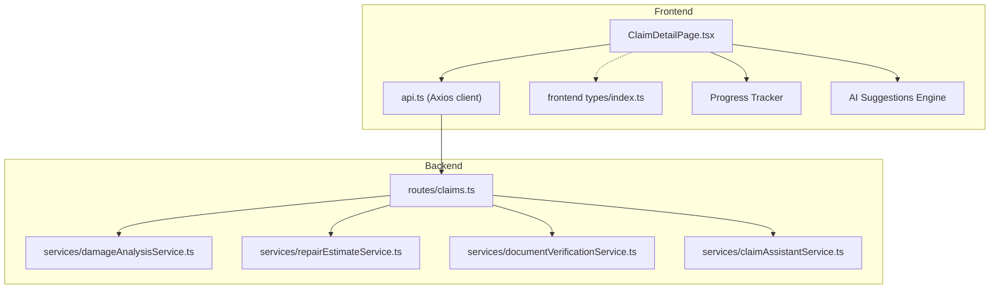
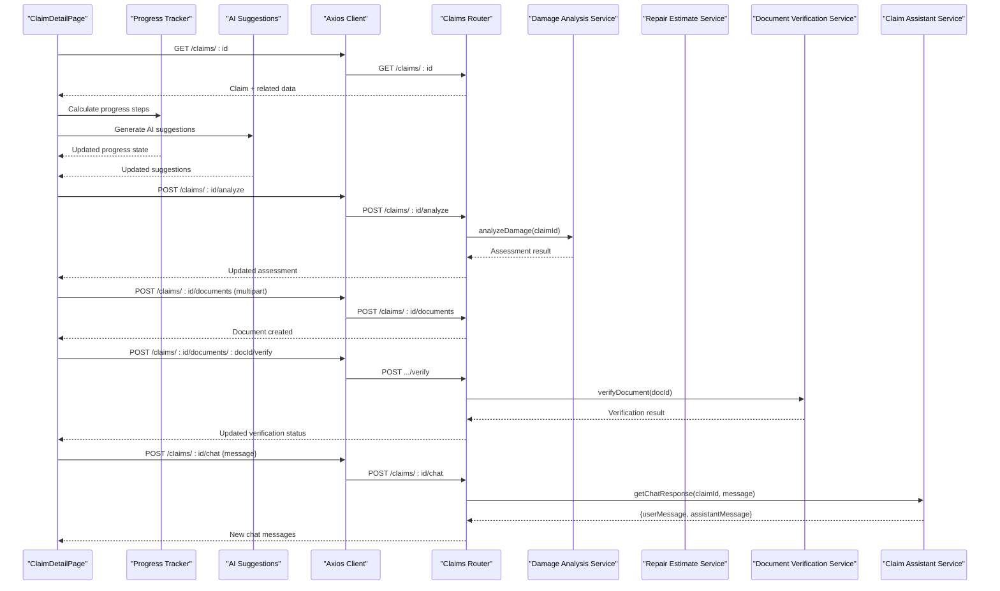
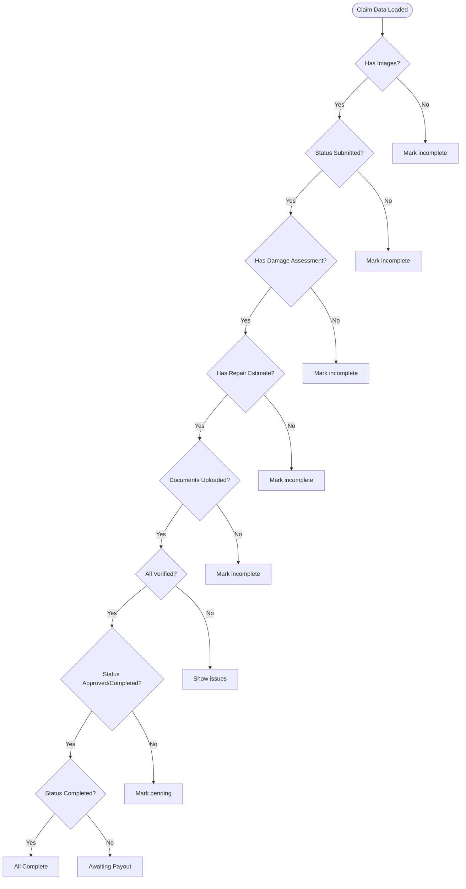
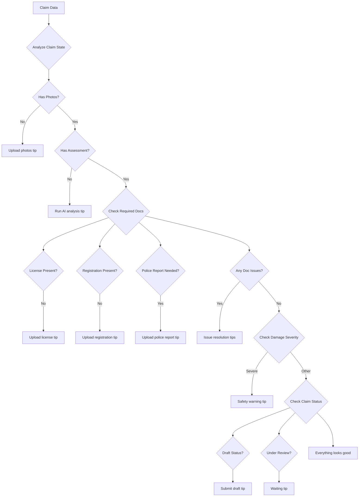
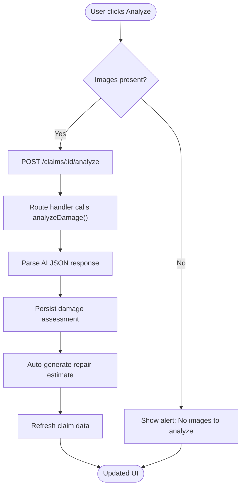
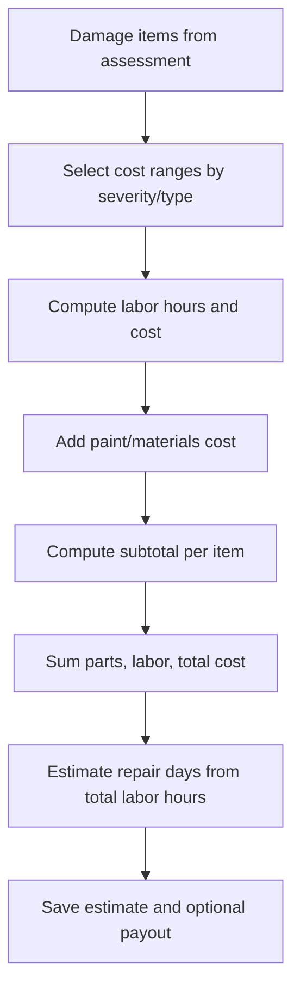
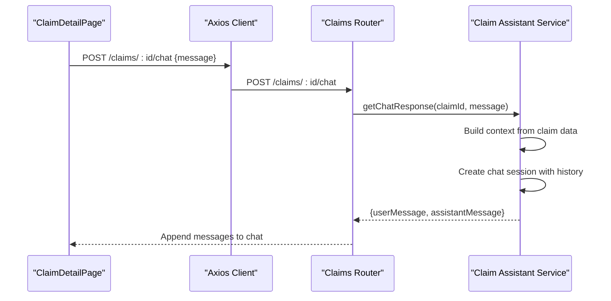
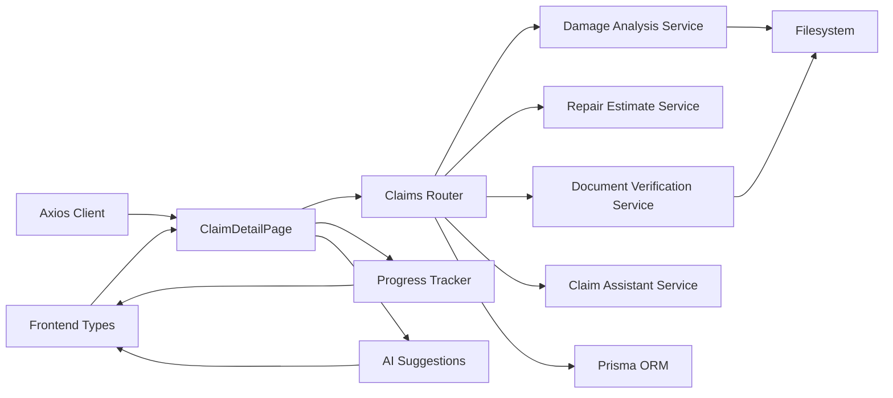

# Claim Detail Management Page

<cite>
**Referenced Files in This Document**
- [ClaimDetailPage.tsx](file://frontend/src/pages/ClaimDetailPage.tsx)
- [claims.ts](file://backend/src/routes/claims.ts)
- [claimAssistantService.ts](file://backend/src/services/claimAssistantService.ts)
- [damageAnalysisService.ts](file://backend/src/services/damageAnalysisService.ts)
- [documentVerificationService.ts](file://backend/src/services/documentVerificationService.ts)
- [repairEstimateService.ts](file://backend/src/services/repairEstimateService.ts)
- [api.ts](file://frontend/src/services/api.ts)
- [types/index.ts (frontend)](file://frontend/src/types/index.ts)
- [types/index.ts (backend)](file://backend/src/types/index.ts)
</cite>

## Update Summary
**Changes Made**
- Added comprehensive claim progress tracking with visual checklist
- Implemented AI-powered suggestions system for contextual guidance
- Enhanced document verification status display with detailed feedback
- Integrated real-time progress indicators and issue detection
- Added smart recommendations based on claim state and user actions

## Table of Contents
1. Introduction
2. Project Structure
3. Core Components
4. Architecture Overview
5. Detailed Component Analysis
6. Dependency Analysis
7. Performance Considerations
8. Troubleshooting Guide
9. Conclusion

## Introduction
This document explains the enhanced ClaimDetailPage component with advanced claim management capabilities including progress tracking, AI-powered suggestions, and comprehensive document verification. It covers:
- Visual display of claim status with color-coded indicators and progress tracking
- AI-powered damage assessment results presentation and re-analysis
- Smart repair estimate generation with cost breakdown display
- Insurance payout estimation with policy integration
- Contextual AI assistant chat for claim-specific guidance
- Advanced document upload, verification status tracking, and issue resolution
- Real-time updates via API calls after user actions
- Intelligent suggestions system for claim completion guidance

The goal is to help both technical and non-technical users understand how the enhanced page works, how data flows, and how interactive features are implemented.

## Project Structure
The ClaimDetailPage lives in the frontend React application and interacts with a Node/Express backend that exposes REST endpoints for claims, documents, chat, damage analysis, estimates, and payouts. The page consumes typed data models defined in the frontend types file and relies on an Axios client configured with authentication handling.

**Diagram sources**
- [ClaimDetailPage.tsx:1-431](file://frontend/src/pages/ClaimDetailPage.tsx#L1-L431)
- [api.ts:1-33](file://frontend/src/services/api.ts#L1-L33)
- [claims.ts:1-450](file://backend/src/routes/claims.ts#L1-L450)
- [damageAnalysisService.ts:1-154](file://backend/src/services/damageAnalysisService.ts#L1-L154)
- [repairEstimateService.ts:1-199](file://backend/src/services/repairEstimateService.ts#L1-L199)
- [documentVerificationService.ts:1-107](file://backend/src/services/documentVerificationService.ts#L1-L107)
- [claimAssistantService.ts:1-130](file://backend/src/services/claimAssistantService.ts#L1-L130)

**Section sources**
- [ClaimDetailPage.tsx:1-431](file://frontend/src/pages/ClaimDetailPage.tsx#L1-L431)
- [api.ts:1-33](file://frontend/src/services/api.ts#L1-L33)
- [claims.ts:1-450](file://backend/src/routes/claims.ts#L1-L450)

## Core Components
- **Enhanced claim detail view**: Displays vehicle info, incident details, current status with color-coded badges, and comprehensive progress tracking
- **Images gallery**: Shows full-vehicle and close-up images with labels and AI annotations
- **Damage assessment**: Presents severity, drivability assessment, and itemized damages; supports re-analysis with AI insights
- **Repair estimate**: Shows parts, labor, total cost, estimated days, and itemized table with cost breakdowns
- **Insurance payout**: Shows deductible, covered amount, and estimated payout with policy context
- **Advanced documents**: Upload required documents, show detailed verification status, trigger verification, and display issues
- **AI Assistant chat**: Send messages and receive contextual responses based on complete claim data
- **Progress tracker**: Visual checklist showing claim completion status with issue detection
- **Smart suggestions**: AI-powered recommendations based on claim state and missing information

Key interactions:
- Fetch claim details on mount with enhanced data loading
- Trigger damage analysis and refresh data with progress updates
- Upload documents and verify them with real-time status
- Send chat messages and refresh conversation history
- Navigate back to claims list with state preservation

**Section sources**
- [ClaimDetailPage.tsx:7-67](file://frontend/src/pages/ClaimDetailPage.tsx#L7-L67)
- [ClaimDetailPage.tsx:141-431](file://frontend/src/pages/ClaimDetailPage.tsx#L141-L431)

## Architecture Overview
The enhanced ClaimDetailPage orchestrates multiple backend services through REST APIs with integrated progress tracking and AI suggestions:
- GET /claims/:id retrieves the full claim including related entities and chat history
- POST /claims/:id/analyze triggers AI-based damage analysis and returns updated assessment
- POST /claims/:id/documents uploads a document; POST /claims/:id/documents/:docId/verify runs verification
- POST /claims/:id/chat sends a message and receives an AI-generated response with conversation context

**Diagram sources**
- [claims.ts:85-112](file://backend/src/routes/claims.ts#L85-L112)
- [claims.ts:270-288](file://backend/src/routes/claims.ts#L270-L288)
- [claims.ts:316-397](file://backend/src/routes/claims.ts#L316-L397)
- [claims.ts:399-447](file://backend/src/routes/claims.ts#L399-L447)
- [damageAnalysisService.ts:50-153](file://backend/src/services/damageAnalysisService.ts#L50-L153)
- [documentVerificationService.ts:41-106](file://backend/src/services/documentVerificationService.ts#L41-L106)
- [claimAssistantService.ts:19-129](file://backend/src/services/claimAssistantService.ts#L19-L129)

## Detailed Component Analysis

### Enhanced Claim Status Display with Visual Indicators
- The page renders a status badge using a mapping from status values to CSS classes for consistent visual cues
- Severity levels for damage items also use color-coded badges to communicate risk at a glance
- A safety warning banner appears when overall severity indicates severe damage, showing a drivability assessment
- **Updated**: Enhanced with real-time status updates and improved visual hierarchy

Implementation highlights:
- Status colors map for claim status with improved accessibility
- Severity background maps for damage severity with better contrast
- Conditional rendering of safety warnings with actionable guidance

**Section sources**
- [ClaimDetailPage.tsx:71-78](file://frontend/src/pages/ClaimDetailPage.tsx#L71-L78)
- [ClaimDetailPage.tsx:147-168](file://frontend/src/pages/ClaimDetailPage.tsx#L147-L168)

### Comprehensive Claim Progress Tracking System
- **New Feature**: Interactive checklist showing 9 key milestones in the claim process
- Each step includes completion status, issue detection, and visual indicators
- Progress automatically updates based on claim state, documents, assessments, and estimates
- Issues are highlighted with red indicators and specific problem descriptions

Progress steps include:
1. Claim created (always completed)
2. Vehicle photos uploaded (checks image count)
3. Claim submitted for review (validates status)
4. AI damage assessment complete (checks assessment existence)
5. Repair estimate generated (checks estimate presence)
6. Documents uploaded (validates document count)
7. Documents approved by insurance (verifies all documents verified)
8. Claim approved (checks final status)
9. Claim completed & payout issued (validates completion)

**Diagram sources**
- [ClaimDetailPage.tsx:79-103](file://frontend/src/pages/ClaimDetailPage.tsx#L79-L103)

**Section sources**
- [ClaimDetailPage.tsx:79-103](file://frontend/src/pages/ClaimDetailPage.tsx#L79-L103)
- [ClaimDetailPage.tsx:307-331](file://frontend/src/pages/ClaimDetailPage.tsx#L307-L331)

### AI-Powered Suggestions System
- **New Feature**: Contextual recommendations based on claim state and missing information
- Smart tips appear dynamically based on what's needed to complete the claim process
- Suggestions include document requirements, photo quality guidance, and next steps
- Icons provide visual cues for different types of recommendations

Suggestion categories:
- Photo upload guidance for better AI assessment
- Missing document notifications (license, registration, police report)
- Document quality issues (blurry, unreadable files)
- Safety warnings for severe damage
- Status-specific guidance (draft submission, under review waiting)
- Positive reinforcement when everything looks good

**Diagram sources**
- [ClaimDetailPage.tsx:105-136](file://frontend/src/pages/ClaimDetailPage.tsx#L105-L136)

**Section sources**
- [ClaimDetailPage.tsx:105-136](file://frontend/src/pages/ClaimDetailPage.tsx#L105-L136)
- [ClaimDetailPage.tsx:333-346](file://frontend/src/pages/ClaimDetailPage.tsx#L333-L346)

### Enhanced Document Verification Status Display
- **Enhanced**: Comprehensive document status tracking with detailed verification feedback
- Each document shows real-time verification status with color-coded indicators
- Issues are displayed inline with specific problem descriptions
- Verification workflow includes upload, processing, and result display

Document types tracked:
- Driver's License (LICENSE)
- Vehicle Registration (REGISTRATION)
- Accident Report (ACCIDENT_REPORT)
- Repair Estimate (REPAIR_ESTIMATE)

Verification statuses:
- **VERIFIED**: Green checkmark - document approved
- **ISSUES_FOUND**: Red warning - problems detected
- **UNREADABLE**: Red warning - cannot read document
- **PENDING**: Yellow clock - awaiting verification
- **Not uploaded**: Gray circle - no document present

**Section sources**
- [ClaimDetailPage.tsx:266-305](file://frontend/src/pages/ClaimDetailPage.tsx#L266-L305)
- [ClaimDetailPage.tsx:348-387](file://frontend/src/pages/ClaimDetailPage.tsx#L348-L387)
- [documentVerificationService.ts:41-106](file://backend/src/services/documentVerificationService.ts#L41-L106)

### Damage Assessment Results Presentation
- Displays overall severity, assessed timestamp, and drivability assessment text
- Lists individual damages with type, severity, location, and description
- Provides a "Re-analyze" button to trigger AI damage analysis if images exist
- **Enhanced**: Better visual hierarchy and improved error handling

Data flow:
- User clicks "Analyze" or "Re-analyze"
- Frontend calls POST /claims/:id/analyze
- Backend invokes damage analysis service, parses AI output, persists assessment, and auto-generates repair estimate
- Frontend refreshes claim data to reflect new assessment

**Diagram sources**
- [ClaimDetailPage.tsx:27-34](file://frontend/src/pages/ClaimDetailPage.tsx#L27-L34)
- [claims.ts:270-288](file://backend/src/routes/claims.ts#L270-L288)
- [damageAnalysisService.ts:50-153](file://backend/src/services/damageAnalysisService.ts#L50-L153)

**Section sources**
- [ClaimDetailPage.tsx:187-221](file://frontend/src/pages/ClaimDetailPage.tsx#L187-L221)
- [damageAnalysisService.ts:50-153](file://backend/src/services/damageAnalysisService.ts#L50-L153)

### Repair Estimate Integration and Cost Breakdown
- After damage analysis, the system auto-generates a repair estimate with itemized costs for parts, labor, paint materials, and subtotal per damage
- The UI shows summary cards for parts, labor, total cost, and estimated days, plus a detailed table
- **Enhanced**: Improved layout and better cost visualization

Processing logic:
- For each damage item, select appropriate cost ranges by severity/type
- Compute labor hours and rates, add paint material costs
- Sum totals and calculate estimated repair days
- If policy exists, compute deductible, covered amount, and estimated payout

**Diagram sources**
- [repairEstimateService.ts:5-102](file://backend/src/services/repairEstimateService.ts#L5-L102)
- [repairEstimateService.ts:104-199](file://backend/src/services/repairEstimateService.ts#L104-L199)

**Section sources**
- [ClaimDetailPage.tsx:223-251](file://frontend/src/pages/ClaimDetailPage.tsx#L223-L251)
- [repairEstimateService.ts:104-199](file://backend/src/services/repairEstimateService.ts#L104-L199)

### Insurance Payout Estimation
- When a policy is linked, the system computes deductible, covered amount, and estimated payout based on total repair cost
- The UI displays these figures prominently for transparency
- **Enhanced**: Better visual presentation with icon integration

**Section sources**
- [ClaimDetailPage.tsx:253-264](file://frontend/src/pages/ClaimDetailPage.tsx#L253-L264)
- [repairEstimateService.ts:158-189](file://backend/src/services/repairEstimateService.ts#L158-L189)

### Chat Assistant Integration for Claim-Specific Guidance
- The sidebar provides quick prompts and a chat input to ask about claim status, estimates, and required documents
- Messages are sent to the backend, which builds rich context from the claim's vehicle, policy, damage assessment, estimate, payout, and documents
- Responses are persisted and displayed in real time after sending
- **Enhanced**: Better context building and improved conversation flow

Contextual AI assistance:
- System prompt defines assistant responsibilities
- Context includes claim status, vehicle details, incident info, policy coverage, damage assessment, estimate, payout, and document statuses
- Conversation history is included to maintain continuity

**Diagram sources**
- [claims.ts:399-447](file://backend/src/routes/claims.ts#L399-L447)
- [claimAssistantService.ts:19-129](file://backend/src/services/claimAssistantService.ts#L19-L129)

**Section sources**
- [ClaimDetailPage.tsx:390-426](file://frontend/src/pages/ClaimDetailPage.tsx#L390-L426)
- [claimAssistantService.ts:19-129](file://backend/src/services/claimAssistantService.ts#L19-L129)

### Interactive Elements for Editing, Status Transitions, and Communication
- Editing: The backend enforces editing only for claims in DRAFT status; the page navigates back to the claims list if the claim cannot be found
- Status transitions: Submitting a claim moves it to SUBMITTED and triggers background damage analysis
- Communication: Chat messages persist and update the UI immediately after sending
- **Enhanced**: Better error handling and user feedback

Notes:
- While the ClaimDetailPage focuses on viewing and interacting with existing claims, status transitions like submission are handled by backend routes and may be invoked from other pages or flows
- The page ensures data consistency by refreshing claim data after key actions

**Section sources**
- [claims.ts:114-150](file://backend/src/routes/claims.ts#L114-L150)
- [claims.ts:152-193](file://backend/src/routes/claims.ts#L152-L193)
- [ClaimDetailPage.tsx:17-34](file://frontend/src/pages/ClaimDetailPage.tsx#L17-L34)

## Dependency Analysis
- Frontend dependencies:
  - React state and effects manage loading, analyzing, uploading, and chat states
  - Axios client adds authentication headers and handles 401 redirects
  - Types define strict interfaces for claims, assessments, estimates, documents, and chat messages
  - **Enhanced**: Progress tracking and suggestion engines depend on comprehensive claim data

- Backend dependencies:
  - Claims router wires endpoints to services and Prisma ORM
  - Services encapsulate AI integrations (Gemini), file handling, and business logic
  - Type definitions ensure consistent payloads across services
  - **Enhanced**: Document verification service provides detailed feedback for progress tracking

Coupling and cohesion:
- High cohesion within services (each responsible for one domain: damage analysis, estimates, verification, chat)
- Low coupling between frontend and backend via well-defined REST endpoints
- Potential circular dependency avoided by dynamic import for repair estimate generation after damage analysis

External integrations:
- Gemini model used for image analysis and document verification
- Filesystem access for reading uploaded images/documents
- Prisma for persistent storage of claims, assessments, estimates, documents, and chat messages

**Diagram sources**
- [api.ts:1-33](file://frontend/src/services/api.ts#L1-L33)
- [types/index.ts (frontend):1-149](file://frontend/src/types/index.ts#L1-L149)
- [claims.ts:1-450](file://backend/src/routes/claims.ts#L1-L450)
- [damageAnalysisService.ts:1-154](file://backend/src/services/damageAnalysisService.ts#L1-L154)
- [documentVerificationService.ts:1-107](file://backend/src/services/documentVerificationService.ts#L1-L107)

**Section sources**
- [types/index.ts (frontend):1-149](file://frontend/src/types/index.ts#L1-L149)
- [types/index.ts (backend):1-51](file://backend/src/types/index.ts#L1-L51)
- [claims.ts:1-450](file://backend/src/routes/claims.ts#L1-L450)

## Performance Considerations
- Image processing: Reading and encoding images to base64 for AI analysis can be memory-intensive; consider streaming or server-side resizing for large batches
- Background tasks: Damage analysis triggered on submit runs asynchronously; ensure robust error handling and retries if needed
- Caching: Repeated chat requests could benefit from short-lived caching of recent claim snapshots to reduce AI calls
- Pagination: Chat messages are limited to recent entries; consider pagination for long conversations
- Network efficiency: Batch updates where possible; avoid excessive refetching by leveraging optimistic UI updates
- **Enhanced**: Progress tracking calculations are memoized to prevent unnecessary recomputation
- **Enhanced**: AI suggestions are computed efficiently using useMemo hook for performance

[No sources needed since this section provides general guidance]

## Troubleshooting Guide
Common issues and resolutions:
- Authentication failures:
  - Symptom: Redirected to login after API calls
  - Cause: Expired or missing token; Axios interceptor clears storage and redirects on 401
  - Resolution: Re-authenticate and ensure token is stored correctly

- No images to analyze:
  - Symptom: Alert indicating no images available
  - Cause: Attempting analysis without uploaded images
  - Resolution: Upload at least one image before triggering analysis

- Document verification failures:
  - Symptom: Verification status remains UNREADABLE or ISSUES_FOUND
  - Cause: Blurry, dark, or incomplete document images
  - Resolution: Re-upload clearer images and retry verification

- Chat errors:
  - Symptom: Error alerts when sending messages
  - Cause: Backend unavailable or invalid request payload
  - Resolution: Verify network connectivity and message content; check backend logs

- Edit restrictions:
  - Symptom: Cannot edit claim fields
  - Cause: Claim not in DRAFT status
  - Resolution: Edit only while in DRAFT; otherwise contact support or follow workflow rules

- **Enhanced**: Progress tracking issues:
  - Symptom: Progress steps not updating correctly
  - Cause: Missing claim data or incorrect status values
  - Resolution: Ensure all required data is loaded and status values are valid

- **Enhanced**: AI suggestions not appearing:
  - Symptom: Empty suggestions section
  - Cause: Claim data not fully loaded or insufficient context
  - Resolution: Wait for complete claim data load and verify all relationships exist

**Section sources**
- [api.ts:19-30](file://frontend/src/services/api.ts#L19-L30)
- [claims.ts:114-150](file://backend/src/routes/claims.ts#L114-L150)
- [damageAnalysisService.ts:60-62](file://backend/src/services/damageAnalysisService.ts#L60-L62)
- [documentVerificationService.ts:86-94](file://backend/src/services/documentVerificationService.ts#L86-L94)

## Conclusion
The enhanced ClaimDetailPage integrates multiple AI-powered services to deliver a comprehensive claim management experience with advanced progress tracking and intelligent suggestions. It presents clear visual indicators for status and severity, provides actionable insights through damage assessments and repair estimates, and offers contextual AI assistance via chat. The new progress tracking system guides users through claim completion, while the AI-powered suggestions system provides personalized recommendations based on claim state. Document upload and verification streamline compliance with detailed feedback, while real-time updates keep users informed throughout the claim lifecycle. By adhering to the documented workflows and troubleshooting steps, users and developers can effectively operate and extend the enhanced system.

[No sources needed since this section summarizes without analyzing specific files]