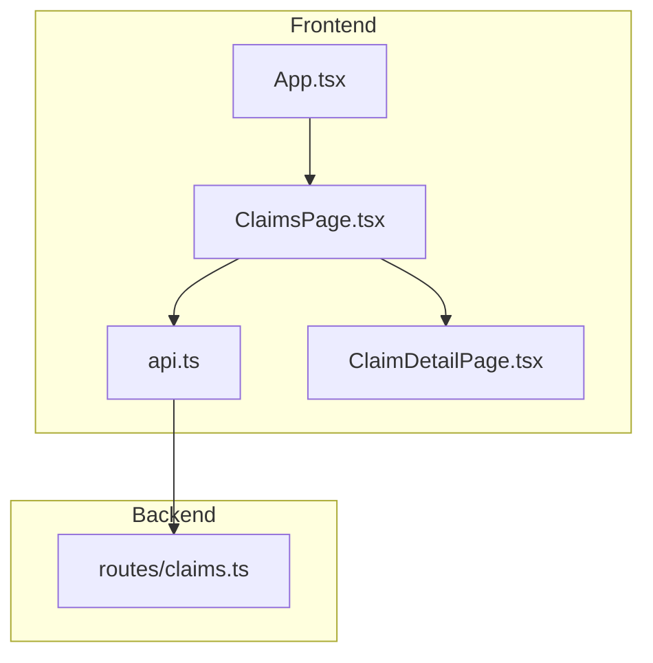
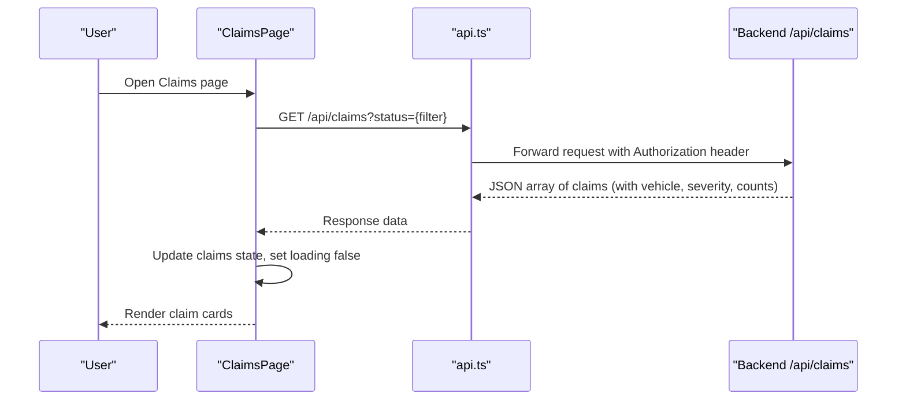
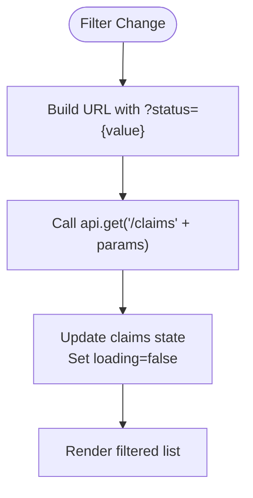
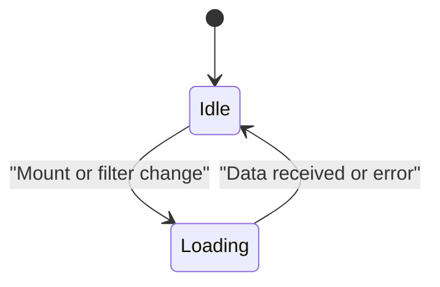
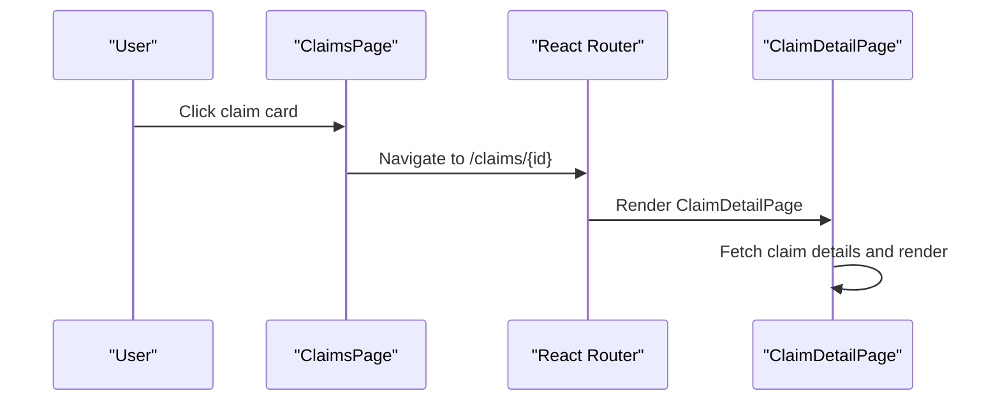
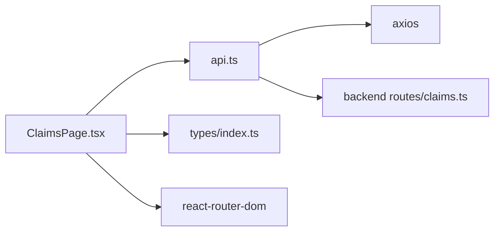

# Claims Listing Page

<cite>
**Referenced Files in This Document**
- [ClaimsPage.tsx](file://frontend/src/pages/ClaimsPage.tsx)
- [api.ts](file://frontend/src/services/api.ts)
- [index.ts (types)](file://frontend/src/types/index.ts)
- [claims.ts (backend routes)](file://backend/src/routes/claims.ts)
- [App.tsx](file://frontend/src/App.tsx)
- [ClaimDetailPage.tsx](file://frontend/src/pages/ClaimDetailPage.tsx)
</cite>

## Table of Contents
1. [Introduction](#introduction)
2. [Project Structure](#project-structure)
3. [Core Components](#core-components)
4. [Architecture Overview](#architecture-overview)
5. [Detailed Component Analysis](#detailed-component-analysis)
6. [Dependency Analysis](#dependency-analysis)
7. [Performance Considerations](#performance-considerations)
8. [Troubleshooting Guide](#troubleshooting-guide)
9. [Conclusion](#conclusion)

## Introduction
This document explains the ClaimsPage component that displays and manages a user’s claim listings. It covers filtering by status, rendering claim cards with vehicle information and damage severity indicators, API integration for fetching claims, state management patterns for loading and filters, responsive design considerations, empty state handling, and navigation to individual claim details.

## Project Structure
The ClaimsPage is part of a React frontend application using React Router for navigation and an Axios-based API client for backend communication. The backend exposes REST endpoints under /api/claims, protected by authentication middleware.

**Diagram sources**
- [App.tsx:10-31](file://frontend/src/App.tsx#L10-L31)
- [ClaimsPage.tsx:1-30](file://frontend/src/pages/ClaimsPage.tsx#L1-L30)
- [api.ts:1-33](file://frontend/src/services/api.ts#L1-L33)
- [claims.ts:59-83](file://backend/src/routes/claims.ts#L59-L83)
- [ClaimDetailPage.tsx:1-25](file://frontend/src/pages/ClaimDetailPage.tsx#L1-L25)

**Section sources**
- [App.tsx:10-31](file://frontend/src/App.tsx#L10-L31)
- [ClaimsPage.tsx:1-30](file://frontend/src/pages/ClaimsPage.tsx#L1-L30)
- [api.ts:1-33](file://frontend/src/services/api.ts#L1-L33)
- [claims.ts:59-83](file://backend/src/routes/claims.ts#L59-L83)

## Core Components
- ClaimsPage: Renders the list of claims, supports status filtering, shows empty state, and navigates to claim details.
- API client: Centralized Axios instance with base URL and auth token injection; handles 401 redirects.
- Types: Strongly typed Claim, Vehicle, DamageAssessment, and related structures used across components.
- Backend claims route: GET /api/claims supports optional status filter and returns enriched claim data including vehicle info, damage assessment severity, and image/document counts.

Key responsibilities:
- Fetch claims on mount and when filter changes.
- Manage local state for claims, loading, and selected filter.
- Render claim cards with vehicle identity and severity badges.
- Provide responsive layout and accessible interactions.

**Section sources**
- [ClaimsPage.tsx:22-98](file://frontend/src/pages/ClaimsPage.tsx#L22-L98)
- [api.ts:1-33](file://frontend/src/services/api.ts#L1-L33)
- [index.ts (types):121-143](file://frontend/src/types/index.ts#L121-L143)
- [claims.ts:59-83](file://backend/src/routes/claims.ts#L59-L83)

## Architecture Overview
The ClaimsPage uses a simple unidirectional data flow:
- On mount or filter change, it calls api.get('/claims?status=...').
- The backend applies the status filter and returns claims with included vehicle and damage assessment severity.
- The component updates its local state and renders the list.

**Diagram sources**
- [ClaimsPage.tsx:27-30](file://frontend/src/pages/ClaimsPage.tsx#L27-L30)
- [api.ts:10-17](file://frontend/src/services/api.ts#L10-L17)
- [claims.ts:59-83](file://backend/src/routes/claims.ts#L59-L83)

## Detailed Component Analysis

### Filtering by Status
- Filter UI: A select element provides options for All Statuses and each claim status.
- Behavior: Changing the filter triggers a re-fetch of claims with the selected status query parameter.
- Backend support: The GET /api/claims endpoint accepts a status query parameter and filters results accordingly.

**Diagram sources**
- [ClaimsPage.tsx:27-30](file://frontend/src/pages/ClaimsPage.tsx#L27-L30)
- [claims.ts:59-83](file://backend/src/routes/claims.ts#L59-L83)

**Section sources**
- [ClaimsPage.tsx:39-48](file://frontend/src/pages/ClaimsPage.tsx#L39-L48)
- [claims.ts:59-83](file://backend/src/routes/claims.ts#L59-L83)

### Claim Card Rendering
Each claim card displays:
- Vehicle identity: make, model, year from the included vehicle object.
- Incident summary: location and formatted date.
- Description preview: truncated to one line.
- Severity indicator: overallSeverity badge if available.
- Status badge: color-coded based on status mapping.
- Image count: from _count.images.

Color coding:
- Status colors map to Tailwind classes for visual distinction.
- Severity colors map to text colors for MINOR, MODERATE, SEVERE.

Navigation:
- Clicking a card navigates to /claims/:id via React Router Link.

**Section sources**
- [ClaimsPage.tsx:64-92](file://frontend/src/pages/ClaimsPage.tsx#L64-L92)
- [ClaimsPage.tsx:7-20](file://frontend/src/pages/ClaimsPage.tsx#L7-L20)
- [index.ts (types):121-143](file://frontend/src/types/index.ts#L121-L143)

### API Integration and Data Shape
- Client: Uses axios.create with baseURL '/api' and an interceptor to attach Authorization headers from localStorage.
- Request: GET /api/claims with optional status query parameter.
- Response shape: Array of Claim objects including:
  - vehicle: { make, model, year }
  - damageAssessment: { overallSeverity }
  - _count: { images, documents }
- Error handling: Global 401 interceptor clears session and redirects to login.

**Section sources**
- [api.ts:1-33](file://frontend/src/services/api.ts#L1-L33)
- [claims.ts:59-83](file://backend/src/routes/claims.ts#L59-L83)
- [index.ts (types):121-143](file://frontend/src/types/index.ts#L121-L143)

### State Management Patterns
- Loading state: Boolean flag toggled during fetch; shows spinner while loading.
- Filter selection: Controlled input bound to local state; drives refetch on change.
- Claim data: Local state holds the fetched claims array; updated on successful response.
- Error resilience: If fetch fails, loading is reset to avoid stuck states.

**Diagram sources**
- [ClaimsPage.tsx:23-32](file://frontend/src/pages/ClaimsPage.tsx#L23-L32)

**Section sources**
- [ClaimsPage.tsx:23-32](file://frontend/src/pages/ClaimsPage.tsx#L23-L32)

### Responsive Design and Empty State
- Layout: Uses responsive Tailwind utilities to stack controls vertically on small screens and align horizontally on larger screens.
- Empty state: When no claims match the filter or none exist, a friendly message and call-to-action to create a new claim are shown.
- Accessibility: Semantic headings, descriptive links, and keyboard-friendly inputs.

**Section sources**
- [ClaimsPage.tsx:34-61](file://frontend/src/pages/ClaimsPage.tsx#L34-L61)

### Navigation to Individual Claim Details
- Each claim card is wrapped in a Link to /claims/:id.
- Routes are defined in App.tsx to render ClaimDetailPage for dynamic id.
- ClaimDetailPage fetches full claim data and provides actions like analyze, upload documents, chat, etc.

**Diagram sources**
- [ClaimsPage.tsx:64-92](file://frontend/src/pages/ClaimsPage.tsx#L64-L92)
- [App.tsx:28-31](file://frontend/src/App.tsx#L28-L31)
- [ClaimDetailPage.tsx:17-25](file://frontend/src/pages/ClaimDetailPage.tsx#L17-L25)

## Dependency Analysis
- ClaimsPage depends on:
  - React hooks (useState, useEffect)
  - React Router (Link)
  - API client (api.ts)
  - Types (Claim, Vehicle, DamageAssessment)
- API client depends on:
  - Axios
  - localStorage for token persistence
- Backend claims route depends on:
  - Prisma ORM
  - Authentication middleware
  - Optional AI services invoked elsewhere

**Diagram sources**
- [ClaimsPage.tsx:1-5](file://frontend/src/pages/ClaimsPage.tsx#L1-L5)
- [api.ts:1-8](file://frontend/src/services/api.ts#L1-L8)
- [claims.ts:1-15](file://backend/src/routes/claims.ts#L1-L15)

**Section sources**
- [ClaimsPage.tsx:1-5](file://frontend/src/pages/ClaimsPage.tsx#L1-L5)
- [api.ts:1-33](file://frontend/src/services/api.ts#L1-L33)
- [claims.ts:1-15](file://backend/src/routes/claims.ts#L1-L15)

## Performance Considerations
- Minimal re-renders: Only claims, loading, and filter states drive updates.
- Efficient filtering: Server-side filtering reduces payload size and avoids client-side filtering overhead.
- Selective includes: Backend includes only necessary fields for listing (vehicle summary, severity, counts).
- Network resilience: Global 401 handler prevents repeated failed requests after logout.

[No sources needed since this section provides general guidance]

## Troubleshooting Guide
Common issues and resolutions:
- No claims displayed:
  - Verify filter selection; try “All Statuses”.
  - Check network tab for successful GET /api/claims response.
- Stuck loading state:
  - Ensure catch block resets loading; verify API availability.
- 401 Unauthorized:
  - Confirm token exists in localStorage; API interceptor will redirect to login on 401.
- Incorrect severity/status display:
  - Validate types and mappings in ClaimsPage; ensure backend returns expected fields.

**Section sources**
- [api.ts:19-30](file://frontend/src/services/api.ts#L19-L30)
- [ClaimsPage.tsx:27-32](file://frontend/src/pages/ClaimsPage.tsx#L27-L32)

## Conclusion
The ClaimsPage provides a clean, responsive interface for browsing and filtering user claims. It integrates seamlessly with the backend to retrieve enriched claim data, presents clear status and severity indicators, and offers straightforward navigation to detailed claim views. Its state management is simple and effective, ensuring a smooth user experience even with limited connectivity or empty datasets.

[No sources needed since this section summarizes without analyzing specific files]