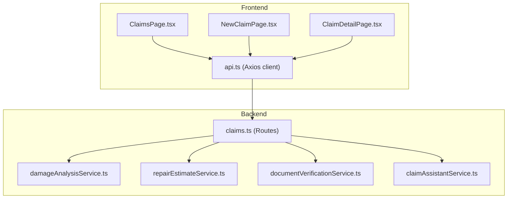
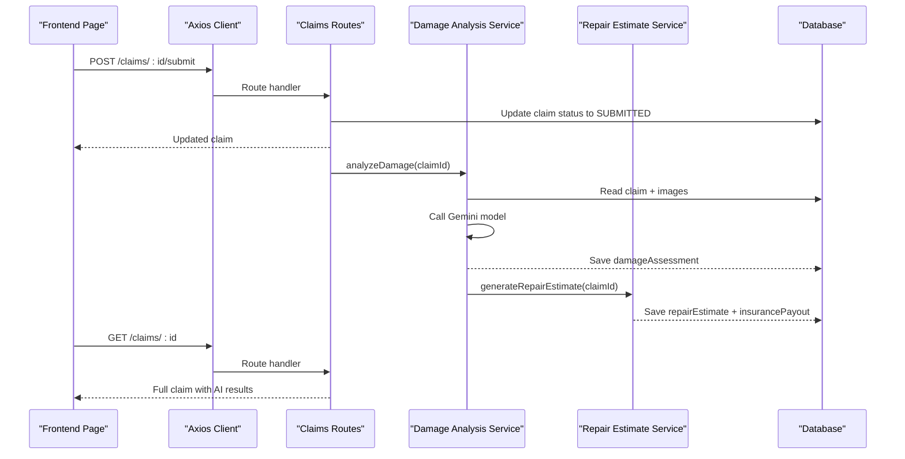
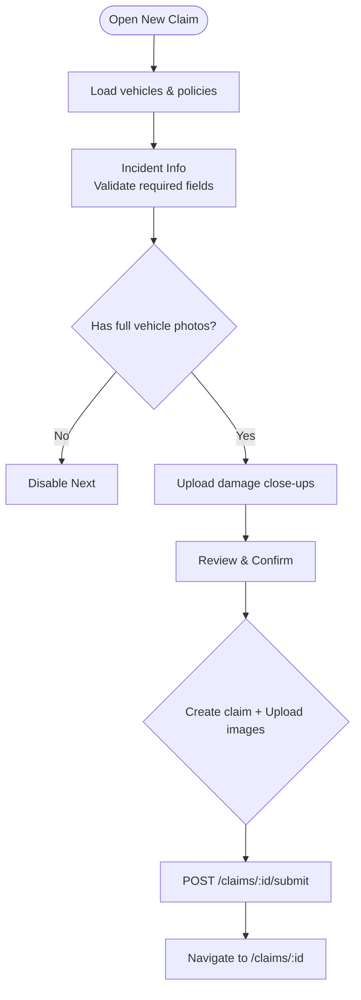
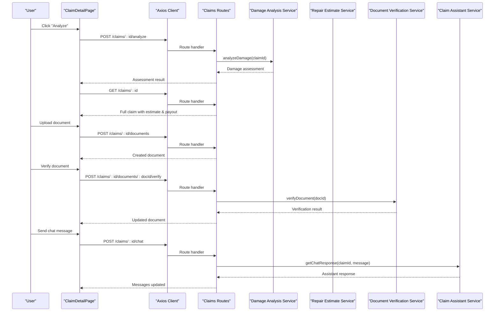
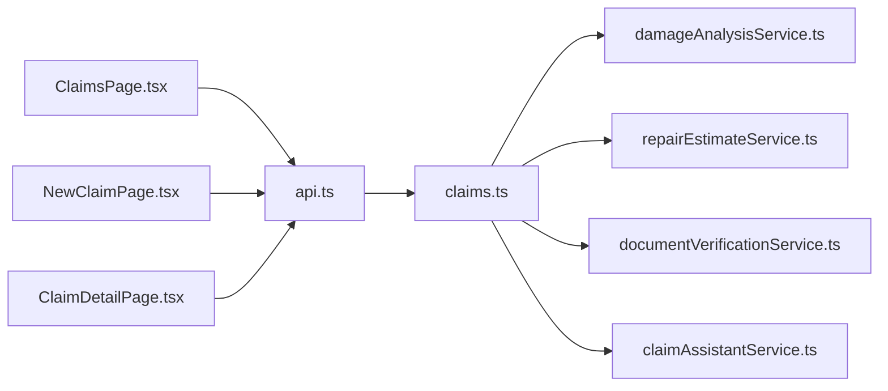

# Claims Management Pages

<cite>
**Referenced Files in This Document**
- [ClaimsPage.tsx](file://frontend/src/pages/ClaimsPage.tsx)
- [NewClaimPage.tsx](file://frontend/src/pages/NewClaimPage.tsx)
- [ClaimDetailPage.tsx](file://frontend/src/pages/ClaimDetailPage.tsx)
- [api.ts](file://frontend/src/services/api.ts)
- [index.ts (types)](file://frontend/src/types/index.ts)
- [claims.ts (routes)](file://backend/src/routes/claims.ts)
- [damageAnalysisService.ts](file://backend/src/services/damageAnalysisService.ts)
- [repairEstimateService.ts](file://backend/src/services/repairEstimateService.ts)
- [documentVerificationService.ts](file://backend/src/services/documentVerificationService.ts)
- [claimAssistantService.ts](file://backend/src/services/claimAssistantService.ts)
</cite>

## Table of Contents
1. [Introduction](#introduction)
2. [Project Structure](#project-structure)
3. [Core Components](#core-components)
4. [Architecture Overview](#architecture-overview)
5. [Detailed Component Analysis](#detailed-component-analysis)
6. [Dependency Analysis](#dependency-analysis)
7. [Performance Considerations](#performance-considerations)
8. [Troubleshooting Guide](#troubleshooting-guide)
9. [Conclusion](#conclusion)

## Introduction
This document explains the claims management pages that implement the complete claim lifecycle: listing and filtering claims, creating new claims with multi-step forms and image uploads, and viewing/managing individual claim details including AI-powered damage assessment, repair estimates, document verification, and a chat assistant. It covers state management patterns, form handling, file upload flows, real-time status updates, and integration points with backend AI services.

## Project Structure
The frontend implements three primary pages for claims:
- ClaimsPage: Lists user’s claims with status filtering and quick navigation to create or view a claim.
- NewClaimPage: Multi-step wizard to collect incident info, upload full vehicle photos, upload damage close-ups, review, and submit.
- ClaimDetailPage: Displays claim details, images, AI damage assessment, repair estimate, insurance payout, documents, and an integrated chat assistant.

**Diagram sources**
- [ClaimsPage.tsx:22-98](file://frontend/src/pages/ClaimsPage.tsx#L22-L98)
- [NewClaimPage.tsx:10-252](file://frontend/src/pages/NewClaimPage.tsx#L10-L252)
- [ClaimDetailPage.tsx:7-290](file://frontend/src/pages/ClaimDetailPage.tsx#L7-L290)
- [api.ts:1-33](file://frontend/src/services/api.ts#L1-L33)
- [claims.ts:20-450](file://backend/src/routes/claims.ts#L20-L450)
- [damageAnalysisService.ts:50-154](file://backend/src/services/damageAnalysisService.ts#L50-L154)
- [repairEstimateService.ts:104-199](file://backend/src/services/repairEstimateService.ts#L104-L199)
- [documentVerificationService.ts:41-107](file://backend/src/services/documentVerificationService.ts#L41-L107)
- [claimAssistantService.ts:19-130](file://backend/src/services/claimAssistantService.ts#L19-L130)

**Section sources**
- [ClaimsPage.tsx:22-98](file://frontend/src/pages/ClaimsPage.tsx#L22-L98)
- [NewClaimPage.tsx:10-252](file://frontend/src/pages/NewClaimPage.tsx#L10-L252)
- [ClaimDetailPage.tsx:7-290](file://frontend/src/pages/ClaimDetailPage.tsx#L7-L290)
- [api.ts:1-33](file://frontend/src/services/api.ts#L1-L33)
- [claims.ts:20-450](file://backend/src/routes/claims.ts#L20-L450)

## Core Components
- ClaimsPage: Fetches claims with optional status filter; renders cards with vehicle info, severity badge, status badge, and image count; navigates to detail or creation.
- NewClaimPage: Manages step-based form state, preloads vehicles/policies, handles drag-and-drop image uploads, validates per step, creates claim, uploads images, submits claim, and redirects to detail.
- ClaimDetailPage: Loads claim data, triggers AI analysis, displays images, damage assessment, repair estimate, insurance payout, documents with verification, and provides a chat assistant interface.

Key state patterns:
- Local component state for UI and temporary data (e.g., step index, uploaded files).
- Side effects via useEffect for data fetching and filters.
- Async handlers with loading/error states for network operations.
- Conditional rendering based on presence of AI results and documents.

**Section sources**
- [ClaimsPage.tsx:22-98](file://frontend/src/pages/ClaimsPage.tsx#L22-L98)
- [NewClaimPage.tsx:10-252](file://frontend/src/pages/NewClaimPage.tsx#L10-L252)
- [ClaimDetailPage.tsx:7-290](file://frontend/src/pages/ClaimDetailPage.tsx#L7-L290)

## Architecture Overview
The frontend pages call a centralized Axios client that attaches authentication tokens and handles 401 redirects. The backend routes enforce authentication and delegate business logic to specialized services:
- Damage analysis uses Gemini to inspect images and produce structured damage assessments.
- Repair estimates are computed from damage assessments using cost tables and labor rates.
- Document verification inspects uploaded documents for authenticity and completeness.
- Chat assistant composes context from claim data and conversation history to answer policyholder questions.

**Diagram sources**
- [claims.ts:152-193](file://backend/src/routes/claims.ts#L152-L193)
- [damageAnalysisService.ts:50-154](file://backend/src/services/damageAnalysisService.ts#L50-L154)
- [repairEstimateService.ts:104-199](file://backend/src/services/repairEstimateService.ts#L104-L199)

## Detailed Component Analysis

### ClaimsPage
Responsibilities:
- Fetch claims list with optional status filter.
- Render status badges and severity indicators.
- Provide navigation to create a new claim or open a specific claim.

State and flow:
- Uses local state for claims array, loading flag, and filter value.
- On mount or filter change, calls GET /claims with query param for status.
- Renders empty state or list of claim cards linking to detail page.

Integration:
- Calls api.get('/claims?status=...') which is handled by backend route returning filtered claims with counts and related vehicle info.

**Section sources**
- [ClaimsPage.tsx:22-98](file://frontend/src/pages/ClaimsPage.tsx#L22-L98)
- [claims.ts:59-83](file://backend/src/routes/claims.ts#L59-L83)

### NewClaimPage
Responsibilities:
- Multi-step wizard: Incident Info, Vehicle Photos, Damage Photos, Review & Submit.
- Preload vehicles and policies.
- Handle drag-and-drop image uploads for two categories: full vehicle and damage close-up.
- Create claim, upload images, submit claim, and navigate to detail.

Form handling and validation:
- Controlled inputs update a single form object.
- Step gating enforces required fields and at least one full vehicle photo before proceeding.
- Error state displayed inline.

Image upload flow:
- Uses dropzone hooks to accept multiple images.
- Builds FormData per category and posts to /claims/:id/images with imageType.
- Removes selected images before submission if needed.

Submission flow:
- Creates claim if not already created, then uploads both image sets, then submits claim to transition status to SUBMITTED.
- Redirects to claim detail after successful submission.

**Diagram sources**
- [NewClaimPage.tsx:10-252](file://frontend/src/pages/NewClaimPage.tsx#L10-L252)
- [claims.ts:20-57](file://backend/src/routes/claims.ts#L20-L57)
- [claims.ts:195-233](file://backend/src/routes/claims.ts#L195-L233)
- [claims.ts:152-193](file://backend/src/routes/claims.ts#L152-L193)

**Section sources**
- [NewClaimPage.tsx:10-252](file://frontend/src/pages/NewClaimPage.tsx#L10-L252)
- [claims.ts:20-57](file://backend/src/routes/claims.ts#L20-L57)
- [claims.ts:195-233](file://backend/src/routes/claims.ts#L195-L233)
- [claims.ts:152-193](file://backend/src/routes/claims.ts#L152-L193)

### ClaimDetailPage
Responsibilities:
- Display claim header, status, description, and safety warnings for severe damage.
- Show images with type labels.
- Trigger AI damage analysis and display results including severity and drivability assessment.
- Present repair estimate breakdown and total costs.
- Show insurance payout estimate when available.
- Manage document uploads and verification.
- Provide AI chat assistant with quick prompts and message history.

Real-time updates:
- After actions like analyze, document verify, or chat, the page refetches claim data to reflect latest state.

AI integration:
- Analyze button calls POST /claims/:id/analyze which runs damage analysis and auto-generates repair estimate and insurance payout.
- Documents can be verified via POST /claims/:id/documents/:docId/verify.
- Chat sends messages to POST /claims/:id/chat and displays responses.

**Diagram sources**
- [ClaimDetailPage.tsx:27-67](file://frontend/src/pages/ClaimDetailPage.tsx#L27-L67)
- [claims.ts:270-288](file://backend/src/routes/claims.ts#L270-L288)
- [claims.ts:316-353](file://backend/src/routes/claims.ts#L316-L353)
- [claims.ts:379-397](file://backend/src/routes/claims.ts#L379-L397)
- [claims.ts:423-447](file://backend/src/routes/claims.ts#L423-L447)
- [damageAnalysisService.ts:50-154](file://backend/src/services/damageAnalysisService.ts#L50-L154)
- [repairEstimateService.ts:104-199](file://backend/src/services/repairEstimateService.ts#L104-L199)
- [documentVerificationService.ts:41-107](file://backend/src/services/documentVerificationService.ts#L41-L107)
- [claimAssistantService.ts:19-130](file://backend/src/services/claimAssistantService.ts#L19-L130)

**Section sources**
- [ClaimDetailPage.tsx:7-290](file://frontend/src/pages/ClaimDetailPage.tsx#L7-L290)
- [claims.ts:270-288](file://backend/src/routes/claims.ts#L270-L288)
- [claims.ts:316-353](file://backend/src/routes/claims.ts#L316-L353)
- [claims.ts:379-397](file://backend/src/routes/claims.ts#L379-L397)
- [claims.ts:423-447](file://backend/src/routes/claims.ts#L423-L447)

## Dependency Analysis
- Frontend dependencies:
  - All pages depend on the shared Axios client for authenticated requests and error handling.
  - Types define the shape of Claim, Vehicle, InsurancePolicy, DamageAssessment, RepairEstimate, Document, ChatMessage, etc.
- Backend dependencies:
  - Routes depend on Prisma for data access and middleware for auth and uploads.
  - Services encapsulate AI integrations and business logic, reducing coupling between routes and external models.

**Diagram sources**
- [ClaimsPage.tsx:22-98](file://frontend/src/pages/ClaimsPage.tsx#L22-L98)
- [NewClaimPage.tsx:10-252](file://frontend/src/pages/NewClaimPage.tsx#L10-L252)
- [ClaimDetailPage.tsx:7-290](file://frontend/src/pages/ClaimDetailPage.tsx#L7-L290)
- [api.ts:1-33](file://frontend/src/services/api.ts#L1-L33)
- [claims.ts:20-450](file://backend/src/routes/claims.ts#L20-L450)

**Section sources**
- [index.ts (types):1-149](file://frontend/src/types/index.ts#L1-L149)
- [claims.ts:20-450](file://backend/src/routes/claims.ts#L20-L450)

## Performance Considerations
- Minimize re-renders by keeping filter state local and only updating when necessary.
- Use conditional checks to avoid unnecessary API calls (e.g., skip analyze if no images present).
- Batch operations where possible; the current design performs sequential uploads per category but could be optimized with parallel uploads if needed.
- Avoid heavy computations in render paths; rely on backend services for AI processing.
- Debounce or throttle repeated actions like chat submissions if users send rapid messages.

[No sources needed since this section provides general guidance]

## Troubleshooting Guide
Common issues and resolutions:
- Authentication failures:
  - If receiving 401, the Axios interceptor clears token and redirects to login. Ensure token exists in localStorage and is valid.
- Image upload errors:
  - Ensure images are within accepted formats and size limits. Check server-side upload configuration and disk space.
- Damage analysis failures:
  - If no images exist or AI parsing fails, the service returns a fallback assessment. Retry after uploading valid images.
- Document verification failures:
  - If document is unreadable or parsing fails, the service marks it UNREADABLE with recommendations. Re-upload a clearer image.
- Chat errors:
  - If message sending fails, check network connectivity and ensure the claim exists. Errors are surfaced with alerts in the UI.

**Section sources**
- [api.ts:10-30](file://frontend/src/services/api.ts#L10-L30)
- [damageAnalysisService.ts:85-103](file://backend/src/services/damageAnalysisService.ts#L85-L103)
- [documentVerificationService.ts:78-94](file://backend/src/services/documentVerificationService.ts#L78-L94)
- [ClaimDetailPage.tsx:27-67](file://frontend/src/pages/ClaimDetailPage.tsx#L27-L67)

## Conclusion
The claims management pages provide a cohesive workflow from listing and filtering claims to creating new claims with rich media and submitting them for AI-driven assessment. The detail page consolidates all claim artifacts—images, assessments, estimates, payouts, documents, and chat—into a single interface. State management is straightforward and localized, while backend services encapsulate complex AI workflows. This architecture supports scalability and maintainability, enabling future enhancements such as real-time notifications, advanced analytics, and expanded AI capabilities.

[No sources needed since this section summarizes without analyzing specific files]