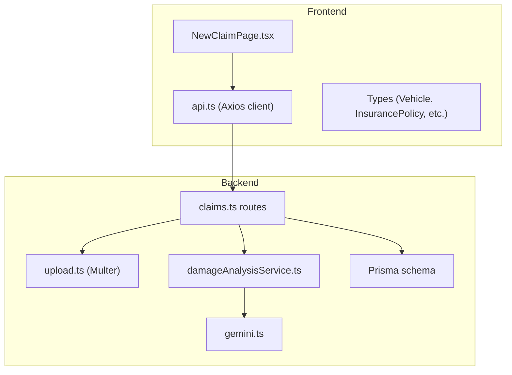
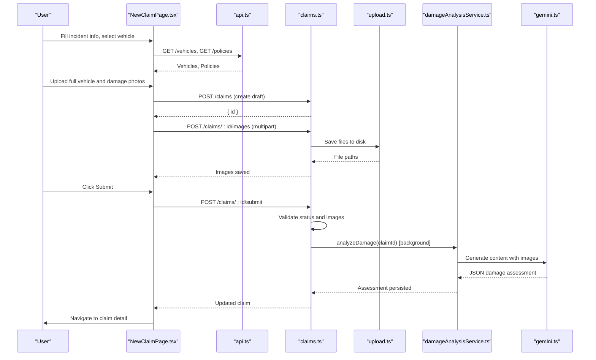
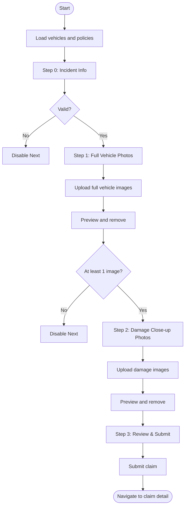
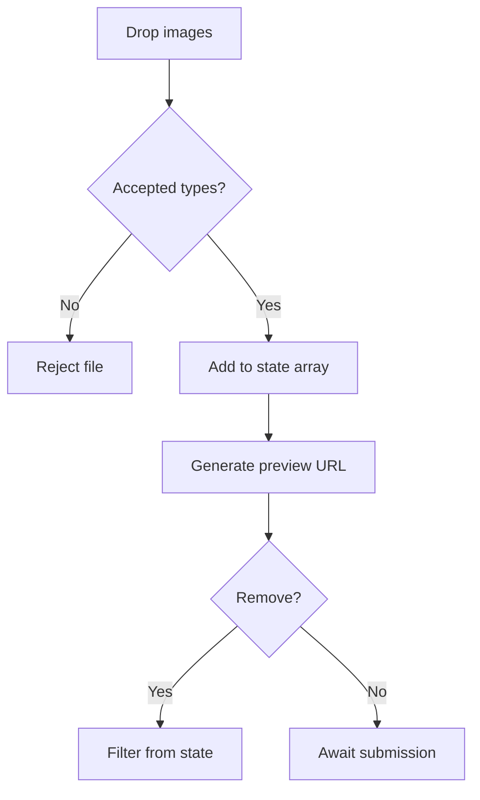
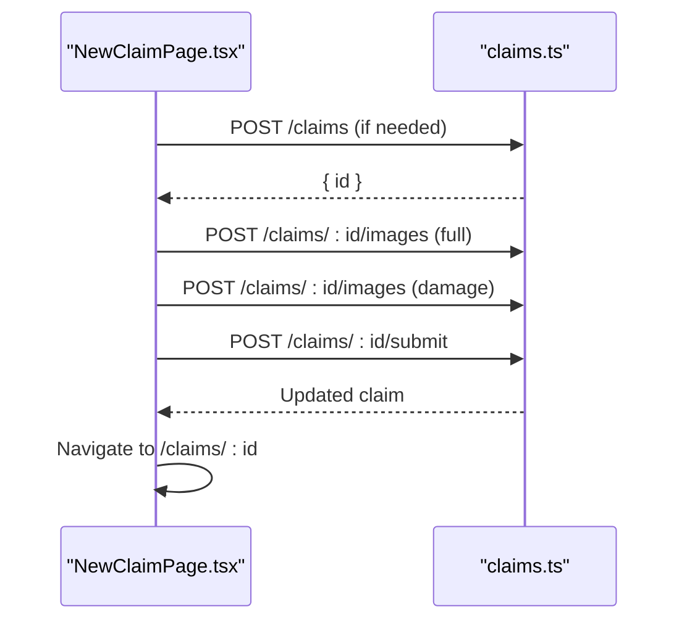
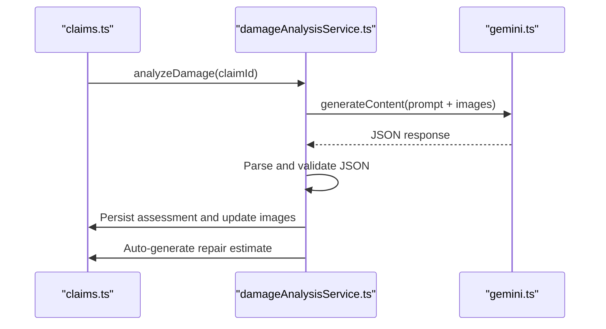
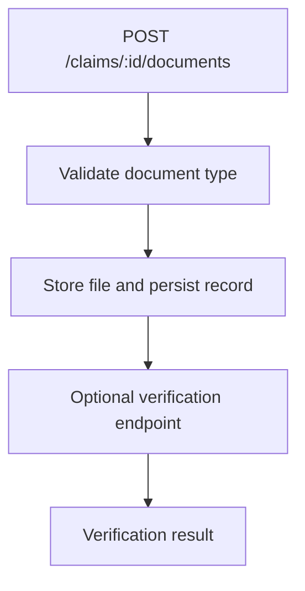
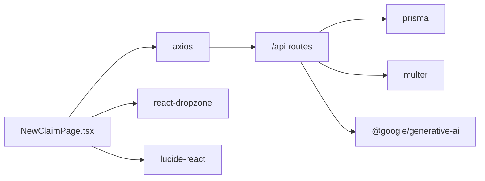

# New Claim Creation Page

<cite>
**Referenced Files in This Document**
- [NewClaimPage.tsx](file://frontend/src/pages/NewClaimPage.tsx)
- [api.ts](file://frontend/src/services/api.ts)
- [index.ts (types)](file://frontend/src/types/index.ts)
- [claims.ts](file://backend/src/routes/claims.ts)
- [upload.ts](file://backend/src/middleware/upload.ts)
- [damageAnalysisService.ts](file://backend/src/services/damageAnalysisService.ts)
- [gemini.ts](file://backend/src/utils/gemini.ts)
- [schema.prisma](file://backend/prisma/schema.prisma)
</cite>

## Update Summary
**Changes Made**
- Updated image upload section to reflect expanded format support including .jpg files
- Enhanced compatibility information for digital cameras and smartphones
- Updated validation patterns to include new supported file types
- Revised troubleshooting guide with updated file type requirements

## Table of Contents
1. [Introduction](#introduction)
2. [Project Structure](#project-structure)
3. [Core Components](#core-components)
4. [Architecture Overview](#architecture-overview)
5. [Detailed Component Analysis](#detailed-component-analysis)
6. [Dependency Analysis](#dependency-analysis)
7. [Performance Considerations](#performance-considerations)
8. [Troubleshooting Guide](#troubleshooting-guide)
9. [Conclusion](#conclusion)

## Introduction
This document provides comprehensive documentation for the NewClaimPage component that implements a multi-step claim creation workflow. It covers incident details, vehicle selection, image uploads with previews, form validation, submission flow, and integration with backend AI services for damage assessment and repair estimates. It also explains state management patterns, error handling strategies, and real-time validation feedback to guide users through the process.

**Updated** Enhanced image upload capabilities now support .jpg files alongside .jpeg, .png, and .webp formats for improved compatibility with digital cameras and smartphones.

## Project Structure
The NewClaimPage is a React component that orchestrates a four-step wizard:
- Step 0: Incident Information
- Step 1: Full Vehicle Photos
- Step 2: Damage Close-up Photos
- Step 3: Review & Submit

It uses local state for form data and uploaded images, fetches vehicles and policies on mount, and communicates with the backend via an Axios client configured with authentication interceptors. The backend exposes endpoints to create claims, upload images, submit claims, and trigger AI analysis.

**Diagram sources**
- [NewClaimPage.tsx:1-252](file://frontend/src/pages/NewClaimPage.tsx#L1-L252)
- [api.ts:1-33](file://frontend/src/services/api.ts#L1-L33)
- [claims.ts:20-450](file://backend/src/routes/claims.ts#L20-L450)
- [upload.ts:1-54](file://backend/src/middleware/upload.ts#L1-L54)
- [damageAnalysisService.ts:1-154](file://backend/src/services/damageAnalysisService.ts#L1-L154)
- [gemini.ts:1-13](file://backend/src/utils/gemini.ts#L1-L13)
- [schema.prisma:70-201](file://backend/prisma/schema.prisma#L70-L201)

**Section sources**
- [NewClaimPage.tsx:1-252](file://frontend/src/pages/NewClaimPage.tsx#L1-L252)
- [api.ts:1-33](file://frontend/src/services/api.ts#L1-L33)
- [claims.ts:20-450](file://backend/src/routes/claims.ts#L20-L450)

## Core Components
- Multi-step form state: step index, form fields, uploaded images, loading/error states.
- Data fetching: loads vehicles and policies on mount.
- File handling: drag-and-drop zones for full vehicle and damage close-up images with preview and removal.
- Validation: step-based gating to proceed only when required fields are present or images are uploaded.
- Submission: creates claim if needed, uploads images, submits claim, navigates to detail page.

Key responsibilities by file:
- NewClaimPage.tsx: UI, state, validation, file handling, submission orchestration.
- api.ts: HTTP client with auth token injection and 401 handling.
- types/index.ts: Shared TypeScript interfaces for frontend models.
- claims.ts: Backend endpoints for claim lifecycle, image/document uploads, submission, and AI triggers.
- upload.ts: Multer configuration for file storage and validation.
- damageAnalysisService.ts: AI-driven damage analysis using Gemini and persistence.
- gemini.ts: Google Generative AI model initialization.
- schema.prisma: Database models and relationships.

**Section sources**
- [NewClaimPage.tsx:10-94](file://frontend/src/pages/NewClaimPage.tsx#L10-L94)
- [api.ts:10-30](file://frontend/src/services/api.ts#L10-L30)
- [index.ts:11-43](file://frontend/src/types/index.ts#L11-L43)
- [claims.ts:20-193](file://backend/src/routes/claims.ts#L20-L193)
- [upload.ts:17-53](file://backend/src/middleware/upload.ts#L17-L53)
- [damageAnalysisService.ts:50-153](file://backend/src/services/damageAnalysisService.ts#L50-L153)
- [gemini.ts:6-10](file://backend/src/utils/gemini.ts#L6-L10)
- [schema.prisma:70-145](file://backend/prisma/schema.prisma#L70-L145)

## Architecture Overview
The claim creation flow involves coordinated steps between frontend and backend:

**Diagram sources**
- [NewClaimPage.tsx:31-94](file://frontend/src/pages/NewClaimPage.tsx#L31-L94)
- [claims.ts:20-193](file://backend/src/routes/claims.ts#L20-L193)
- [upload.ts:17-53](file://backend/src/middleware/upload.ts#L17-L53)
- [damageAnalysisService.ts:50-153](file://backend/src/services/damageAnalysisService.ts#L50-L153)
- [gemini.ts:6-10](file://backend/src/utils/gemini.ts#L6-L10)

## Detailed Component Analysis

### NewClaimPage Component
- State management:
  - Step navigation with step index.
  - Form object for incident details including vehicleId, policyId, incidentDate, location, description, weather, police report flag.
  - Uploaded images arrays for full vehicle and damage close-ups.
  - Loading and error flags for submission UX.
- Data loading:
  - Fetches vehicles and policies on mount to populate dropdowns.
- File handling:
  - Uses dropzone hooks for drag-and-drop with multiple image acceptance.
  - Provides image previews via URL.createObjectURL and remove buttons.
- Validation:
  - Step 0 requires vehicle, date, location, and description.
  - Step 1 requires at least one full vehicle photo.
  - Step 2 allows proceeding without damage photos (optional).
  - Step 3 shows review summary.
- Submission workflow:
  - Creates claim if not already created, then uploads both image sets, then submits claim.
  - On success, navigates to claim detail; on error, displays error message.

**Diagram sources**
- [NewClaimPage.tsx:31-94](file://frontend/src/pages/NewClaimPage.tsx#L31-L94)
- [NewClaimPage.tsx:96-100](file://frontend/src/pages/NewClaimPage.tsx#L96-L100)
- [NewClaimPage.tsx:126-247](file://frontend/src/pages/NewClaimPage.tsx#L126-L247)

**Section sources**
- [NewClaimPage.tsx:10-94](file://frontend/src/pages/NewClaimPage.tsx#L10-L94)
- [NewClaimPage.tsx:96-100](file://frontend/src/pages/NewClaimPage.tsx#L96-L100)
- [NewClaimPage.tsx:126-247](file://frontend/src/pages/NewClaimPage.tsx#L126-L247)

### Form Validation Patterns
- Required fields enforced per step:
  - Incident Info: vehicleId, incidentDate, incidentLocation, incidentDescription.
  - Full Vehicle Photos: at least one image.
  - Damage Close-up Photos: optional but recommended.
- Real-time feedback:
  - Navigation button disabled until conditions met.
  - Error banner displayed on submission failure.

**Section sources**
- [NewClaimPage.tsx:96-100](file://frontend/src/pages/NewClaimPage.tsx#L96-L100)
- [NewClaimPage.tsx:126-158](file://frontend/src/pages/NewClaimPage.tsx#L126-L158)
- [NewClaimPage.tsx:160-205](file://frontend/src/pages/NewClaimPage.tsx#L160-L205)
- [NewClaimPage.tsx:207-247](file://frontend/src/pages/NewClaimPage.tsx#L207-L247)

### Image Upload Handling and Previews
- Drag-and-drop zones accept JPEG, JPG, PNG, WebP with multiple selection.
- Local previews generated via URL.createObjectURL for immediate feedback.
- Remove functionality to delete selected images before submission.
- Backend enforces file type and size limits via Multer middleware.

**Updated** Enhanced format support now includes .jpg files alongside .jpeg, .png, and .webp formats for improved compatibility with digital cameras and smartphones.

**Diagram sources**
- [NewClaimPage.tsx:43-60](file://frontend/src/pages/NewClaimPage.tsx#L43-L60)
- [NewClaimPage.tsx:160-205](file://frontend/src/pages/NewClaimPage.tsx#L160-L205)
- [upload.ts:30-47](file://backend/src/middleware/upload.ts#L30-L47)

**Section sources**
- [NewClaimPage.tsx:43-60](file://frontend/src/pages/NewClaimPage.tsx#L43-L60)
- [NewClaimPage.tsx:160-205](file://frontend/src/pages/NewClaimPage.tsx#L160-L205)
- [upload.ts:30-47](file://backend/src/middleware/upload.ts#L30-L47)

### Submission Workflow and Loading States
- If no claim exists, creates a draft claim first.
- Uploads full vehicle images and damage close-up images separately.
- Submits the claim; backend validates presence of images and transitions status to SUBMITTED.
- Shows loading indicator during submission and disables controls to prevent duplicate submissions.
- Navigates to claim detail upon success.

**Diagram sources**
- [NewClaimPage.tsx:72-94](file://frontend/src/pages/NewClaimPage.tsx#L72-L94)
- [claims.ts:20-193](file://backend/src/routes/claims.ts#L20-L193)

**Section sources**
- [NewClaimPage.tsx:72-94](file://frontend/src/pages/NewClaimPage.tsx#L72-L94)
- [claims.ts:20-193](file://backend/src/routes/claims.ts#L20-L193)

### Integration with AI Services for Damage Assessment
- Upon successful submission, the backend triggers background AI damage analysis.
- The service reads stored images, sends them to Gemini with a structured prompt, parses JSON output, persists the assessment, updates image annotations, and auto-generates a repair estimate.

**Diagram sources**
- [claims.ts:152-193](file://backend/src/routes/claims.ts#L152-L193)
- [damageAnalysisService.ts:50-153](file://backend/src/services/damageAnalysisService.ts#L50-L153)
- [gemini.ts:6-10](file://backend/src/utils/gemini.ts#L6-L10)

**Section sources**
- [claims.ts:152-193](file://backend/src/routes/claims.ts#L152-L193)
- [damageAnalysisService.ts:50-153](file://backend/src/services/damageAnalysisService.ts#L50-L153)
- [gemini.ts:6-10](file://backend/src/utils/gemini.ts#L6-L10)

### Document Attachment Handling
- While the NewClaimPage focuses on images, the backend supports document uploads for licenses, registrations, accident reports, and repair estimates.
- Documents are validated, stored, and can be verified asynchronously.

**Diagram sources**
- [claims.ts:316-397](file://backend/src/routes/claims.ts#L316-L397)

**Section sources**
- [claims.ts:316-397](file://backend/src/routes/claims.ts#L316-L397)

### State Management for Complex Form Data
- Centralized form state object updated via a generic setter function.
- Separate state for uploaded images categorized by type.
- Derived values like selected vehicle used to display summaries.
- Loading and error states manage UI feedback and disable interactions during async operations.

**Section sources**
- [NewClaimPage.tsx:10-41](file://frontend/src/pages/NewClaimPage.tsx#L10-L41)
- [NewClaimPage.tsx:102-103](file://frontend/src/pages/NewClaimPage.tsx#L102-L103)
- [NewClaimPage.tsx:72-94](file://frontend/src/pages/NewClaimPage.tsx#L72-L94)

### Error Handling Strategies
- Frontend:
  - Displays error messages from backend responses.
  - Handles 401 by redirecting to login via interceptor.
- Backend:
  - Validates inputs and returns descriptive errors.
  - Ensures claim status and image requirements before submission.
  - Catches and logs errors, returning appropriate status codes.

**Section sources**
- [api.ts:10-30](file://frontend/src/services/api.ts#L10-L30)
- [NewClaimPage.tsx:72-94](file://frontend/src/pages/NewClaimPage.tsx#L72-L94)
- [claims.ts:20-57](file://backend/src/routes/claims.ts#L20-L57)
- [claims.ts:152-193](file://backend/src/routes/claims.ts#L152-L193)

## Dependency Analysis
- Frontend dependencies:
  - React hooks for state and side effects.
  - react-dropzone for file uploads.
  - axios for HTTP requests with auth interceptors.
  - lucide-react icons for UI elements.
- Backend dependencies:
  - Express router for REST endpoints.
  - Prisma for database access and schema enforcement.
  - Multer for file uploads with validation and storage.
  - Google Generative AI for image-based damage analysis.

**Diagram sources**
- [NewClaimPage.tsx:1-6](file://frontend/src/pages/NewClaimPage.tsx#L1-L6)
- [api.ts:1-8](file://frontend/src/services/api.ts#L1-L8)
- [claims.ts:1-11](file://backend/src/routes/claims.ts#L1-L11)
- [upload.ts:1-5](file://backend/src/middleware/upload.ts#L1-L5)
- [gemini.ts:1-2](file://backend/src/utils/gemini.ts#L1-L2)

**Section sources**
- [NewClaimPage.tsx:1-6](file://frontend/src/pages/NewClaimPage.tsx#L1-L6)
- [api.ts:1-8](file://frontend/src/services/api.ts#L1-L8)
- [claims.ts:1-11](file://backend/src/routes/claims.ts#L1-L11)
- [upload.ts:1-5](file://backend/src/middleware/upload.ts#L1-L5)
- [gemini.ts:1-2](file://backend/src/utils/gemini.ts#L1-L2)

## Performance Considerations
- Avoid unnecessary re-renders by memoizing handlers where appropriate.
- Limit concurrent image uploads if needed; current implementation uploads sequentially per type.
- Use lazy loading for large image previews to reduce memory usage.
- Backend file size limits protect server resources; ensure client-side validation aligns with server constraints.
- Background processing for AI analysis prevents blocking the submission response.

[No sources needed since this section provides general guidance]

## Troubleshooting Guide
Common issues and resolutions:
- Authentication failures:
  - Ensure token is present; 401 responses clear tokens and redirect to login.
- Missing required fields:
  - Backend returns 400 with descriptive errors; ensure all required fields are provided.
- Image upload errors:
  - Check file types and sizes; backend enforces allowed MIME types (.jpg, .jpeg, .png, .webp) and 10MB limit.
  - **Updated** Ensure files use supported formats: .jpg, .jpeg, .png, or .webp for optimal compatibility with digital cameras and smartphones.
- Submission blocked:
  - At least one image must be uploaded; backend validates before transitioning status.
- AI analysis failures:
  - Service falls back to minimal assessment; check logs for parsing errors and ensure images exist.

**Section sources**
- [api.ts:10-30](file://frontend/src/services/api.ts#L10-L30)
- [claims.ts:20-57](file://backend/src/routes/claims.ts#L20-L57)
- [upload.ts:30-47](file://backend/src/middleware/upload.ts#L30-L47)
- [claims.ts:152-193](file://backend/src/routes/claims.ts#L152-L193)
- [damageAnalysisService.ts:85-103](file://backend/src/services/damageAnalysisService.ts#L85-L103)

## Conclusion
The NewClaimPage implements a robust, user-friendly multi-step claim creation workflow with strong validation, intuitive image handling, and seamless integration with backend AI services. It ensures data integrity, provides clear feedback, and leverages background processing to enhance performance. The architecture cleanly separates concerns across frontend components, HTTP client configuration, backend routes, file handling, and AI analysis services, making it maintainable and extensible.

**Updated** Enhanced image upload capabilities now support .jpg files alongside existing formats, improving compatibility with digital cameras and smartphones while maintaining the same robust validation and processing pipeline.

[No sources needed since this section summarizes without analyzing specific files]