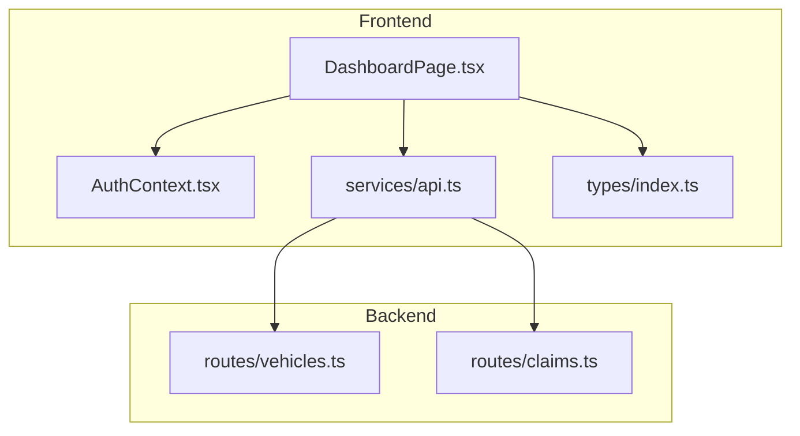
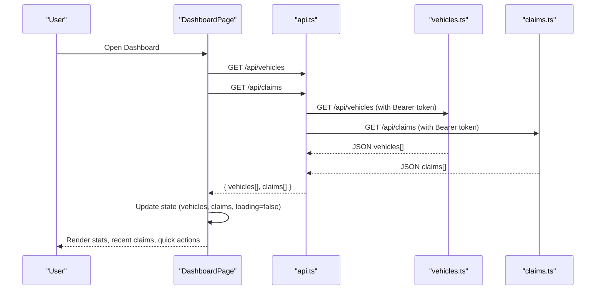
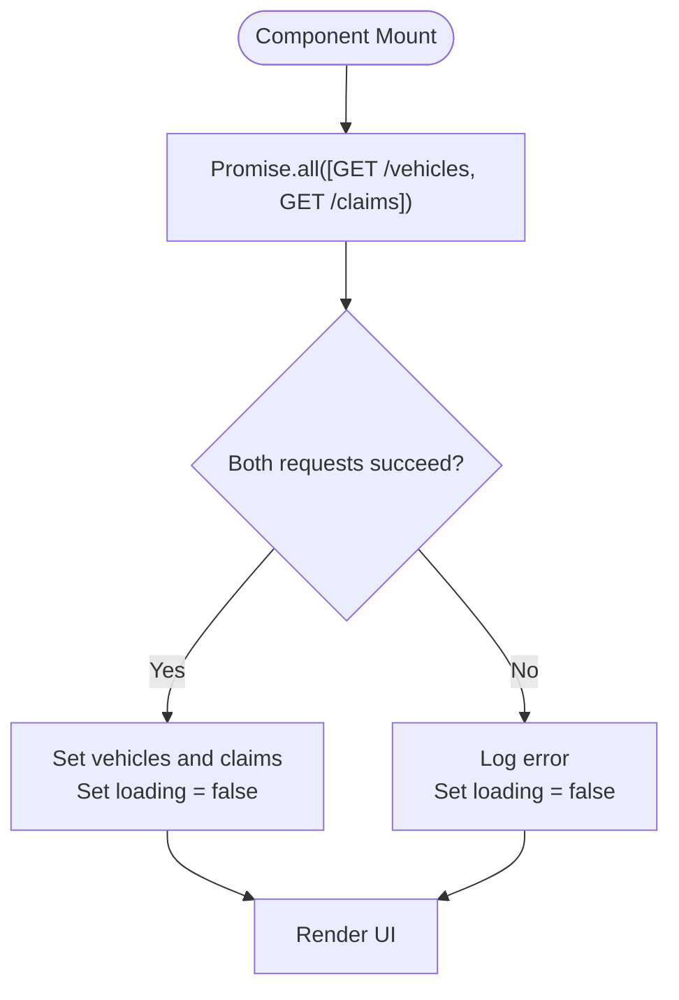
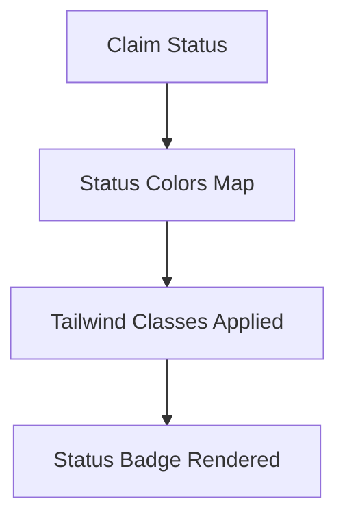
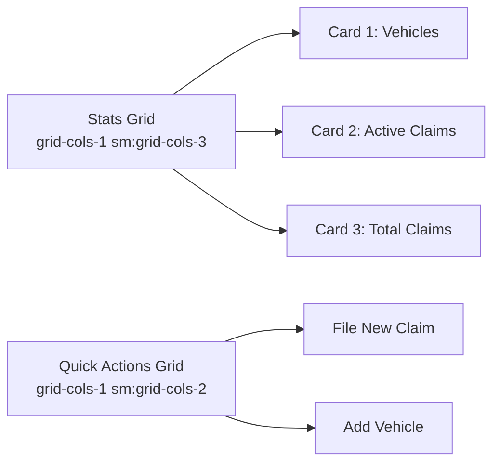
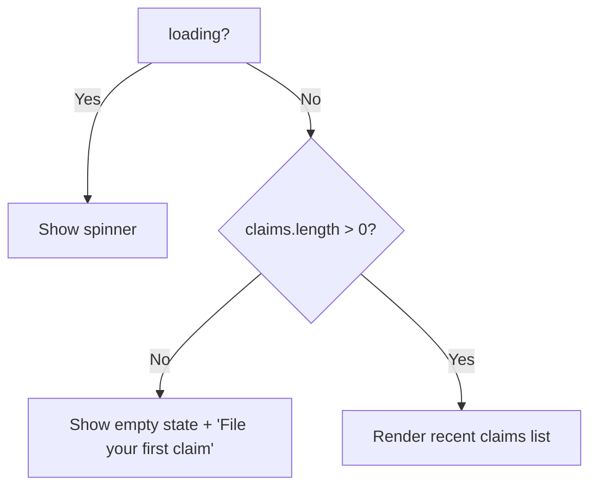
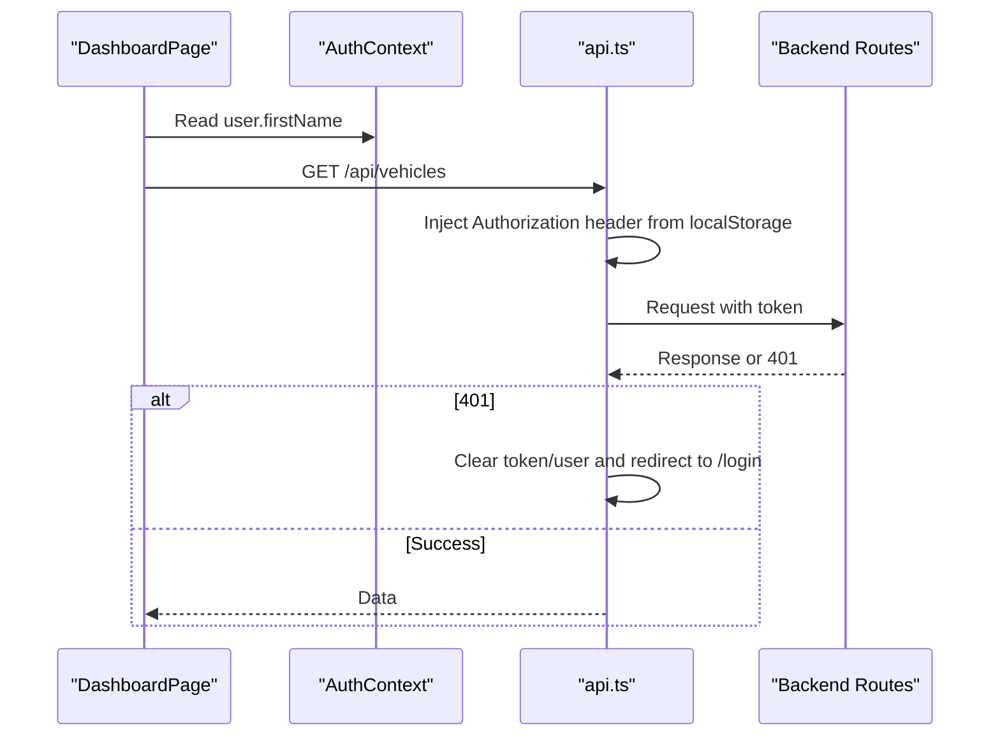
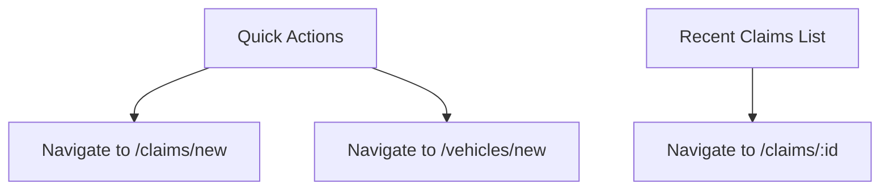
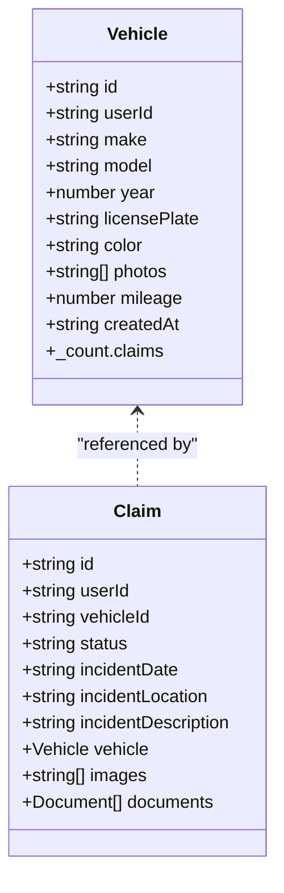
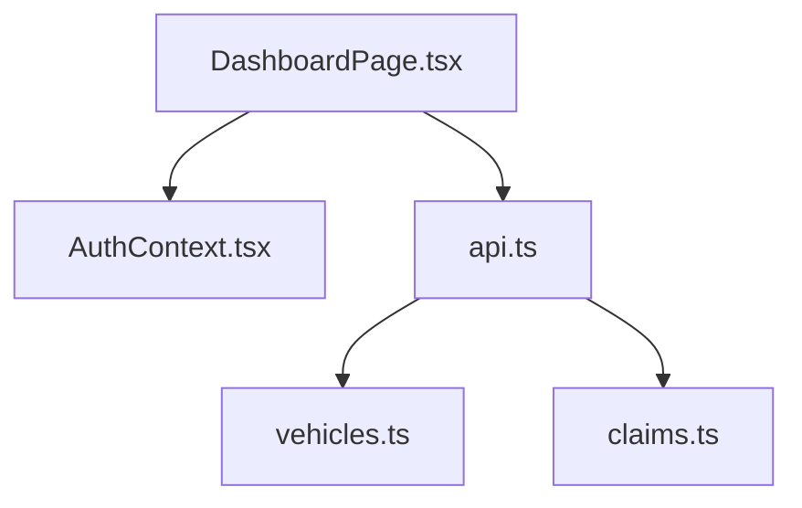

# Dashboard Page

<cite>
**Referenced Files in This Document**
- [DashboardPage.tsx](file://frontend/src/pages/DashboardPage.tsx)
- [AuthContext.tsx](file://frontend/src/context/AuthContext.tsx)
- [api.ts](file://frontend/src/services/api.ts)
- [index.ts (types)](file://frontend/src/types/index.ts)
- [vehicles.ts (backend routes)](file://backend/src/routes/vehicles.ts)
- [claims.ts (backend routes)](file://backend/src/routes/claims.ts)
</cite>

## Table of Contents
1. [Introduction](#introduction)
2. [Project Structure](#project-structure)
3. [Core Components](#core-components)
4. [Architecture Overview](#architecture-overview)
5. [Detailed Component Analysis](#detailed-component-analysis)
6. [Dependency Analysis](#dependency-analysis)
7. [Performance Considerations](#performance-considerations)
8. [Troubleshooting Guide](#troubleshooting-guide)
9. [Conclusion](#conclusion)

## Introduction
The DashboardPage component is the main landing page for authenticated users. It provides a quick overview of their insurance activity by displaying key statistics such as vehicles count, active claims, and total claims. It also shows a recent claims list and offers quick actions to file a new claim or add a vehicle. The component fetches data concurrently from the backend using Promise.all and manages local state with React hooks for loading and data arrays. It integrates with the authentication context to greet the user and relies on routing links to navigate to other features.

## Project Structure
This feature spans both frontend and backend:
- Frontend:
  - DashboardPage component handles UI, data fetching, and navigation.
  - AuthContext provides user information and authentication state.
  - API service configures axios with base URL and interceptors for auth tokens and 401 handling.
  - Types define shared interfaces for User, Vehicle, Claim, etc.
- Backend:
  - Vehicles and Claims routes expose GET endpoints that return data scoped to the authenticated user.

**Diagram sources**
- [DashboardPage.tsx:1-142](file://frontend/src/pages/DashboardPage.tsx#L1-L142)
- [AuthContext.tsx:1-82](file://frontend/src/context/AuthContext.tsx#L1-L82)
- [api.ts:1-33](file://frontend/src/services/api.ts#L1-L33)
- [index.ts (types):1-149](file://frontend/src/types/index.ts#L1-L149)
- [vehicles.ts:44-60](file://backend/src/routes/vehicles.ts#L44-L60)
- [claims.ts:59-83](file://backend/src/routes/claims.ts#L59-L83)

**Section sources**
- [DashboardPage.tsx:1-142](file://frontend/src/pages/DashboardPage.tsx#L1-L142)
- [AuthContext.tsx:1-82](file://frontend/src/context/AuthContext.tsx#L1-L82)
- [api.ts:1-33](file://frontend/src/services/api.ts#L1-L33)
- [index.ts (types):1-149](file://frontend/src/types/index.ts#L1-L149)
- [vehicles.ts:44-60](file://backend/src/routes/vehicles.ts#L44-L60)
- [claims.ts:59-83](file://backend/src/routes/claims.ts#L59-L83)

## Core Components
- DashboardPage:
  - Displays user greeting from AuthContext.
  - Fetches vehicles and claims concurrently via Promise.all.
  - Maintains loading state and data arrays with useState.
  - Renders stats cards, quick action buttons, and recent claims list.
  - Uses a status color mapping for claim statuses.
  - Provides responsive grid layout with Tailwind classes.
  - Navigates to /claims/new and /vehicles/new for common tasks.
- AuthContext:
  - Provides current user and token; initializes session from localStorage.
  - Exposes login, register, logout, and profile update functions.
- API Service:
  - Axios instance with base URL and Authorization header injection.
  - Redirects to login on 401 responses.
- Types:
  - Shared TypeScript interfaces for User, Vehicle, Claim, and related entities.

**Section sources**
- [DashboardPage.tsx:8-142](file://frontend/src/pages/DashboardPage.tsx#L8-L142)
- [AuthContext.tsx:17-82](file://frontend/src/context/AuthContext.tsx#L17-L82)
- [api.ts:3-33](file://frontend/src/services/api.ts#L3-L33)
- [index.ts (types):11-143](file://frontend/src/types/index.ts#L11-L143)

## Architecture Overview
The dashboard loads user-specific data from two backend endpoints concurrently. The API service attaches the bearer token automatically. On successful responses, the component updates local state and renders the UI. If no data exists, it shows an empty state. Quick actions route to dedicated pages for creating claims or adding vehicles.

**Diagram sources**
- [DashboardPage.tsx:14-27](file://frontend/src/pages/DashboardPage.tsx#L14-L27)
- [api.ts:11-17](file://frontend/src/services/api.ts#L11-L17)
- [vehicles.ts:44-60](file://backend/src/routes/vehicles.ts#L44-L60)
- [claims.ts:59-83](file://backend/src/routes/claims.ts#L59-L83)

## Detailed Component Analysis

### Data Fetching Pattern
- Concurrent requests:
  - Uses Promise.all to call GET /api/vehicles and GET /api/claims simultaneously, reducing load time compared to sequential calls.
- Error handling:
  - Catches errors during fetch and logs them; ensures loading state is cleared in finally block.
- State management:
  - useState tracks vehicles array, claims array, and loading boolean.
  - useEffect runs once on mount to fetch data.

**Diagram sources**
- [DashboardPage.tsx:14-27](file://frontend/src/pages/DashboardPage.tsx#L14-L27)

**Section sources**
- [DashboardPage.tsx:14-27](file://frontend/src/pages/DashboardPage.tsx#L14-L27)

### Status Color Mapping System
- A mapping object associates each claim status with a Tailwind class combination for background and text colors.
- Used when rendering the status badge in the recent claims list.
- Supports statuses like DRAFT, SUBMITTED, UNDER_REVIEW, APPROVED, REJECTED, COMPLETED.

**Diagram sources**
- [DashboardPage.tsx:29-36](file://frontend/src/pages/DashboardPage.tsx#L29-L36)
- [DashboardPage.tsx:131-133](file://frontend/src/pages/DashboardPage.tsx#L131-L133)

**Section sources**
- [DashboardPage.tsx:29-36](file://frontend/src/pages/DashboardPage.tsx#L29-L36)
- [DashboardPage.tsx:131-133](file://frontend/src/pages/DashboardPage.tsx#L131-L133)

### Responsive Grid Layout
- Stats cards use a responsive grid that adapts from single column on small screens to three columns on larger screens.
- Recent claims section uses a bordered card with a header and scrollable list.
- Quick actions are laid out in a two-column responsive grid.

**Diagram sources**
- [DashboardPage.tsx:56-80](file://frontend/src/pages/DashboardPage.tsx#L56-L80)
- [DashboardPage.tsx:83-100](file://frontend/src/pages/DashboardPage.tsx#L83-L100)

**Section sources**
- [DashboardPage.tsx:56-80](file://frontend/src/pages/DashboardPage.tsx#L56-L80)
- [DashboardPage.tsx:83-100](file://frontend/src/pages/DashboardPage.tsx#L83-L100)

### Conditional Rendering Logic
- Loading state:
  - While loading, displays a spinner centered on screen.
- Empty state:
  - When there are no claims, shows an empty illustration and a link to file the first claim.
- Populated state:
  - Shows up to five recent claims with vehicle info, incident date/location, and status badge.

**Diagram sources**
- [DashboardPage.tsx:38-44](file://frontend/src/pages/DashboardPage.tsx#L38-L44)
- [DashboardPage.tsx:110-137](file://frontend/src/pages/DashboardPage.tsx#L110-L137)

**Section sources**
- [DashboardPage.tsx:38-44](file://frontend/src/pages/DashboardPage.tsx#L38-L44)
- [DashboardPage.tsx:110-137](file://frontend/src/pages/DashboardPage.tsx#L110-L137)

### Integration with Authentication Context
- Retrieves user details (e.g., firstName) from AuthContext to personalize the greeting.
- Relies on API interceptor to attach the bearer token from localStorage for protected endpoints.
- If a 401 occurs, the API redirects to login, ensuring unauthenticated access is handled centrally.

**Diagram sources**
- [DashboardPage.tsx:9](file://frontend/src/pages/DashboardPage.tsx#L9)
- [api.ts:11-17](file://frontend/src/services/api.ts#L11-L17)
- [api.ts:20-30](file://frontend/src/services/api.ts#L20-L30)
- [AuthContext.tsx:17-36](file://frontend/src/context/AuthContext.tsx#L17-L36)

**Section sources**
- [DashboardPage.tsx:9](file://frontend/src/pages/DashboardPage.tsx#L9)
- [api.ts:11-30](file://frontend/src/services/api.ts#L11-L30)
- [AuthContext.tsx:17-36](file://frontend/src/context/AuthContext.tsx#L17-L36)

### Navigation to Key Features
- Quick actions provide direct navigation:
  - File New Claim: navigates to /claims/new.
  - Add Vehicle: navigates to /vehicles/new.
- Recent claims entries link to individual claim detail pages at /claims/:id.

**Diagram sources**
- [DashboardPage.tsx:84-99](file://frontend/src/pages/DashboardPage.tsx#L84-L99)
- [DashboardPage.tsx:121-122](file://frontend/src/pages/DashboardPage.tsx#L121-L122)

**Section sources**
- [DashboardPage.tsx:84-99](file://frontend/src/pages/DashboardPage.tsx#L84-L99)
- [DashboardPage.tsx:121-122](file://frontend/src/pages/DashboardPage.tsx#L121-L122)

### Backend Endpoints and Data Contracts
- GET /api/vehicles:
  - Returns vehicles owned by the authenticated user, ordered by creation date, including claim counts.
- GET /api/claims:
  - Returns claims owned by the authenticated user, ordered by creation date, including vehicle summary and counts.

**Diagram sources**
- [index.ts (types):11-25](file://frontend/src/types/index.ts#L11-L25)
- [index.ts (types):121-143](file://frontend/src/types/index.ts#L121-L143)
- [vehicles.ts:44-60](file://backend/src/routes/vehicles.ts#L44-L60)
- [claims.ts:59-83](file://backend/src/routes/claims.ts#L59-L83)

**Section sources**
- [vehicles.ts:44-60](file://backend/src/routes/vehicles.ts#L44-L60)
- [claims.ts:59-83](file://backend/src/routes/claims.ts#L59-L83)
- [index.ts (types):11-25](file://frontend/src/types/index.ts#L11-L25)
- [index.ts (types):121-143](file://frontend/src/types/index.ts#L121-L143)

## Dependency Analysis
- DashboardPage depends on:
  - AuthContext for user data.
  - api service for HTTP requests with automatic auth header injection.
  - types for type safety across components.
- API service depends on:
  - localStorage for token persistence.
  - Global redirect behavior on 401.
- Backend routes enforce authentication middleware and scope data to the current user.

**Diagram sources**
- [DashboardPage.tsx:1-5](file://frontend/src/pages/DashboardPage.tsx#L1-L5)
- [api.ts:1-33](file://frontend/src/services/api.ts#L1-L33)
- [vehicles.ts:1-10](file://backend/src/routes/vehicles.ts#L1-L10)
- [claims.ts:1-16](file://backend/src/routes/claims.ts#L1-L16)

**Section sources**
- [DashboardPage.tsx:1-5](file://frontend/src/pages/DashboardPage.tsx#L1-L5)
- [api.ts:1-33](file://frontend/src/services/api.ts#L1-L33)
- [vehicles.ts:1-10](file://backend/src/routes/vehicles.ts#L1-L10)
- [claims.ts:1-16](file://backend/src/routes/claims.ts#L1-L16)

## Performance Considerations
- Concurrent data fetching:
  - Using Promise.all reduces total latency by fetching vehicles and claims in parallel.
- Minimal re-renders:
  - Separate state variables for vehicles and claims allow targeted updates.
- Efficient list rendering:
  - Limiting recent claims to five items reduces DOM size and improves initial render performance.
- Token interception:
  - Centralized auth header injection avoids per-request overhead and reduces risk of missing tokens.

[No sources needed since this section provides general guidance]

## Troubleshooting Guide
- Network or server errors:
  - Errors during fetch are logged; ensure network connectivity and backend availability.
- Authentication issues:
  - If a 401 response occurs, the API clears stored credentials and redirects to login. Verify that the token is present in localStorage after login.
- Empty states:
  - If no claims exist, the dashboard shows an empty state; verify that the user has created claims or check backend filters.

**Section sources**
- [DashboardPage.tsx:20-24](file://frontend/src/pages/DashboardPage.tsx#L20-L24)
- [api.ts:20-30](file://frontend/src/services/api.ts#L20-L30)

## Conclusion
The DashboardPage delivers a concise, user-centric overview of insurance activity by combining concurrent data fetching, clear state management, and intuitive navigation. Its responsive design and conditional rendering ensure a smooth experience whether users have existing data or are just starting. Integration with the authentication context and centralized API handling ensures secure and consistent behavior across the application.