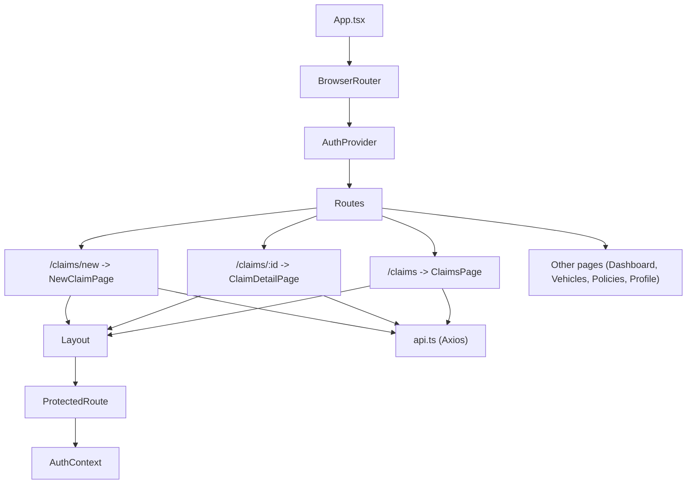
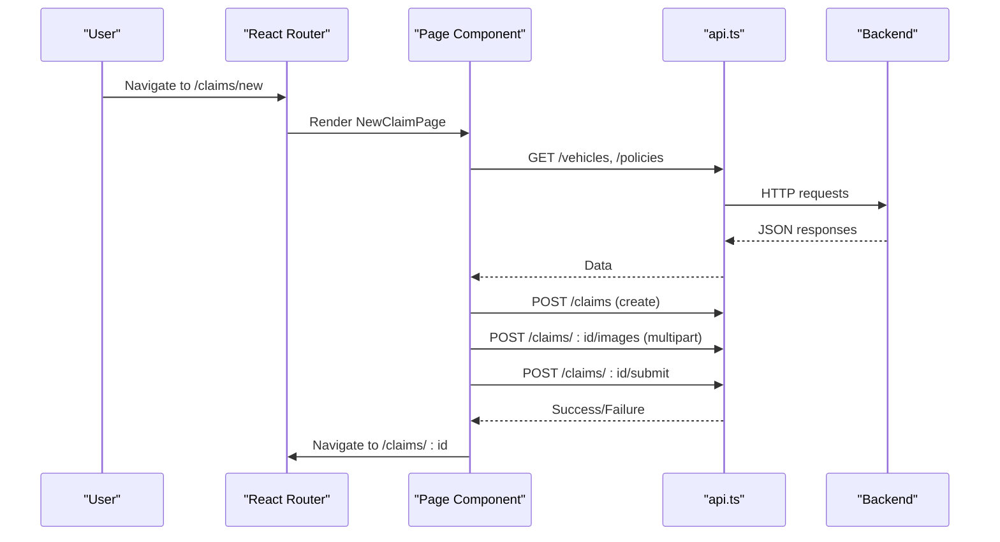
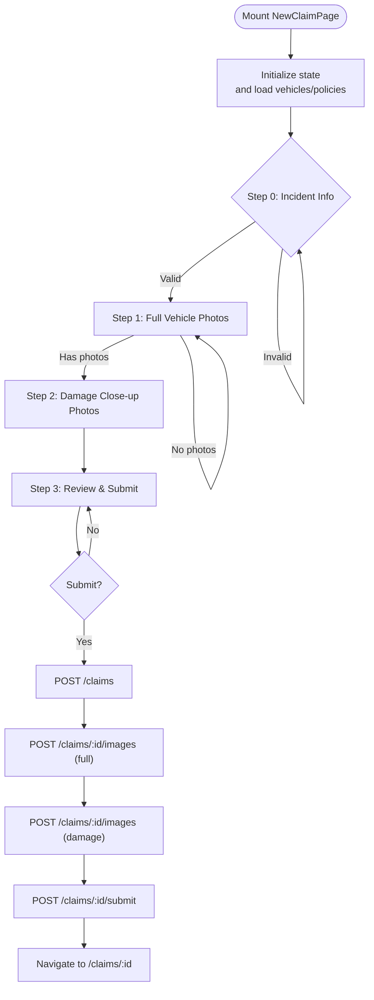
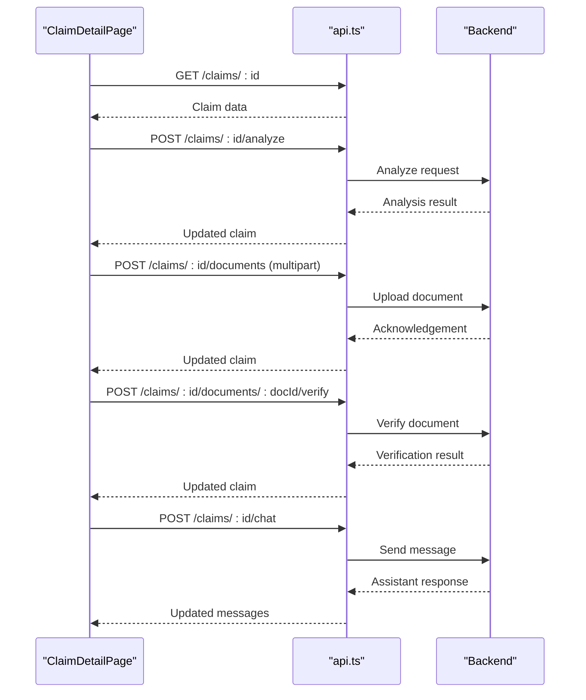
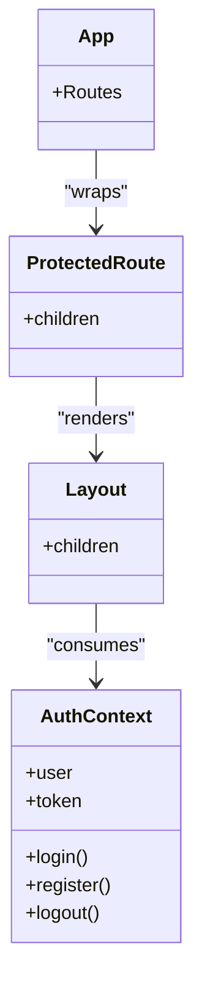
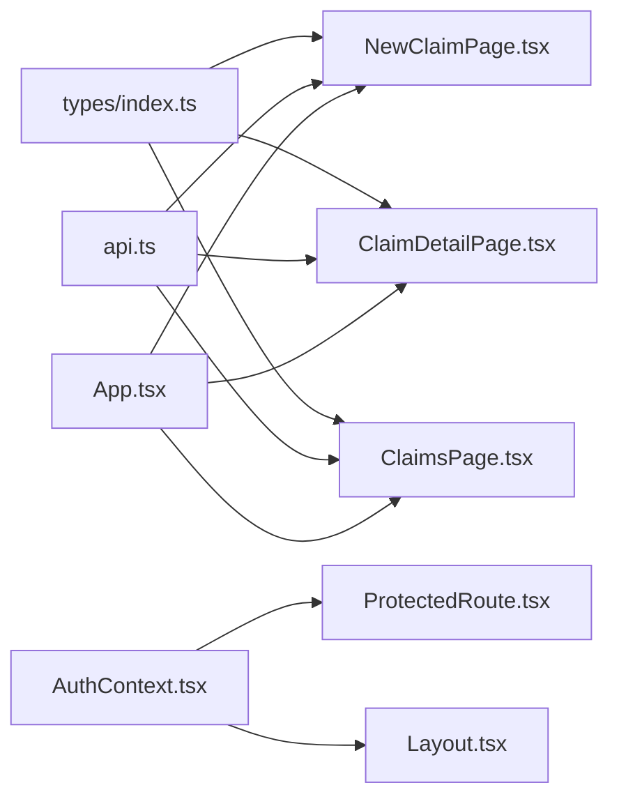

# Page Components

<cite>
**Referenced Files in This Document**
- [App.tsx](file://frontend/src/App.tsx)
- [Layout.tsx](file://frontend/src/components/Layout.tsx)
- [ProtectedRoute.tsx](file://frontend/src/components/ProtectedRoute.tsx)
- [AuthContext.tsx](file://frontend/src/context/AuthContext.tsx)
- [api.ts](file://frontend/src/services/api.ts)
- [index.ts (types)](file://frontend/src/types/index.ts)
- [NewClaimPage.tsx](file://frontend/src/pages/NewClaimPage.tsx)
- [ClaimDetailPage.tsx](file://frontend/src/pages/ClaimDetailPage.tsx)
- [ClaimsPage.tsx](file://frontend/src/pages/ClaimsPage.tsx)
</cite>

## Table of Contents
1. [Introduction](#introduction)
2. [Project Structure](#project-structure)
3. [Core Components](#core-components)
4. [Architecture Overview](#architecture-overview)
5. [Detailed Component Analysis](#detailed-component-analysis)
6. [Dependency Analysis](#dependency-analysis)
7. [Performance Considerations](#performance-considerations)
8. [Troubleshooting Guide](#troubleshooting-guide)
9. [Conclusion](#conclusion)

## Introduction
This document explains the page component architecture of the Smart Vehicle Insurance Claim System frontend. It focuses on how pages are organized using React Router, how presentation and business logic are separated within pages, state management patterns with hooks, API integration strategies, and common patterns for forms, data fetching, error handling, and user feedback. It also covers routing structure, composition of reusable components, and detailed analysis of complex pages such as NewClaimPage and ClaimDetailPage that implement multi-step workflows, file uploads, and real-time updates. Finally, it addresses performance considerations like lazy loading, memoization, and efficient re-renders.

## Project Structure
The frontend follows a feature-based layout under src/pages for major areas (Dashboard, Vehicles, Policies, Claims, Profile), with shared UI and behavior in src/components and src/context. Routing is centralized in App.tsx using React Router v6, and all protected routes wrap their content with Layout to provide consistent navigation and authentication gating via ProtectedRoute.

**Diagram sources**
- [App.tsx:15-35](file://frontend/src/App.tsx#L15-L35)
- [Layout.tsx:14-176](file://frontend/src/components/Layout.tsx#L14-L176)
- [ProtectedRoute.tsx:4-20](file://frontend/src/components/ProtectedRoute.tsx#L4-L20)
- [AuthContext.tsx:17-82](file://frontend/src/context/AuthContext.tsx#L17-L82)
- [api.ts:1-33](file://frontend/src/services/api.ts#L1-L33)

**Section sources**
- [App.tsx:15-35](file://frontend/src/App.tsx#L15-L35)
- [Layout.tsx:14-176](file://frontend/src/components/Layout.tsx#L14-L176)
- [ProtectedRoute.tsx:4-20](file://frontend/src/components/ProtectedRoute.tsx#L4-L20)
- [AuthContext.tsx:17-82](file://frontend/src/context/AuthContext.tsx#L17-L82)
- [api.ts:1-33](file://frontend/src/services/api.ts#L1-L33)

## Core Components
- Routing and protection:
  - Routes are declared in App.tsx; each route wraps its page with ProtectedRoute and Layout to enforce authentication and provide consistent chrome.
- Shared layout:
  - Layout.tsx renders sidebar navigation, mobile header, and main content area. It uses React Router hooks for active states and navigation.
- Authentication context:
  - AuthContext.tsx provides user state, token persistence, login/register/logout actions, and profile updates.
- API client:
  - api.ts configures Axios with a base URL and interceptors to attach Authorization headers and handle 401 redirects.

These components establish a clean separation between routing/protection, presentation shell, global auth state, and HTTP communication.

**Section sources**
- [App.tsx:15-35](file://frontend/src/App.tsx#L15-L35)
- [Layout.tsx:14-176](file://frontend/src/components/Layout.tsx#L14-L176)
- [ProtectedRoute.tsx:4-20](file://frontend/src/components/ProtectedRoute.tsx#L4-L20)
- [AuthContext.tsx:17-82](file://frontend/src/context/AuthContext.tsx#L17-L82)
- [api.ts:1-33](file://frontend/src/services/api.ts#L1-L33)

## Architecture Overview
Pages encapsulate domain-specific features and compose reusable UI elements. Business logic (data fetching, mutations, validation) lives inside page components using React hooks, while presentation is handled by JSX and Tailwind classes. The API layer abstracts network calls and centralizes auth injection and error handling.

**Diagram sources**
- [App.tsx:28-30](file://frontend/src/App.tsx#L28-L30)
- [NewClaimPage.tsx:31-94](file://frontend/src/pages/NewClaimPage.tsx#L31-L94)
- [api.ts:1-33](file://frontend/src/services/api.ts#L1-L33)

## Detailed Component Analysis

### NewClaimPage
Purpose: Multi-step claim creation workflow with incident details, photo uploads, review, and submission.

Key responsibilities:
- Step-driven UI with validation per step
- Fetching vehicles and policies on mount
- Handling drag-and-drop image uploads and preview
- Creating a claim, uploading images, and submitting
- Error handling and user feedback

State and hooks:
- useState for step, form fields, uploaded images, loading, error, and temporary claimId
- useEffect to fetch initial data
- useCallback for stable drop handlers
- React Router hooks for navigation and optional preselected vehicle

API integration:
- GET /vehicles, /policies
- POST /claims to create
- POST /claims/:id/images with multipart/form-data
- POST /claims/:id/submit to finalize

Error handling and UX:
- Loading states during submit
- Inline error banner
- Disabled controls based on validation
- Navigation after success

**Diagram sources**
- [NewClaimPage.tsx:10-94](file://frontend/src/pages/NewClaimPage.tsx#L10-L94)
- [NewClaimPage.tsx:104-247](file://frontend/src/pages/NewClaimPage.tsx#L104-L247)

**Section sources**
- [NewClaimPage.tsx:10-94](file://frontend/src/pages/NewClaimPage.tsx#L10-L94)
- [NewClaimPage.tsx:104-247](file://frontend/src/pages/NewClaimPage.tsx#L104-L247)

### ClaimDetailPage
Purpose: Displays full claim details, supports AI damage analysis, document upload and verification, and an interactive chat assistant.

Key responsibilities:
- Fetching claim data by id
- Triggering AI analysis and refreshing results
- Uploading documents with type metadata
- Verifying documents and updating status
- Chat interaction and message history display

State and hooks:
- useState for claim, loading, analyzing, chat input/loading, and document upload state
- useEffect to fetch claim when id changes
- Event handlers for analyze, upload, verify, and chat

API integration:
- GET /claims/:id
- POST /claims/:id/analyze
- POST /claims/:id/documents (multipart)
- POST /claims/:id/documents/:docId/verify
- POST /claims/:id/chat

Error handling and UX:
- Loading spinner while fetching
- Alerts for failed operations
- Status badges and severity indicators
- Sticky chat panel for persistent access

**Diagram sources**
- [ClaimDetailPage.tsx:7-67](file://frontend/src/pages/ClaimDetailPage.tsx#L7-L67)
- [api.ts:1-33](file://frontend/src/services/api.ts#L1-L33)

**Section sources**
- [ClaimDetailPage.tsx:7-67](file://frontend/src/pages/ClaimDetailPage.tsx#L7-L67)
- [ClaimDetailPage.tsx:82-288](file://frontend/src/pages/ClaimDetailPage.tsx#L82-L288)

### ClaimsPage
Purpose: Lists claims with filtering by status and quick navigation to create new claims or view details.

Key responsibilities:
- Fetching claims with optional status filter
- Rendering empty state and list items
- Navigating to detail pages

State and hooks:
- useState for claims, loading, and filter
- useEffect to fetch claims when filter changes

API integration:
- GET /claims?status=...

**Section sources**
- [ClaimsPage.tsx:22-32](file://frontend/src/pages/ClaimsPage.tsx#L22-L32)
- [ClaimsPage.tsx:34-98](file://frontend/src/pages/ClaimsPage.tsx#L34-L98)

### Routing and Layout Composition
- App.tsx defines all routes and ensures protected pages are wrapped with ProtectedRoute and Layout.
- Layout.tsx provides consistent navigation, responsive design, and user info.
- ProtectedRoute.tsx guards routes based on AuthContext state.

**Diagram sources**
- [App.tsx:15-35](file://frontend/src/App.tsx#L15-L35)
- [Layout.tsx:14-176](file://frontend/src/components/Layout.tsx#L14-L176)
- [ProtectedRoute.tsx:4-20](file://frontend/src/components/ProtectedRoute.tsx#L4-L20)
- [AuthContext.tsx:17-82](file://frontend/src/context/AuthContext.tsx#L17-L82)

**Section sources**
- [App.tsx:15-35](file://frontend/src/App.tsx#L15-L35)
- [Layout.tsx:14-176](file://frontend/src/components/Layout.tsx#L14-L176)
- [ProtectedRoute.tsx:4-20](file://frontend/src/components/ProtectedRoute.tsx#L4-L20)
- [AuthContext.tsx:17-82](file://frontend/src/context/AuthContext.tsx#L17-L82)

## Dependency Analysis
- Pages depend on:
  - React Router for navigation and params
  - api.ts for HTTP requests and auth injection
  - types/index.ts for TypeScript interfaces
- Shared modules:
  - Layout.tsx depends on React Router and AuthContext
  - ProtectedRoute.tsx depends on AuthContext
  - AuthContext.tsx depends on api.ts and types

**Diagram sources**
- [index.ts:1-149](file://frontend/src/types/index.ts#L1-L149)
- [api.ts:1-33](file://frontend/src/services/api.ts#L1-L33)
- [AuthContext.tsx:17-82](file://frontend/src/context/AuthContext.tsx#L17-L82)
- [ProtectedRoute.tsx:4-20](file://frontend/src/components/ProtectedRoute.tsx#L4-L20)
- [Layout.tsx:14-176](file://frontend/src/components/Layout.tsx#L14-L176)
- [App.tsx:15-35](file://frontend/src/App.tsx#L15-L35)
- [NewClaimPage.tsx:10-94](file://frontend/src/pages/NewClaimPage.tsx#L10-L94)
- [ClaimDetailPage.tsx:7-67](file://frontend/src/pages/ClaimDetailPage.tsx#L7-L67)
- [ClaimsPage.tsx:22-32](file://frontend/src/pages/ClaimsPage.tsx#L22-L32)

**Section sources**
- [index.ts:1-149](file://frontend/src/types/index.ts#L1-L149)
- [api.ts:1-33](file://frontend/src/services/api.ts#L1-L33)
- [AuthContext.tsx:17-82](file://frontend/src/context/AuthContext.tsx#L17-L82)
- [ProtectedRoute.tsx:4-20](file://frontend/src/components/ProtectedRoute.tsx#L4-L20)
- [Layout.tsx:14-176](file://frontend/src/components/Layout.tsx#L14-L176)
- [App.tsx:15-35](file://frontend/src/App.tsx#L15-L35)
- [NewClaimPage.tsx:10-94](file://frontend/src/pages/NewClaimPage.tsx#L10-L94)
- [ClaimDetailPage.tsx:7-67](file://frontend/src/pages/ClaimDetailPage.tsx#L7-L67)
- [ClaimsPage.tsx:22-32](file://frontend/src/pages/ClaimsPage.tsx#L22-L32)

## Performance Considerations
- Memoization:
  - Use useCallback for event handlers and dropzone callbacks to avoid unnecessary re-renders in child components (e.g., NewClaimPage’s drop handlers).
  - Consider useMemo for derived data like filtered lists or computed summaries.
- Efficient re-renders:
  - Keep state minimal and colocated near usage (e.g., per-step state in NewClaimPage).
  - Avoid large object spreads in tight loops; prefer immutable updates with selective field changes.
- Data fetching:
  - Defer non-critical data loads until needed (e.g., fetch policy details only when selecting a vehicle).
  - Use query parameters for server-side filtering where possible (e.g., ClaimsPage status filter).
- Lazy loading:
  - Consider React.lazy with Suspense for heavy pages or feature modules to reduce initial bundle size.
- Image handling:
  - Revoke object URLs when previews are removed to prevent memory leaks.
  - Limit concurrent uploads and show progress indicators.
- List rendering:
  - Ensure stable keys for lists (e.g., use unique IDs from backend).
- Network efficiency:
  - Batch related requests when feasible; otherwise, parallelize independent calls (e.g., Promise.all for vehicles and policies).

[No sources needed since this section provides general guidance]

## Troubleshooting Guide
Common issues and resolutions:
- 401 Unauthorized:
  - The API interceptor clears tokens and redirects to login on 401 responses. Ensure tokens are stored correctly and refreshed if necessary.
- File upload failures:
  - Ensure Content-Type is set to multipart/form-data for image/document endpoints. Validate file types and sizes before upload.
- Validation errors:
  - Disable next/submit buttons until required fields are filled. Provide inline feedback and clear error messages.
- Stale data:
  - After mutations (create, upload, analyze, verify), refetch relevant data to keep UI in sync.
- Navigation pitfalls:
  - Use replace navigation for redirects to avoid stacking history entries (e.g., after login or unauthorized access).

**Section sources**
- [api.ts:19-30](file://frontend/src/services/api.ts#L19-L30)
- [NewClaimPage.tsx:72-94](file://frontend/src/pages/NewClaimPage.tsx#L72-L94)
- [ClaimDetailPage.tsx:17-67](file://frontend/src/pages/ClaimDetailPage.tsx#L17-L67)

## Conclusion
The page component architecture leverages React Router for structured navigation, React hooks for local state and side effects, and a centralized API client for consistent HTTP behavior. Complex pages like NewClaimPage and ClaimDetailPage demonstrate robust patterns for multi-step workflows, file uploads, and real-time updates. By separating concerns, using memoization, and optimizing data flows, the system maintains clarity and performance while delivering a responsive user experience.

[No sources needed since this section summarizes without analyzing specific files]