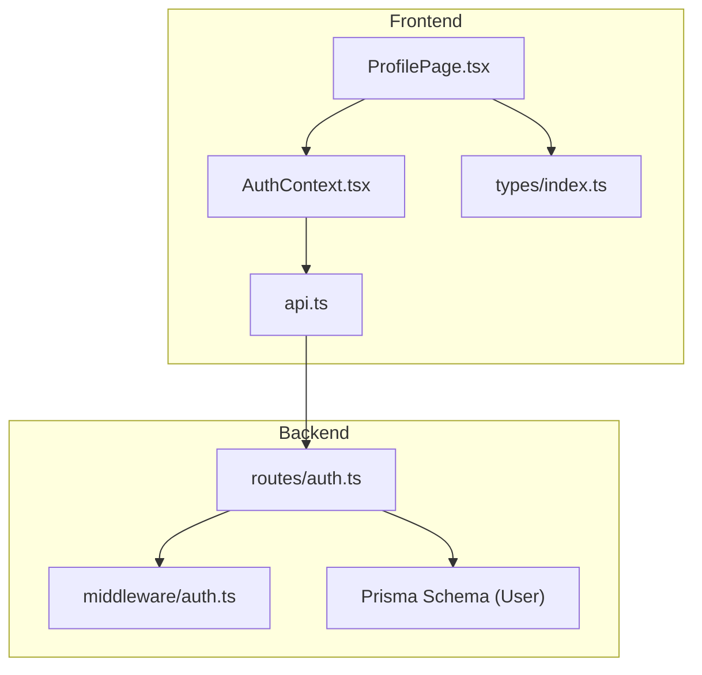
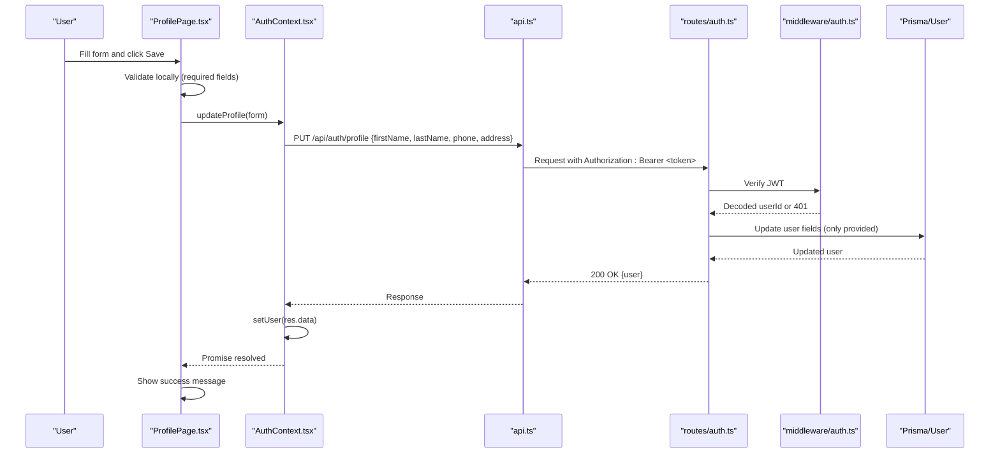
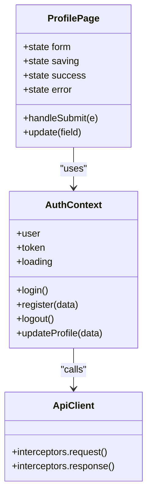
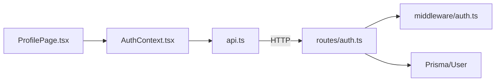

# Profile Page

<cite>
**Referenced Files in This Document**
- [ProfilePage.tsx](file://frontend/src/pages/ProfilePage.tsx)
- [AuthContext.tsx](file://frontend/src/context/AuthContext.tsx)
- [api.ts](file://frontend/src/services/api.ts)
- [index.ts (types)](file://frontend/src/types/index.ts)
- [auth.ts (routes)](file://backend/src/routes/auth.ts)
- [auth.ts (middleware)](file://backend/src/middleware/auth.ts)
- [schema.prisma](file://backend/prisma/schema.prisma)
</cite>

## Table of Contents
1. [Introduction](#introduction)
2. [Project Structure](#project-structure)
3. [Core Components](#core-components)
4. [Architecture Overview](#architecture-overview)
5. [Detailed Component Analysis](#detailed-component-analysis)
6. [Dependency Analysis](#dependency-analysis)
7. [Performance Considerations](#performance-considerations)
8. [Troubleshooting Guide](#troubleshooting-guide)
9. [Conclusion](#conclusion)

## Introduction
This document provides comprehensive documentation for the ProfilePage component that manages user account settings and profile editing within the Smart Vehicle Insurance Claim System. It explains how user information is displayed, how profile updates are handled via forms, how authentication context integrates with the profile workflow, and how errors and success feedback are presented to users. It also outlines validation rules enforced on both frontend and backend sides, and clarifies current limitations such as avatar upload support.

## Project Structure
The Profile feature spans frontend UI, state management, API client configuration, type definitions, and backend routes and middleware:
- Frontend UI: ProfilePage component renders the profile form and displays user info.
- State and Auth: AuthContext provides user data and updateProfile method.
- API Client: Axios instance adds auth headers and handles 401 redirects.
- Types: User interface defines profile fields.
- Backend: Auth routes expose endpoints for reading/updating profile; middleware validates JWT tokens; Prisma schema defines the User model.

**Diagram sources**
- [ProfilePage.tsx:1-88](file://frontend/src/pages/ProfilePage.tsx#L1-L88)
- [AuthContext.tsx:1-82](file://frontend/src/context/AuthContext.tsx#L1-L82)
- [api.ts:1-33](file://frontend/src/services/api.ts#L1-L33)
- [auth.ts (routes):1-166](file://backend/src/routes/auth.ts#L1-L166)
- [auth.ts (middleware):1-23](file://backend/src/middleware/auth.ts#L1-L23)
- [schema.prisma:10-24](file://backend/prisma/schema.prisma#L10-L24)

**Section sources**
- [ProfilePage.tsx:1-88](file://frontend/src/pages/ProfilePage.tsx#L1-L88)
- [AuthContext.tsx:1-82](file://frontend/src/context/AuthContext.tsx#L1-L82)
- [api.ts:1-33](file://frontend/src/services/api.ts#L1-L33)
- [index.ts (types):1-149](file://frontend/src/types/index.ts#L1-L149)
- [auth.ts (routes):1-166](file://backend/src/routes/auth.ts#L1-L166)
- [auth.ts (middleware):1-23](file://backend/src/middleware/auth.ts#L1-L23)
- [schema.prisma:10-24](file://backend/prisma/schema.prisma#L10-L24)

## Core Components
- ProfilePage: Renders a form for editing first name, last name, phone, and address; displays email read-only; shows success/error messages; disables submit while saving.
- AuthContext: Provides user object and updateProfile function; initializes session from stored token; persists token and user in localStorage; calls backend endpoints.
- API Client: Adds Authorization header using stored token; redirects to login on 401 responses.
- Backend Auth Routes: Expose GET /api/auth/profile and PUT /api/auth/profile protected by JWT middleware; update only provided fields.
- Prisma User Model: Defines profile fields including optional phone and address.

Key responsibilities:
- Form handling: Controlled inputs bound to local state; submit triggers updateProfile.
- Authentication integration: Uses useAuth hook to access user and updateProfile; relies on API interceptor for token injection.
- Feedback: Displays transient success banner; persistent error until next submission.

**Section sources**
- [ProfilePage.tsx:5-87](file://frontend/src/pages/ProfilePage.tsx#L5-L87)
- [AuthContext.tsx:17-66](file://frontend/src/context/AuthContext.tsx#L17-L66)
- [api.ts:10-30](file://frontend/src/services/api.ts#L10-L30)
- [auth.ts (routes):106-163](file://backend/src/routes/auth.ts#L106-L163)
- [schema.prisma:10-24](file://backend/prisma/schema.prisma#L10-L24)

## Architecture Overview
The profile update flow involves React state, context-driven API calls, and backend authorization and persistence.

**Diagram sources**
- [ProfilePage.tsx:17-28](file://frontend/src/pages/ProfilePage.tsx#L17-L28)
- [AuthContext.tsx:63-66](file://frontend/src/context/AuthContext.tsx#L63-L66)
- [api.ts:10-17](file://frontend/src/services/api.ts#L10-L17)
- [auth.ts (routes):134-163](file://backend/src/routes/auth.ts#L134-L163)
- [auth.ts (middleware):5-22](file://backend/src/middleware/auth.ts#L5-L22)
- [schema.prisma:10-24](file://backend/prisma/schema.prisma#L10-L24)

## Detailed Component Analysis

### ProfilePage Component
- Purpose: Allow authenticated users to edit their profile details and view basic account information.
- Data binding: Local state holds firstName, lastName, phone, address; initialized from user context.
- Submission: Prevents default form behavior, sets saving state, calls updateProfile, then shows success or error.
- Display: Shows initials avatar placeholder, full name, and email (read-only).
- Accessibility: Labels and placeholders guide input expectations.

Validation rules enforced here:
- Required fields: firstName and lastName are required before submission.
- Optional fields: phone and address are optional.
- Email is read-only and not editable from this page.

Error handling:
- On network or server error, displays an error message until next submission.
- Success message auto-dismisses after a short delay.

Avatar upload capabilities:
- Not implemented in this version. The avatar area displays initials based on first and last name.

Integration with authentication context:
- Uses useAuth to get user and updateProfile; relies on AuthContext to manage token and user state.

Example workflow:
- User edits first name and phone, clicks Save.
- ProfilePage calls updateProfile with updated fields.
- AuthContext sends PUT request with token.
- Backend updates user record and returns updated user.
- ProfilePage shows success message briefly.

**Section sources**
- [ProfilePage.tsx:5-87](file://frontend/src/pages/ProfilePage.tsx#L5-L87)

#### Class-like structure overview

**Diagram sources**
- [ProfilePage.tsx:1-88](file://frontend/src/pages/ProfilePage.tsx#L1-L88)
- [AuthContext.tsx:1-82](file://frontend/src/context/AuthContext.tsx#L1-L82)
- [api.ts:1-33](file://frontend/src/services/api.ts#L1-L33)

### AuthContext Integration
- Provides user state and methods for authentication and profile updates.
- Initializes session by fetching profile if token exists.
- updateProfile performs PUT to /api/auth/profile and updates local user state.

Error handling:
- If token is invalid or missing, API interceptor removes credentials and redirects to login.

**Section sources**
- [AuthContext.tsx:22-36](file://frontend/src/context/AuthContext.tsx#L22-L36)
- [AuthContext.tsx:63-66](file://frontend/src/context/AuthContext.tsx#L63-L66)
- [api.ts:19-30](file://frontend/src/services/api.ts#L19-L30)

### API Client Behavior
- Base URL set to /api.
- Adds Authorization header with Bearer token when present.
- Handles 401 by clearing storage and redirecting to login.

**Section sources**
- [api.ts:3-17](file://frontend/src/services/api.ts#L3-L17)
- [api.ts:19-30](file://frontend/src/services/api.ts#L19-L30)

### Backend Endpoints and Middleware
- GET /api/auth/profile: Returns current user’s profile data; requires valid JWT.
- PUT /api/auth/profile: Updates only provided fields; requires valid JWT.
- Middleware verifies JWT and attaches userId to request.

Validation rules enforced here:
- Registration enforces required fields and uniqueness of email.
- Login validates credentials.
- Profile update accepts partial updates; only specified fields are changed.

**Section sources**
- [auth.ts (routes):10-59](file://backend/src/routes/auth.ts#L10-L59)
- [auth.ts (routes):61-104](file://backend/src/routes/auth.ts#L61-L104)
- [auth.ts (routes):106-163](file://backend/src/routes/auth.ts#L106-L163)
- [auth.ts (middleware):5-22](file://backend/src/middleware/auth.ts#L5-L22)

### Data Models
- User model includes id, email, passwordHash, firstName, lastName, optional phone/address, timestamps.
- Frontend types mirror backend fields for profile editing.

**Section sources**
- [schema.prisma:10-24](file://backend/prisma/schema.prisma#L10-L24)
- [index.ts (types):1-9](file://frontend/src/types/index.ts#L1-L9)

## Dependency Analysis
- ProfilePage depends on AuthContext for user data and updateProfile.
- AuthContext depends on api client for HTTP requests.
- api client depends on localStorage for token persistence and interceptors for auth handling.
- Backend routes depend on middleware for JWT verification and Prisma for database operations.

**Diagram sources**
- [ProfilePage.tsx:1-88](file://frontend/src/pages/ProfilePage.tsx#L1-L88)
- [AuthContext.tsx:1-82](file://frontend/src/context/AuthContext.tsx#L1-L82)
- [api.ts:1-33](file://frontend/src/services/api.ts#L1-L33)
- [auth.ts (routes):1-166](file://backend/src/routes/auth.ts#L1-166)
- [auth.ts (middleware):1-23](file://backend/src/middleware/auth.ts#L1-L23)
- [schema.prisma:10-24](file://backend/prisma/schema.prisma#L10-L24)

**Section sources**
- [ProfilePage.tsx:1-88](file://frontend/src/pages/ProfilePage.tsx#L1-L88)
- [AuthContext.tsx:1-82](file://frontend/src/context/AuthContext.tsx#L1-L82)
- [api.ts:1-33](file://frontend/src/services/api.ts#L1-L33)
- [auth.ts (routes):1-166](file://backend/src/routes/auth.ts#L1-L166)
- [auth.ts (middleware):1-23](file://backend/src/middleware/auth.ts#L1-L23)
- [schema.prisma:10-24](file://backend/prisma/schema.prisma#L10-L24)

## Performance Considerations
- Minimal re-renders: ProfilePage uses local state for form fields and minimal global state changes via context.
- Network efficiency: Only provided fields are sent to backend, reducing payload size.
- Token caching: Token stored in localStorage avoids repeated logins; API interceptor ensures consistent auth headers.
- Error handling: Centralized 401 handling prevents unnecessary retries and improves UX.

[No sources needed since this section provides general guidance]

## Troubleshooting Guide
Common issues and resolutions:
- Invalid or expired token:
  - Symptom: Redirected to login unexpectedly; profile updates fail.
  - Cause: Missing or invalid Authorization header; backend returns 401.
  - Resolution: Ensure token exists in localStorage; re-authenticate if necessary.
- Failed to update profile:
  - Symptom: Error message shown; save button disabled during request.
  - Cause: Network error or server-side validation failure.
  - Resolution: Check browser console for error details; verify required fields are provided.
- Email field not editable:
  - Expected behavior: Email is read-only on the profile page.
  - Resolution: Use registration or admin tools to change email if needed.

**Section sources**
- [api.ts:19-30](file://frontend/src/services/api.ts#L19-L30)
- [auth.ts (middleware):5-22](file://backend/src/middleware/auth.ts#L5-L22)
- [ProfilePage.tsx:17-28](file://frontend/src/pages/ProfilePage.tsx#L17-L28)

## Conclusion
The ProfilePage component provides a straightforward and secure way for users to manage their profile information. It integrates tightly with the authentication context to ensure only authenticated users can update their profiles, and it leverages backend validation to maintain data integrity. While avatar upload is not currently supported, the design allows for future enhancements. Users receive clear feedback on successful updates and errors, ensuring a smooth experience.

[No sources needed since this section summarizes without analyzing specific files]