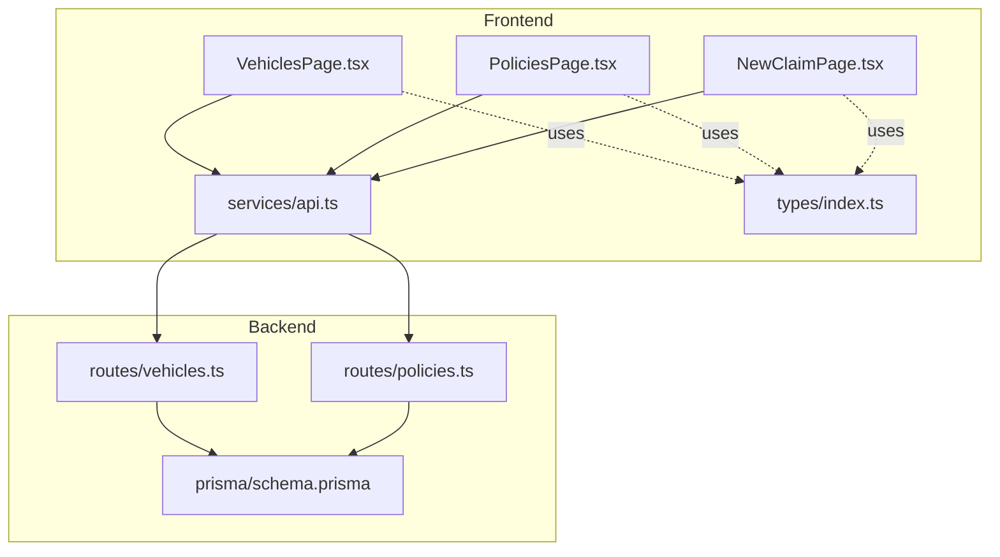
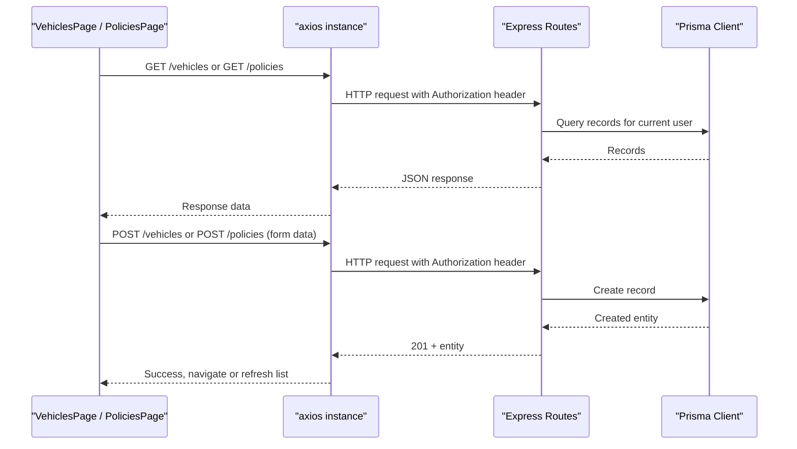
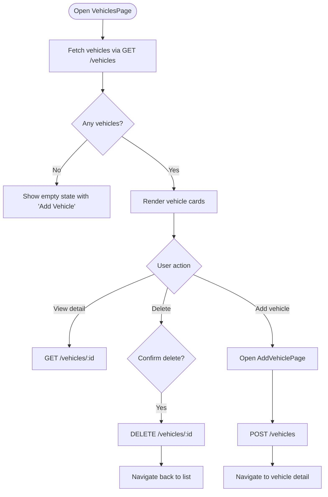
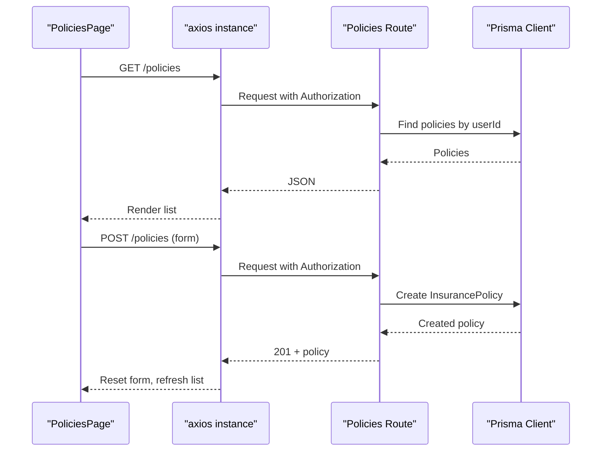
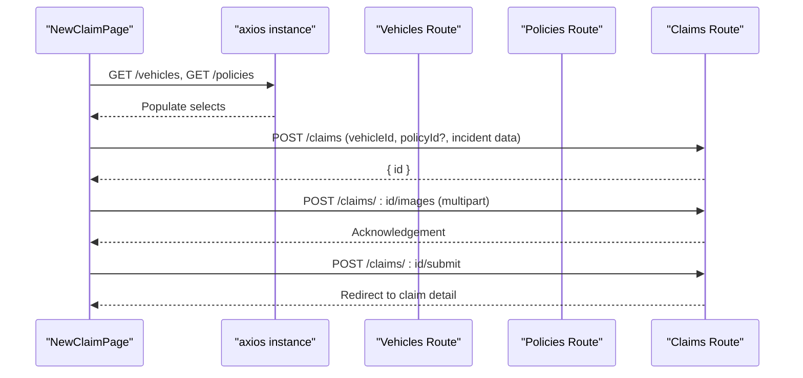
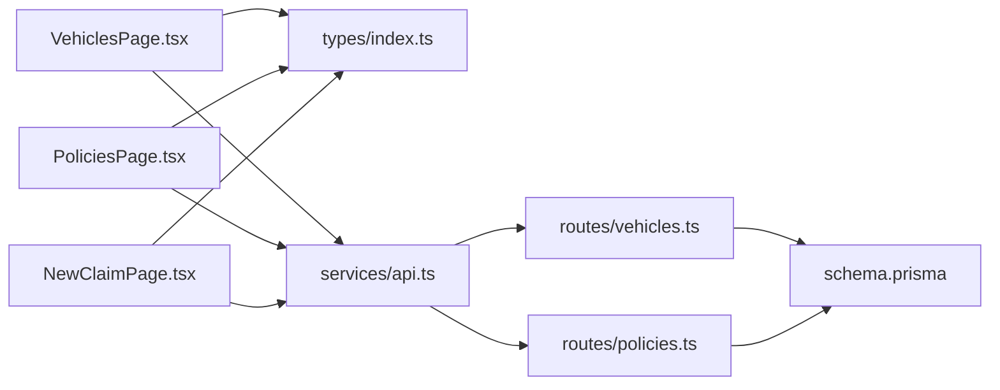

# Vehicle and Policy Pages

<cite>
**Referenced Files in This Document**
- [VehiclesPage.tsx](file://frontend/src/pages/VehiclesPage.tsx)
- [PoliciesPage.tsx](file://frontend/src/pages/PoliciesPage.tsx)
- [NewClaimPage.tsx](file://frontend/src/pages/NewClaimPage.tsx)
- [api.ts](file://frontend/src/services/api.ts)
- [index.ts (types)](file://frontend/src/types/index.ts)
- [vehicles.ts (routes)](file://backend/src/routes/vehicles.ts)
- [policies.ts (routes)](file://backend/src/routes/policies.ts)
- [schema.prisma](file://backend/prisma/schema.prisma)
</cite>

## Table of Contents
1. Introduction
2. Project Structure
3. Core Components
4. Architecture Overview
5. Detailed Component Analysis
6. Dependency Analysis
7. Performance Considerations
8. Troubleshooting Guide
9. Conclusion

## Introduction
This document explains the vehicle and policy management pages that enable users to manage their vehicles and insurance policies, and how these entities integrate into claim creation workflows. It covers:
- VehiclesPage for listing, viewing details, adding, and deleting vehicles
- PoliciesPage for creating, listing, and deleting insurance policies
- Form handling patterns, data validation, and API integration
- The relationship between vehicles and policies as used when filing claims

## Project Structure
The feature spans frontend pages, shared services, types, and backend routes with a Prisma schema defining the data model.

**Diagram sources**
- [VehiclesPage.tsx:1-169](file://frontend/src/pages/VehiclesPage.tsx#L1-L169)
- [PoliciesPage.tsx:1-102](file://frontend/src/pages/PoliciesPage.tsx#L1-L102)
- [NewClaimPage.tsx:1-252](file://frontend/src/pages/NewClaimPage.tsx#L1-L252)
- [api.ts:1-33](file://frontend/src/services/api.ts#L1-L33)
- [index.ts (types):1-149](file://frontend/src/types/index.ts#L1-L149)
- [vehicles.ts (routes):1-148](file://backend/src/routes/vehicles.ts#L1-L148)
- [policies.ts (routes):1-131](file://backend/src/routes/policies.ts#L1-L131)
- [schema.prisma:1-201](file://backend/prisma/schema.prisma#L1-L201)

**Section sources**
- [VehiclesPage.tsx:1-169](file://frontend/src/pages/VehiclesPage.tsx#L1-L169)
- [PoliciesPage.tsx:1-102](file://frontend/src/pages/PoliciesPage.tsx#L1-L102)
- [api.ts:1-33](file://frontend/src/services/api.ts#L1-L33)
- [index.ts (types):1-149](file://frontend/src/types/index.ts#L1-L149)
- [vehicles.ts (routes):1-148](file://backend/src/routes/vehicles.ts#L1-L148)
- [policies.ts (routes):1-131](file://backend/src/routes/policies.ts#L1-L131)
- [schema.prisma:1-201](file://backend/prisma/schema.prisma#L1-L201)

## Core Components
- VehiclesPage: Lists user’s vehicles, navigates to detail view, supports adding new vehicles via a dedicated form, and deletes vehicles from the detail view.
- PoliciesPage: Lists user’s policies, toggles an inline form to add new policies, and deletes existing policies.
- NewClaimPage: Integrates vehicles and policies by letting users select a vehicle and optionally link a policy when filing a claim; includes multi-step photo uploads.

Key responsibilities:
- Data fetching and rendering for vehicles and policies
- Form state management and submission
- Error handling and user feedback
- Navigation and routing interactions

**Section sources**
- [VehiclesPage.tsx:7-169](file://frontend/src/pages/VehiclesPage.tsx#L7-L169)
- [PoliciesPage.tsx:6-102](file://frontend/src/pages/PoliciesPage.tsx#L6-L102)
- [NewClaimPage.tsx:10-252](file://frontend/src/pages/NewClaimPage.tsx#L10-L252)

## Architecture Overview
The frontend pages call a centralized axios instance that injects authentication tokens and handles 401 redirects. Backend routes enforce authentication and persist data using Prisma against a SQLite database.

**Diagram sources**
- [api.ts:10-30](file://frontend/src/services/api.ts#L10-L30)
- [vehicles.ts (routes):14-42](file://backend/src/routes/vehicles.ts#L14-L42)
- [policies.ts (routes):13-40](file://backend/src/routes/policies.ts#L13-L40)
- [schema.prisma:26-59](file://backend/prisma/schema.prisma#L26-L59)

## Detailed Component Analysis

### VehiclesPage
Responsibilities:
- Fetch and display the authenticated user’s vehicles
- Navigate to vehicle detail and “Add Vehicle” form
- Delete a vehicle from its detail view

Data model usage:
- Uses the Vehicle type which includes fields such as make, model, year, licensePlate, color, mileage, photos, and optional VIN.

Form handling:
- AddVehiclePage manages local form state for required fields (make, model, year, licensePlate, color) and optional fields (vin, mileage).
- Submits via POST to create a vehicle and navigates to the newly created vehicle detail.

Validation:
- Frontend HTML attributes enforce required inputs and numeric ranges.
- Backend validates required fields and returns 400 on missing data.

API integration:
- GET /vehicles lists vehicles with claim counts.
- GET /vehicles/:id retrieves a specific vehicle including related claims.
- DELETE /vehicles/:id removes a vehicle after confirmation.

Notes on search and photo upload:
- No client-side search is implemented in this page; filtering would require additional logic.
- Photo upload is not handled here; the Vehicle type includes a photos array, but the current flow does not include uploading images from this page.

**Diagram sources**
- [VehiclesPage.tsx:11-13](file://frontend/src/pages/VehiclesPage.tsx#L11-L13)
- [VehiclesPage.tsx:62-72](file://frontend/src/pages/VehiclesPage.tsx#L62-L72)
- [VehiclesPage.tsx:123-169](file://frontend/src/pages/VehiclesPage.tsx#L123-L169)
- [vehicles.ts (routes):14-42](file://backend/src/routes/vehicles.ts#L14-L42)
- [vehicles.ts (routes):44-60](file://backend/src/routes/vehicles.ts#L44-L60)
- [vehicles.ts (routes):62-90](file://backend/src/routes/vehicles.ts#L62-L90)
- [vehicles.ts (routes):127-145](file://backend/src/routes/vehicles.ts#L127-L145)

**Section sources**
- [VehiclesPage.tsx:7-169](file://frontend/src/pages/VehiclesPage.tsx#L7-L169)
- [vehicles.ts (routes):14-145](file://backend/src/routes/vehicles.ts#L14-L145)
- [index.ts (types):11-25](file://frontend/src/types/index.ts#L11-L25)

### PoliciesPage
Responsibilities:
- Fetch and display the authenticated user’s insurance policies
- Toggle an inline form to add a new policy
- Delete a policy with confirmation

Form handling:
- Local form state captures providerName, policyNumber, coverageType, deductible, premiumAmount, startDate, endDate.
- On submit, POST to create a policy, reset form, and refresh the list.

Validation:
- Required fields enforced via HTML attributes.
- Backend validates all required fields and returns 400 if any are missing.

API integration:
- GET /policies lists policies for the current user.
- POST /policies creates a new policy.
- DELETE /policies/:id removes a policy.

**Diagram sources**
- [PoliciesPage.tsx:13-31](file://frontend/src/pages/PoliciesPage.tsx#L13-L31)
- [policies.ts (routes):13-40](file://backend/src/routes/policies.ts#L13-L40)
- [policies.ts (routes):42-55](file://backend/src/routes/policies.ts#L42-L55)
- [policies.ts (routes):110-128](file://backend/src/routes/policies.ts#L110-L128)

**Section sources**
- [PoliciesPage.tsx:6-102](file://frontend/src/pages/PoliciesPage.tsx#L6-L102)
- [policies.ts (routes):13-128](file://backend/src/routes/policies.ts#L13-L128)
- [index.ts (types):27-37](file://frontend/src/types/index.ts#L27-L37)

### Relationship Between Vehicles and Policies in Claim Creation
When filing a claim, users select a vehicle and optionally link a policy. The claim creation workflow demonstrates how vehicles and policies relate in the UI and data model.

**Diagram sources**
- [NewClaimPage.tsx:31-36](file://frontend/src/pages/NewClaimPage.tsx#L31-L36)
- [NewClaimPage.tsx:72-94](file://frontend/src/pages/NewClaimPage.tsx#L72-L94)
- [schema.prisma:70-93](file://backend/prisma/schema.prisma#L70-L93)

**Section sources**
- [NewClaimPage.tsx:10-252](file://frontend/src/pages/NewClaimPage.tsx#L10-L252)
- [schema.prisma:70-93](file://backend/prisma/schema.prisma#L70-L93)

## Dependency Analysis
- Frontend pages depend on:
  - api.ts for HTTP requests and auth token injection
  - types/index.ts for TypeScript interfaces
- Backend routes depend on:
  - Prisma client for data access
  - Authentication middleware to restrict endpoints to logged-in users
- Data model relationships:
  - User has many Vehicles and Policies
  - Claim references Vehicle and optionally Policy

**Diagram sources**
- [VehiclesPage.tsx:1-5](file://frontend/src/pages/VehiclesPage.tsx#L1-L5)
- [PoliciesPage.tsx:1-4](file://frontend/src/pages/PoliciesPage.tsx#L1-L4)
- [NewClaimPage.tsx:1-6](file://frontend/src/pages/NewClaimPage.tsx#L1-L6)
- [api.ts:1-33](file://frontend/src/services/api.ts#L1-L33)
- [vehicles.ts (routes):1-5](file://backend/src/routes/vehicles.ts#L1-L5)
- [policies.ts (routes):1-5](file://backend/src/routes/policies.ts#L1-L5)
- [schema.prisma:10-59](file://backend/prisma/schema.prisma#L10-L59)

**Section sources**
- [api.ts:10-30](file://frontend/src/services/api.ts#L10-L30)
- [schema.prisma:10-59](file://backend/prisma/schema.prisma#L10-L59)

## Performance Considerations
- Minimize re-renders by keeping list state minimal and avoiding unnecessary refetches.
- Use optimistic updates sparingly; current implementation relies on simple refetch after mutations.
- For large datasets, consider pagination on vehicle and policy lists.
- Debounce any future search input to reduce network calls.
- Ensure image uploads use appropriate compression and size limits to avoid slow submissions.

[No sources needed since this section provides general guidance]

## Troubleshooting Guide
Common issues and resolutions:
- 401 Unauthorized:
  - The axios interceptor clears tokens and redirects to login on 401 responses. Re-authenticate to restore access.
- Validation errors:
  - Backend returns 400 with error messages when required fields are missing. Display these messages in the UI forms.
- Not found:
  - Deleting or viewing non-existent resources returns 404. Handle gracefully by navigating back or showing a friendly message.
- Network failures:
  - Wrap API calls with try/catch and show user-friendly alerts or banners.

**Section sources**
- [api.ts:20-30](file://frontend/src/services/api.ts#L20-L30)
- [vehicles.ts (routes):18-21](file://backend/src/routes/vehicles.ts#L18-L21)
- [policies.ts (routes):17-20](file://backend/src/routes/policies.ts#L17-L20)
- [vehicles.ts (routes):80-83](file://backend/src/routes/vehicles.ts#L80-L83)
- [policies.ts (routes):64-67](file://backend/src/routes/policies.ts#L64-L67)

## Conclusion
The VehiclesPage and PoliciesPage provide essential CRUD capabilities for managing vehicles and insurance policies, with clear separation of concerns and consistent API integration. The NewClaimPage demonstrates how vehicles and policies relate during claim creation, enabling users to link coverage to incidents. Future enhancements can include vehicle search, VIN validation, and photo uploads directly within vehicle management flows.

[No sources needed since this section summarizes without analyzing specific files]