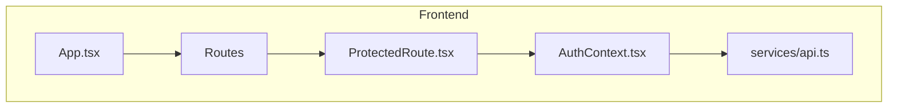
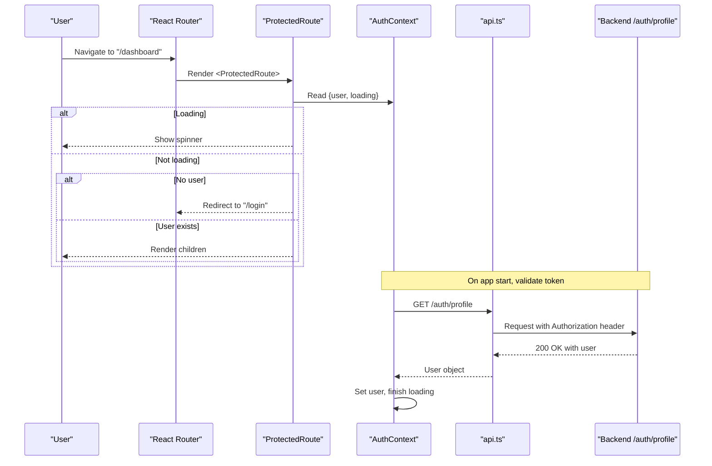
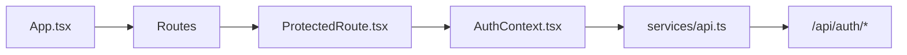

# Protected Route Components

<cite>
**Referenced Files in This Document**
- [ProtectedRoute.tsx](file://frontend/src/components/ProtectedRoute.tsx)
- [AuthContext.tsx](file://frontend/src/context/AuthContext.tsx)
- [App.tsx](file://frontend/src/App.tsx)
- [api.ts](file://frontend/src/services/api.ts)
- [index.ts](file://frontend/src/types/index.ts)
</cite>

## Table of Contents
1. [Introduction](#introduction)
2. [Project Structure](#project-structure)
3. [Core Components](#core-components)
4. [Architecture Overview](#architecture-overview)
5. [Detailed Component Analysis](#detailed-component-analysis)
6. [Dependency Analysis](#dependency-analysis)
7. [Performance Considerations](#performance-considerations)
8. [Troubleshooting Guide](#troubleshooting-guide)
9. [Conclusion](#conclusion)
10. [Appendices](#appendices)

## Introduction
This document explains how the ProtectedRoute component implements authentication guards in the React application. It covers how protected routes are wrapped to ensure only authenticated users can access specific pages, the authentication check logic, redirect behavior for unauthenticated users, integration with AuthContext, props interface, render prop pattern usage, and handling of loading states during authentication verification. It also includes examples of protecting different route types, customizing redirect behavior, handling edge cases such as token expiration, and security considerations and best practices for route-level authentication.

## Project Structure
The authentication and routing implementation spans a few key files:
- A context that manages user state, token persistence, and API interactions
- An HTTP client that attaches tokens to requests and handles 401 responses
- A router configuration that wraps protected routes with a guard component
- The guard component itself that enforces authentication before rendering children

**Diagram sources**
- [App.tsx:15-33](file://frontend/src/App.tsx#L15-L33)
- [ProtectedRoute.tsx:4-19](file://frontend/src/components/ProtectedRoute.tsx#L4-L19)
- [AuthContext.tsx:17-73](file://frontend/src/context/AuthContext.tsx#L17-L73)
- [api.ts:1-33](file://frontend/src/services/api.ts#L1-L33)

**Section sources**
- [App.tsx:15-33](file://frontend/src/App.tsx#L15-L33)
- [ProtectedRoute.tsx:4-19](file://frontend/src/components/ProtectedRoute.tsx#L4-L19)
- [AuthContext.tsx:17-73](file://frontend/src/context/AuthContext.tsx#L17-L73)
- [api.ts:1-33](file://frontend/src/services/api.ts#L1-L33)

## Core Components
- ProtectedRoute: A route guard that renders its children only when the user is authenticated; otherwise redirects to login. It shows a loading indicator while authentication state is being resolved.
- AuthContext: Provides user, token, and loading state, along with login, register, logout, and profile update functions. It initializes auth state on mount by validating a stored token against the backend.
- API Client: Axios instance that automatically adds Authorization headers using a stored token and redirects to login on 401 responses.

Key responsibilities:
- ProtectedRoute checks user presence and loading state from AuthContext and decides whether to render children or redirect.
- AuthContext persists token and user data, validates token on startup, and exposes actions to change auth state.
- API client ensures all outgoing requests include the token and handles unauthorized errors centrally.

**Section sources**
- [ProtectedRoute.tsx:4-19](file://frontend/src/components/ProtectedRoute.tsx#L4-L19)
- [AuthContext.tsx:17-73](file://frontend/src/context/AuthContext.tsx#L17-L73)
- [api.ts:10-30](file://frontend/src/services/api.ts#L10-L30)

## Architecture Overview
The authentication flow integrates three layers:
- UI layer (routes and components) uses ProtectedRoute to gate access
- State layer (AuthContext) holds user/token and performs initialization
- Network layer (API client) attaches tokens and handles 401s

**Diagram sources**
- [ProtectedRoute.tsx:4-19](file://frontend/src/components/ProtectedRoute.tsx#L4-L19)
- [AuthContext.tsx:22-36](file://frontend/src/context/AuthContext.tsx#L22-L36)
- [api.ts:10-17](file://frontend/src/services/api.ts#L10-L17)
- [App.tsx:23-31](file://frontend/src/App.tsx#L23-L31)

## Detailed Component Analysis

### ProtectedRoute Component
Purpose:
- Enforce authentication at the route level
- Provide immediate feedback during authentication verification via a loading state
- Redirect unauthenticated users to the login page

Props interface:
- children: React.ReactNode — Any content to be rendered if the user is authenticated

Behavior:
- Reads user and loading from AuthContext
- If loading is true, renders a full-screen spinner
- If no user is present, navigates to /login using react-router-dom’s Navigate
- Otherwise, renders children

Render prop pattern:
- Uses the standard React children pattern rather than a dedicated render prop function. This keeps usage simple: wrap any route content with <ProtectedRoute>.

Redirect behavior:
- Redirects to /login when not authenticated. To customize redirection (e.g., preserve intended destination), extend the component to accept a redirectTo prop and pass it to Navigate.

Loading states:
- Displays a centered spinner while AuthContext finishes initializing and verifying the token.

Security considerations:
- Relies on client-side checks; always enforce server-side authorization for sensitive endpoints.
- Ensure token validation occurs on app startup to avoid showing protected content briefly before redirect.

Example usage patterns:
- Protecting a single page:
  - Wrap the page component inside ProtectedRoute within the route definition
- Protecting nested layouts:
  - Wrap a Layout component with ProtectedRoute so all child routes inherit protection
- Protecting dynamic routes:
  - Use the same pattern for parameterized routes

Edge cases:
- Token expiration: Handled by the API client interceptor which clears local storage and redirects to login on 401 responses
- Initial load without token: AuthContext sets loading to false after attempting to fetch profile; if invalid, user remains null and ProtectedRoute redirects

**Section sources**
- [ProtectedRoute.tsx:4-19](file://frontend/src/components/ProtectedRoute.tsx#L4-L19)
- [App.tsx:23-31](file://frontend/src/App.tsx#L23-L31)
- [api.ts:19-30](file://frontend/src/services/api.ts#L19-L30)

### AuthContext Integration
Responsibilities:
- Maintain user, token, and loading state
- Initialize auth state by validating stored token on mount
- Provide login, register, logout, and profile update functions

Initialization flow:
- On mount, if a token exists in localStorage, call /auth/profile to verify it
- On success, set user; on failure, clear token and user
- Set loading to false once initialization completes

Token persistence:
- Stores token and user in localStorage on login/register
- Clears both on logout

Error handling:
- Invalid token results in clearing persisted credentials and leaving user as null, causing ProtectedRoute to redirect

**Section sources**
- [AuthContext.tsx:17-73](file://frontend/src/context/AuthContext.tsx#L17-L73)
- [index.ts:145-148](file://frontend/src/types/index.ts#L145-L148)

### API Client Interceptors
Request interceptor:
- Attaches Authorization header with Bearer token from localStorage for every request

Response interceptor:
- On 401 Unauthorized, removes token and user from localStorage and redirects to /login

This ensures consistent session management across the app and prevents protected features from being accessed with expired tokens.

**Section sources**
- [api.ts:10-30](file://frontend/src/services/api.ts#L10-L30)

## Dependency Analysis
Component relationships and data flow:

Coupling and cohesion:
- ProtectedRoute depends only on AuthContext for state and react-router-dom for navigation
- AuthContext encapsulates all auth-related state and side effects, keeping components decoupled
- API client centralizes token injection and error handling, reducing duplication

Potential circular dependencies:
- None observed between these modules; imports are one-directional

External dependencies:
- react-router-dom for routing and navigation
- axios for HTTP requests
- LocalStorage for token persistence

**Diagram sources**
- [App.tsx:15-33](file://frontend/src/App.tsx#L15-L33)
- [ProtectedRoute.tsx:4-19](file://frontend/src/components/ProtectedRoute.tsx#L4-L19)
- [AuthContext.tsx:17-73](file://frontend/src/context/AuthContext.tsx#L17-L73)
- [api.ts:1-33](file://frontend/src/services/api.ts#L1-L33)

**Section sources**
- [App.tsx:15-33](file://frontend/src/App.tsx#L15-L33)
- [ProtectedRoute.tsx:4-19](file://frontend/src/components/ProtectedRoute.tsx#L4-L19)
- [AuthContext.tsx:17-73](file://frontend/src/context/AuthContext.tsx#L17-L73)
- [api.ts:1-33](file://frontend/src/services/api.ts#L1-L33)

## Performance Considerations
- Minimize re-renders: ProtectedRoute reads from context and conditionally renders; keep children stable to avoid unnecessary updates
- Avoid heavy work in ProtectedRoute: Keep it lightweight; move complex logic to AuthContext or services
- Debounce or cache profile fetch: AuthContext fetches profile once on startup; consider caching strategies if multiple contexts exist
- Prefer layout-based protection: Wrap shared layouts with ProtectedRoute to reduce repetition and improve maintainability

[No sources needed since this section provides general guidance]

## Troubleshooting Guide
Common issues and resolutions:
- Infinite redirect loop:
  - Cause: Missing or invalid token leads to redirect to login, but login does not set token correctly
  - Resolution: Verify login flow sets token and user; ensure API client interceptor does not clear token prematurely
- Blank screen during initial load:
  - Cause: Loading state not handled properly
  - Resolution: Confirm ProtectedRoute shows a spinner while AuthContext.loading is true
- 401 redirects unexpectedly:
  - Cause: Expired or missing token triggers response interceptor
  - Resolution: Ensure token refresh strategy or re-login flow is in place; verify backend token validity
- Protected content flashes before redirect:
  - Cause: AuthContext not finished initializing
  - Resolution: Ensure loading state is true until profile fetch completes; do not render protected content until user is set

**Section sources**
- [ProtectedRoute.tsx:7-17](file://frontend/src/components/ProtectedRoute.tsx#L7-L17)
- [AuthContext.tsx:22-36](file://frontend/src/context/AuthContext.tsx#L22-L36)
- [api.ts:19-30](file://frontend/src/services/api.ts#L19-L30)

## Conclusion
ProtectedRoute provides a simple, effective mechanism to enforce authentication at the route level by leveraging AuthContext and react-router-dom. Combined with an API client that injects tokens and handles 401 errors, it creates a cohesive authentication experience. For robust security, always pair client-side guards with server-side authorization checks on every protected endpoint. Extend ProtectedRoute as needed to support custom redirects, role-based access, and enhanced loading indicators.

[No sources needed since this section summarizes without analyzing specific files]

## Appendices

### Example Usage Patterns
- Protecting a single page:
  - Wrap the page component with ProtectedRoute in the route definition
- Protecting a layout with multiple child routes:
  - Wrap a Layout component with ProtectedRoute so all nested routes inherit protection
- Dynamic routes:
  - Apply the same wrapping to parameterized routes

[No sources needed since this section provides conceptual guidance]

### Security Best Practices
- Always validate tokens server-side for every protected endpoint
- Implement token refresh flows to handle expiration gracefully
- Avoid storing sensitive data in localStorage beyond what is necessary
- Use HTTPS and secure cookies where applicable
- Validate roles and permissions on the server based on claims in the token

[No sources needed since this section provides general guidance]